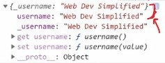

# Object Getters & Setters

- using `getters & setters on object` is much more useful than generators ✔️✔️✔️

- previously we talked about `generators` & then before generators , we talked about `symbols`
    - & these are bit complex & not that useful in most scenarios , except few usecases or scenarios ✔️✔️✔️

- here we'll talk about `getters & setters on objects` which is little bit easier to use & much more useful 💡💡💡

## why we need to use getters & setters ✅

- Eg : why we need getters & setters
    ```js
    const person = {
        firstName : "Steve" ,
        lastName : "Jobs" ,
        fullName() {
            return this.firstName + " " + this.lastName
        }
    }

    console.log(person.fullName())
    // output : Steve Jobs
    ```
    - here we got the output but here we called `fullName` as a function
    - what if we want to use that `fullName` function as a property of a object 💡💡💡
        - means a property that runs a function
        - so here getters & setters comes to do that 

## getters & setters

- `get` is a keyword for getters means to get/bring something 💡💡💡
- `set` is a keyword for setters means to set/update something 💡💡💡 

- `get` & `set` keywords are used with function only if we want to use that function (of an object) as a property 
    - instead of calling that function by using parentheses 💡💡💡

- Eg 1 : of `get keyword`
    ```js
    const person = {
        firstName : "Steve" ,
        lastName : "Jobs" ,
        get fullName() {
            return `${this.firstName} ${this.lastName}`        
        }
    }
    ```
    - `Note of using → get keyword ✅` 
        - we use the `get` keyword with function only 
        - `get` keyword is used on that function inside an object 
            - so that we can use that function as a property instead of calling it as a function 💡💡💡
        - we define `get` keyword before that function name 
        - if we're using getter then we don't define `function` keyword
        - if we use `get` keyword with the function (inside of an object) then nothing will come inside parentheses of that getter function <br> 
            because a getter never takes any parameters , so always the getter function will have no parameters to make getters 

    ```js
    const person = {
        firstName : "Steve" ,
        lastName : "Jobs" ,
        get fullName() {
            return `${this.firstName} ${this.lastName}`        
        }
    }

    console.log(person.fullName)
    ```
    - now we can use that function as a property due to `get` keyword
        - but behind the scene that `fullName` will be called as a function 💡💡💡

- Eg 2 : `usecase of making that function as a getter function`
    ```js
    const person = {
        name : "Steve" ,
        age : 12 ,

        get getName() {
            return this.name.toUpperCase()
        }
    }

    console.log(person.getName) // calling that getter function as a property
    // output : STEVE
    ```
    - `get` keyword used to make that function (which is inside an object) as a getter function
        - so that we can use that function as a property instead of calling it 
    - `get` keyword is used when we want to send the data after manipulating/changing/updating/adding something into that data
        - means we original data is different & if somebody wants that data then we can send that data <br>
            after updating/changing/adding something into it 💡💡💡

- about `set` keyword :
    - `set` keyword is used to set or update that thing into something else 💡💡💡
    - setter is similar as getter 
    - setter function always take only one parameter 💡💡💡

- Eg 1 : of `set keyword`

    - let's say we want to update the name always in upper case
    ```js
    const person = {
        name : "Teen" ,
        age : 12 ,

        set setName() {
            this.name = n.toUpperCase() 
        }
    }

    person.setName = "Steve"
    console.log(person)
    // output :  {name : "STEVE" , age : 12}
    ```
    - so here we updated the value of name always in uppercase

- we use `get` keyword , when we want to get/send that data after changing/updating/adding something inside that data
    - change means deleting or adding , etc inside that data
    - & bringing/sending that data outside from that object 💡💡💡

- `set` keyword use when want to save or overwrite or update a old value to new value with updating/changing inside that value 💡💡💡 
    - Eg : let's say a person commented on that video & now we want to remove all the abuse words <br>
        so we can use setter function to set or overwrite or update that comment or value 💡💡💡

- Eg : `common way that → set keyword` ✅
    - so common way that `set` keyword is used to do certain checks before we updating changing a value of that property 💡💡💡

    ```js
    const person = {
        _username : "Web Dev Simplified" , 
        
        get username() {
            return this._username
        } ,
        
        set username(value) {
            if (value.length > 5) {
                this._username = value
            }
        }
    }
    ```
    - `reason why we used underscore before that key name ✅` 
        - a lot of times we may see properties name which starts with an underscore like this `_username`
            - reason of doing this , using underscore before that key name is to tell people like that is a private property
            - means don't mess with that property & it's only used internally inside that thing 
            - & we're using underscore , because there is no way to make private properties in js
            - so by using underscore , we're telling people i.e a private information <br>
                so don't try to access that or set it directly 💡💡💡

    - so here if the length of that value is greater than 5 then we'll update the value otherwise not <br>
        means we're making sure that username should be long or greater than 5 ✔️
    ```js
    const person = {
        _username : "Web Dev Simplified" , 
        
        get username() {
            return this._username
        } ,
        
        set username(value) {
            if (value.length > 5) {
                this._username = value
            }
        }
    }

    console.log(person)
    ```
    - output : <br>
    

    - so here we have two username which is with underscore & actual username is without underscore <br>
        so when we use dot operator then those two username will come but that `_username` telling don't use this <br>
        use that username property which is without underscore

    - accessing the username (which is without underscore)
        ```js
        const person = {
            _username : "Web Dev Simplified" , 
            
            get username() {
                return this._username
            } ,
            
            set username(value) {
                if (value.length > 5) {
                    this._username = value
                }
            }
        }

        console.log(person.username) // output : Web Dev Simplified
        ```

    - updating the value of username
        ```js
        const person = {
            _username : "Web Dev Simplified" , 
            
            get username() {
                return this._username
            } ,
            
            set username(value) {
                if (value.length > 5) {
                    this._username = value
                }
            }
        }

        person.username = "Johnny"

        console.log(person.username) // output : Johnny
        ```
    
    - but if we give `John` (which is less than our minimum requirement/condition) like this
        ```js
        const person = {
            _username : "Web Dev Simplified" , 
            
            get username() {
                return this._username
            } ,
            
            set username(value) {
                if (value.length > 5) {
                    this._username = value
                }
            }
        }

        person.username = "John"

        console.log(person.username) // output : Web Dev Simplified
        ```

    - so using this kindof pattern we can create which is considered like a hidden or private variable
        - but even though that key is accessible by everyone
        - & we can actually create that key kindof as hidden variable 
        - & if we want to setup further then we can use symbol in place of underscore
        - & then we use getter & setter for a specific checks ✔️

- Eg : `what if we don't define a setter function & even we don't have that property inside the object` ✅
    ```js
    const person = {
        firstName : "Steve" , 
        lastName : "Jobs" , 

        get fullName() {
            return `${this.firstName} ${this.lastName}`
        }
    }

    person.fullName = "Teen Titans"
    console.log(person)
    // output : {firstName : "Steve" , lastName : "Jobs" }
    ```

## Challenge Time

- Ques : 
    ```js
    const person = {
        age : 12
    }
    ```
    - `what we need to do`
        - create a getter which is going to return the year that this person was born

- Ans : 
    ```js
    const person = {
      age: 12,

      get birthYear() {
        const date = new Date();
        return date.getFullYear() - this.age;
      }
    };

    console.log(person.birthYear);
    // output : 2010
    ```

## Mine conclusion

- normal object properties & it's methods are different than getters & setters of object

## -------- Extra notes on getters & setters of object --------

- videos
    - https://www.youtube.com/watch?v=_tsG9ahYBvk&ab_channel=TechGun 👍
- blogs
    - https://developer.mozilla.org/en-US/docs/Web/JavaScript/Reference/Functions/get
    - https://developer.mozilla.org/en-US/docs/Web/JavaScript/Reference/Functions/set
    - https://www.w3schools.com/js/js_object_accessors.asp
    - https://javascript.info/property-accessors

## discussion page


