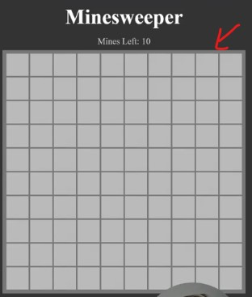

# minesweeper project

- we'll building this game by using all of the different knowledge that we've learned till this point

- `Tip` : try to build this by yourself & then compare the your code with other's code 

## Code Before the project

<details>
  <summary>index.html</summary>

```html
<!DOCTYPE html>
<html lang="en">
<head>
  <meta charset="UTF-8">
  <meta name="viewport" content="width=device-width, initial-scale=1.0">
  <link rel="stylesheet" href="styles.css">
  <title>Minesweeper</title>
</head>
<body>
  <h3 class="title">Minesweeper</h3>
  <div class="subtext">
    Mines Left: 10
  </div>
  <div class="board"></div>
</body>
</html>
```
</details>

<details>
  <summary>styles.css</summary>

```css
* {
  box-sizing: border-box;
}

body {
  margin: 0;
  background-color: #333;
  display: flex;
  align-items: center;
  font-size: 3rem;
  flex-direction: column;
  color: white;
}

.title {
  margin: 20px;
}

.subtext {
  color: #CCC;
  font-size: 1.5rem;
  margin-bottom: 10px;
}

.board {
  display: inline-grid;
  padding: 10px;
  grid-template-columns: repeat(var(--size), 60px);
  grid-template-rows: repeat(var(--size), 60px);
  gap: 4px;
  background-color: #777;
}

.board > * {
  width: 100%;
  height: 100%;
  display: flex;
  justify-content: center;
  align-items: center;
  color: white;
  border: 2px solid #BBB;
  user-select: none;
}

.board > [data-status="hidden"] {
  background-color: #BBB;
  cursor: pointer;
}

.board > [data-status="mine"] {
  background-color: red;
}

.board > [data-status="number"] {
  background-color: none;
}

.board > [data-status="marked"] {
  background-color: yellow;
}
```
</details>

## about code before the project

- inside style.css
  - at the bottom we have 4 types of data status i.e hidden , mine , number , marked
  - & these statuses that we need to apply to the different grid tiles in order to give specific styles

  - `marked tiles` : (if we right click on any tile) then that tiles gets marked as yellow like this

    

  - `mine tiles` : if we click on any title then we'll get this kindof output

    

  - if refresh the page then we'll get refresh game

  - `number tiles` : when we left click on any tile then one or more tiles will have number on them

    

  - that's it in styles.css file

- rules of minesweeper game
  - `first` : whenever we make a tile by using right click then on above `Mines Left` status will come
      - & if we do on & on more than 10 then the number goes to negative like this 

      

      - to mark a tile then right click on that tile ✔️
      - & to open or reveal a tile then left click on it ✔️

  - `second` : if we left click on the title & if we again left click on it's adjacent tiles next to it that are all empty
      - then it'll reveal all of those tiles to us 
      - let's say we clicked on that tile like this 
      
      

      - when we click on that another next one tile then we'll get this output 

      

      - so this game works like there's a specific number of mines & in our case `Mines Left` is 10
      - & number of that tile tells us how many tiles or mines are next to that in the nine by nine or three by three grid around that tile
        - & including diagonals & so on   
      - & goal of the game is if we clear out all the tiles & let's say we won the game then we'll restart the game by refreshing the page
        - but if we click on a tile & if it's red tile of mine then all the red mines wil be revealed 
        - & same status will be `You Lose` & we can't click on any tiles then we need to refresh the page to restart the game ✔️✔️✔️

## complete Code after the project

- `Note` : to play this game we need to on the "live server"

<details>
  <summary>index.html</summary>

```html
<!DOCTYPE html>
<html lang="en">
<head>
  <meta charset="UTF-8">
  <meta name="viewport" content="width=device-width, initial-scale=1.0">
  <link rel="stylesheet" href="styles.css">
  <script src="script.js" type="module"></script>
  <title>Minesweeper</title>
</head>
<body>
  <h3 class="title">Minesweeper</h3>
  <div class="subtext">
    Mines Left: <span data-mine-count></span>
  </div>
  <div class="board"></div>
</body>
</html>
```
</details>

<details>
  <summary>script.js</summary>

```js
// Display/UI

import {
  TILE_STATUSES,
  createBoard,
  markTile,
  revealTile,
  checkWin,
  checkLose,
} from "./minesweeper.js"

const BOARD_SIZE = 10
const NUMBER_OF_MINES = 3

const board = createBoard(BOARD_SIZE, NUMBER_OF_MINES)
const boardElement = document.querySelector(".board")
const minesLeftText = document.querySelector("[data-mine-count]")
const messageText = document.querySelector(".subtext")

board.forEach(row => {
  row.forEach(tile => {
    boardElement.append(tile.element)
    tile.element.addEventListener("click", () => {
      revealTile(board, tile)
      checkGameEnd()
    })
    tile.element.addEventListener("contextmenu", e => {
      e.preventDefault()
      markTile(tile)
      listMinesLeft()
    })
  })
})
boardElement.style.setProperty("--size", BOARD_SIZE)
minesLeftText.textContent = NUMBER_OF_MINES

function listMinesLeft() {
  const markedTilesCount = board.reduce((count, row) => {
    return (
      count + row.filter(tile => tile.status === TILE_STATUSES.MARKED).length
    )
  }, 0)

  minesLeftText.textContent = NUMBER_OF_MINES - markedTilesCount
}

function checkGameEnd() {
  const win = checkWin(board)
  const lose = checkLose(board)

  if (win || lose) {
    boardElement.addEventListener("click", stopProp, { capture: true })
    boardElement.addEventListener("contextmenu", stopProp, { capture: true })
  }

  if (win) {
    messageText.textContent = "You Win"
  }
  if (lose) {
    messageText.textContent = "You Lose"
    board.forEach(row => {
      row.forEach(tile => {
        if (tile.status === TILE_STATUSES.MARKED) markTile(tile)
        if (tile.mine) revealTile(board, tile)
      })
    })
  }
}

function stopProp(e) {
  e.stopImmediatePropagation()
}
```
</details>

<details>
  <summary>minesweeper.js</summary>

```js
// Logic

export const TILE_STATUSES = {
  HIDDEN: "hidden",
  MINE: "mine",
  NUMBER: "number",
  MARKED: "marked",
}

export function createBoard(boardSize, numberOfMines) {
  const board = []
  const minePositions = getMinePositions(boardSize, numberOfMines)

  for (let x = 0; x < boardSize; x++) {
    const row = []
    for (let y = 0; y < boardSize; y++) {
      const element = document.createElement("div")
      element.dataset.status = TILE_STATUSES.HIDDEN

      const tile = {
        element,
        x,
        y,
        mine: minePositions.some(positionMatch.bind(null, { x, y })),
        get status() {
          return this.element.dataset.status
        },
        set status(value) {
          this.element.dataset.status = value
        },
      }

      row.push(tile)
    }
    board.push(row)
  }

  return board
}

export function markTile(tile) {
  if (
    tile.status !== TILE_STATUSES.HIDDEN &&
    tile.status !== TILE_STATUSES.MARKED
  ) {
    return
  }

  if (tile.status === TILE_STATUSES.MARKED) {
    tile.status = TILE_STATUSES.HIDDEN
  } else {
    tile.status = TILE_STATUSES.MARKED
  }
}

export function revealTile(board, tile) {
  if (tile.status !== TILE_STATUSES.HIDDEN) {
    return
  }

  if (tile.mine) {
    tile.status = TILE_STATUSES.MINE
    return
  }

  tile.status = TILE_STATUSES.NUMBER
  const adjacentTiles = nearbyTiles(board, tile)
  const mines = adjacentTiles.filter(t => t.mine)
  if (mines.length === 0) {
    adjacentTiles.forEach(revealTile.bind(null, board))
  } else {
    tile.element.textContent = mines.length
  }
}

export function checkWin(board) {
  return board.every(row => {
    return row.every(tile => {
      return (
        tile.status === TILE_STATUSES.NUMBER ||
        (tile.mine &&
          (tile.status === TILE_STATUSES.HIDDEN ||
            tile.status === TILE_STATUSES.MARKED))
      )
    })
  })
}

export function checkLose(board) {
  return board.some(row => {
    return row.some(tile => {
      return tile.status === TILE_STATUSES.MINE
    })
  })
}

function getMinePositions(boardSize, numberOfMines) {
  const positions = []

  while (positions.length < numberOfMines) {
    const position = {
      x: randomNumber(boardSize),
      y: randomNumber(boardSize),
    }

    if (!positions.some(positionMatch.bind(null, position))) {
      positions.push(position)
    }
  }

  return positions
}

function positionMatch(a, b) {
  return a.x === b.x && a.y === b.y
}

function randomNumber(size) {
  return Math.floor(Math.random() * size)
}

function nearbyTiles(board, { x, y }) {
  const tiles = []

  for (let xOffset = -1; xOffset <= 1; xOffset++) {
    for (let yOffset = -1; yOffset <= 1; yOffset++) {
      const tile = board[x + xOffset]?.[y + yOffset]
      if (tile) tiles.push(tile)
    }
  }

  return tiles
}
```
</details>

## explanation of minesweeper project ✅

- `STEP 1` : create a js file i.e `script.js` & inside of this `script.js` file
    - now we'll write bunch of comments to describe how this game going to work 
    - `STEP 1.1` : first thing we need to do i.e populate the board or all the tiles 
        ```js
        // 1. populate a board with tiles/mines
        ```
    - `STEP 1.2` : now we need to put left click & right click on tiles
        ```js
        // 1. populate a board with tiles/mines
        // 2. Left click on tiles
        // 3. right click on tiles
        ```
    - `STEP 1.3` : if we do left click then we want to reveal tiles (it could be one or many tiles) & same with right click
        ```js
        // 1. populate a board with tiles/mines
        // 2. Left click on tiles
          // a. Reveal titles
        // 3. right click on tiles
          // a. Mark tiles
        ```
    - `STEP 1.4` : now we need to check for win/lose
      - & we also need to be able to check that constantly because as soon as we click on a bad tile 
      - or we finish up clicking on all the tiles then we know that we've either won or lost
      - & we wanna be able to show a message or game status telling the user
        ```js
        // 1. populate a board with tiles/mines
        // 2. Left click on tiles
          // a. Reveal titles
        // 3. right click on tiles
          // a. Mark tiles
        // 4. Check for win/lose
        ```

- now before starting we need think about logic of this game & how to structure the code
  - there's kind of two parts of this game
    - `first` : logic behind the scenes of like checking tiles that are adjacent to figure out what number of this things are <br>
        checking if it's mine or not , etc 
        - so all the logic portion is one part of the game
    - `second` : other part of the game is the display of the game itself 
        - which is giving us the colors of tiles & the numbers on the screen & ability to left click & right click

- so we want to separate these two different sections of game

- `STEP 2` : two sections of this game
    - `STEP 2.1` :create an another file i.e `minesweeper.js`
        - this file will contain all the logic 
        - inside `minesweeper.js` file , write this
            ```js
            // logic
            ```
    - `STEP 2.2` : inside `script.js` file
      - we'll put all the display or UI related code
        ```js
        // Display/UI

        // 1. populate a board with tiles/mines
        // 2. Left click on tiles
          // a. Reveal titles
        // 3. right click on tiles
          // a. Mark tiles
        // 4. Check for win/lose
        ```

  - due to this , UI/display is separated from the actual logic of the game
    - which makes easier to write our code + test our code & so on..

- `STEP 3` : now inside `script.js` file
  - `first thing` we need to is Populate a board with tiles/mines
      - & this has two parts there's a logic portion & a display portion for showing the board
  - so first part is logic part (means creating a board)
  - `STEP 3.1` : so come inside `minesweeper.js` file

- `STEP 4` : inside `minesweeper.js` file
    ```js
    // logic

    function createBoard(boardSize , numberOfMines) {

    }
    ```
    - so `createBoard` will going to take two arguments i.e 
        - first : `boardSize` means what will be the size of minesweeper board
        - second : `numberOfMines` means how many mines we have 
    
    - `STEP 4.1` : now actually we'll be creating this minesweeper board in the form of an array of arrays
        ```js
        // logic

        function createBoard(boardSize , numberOfMines) {
          const board = []
        }
        ```
        - this `const board = []` will be start of our board

    - `STEP 4.2` : now actually we'll be creating this minesweeper board in the form of an array of arrays
      - & inside that array , there will be each row will be another array means arrays inside that array
      - means imagine if we had a two by two board like this 
        ```js
        // logic

        function createBoard(boardSize , numberOfMines) {
          const board = [
            [0 , 1] 
            [0 , 0] 
          ]
        }
        ```
        - so here `1` means mine & `0` means not a mine
        - this is not the way we'll do but this is just for understanding
        - so that means each entry in the board array is a row <br>
          & each entry in the row is a cell from left to right 💡

    - `STEP 4.3` : so bydefault our board will be empty ✔️
        ```js
        // logic

        function createBoard(boardSize , numberOfMines) {
          const board = []
        }
        ```
    - now for each row means each `boardSize` we need to loop through that
    - `STEP 4.4` : 
        ```js
        // logic

        function createBoard(boardSize , numberOfMines) {
          const board = []
          for (let x = 0 ; x < boardSize ; x++) {
            const row = []
            for (let y = 0 ; y < boardSize ; y++) {

            }
          }
        }
        ``` 
        - now we need to create a new tile , so 
            ```js
            // logic

            function createBoard(boardSize , numberOfMines) {
              const board = []
              for (let x = 0 ; x < boardSize ; x++) {
                const row = []
                for (let y = 0 ; y < boardSize ; y++) {
                  const tile = {
                    x , 
                    y 
                  }

                  row.push(tile)
                }
              
              board.push(row)
              }

              return board
            }
            ``` 
            - so here we loop over all of our rows i.e `for (let x = 0 ; x < boardSize ; x++)`
              - & then we create our empty row i.e `const row = []`
              - & inside that nested loop , we're creating each tile & adding that tile into our row
            - & then we add our row to the board i.e `board.push(row)`
            - & then return the board i.e `return board`

        - now export this `createBoard` function , so that we can use it inside script.js file
            ```js
            // logic

            export function createBoard(boardSize , numberOfMines) {
              const board = []
              for (let x = 0 ; x < boardSize ; x++) {
                const row = []
                for (let y = 0 ; y < boardSize ; y++) {
                  const tile = {
                    x , 
                    y 
                  }

                  row.push(tile)
                }
              
              board.push(row)
              }

              return board
            }
            ```
    - `STEP 4.5` : inside `script.js` file , import that `createBoard` function
        ```js
        // Display/UI

        import { createBoard } from `./minesweeper.js`
        console.log(createBoard(2 , 2))
        ```

    - `STEP 4.6` : inside `index.html` file , link the script.js file & type of that script tag should be module
        ```html
        <head>
          <link rel="stylesheet" href="styles.css">
          <script src="script.js" type="module"></script>
          <title>Minesweeper</title>
        </head>
        ```
    
    - now when we inspect the page , then inside the console we'll get this output <br>
      
      - so we got the output i.e two by two grid which fills up all the available spaces ✔️

    - now next thing we need to do inside `minesweeper.js` file i.e give an element <br>
      that we can display on our screen , means we need to build the display a tile on our screen
    - `STEP 4.7` : so creating a tile on the screen
        ```js
        // logic

        export function createBoard(boardSize , numberOfMines) {
          const board = []
          for (let x = 0 ; x < boardSize ; x++) {
            const row = []
            for (let y = 0 ; y < boardSize ; y++) {
              const element = document.createElement("div")
              const tile = {
                x , 
                y 
              }

              row.push(tile)
            }
          
          board.push(row)
          }

          return board
        }
        ```
        - now inside `styles.css` file , we have 4 types of status , so we want to create those statues inside of const variable 
        - `STEP 4.7.1` : 
            ```js
            // logic
            
            export const TILE_STATUSES = {
              HIDDEN: "hidden",
              MINE: "mine",
              NUMBER: "number",
              MARKED: "marked",
            }

            export function createBoard(boardSize , numberOfMines) {
              const board = []
              for (let x = 0 ; x < boardSize ; x++) {
                const row = []
                for (let y = 0 ; y < boardSize ; y++) {
                  const element = document.createElement("div")
                  const tile = {
                    x , 
                    y 
                  }

                  row.push(tile)
                }
              
              board.push(row)
              }

              return board
            }
            ```
        - now we have different statues & bydefault all of our elements are hidden
        - `STEP 4.7.2` : so let's apply the default status to our elements
          ```js
          // logic
          
          const TILE_STATUSES = {
            HIDDEN: "hidden",
            MINE: "mine",
            NUMBER: "number",
            MARKED: "marked",
          }

          export function createBoard(boardSize , numberOfMines) {
            const board = []
            for (let x = 0 ; x < boardSize ; x++) {
              const row = []
              for (let y = 0 ; y < boardSize ; y++) {
                const element = document.createElement("div")
                element.dataset.status = TILE_STATUSES.HIDDEN // bydefault we set the status as hidden
                const tile = {
                  element, // here we added that element to our tile
                  x , 
                  y 
                }

                row.push(tile)
              }
              board.push(row)
            }
            return board
          }
          ```
        - now output : that element gets inside like this <br>
        - & if we click on that `element : div` & see the `dataset` property , <br>
          then inside of `dataset` property , `status` will be `hidden` <br>
          which means we're making it show up as hidden bydefault when we put it on our grid

    - now next step is to add that tile to our grid
    - `STEP 5` : inside `script.js` file 
        ```js
        // Display / UI

        import { createBoard } from "./minesweeper.js"

        const board = createBoard(2 , 2)
        ```
      - now we also need to get the board from our html
      - `STEP 5.1` : go to inside `index.html` file , & there is a div with class of `board`
      - `STEP 5.2` : inside `script.js` file
          ```js
          // Display / UI

          import { createBoard } from "./minesweeper.js"

          const board = createBoard(2 , 2)
          const boardElement = document.querySelector(".board")
          ```
      - now we can add those tiles or elements inside minesweeper board 
      - `STEP 5.3` : 
          ```js
          // Display / UI

          import { createBoard } from "./minesweeper.js"

          const board = createBoard(2 , 2)
          const boardElement = document.querySelector(".board")
          board.forEach(row => {
            row.forEach(tile => { // this loop is created because we have multi level arrays
              boardElement.append(tile.element)
            })
          })
          ```
          - here inside of `tile.element` , element means that we created inside `createBoard` function of minesweeper.js file  

        - output : <br>
        
        
        - `Reason why those 4 tiles are small in size ✅`
          - because inside `styles.css` file , 
          - inside `board` class selector , there is a property i.e `grid-template-columns`
          - means size of the board is defined by that `--size` variable
          - so we need to set the size of that `--size` variable inside `script.js` file 
          - now inside `script.js` file , right now board is 2 by 2 i.e `createBoard(2 , 2)`
          - & this is defined manually

      - `STEP 5.4` : create a variable for board size & for number of mines
          ```js
          // Display/UI

          import { createBoard } from "./minesweeper.js"

          const BOARD_SIZE = 2
          const NUMBER_OF_MINES = 2

          const board = createBoard(BOARD_SIZE , NUMBER_OF_MINES)
          const boardElement = document.querySelector(".board")
          board.forEach(row => {
            row.forEach(tile => { 
              boardElement.append(tile.element)
            })
          })
          ```
        - now we have these two default variables
        - `STEP 5.4.1` : now set the size of board tiles
            ```js
            // Display/UI

            import { createBoard } from "./minesweeper.js"

            const BOARD_SIZE = 2
            const NUMBER_OF_MINES = 2

            const board = createBoard(BOARD_SIZE , NUMBER_OF_MINES)
            const boardElement = document.querySelector(".board")
            boardElement.style.setProperty('--size' , BOARD_SIZE)
            board.forEach(row => {
              row.forEach(tile => { 
                boardElement.append(tile.element)
              })
            })
            ```
          - output : <br>
          
          
          - right now we have 2 by 2 grid & if we change the value of `BOARD_SIZE` variable as 4
            - then we'll get the 4 by 4 grid but we want 10 by 10 grid
        
        - `STEP 5.4.2` : now set the size of board tiles
            ```js
            // Display/UI

            import { createBoard } from "./minesweeper.js"

            const BOARD_SIZE = 10
            const NUMBER_OF_MINES = 2

            const board = createBoard(BOARD_SIZE , NUMBER_OF_MINES)
            const boardElement = document.querySelector(".board")
            boardElement.style.setProperty('--size' , BOARD_SIZE)
            board.forEach(row => {
              row.forEach(tile => { 
                boardElement.append(tile.element)
              })
            })
            ```
          - output : <br>
          
        
        - `STEP 5.4.3` : cleaning up the code 
            ```js
            // Display/UI

            import { createBoard } from "./minesweeper.js"

            const BOARD_SIZE = 10 // this is our constant variables
            const NUMBER_OF_MINES = 2 // this is our constant variables

            const board = createBoard(BOARD_SIZE , NUMBER_OF_MINES) // - this is setting our variable
            const boardElement = document.querySelector(".board") // - this is setting our variable

            board.forEach(row => {   // -------------------+
              row.forEach(tile => {  //                    |
                boardElement.append(tile.element) //       |--> this is just setting up our board  
              }) //                                        |
            }) //   ---------------------------------------+

            // this line also setting up our board
            boardElement.style.setProperty('--size' , BOARD_SIZE) // this line of code we putted here 
            ```

    - now we need to add some additional functionality to our tile inside `minesweeper.js` file <br>
      because when we click (right or left click) on a tile , then we need to change the status of that particular tile 
    - & right now we have to set the `element.dataset.status` which is kind of a pain & not a easy way to set it 💡💡💡
      - so let's create getter & setter
    - `STEP 6` : creating a getter & setter inside `minesweeper.js` file
        ```js
        // logic
        
        const TILE_STATUSES = {
          HIDDEN: "hidden",
          MINE: "mine",
          NUMBER: "number",
          MARKED: "marked",
        }

        export function createBoard(boardSize , numberOfMines) {
          const board = []
          for (let x = 0 ; x < boardSize ; x++) {
            const row = []
            for (let y = 0 ; y < boardSize ; y++) {
              const element = document.createElement("div")
              element.dataset.status = TILE_STATUSES.HIDDEN 

              const tile = {
                element, 
                x , 
                y ,
                get status() {
                  return this.element.dataset.status
                } , 

                set status(value) {
                  this.element.dataset.status = value 
                }
              }
              row.push(tile)
            }
            board.push(row)
          }

          return board
        }
        ```
      - now we can actually get & set the status of our tile directly by using getter & setter <br>
        without having to go through or setting up that `element.dataset.status` ✔️

      - `STEP 6.1` : now log out the `board` variable to see the status
          ```js
          // Display/UI

          import { createBoard } from "./minesweeper.js"

          const BOARD_SIZE = 10 
          const NUMBER_OF_MINES = 2 

          const board = createBoard(BOARD_SIZE , NUMBER_OF_MINES) 
          const boardElement = document.querySelector(".board") 

          console.log(board)

          board.forEach(row => {   
            row.forEach(tile => { 
              boardElement.append(tile.element) 
            }) 
          }) 

          boardElement.style.setProperty('--size' , BOARD_SIZE) 
          ```

        - output : <br>
          

        - now we can see the `status` of a particular tile i.e `hidden` 
          - then click on `element` dropdown & inside this , we can see the `dataset` property 
          - & inside of `dataset` property , the status of that element is `hidden` 
      
    - now next thing to do is to actually populate our board with all of the different mines 
      - so inside `minesweeper.js` file , right now we're not doing anything with `numberOfMines` parameter of `createBoard` function
      - means we're not doing anything with those different mines
    - `STEP 7` : setting up our 10 mines 
        ```js
        // logic
        
        const TILE_STATUSES = {
          HIDDEN: "hidden",
          MINE: "mine",
          NUMBER: "number",
          MARKED: "marked",
        }

        export function createBoard(boardSize , numberOfMines) {
          const board = []
          for (let x = 0 ; x < boardSize ; x++) {
            const row = []
            for (let y = 0 ; y < boardSize ; y++) {
              const element = document.createElement("div")
              element.dataset.status = TILE_STATUSES.HIDDEN 

              const tile = {
                element, 
                x , 
                y ,
                mine : true "or" false 
                get status() {
                  return this.element.dataset.status
                } , 

                set status(value) {
                  this.element.dataset.status = value 
                }
              }
              row.push(tile)
            }
            board.push(row)
          }

          return board
        }
        ```
        - here `mine : true or false` means `mine` property called mine which will be true or false <br>
          depending on if it's a mine or not
        - but manually we'll set as true like this 
        ```js
        // logic
        
        const TILE_STATUSES = {
          HIDDEN: "hidden",
          MINE: "mine",
          NUMBER: "number",
          MARKED: "marked",
        }

        export function createBoard(boardSize , numberOfMines) {
          const board = []
          for (let x = 0 ; x < boardSize ; x++) {
            const row = []
            for (let y = 0 ; y < boardSize ; y++) {
              const element = document.createElement("div")
              element.dataset.status = TILE_STATUSES.HIDDEN 

              const tile = {
                element, 
                x , 
                y ,
                mine : true ,
                get status() {
                  return this.element.dataset.status
                } , 

                set status(value) {
                  this.element.dataset.status = value 
                }
              }
              row.push(tile)
            }
            board.push(row)
          } 

          return board
        }
        ```
        - `STEP 7.1` : now we're gonna generate where our mines are gonna go with that number of mines i.e `numberOfMines`
            - to make this correct i.e `mine : true`
            ```js
            // logic
            
            const TILE_STATUSES = {
              HIDDEN: "hidden",
              MINE: "mine",
              NUMBER: "number",
              MARKED: "marked",
            }

            export function createBoard(boardSize , numberOfMines) {
              const board = []
              const minePositions = getMinePositions((boardSize , numberOfMines)

              for (let x = 0 ; x < boardSize ; x++) {
                const row = []
                for (let y = 0 ; y < boardSize ; y++) {
                  const element = document.createElement("div")
                  element.dataset.status = TILE_STATUSES.HIDDEN 

                  const tile = {
                    element, 
                    x , 
                    y ,
                    mine : true ,
                    get status() {
                      return this.element.dataset.status
                    } , 

                    set status(value) {
                      this.element.dataset.status = value 
                    }
                  }
                  row.push(tile)
                }
                board.push(row)
              } 

              return board
            }
            ```
          - so `minePositions` variable will give us 10 random locations 
            - means right now we have number of mines i.e 2 inside `script.js` file <br>
              inside of our `boardSize` parameter of createBoard function which is inside `minesweeper.js` file
          - so inside `minesweeper.js` file will give us array of values & those array of values is just x & y coordinates <br>
            which we're gonna match up with those x & y coordinates (which are inside for loop of minesweeper.js file) ✔️
    
    - `STEP 8` : inside minesweeper.js file , now let's create that `getMinePositions` function 
        - so to get the positions of mines 
        ```js
        // logic
        
        const TILE_STATUSES = {
          HIDDEN: "hidden",
          MINE: "mine",
          NUMBER: "number",
          MARKED: "marked",
        }

        export function createBoard(boardSize , numberOfMines) {
          const board = []
          const minePositions = getMinePositions((boardSize , numberOfMines)

          for (let x = 0 ; x < boardSize ; x++) {
            const row = []
            for (let y = 0 ; y < boardSize ; y++) {
              const element = document.createElement("div")
              element.dataset.status = TILE_STATUSES.HIDDEN 

              const tile = {
                element, 
                x , 
                y ,
                mine : true ,
                get status() {
                  return this.element.dataset.status
                } , 

                set status(value) {
                  this.element.dataset.status = value 
                }
              }
              row.push(tile)
            }
            board.push(row)
          } 

          return board
        }

        function getMinesPositions(boardSize , numberOfMines) {
          const positions = []

          for(let i = 0 ; i < numberOfMines ; i++) {
            x = 1
            y = 2

            x = 1
            y = 2
          }

          return positions 
        }
        ```
      - inside that for loop of `getMinesPositions` function , we'll generate some random numbers
        - & then put all of our mines inside of that array i.e `positions` array variable
        - but the problem is when we generate those random numbers then we'll get maybe like `x = 1 & y = 2` for first mine
        - & then it keeps going third , fourth & so on.. & all of a sudden we'll get another mine i.e `x = 1 & y = 2` 
        - so here this location of that mine & that previous location of first mine is same location 
        - so this code can be problem 
          ```js
            x = 1
            y = 2

            x = 1
            y = 2
          ```
          - because we have two locations which are overlapping entities & we don't want that 
          - & we don't have no way to know cause we're just inside of a for loop that's why we'll use `while loop` 💡💡💡

      - `STEP 8.1` : converting that for loop into while loop
          ```js
          // logic
          
          const TILE_STATUSES = {
            HIDDEN: "hidden",
            MINE: "mine",
            NUMBER: "number",
            MARKED: "marked",
          }

          export function createBoard(boardSize , numberOfMines) {
            const board = []
            const minePositions = getMinePositions((boardSize , numberOfMines)

            for (let x = 0 ; x < boardSize ; x++) {
              const row = []
              for (let y = 0 ; y < boardSize ; y++) {
                const element = document.createElement("div")
                element.dataset.status = TILE_STATUSES.HIDDEN 

                const tile = {
                  element, 
                  x , 
                  y ,
                  mine : true ,
                  get status() {
                    return this.element.dataset.status
                  } , 

                  set status(value) {
                    this.element.dataset.status = value 
                  }
                }
                row.push(tile)
              }
              board.push(row)
            } 

            return board
          }

          function getMinesPositions(boardSize , numberOfMines) {
            const positions = []

            // using while loop instead of for loop because of problem 
            while (positions.length < numberOfMines) {

            }

            return positions 
          }
          ```
          - so here we'll want to continue lop till `positions.length < numberOfMines`
            - so due to this , if some reason we accidentally have a mine 
            - which gets generated on the same position or location as an already existing mine 
            - then we just going to continue going through our while loop over & over again ✔️

      - `STEP 8.2` inside of that while loop let's create a position object & inside of it we have x & y position for a mine
          ```js
          // logic
          
          const TILE_STATUSES = {
            HIDDEN: "hidden",
            MINE: "mine",
            NUMBER: "number",
            MARKED: "marked",
          }

          export function createBoard(boardSize , numberOfMines) {
            const board = []
            const minePositions = getMinePositions((boardSize , numberOfMines)

            for (let x = 0 ; x < boardSize ; x++) {
              const row = []
              for (let y = 0 ; y < boardSize ; y++) {
                const element = document.createElement("div")
                element.dataset.status = TILE_STATUSES.HIDDEN 

                const tile = {
                  element, 
                  x , 
                  y ,
                  mine : true ,
                  get status() {
                    return this.element.dataset.status
                  } , 

                  set status(value) {
                    this.element.dataset.status = value 
                  }
                }
                row.push(tile)
              }
              board.push(row)
            } 

            return board
          }

          function getMinesPositions(boardSize , numberOfMines) {
            const positions = []

            while (positions.length < numberOfMines) {
              const position = {
                x : randomNumber(boardSize) ,
                y : randomNumber(boardSize)
              }
            }

            return positions 
          }
          ```
          - here x & y positions will generate random number (which takes number b/w 0 & size of board 💡💡💡
        
        - `STEP 8.2.1` : let's create `randomNumber` function to create random number b/w 0 & size of board
            ```js
            // logic
            
            const TILE_STATUSES = {
              HIDDEN: "hidden",
              MINE: "mine",
              NUMBER: "number",
              MARKED: "marked",
            }

            export function createBoard(boardSize , numberOfMines) {
              const board = []
              const minePositions = getMinePositions((boardSize , numberOfMines)

              for (let x = 0 ; x < boardSize ; x++) {
                const row = []
                for (let y = 0 ; y < boardSize ; y++) {
                  const element = document.createElement("div")
                  element.dataset.status = TILE_STATUSES.HIDDEN 

                  const tile = {
                    element, 
                    x , 
                    y ,
                    mine : true ,
                    get status() {
                      return this.element.dataset.status
                    } , 

                    set status(value) {
                      this.element.dataset.status = value 
                    }
                  }
                  row.push(tile)
                }
                board.push(row)
              } 

              return board
            }

            function getMinesPositions(boardSize , numberOfMines) {
              const positions = []

              while (positions.length < numberOfMines) {
                const position = {
                  x : randomNumber(boardSize) ,
                  y : randomNumber(boardSize)
                }
              }

              return positions 
            }

            function randomNumber(size) {
              // right now don't worry about this function & right now just assume that it works
            }
            ```
        
        - `STEP 8.2.2` : now create condition for position object that we'll get inside while loop
            ```js
            // logic
            
            const TILE_STATUSES = {
              HIDDEN: "hidden",
              MINE: "mine",
              NUMBER: "number",
              MARKED: "marked",
            }

            export function createBoard(boardSize , numberOfMines) {
              const board = []
              const minePositions = getMinePositions((boardSize , numberOfMines)

              for (let x = 0 ; x < boardSize ; x++) {
                const row = []
                for (let y = 0 ; y < boardSize ; y++) {
                  const element = document.createElement("div")
                  element.dataset.status = TILE_STATUSES.HIDDEN 

                  const tile = {
                    element, 
                    x , 
                    y ,
                    mine : true ,
                    get status() {
                      return this.element.dataset.status
                    } , 

                    set status(value) {
                      this.element.dataset.status = value 
                    }
                  }
                  row.push(tile)
                }
                board.push(row)
              } 

              return board
            }

            function getMinesPositions(boardSize , numberOfMines) {
              const positions = []

              while (positions.length < numberOfMines) {
                const position = {
                  x : randomNumber(boardSize) ,
                  y : randomNumber(boardSize)
                }

                if (positions.some())
              }

              return positions 
            }

            function randomNumber(size) {
              // right now don't worry about this function & right now just assume that it works
            }
            ```
          - `positions.some()` will return true if at least any one of the elements <br>
            in that `positions` variable array matches the thing
          - & we need to create a new function to match position ✔️

        - `STEP 8.2.3` : now create a new function to match position
            ```js
            // logic
            
            const TILE_STATUSES = {
              HIDDEN: "hidden",
              MINE: "mine",
              NUMBER: "number",
              MARKED: "marked",
            }

            export function createBoard(boardSize , numberOfMines) {
              const board = []
              const minePositions = getMinePositions((boardSize , numberOfMines)

              for (let x = 0 ; x < boardSize ; x++) {
                const row = []
                for (let y = 0 ; y < boardSize ; y++) {
                  const element = document.createElement("div")
                  element.dataset.status = TILE_STATUSES.HIDDEN 

                  const tile = {
                    element, 
                    x , 
                    y ,
                    mine : true ,
                    get status() {
                      return this.element.dataset.status
                    } , 

                    set status(value) {
                      this.element.dataset.status = value 
                    }
                  }
                  row.push(tile)
                }
                board.push(row)
              } 

              return board
            }

            function getMinesPositions(boardSize , numberOfMines) {
              const positions = []

              while (positions.length < numberOfMines) {
                const position = {
                  x : randomNumber(boardSize) ,
                  y : randomNumber(boardSize)
                }

                if (positions.some(positionMatch))
              }

              return positions 
            }

            function positionMatch() {

            }

            function randomNumber(size) {
              // right now don't worry about this function & right now just assume that it works
            }
            ```
          - now `positionMatch` function will take two different positions i.e position a & position b
            - because we want to check if they have the same coordinates

        - `STEP 8.2.4` : defining position a & b to check if the have the same coordinates or not
            ```js
            // logic
            
            const TILE_STATUSES = {
              HIDDEN: "hidden",
              MINE: "mine",
              NUMBER: "number",
              MARKED: "marked",
            }

            export function createBoard(boardSize , numberOfMines) {
              const board = []
              const minePositions = getMinePositions((boardSize , numberOfMines)

              for (let x = 0 ; x < boardSize ; x++) {
                const row = []
                for (let y = 0 ; y < boardSize ; y++) {
                  const element = document.createElement("div")
                  element.dataset.status = TILE_STATUSES.HIDDEN 

                  const tile = {
                    element, 
                    x , 
                    y ,
                    mine : true ,
                    get status() {
                      return this.element.dataset.status
                    } , 

                    set status(value) {
                      this.element.dataset.status = value 
                    }
                  }
                  row.push(tile)
                }
                board.push(row)
              } 

              return board
            }

            function getMinesPositions(boardSize , numberOfMines) {
              const positions = []

              while (positions.length < numberOfMines) {
                const position = {
                  x : randomNumber(boardSize) ,
                  y : randomNumber(boardSize)
                }

                if (positions.some(positionMatch))
              }

              return positions 
            }

            function positionMatch(a , b) {
              return a.x === b.x && a.y === b.y
            }

            function randomNumber(size) {
              // right now don't worry about this function & right now just assume that it works
            }
            ```
          - so if `a.x === b.x && a.y === b.y` both condition are true then they're exactly the same position
            - so we can return true from `positionMatch` function 
        
        - `STEP 8.2.5` : now define the complete code for that if statement (which is inside while loop)
            ```js
            // logic
            
            const TILE_STATUSES = {
              HIDDEN: "hidden",
              MINE: "mine",
              NUMBER: "number",
              MARKED: "marked",
            }

            export function createBoard(boardSize , numberOfMines) {
              const board = []
              const minePositions = getMinePositions((boardSize , numberOfMines)

              for (let x = 0 ; x < boardSize ; x++) {
                const row = []
                for (let y = 0 ; y < boardSize ; y++) {
                  const element = document.createElement("div")
                  element.dataset.status = TILE_STATUSES.HIDDEN 

                  const tile = {
                    element, 
                    x , 
                    y ,
                    mine : true ,
                    get status() {
                      return this.element.dataset.status
                    } , 

                    set status(value) {
                      this.element.dataset.status = value 
                    }
                  }
                  row.push(tile)
                }
                board.push(row)
              } 

              return board
            }

            function getMinesPositions(boardSize , numberOfMines) {
              const positions = []

              while (positions.length < numberOfMines) {
                const position = {
                  x : randomNumber(boardSize) ,
                  y : randomNumber(boardSize)
                }

                if (!positions.some(p => positionMatch(p , position))) {
                  positions.push(position)
                }
              }

              return positions 
            }

            function positionMatch(a , b) {
              return a.x === b.x && a.y === b.y
            }

            function randomNumber(size) {
              // right now don't worry about this function & right now just assume that it works
            }
            ```
          - `reason why we used while loop inside getMinesPositions function ✅`
              - so if `!positions.some(p => positionMatch(p , position))` don't match 
                - then we'll add positions to our array i.e `positions` array variable
                - that's why we're using while loop because if they already exist 
                - then that `if(!positions.some(p => positionMatch(p , position)))` statement will be skipped
                - & continue running through that while loop until we get the one that's not a repeated position or location

          - we can also use `bind() method` that code i.e `positionMatch(p , position)` which is inside if statement 
            - so instead of calling positionMatch with position every time , <br>
              we can say that we want to take positionMatch.bind 💡💡💡
        
        - `STEP 8.2.5.1` : using bind() method to make a code of that if statement little bit less
            ```js
            // logic
            
            const TILE_STATUSES = {
              HIDDEN: "hidden",
              MINE: "mine",
              NUMBER: "number",
              MARKED: "marked",
            }

            export function createBoard(boardSize , numberOfMines) {
              const board = []
              const minePositions = getMinePositions((boardSize , numberOfMines)

              for (let x = 0 ; x < boardSize ; x++) {
                const row = []
                for (let y = 0 ; y < boardSize ; y++) {
                  const element = document.createElement("div")
                  element.dataset.status = TILE_STATUSES.HIDDEN 

                  const tile = {
                    element, 
                    x , 
                    y ,
                    mine : true ,
                    get status() {
                      return this.element.dataset.status
                    } , 

                    set status(value) {
                      this.element.dataset.status = value 
                    }
                  }
                  row.push(tile)
                }
                board.push(row)
              } 

              return board
            }

            function getMinesPositions(boardSize , numberOfMines) {
              const positions = []

              while (positions.length < numberOfMines) {
                const position = {
                  x : randomNumber(boardSize) ,
                  y : randomNumber(boardSize)
                }

                if (!positions.some(positionMatch.bind(null , position))) {
                  positions.push(position)
                }
              }

              return positions 
            }

            function positionMatch(a , b) {
              return a.x === b.x && a.y === b.y
            }

            function randomNumber(size) {
              // right now don't worry about this function & right now just assume that it works
            }
            ```
          - so here `a` parameter of positionMatch() function , will always be our `position`
            - & whatever eah iteration of our loop through of `positions` will be parsed in as `b` 💡💡💡

      - `STEP 8.3` : now let's write code for `randomNumber` function & then log out `minePositions`
          ```js
          // logic
          
          const TILE_STATUSES = {
            HIDDEN: "hidden",
            MINE: "mine",
            NUMBER: "number",
            MARKED: "marked",
          }

          export function createBoard(boardSize , numberOfMines) {
            const board = []
            const minePositions = getMinePositions((boardSize , numberOfMines)

            for (let x = 0 ; x < boardSize ; x++) {
              const row = []
              for (let y = 0 ; y < boardSize ; y++) {
                const element = document.createElement("div")
                element.dataset.status = TILE_STATUSES.HIDDEN 

                console.log(minePositions)

                const tile = {
                  element, 
                  x , 
                  y ,
                  mine : true ,
                  get status() {
                    return this.element.dataset.status
                  } , 

                  set status(value) {
                    this.element.dataset.status = value 
                  }
                }
                row.push(tile)
              }
              board.push(row)
            } 

            return board
          }

          function getMinesPositions(boardSize , numberOfMines) {
            const positions = []

            while (positions.length < numberOfMines) {
              const position = {
                x : randomNumber(boardSize) ,
                y : randomNumber(boardSize)
              }

              if (!positions.some(positionMatch.bind(null , position))) {
                positions.push(position)
              }
            }

            return positions 
          }

          function positionMatch(a , b) {
            return a.x === b.x && a.y === b.y
          }

          function randomNumber(size) {
            return Math.floor(Math.random() * size) // generating random numbers b/w 0 to size of the board
          }
          ```
        - output : inside console , we can see 
          ```js
          /* output : Array(2)
                    0 : {x : 3 , y : 9} 
                    1 : {x : 6 , y : 8} 
                    length : 2
                    __proto__ : Array (0)
          */      
          ``` 
          - so we have an array with two elements
          - & when we refresh the page then we'll again get different numbers of each x & y
          - & inside `script.js` file , if we change the NUMBER_OF_MINES as 10
          - then we'll get an array which contains 10 different elements 💡💡💡

    - `STEP 9` : so inside minesweeper.js file , final thing we need to do i.e set the mine
        ```js
        // logic

        const TILE_STATUSES = {
          HIDDEN: "hidden",
          MINE: "mine",
          NUMBER: "number",
          MARKED: "marked",
        }

        export function createBoard(boardSize , numberOfMines) {
          const board = []
          const minePositions = getMinePositions((boardSize , numberOfMines)

          for (let x = 0 ; x < boardSize ; x++) {
            const row = []
            for (let y = 0 ; y < boardSize ; y++) {
              const element = document.createElement("div")
              element.dataset.status = TILE_STATUSES.HIDDEN 

              console.log(minePositions)

              const tile = {
                element, 
                x , 
                y ,
                mine : minePositions.some() ,
                get status() {
                  return this.element.dataset.status
                } , 

                set status(value) {
                  this.element.dataset.status = value 
                }
              }
              row.push(tile)
            }
            board.push(row)
          } 

          return board
        }

        function getMinesPositions(boardSize , numberOfMines) {
          const positions = []

          while (positions.length < numberOfMines) {
            const position = {
              x : randomNumber(boardSize) ,
              y : randomNumber(boardSize)
            }

            if (!positions.some(positionMatch.bind(null , position))) {
              positions.push(position)
            }
          }

          return positions 
        }

        function positionMatch(a , b) {
          return a.x === b.x && a.y === b.y
        }

        function randomNumber(size) {
          return Math.floor(Math.random() * size) 
        }
        ```
      - so `mine : minePositions.some()` means we're checking at least one of these matches
      - `STEP 9.1` : 
          ```js
            // logic

            const TILE_STATUSES = {
              HIDDEN: "hidden",
              MINE: "mine",
              NUMBER: "number",
              MARKED: "marked",
            }

            export function createBoard(boardSize , numberOfMines) {
              const board = []
              const minePositions = getMinePositions((boardSize , numberOfMines)

              for (let x = 0 ; x < boardSize ; x++) {
                const row = []
                for (let y = 0 ; y < boardSize ; y++) {
                  const element = document.createElement("div")
                  element.dataset.status = TILE_STATUSES.HIDDEN 

                  console.log(minePositions)

                  const tile = {
                    element, 
                    x , 
                    y ,
                    mine : minePositions.some(positionsMatch.bind(null , { x, y})) ,
                    get status() {
                      return this.element.dataset.status
                    } , 

                    set status(value) {
                      this.element.dataset.status = value 
                    }
                  }
                  row.push(tile)
                }
                board.push(row)
              } 

              return board
            }

            function getMinesPositions(boardSize , numberOfMines) {
              const positions = []

              while (positions.length < numberOfMines) {
                const position = {
                  x : randomNumber(boardSize) ,
                  y : randomNumber(boardSize)
                }

                if (!positions.some(positionMatch.bind(null , position))) {
                  positions.push(position)
                }
              }

              return positions 
            }

            function positionMatch(a , b) {
              return a.x === b.x && a.y === b.y
            }

            function randomNumber(size) {
              return Math.floor(Math.random() * size) 
            }
          ```
        - `mine : minePositions.some(positionsMatch.bind(null , { x, y}))` means check to see
          - if the positions in our `minePositions` , if one of them matches our current x & y coordinates
          - so if the x & y coordinates of our current tile are in the `minePositions` then we know that is a → mine
          - so then this ` minePositions.some(positionsMatch.bind(null , { x, y}))` will return true otherwise we return false

      - `STEP 9.2` : inside script.js file , log the `board` variable 
          ```js
          // Display/UI

          import { createBoard } from "./minesweeper.js"

          const BOARD_SIZE = 10 
          const NUMBER_OF_MINES = 10 

          const board = createBoard(BOARD_SIZE , NUMBER_OF_MINES) 
          const boardElement = document.querySelector(".board") 

          console.log(board)

          board.forEach(row => {   
            row.forEach(tile => { 
              boardElement.append(tile.element) 
            }) 
          }) 

          boardElement.style.setProperty('--size' , BOARD_SIZE) 
          ```
        - output : inside console tab , expand each array & inside of each array we can see that 
          - value of mine of each element inside that array has false like this <br>
          

          - but inside some array , some value of some `mine` property have `true` value 

    - so inside script.js file , we have complete the first task i.e populate a board with tiles/mines
      - & we have `board` variable as well as a visual representation of it 
      - & we also put in all of the mines that we need based on value of `NUMBER_OF_MINES` variable
      - the last thing left to do is to make that `Mines Left` text status show up properly

    - `STEP 10` : working on `Mines Left` status
      - inside script.js file , put `2` value inside `NUMBER_OF_MINES` variable to see the difference in our text
          ```js
          // Display/UI

          import { createBoard } from "./minesweeper.js"

          const BOARD_SIZE = 10 
          const NUMBER_OF_MINES = 10 

          const board = createBoard(BOARD_SIZE , NUMBER_OF_MINES) 
          const boardElement = document.querySelector(".board") 

          console.log(board)

          board.forEach(row => {   
            row.forEach(tile => { 
              boardElement.append(tile.element) 
            }) 
          }) 

          boardElement.style.setProperty('--size' , BOARD_SIZE) 
          ```
      - now inside index.html file
          ```html
          <body>
            <h3 class="title">Minesweeper</h3>
            <div class="subtext">
              Mines Left: <span data-mine-count>10</span>
            </div>
            <div class="board"></div>
          </body>
          ```
      - now inside script.js file
          ```js
          // Display/UI

          import { createBoard } from "./minesweeper.js"

          const BOARD_SIZE = 10 
          const NUMBER_OF_MINES = 2

          const board = createBoard(BOARD_SIZE , NUMBER_OF_MINES) 
          const boardElement = document.querySelector(".board") 
          const minesLeftText = document.querySelector("[data-mine-count]")

          console.log(board)

          board.forEach(row => {   
            row.forEach(tile => { 
              boardElement.append(tile.element) 
            }) 
          }) 

          boardElement.style.setProperty('--size' , BOARD_SIZE) 
          minesLeftText.textContent = NUMBER_OF_MINES
          ```
      - output : now `Mines Left` text status changed into 2

      - so now we don't even need `10` inside `span` tag , so inside index.html file & script.js file
        - inside index.html file
          ```html
          <body>
            <h3 class="title">Minesweeper</h3>
            <div class="subtext">
              Mines Left: <span data-mine-count></span>
            </div>
            <div class="board"></div>
          </body>
          ```
        - now inside script.js file
          ```js
          // Display/UI

          import { createBoard } from "./minesweeper.js"

          const BOARD_SIZE = 10 
          const NUMBER_OF_MINES = 10

          const board = createBoard(BOARD_SIZE , NUMBER_OF_MINES) 
          const boardElement = document.querySelector(".board") 
          const minesLeftText = document.querySelector("[data-mine-count]")

          console.log(board)

          board.forEach(row => {   
            row.forEach(tile => { 
              boardElement.append(tile.element) 
            }) 
          }) 

          boardElement.style.setProperty('--size' , BOARD_SIZE) 
          minesLeftText.textContent = NUMBER_OF_MINES
          ```
      
    - now we need to work on left & right clicks
    - `STEP 11` : things left to do inside script.js file
        ```js
        // 2. left click on tiles
          // a. Reveal tiles
        // 3. Right click on tiles
          // a. Mark tiles
        // 4. Check for win/lose
        ```

      - so these left & right clicks are pretty straightforward

      - `STEP 11.1` : inside script.js file , working on left & right click 
          ```js
          // Display/UI

          import { createBoard } from "./minesweeper.js"

          const BOARD_SIZE = 10 
          const NUMBER_OF_MINES = 10

          const board = createBoard(BOARD_SIZE , NUMBER_OF_MINES) 
          const boardElement = document.querySelector(".board") 
          const minesLeftText = document.querySelector("[data-mine-count]")

          console.log(board)

          board.forEach(row => {   
            row.forEach(tile => { 
              boardElement.append(tile.element) 
              tile.element.addEventListener('click' , () => {

              })

              tile.element.addEventListener('contextmenu' , e => {
                e.preventDefault()
              })
            }) 
          }) 

          boardElement.style.setProperty('--size' , BOARD_SIZE) 
          minesLeftText.textContent = NUMBER_OF_MINES
          ```
        - `Note about b/w click & contextmenu event ✅` : 
          - `click` event listener used for left mouse click
          - `contextmenu` event listener used for right mouse click 💡💡💡

        - & we want to prevent that default behavior of contextmenu
          - means when we right click on a tile then we don't want to show menus option
          - so that's why we used `preventDefault()` method on that contextmenu event 💡💡💡
          - so when we right click on any of the tile then that menu popup will not coming ✔️

      - so now we're able to handle left & right clicks 

    - `STEP 12` :  things left to do inside script.js file
        ```js
          // a. Reveal tiles
          // a. Mark tiles
          // 4. Check for win/lose
        ```
        - now we'll start with `marking tiles` task because this is easy to do compare to revealing tiles

        - `STEP 12.1` : inside script.js file we need to import a function as `markTile`
            ```js
            // Display/UI

            import { createBoard , markTile } from "./minesweeper.js"

            const BOARD_SIZE = 10 
            const NUMBER_OF_MINES = 10

            const board = createBoard(BOARD_SIZE , NUMBER_OF_MINES) 
            const boardElement = document.querySelector(".board") 
            const minesLeftText = document.querySelector("[data-mine-count]")

            console.log(board)

            board.forEach(row => {   
              row.forEach(tile => { 
                boardElement.append(tile.element) 
                tile.element.addEventListener('click' , () => {

                })

                tile.element.addEventListener('contextmenu' , e => {
                  e.preventDefault()
                  markTile(tile)
                })
              }) 
            }) 

            boardElement.style.setProperty('--size' , BOARD_SIZE) 
            minesLeftText.textContent = NUMBER_OF_MINES
            ```
          - `markTile(tile)` here passed the tile that we want to mark

        - `STEP 12.2` : inside minesweeper.js file
            ```js
            // logic

            const TILE_STATUSES = {
              HIDDEN: "hidden",
              MINE: "mine",
              NUMBER: "number",
              MARKED: "marked",
            }

            export function createBoard(boardSize , numberOfMines) {
              const board = []
              const minePositions = getMinePositions((boardSize , numberOfMines)

              for (let x = 0 ; x < boardSize ; x++) {
                const row = []
                for (let y = 0 ; y < boardSize ; y++) {
                  const element = document.createElement("div")
                  element.dataset.status = TILE_STATUSES.HIDDEN 

                  console.log(minePositions)

                  const tile = {
                    element, 
                    x , 
                    y ,
                    mine : minePositions.some(positionsMatch.bind(null , { x, y})) ,
                    get status() {
                      return this.element.dataset.status
                    } , 

                    set status(value) {
                      this.element.dataset.status = value 
                    }
                  }
                  row.push(tile)
                }
                board.push(row)
              } 

              return board
            } 

            export function markTile(tile) {

            }

            function getMinesPositions(boardSize , numberOfMines) {
              const positions = []

              while (positions.length < numberOfMines) {
                const position = {
                  x : randomNumber(boardSize) ,
                  y : randomNumber(boardSize)
                }

                if (!positions.some(positionMatch.bind(null , position))) {
                  positions.push(position)
                }
              }

              return positions 
            }

            function positionMatch(a , b) {
              return a.x === b.x && a.y === b.y
            }

            function randomNumber(size) {
              return Math.floor(Math.random() * size) 
            }
            ```
          - now inside that `markTile` function we want to just check to see
            - if the tile that we're marking is eligible to be marked 
            - because we can only mark a tile which is hidden or we can unmark a tile which is already marked ✔️

        - `STEP 12.3` : inside that `markTile` function we're just checking that when we're marking that tile
            - then that tile is getting marked or not
          ```js
          // logic

          const TILE_STATUSES = {
            HIDDEN: "hidden",
            MINE: "mine",
            NUMBER: "number",
            MARKED: "marked",
          }

          export function createBoard(boardSize , numberOfMines) {
            const board = []
            const minePositions = getMinePositions((boardSize , numberOfMines)

            for (let x = 0 ; x < boardSize ; x++) {
              const row = []
              for (let y = 0 ; y < boardSize ; y++) {
                const element = document.createElement("div")
                element.dataset.status = TILE_STATUSES.HIDDEN 

                console.log(minePositions)

                const tile = {
                  element, 
                  x , 
                  y ,
                  mine : minePositions.some(positionsMatch.bind(null , { x, y})) ,
                  get status() {
                    return this.element.dataset.status
                  } , 

                  set status(value) {
                    this.element.dataset.status = value 
                  }
                }
                row.push(tile)
              }
              board.push(row)
            } 

            return board
          } 

          export function markTile(tile) {
            if (
              tile.status !== TITLE_STATUSES.HIDDEN && 
              title.status !== TILE_STATUSES.MARKED) { // checking 
                return 
            } 
          }

          function getMinesPositions(boardSize , numberOfMines) {
            const positions = []

            while (positions.length < numberOfMines) {
              const position = {
                x : randomNumber(boardSize) ,
                y : randomNumber(boardSize)
              }

              if (!positions.some(positionMatch.bind(null , position))) {
                positions.push(position)
              }
            }

            return positions 
          }

          function positionMatch(a , b) {
            return a.x === b.x && a.y === b.y
          }

          function randomNumber(size) {
            return Math.floor(Math.random() * size) 
          }
          ```
          - `tile.status !== TITLE_STATUSES.HIDDEN && title.status !== TILE_STATUSES.MARKED`
            - so here we're just checking is the tile hidden or is the tile marked
            - so if it's either hidden or marked then continue on further code 
            - otherwise we're just going to return prematurely
            - because if `tile.status !== TITLE_STATUSES.HIDDEN` it's not hidden <br>
              & `title.status !== TILE_STATUSES.MARKED` it's not marked
            - then it means that it's either a mine already revealed or it's a tile that <br>
              we've already revealed & it's a number tiles 
            - we don't want to mark something which is already been revealed ✔️✔️✔️

          - now after if statement , we just need to check are we marking it for the first time or we're unmarking it ?
          
        - `STEP 12.4` : inside minesweeper.js file , inside that markTile function doing little checks
            ```js
            // logic

            const TILE_STATUSES = {
              HIDDEN: "hidden",
              MINE: "mine",
              NUMBER: "number",
              MARKED: "marked",
            }

            export function createBoard(boardSize , numberOfMines) {
              const board = []
              const minePositions = getMinePositions((boardSize , numberOfMines)

              for (let x = 0 ; x < boardSize ; x++) {
                const row = []
                for (let y = 0 ; y < boardSize ; y++) {
                  const element = document.createElement("div")
                  element.dataset.status = TILE_STATUSES.HIDDEN 

                  console.log(minePositions)

                  const tile = {
                    element, 
                    x , 
                    y ,
                    mine : minePositions.some(positionsMatch.bind(null , { x, y})) ,
                    get status() {
                      return this.element.dataset.status
                    } , 

                    set status(value) {
                      this.element.dataset.status = value 
                    }
                  }
                  row.push(tile)
                }
                board.push(row)
              } 

              return board
            } 

            export function markTile(tile) {
              if (
                tile.status !== TITLE_STATUSES.HIDDEN && 
                title.status !== TILE_STATUSES.MARKED) { // checking 
                  return 
              } 

              if (tile.status === TITLE_STATUSES.MARKED) {
                title.status = TITLE_STATUSES.HIDDEN
              } else {
                title.status = TITLE_STATUSES.MARKED
              }
            }

            function getMinesPositions(boardSize , numberOfMines) {
              const positions = []

              while (positions.length < numberOfMines) {
                const position = {
                  x : randomNumber(boardSize) ,
                  y : randomNumber(boardSize)
                }

                if (!positions.some(positionMatch.bind(null , position))) {
                  positions.push(position)
                }
              }

              return positions 
            }

            function positionMatch(a , b) {
              return a.x === b.x && a.y === b.y
            }

            function randomNumber(size) {
              return Math.floor(Math.random() * size) 
            }
            ```
          - so `tile.status === TITLE_STATUSES.MARKED` means if the tile is already marked 
            - then we want to unmarked that tile
            - & if that title is not marked then we want to mark that tile

          - output : now if we right click on a tile then we can see that tile becomes yellow
            - & when we right click on that tile itself then yellow mark will be removed

          - so using that getter & setter i.e
            ```js
            get status() {
              return this.element.dataset.status
            } , 

            set status(value) {
              this.element.dataset.status = value 
            }
            ```
            - so by using setter then we're automatically setting the → dataset status
              - & that → dataset status is defined inside style.css file 
              - which is changes the background-color
            - so by using these getter & setter we made our code easier for setting the status really simple 💡💡💡

    - now final thing we need to do is when we mark a tile by right click then we want to change the `Mines Left` number
      - so when we mark a tile by right click then we want to decrease a mine by 1
      - & if we remove the title that we marked then we want to increase a mine by 1
      - & depends on how many tiles we marked by right click 

    - `STEP 13` : inside script.js file , we need to check list of mines for that `Mines Left` status 
        ```js
        // Display/UI

        import { createBoard , markTile } from "./minesweeper.js"

        const BOARD_SIZE = 10 
        const NUMBER_OF_MINES = 10

        const board = createBoard(BOARD_SIZE , NUMBER_OF_MINES) 
        const boardElement = document.querySelector(".board") 
        const minesLeftText = document.querySelector("[data-mine-count]")

        console.log(board)

        board.forEach(row => {   
          row.forEach(tile => { 
            boardElement.append(tile.element) 
            tile.element.addEventListener('click' , () => {})

            tile.element.addEventListener('contextmenu' , e => {
              e.preventDefault()
              markTile(tile)
              listMinesLeft()
            })
          }) 
        }) 

        boardElement.style.setProperty('--size' , BOARD_SIZE) 
        minesLeftText.textContent = NUMBER_OF_MINES

        function listMinesLeft() {

        }
        ```
      - so this `listMinesLeft` function will take our board & count all the tiles that are marked

      - `STEP 13.1` : writing code for `listMinesLeft` function       
          ```js
          // Display/UI

          import { createBoard , markTile } from "./minesweeper.js"

          const BOARD_SIZE = 10 
          const NUMBER_OF_MINES = 10

          const board = createBoard(BOARD_SIZE , NUMBER_OF_MINES) 
          const boardElement = document.querySelector(".board") 
          const minesLeftText = document.querySelector("[data-mine-count]")

          console.log(board)

          board.forEach(row => {   
            row.forEach(tile => { 
              boardElement.append(tile.element) 
              tile.element.addEventListener('click' , () => {})

              tile.element.addEventListener('contextmenu' , e => {
                e.preventDefault()
                markTile(tile)
                listMinesLeft()
              })
            }) 
          }) 

          boardElement.style.setProperty('--size' , BOARD_SIZE) 
          minesLeftText.textContent = NUMBER_OF_MINES

          function listMinesLeft() {
            const markedTilesCount = board.reduce((count , row) => {
              return count + row.filter(tile => tile.status === TILE_STATUSES.MARKED)
            })
          }
          ```
        - here we want to add row with count & number of tiles matches with this filter
          - & that filter() will check if that tile is marked

        - & right now we don't have access of that variable i.e `TILE_STATUSES` , so we need to import it 

      - `STEP 13.2` : importing that variable inside script.js file 
          - inside minesweeper.js file , we need to import that variables
          ```js
          // logic

          export const TILE_STATUSES = {
            HIDDEN: "hidden",
            MINE: "mine",
            NUMBER: "number",
            MARKED: "marked",
          }
          ```

          - inside script.js file 
          ```js
          // Display/UI

          import { TILE_STATUSES , createBoard , markTile } from "./minesweeper.js"

          const BOARD_SIZE = 10 
          const NUMBER_OF_MINES = 10

          const board = createBoard(BOARD_SIZE , NUMBER_OF_MINES) 
          const boardElement = document.querySelector(".board") 
          const minesLeftText = document.querySelector("[data-mine-count]")

          board.forEach(row => {   
            row.forEach(tile => { 
              boardElement.append(tile.element) 
              tile.element.addEventListener('click' , () => {})

              tile.element.addEventListener('contextmenu' , e => {
                e.preventDefault()
                markTile(tile)
                listMinesLeft()
              })
            }) 
          }) 

          boardElement.style.setProperty('--size' , BOARD_SIZE) 
          minesLeftText.textContent = NUMBER_OF_MINES

          function listMinesLeft() {
            const markedTilesCount = board.reduce((count , row) => {
              return count + row.filter(tile => tile.status === TILE_STATUSES.MARKED).length
            } , 0)

            minesLeftText.textContent = NUMBER_OF_MINES - markedTilesCount
          }
          ```
        - `row.filter(tile => tile.status === TILE_STATUSES.MARKED).length` means 
          - will give us the number of tiles that match with filter() method

        - output : now when we mark a tile , we can see the `Mines Left` status working properly
          - so if we mark that tile by right click then `Mines Left` status will become 9 (decrease)
          - & if we unmark that tile by right click on it then `Mines Left` status will become 10 (increase)

        - now remove the console.log() from minesweeper.js file & script.js files also

    - now marking is completely done
    - `STEP 14` : things left to do
        ```js
        // a. Reveal tiles
        // 4. check for win/lose
        ```

    - now next step is to revealing tiles which is quite a but more complex 

    - `STEP 15` : working on revealing tiles
        - inside script.js file , import the revealTile function from minesweeper.js file 
          ```js
          // Display/UI

          import { TILE_STATUSES , createBoard , markTile , revealTile } from "./minesweeper.js"

          const BOARD_SIZE = 10 
          const NUMBER_OF_MINES = 10

          const board = createBoard(BOARD_SIZE , NUMBER_OF_MINES) 
          const boardElement = document.querySelector(".board") 
          const minesLeftText = document.querySelector("[data-mine-count]")

          board.forEach(row => {   
            row.forEach(tile => { 
              boardElement.append(tile.element) 
              tile.element.addEventListener('click' , () => {
                revealTile(tile) // here revealTile() function will be called when we left click on any tile
              })

              tile.element.addEventListener('contextmenu' , e => {
                e.preventDefault()
                markTile(tile)
                listMinesLeft()
              })
            }) 
          }) 

          boardElement.style.setProperty('--size' , BOARD_SIZE) 
          minesLeftText.textContent = NUMBER_OF_MINES

          function listMinesLeft() {
            const markedTilesCount = board.reduce((count , row) => {
              return count + row.filter(tile => tile.status === TILE_STATUSES.MARKED).length
            } , 0)

            minesLeftText.textContent = NUMBER_OF_MINES - markedTilesCount
          }
          ```

        - inside minesweeper.js file , creating & exporting the `revealTile` function
            ```js
            export function revealTile(tile) {
              console.log(tile)
            }        
            ```
      - output : click on a tile , let's say we clicked on 2nd tile of 1st row & 2nd column then we'll get this output <br>
        `{element : div, x: 0, y: 1, mine: false}` , so we're getting right output 

      - so now we want to first check to make sure that the tile is eligible just like we did for `markTile` function 

      - `STEP 15.1` : inside minesweeper.js file , doing check inside `revealTile` function 
          ```js
            export function revealTile(tile) {
              if (title.status !== TILE_STATUSES.HIDDEN) {
                return 
              }

            }        
          ```
        - `title.status !== TILE_STATUSES.HIDDEN` condition means only reveal tiles that are hidden
          - if the tile's marked then we don't want to reveal it & it's already revealed then obviously don't want to reveal it 
          - so this condition only true when tiles that are currently hidden ✔️✔️
        
      - `STEP 15.2` : inside minesweeper.js file , we want to check that tile as a mine inside `revealTile` function
          ```js
          export function revealTile(tile) {
            if (title.status !== TILE_STATUSES.HIDDEN) {
              return 
            }

            if (tile.mine) {
              tile.status = TILE_STATUSES.MINE
              return
            }

            tile.status = TILE.STATUSES.NUMBER
          } 
          ```
        - `tile.mine` means if the tile which is clicked & if it's a mine then we change the status as mine
          - but if that tile which is is clicked & if it's not a mine then we change the status as number 

        - output : clicking on a tile to check which is mine or which is number according to their status ✔️
        

      - now check step is to figure out how many mines are next to a tile 
        - because just above tile of that red mine should have `1` as a number 
        - because in all of the squares including diagonals surrounding that above tile , there is only mine touching
        - so that above tile should have number `1`
      - again just click on tile to check mines like this <br>
        
        - so that tile (which is marked with red border) has two mines 
        - so that tile should have `2` number inside of it & so on... ✔️

      - so we need to get all the nearby element of that tile (which is clicked on)
        - so to do this , we need access to our board 💡💡💡

      - `STEP 15.3` : getting nearby element or neighboring tiles of that tile (which is clicked on)
        - inside minesweeper.js file 
            ```js
            export function revealTile(board , tile) {
              if (title.status !== TILE_STATUSES.HIDDEN) {
                return 
              }

              if (tile.mine) {
                tile.status = TILE_STATUSES.MINE
                return
              }

              tile.status = TILE.STATUSES.NUMBER
            } 
            ```
          - here passed the `board` parameter to get the access of it 
        - inside script.js file
            ```js
            board.forEach(row => {   
              row.forEach(tile => { 
                boardElement.append(tile.element) 
                tile.element.addEventListener('click' , () => {
                  revealTile(board, tile)
                })

                tile.element.addEventListener('contextmenu' , e => {
                  e.preventDefault()
                  markTile(tile)
                })
              }) 
            })   
            ``` 
        - here we passed in the `board` argument to get the access of the board 
        
      - `STEP 15.4` : now inside minesweeper.js file , we can get the nearby tiles
          ```js
          export function revealTile(board , tile) {
            if (title.status !== TILE_STATUSES.HIDDEN) {
              return 
            }

            if (tile.mine) {
              tile.status = TILE_STATUSES.MINE
              return
            }

            tile.status = TILE.STATUSES.NUMBER
            const adjacentTiles = nearbyTiles(board, title)
          }

          function nearbyTiles(board, tile) {
            const tiles = []

            return tiles
          }
          ```
        - here we made the function i.e `nearbyTiles` to get the nearby tiles because code will get complicated that's why
        
        - now inside `nearbyTiles` function , we'll add nearby tiles code b/w that empty array & return tiles
          - & we know that we want to get all the tiles in a three by three grid
          - so we need to get the tile from the left , to the right , to the top bottom & top left & top right
            - & bottom right , bottom left of that tile when we clicked on that tile
          - & all of those are within a one , negative one to one offset
          - means when we clicked on a tile then left left of that tile is negative one to left
            - then top lef is negative one to the left & so on... ✔️
        
      - `STEP 15.5` : inside minesweeper.js file , using for loop to get the nearby tiles 
          ```js
          export function revealTile(board , tile) {
            if (title.status !== TILE_STATUSES.HIDDEN) {
              return 
            }

            if (tile.mine) {
              tile.status = TILE_STATUSES.MINE
              return
            }

            tile.status = TILE.STATUSES.NUMBER
            const adjacentTiles = nearbyTiles(board, title)
          }

          function nearbyTiles(board, { x, y}) {
            const tiles = []

            for (let xOffset = -1 ; xOffset <= 1 ; xOffset++) {
              for (let yOffset = -1 ; yOffset <= 1 ; yOffset++) {
                const tile = board[]
              }
            }

            return tiles
          }
          ```
        - so here x & y are directions & `board[]` will take x of our current tile
          - & we destructure the `tile` parameter as `{x , y}` destructure parameter inside `nearbyTiles` function 💡💡💡
        
          ```js
          export function revealTile(board , tile) {
            if (title.status !== TILE_STATUSES.HIDDEN) {
              return 
            }

            if (tile.mine) {
              tile.status = TILE_STATUSES.MINE
              return
            }

            tile.status = TILE.STATUSES.NUMBER
            const adjacentTiles = nearbyTiles(board, title)
          }

          function nearbyTiles(board, { x, y}) {
            const tiles = []

            for (let xOffset = -1 ; xOffset <= 1 ; xOffset++) {
              for (let yOffset = -1 ; yOffset <= 1 ; yOffset++) {
                const tile = board[x + xOffset][y + yOffset]
                tiles.push(tile)
              }
            }

            return tiles
          }
          ``` 
        - `board[x + xOffset][y + yOffset]` means `x` is a current position add the current offset & same with `y` 
          - so ultimately we want to get the tile at that location

        - here inside that for loop still there is a little bug , so let's test it out 
        - output : let's we clicked the tile which is middle of the board & no error get
          - & when we clicked on very top left corner (which is a mine) & then clicked the next tile 
          - then we'll get this error like this 
        

        - `error🌋` : is cannot read property `0` of undefined
          - because inside `board[x + xOffset][y + yOffset]` , `y` is trying to go up negative one
          - & that tile which is outside of our board
          - so in order to fix this , we can use that optional chaining syntax 💡💡💡

      - `STEP 15.6` : inside minesweeper.js file , using optional chaining syntax to remove that error
          ```js
          export function revealTile(board , tile) {
            if (title.status !== TILE_STATUSES.HIDDEN) {
              return 
            }

            if (tile.mine) {
              tile.status = TILE_STATUSES.MINE
              return
            }

            tile.status = TILE.STATUSES.NUMBER
            const adjacentTiles = nearbyTiles(board, title)
          }

          function nearbyTiles(board, { x, y}) {
            const tiles = []

            for (let xOffset = -1 ; xOffset <= 1 ; xOffset++) {
              for (let yOffset = -1 ; yOffset <= 1 ; yOffset++) {
                const tile = board[x + xOffset]?.[y + yOffset] // removing that error 
                if (tile) tiles.push(tile)
              }
            }

            return tiles
          }
          ```  
        - now ` board[x + xOffset]?.[y + yOffset]` means if we have an element or tile in this `board[x + xOffset]` row
          - then get the that element in the `y` direction
          - & `if (tile)` means if we have a tile then add it to our list or that empty array i.e `tiles.push(tile)` 💡💡💡
          - now all those bugs gets fixed 

        - output : click on corner tiles then we'll not get any error like this 
        

      - so now we have access to our tiles , now get the mines that are next to those adjacent tiles

      - `STEP 15.7` : inside minesweeper.js file , getting mines that are next to those adjacent tiles inside `revealTile`
          ```js
          export function revealTile(board , tile) {
            if (title.status !== TILE_STATUSES.HIDDEN) {
              return 
            }

            if (tile.mine) {
              tile.status = TILE_STATUSES.MINE
              return
            }

            tile.status = TILE.STATUSES.NUMBER
            const adjacentTiles = nearbyTiles(board, title)
            const mines = adjacentTiles.filter(t => t.mine)
            if (mines.length === 0) {

            } else {
              tile.element.textContent = mines.length
            }
          }

          function nearbyTiles(board, { x, y}) {
            const tiles = []

            for (let xOffset = -1 ; xOffset <= 1 ; xOffset++) {
              for (let yOffset = -1 ; yOffset <= 1 ; yOffset++) {
                const tile = board[x + xOffset]?.[y + yOffset] // removing that error 
                if (tile) tiles.push(tile)
              }
            }

            return tiles
          }
          ```
        - `adjacentTiles.filter(t => t.mine)` means any tile that returns true there is gonna be a mine tile
            - if `mines.length === 0` then we want to do something 
            - otherwise if `tile.element.textContent = mines.length` means whenever we click on a tile <br>
              then it'll tell us how many mines are nearby as long as there's more than one ✔️✔️✔️

        - output : let's we clicked on a tile & that reveal `1` then it means there's one mine nearby like this 
        

        - so if we reveal that tile & that tile doesn't have any number then means there is no mines around it 
          - but if we click on a tile & it has number on it then means around it , there is or are mines
          - according to that number of that mine ✔️✔️✔️ <br>
        

        - now final step for this revealing function is to handle when there's no mines
          - because as we know in this game that if we click on that tile which is empty tile
          - that empty tile reveals everything else including other empty tile as well 
          - which are adjacent to that empty tile like this ✔️✔️✔️ <br>
        
         
        - but right now when we click on an tile which is empty then no other adjacent tiles getting revealed 
      - `STEP 15.8` : inside minesweeper.js file , working on empty tile to reveal other adjacent tiles around it 
          ```js
          export function revealTile(board , tile) {
            if (title.status !== TILE_STATUSES.HIDDEN) {
              return 
            }

            if (tile.mine) {
              tile.status = TILE_STATUSES.MINE
              return
            }

            tile.status = TILE.STATUSES.NUMBER
            const adjacentTiles = nearbyTiles(board, title)
            const mines = adjacentTiles.filter(t => t.mine)
            if (mines.length === 0) {
              adjacentTiles.forEach(revealTile.bind(null, board)) // working on empty tile to reveal adjacent tiles around it 
            } else {
              tile.element.textContent = mines.length
            }
          }

          function nearbyTiles(board, { x, y}) {
            const tiles = []

            for (let xOffset = -1 ; xOffset <= 1 ; xOffset++) {
              for (let yOffset = -1 ; yOffset <= 1 ; yOffset++) {
                const tile = board[x + xOffset]?.[y + yOffset] // removing that error 
                if (tile) tiles.push(tile)
              }
            }

            return tiles
          }
          ```
        - `adjacentTiles.forEach(revealTile.bind(null, board))` means 
          - we called the `revealTile` function recursively for all of the adjacent neighbors
          - & we used the bind() method on `revealTile` function
          - now `forEach` method automatically pop in our tile
          - & each individual adjacent tile as the third parameter 💡💡💡

        - output : now when we click on empty tile then all the adjacent tile around it will be revealed like this 
            
          - this happened because we're recursively calling this function over & over again 
          - means when we clicked on empty tile then all the adjacent tiles revealed
          - & this happened over & over again until there's no more tiles that are empty to reveal 💡💡💡 

    - now we can play but there's no win or lose condition 
      - means if left click the empty tile & number mine & we completed the game without clicking on mines tiles <br> 
        then we'll get won & `Mines left` will changed into `won`
      - but if we left clicked on mines tiles by accidentally then `Mines left` status will changed into `lost` ✔️✔️✔️

    - `STEP 16` : working on win or lose condition 
      - inside script.js file 
          ```js
          // Display/UI

          import { TILE_STATUSES , createBoard , markTile , revealTile , checkWin , checkLose} from "./minesweeper.js"

          const BOARD_SIZE = 10 
          const NUMBER_OF_MINES = 10

          const board = createBoard(BOARD_SIZE , NUMBER_OF_MINES) 
          const boardElement = document.querySelector(".board") 
          const minesLeftText = document.querySelector("[data-mine-count]")

          board.forEach(row => {   
            row.forEach(tile => { 
              boardElement.append(tile.element) 
              tile.element.addEventListener('click' , () => {
                revealTile(tile) 
                checkGameEnd() // calling this function to see did we win or lose
              })

              tile.element.addEventListener('contextmenu' , e => {
                e.preventDefault()
                markTile(tile)
                listMinesLeft()
              })
            }) 
          }) 

          boardElement.style.setProperty('--size' , BOARD_SIZE) 
          minesLeftText.textContent = NUMBER_OF_MINES

          function listMinesLeft() {
            const markedTilesCount = board.reduce((count , row) => {
              return count + row.filter(tile => tile.status === TILE_STATUSES.MARKED).length
            } , 0)

            minesLeftText.textContent = NUMBER_OF_MINES - markedTilesCount
          }

          // 4. checking end or lose game status
          function checkGameEnd() {
            cons win = checkWin(board)
            cons lose = checkLose(board)
          }
          ```
        - so now we want to check board status & importing `checkWin` & `checkLose` function 

      - `STEP 16.1` : inside minesweeper.js file , creating `checkWin` & `checkLose` function 
          ```js
          export function checkWin(board) {

          }

          export function checkLose(board) {

          }
          ```

      - `STEP 16.2` : let's first work on condition inside `checkGameEnd()` function inside script.js file 
        - inside script.js file 
          ```js
          function checkGameEnd() {
            cons win = checkWin(board)
            cons lose = checkLose(board)

            if (win || lose) {

            }
          }
          ```
        - `(win || lose)` means if lose or win then we want to stop the ability for the user 
          - to click on any of tiles of the board
          - because we don't want them to keep revealing things
          - & this is little bit difficult to remove the event listeners that are already bound to the `tile` inside `board` variable  
          - so instead we're gonna take advantage of event propagation 💡💡💡

      - `STEP 16.3` : using event propagation concept to implement win or lose state inside `checkGameEnd()` function
        - inside script.js file 
          ```js
          function checkGameEnd() {
            cons win = checkWin(board)
            cons lose = checkLose(board)

            if (win || lose) {
              boardElement.addEventListener('click' , stopProp , { capture: true })
            }
          }
          ```
        - this event listener which is in capture phase occurs before the bubble phase
            - so event listener which is in our tile elements here inside `board.forEach()` inside script.js file  
            - using the bubble phase , so this event listener are going to fire after this click event i.e <br>
              `boardElement.addEventListener('click' , stopProp , { capture: true })`
      
        - now make a function to stop propagation 

        - `STEP 16.3.1` : inside script.js file , creating the function to stop the propagation 
            ```js
            function checkGameEnd() {
              cons win = checkWin(board)
              cons lose = checkLose(board)

              if (win || lose) {
                boardElement.addEventListener('click' , stopProp , { capture: true }) // for left mouse click 
                boardElement.addEventListener('contextmenu' , stopProp , { capture: true }) // for right mouse click
              }
            }

            function stopProp(e) {
              e.stopImmediatePropagation()
            }
            ```
          - now this will stops the even from going further 
          - so inside script.js file , this code  i.e <br>
            
            - it's never gonna get to our these individual tiles
            - to call this events (which are inside `win || lose` condition) for us 💡💡💡

        - `STEP 16.3.2` : inside minesweeper.js file , we're just checking by putting `true` inside `checkWin` function 
            ```js
            export function checkWin(board) {
              return true
            }
            ```
          - output : now when we left click on tile like this <br>
            

          - now we can't click on any tile & if we do right click then we can only get normal menu
            - because we're stopping the propagation from getting all the way down
            - & if we move the `return true` from `checkWin` function then we can do left or right click without propagation  

      - now next thing we need to do i.e change our text i.e `Mines Left` depending on if we win or lose
        - inside index.html file , we have `subtext` class , so bring it inside script.js file  

    - `STEP 17` : inside script.js file , working on changing the text i.e `Mines Left` depending on if we win or lose
        ```js
        import { TILE_STATUSES , createBoard , markTile , revealTile , checkWin , checkLose} from "./minesweeper.js"

        const BOARD_SIZE = 10 
        const NUMBER_OF_MINES = 10

        const board = createBoard(BOARD_SIZE , NUMBER_OF_MINES) 
        const boardElement = document.querySelector(".board") 
        const minesLeftText = document.querySelector("[data-mine-count]")
        const messageText = document.querySelector(".subtext") // accessing the subtext class from index.html file 

        board.forEach(row => {   
          row.forEach(tile => { 
            boardElement.append(tile.element) 
            tile.element.addEventListener('click' , () => {
              revealTile(tile) 
              checkGameEnd() // calling this function to see did we win or lose
            })

            tile.element.addEventListener('contextmenu' , e => {
              e.preventDefault()
              markTile(tile)
              listMinesLeft()
            })
          }) 
        }) 

        boardElement.style.setProperty('--size' , BOARD_SIZE) 
        minesLeftText.textContent = NUMBER_OF_MINES

        function listMinesLeft() {
          const markedTilesCount = board.reduce((count , row) => {
            return count + row.filter(tile => tile.status === TILE_STATUSES.MARKED).length
          } , 0)

          minesLeftText.textContent = NUMBER_OF_MINES - markedTilesCount
        }

        // 4. checking end or lose game status
        function checkGameEnd() {
          cons win = checkWin(board)
          cons lose = checkLose(board)
          if (win || lose) {
            boardElement.addEventListener('click' , stopProp , { capture: true }) // for left mouse click 
            boardElement.addEventListener('contextmenu' , stopProp , { capture: true }) // for right mouse click
          }

          if (win) {
            messageText.textContent = "You Win"
          }

          if (lose) {
            messageText.textContent = "You Lose"
          }
        }

        function stopProp(e) {
          e.stopImmediatePropagation()
        }
        ```
      - output : let's say inside minesweeper.js file , we define `return true` inside `checkWin` function
        - & if we clicked on a tile then text will change as `You Win` like this <br>
        
        - same with if we remove the `return true` from inside `checkWin` function & put it inside `checkLose` function <br>
          then we'll get the text i.e `You Lose`
        - & showing `You Lose` text then with this we also want to show or reveal the positions all the mines 💡💡💡
          - so that user able to show if they were correct or not

      - `STEP 17.1` : showing positions of all the mines if we lose 
        - inside script.js file 
            ```js
            import { TILE_STATUSES , createBoard , markTile , revealTile , checkWin , checkLose} from "./minesweeper.js"

            const BOARD_SIZE = 10 
            const NUMBER_OF_MINES = 10

            const board = createBoard(BOARD_SIZE , NUMBER_OF_MINES) 
            const boardElement = document.querySelector(".board") 
            const minesLeftText = document.querySelector("[data-mine-count]")
            const messageText = document.querySelector(".subtext") // accessing the subtext class from index.html file 

            board.forEach(row => {   
              row.forEach(tile => { 
                boardElement.append(tile.element) 
                tile.element.addEventListener('click' , () => {
                  revealTile(tile) 
                  checkGameEnd() // calling this function to see did we win or lose
                })

                tile.element.addEventListener('contextmenu' , e => {
                  e.preventDefault()
                  markTile(tile)
                  listMinesLeft()
                })
              }) 
            }) 

            boardElement.style.setProperty('--size' , BOARD_SIZE) 
            minesLeftText.textContent = NUMBER_OF_MINES

            function listMinesLeft() {
              const markedTilesCount = board.reduce((count , row) => {
                return count + row.filter(tile => tile.status === TILE_STATUSES.MARKED).length
              } , 0)

              minesLeftText.textContent = NUMBER_OF_MINES - markedTilesCount
            }

            // 4. checking end or lose game status
            function checkGameEnd() {
              cons win = checkWin(board)
              cons lose = checkLose(board)
              if (win || lose) {
                boardElement.addEventListener('click' , stopProp , { capture: true }) // for left mouse click 
                boardElement.addEventListener('contextmenu' , stopProp , { capture: true }) // for right mouse click
              }

              if (win) {
                messageText.textContent = "You Win"
              }

              if (lose) {
                messageText.textContent = "You Lose"
                board.forEach(row => {  //  --------------------------------+
                  row.forEach(title => { //                                 |
                    if (tile.mine) revealTile(board, tile) //               |--> we revealing positions of all the mines if we lose
                  }) //                                                     |
                }) //   ----------------------------------------------------+                         
              }
            }

            function stopProp(e) {
              e.stopImmediatePropagation()
            }
            ```
        - inside minesweeper.js file 
          ```js
          export function checkWin(board) {}

          export function checkLose(board) {
            return true
          }
          ```
        - output : when we click on a tile then text will be `You Lose` 
          - & with that text , positions of all the mines will be revealed 💡💡💡 <br>
        

      - now let's say we did right click & we mark a mine & then we did left click then we'll get this output  
        
        - so here we can see that there are 7 mines coming & three of the mines are inside that yellow area
        - so we want to remove all the yellow mark to reveal all the mines
        - & inside minesweeper.js file , inside `revealTile` function , when we reveal a tile , 
          - we're only revealing if it's hidden through this condition i.e `tile.status !== TILE.STATUSES.HIDDEN`
          - so right now that yellow marked tiles are unable to be revealed 💡💡💡

      - `STEP 17.2` : inside script.js file , working on yellow marked tile to reveal mines if we lose
          ```js
          import { TILE_STATUSES , createBoard , markTile , revealTile , checkWin , checkLose} from "./minesweeper.js"

          const BOARD_SIZE = 10 
          const NUMBER_OF_MINES = 10

          const board = createBoard(BOARD_SIZE , NUMBER_OF_MINES) 
          const boardElement = document.querySelector(".board") 
          const minesLeftText = document.querySelector("[data-mine-count]")
          const messageText = document.querySelector(".subtext") // accessing the subtext class from index.html file 

          board.forEach(row => {   
            row.forEach(tile => { 
              boardElement.append(tile.element) 
              tile.element.addEventListener('click' , () => {
                revealTile(tile) 
                checkGameEnd() // calling this function to see did we win or lose
              })

              tile.element.addEventListener('contextmenu' , e => {
                e.preventDefault()
                markTile(tile)
                listMinesLeft()
              })
            }) 
          }) 

          boardElement.style.setProperty('--size' , BOARD_SIZE) 
          minesLeftText.textContent = NUMBER_OF_MINES

          function listMinesLeft() {
            const markedTilesCount = board.reduce((count , row) => {
              return count + row.filter(tile => tile.status === TILE_STATUSES.MARKED).length
            } , 0)

            minesLeftText.textContent = NUMBER_OF_MINES - markedTilesCount
          }

          // 4. checking end or lose game status
          function checkGameEnd() {
            cons win = checkWin(board)
            cons lose = checkLose(board)
            if (win || lose) {
              boardElement.addEventListener('click' , stopProp , { capture: true }) // for left mouse click 
              boardElement.addEventListener('contextmenu' , stopProp , { capture: true }) // for right mouse click
            }

            if (win) {
              messageText.textContent = "You Win"
            }

            if (lose) {
              messageText.textContent = "You Lose"
              board.forEach(row => {  
                row.forEach(title => {
                  /* revealing the yellow marked tiles as mines 
                    along with other mines if we lose the game
                   */ 
                  if (tile.status === TILE_STATUSES.MARKED) markTile(tile) 
                  if (tile.mine) revealTile(board, tile)               
                }) 
              })                    
            }
          }

          function stopProp(e) {
            e.stopImmediatePropagation()
          }
          ```
        - means `if (tile.status === TILE_STATUSES.MARKED) markTile(tile)` if the tile is currently marked
          - so if we lose then unmarked those yellow tiles again to reveal the mines 💡💡💡
        
        - output : let's say we right clicked on bunch of tiles like this <br>
          
          - & then we left clicked on this tile like this & if we lose 
          - then all the yellow marked tiles will be removed & mines will be shown <br>
          
          - so if there is mine behind the yellow marked tile then it'll gets revealed

    - so now we implemented the logic for display

    - now we just need to check win or lose than just returning true or false from those functions 

    - `STEP 18` : inside minesweeper.js file , working on win or lose state inside those functions 
        ```js
        export function checkWin(board) {}

        export function checkLose(board) {
          return board.some(row => {
            return row.some(tile => {
              return tile.status === TILE_STATUSES.MINE
            })
          })
        }
        ```
      - `tile.status === TILE_STATUSES.MINE` means if a single mine revealed then we lose
        - & at the same time we'll revealed all the 10 mines if we lose like this <br>
        

      - `STEP 18.1` : let's write code for `checkWin` function
        - inside minesweeper.js file 
            ```js
            export function checkWin(board) {

            }

            export function checkLose(board) {
              return board.some(row => {
                return row.some(tile => {
                  return tile.status === TILE_STATUSES.MINE
                })
              })
            }
            ```
          - now for checking win , code will be complex , because we want to check every single tile
            - & we wanna make sure that every single tile is either revealed as a number or it's hidden ,
            - or it's marked with a flag  
            - & if the tile is hidden or marked with a flag then we need to make sure that it's a mine
            - so if every single tile that's not revealed as a mine then we are a winner 💡💡💡

        - `STEP 18.1.1` : working on `checkWin` function 
          - inside minesweeper.js file 
            ```js
            export function checkWin(board) {
              return board.every(row => {
                return row.every(tile => {
                  return
                })
              })
            }

            export function checkLose(board) {
              return board.some(row => {
                return row.some(tile => {
                  return tile.status === TILE_STATUSES.MINE
                })
              })
            }
            ```
          - now we want to check every row means every tile so we use every() array method
            - & then we want to check is that tile a number 
          
        - `STEP 18.1.2` : inside minesweeper.js file 
            ```js
            export function checkWin(board) {
              return board.every(row => {
                return row.every(tile => {
                  return tile.status === TILE_STATUSES.NUMBER || (tile.mine && (tile.status === TILE_STATUSES.HIDDEN || tile.status.MARKED))
                })
              })
            }

            export function checkLose(board) {
              return board.some(row => {
                return row.some(tile => {
                  return tile.status === TILE_STATUSES.MINE
                })
              })
            }
            ```
          - `t.status === TILE_STATUSES.NUMBER` means is the tile a number tile which means it's been revealed
            - & if the tile is a mine `tile.mine` & `tile.status === TILE_STATUSES.HIDDEN || tile.status.MARKED` <br>
              is it either hidden or marked (which is a mine)
            - so if this is the case then we won

        - `STEP 18.1.3` : inside minesweeper.js file , reduce the number of mines to check do we lose or win
            ```js
            const NUMBER_OF_MINES = 3
            ```
          - here we reduce the number of mines to check the `checkWin` function that is it working or not

    - output : complete output 
      

    - `condition to win ✅` : 
      - if the tiles are yellow marked through right click or if the tiles are hidden
      - so as long as the only tiles left unrevealed are mines then we win 

## conclusion 

- we made the two separate files & that's great one because for testing code becomes more easy & easier to work on logic

## discussion page 


