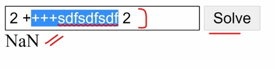
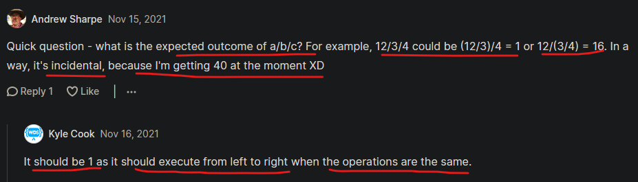

# math solver intro 

- it's like a calculator but not exactly

## what we'll learn from this project ✅

- `first` : about `regex` + how to use it 
- `second` : order of operations in calculations  

## about project

- this project has a very simple set of rules
- & this project requires a lot of problem solving & thinking about edge cases

- this project is meant to solve math problems that are inputted as strings like 2 + 2
    - it will return to us the result of it i.e 4
    - so we need to parse the string & return the correct result

## working example 

- `STEP 1` : we write the expression inside that input field like this `2 + 2`
    - `STEP 1.1` : & then click to `solve` button 
        - output : then we'll get `4`

- `STEP 2` : let's say we wrote wrong expression like this `2 +++asdlkhjasd 2`
    - `STEP 2.1` & then click to `solve` button
    - then we'll get output i.e `NaN`

- `TODO`
    - so if it's a correct equation or expression then do the calculation & return correct result 
    - if we it's not a correction equation then return output as NaN like this 
    

- and inside that input field , we could pass infinitely complex equation 
    - eg : inside field , we pass the equation like `2 + 2xy` 
    - so here we passed the x & y 
    - `Note` : but we'll be focusing on simple operations like `addition , subtraction , multiplication , division`
    - like this `2 + 2 - 3 * 4 / 5` & we'll get output i.e `1.6`
    - & we need to focus on order of operations 
    - & we do this `2 + 2 - 3 * 4 / 6 ^ 2` then output is 3.666666666665
    - `^` means square means multiply 6 X 6 = 36

- `Note` : `^` means square also follow the order of operators & it comes before `division , multiply , subtract & add` 💡💡💡 
    - & parenthesis has high order of operations than this `^`

- `bonus ways` : 
    - `first` : we can add ability of square by using this symbol → `^`
    - `second` : we can add ability of parenthesis 

- there is no css file + use `regex` for this project to solve this problem easily
    - but we don't have to use `regex` we can do manually
    - but by using `regex` we handle the problem easily 💡💡💡 

## starter code

index.html file
```html
<!DOCTYPE html>
<html lang="en">
<head>
  <meta charset="UTF-8">
  <meta http-equiv="X-UA-Compatible" content="IE=edge">
  <meta name="viewport" content="width=device-width, initial-scale=1.0">
  <title>Math Solver</title>
</head>
<body>
  <form id="equation-form">
    <input id="equation">
    <button type="submit">Solve</button>
  </form>
  <div id="results"></div>
</body>
</html>
```

## Extra stuff on regex (regular expressions) ✅

- videos 
    - https://www.youtube.com/watch?v=rhzKDrUiJVk&ab_channel=WebDevSimplified
    - https://www.youtube.com/watch?v=NGLKBq-57o8&ab_channel=CODERSNEVERQUIT
    - https://www.youtube.com/watch?v=3IhQF4-HQdo&ab_channel=CodeWithHarry
    - https://www.youtube.com/watch?v=Kq7Ai8_I6mE
    - https://www.youtube.com/watch?v=nVLdEdX9gNU&ab_channel=CodeImprove
    - https://www.youtube.com/watch?v=9RksQ5YT7FM&ab_channel=CrackConcepts
    - https://www.youtube.com/watch?v=sXQxhojSdZM&ab_channel=Fireship
    
- blogs 
    - https://dev.to/coderpad/the-complete-guide-to-regular-expressions-regex-1m6
    - https://dev.to/tracycss/basic-regex-in-javascript-for-beginners-1dnn
    - https://www.w3schools.com/jsref/jsref_obj_regexp.asp
    - https://developer.mozilla.org/en-US/docs/Web/JavaScript/Guide/Regular_Expressions
    - https://blog.bitsrc.io/a-beginners-guide-to-regular-expressions-regex-in-javascript-9c58feb27eb4

## discussion page


