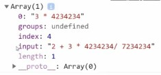
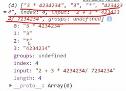
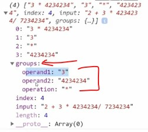
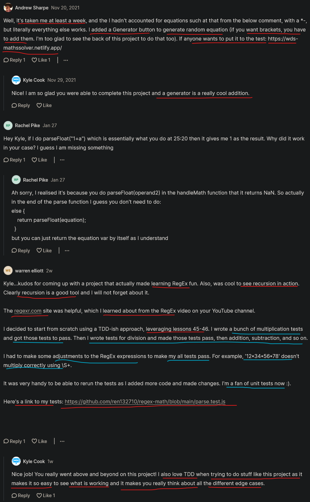

# math solver walkthrough 

- remember the `BODMAS` rule & `order of operations`

## complete code 

<details>
    <summary>index.html</summary>

```html
<!DOCTYPE html>
<html lang="en">
<head>
  <meta charset="UTF-8">
  <meta http-equiv="X-UA-Compatible" content="IE=edge">
  <meta name="viewport" content="width=device-width, initial-scale=1.0">
  <script src="script.js" defer></script>
  <title>Math Solver</title>
</head>
<body>
  <form id="equation-form">
    <input id="equation">
    <button type="submit">Solve</button>
  </form>
  <div id="results"></div>
</body>
</html>
```
</details>

<details>
    <summary>script.js</summary>

```js
const inputElement = document.getElementById("equation")
const outputElement = document.getElementById("results")
const form = document.getElementById("equation-form")

const PARENTHESIS_REGEX = /\((?<equation>[^\(\)]*)\)/
const MULTIPLY_DIVIDE_REGEX = /(?<operand1>\S+)\s*(?<operation>[\/\*])\s*(?<operand2>\S+)/
const EXPONENT_REGEX = /(?<operand1>\S+)\s*(?<operation>\^)\s*(?<operand2>\S+)/
const ADD_SUBTRACT_REGEX = /(?<operand1>\S+)\s*(?<operation>(?<!e)[\-\+])\s*(?<operand2>\S+)/

form.addEventListener("submit", e => {
  e.preventDefault()

  const result = parse(inputElement.value)
  outputElement.textContent = result
})

function parse(equation) {
  if (equation.match(PARENTHESIS_REGEX)) {
    const subEquation = equation.match(PARENTHESIS_REGEX).groups.equation
    const result = parse(subEquation)
    const newEquation = equation.replace(PARENTHESIS_REGEX, result)
    return parse(newEquation)
  } else if (equation.match(EXPONENT_REGEX)) {
    const result = handleMath(equation.match(EXPONENT_REGEX).groups)
    const newEquation = equation.replace(EXPONENT_REGEX, result)
    return parse(newEquation)
  } else if (equation.match(MULTIPLY_DIVIDE_REGEX)) {
    const result = handleMath(equation.match(MULTIPLY_DIVIDE_REGEX).groups)
    const newEquation = equation.replace(MULTIPLY_DIVIDE_REGEX, result)
    return parse(newEquation)
  } else if (equation.match(ADD_SUBTRACT_REGEX)) {
    const result = handleMath(equation.match(ADD_SUBTRACT_REGEX).groups)
    const newEquation = equation.replace(ADD_SUBTRACT_REGEX, result)
    return parse(newEquation)
  } else {
    return parseFloat(equation)
  }
}

function handleMath({ operand1, operand2, operation }) {
  const number1 = parseFloat(operand1)
  const number2 = parseFloat(operand2)

  switch (operation) {
    case "*":
      return number1 * number2
    case "/":
      return number1 / number2
    case "+":
      return number1 + number2
    case "-":
      return number1 - number2
    case "^":
      return number1 ** number2
  }
}
```
</details>

## example 

- example :
    ```
      we have this expression → 2 + 4 * 3 - 7
      first - multiplication happen → 2 + (4 * 3) - 7
      second - then addition → (2 + (4 * 3)) - 7
      third - then subtraction → (2 + (4 * 3)) - 7
    ``` 

  - so we can think about encapsulating parts inside of parenthesis
  - & operand doesn't matter around the operator means we don't need to think about what is around `*` operator 4 * 3
  - so means we just need to think that whatever the result will be of `4 * 3` , that result will take place of this `(4 * 3)` 

  - so we'll get the result like this 
    ``` 
      2 + 4 * 3 - 7
      2 + 12 - 7
      14 - 7
      7
    ```
  - so this is the way math equation works
  
- so we're just going step by step
    - means we take an equation 
    - & then we find the next logical step & we did that step
    - & then again we returned brand new equation
    - & we repeat this process over & over again 
    - so this like recursion or a loop 💡💡💡

## Demo Explanation of math solver with example 

- `STEP 1` : inside `index.html` file , add the script link for script.js file 
    ```html
    <head>
      <script src="script.js" defer></script>
    </head>
    ```

  - then create a script.js file  

- `STEP 2` : inside script.js file 
    - create a recursive function which takes an equation 
      ```js
      function parse(equation) {

      }
      ```
    - `what does function do ✅` : 
      - it takes our equation i.e like 2 + 4 * 3 - 7 & then small section done of this equation
      - & then this function creates a new equation like this 2 + 12 - 7 
      - process will be like this 
      ```
      first → 2 + 12 - 7 = parse(2 + 4 * 3 - 7)
      second → 14 - 7 = parse(2 + 12 - 7)
      third → 7 = parse(14 - 7)
      ```
    - so solving this way by making pseudo code or steps instead directly doing hard problem 
      - so always break down the problem in small chunks & solve it 💡💡💡
      - doesn't matter how much that problem is complex 

  - `STEP 2.1` : code inside `parse()` function
      ```
      function parse(equation) {
        const step = getNextStep()
        const result = solve(step)
        replaceNextStep(equation, step, result)
      }
      ```
    - this code means get next `step` would return `4 * 3` from 2 + 4 * 3 - 7
      - & then return it's `result` i.e 12 like this 2 + 12 - 7
      - & `replaceNextStep()` function would take our current equation i.e 2 + 4 * 3 - 7 <br>
        & replace `4 * 3` by it's result `12` ✔️✔️✔️

    - & this code is just pseudo code 

## complete Explanation of Math solver

- about code of index.html file
  - first thing we need to get our equation information i.e `equation-form` id of `form` element
    - & then `equation` id of input field that has our equation  
    - & then `results` id of div which is where we display our results of that equation 

- `STEP 1` : select all the required elements of html 
    ```js
    const inputElement = document.getElementById("equation")
    const outputElement = document.getElementById("results")
    const form = document.getElementById("equation-form")
    ```

- `STEP 2` : adding the submit event on the form & preventing the default behavior of `form` element 
    ```js
    const inputElement = document.getElementById("equation")
    const outputElement = document.getElementById("results")
    const form = document.getElementById("equation-form")

    form.addEventListener('submit' , e => {
      e.preventDefault()
    })
    ```

- `STEP 3` : now let's call the parse function which takes our equation
    ```js
    const inputElement = document.getElementById("equation")
    const outputElement = document.getElementById("results")
    const form = document.getElementById("equation-form")

    form.addEventListener('submit' , e => {
      e.preventDefault()

      const result = parse(inputElement.value)
      outputElement.textContent = result
    })
    
    function parse(equation) {

    }
    ```
    - so `parse()` function whatever return , that value get put into our output section

  - testing whether `parse()` function is working or not ✔️✔️✔️
    ```js
    const inputElement = document.getElementById("equation")
    const outputElement = document.getElementById("results")
    const form = document.getElementById("equation-form")

    form.addEventListener('submit' , e => {
      e.preventDefault()

      const result = parse(inputElement.value)
      outputElement.textContent = result
    })
    
    function parse(equation) {
      return "Hi"
    }
    ```
    - output : write something inside input field like this `234234` & click to `solve` button 
      - then we'll get `Hi` value

    - so instead of returning `Hi` , return the equation like this 
      ```js
      function parse(equation) {
        return equation
      }
      ```
    - output : now inside input field write any message like `hello` then click on `solve` button
      - then we'll get `hello` as a equation 

    - `Tip✅` : before writing complete full fledge code , first test it like this 💡💡💡

- so we properly hooked up all of our elements , now all that's left is the difficult part
  - of implementing that recursive function i.e `parse` function
  - which is going to parse through our equation until there's no more steps left 💡💡💡

- so take this equation like `2 + 3 * 4 - 7` & convert this equation & figure out what the next step
  - so we'll use `regex` to implement this because due to `regex` , things become easier ✔️

- `what we need to do for next step`
  - so we need create a `regex` which is going to find a number followed by a multiplication sign & followed by another number <br>
    or it could be a division sign , either one
  - means we need to find the first result that matches a multi-location sign or division sign surrounded by numbers on both sides ✔️

- `STEP 4` : creating a regex for multiplication & division
    ```js
    const inputElement = document.getElementById("equation")
    const outputElement = document.getElementById("results")
    const form = document.getElementById("equation-form")

    const MULTIPLY_DIVIDE_REGEX = new RegExp() 
    // or we can use shorthand of it 
    const MULTIPLY_DIVIDE_REGEX = /sadkjfhdklsf/ 
    

    form.addEventListener('submit' , e => {
      e.preventDefault()

      const result = parse(inputElement.value)
      outputElement.textContent = result
    })
    
    function parse(equation) {
      return equation
    }
    ```
  - `how to create a regex✅` :
    - `/sadkjfhdklsf/` → we putted the code inside both slashes
    - so this will be evaluated as a new regular expression 
    - just like we use `""` double quotes to define string 💡💡💡

  - `STEP 4.1` how to get a digit inside a regex ✅
      ```js
      const MULTIPLY_DIVIDE_REGEX = /\d/ 
      ```
    - so we put `\d` to get a digit

  - `STEP 4.2` : `+` sign in a regex
      ```js
      const MULTIPLY_DIVIDE_REGEX = /\d+/ 
      ```
    - so `+` sign means match one or more of the previous token 💡💡💡
    - means match one or more digits

  - now maybe inside equation we gave many spaces or less spaces like this `2123   + `

  - `STEP 4.3` : matching white spaces in a regex
      ```js
      const MULTIPLY_DIVIDE_REGEX = /\d+\s*/ 
      ```
    - so `\s*` used to match white spaces in a regex 
    - & we want to match any number b/w zero & infinite amounts of white space 💡💡💡 
    - & doesn't matter how much white spaces are b/w that number & the divide or multiple symbol
    - means b/w them (number & the divide or multiple symbol) if there is no white space or one or infinite white spaces
      - doesn't matter `\s*` this will match 100%

  - now `/\d+\s*/` this regex will match first section
    - now close it & reverse it like this `/\d+\s*\s*\d+/`
    - means if the white space is b/w multiply or divide symbol & the number like this `12312 /   123123`
      - means if the white space b/w sign & digit 💡💡💡

  - `STEP 4.4` : get multiply or divide sign inside equation
      ```js
      const MULTIPLY_DIVIDE_REGEX = /\d+\s*[]\s*\d+/ 
      ```
    - so `/\d+\s*[]\s*\d+/` → so square bracket means get one or the another one 
    - eg : `/\d+\s*[ab]\s*\d+/` , so here we passed square bracket we passed a & b 
      - so means get either letter a or b means get either one of them

    - `Note✅`
      - so we want to get divide & multiply sign like this `/\d+\s*[/*]\s*\d+/`
        - but directly we can't define divide & multiply sign because `/` & `*` are a reserved character 💡💡💡
      - so we need to prefix them with backslashes like this `/\d+\s*[\/\*]\s*\d+/`
        - due to this we'll get the actual multiply sign 💡💡💡
      - if we define reserved character directly inside regex then it'll be give broken regex 💡💡💡

  - `STEP 4.5` : defining multiply & divide sign in that regex
      ```js
      const inputElement = document.getElementById("equation")
      const outputElement = document.getElementById("results")
      const form = document.getElementById("equation-form")

      const MULTIPLY_DIVIDE_REGEX = /\d+\s*[\/\*]\s*\d+/

      form.addEventListener('submit' , e => {
        e.preventDefault()

        const result = parse(inputElement.value)
        outputElement.textContent = result
      })
      
      function parse(equation) {
        return equation
      }
      ```
    - now let's check that is MULTIPLY_DIVIDE_REGEX working or not
      ```js
      const equation = "2 + 3 * 4234234/ 7234234"
      console.log(equation.match(MULTIPLY_DIVIDE_REGEX))
      ```
      - output : we got array Array(1) like this <br>
      
      - so here `3 * 4234234` matched inside that regex
      - & we can see inside this regex , this big number i.e `4234234/ 7234234` doesn't match
      - `Note✅ about a regex` : because a regex bydefault matches the very first occurrence that it finds 💡💡💡
        - & this is right because in math , calculation always start from left to right
        - so if we have lots of multiplication or lots of division inside our equation
        - then regex always gonna pick the one that's very first from the left 
        - so that first left one will be executed 💡💡💡

  - now we want to get both the digits & that multiply or divide sign ✔️
    - so for this we can create group inside a regex

  - `STEP 4.6` : creating groups inside a regex by using parenthesis
      ```js
      const inputElement = document.getElementById("equation")
      const outputElement = document.getElementById("results")
      const form = document.getElementById("equation-form")

      const MULTIPLY_DIVIDE_REGEX = /(\d+)\s*([\/\*])\s*(\d+)/

      form.addEventListener('submit' , e => {
        e.preventDefault()

        const result = parse(inputElement.value)
        outputElement.textContent = result
      })
      
      function parse(equation) {
        return equation
      }

      // testing whether MULTIPLY_DIVIDE_REGEX is working correctly or not
      const equation = "2 + 3 * 4234234/ 7234234"
      console.log(equation.match(MULTIPLY_DIVIDE_REGEX))
      ```
    - `Note✅` why we use groups in a regex 
      - `first` : to make groups inside a regex we use parenthesis like this `/(\d+)\s*([\/\*])\s*(\d+)/` 
      - `second` : we use groups in a regex when we want to separate things from inside a equation
      - so here we wrap those section of regex which are important like all the digits & multiply or divide sign 💡💡💡

    - output : <br>
    
    - now we can see that we got the output in a array
    - & inside that array , in `0` index we got `3 * 4234234` (which is also getting earlier) <br>
      & in `1` index , we got `3` & in `2` index we got `*` & in `3` index we got `4234234`
    - so this `4234234` big number returned individually

  - but now difficult to know what index everything is 
    - so due to this , we can also give names in a regex by using `?<>` 💡💡💡

  - `STEP 4.7` : giving names in a regex 
      ```js
      const inputElement = document.getElementById("equation")
      const outputElement = document.getElementById("results")
      const form = document.getElementById("equation-form")

      const MULTIPLY_DIVIDE_REGEX = /(?<operand1>\d+)\s*([\/\*])\s*(\d+)/

      form.addEventListener('submit' , e => {
        e.preventDefault()

        const result = parse(inputElement.value)
        outputElement.textContent = result
      })
      
      function parse(equation) {
        return equation
      }

      // testing whether MULTIPLY_DIVIDE_REGEX is working correctly or not
      const equation = "2 + 3 * 4234234/ 7234234"
      console.log(equation.match(MULTIPLY_DIVIDE_REGEX))
      ```
    - `Note ✅` : how to define names in a regex
      - so by using `?<>` & inside angle brackets we define a name like this `/(?<operand1>\d+)\s*([\/\*])\s*(\d+)/` 
      - but define a name inside a regex before that digit 
      - & always group that important thing by using parenthesis if we want to define name inside a regex 💡💡💡
      
    - output : now open that array & inside `groups` section 
        - we can see `operand1` : "3" 

  - now define names to digits & multiply & divide sign by using groups inside a regex
  - `STEP 4.7.1`
      ```js
      const inputElement = document.getElementById("equation")
      const outputElement = document.getElementById("results")
      const form = document.getElementById("equation-form")

      const MULTIPLY_DIVIDE_REGEX = /(?<operand1>\d+)\s*(?<operation>[\/\*])\s*(?<operand2>\d+)/

      form.addEventListener('submit' , e => {
        e.preventDefault()

        const result = parse(inputElement.value)
        outputElement.textContent = result
      })
      
      function parse(equation) {
        return equation
      }

      // testing whether MULTIPLY_DIVIDE_REGEX is working correctly or not
      const equation = "2 + 3 * 4234234/ 7234234"
      console.log(equation.match(MULTIPLY_DIVIDE_REGEX))
      ```
    - output : now open that array & inside `groups` property , then we can see name of that section inside a regex like this 
    
    
  - now we can take names which are define inside a regex to execute
    - means create a function which takes these parameters i.e `operand1 , operand2 & operation`
    - & return the actual math equation of it 

- `STEP 5` : creating a function which takes parameters i.e operand1 , operand2 & operation
    ```js
    const inputElement = document.getElementById("equation")
    const outputElement = document.getElementById("results")
    const form = document.getElementById("equation-form")

    const MULTIPLY_DIVIDE_REGEX = /(?<operand1>\d+)\s*(?<operation>[\/\*])\s*(?<operand2>\d+)/

    form.addEventListener('submit' , e => {
      e.preventDefault()

      const result = parse(inputElement.value)
      outputElement.textContent = result
    })
    
    function parse(equation) {
      return equation
    }

    function handleMath( { operand1, operand2, operation }) {

    }

    // testing whether MULTIPLY_DIVIDE_REGEX is working correctly or not
    const equation = "2 + 3 * 4234234/ 7234234"
    console.log(equation.match(MULTIPLY_DIVIDE_REGEX))
    ```
  - so here inside parameter of `handleMath` function we're destructuring
    because we're passing that entire `groups` object into our handleMath i.e <br>
    
  - then we'll get the value of these parameters i.e operand1, operand2, operation of `handleMath` function

  - `STEP 5.1` : working on handleMath() function
      ```js
      const inputElement = document.getElementById("equation")
      const outputElement = document.getElementById("results")
      const form = document.getElementById("equation-form")

      const MULTIPLY_DIVIDE_REGEX = /(?<operand1>\d+)\s*(?<operation>[\/\*])\s*(?<operand2>\d+)/

      form.addEventListener('submit' , e => {
        e.preventDefault()

        const result = parse(inputElement.value)
        outputElement.textContent = result
      })
      
      function parse(equation) {
        if (equation.match(MULTIPLY_DIVIDE_REGEX)) {
          handleMath(equation.match(MULTIPLY_DIVIDE_REGEX).groups)
        }

        return equation
      }

      function handleMath( { operand1, operand2, operation }) {
        console.log(operand1, operand2, operation)
      }

      // testing whether MULTIPLY_DIVIDE_REGEX is working correctly or not
      const equation = "2 + 3 * 4234234/ 7234234"
      console.log(equation.match(MULTIPLY_DIVIDE_REGEX))
      ``` 
    - `if (equation.match(MULTIPLY_DIVIDE_REGEX))` means if we find a match for this `MULTIPLY_DIVIDE_REGEX`
      - then we want `groups` object & then we destructure it inside `handleMath` function 💡💡💡

    - output : now pass this equation inside input field i.e `2 + 3 * 4234234/ 7234234` , then click to `Solve` button
      - then we'll get same equation as it is like this `2 + 3 * 4234234/ 7234234`
      - & inside `console` tab , we got `3 4234234 *` ✔️

  - so we got all the correct values that we need inside of `handleMath` function

  - now we need to convert those string values i.e `operand1, operand2, operation` to an actual usable number values
    - so we can do the multiplication ✔️

  - `STEP 5.2` : converting these string values i.e `operand1, operand2, operation` to an actual values
      ```js
      const inputElement = document.getElementById("equation")
      const outputElement = document.getElementById("results")
      const form = document.getElementById("equation-form")

      const MULTIPLY_DIVIDE_REGEX = /(?<operand1>\d+)\s*(?<operation>[\/\*])\s*(?<operand2>\d+)/

      form.addEventListener('submit' , e => {
        e.preventDefault()

        const result = parse(inputElement.value)
        outputElement.textContent = result
      })
      
      function parse(equation) {
        if (equation.match(MULTIPLY_DIVIDE_REGEX)) {
          const result = handleMath(equation.match(MULTIPLY_DIVIDE_REGEX).groups)
          console.log(result)
        }

        return equation
      }

      function handleMath( { operand1, operand2, operation }) {
        const number1 = parseFloat(operand1) // here we're converting string into float because number can be decimal also
        const number2 = parseFloat(operand2)

        switch (operation) {
          case "*":
            return number1 * number2
          case "/":
            return number1 / number2
        }
      }
      ```
    - here we using switch statement on our operation , to know what operation we're actually doing

    - here we're logging out the `result` because if we just do 3 * any number or any number of times any number
      - we should get a result back
      - first output : inside input field write `2 * 3` & then click to `solve` button then we'll get `2 * 3` 
        - & inside `console` tab we'll get `6` ✔️
      - second output : now inside input field write `2 / 3` & then click to `solve` button then we'll get 2 / 3
        - & inside `console` tab we'll get `0.666666666666` ✔️  
      - third output : now inside input field write `2 + 2 / 3` & then click to `solve` button then we'll get 2 + 2 / 3
        - & inside console tab we'll still get `0.666666666666` , 
        - so that regex is properly getting the division section which comes after the addition
        - means that regex is checking for multiply & division section inside that equation 💡💡💡
    - so now we know that atleast this is working

  - so now we have `result` variable , now we need to take our equation & replace the section that we equated four
    - means in `2 + 2 / 3` , replace 2 / 3 with our result

  - `STEP 5.3` : replacing the section that we equated or evaluated from that equation
      ```js
      const inputElement = document.getElementById("equation")
      const outputElement = document.getElementById("results")
      const form = document.getElementById("equation-form")

      const MULTIPLY_DIVIDE_REGEX = /(?<operand1>\d+)\s*(?<operation>[\/\*])\s*(?<operand2>\d+)/

      form.addEventListener('submit' , e => {
        e.preventDefault()

        const result = parse(inputElement.value)
        outputElement.textContent = result
      })

      function parse(equation) {
        if (equation.match(MULTIPLY_DIVIDE_REGEX)) {
          const result = handleMath(equation.match(MULTIPLY_DIVIDE_REGEX).groups)
          const newEquation = equation.replace(MULTIPLY_DIVIDE_REGEX , result)
          console.log(newEquation)
        }

        return equation
      }

      function handleMath( { operand1, operand2, operation }) {
        const number1 = parseFloat(operand1) 
        const number2 = parseFloat(operand2)

        switch (operation) {
          case "*":
            return number1 * number2
          case "/":
            return number1 / number2
        }
      }
      ``` 
    - `equation.replace(MULTIPLY_DIVIDE_REGEX , result)` means 
      - `replace()` method takes two arguments 
      - so means if we do `2 * 3` becomes 6 , so that `2 * 3` equation replace by `6` is a `result` variable
      - & then we'll get the new equation 💡💡💡

    - output : write `2 * 6` in input field & click to `Solve` button then we'll get 2 * 6
      - & inside console tab we'll get `12` as a answer
      - & if we write `2 + 2 * 6` equation & click to `solve` button then we'll get 2 + 2 * 6
        - but inside console tab we'll get `2 + 12` which is a new equation
        - so inside `2 + 2 * 6` , `2 * 6` gets replaced by it's answer 💡💡💡
        
    - so now infinitely run our equation through that `parse()` function until we get down to a section 
      - where nothing else matches 💡💡💡

  - `STEP 5.4` : running `parse` function recursively until we get down to a section where nothing else matches ✅
      ```js
      const inputElement = document.getElementById("equation")
      const outputElement = document.getElementById("results")
      const form = document.getElementById("equation-form")

      const MULTIPLY_DIVIDE_REGEX = /(?<operand1>\d+)\s*(?<operation>[\/\*])\s*(?<operand2>\d+)/

      form.addEventListener('submit' , e => {
        e.preventDefault()

        const result = parse(inputElement.value)
        outputElement.textContent = result
      })

      function parse(equation) {
        if (equation.match(MULTIPLY_DIVIDE_REGEX)) {
          const result = handleMath(equation.match(MULTIPLY_DIVIDE_REGEX).groups)
          const newEquation = equation.replace(MULTIPLY_DIVIDE_REGEX , result)
          return parse(newEquation) // calling parse() function recursively until nothing is left
        } else {
          return equation
        }
      }

      function handleMath( { operand1, operand2, operation }) {
        const number1 = parseFloat(operand1) 
        const number2 = parseFloat(operand2)

        switch (operation) {
          case "*":
            return number1 * number2
          case "/":
            return number1 / number2
        }
      }
      ```
    - eg : we gave `2 + 2 * 6` & then replace `2 * 6` with 12 
      - & then pass `2 + 12` inside that parse() function again 
      - & then check does `2 + 12` equation match with multiply & divide 
      - so in our case no then go to else block & return our equation
      
    - means else block will only execute when nothing has left inside that equation related to multiply & divide 
      - eg : 2 + 2 * 6 / 6 , so here first this equation converted into 2 + 12 / 6
      - then divide then we'll get this equation 2 + 2 because no operation is left related to multiplication & division

  - `why we need to work that regex related to multiplication & division✅` :
    - because let's say we pass negative number like this `2 * -6`
    - then that regex won't work & we'll get this equation as it is 💡💡💡
    - because inside that regex , `\d` only checks for digits & minus sign is not a digit
    - so `\d` won't picked up that `-6` minus 6 digit 
    - but if we do `2 * 6.1` then we'll get output : 12.1 because technically that `point` is a digit 6.1 in a regex
    - but that negative sign is not consider as a digit in regex world 💡💡💡 
    - so we'll add the negative sign like this `[-\d]`

  - `STEP 5.5` : working on the regex to make it so that it consider the minus sign digits also 
      ```js
      const MULTIPLY_DIVIDE_REGEX = /(?<operand1>[-\d]+)\s*(?<operation>[\/\*])\s*(?<operand2>[-\d]+)/
      ```
    - output : write `2 * -6` inside the input field & click to `solve` button , output : `-12`
      - so we got the output properly
    - but one issue if we have a really big numbers like define `129012371902347908749023849890 * 213123`
      - then we'll get output in decimal number like this `2.749550373694409e+34`
      - & here inside that regex , there is no `e+34` 
      - & due to this , js doesn't know how to process this big number inside that regex 
      - so instead of checking for a minus sign or a digit & then trying to do calculation on e+34
      - we'll use `\S` means check everything which is not a white space character 💡💡💡

    - `STEP 5.5.1` : using `\S` instead of `\d` in that multiplication & division regex
        ```js
        const MULTIPLY_DIVIDE_REGEX = /(?<operand1>\S+)\s*(?<operation>[\/\*])\s*(?<operand2>\S+)/
        ```
      - `Note about \S inside the regex✅` :
        - `\S` here `S` letter should be capital 
        - `\S` used to check everything which is not a white space character 💡💡💡

    - output : inside input field , write `2 * 2.749550373694409e+34` & then click to `solve` button
      - then we'll get output i.e `4.749550373694409e+34` here multiplication happened b/w 2 * 2
      - so here we can see that we're still getting output even after non digit syntax i.e `4.749550373694409e+34`
      - we're changing that regex because when numbers get really big or really small then JS converts <br>
        these scientific notation i.e `e+34`
      - & then we parse this string i.e `4.749550373694409e+34` to a float & due to this <br>
        JS know that number is scientific notation & then we'll get correct answer ✔️✔️✔️

- now let's work on add & subtract

- `STEP 6` : working on add & subtract
    ```js
    const inputElement = document.getElementById("equation")
    const outputElement = document.getElementById("results")
    const form = document.getElementById("equation-form")

    const MULTIPLY_DIVIDE_REGEX = /(?<operand1>\S+)\s*(?<operation>[\/\*])\s*(?<operand2>\S+)/
    const ADD_SUBTRACT_REGEX = /(?<operand1>\S+)\s*(?<operation>[\-\+])\s*(?<operand2>\S+)/

    form.addEventListener('submit' , e => {
      e.preventDefault()

      const result = parse(inputElement.value)
      outputElement.textContent = result
    })

    function parse(equation) {
      if (equation.match(MULTIPLY_DIVIDE_REGEX)) {
        const result = handleMath(equation.match(MULTIPLY_DIVIDE_REGEX).groups)
        const newEquation = equation.replace(MULTIPLY_DIVIDE_REGEX , result)
        return parse(newEquation) // calling parse() function recursively until nothing is left
      } else if (equation.match(ADD_SUBTRACT_REGEX)) {
        const result = handleMath(equation.match(ADD_SUBTRACT_REGEX).groups)
        const newEquation = equation.replace(ADD_SUBTRACT_REGEX , result)
        return parse(newEquation) // calling parse() function recursively until nothing is left
      } else {
        return equation
      }
    }

    function handleMath( { operand1, operand2, operation }) {
      const number1 = parseFloat(operand1) 
      const number2 = parseFloat(operand2)

      switch (operation) {
        case "*":
          return number1 * number2
        case "/":
          return number1 / number2
        case "+":
          return number1 + number2
        case "-":
          return number1 - number2
      }
    }
    ```
  - we changed the regex for addition & subtraction like this `/(?<operand1>\d+)\s*(?<operation>[\-\+])\s*(?<operand2>\d+)/`
  - now there is a small issue i.e if we do `2 + 4 * 3 - 7` & click to `solve` button then we'll get correct output i.e 7
    - but if we do `1 / 9999999999` & then click `solve` then we'll get `-5.999999999999` but this is wrong output 
    - if we do `1 / 9999999999` then we'll get `1.000000001e-9` which is a scientific notation number ✔️✔️✔️

  - so `/(?<operand1>\S+)\s*(?<operation>[\-\+])\s*(?<operand2>\S+)/` this addition & subtraction regex means 
    - `?<operand1>\S+` means anytime we have a number & `\s*` any amount of white space 
    - & then `[\-\+]` it's a subtract or addition sign , so till here `1.000000001e-` we got the output 
    - then `?<operand2>\S+` means followed by another number i.e 8 inside `1.000000001e-8`
    - so we're getting `-6.999999999999` means 7
    - so we need to add this `(?<!)` inside the addition & subtraction regex
    - `(?<!)` means look backward & see do we have any of these things inside of our match
      - & if so then it's not a correct match 💡💡💡

  - `STEP 6.1` : putting `(?<!e)` inside the addition & subtraction regex 
      ```js
      const inputElement = document.getElementById("equation")
      const outputElement = document.getElementById("results")
      const form = document.getElementById("equation-form")

      const MULTIPLY_DIVIDE_REGEX = /(?<operand1>\S+)\s*(?<operation>[\/\*])\s*(?<operand2>\S+)/
      const ADD_SUBTRACT_REGEX = /(?<operand1>\S+)\s*(?<operation>(?<!e)[\-\+])\s*(?<operand2>\S+)/

      form.addEventListener('submit' , e => {
        e.preventDefault()

        const result = parse(inputElement.value)
        outputElement.textContent = result
      })

      function parse(equation) {
        if (equation.match(MULTIPLY_DIVIDE_REGEX)) {
          const result = handleMath(equation.match(MULTIPLY_DIVIDE_REGEX).groups)
          const newEquation = equation.replace(MULTIPLY_DIVIDE_REGEX , result)
          return parse(newEquation) 
        } else if (equation.match(ADD_SUBTRACT_REGEX)) {
          const result = handleMath(equation.match(ADD_SUBTRACT_REGEX).groups)
          const newEquation = equation.replace(ADD_SUBTRACT_REGEX , result)
          return parse(newEquation) 
        } else {
          return equation
        }
      }

      function handleMath( { operand1, operand2, operation }) {
        const number1 = parseFloat(operand1) 
        const number2 = parseFloat(operand2)

        switch (operation) {
          case "*":
            return number1 * number2
          case "/":
            return number1 / number2
          case "+":
            return number1 + number2
          case "-":
            return number1 - number2
        }
      }
      ```
    - so `(?<!e)` means before if we subtract or add we have the letter `e` 
      - then ignore that match i.e `(?<!e)` completely 💡💡💡

    - output : if we do `1 / 999999999` then click to solve , we'll get `1.000001000001e-7` 
      - so we're getting scientific notation output

    - & if we pass `klsdhfjklsdehf` & click to solve then we're getting as it is , so we want to print `NaN`

  - `STEP 6.2` : when we pass `klsdhfjklsdehf` & click to solve then we should get `NaN`
      ```js
      function parse(equation) {
        if (equation.match(MULTIPLY_DIVIDE_REGEX)) {
          const result = handleMath(equation.match(MULTIPLY_DIVIDE_REGEX).groups)
          const newEquation = equation.replace(MULTIPLY_DIVIDE_REGEX , result)
          return parse(newEquation) 
        } else if (equation.match(ADD_SUBTRACT_REGEX)) {
          const result = handleMath(equation.match(ADD_SUBTRACT_REGEX).groups)
          const newEquation = equation.replace(ADD_SUBTRACT_REGEX , result)
          return parse(newEquation) 
        } else {
          return parseFloat(equation)
        }
      }
      ```
    - output : now when we pass `klsdhfjklsdehf` then we we'll get `NaN`
      - & even we do `1 + a` then still we'll get `NaN`

  - now next thing we want to handle the power sign or exponent sign
    - means if we do `2 ^ 3` then we want to return 8
  
- `STEP 7` : working to handle the power or exponent sign
      ```js
      const inputElement = document.getElementById("equation")
      const outputElement = document.getElementById("results")
      const form = document.getElementById("equation-form")

      const MULTIPLY_DIVIDE_REGEX = /(?<operand1>\S+)\s*(?<operation>[\/\*])\s*(?<operand2>\S+)/
      const EXPONENT_REGEX = /(?<operand1>\S+)\s*(?<operation>\^)\s*(?<operand2>\S+)/
      const ADD_SUBTRACT_REGEX = /(?<operand1>\S+)\s*(?<operation>(?<!e)[\-\+])\s*(?<operand2>\S+)/

      form.addEventListener('submit' , e => {
        e.preventDefault()

        const result = parse(inputElement.value)
        outputElement.textContent = result
      })

      function parse(equation) {
        if (equation.match(EXPONENT_REGEX)) {
          const result = handleMath(equation.match(EXPONENT_REGEX).groups)
          const newEquation = equation.replace(EXPONENT_REGEX, result)
          return parse(newEquation)
        } else if (equation.match(MULTIPLY_DIVIDE_REGEX)) {
          const result = handleMath(equation.match(MULTIPLY_DIVIDE_REGEX).groups)
          const newEquation = equation.replace(MULTIPLY_DIVIDE_REGEX , result)
          return parse(newEquation) 
        } else if (equation.match(ADD_SUBTRACT_REGEX)) {
          const result = handleMath(equation.match(ADD_SUBTRACT_REGEX).groups)
          const newEquation = equation.replace(ADD_SUBTRACT_REGEX , result)
          return parse(newEquation) 
        } else {
          return equation
        }
      }

      function handleMath( { operand1, operand2, operation }) {
        const number1 = parseFloat(operand1) 
        const number2 = parseFloat(operand2)

        switch (operation) {
          case "*":
            return number1 * number2
          case "/":
            return number1 / number2
          case "+":
            return number1 + number2
          case "-":
            return number1 - number2
          case "^":
            return number1 ** number2
        }
      }
      ```
    - `\^` means get anything which has caret symbol
      - & power or exponent calculation done before multiply & divide
      - that's why we put `power or exponent` if statement first 
      - because order of these if statements is really important 💡💡💡
      - & to do power or exponent of a number then we use this → `**` 

    - output : after writing `2 ^ 3` & then click `Solve` button then we'll get `8`
      - & if we do `2 ^ 3 * -1` then we'll get `-8` because exponent will be calculated first 

- now let's handle if we deal with parentheses
- `STEP 8` : handling if we deal with parentheses
      ```js
      const inputElement = document.getElementById("equation")
      const outputElement = document.getElementById("results")
      const form = document.getElementById("equation-form")

      const PARENTHESIS_REGEX = /\((?<equation>.*)\)/
      const MULTIPLY_DIVIDE_REGEX = /(?<operand1>\S+)\s*(?<operation>[\/\*])\s*(?<operand2>\S+)/
      const EXPONENT_REGEX = /(?<operand1>\S+)\s*(?<operation>\^)\s*(?<operand2>\S+)/
      const ADD_SUBTRACT_REGEX = /(?<operand1>\S+)\s*(?<operation>(?<!e)[\-\+])\s*(?<operand2>\S+)/

      form.addEventListener('submit' , e => {
        e.preventDefault()

        const result = parse(inputElement.value)
        outputElement.textContent = result
      })

      function parse(equation) {
        if (equation.match(EXPONENT_REGEX)) {
          const result = handleMath(equation.match(EXPONENT_REGEX).groups)
          const newEquation = equation.replace(EXPONENT_REGEX, result)
          return parse(newEquation)
        } else if (equation.match(MULTIPLY_DIVIDE_REGEX)) {
          const result = handleMath(equation.match(MULTIPLY_DIVIDE_REGEX).groups)
          const newEquation = equation.replace(MULTIPLY_DIVIDE_REGEX , result)
          return parse(newEquation) 
        } else if (equation.match(ADD_SUBTRACT_REGEX)) {
          const result = handleMath(equation.match(ADD_SUBTRACT_REGEX).groups)
          const newEquation = equation.replace(ADD_SUBTRACT_REGEX , result)
          return parse(newEquation) 
        } else {
          return equation
        }
      }

      function handleMath( { operand1, operand2, operation }) {
        const number1 = parseFloat(operand1) 
        const number2 = parseFloat(operand2)

        switch (operation) {
          case "*":
            return number1 * number2
          case "/":
            return number1 / number2
          case "+":
            return number1 + number2
          case "-":
            return number1 - number2
          case "^":
            return number1 ** number2
        }
      }
      ```
    - inside parentheses regex , we don't did to define operand 
      - means we just need to handle the parentheses 
      - so `/\((?<equation>.*)\)/` means here dot means match everything 
      - & `(?<equation>.*` means we want to capture everything whatever inside the parentheses 💡💡💡
  
  - now let's test that parentheses regex
      ```js
      console.log("1 + (2 - 4) * 3".match(PARENTHESIS_REGEX))
      ```
    - output : inside console , we'll get "2 - 4" value of `equation` property inside `groups` object
    - but here is a small problem that if we do define nested parenthesis like this `1 + ((2 - 4) * 3)`
    - so we first need to solve `2 - 4` & then solve next set of parentheses
    - now inside console , `equation` property have `(2 - 4) * 3` of `groups` object
    - but we want the inner most parenthesis first 💡💡💡
    - so inside parentheses regex , we need to get values that're not parentheses <br>
      because if our parentheses contain everything except for parentheses (which are inner most) <br>
      then we know it's the inner most set of parentheses 💡💡💡
    - so inside parentheses regex we need to create another group like this `/\((?<equation>[^\(\)]*)\)/`

  - `STEP 8.1` : handling the inner most parentheses first 
      ```js
      const PARENTHESIS_REGEX = /\((?<equation>[^\(\)]*)\)/

      // testing for do we're getting inner most parentheses value or not
      console.log("1 + (2 - 4) * 3".match(PARENTHESIS_REGEX)) 
      ```
      - so `[^\(\)]` means here `^` caret sign means match everything that's not one these i.e `(\)`
      - means anything that's not an opening or closing parentheses is going to be what's matched

      - output : inside that array , inside `groups` object , `equation` property have `2 - 4` value
      - so even if we do give `[^\(\)]` this then still we'll get correct output <br> 
        but for understanding properly we gave

  - & we know that parentheses operation always come first
  - `STEP 8.2` : working on parentheses operation
      ```js
      const inputElement = document.getElementById("equation")
      const outputElement = document.getElementById("results")
      const form = document.getElementById("equation-form")

      const PARENTHESIS_REGEX = /\((?<equation>.*)\)/
      const MULTIPLY_DIVIDE_REGEX = /(?<operand1>\S+)\s*(?<operation>[\/\*])\s*(?<operand2>\S+)/
      const EXPONENT_REGEX = /(?<operand1>\S+)\s*(?<operation>\^)\s*(?<operand2>\S+)/
      const ADD_SUBTRACT_REGEX = /(?<operand1>\S+)\s*(?<operation>(?<!e)[\-\+])\s*(?<operand2>\S+)/

      form.addEventListener('submit' , e => {
        e.preventDefault()

        const result = parse(inputElement.value)
        outputElement.textContent = result
      })

      function parse(equation) {
        if (equation.match(PARENTHESIS_REGEX)) {
          const subEquation = equation.match(PARENTHESIS_REGEX).groups.equation
          const result = parse(subEquation)
          const newEquation = equation.replace(PARENTHESIS_REGEX, result)
          return parse(newEquation)
        } else if (equation.match(EXPONENT_REGEX)) {
          const result = handleMath(equation.match(EXPONENT_REGEX).groups)
          const newEquation = equation.replace(EXPONENT_REGEX, result)
          return parse(newEquation)
        } else if (equation.match(MULTIPLY_DIVIDE_REGEX)) {
          const result = handleMath(equation.match(MULTIPLY_DIVIDE_REGEX).groups)
          const newEquation = equation.replace(MULTIPLY_DIVIDE_REGEX , result)
          return parse(newEquation) 
        } else if (equation.match(ADD_SUBTRACT_REGEX)) {
          const result = handleMath(equation.match(ADD_SUBTRACT_REGEX).groups)
          const newEquation = equation.replace(ADD_SUBTRACT_REGEX , result)
          return parse(newEquation) 
        } else {
          return equation
        }
      }

      function handleMath( { operand1, operand2, operation }) {
        const number1 = parseFloat(operand1) 
        const number2 = parseFloat(operand2)

        switch (operation) {
          case "*":
            return number1 * number2
          case "/":
            return number1 / number2
          case "+":
            return number1 + number2
          case "-":
            return number1 - number2
          case "^":
            return number1 ** number2
        }
      }
      ```
    - inside parentheses if statement , we don't actually do math on this 
      - means a parentheses contain a new mini sub-equation 
      - so sub-equation needs to be solved first just like a normal equation 💡💡💡
      - `first` : so that's why first we get the sub-equation 
      - `second` : then we parse that sub-equation means `((2 - 3) * 3)`
      - `third` : first we need to solve the inner most parentheses & replace the `(2 - 3)` by that value <br>
        that's why we used replace() method to replace with new sub equation
      - `fourth` : & then we recursively called that `parse()` function for that new equation

  - testing output : if we write `2 * (4 - 3) ^ 3` , then we're not getting output 
    - so there is something wrong inside the parentheses regex 
    - so `parse(newEquation)` we need to return this , so use return keyword there
    - so that we can return the parse() function with new argument 💡💡💡

  - output : now if we do `4 * (2 + 3) ^ 2` & then click to solve then we got `100`|
    - so first `2 + 3` will solved & converted into 5
    - & then `5 ^ 2` will be replaced by 25 & then 4 * 25 is 100
  - output : if we do `4 * (2 + 3) ^ -2` then we'll get 0.16

## conclusion 

- solve the small & small steps & then we repeat the process over & over again until we eventually have no more small steps to take
- key component is to build out good programs by breaking them into smaller & smaller steps
- & also by using regular expression , code become easier to parse all of our strings instead of doing manually 
- `important` is we thought about all the different edge cases such as scientific notation , negative numbers , decimals & so on ✔️✔️✔️
- `TDD` : test driven development means doing testing after writing little bit code to check whether that code is working or not 
  - means we did unit testing to check the small unit of a code to know what is working & what's not & if not then why 💡💡💡

## 🔗links made by other people 

- https://wds-mathssolver.netlify.app/
- https://github.com/ren132710/regex-math/blob/main/parse.test.js 

## discussion page

 
