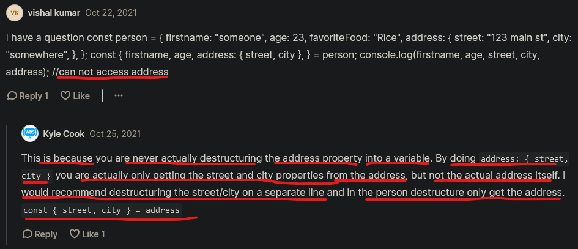

# Destructuring

- this is one of the ES6 feature introduced in JS 
- this feature is used most of the time in Reactjs , etc frameworks of JS also ✔️
- very important topic 🔥 

## What is destructuring 

- `Definition` : 

    ```
    - is a another way to take objects or arrays & access the different properties 
        from objects or values/elements from arrays in an easier way
    - means "destructuring assignment syntax" is used to unpack values from arrays, or properties from objects 
        into distinct/different variables 💡💡💡
    ```

- there are 2 ways of destructuring ✔️
    - Array destructuring
    - object destructuring

    - `Note🔥` : object destructuring is most important than array destructuring 

## Array Destructuring

    - to use array destructuring , we use square bracket notation → `[]`

    - inside array destructuring , order/sequence → of defining each variable name matter 
        to get the values (of that array) in sequence 💡💡💡

#### example 1 : getting array items by using normal way

```js
const arr = ["A" , "B" , "C" , "D"]

// without Array destructuring 
const first = arr[0]
const second = arr[1]

console.log(first)
console.log(second)

/* output : A
            B
*/
```

- here we got the output without using array destructuring
    - but if we use Array destructuring then code become easy & compact

#### example 2 : getting array items by using array destructuring

```js
const arr = ["A" , "B" , "C" , "D"]

// using Array destructuring 
const [first , second] = arr

console.log(first)
console.log(second)

/* output : A
            B
*/
```

    - here const [first , second] = arr → this is array destructuring syntax
        - inside that array destructuring , each variables are pointing each index number values of "arr" array 
        - first & second , these both are variables 
        - & these are in sequence or equal to index of each array i,.e "arr" array 💡💡💡
        - & `first` variable pointing to the 0 index value/element of that array 
        - & `second` variable pointing to the 1 index value/element of that array 💡💡💡

- & we're getting same output & we wrote the code in one line using array destructuring 

#### example 3 : skipping the value inside array destructuring  

```js
const arr = ["A" , "B" , "C" , "D"]

// using Array destructuring 
const [first , second , , fourth , five] = arr

console.log(first)
console.log(second)
console.log(fourth)
console.log(five)

/* output : A
            B
            D
            undefined
*/
```

    - here we didn't define the variable to get the third value of "arr" array
        - because we want to skip it & then we gave "fourth" variable to get the value of "arr" array 
          which is on the fourth index 💡💡💡

#### example 4 : creating a default variable & it's value by using array destructuring 

```js
const arr = ["A" , "B" , "C" , "D"]

// creating a variable with it's default value inside Array destructuring 
const [first , second , fourth , fifth , sixth = "8972873"] = arr
console.log(sixth)

/* output : 8972873 */
```

    - here we got the default value of sixth ➝ variable
    - but if we don't give/define default value of sixth ➝ variable then we'll get ➝ undefined 

#### example 5 : of nested array destructuring 

```js
const arr = ["A" , "B" , "C" , "D" , ["E" , "F"]]

// STEP 1 : using nested Array destructuring 
// const [first , second , three , fourth , fifth] = arr ➝ output : ["E" , "F"]
const [first , second , three , fourth , [fifth , sixth]] = arr

console.log(fifth)
console.log(sixth)

/* output : E
            F
*/
```

    - so here we destructure the fourth index by using nested destructuring 

- `imp Note🔥` : `when we can use nested destructuring` 
    - before using nested array destructuring , that actual array should contain values in nested form also 

## why & when array destructuring is useful ✅

- said by Kyle : `why array destructuring is useful` : 
    - array destructuring is one of the destructuring which is not much useful
    - but there are specific situation where array destructuring is really useful 💡💡💡

    - because getting values from an array by using normal way is perfectly fine
    - but if we want to store some values in same sequence/order of that array which that array has values  
        then use array destructing 💡💡💡

- Eg : `use case of using array destructuring`

```js
function addAndMultiply(a , b) {
    return [a + b , a * b]
}

// without using array destructuring
const result = addAndMultiply(2 , 3)
console.log(result)
/* 
    output : (2) [5 , 6]

    5 ➝ value of addition
    6 ➝ value of multiply
*/
```

- now if we want to show the result of each calculation 
    - then we can use array destructuring like this 

```js
function addAndMultiply(a , b) {
    return [a + b , a * b]
}

// using array destructuring 
const [sum , product] = addAndMultiply(2 , 3)
console.log(sum)
console.log(product)
console.log(typeof sum1) // output : number 
/* 
    output : 5 --> value of addition 
             6 --> value of multiply 
*/
``` 

- so if we're returning the multiple values by using array if we know that each values are going to be same
    - & to get/fetch those multiple result then we can use array destructuring

- so array destructuring is useful to get/access multiple values as an array
    - this is actually used inside the useState hook in Reactjs 
    - & this feature used all over the places especially in Reactjs ✅ 

## Object Destructuring

    - this `Object destructuring` used a lot ✅

    - to use object destructuring , we use `curly braces` 💡💡💡 

    - we can define each key (of an object) in any order inside object destructuring 💡💡💡
        - but inside array destructuring , order/sequence of defining each variable name matter 
            to get the values (of that array) in sequence  

#### Example 1 : getting object values of keys by using normal way

```js
const person = {
    name : "Teen" ,
    age : 12 , 
    favoriteFood : "Rice" ,
    address : {
        street : "123 Main St." , 
        city : "Somewhere" 
    } ,
}

// without using Object Destructuring
const firstName = person.name
const age = person.age

console.log(firstName)
console.log(age)

/* output : Teen
            12
*/
```

- now let's use the object Destructuring way 
    - to use object Destructuring , we use curly braces 💡💡💡

```js
const person = {
    name : "Teen" ,
    age : 12 , 
    favoriteFood : "Rice" ,
    address : {
        street : "123 Main St." , 
        city : "Somewhere" 
    } ,
}

// using Object Destructuring
const { name , age } = person 

console.log(name)
console.log(age)

/* output : Teen
            12
*/
```

- `imp Note🔥` : what if we want to rename the `name` key that object
    - like this `const { firstName , age } = person`
    - but we can't change the `name` key into `firstName` or any other as Key
    - because inside `person` object , we declare the `name` as a key name 💡💡💡
        - otherwise we'll get `undefined` as a output
        - because there is no `firstName` as key name inside `person` object 💡💡💡

- so to change the `name` key (of that `person` object) into a any other variable name  
    - then use single colon sign → `:` 
    - & then give new variable name for that key name of an object 💡💡💡

```js
const person = {
    name : "Teen" ,
    age : 12 , 
    favoriteFood : "Rice" ,
    address : {
        street : "123 Main St." , 
        city : "Somewhere" 
    } ,
}

// changing "name" key (of an object) into other variable name using Object Destructuring
const { name : firstName , age } = person 

console.log(firstName)
console.log(age)

/* output : Teen
            12
*/
```

#### Example 2 : getting the value of "street" key by using `nested object destructuring`


```js
const person = {
    name : "Teen" ,
    age : 12 , 
    favoriteFood : "Rice" ,
    address : {
        street : "123 Main St." , 
        city : "Somewhere" 
    } ,
}

const { address } = person 
console.log(address)

/* output : 
        {
          street : "123 Main St." , 
          city : "Somewhere" 
        }
*/
```

- getting the value of `street` key of this object

```js
const person = {
    name : "Teen" ,
    age : 12 , 
    favoriteFood : "Rice" ,
    address : {
        street : "123 Main St." , 
        city : "Somewhere" 
    } ,
}

const { address } = person 
// without using nested object destructuring but using object destructuring
const { street } = address 

console.log(street)

/* output : street : "123 Main St."  
*/
```

    - here we destructure the `person` variable because it's a object 
        - & then we destructure the `address` variable because `address` is a object to get the value of `street` key 💡💡💡
        - means `const { address } = person` 🔥
            - here `person` is a object means `which object we want to destructure/unpack` i.e `person` object 
                - to get the value of `address` key 💡💡💡
            - & to get the value of `which key of that object we want to destructure` i.e `address` key 💡💡💡   

    - to write this code i.e into simple way then use nested object destructuring 💡💡💡
        const { address } = person
        const { street } = address 

```js
const person = {
    name : "Teen" ,
    age : 12 , 
    favoriteFood : "Rice" ,
    address : {
        street : "123 Main St." , 
        city : "Somewhere" 
    } ,
}

const { address : { street , city } } = person 
// using nested object destructuring but using object destructuring

console.log(street)
console.log(city)

/* output : street : "123 Main St."  
            Somewhere
*/
```

- means `const { address : { street , city } } = person`
    - first destructure the `address` object & then creating a variable as `address` name
    - & instead of destructuring the `address` to get the value of `street`  & `city` key 
    - we used nested object destructuring inside object destructuring i.e `address` object 💡💡💡

    - & we nest object destructuring as many as we want according to situation 

## creating a new key + default value inside an object 🔥

```js
const person = {
    name : "Teen" ,
    age : 12 , 
    favoriteFood : "Rice" ,
    address : {
        street : "123 Main St." , 
        city : "Somewhere" 
    } ,
}

// creating only a new key inside an object object destructuring 
const { address : { street , city , zipCode } } = person 

console.log(street)
console.log(zipcode)

/* output : street : "123 Main St."  
            undefined
*/
```

    - we're getting `undefined` as a output of `zipCode` key but can give default value to that `zipCode` key 
      
    - `imp Note 🔥` : 
        - don't use `single colon` to define a default value inside object destructuring 
        - so always use `=` equalto sign to define a value for that new key inside object destructuring 💡💡💡

```js
const person = {
    name : "Teen" ,
    age : 12 , 
    favoriteFood : "Rice" ,
    address : {
        street : "123 Main St." , 
        city : "Somewhere" 
    } ,
}

// creating only a new key inside an object object destructuring 
const { address : { street , city , zipCode = "123123" } } = person 

console.log(street)
console.log(zipCode)

/* output : street : "123 Main St."  
            123123
*/
```

- now we got the output 

- but if there is a key i.e `zipCode` inside that `person` object like this 💡💡💡

```js
const person = {
    name : "Teen" ,
    age : 12 , 
    favoriteFood : "Rice" ,
    address : {
        street : "123 Main St." , 
        city : "Somewhere" , 
        zipCode : "5555"
    } ,
}

// creating only a new key inside an object object destructuring 
const { address : { street , city , zipCode = "123123" } } = person 

console.log(street)
console.log(city)
console.log(zipCode)

/* output : street : "123 Main St."
            Somewhere
            5555
*/
```

    - so here we can see that we got the 5555 ➝ as a output 
    - means we didn't got the default value of zipCode ➝ key that we have specified inside nested object destructuring

## when object destructuring is useful 🔥

- said by Kyle : `when object destructuring is useful` :
    - so when we have a big variable which contain tons of different properties in the form of object
    - & if we want to get a bunch of those properties into a variable 💡💡💡

- Eg 1 : `first use case` of using object destructuring ⭐

```js
const person = {
    name : "Teen" ,
    age : 12 , 
    favoriteFood : "Rice" ,
    address : {
        street : "123 Main St." , 
        city : "Somewhere" , 
        zipCode : "5555"
    } ,
}

// getting bunch of different properties into these variables by using object destructuring  
const {
    age , 
    name , 
    favoriteFood , 
    address : {
        street
    }
} = person
```

    - so this is one use case 
    - & when we have a big object & we want to convert that object into a bunch of smaller individual properties
        but we don't care about the whole object 💡💡💡
    - then this way we can get those properties into these variables by using object destructuring

- Eg 2 : `second use case` of using object destructuring ⭐

```
- so second use case of using object destructuring i.e inside of functions 
```

```js
const person = {
    name : "Teen" ,
    age : 12 , 
    favoriteFood : "Rice" ,
    address : {
        street : "123 Main St." , 
        city : "Somewhere" , 
        zipCode : "5555"
    } ,
}

function addAndMultiply(a , b) {
    return { sum : a + b , product : a * b}
}

// without object destructuring 
const result = addAndMultiply(2 , 3)
console.log(result)

/* output : { sum : a + b , product : a * b} */
```

```js
const person = {
    name : "Teen" ,
    age : 12 , 
    favoriteFood : "Rice" ,
    address : {
        street : "123 Main St." , 
        city : "Somewhere" , 
        zipCode : "5555"
    } ,
}

function addAndMultiply(a , b) {
    return { sum : a + b , product : a * b}
}

// using object destructuring 
const {sum , product} = addAndMultiply(2 , 3)
console.log(sum)
console.log(product)

/* output : { sum : a + b , product : a * b} */
```

    - this is second & great use case & very similar as we use arrays in this situation 

## challenge time 

    - here we'll do the two exercises
    - & these exercises are related to destructuring inside of a function 

#### challenge 1 : 

```js
function nameToFirstAndLast(fullName) {

}

const [firstName , lastName] = nameToFirstAndLast("Steve Job")
```

- `what we need to do` 
    - so here return firstName & lastName , first in the form of an array & second as an object also
    - so two separate functions one that returns an array & one that returns an object
        - first function which return an array & here firstName is Steve & lastName is Job 
        - second function which return an object & firstName is a property (which contain Steve) & second property i.e lastName
    - then print out values using destructuring 

```js
// solution : array destructuring  
function nameToFirstAndLast(fullName) {
    return fullName.split(" ")
}

const [firstName , lastName] = nameToFirstAndLast("Steve Job")

console.log(firstName)
console.log(lastName)

/*  output : Steve
            Job
*/
```

- `split() method✅` : 
    - used to divide one string into different multiple string based on pattern like space , * , etc 💡💡💡 
    - & return the output in the form of an `array`

```
- so here we did array destructuring  
```

```js
// solution : object destructuring 
function nameToFirstAndLast(fullName) {
    const [firstName , lastName] = fullName.split(" ")
    return {
        firstName : firstName ,
        lastName : lastName 
    }
}

const [firstName , lastName] = nameToFirstAndLast("Steve Job")

console.log(firstName)
console.log(lastName)

/*  output : Steve
            Job
*/
```

    - here we did object destructuring

## Eg 3 : `third use case` of using object & array destructuring 🔥

```
- so third use case of using object & array destructuring i.e parameters to a function 💡💡💡
```

```js
// STEP 1 : passing an object argument & using array destructuring
function addAndMultiply(options) {
    const a = options.a
    const b = options.b
    return [a + b , a * b]
}

// without array destructuring
const result = addAndMultiply({a : 2 , b : 3})
console.log(result)
// using array destructuring
const [sum , product] = addAndMultiply({a : 2 , b : 3})
console.log(sum , product)

/* output : 5 6 */
```

```js
// STEP 2 : passing an object argument & using object destructuring
function addAndMultiply(options) {
    const {a , b} = options // using object destructuring 
    return [a + b , a * b]
}

// using array destructuring
const [sum , product] = addAndMultiply({a : 2 , b : 3})
console.log(sum , product)

/* output : 5 6 */
```

    - to make this third use case object destructuring in terms of clean code 
    - then just destructure the code in parameter of a function only like this 💡💡💡

```js
// STEP 2.1 : passing an object argument & using object destructuring 
function addAndMultiply({a , b}) { // using object destructuring inside parameter of a function
    return [a + b , a * b]
}

// using array destructuring
const [sum , product] = addAndMultiply({a : 2 , b : 3})
console.log(sum , product)

/* output : 5 6 */
```

    - & we can define default value to ➝ b key if we're not defining while creating ➝ b key like this 

```js
// STEP 2.2 : creating a new key with default value by using object destructuring 
function addAndMultiply({a , b = 4}) { // using object destructuring inside parameter of a function
    return [a + b , a * b]
}

// using array destructuring
const [sum , product] = addAndMultiply({a : 2})
console.log(sum , product)

/* output : 5 6 */
```
    
- so this is best use base that we can cleanup the code
- & inside `STEP 2.2` example 
    - this `third use case of object destructuring i.e object destructuring inside parameter of a function` 💡💡💡
    - because if we want many properties & if we access like this inside a function
    ```js
    const a = options.a
    const b = options.b
    ```
    - then this code not look clean ✔️
    - `best Practices 🔥` : 
        - define the object inside parameter of access the values of object (which is in the argument) of a function like this 
        ```js
        function addAndMultiply({a , b = 4}) { // using object destructuring inside parameter of a function
            return [a + b , a * b]
        }       

        // using array destructuring
        const [sum , product] = addAndMultiply({a : 2})
        console.log(sum , product)
        ```

    - `said by kyle` : this is one of the best use case of object destructuring
 
## ------------------- extra notes on destructuring -------------------

### for more check these blogs + videos

- videos 
    - https://www.youtube.com/watch?v=eIl7WcrmY1c&ab_channel=CodeWithHarry
    - https://www.youtube.com/watch?v=QANG6A1-zkQ&ab_channel=ThapaTechnical
    - https://www.youtube.com/watch?v=k6yMQhPvbrM&ab_channel=ThapaTechnical
    - https://www.youtube.com/watch?v=31vnMUoVSvM&ab_channel=TechGun
    - https://www.youtube.com/watch?v=2RDwNt35whs&ab_channel=TechGun
    - https://www.youtube.com/watch?v=h7s2kJFAkus&ab_channel=DevDreamer

- blogs
    - https://www.freecodecamp.org/news/javascript-object-destructuring-spread-operator-rest-parameter/
    - https://dev.to/am20dipi/a-guide-to-object-destructuring-in-javascript-4a4l
    - https://dev.to/siddharthshyniben/the-complete-guide-to-destructuring-in-javascript-4b5g
    - https://developer.mozilla.org/en-US/docs/Web/JavaScript/Reference/Operators/Destructuring_assignment
    - https://blog.thecode.xyz/destructuring-in-javascript-what-is-it-how-does-it-work-why-should-you-use-it

## discussion page 


