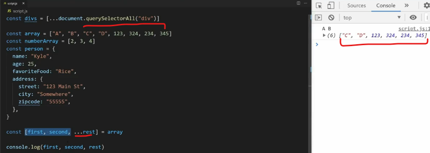
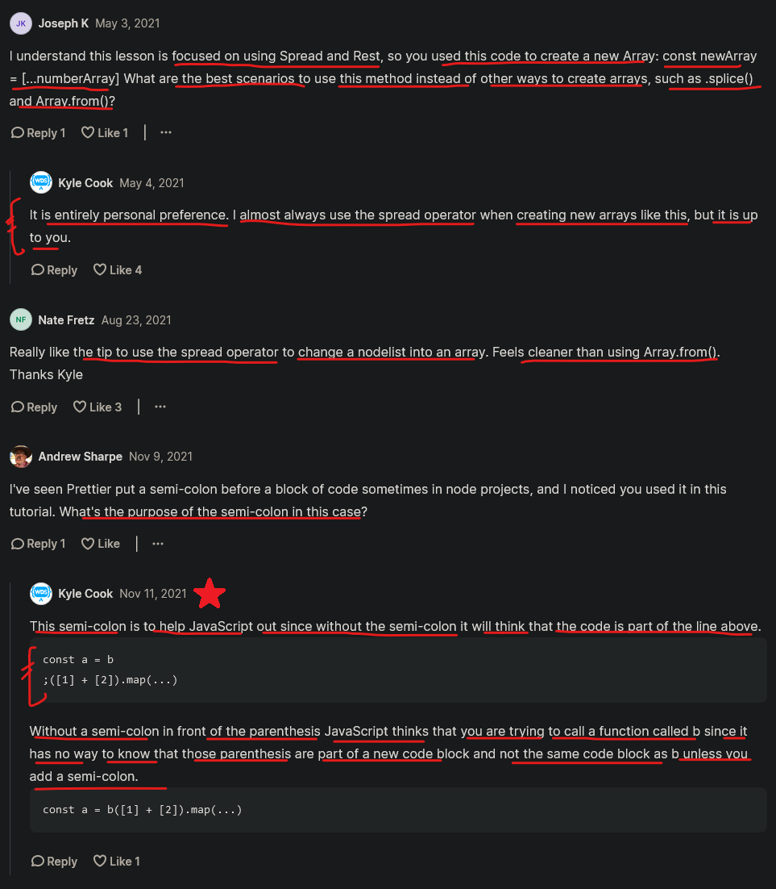

# spread & rest operators

- spread & rest operators are very similar to the destructuring operator
- these topics i.e `destructuring` & `array` & `object` & `spread & rest operators` are related to each other 💡💡💡
- spread & rest operators are used most of the time in Reactjs ✔️
- these two operators used mostly with `array & object` 💡💡💡

- most important 🔥

## Rest operator

```js
function sum(a, b) {
  return a + b
}

console.log(sum(2 , 3)) 
// output : 5
```

- `why we need rest operator ✅` : 
    - if we pass many arguments in the form of an array instead of just two argument like this 

    ```js
    function sum(numbers) {
        return numbers.reduce((sum , number) => sum + number , 0)
    }
    
    console.log(sum([2, 3, 6, 7, 2]))
    // output : 11 
    ```

    - so here we're passing an array as an argument , but what if we pass normal arguments like this 

    ```js
    function sum(numbers) {
        return numbers.reduce((sum , number) => sum + number , 0)
    }
    
    console.log(sum(2, 3, 6, 7, 2))
    // output : error will come because reduce() method need an array in order to work
    ```

    - `reason to use Rest Operator ✅` :
        - here we have multiple arguments so we don't want to create parameters of those each arguments 
        - if we do created parameters for those each arguments 
        - & then what if these arguments become more in numbers in future for the requirement
        - then at that time we can't create parameters for rest of the arguments 💡💡💡
        - that's why we need rest operator

- `how to use Rest Operator ✅` :
    - we use three dotes → `...`
    - don't use more than three dots & don't give space b/w them 💡💡💡
    
    - it takes all the arguments & put them inside an array 💡💡💡
    - if we don't pass any arguments for that rest operator variable then `[]` empty array will come 💡💡💡

- `Example` of Rest operator :

    ```js
    function sum(...numbers) {
        console.log(numbers)
        return numbers.reduce((sum , number) => sum + number , 0)
    }
    
    console.log(sum(2, 3, 6, 7, 2))
    /* output : [2, 3, 6, 7, 2] 
                20 
    */
    ```

    - here we can see that we got the output & even we didn't use the parameters for each arguments 

- `Another Example` of Rest Operator : 

    ```js
    function sum(multiplier , ...numbers) {
        console.log(multiplier)
        console.log(numbers)
        return multiplier * numbers.reduce((sum , number) => sum + number , 0)
    }
    
    console.log(sum(2, 3, 6, 7, 2))
    /* output : 10
                [10, 2, 4] 
                60 
    */
    ```

    - so here `2` argument will be stored in `multiplier` variable 
    - & rest of the arguments will be stored in the form of an array inside `numbers` variable 

- `when to use Rest Operator ✅` : 
    - we use it when we have many arguments & we just already predefined the only 2 or 3 parameters inside that function
    - & in future arguments gets increase & we don't want to pass new parameters for those new arguments 
    - so for all the rest of the arguments , we can use Rest Operator 💡💡💡 

## Spread operator

    - in Rest Operator , 
        - we were passing normal arguments & we store the rest of the arguments inside that Rest operator parameter

    - but in Spread Operator , 
        - we're passing Spread Operator argument & we're storing it inside a normal parameter of the function 💡💡💡   

```js
const numberArray = [2, 3, 4]

function sum(multiplier , ...numbers) {
    console.log(multiplier)
    console.log(numbers)
}

sum(...numberArray)
/* output : 2
            [3, 4]
*/
```

- `Imp Note 🔥` : 
    ```
    - here sum(...numberArray) → means sum(numberArray[0] , numberArray[1] , numberArray[2])
    - that's why we got 2 → value inside multiplier → variable & [3, 4] → value inside rest operator parameter i.e ...numbers
    ```

- `best Practices 🔥` : 
    - instead of getting each values from an array by using this `sum(numberArray[0] , numberArray[1] , numberArray[2])`
    - use the spread Operator 💡💡💡

- `Example` of Spread Operator : 

    ```js
    function concatName(firstName , lastName) {
        console.log(firstName + " " + lastName)
    }

    // without spread operator
    concatName("Steve" , "Jobs")
    // output : Steve Jobs
    ```

    ```js
    function concatName(firstName , lastName) {
        console.log(firstName + " " + lastName)
    }

    const names = ["Steve" , "Jobs"]
  
    // using spread operator
    concatName(...names)
    // output : Steve Jobs
    ```

    - so in spread operator , 
        - if we have multiple values inside an array & we don't want to access each values through their index number 
        - then we can use spread operator argument while calling that function 
        - instead of access each values through index number
        - but we need to define parameters inside that function , to access each values 💡💡💡

- `said by kyle` : 
    - this is the one of the use case of spread operator
    - but this is not that useful & he also don't use this use case very often
    - `very useful use case of spread operator ✅` : 
      - is actually coping arrays 
      - because that spread operator creating a brand new array 💡💡💡

## actual use case of spread operator with Array 🔥

- `first use case of spread operator ✅` : copying/cloning an original array inside another array using spread operator  

    ```js
    const numberArray = [2, 3, 4]
    // copying the array inside another array using spread operator 
    const newArray = [...numberArray]

    console.log(newArray)
    // output : [2, 3, 4]
    ```

        - here we can see that we're copying the array & storing inside another array 
        - means we use the spread operator to copy all the values of numberArray 
        - & then stored inside the another array using square bracket notation → [ ] 💡💡💡

        - & const newArray = [...numberArray] → means const newArray = [numberArray[0] , numberArray[1] , numberArray[2]]

    - `checking whether newArray → array updates it's value or not if we update numberArray` : 

    ```js
    const numberArray = [2, 3, 4]
    // copying the array inside another array using spread operator 
    const newArray = [...numberArray]
    numberArray.push(5)

    console.log(newArray)
    // output : [2, 3, 4] -> of newArray 
    //          [2, 3, 4, 5] -> of numberArray
    ```

      - `Reason` : 
        - here we can see that spread operator allows to clone that array 
        - & if we update/modify the `numberArray` array then `newArray` array doesn't gets updated/modified 💡💡💡
        - means if we do any update inside original array then cloned array will not be updated 
        - because `newArray` array is pointing on a different memory address  
        - & `numberArray` array has been updated after cloning it i.e `newArray` array 💡💡💡
        - but if we do this 
            ```js
            const numberArray = [2, 3, 4]
            const newArray = numberArray // both array is pointing to the same address reference 
            numberArray.push(5)

            console.log(newArray)
            ```
        - then here both array is sharing/pointing to the same memory address reference 
        - now if we update inside any one array then both another one array also gets updated 💡💡💡

- `second very common use case of spread operator ✅` : using spread operator on nodeList (which is not an actual array) 

    html
    ```html
    <div></div>
    <div></div>
    <div></div>
    <div></div>
    <div></div>
    <div></div>
    ```
    javascript
    ```js
    const divs = document.querySelectorAll("div")

    console.log(divs)
    // output : NodeList(5) [div, div, div, div, div, div]
    ```

    - as we know already that `NodeList` is not an actually array 
    - means it doesn't have all the methods of actual array 💡💡💡

    ```js
    // using map() method on "divs" variable 

    divs.map(div => {
        console.log(div)
    })
    // output : we'll get an error because NodeList doesn't know the map() method
    ```

    - so NodeList doesn't contain the map() method 
    - but `NodeList` is kindof an array , so we can use a spread operator on that NodeList

    ```js
    // using a spread operator on NodeList array 
    const divs = document.querySelectorAll("div")
    
    ;[...divs].map(div => {
        console.log(div)
    })
    /* output : all the divs will be printed individually */
    ```

    - `Note ✅` : put the semi colon before the `[...divs]`

    - so the list of all the divs i.e NodeList converted into actual array by using spread operator 
    - most of the time , during selecting elements we use spread operator like this 💡💡💡

    ```js
    const divs = [...document.querySelectorAll("div")] // using spread operator to convert NodeList array into actual array 
    
    divs.map(div => {
        console.log(div)
    })
    // output : all the divs will be printed individually
    ```

    - so here most of the time , we wrap the querySelectorAll() inside the spread operator 
    - & due to this , all the divs converted from `NodeList` array into actual array 💡💡💡
    
    - `Imp Note ✅` : 
        - this kindof syntax with spread Operator → `[...document.querySelectorAll("div")]`
        - we'll see all the time , to convert NodeList array into actual array 
        - so that all methods of array can be used 

## use case of rest operator with Array 🔥

- `first use case of spread operator ✅` : using spread operator with destructuring on array 

    ```js
    const arr = ["A" , "B" , "C" , "D"]

    const [first, second, ...rest] = arr

    console.log(first, second, rest)
    /* output : A B ["C" , "D"] */
    ```

    - if we have many items inside `arr` array like this then output will be this 
    


- now whatever we did the use case of rest & spread operator with array , those all be same with object ✔️

## use case of rest & spread operators with Object 🔥

- `first use case of rest operator with object ✅` : getting rest of the information 
    
    ```js
    const person = {
        username : "Teen" ,
        age : 12 , 
        favoriteFood : "Rice" ,
        address : {
            street : "123 Main St." , 
            city : "Somewhere" 
        } ,
    }

    const {username , age, ...rest} = person

    console.log(username, age, rest)
    /* output : Teen 12
        {   favoriteFood : "Rice" ,
            address : {
                street : "123 Main St." , 
                city : "Somewhere" 
            }
        }
     */
    ```

    - here we got rest of the information of person inside an object 

- `second use case of spread operator with object ✅` : copying/cloning the original object inside an another object 

    ```js
    const person = {
        username : "Teen" ,
        age : 12 , 
        favoriteFood : "Rice" ,
        address : {
            street : "123 Main St." , 
            city : "Somewhere" 
        } ,
    }

    const person2 = {...person} // cloning
    console.log(person2)
    /* output :
        {
            username : "Teen" ,
            age : 12 , 
            favoriteFood : "Rice" ,
            address : {
                street : "123 Main St." , 
                city : "Somewhere" 
            } 
        }
    */
    ```

    - here we used the curly braces i.e `{...person}` because we're using spread operator with object 💡

    - we got the output i.e complete object value of that object variable 

    - `updating the original object ✅`

        ```js
        const person = {
            username : "Teen" ,
            age : 12 , 
            favoriteFood : "Rice" ,
            address : {
                street : "123 Main St." , 
                city : "Somewhere" 
            } ,
        }

        const person2 = {...person} 
        person.name = "Elon" // updating the value of a key
        console.log(person2)
        ```

        - `Imp Note ✅` : 
          - output : `person` object will be updated but `person2` object will not be updated  
          - because both the objects are referencing/pointing to the different memory address 💡💡💡

    - `adding a new key inside person2 → object ✅`

        ```js
        const person = {
            username : "Teen" ,
            age : 12 , 
            favoriteFood : "Rice" ,
            address : {
                street : "123 Main St." , 
                city : "Somewhere" 
            } ,
        }

        const person2 = { ...person , friend: "Elon" } // adding a new key inside an object
        console.log(person2)
        /* output : now person2 has the additional key/property i.e friend */
        ```

    - `combining two objects inside using spread operator & object destructuring ✅`

        ```js
        const person = {
            name : "Teen" ,
            age : 12 , 
            favoriteFood : "Rice" ,
            address : {
                street : "123 Main St." , 
                city : "Somewhere" 
            } ,
        }

        const details = {
            username : "Steve" ,
            age : 11
        }

        const person2 = { ...person , ...details } // combining two object & making into one object
        console.log(person2)
        /* output : now both the objects will be combined & stored inside person2 object */
        ```

    - `overwriting the value of a key of an object ✅`

        ```js
        const person = {
            username : "Teen" ,
            age : 12 , 
            favoriteFood : "Rice" ,
            address : {
                street : "123 Main St." , 
                city : "Somewhere" 
            } ,
        }

        const details = {
            username : "Steve" ,
            age : 11
        }

        const person2 = { ...person , ...details } // overwriting
        console.log(person2)
        ```

        - `output + imp Note 🔥`: 
            - here `username` key is inside the both objects 
            - so if we're combining two or more than two objects 
            - & if any there are same key inside two or more than two objects 
            - then value of a key will be overwrite by very last value of that key 💡💡💡
        
        - so here values of `username & age` keys of `person` object will be overwrite by `details` object 
        - but if we swap the order like this `const person2 = { ...details , ...person }`
        - then values of `username & age` keys of `details` object will be overwrite by `person` object 
        - because `person` object is the last object inside that object destructuring 💡💡💡

        - & this we can do with array destructuring also

## difference b/w spread & rest operators 

- in object destructing , rest & spread operator give output in object form 💡💡💡
- in array destructuring , rest & spread operator give output in array form 💡💡💡

## said by kyle 

- use spread operator with object & array destructuring 💡💡💡
    - when we want to create a brand new object to clone that object
    - or combining the two or more objects & make them into one object
    - or we want to add new properties/key 

    - this is main usage of spread operator with object & array destructuring that he do 

- we're going to see `destructing` , `spread & rest operator` all over the place such as Reactjs 
- & whatever the projects we're going to do we're going to use these features   

## --------------- Extra notes on rest & spread operator ---------------

- videos 
    - https://www.youtube.com/watch?v=sOZwwL_-cBA&ab_channel=TechnicalSuneja
    - https://www.youtube.com/watch?v=wsiAwFtqP64&ab_channel=ThapaTechnical
      - https://www.youtube.com/watch?v=8TT2gK0u2QQ&ab_channel=ThapaTechnical
    - https://www.youtube.com/watch?v=DoIGxx7P-ps&ab_channel=HiteshChoudhary
    - https://www.youtube.com/watch?v=yQOpUYS8W9g&ab_channel=TechGun
      - https://www.youtube.com/watch?v=j1-O7PS1tDc&ab_channel=TechGun
    - https://www.youtube.com/watch?v=ngimOC0V_Q8&ab_channel=YahooBaba
      - https://www.youtube.com/watch?v=ysQFRsYv5VM&ab_channel=YahooBaba

- blogs 

    - https://www.freecodecamp.org/news/javascript-rest-vs-spread-operators/
    - https://medium.com/geekculture/rest-vs-spread-operator-in-javascript-5ec180c82909
    - https://xiaobo.blog/spread-and-rest-operators
    - https://javascript.info/rest-parameters-spread

## discussion page


