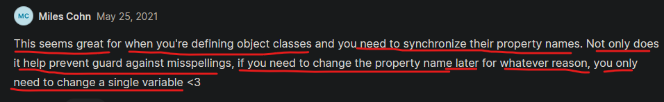

# enhanced object literals 

- is a feature of ES6 
- in ES6 , syntax of object becomes little small 

## object literals with variables 

- Eg : `using normal way` for accessing the value of the variable 
    ```js
    let username = "Teen"
    let age = 12
    const sayHi = function () {
        console.log("Hi")
    }

    // without object literals
    let obj = {
        username : username ,
        age : age ,
        sayHi : sayHi
    }

    console.log(obj)
    /* output : {
        username : "Teen" ,
        age : 12 ,
        sayHi : function () {
          console.log("Hi")
        }
      }         
    */
  ```

- `what is Object Literals` : 
    - if the name of that variable & the property/key of that object are same 
    - then we don't need to define value like this `username : username`
    - instead of this , we can use object literals like this 

- Eg : `using object literals` to access the value of the variable 
    ```js
    let username = "Teen"
    let age = 12
    const sayHi = function () {
        console.log("Hi")
    }

    // using object literals 
    let obj = {
        username ,
        age ,
        sayHi
    }

    console.log(obj)
    /* output : {
        username : "Teen" ,
        age : 12 ,
        sayHi : function () {
          console.log("Hi")
        }
      }         
    */
    ```

- said by kyle
    - so lot of times this would be useful if we're duplicating/copying each variables name inside an object
    - & this we'll see in lot of projects so it's important 

## object literals with functions

- Eg : `using normal way` for creating a function inside an object & accessing it 
    ```js
    let username = "Teen"
    let age = 12

    // without object literals
    let obj = {
        username : username ,
        age : age ,
        sayHi : function () {
        console.log("Hi")
      }
    }

    console.log(obj.sayHi())
    /* output : Hi */
    ```

- `Imp Note🔥` : if we're creating a function inside an object by using object literals 
    - then we don't need to define `function` keyword

- Eg : `using object literals` for creating a function inside an object & accessing it 
    ```js
    let username = "Teen"
    let age = 12

    // using object literals
    let obj = {
        username : username ,
        age : age ,
        sayHi () {
        console.log("Hi")
      }
    }

    console.log(obj.sayHi())
    /* output : Hi */
    ```

- so if we're creating a function inside an object by using object literals 
    - then we don't need to define `function` keyword

## using value of variable as a property name inside an object through Object Literals

- Eg : `using normal way` to access the value of variable as a property name inside an object
    ```js
    let propertyName = "username"
    let firstName = "Teen" 
    let age = 12

    // without object literals
    let person = {
        age : age ,
        sayHi () {
        console.log("Hi")
      }
    }

    person[propertyName] = firstName

    console.log(person.username)
    /* output : Teen */
    ```

- `Imp Note🔥` : if we're accessing the value of a variable as a property name inside an object by using object literals 
    - then we don't need do this way → `person[propertyName] = firstName`

- so if we want to accessing the value of a variable as a property name inside an object by using object literals 
    - then just put the square bracket notation & inside of it define the variable name like this 

- Eg 1 : `using object literals` to access the value of a variable as a property name inside an object
    ```js
    let propertyName = "username"
    let firstName = "Teen" 
    let age = 12

    // using object literals
    let person = {
        [propertyName] : firstName ,
        age : age ,
        sayHi () {
        console.log("Hi")
      }
    }

    console.log(person.username)
    /* output : Teen */
    ```

- Eg 2 : `using object literals` to access the value of a variable as a property name inside an object
    ```js
    let propertyName = "username"
    let firstName = "Teen" 
    let index = 1
    let age = 12

    // using object literals
    let person = {
        [propertyName] : firstName ,
        [`age${index}`] : age ,
        sayHi () {
        console.log("Hi")
      }
    }

    console.log(person)
    /* output : {
            username : Teen ,
            age1 : 12 ,
            sayHi () {
                console.log("Hi")
            }
        } 
    */
    ```

- so here we can see that we used the custom code → `[`age${index}`] : age ,`

- so these all the stuff are related to object literals & how we can use it with different things 
    - object literals is allow use to write the object in less code

## said by kyle 

- this is not that we're going to use very often , but when we need to use it 
    - means object literals would be convenient to do stuff inside object itself 
    - instead of doing these stuff on new lines outside the object ✅

- this is not super crucial & we we're not going to use all the time 
    - but we're probably going to see them in certain places 
    - & helps to write concise & better looking code ✅

## --------------- Extra notes on enhanced object literals ---------------

- videos 
    - https://www.youtube.com/watch?v=471WgxTZ9fE&ab_channel=YahooBaba
    - https://www.youtube.com/watch?v=LNS8Tzssa1A&ab_channel=GeekyShows
    - https://www.youtube.com/watch?v=zH9J1yNMcnE&ab_channel=CoderDost
    - https://www.youtube.com/watch?v=WQK5eXfAnwU&ab_channel=NileshDadheech

- blogs 
    - https://www.sitepoint.com/es6-enhanced-object-literals/
    - https://www.benmvp.com/blog/learning-es6-enhanced-object-literals/
    - https://technicallyjusttalking.com/javascript-es6-enhanced-object-literals/
    - https://students.learnjavascript.today/lessons/enhanced-object-literals/
    - https://dev.to/sarah_chima/enhanced-object-literals-in-es6-a9d

## discussion page


