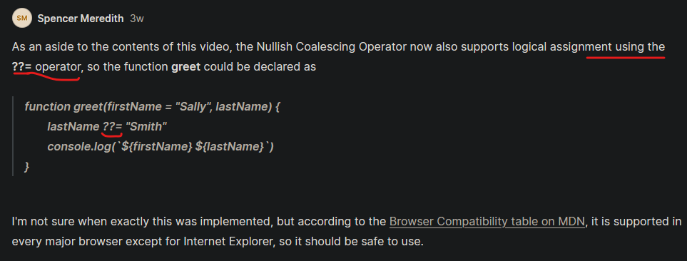

# Null Coalescing

- is a another really easy way to deal with these default values

## prerequisite

- [x] should know about `destructuring` & `default parameters`

## why we need Null Coalescing ✅

- in previous lecture , we're facing error if we don't define default parameter or arguments for that object parameter

```js
function greet(firstName = "Teen" , lastName = "Jobs") {
    console.log(`${firstName} ${lastName}`)
}

greet("Steve" , undefined)
/* output : Steve Jobs */
```
- here we passed `undefined` argument value for `lastName` parameter & still we got correct output

```js
function greet(firstName = "Teen" , lastName = "Jobs") {
    console.log(`${firstName} ${lastName}`)
}

// defining undefined argument for the parameter
greet("Steve" , undefined)
/* output : Steve Jobs */
```
- here we passed `undefined` argument value for `lastName` parameter & still we got the default value as a output 🔥
  - but what if we want default value even if we define `null` argument value for any parameter then we'll get `null` as a output like this 💡💡💡

```js
function greet(firstName = "Teen" , lastName = "Jobs") {
    console.log(`${firstName} ${lastName}`)
}

// defining null argument for the parameter
greet("Steve" , null)
/* output : Steve null */
```

- now here comes `null coalescing` to make things very handy 💡💡💡

## Example : of Null Coalescing ✅

- Eg : `using normal way` with defining `null` as a argument for a parameter
    ```js
    function greet(firstName = "Teen" , lastName) {
        lastName = lastName || "Jobs" // using short circuiting trick (null & undefined are both falsy values)
        console.log(`${firstName} ${lastName}`)
    }

    // defining null argument for the parameter
    greet("Steve" , null)
    /* output : Steve Jobs */
    ```

    - now if we define `undefined` or nothing in second parameter then still we'll get the correct output

- `Note ✅` : 
    ```js
    function greet(firstName = "Teen" , lastName) {
        lastName = lastName || "Jobs" // using short circuiting trick (null & undefined are both falsy values)
        console.log(`${firstName} ${lastName}`)
    }

    // defining empty string or 0(zero) argument for the parameter
    greet("Steve" , "")
    greet("Steve" , 0)
    /* output : Steve Jobs */
    ```

    - we'll still get same output i.e Steve Jobs , which we don't want 
    - means we want to check for only `undefined` or `null`
    - so here we'll use null coalescing operator i.e `??`

- `what is ??` 🔥: 
    - is a null coalescing operator
    - used to check for only these falsy values i.e null & undefined & rest of the falsy values will not be checked 💡💡💡

- Eg : `using null coalescing operator` with defining 0(zero) as argument for the parameter ✅
    ```js
    function greet(firstName = "Teen" , lastName) {
        lastName = lastName ?? "Jobs" // using short circuiting trick (null & undefined are both falsy values)
        console.log(`${firstName} ${lastName}`)
    }

    // defining null argument for the parameter
    greet("Steve" , 0)
    /* output : Steve 0 */
    greet("Steve" , null)
    /* output : Steve Jobs */
    ```

    - so here we passed 0(zero) as a argument for that parameter then we got the right output
        - even still 0(zero) is a falsy vales
        - but if here `lastName ?? "Jobs"` , right side condition is false then left will be executed 💡💡💡

    - so `??` null coalescing operator is only used to check for these falsy values i.e `null` & `undefined` 💡💡💡 


- Eg : `using null coalescing operator` with && and || operator 
    ```js
    console.log(undefined ?? (false && (true || false)))
    ```

    - `best practices` : wrap the condition inside parentheses to know the order of operations or precedence rule 💡💡💡

## --------------- Extra notes on null coalescing ---------------

- videos
    - https://www.youtube.com/watch?v=VD3rfzpHFUI&ab_channel=EatCodeRepeat
    - https://www.youtube.com/watch?v=GbHVrOObGcs&ab_channel=dcode

## discussion page


