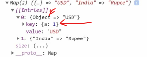
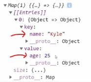
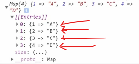

# maps

- is very similar like objects in JS but they have a few additional features on top of them
- here we'll see why Map() class object is different than normal object 💡💡💡

## intro lecture 

- first we'll do normal way without maps & then we'll see how maps work
    - & why maps are better for specific use cases ✔️

## Example : of without using Map() class 

- Eg : `using normal way` (without using Map() class)
    ```js
    const CURRENCY_MAP = {
        "United States" : "USD" ,
        India : "Rupee"
    }

    const currency = CURRENCY_MAP["India"]
    console.log(currency)
    // output : Rupee
    ```
    - inside objects , we know that data stored in key & value pairs

    - another example of this code can be written like this 💡💡💡
    ```js
    const CURRENCIES = {
        { name : "USD" , country : "United States" } ,
        { name : "Rupee" , country : "India" }
    }

    const currency = CURRENCIES.find(c => c.country === "India").name
    ```

    - here both codes are doing same thing

- the most common use case of MAP() class is this kindof code
    ```js
    const CURRENCIES = {
        { name : "USD" , country : "United States" } ,
        { name : "Rupee" , country : "India" }
    }

    const currency = CURRENCIES.find(c => c.country === "India").name
    ```

- `Note💡` : difference b/w normal object & Map() class object
    - normal object is fine to use 
    - but there is another object i.e Map() class 
    - & Map() class → kindof object so much better than normal object 💡💡💡

## How to use Map() class ✅

- Map() is a class constructor & it has own methods & properties 

- `new Map()` : here `new` is a keyword to create object of Map() class

- `Note🔥` : here `M` letter (of Map() class) should be capital because it's a class otherwise error will come 💡💡💡 

- properties & methods of Map() class used 
    - methods
        - `set()` 
        - `get()`
        - `clear()`
        - `delete()`
        - `has()`
        - `forEach()`
        - `entries()`
        - `keys()`
        - `values()`
        
    - properties 
        - `size`
    
- `Map()` class object 
    - takes an array argument & inside that that argument we define all the entires (that we want) 💡💡💡
    - & each entires should be in array form 💡💡💡

## Example : of Map() class 

- Eg 1 : of `Map()` class
    ```js
    const map1 = new Map()

    console.log(map1)
    // output : Map(0) {}
    ```
    - right now Map() class object is completely empty

- `Note🔥` : Map() class object takes in array of arrays as a argument like this 💡💡💡 
    ```js
    const map1 = new Map([

    ])
    ```
    - here inside this array we'll give entires or values as an argument 💡💡💡
    - & each entires is itself as an array 💡💡💡

- Eg 2 : `Map() class` with passing an argument ✅
    ```js
    const map1 = new Map([
        ["United States" , "USD"] ,
        ["India" , "Rupee"] ,
    ])

    console.log(map1)
    ```
    - this is `how we define entires & each entires are in array datatype` & `each entires contain key & it's value`
    - here `United States` is a key & `USD` is a value & same with next entry 
    - & key & it's value will be separated by comma → `,`

    - `output` : 

    

    - so Map() class object is very similar to an normal object 
    
- `Note✅` : `difference b/w Map() class object & normal object` 
    - Map() class object has a few differences than object 
    - due to this Map() class object is really really useful for those specific use cases 👍

## usecases of Map() class object 🔥

- most important 🔥

- `first usecase of Map() class object` : 
    - is that the key can actually be anything
    - in an normal object , the key has to be a string 
        - but inside Map() class object , a key can be an actual object or an array or a boolean value or anything 💡💡💡
    ```js
    const map1 = new Map([
        [{ a: 1 } , "USD"] , // defining a key as an object by using Map() class object
        ["India" , "Rupee"] ,
    ])

    console.log(map1)
    ```
    - `output` : 

    

    ```js
    const map1 = new Map([
        [false , "USD"] , // defining a key as a boolean value by using Map() class object
        ["India" , "Rupee"] ,
    ])

    console.log(map1)
    ```

- `second usecase of Map() class object` : 
    - this is great usecase 
        - mapping one object to another object 💡💡💡
        - means we can map b/w a user & user details like this 

    ```js
    const user = {
        name : "Kyle" ,
    }

    const map1 = new Map([
        [user , { age : 25 }] // mapping an object to another object by using Map() class object
    ])

    console.log(map1)
    ```
    - `output` : 

    

    - here key is a this whole object → `{ userName : "Steve"}`

    - to get the `user` object through Map() class object then use `get()` method of Map() class object
    ```js
    const user = {
        name : "Kyle" ,
    }

    const map1 = new Map([
        [user , { age : 25 }] // mapping an object to another object by using Map() class object
    ])

    console.log(map1.get(user)) // getting object of "user" object 
    // output : { age : 25 }
    ```

    - so we can create a map `by using Map() class object` that maps from a user to the user detail information for that user
        - due to this we don't have to have a huge user object that contains all this information
        - & if we had like user settings , this would be another great use case for this type of situation 💡💡💡

## more differences b/w Map() class object & normal object 🔥

- Eg 1 : of `loop through by forEach() method of an array on Map() object class` 
    ```js
    const user = {
        name : "Kyle"
    }

    const map1 = new Map([
        [1 , "A"] , 
        [2 , "B"] , 
        [3 , "C"] , 
        [4 , "D"]  
    ])

    console.log(map1)
    ```
    - `output` : 

    

    - `first difference b/w them 🔥`  
        - in Map() class object , order of the values is always the same as the order that we added them inside Map() class object itself
        - but in normal object , there is no order specifics 
        - so when we loop through an normal object , then keys & values will not be printed in specific order
        - but if we loop through an Map() class object , then each entires will be printed in order as we defined 💡💡💡

    - `loop through each entires of Map() class object`
        ```js
        const map1 = new Map([
            [1 , "A"] , 
            [2 , "B"] , 
            [3 , "C"] , 
            [4 , "D"]  
        ])

        map1.forEach((value , key) => {
            console.log(value , key)
        })
        /* output : A 1
                    B 2
                    C 3
                    D 4
        */
        ```
    
    - `loop through each key & it's value of an normal object`
        ```js
        const obj = {
            a: 1 ,
            b: 2 ,
            c: 3 ,
            d: 4  
        }

        Object.entries(obj).forEach([ [key, value] ]) => {
            console.log(key , value)
        } 
        /* output : A 1
                    B 2
                    C 3
                    D 4
        */
        ```
        - here we `Object` is a class object 
            - & `entries() method` is used to convert each key & it's value as an error in order to loop through 
            - this is bullshit ✔️✔️✔️
        - & this is not something that we need to do often 
            - that's why `Map() class object` is so much better than normal object in this situation 💡💡💡
            - in order to loop through each entires to get the key & it's value 

- Eg 2 : of `getting size of Map() object class` 
    
    - so we can use `size` property of Map() class object 💡💡💡
    ```js
    const map1 = new Map([
        [1 , "A"] , 
        [2 , "B"] , 
        [3 , "C"] , 
        [4 , "D"]  
    ])

    console.log(map1.size)
    // output : 4
    ```

    - `second difference b/w them 🔥`
        - but normal object doesn't have `size` or `length` property
        - & due to this we need to use `entires()` method of object to figure out the length & this is much more difficult to do 
        - that's why here `Map() class object` has `size` property to get the size or length 

- Eg 3 : of `performance Map() object class` 
    - Map() class object is only specifically created to add information or remove from inside of it & look them up 💡💡💡
    - so `Map()` is much more performant when it comes to adding or removing information from inside of it 
        - when that kindof situation comes i.e Eg 2

## methods of Map() class object 🔥

- we'll see method of Map() class object to get values , set values & so on.. 

- `get() method` : used to get a value of a key of a particular entry
    - takes one argument i.e key of that entry
    ```js
    const map1 = new Map([
        [1 , "A"] , 
        [2 , "B"] , 
        [3 , "C"] , 
        [4 , "D"]  
    ])

    console.log(map1.get(1))
    // output : A
    ```

    - here `1` is a key of first entry

- `set() method` : used to set/add a new entry with key & it's value inside of that new entry
    - takes two arguments i.e first `key` & then value  
    ```js
    const map1 = new Map([
        [1 , "A"] , 
        [2 , "B"] , 
        [3 , "C"] , 
        [4 , "D"]  
    ])

    map1.set(5 , "E") // adding a new entry with key & it's value  
    console.log(map1.get(5))
    // output : E
    ```

- `has() method` : used to check whether that key exist or not & based on that we'll get a boolean value
    - takes one argument i.e key of that entry 
    ```js
    const map1 = new Map([
        [1 , "A"] , 
        [2 , "B"] , 
        [3 , "C"] , 
        [4 , "D"]  
    ])

    console.log(map1.has(6)) // output : false
    console.log(map1.has(1) // output : true
    ```

- `delete() method` : used to delete an entry of that key
    - takes only one argument i.e key of that entry to delete that entry
    ```js
    const map1 = new Map([
        [1 , "A"] , 
        [2 , "B"] , 
        [3 , "C"] , 
        [4 , "D"]  
    ])

    map1.delete(1)
    console.log(map1) // output : we'll not see the entry of "1" key
    ```

- these are the `4 main functions` that we're gonna use a lot with Map() class object 💡💡💡

- `clear() method` : used to delete/clear all the entries from the Map() class object & give brand new empty Map() class object
    - doesn't take any argument
    ```js
    const map1 = new Map([
        [1 , "A"] , 
        [2 , "B"] , 
        [3 , "C"] , 
        [4 , "D"]  
    ])

    map1.clear()
    console.log(map1) // output : Map(0) {}
    ```

## challenge time

- `ques` :
    ```js
    const items = {
        {
            id : 1 ,
            name : "Test 1" , 
            description : "Desc 1"
        },
        {
            id : 2 ,
            name : "Test 2" , 
            description : "Desc 2"
        },
        {
            id : 3 ,
            name : "Test 3" , 
            description : "Desc 3"
        }
    }

    function getItem(id) {
        return items.find(item => item.id === id)
    }

    console.log(getItem(2))
    // output : here we'll get the object of id 2
    ```

    - `what we need to do`
        - take these `items` object & convert into Map() class object
        - & then use that map object inside `getItem` function & so on..

- `Ans` : 
    ```js
    const itemsMap = new Map([
        [1 , {id : 1 , name : "Test 1" , description : "Desc 1"}] ,
        [2 , {id : 2 , name : "Test 2" , description : "Desc 2"}] , 
        [3 , {id : 3 , name : "Test 3" , description : "Desc 3"}]
    ])
    // OR we can write this way also
    const itemsMap = new Map()
    itemsMap.set(1 , {id : 1 , name : "Test 1" , description : "Desc 1"})
    itemsMap.set(2 , {id : 2 , name : "Test 2" , description : "Desc 2"})
    itemsMap.set(3 , {id : 3 , name : "Test 3" , description : "Desc 3"})

    function getItem(id) {
        console.log(itemsMap.get(id)) // getting object of that id
        console.log(itemsMap.has(id)) // checking that key i.e id whether it exist or not
    }
    
    console.log(getItem(2))
    // output : we'll get the object of id 2 
    //          & true or false that whether id 2 exist or not
    ```

## --------------- Extra notes on Map() class object ---------------

- videos 
    - https://www.youtube.com/watch?v=fMfMdE3wifs&ab_channel=HiteshChoudhary
    - https://www.youtube.com/watch?v=hLgUTM3FOII&ab_channel=JavaScriptMastery
    - https://www.youtube.com/watch?v=h01qi0TFf84&ab_channel=TechnicalSuneja

- blogs 
    - https://developer.mozilla.org/en-US/docs/Web/JavaScript/Reference/Global_Objects/Map
    - https://javascript.info/map-set
    - https://masteringjs.io/tutorials/fundamentals/map
    - https://www.freecodecamp.org/news/how-to-use-javascript-collections-map-and-set/
    - https://medium.com/swlh/maps-in-javascript-33508a5cb6e7

## discussion page

 class object")
