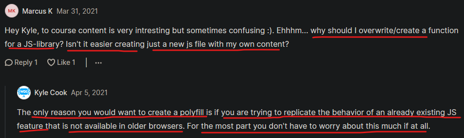

# Polyfill

- here we'll see how to implement those features of js which are not supported by a browser
    - & there are different things which we can use like polyfill , 
    - transpile : means converting that feature from one version to an old version of code <br>
        & generally that's combined with a bundler which is going to bundle up & transpile all of your code for us

- `what is polyfill` : 
    - here we'll talk about polyfills which is a way that we can use JS features which are not supported by browsers 💡💡💡

## Example

script.js file 
```js
const number = 5 

console.log(Math.double(number))
// output : we'll get an error
```
- so here we want to polyfill that `Math.double()` method like this 

- `STEP 1` : create a file as `polyfill.js`

- `STEP 2` : inside of that polyfill.js , write the code }
    ```js
    Math.double = function (number) {
        return number * 2 
    }
    ```
    - so this is going to be a polyfill

- `STEP 3` : add the polyfill.js file inside index.html file
    ```html
    <head>
        <script src="polyfill.js"></script>
        <script src="script.js"></script>
    </head>
    ```

- output : now we'll get `10`

- `what's that polyfill.js file` :
    - so that polyfill.js file took that `Math` object which is buildin JS 
    - & then add the function i.e `double` with our own custom implementation 💡💡💡
    
- `problem` : but one issue that let's say a method already implemented in browser
    - & if we're overriding that method by making polyfill like this ✔️✔️✔️
    - inside script.js file without polyfill 
        ```js
        const number1 = 5 
        const number2 = 6 

        console.log(Math.max(number1, number2))
        // output : 6
        ```
    - making polyfill.js file 
        ```js
        Math.max = function (...numbers) {
            return numbers[0]
        }
        ```
    - output : 5
        - because our custom polyfill i.e `max` method is overriding 
        - that `max` method which is already supported by browser 

- `solution` : that's why always use if else to check that polyfill like this 
    - to check whether that browser has already implemented that feature or not 
    - inside polyfill.js file
        ```js
        if (Math.max === null) {
            Math.max = function (...numbers) {
                return numbers[0]
            }
        }
        ```
    - inside script.js file  
        ```js
        const number1 = 5 
        const number2 = 6 

        console.log(Math.max(number1, number2))
        // output : 6
        ```
    - so here that code of polyfill.js file won't executed because `max` method already exists

- so same thing we can do for `double` method of `Math` object to check
- `STEP 1` : inside polyfill.js file 
    ```js
    if (Math.double == null) {
        Math.double = function (number) {
            return number * 2
        }
    }
    ```
    - inside script.js file 
        ```js
        const number1 = 5 
        const number2 = 6
        
        console.log(Math.double(number1 , number2))
        // output : 10
        ```
    - so here we got output i.e `10` because inside polyfill.js file 
        - we're saying that does that `double` method exist or not 
        - if that method doesn't exist then we're overriding with our own implementation 
        - of that double custom function

- there's tons of polyfills that we can download in libraries form
    - it's just a single file that looks like this which we did
    - but generally they're more complex

## discussion page

 
