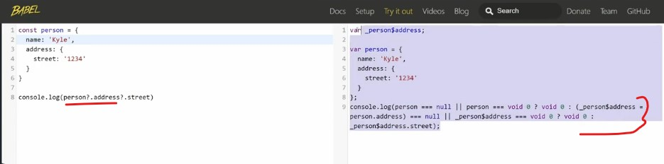

# transpile & babel

- they're like polyfills but allow us to do much more 

- `about transpilers` 
	- this is is next step of polyfills which allows us to take changes in syntax & actually implement them into JS  
    - we don't really need polyfills after using transpilers 
	- but if we just have a really simple function that we need to implement such as like Math.double
    	- so adding in a polyfill is a great way to do

## Babel - most popular transpiler

- so there are many transpilers but most popular is `babel` → https://babeljs.io/

- `what Babel do` : 
    - it reads the JS code & converts it into older Js code (which are implemented in all browsers)

- `using Babel` : 
    - `STEP 1` : click on `try it out` menu
    - & then write the code on left side editor & on right side editor we'll get the old js code like this 
    

    - so here inside left side editor , we used optional chaining & inside right side editor code converted into older JS 

- `plugins in babel` : we can add the plugins 

## setup Babel for project

- `STEP 1` : inside Babel website , click on `Setup` menu
    - & then we can see that there are tons of ways to setup it  
    - so most common way i.e `Babel built-ins` CLI or we can use one of the `Build systems`
    - so a lot of project we'll use parcel & Parcel has `Babel` built into it ✔️

- `STEP 2` : click on `Babel built-ins` CLI 
    - & then we can see `npm install --save-dev @babel/core @babel/cli`
    - so we need to install core & cli of babel
    - & babel cli used to transpile our code 💡💡💡

- `STEP 3` : inside a project folder , creating a package.json file
    - `STEP 3.1` : write this cli command `npm init -y`
    - `STEP 3.2` : then run this `npm install --save-dev @babel/core @babel/cli`
        - package-lock.json file will be created
    - `STEP 3.3` : now inside package.json file
        - inside `scripts` object , create a build scipt
            ```js
            "scripts" : {
                "build" : "babel src -d dest"            
            }
            ```
        - create a `src` folder & put the script.js file inside it
        - here `build` is a script which will run the babel
        - `"babel src -d dest"` means babel will be executed
        - & `src` is a location of all of our different files  
            - `Note ✅` :
                - use this command `"babel script.js -d dest"` if we don't want to create `src` folder <br>
                    & we just have one script file
                - use this `"babel src -d dest"` if we have multiple script file inside `src` folder    
        - & `-d dest` is to define destination 

    - `STEP 3.4` : then run `npm run build`
        - this command going to run the babel build command
        - & then it's going to look in that source folder <br>
            & then going to create a destination folder which contain script.js file 
    
- `STEP 4` : now testing 
    - inside script.js file of src folder
        ```js
        const a = [1, 2, 3]
        console.log(...a)
        ```
    - then run this command i.e `npm run build`
    - now we can see inside the destination i.e script.js file of dest folder <br>
        spread operator is actually supported by babel

    - & right now babel is not doing anything because right now it just copy & paste the code

- now inside `setup` menu of babel , inside `Babel built-ins` CLI 
    - scroll down & see the 4th point which is babel.config.json 
    - so we need to create a config file to tell babel what to do

- `STEP 5` : so now create a new file inside that project outside `src & dest` folders
    - create a babel config file as `babel.config.json`
    - now inside that 4th point of setup babel through `Babel built-ins` CLI <br>
        we can see that we need to create babel preset env , so this is recommended feature set for babel
    - now inside json file we need to put that presets inside babel config file
    - `STEP 5.1` : inside `babel.config.json` file
        ```js
        {
          "presets": ["@babel/preset-env"]
        }
        ```
    - `STEP 5.2` : then `npm install @babel/preset-env --save-dev` run this 
    - `STEP 5.3` : then run `npm run build` command

    - now inside script.js file of `dest` folder , we can see that triple dots converted into order js code 

- that's all to know about babel & if we want to use that destination folder 
    - then link it inside script.js like this 
        ```html
        <head>
            <script src="dest/script.js"></script>
        </head>
        ```
    - `Note` : 
        - when we're developing then a lot of times we don't need to use `dest` folder to link the script.js file of `dest` folder
        - so most of time we use raw file i.e script.js file of `src` folder while developing 💡💡💡
        - but when we're deploying then we use the script.js file of `dest` folder 💡💡💡
        - & these kind of things bundlers can do easily instead of doing manually ✔️✔️✔️

- we can also set targets browsers inside babel config json file

- `about Parcel bundler` : 
    - that's why we use bundler like parcel do all of the behind the scenes for us 
    - even it has builtin babel but we can create our own babel config json file
