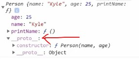
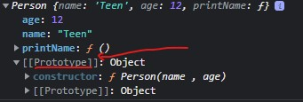
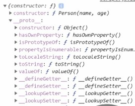
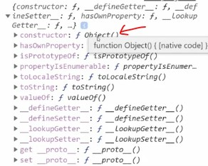
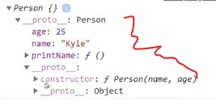
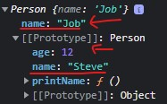
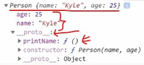
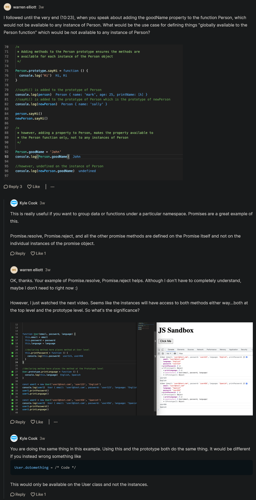

# prototypes

- in this module , we'll see OOPS & this module will be broken down into two different sections
    - `first` : prototype-based section
    - `second` : class-based section 💡💡💡
    
## Why we need to understand prototypes before classes 

- here we'll start with prototypes because that's what JS is built on
    - & classes are just syntactic sugar on top of prototypes
    - so we need to understand prototypes in order to understand classes

## Example - of a constructor class 

```js
function Person(name , age) {
    this.name = name 
    this.age = age 
    this.printName = function () {
        console.log(this.name)
    }
}

const person = new Person("Teen", 12)
console.log(person)
person.printName()
/* output : Person  {name : "Teen" , age : 12 , printName: f} 
            Teen
*/
```

- so here we're adding those properties & methods inside that empty object (which is a value of → this keyword) 💡💡💡

- now to understand how a prototype works , we need to think about how the constructor function works in oops ✔️✔️✔️

## what is a prototype

- so a prototype is a base of a constructor function or a class 
- it's a property of that class or a constructor function
- it contains values in object form
- it's datatype is object

## About output of above code 

```js
function Person(name , age) {
    this.name = name 
    this.age = age 
    this.printName = function () {
        console.log(this.name)
    }
}

const person = new Person("Teen", 12)
console.log(person)
person.printName()
```

- so we'll get either output in this way <br>
     <br>
    or <br>
    
  - so we can see that `__proto__` or `prototype` 💡💡💡

## Accessing prototype of a particular object ✅

```js
function Person(name , age) {
    this.name = name 
    this.age = age 
    this.printName = function () {
        console.log(this.name)
    }
}

const person = new Person("Teen", 12)
console.log(person)
console.log(Object.getPrototypeOf(person))
person.printName()
```

- to get the prototype of `person` object , then we used `getPrototypeOf()` method of `Object` class 

- output : <br> 
    
    - now we can see that prototype has another prototype 
        - because prototype always have further & further prototypes defined on them ✔️✔️✔️
    - & that second `prototype` is the object itself 
        - means as we put `const this = { }` on top inside a constructor function 
        - but behind the scene , JS does means it sets a object value of second prototype of first prototype 
        - like this `__proto__ : object`
        - means we have a `Person` constructor function & the base of that person is an object (which is a value of __proto__)

## inheritance in prototype ✅

```js
function Person(name , age) {
    this.name = name 
    this.age = age 
    this.printName = function () {
        console.log(this.name)
    }
}

const person = new Person("Teen", 12)
console.log(Object.getPrototypeOf(person))
```

- now inside the second prototype (of first prototype) contains different functions like this <br>
  

- let's use `toString()` method (which is inside the second prototype)
    ```js
    console.log(person.toString())
    // output : [object object]
    ```
    - so toString() method converts that `person` object into a string
    - & we can see that inside `Person` constructor function , we don't have toString() function
    - because object variable contains methods & properties , one of them method is `toString()`
    - eg : 
        ```js
        const test = {} // test -> is a object type variable
        console.log(test.toString())
        // output : [object object]
        ```
    - means here `person` as the object as it's prototype , so this is inheritance works in JS
    - so we have `Person` constructor function & `person` object inheriting all the abilities of the object because the object is it's prototype
    - means we're inheriting everything from that prototype of `Person` constructor function

## getting prototype of prototype (of that class or a constructor function)

```js
function Person(name , age) {
    this.name = name 
    this.age = age 
    this.printName = function () {
        console.log(this.name)
    }
}

const person = new Person("Teen", 12)
console.log(Object.getPrototypeOf(Object.getPrototypeOf(person)))
```

- so we're getting second prototype of first prototype , we have two levels of nesting here , output : 
    
    - now we're getting actual object itself because the prototype of our person is that `Person -> constructor function` prototype
    - now we can see that there is no `__proto__` property
    - & if we write do one more level to get another prototype of second prototype like this 
        ```js
        console.log(Object.getPrototypeOf(Object.getPrototypeOf(Object.getPrototypeOf(person))))
        ```
    - then we'll get output : null
    - because there is no prototype 
    - means the object is the top level of our chain of prototypes 💡💡💡
    - so first prototype i.e our `person` object itself & then that has a prototype of object <br>
        & then that object doesn't have any prototype
    - a prototype has value (either a object or it needs to be completely nulls means we don't have prototype at all) 💡💡💡
        - means in JS , by default everything that we create is going to have the object as it's base level prototype 💡💡💡

- if we want to create an object which doesn't contain any properties , methods & no prototypes 
    - then use `create()` method of `Object` class like this 
        ```js
          console.log(Object.create(null))
          // output : {}
        ```
    - so here we got empty object with no properties , methods & even no prototypes
        - after passing `null` then means we want to create an object that doesn't have any prototype 💡💡💡 
        - & this is the only way in JS that we can create an object which doesn't have a prototype (which is the base of object)
    - but if we print empty object like this 
        ```js
          console.log({})
          // output : __proto__ : object
        ```
        - we can see that now this empty object has a prototype (which is set to an object)
    - we can create an object that has a prototype of our `Person` constructor function
        ```js
        function Person(name , age) {
            this.name = name 
            this.age = age 
            this.printName = function () {
                console.log(this.name)
            }
        }

        const person = new Person("Teen" , 12)
        console.log(Object.create(person))
        // output : Person {}
        //          __proto__ : Person
        ```
        - now we can see that we've created an empty object & it has a prototype of our `Person` construction function like this 
        
    - & we can see that `person` object doesn't have properties of it's own 
        - but still we can access properties of `Person` constructor function like this
        ```js
        function Person(name , age) {
            this.name = name 
            this.age = age 
            this.printName = function () {
                console.log(this.name)
            }
        }

        const person = new Person("Teen" , 12)
        console.log(Object.create(person).name)
        // output : Teen
        ```

## `working of inheritance & prototypes in JS ✅`  

- the way inheritance & prototypes work in JS is that when we call a method or a property on a object
    - then JS does that , JS first goes to the very first level of our prototype <br>
        which is itself i.e `person` object  
    - & then `person` object function will ask from itself that do we have `name` property
    - so `person` object will say we don't have `name` property right now 
    - so JS goes to next prototype (which is second one) & then do we have a `name` property on that second prototype <br>
        - so we have `name` property 💡💡💡
    - & let's say we trying to access that property which doesn't exist inside that `Person` constructor function like this 
        ```js
        console.log(Object.create(person).sadfdsf)
        // output : undefined
        ```
    - we got `undefined` because in first prototype there is no any property with that name i.e `sadfdsf`
        - so JS will go to next prototype (which is second nested prototype) & there is also no property with that name
        - so & again JS will go into prototype for our object & again there is no property with that name
        - & now prototype of our object is null , so JS will return `undefined` 💡💡💡


- example : 
    ```js
    function Person(name , age) {
        this.name = name 
        this.age = age 
        this.printName = function () {
            console.log(this.name)
        }
    }

    const person = new Person("Steve" , 12)
    const person2 = Object.create(person)
    person2.name = "Job"
    console.log(person2.name)
    ```
    - output : <br> 
        
        - now at first we got name as `Job` But in first prototype we got `Steve` value of `name` property
        - because inside prototype chain , first value of `name` property is `job` that's why we got `job` first that's why 
        
    - but if we print `console.log(person2.age)` then 
        - inside prototype chain , firstly we'll not get the age , so JS will goes into next prototype
        - so inside next prototype there is a `age` property then JS will return that value of `age` property

- so that's why how inheritance & prototype works , |
    - so JS constantly go down & down inside prototype chain until it finds what it's looking for 💡💡💡 

- if we check whether `person2` is equal to `person` object or not like this 
    ```js
    function Person(name , age) {
        this.name = name 
        this.age = age 
        this.printName = function () {
            console.log(this.name)
        }
    }

    const person = new Person("Steve" , 12)
    const person2 = Object.create(person)
    console.log(Object.getPrototypeOf(person2) === person)
    // output : true
    ```
    - we got true as a output because when we call object.create with person like this `const person2 = Object.create(person)`
    - then means we're setting the prototype of person2 to that actual object i.e `person`

## how to add things inside prototypes ✅

- so as we add things inside `Person` constructor function by using `this` keyword
    - so same thing we do by using `prototype` property on that constructor function or that class 💡💡💡

- example - of adding things by using `prototype` property
    ```js
    function Person(name , age) {
        this.name = name 
        this.age = age 
    }

    Person.prototype.printName = function() {
        console.log(this.name)
    }

    const person = new Person("Teen" , 12)
    console.log(person)
    ```
    - output : we'll get this <br> 
    
    - so we can see that `printName` function is not coming inside `Person` object
    - but inside first prototype of `Person` object , `printName` function is coming
    - but if access printName() function through `person` object then we'll get output like this 
        ```js
        function Person(name , age) {
            this.name = name 
            this.age = age 
        }

        Person.prototype.printName = function() {
            console.log(this.name)
        }

        const person = new Person("Teen" , 12)
        person.printName()
        // output : Teen
        ```

## said by Kyle ✅

- generally if we try to add functions to an object then we use `prototype` property on that class or that constructor function
    - instead of defining/adding/creating a function directly inside that class or that constructor function using `this` keyword 💡💡💡
    - & even we want to create a function which will be static through the code like this 
        ```js
        function Person(name , age) {
            this.name = name 
            this.age = age 
        }

        Person.printHi = function() {
            console.log("Hi")
        }

        Person.goodName = "Steve"
        
        // calling a function without creating an object
        Person.printHi() // output : Hi
        console.log(Person.goodName) // output : Steve 
        ```
        - so we can define things as globally outside the `Person` constructor function 
        - or we can define things that are available on each instance of the `Person` constructor function
            - by adding them through `prototype` property of that class or that constructor function 
    - either one option is fine 💡💡💡

## ---- Extra notes on prototype ----

- videos 
  - https://www.youtube.com/watch?v=yfYY4ykJgK8&ab_channel=TechnicalSuneja
  - https://www.youtube.com/watch?v=6b601MrVEi0&ab_channel=CodeStepByStep
  - https://www.youtube.com/watch?v=kCb8HVgMzMo&ab_channel=GeekyShows
  - https://www.youtube.com/watch?v=7wFduiQPOt4&ab_channel=TechGun
  
- blogs
  - https://developer.mozilla.org/en-US/docs/Learn/JavaScript/Objects/Object_prototypes
  - https://www.javascripttutorial.net/javascript-prototype
  - https://www.freecodecamp.org/news/a-beginners-guide-to-javascripts-prototype

## discussion page


