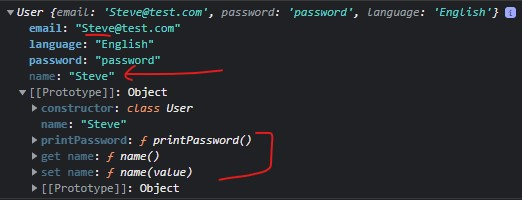
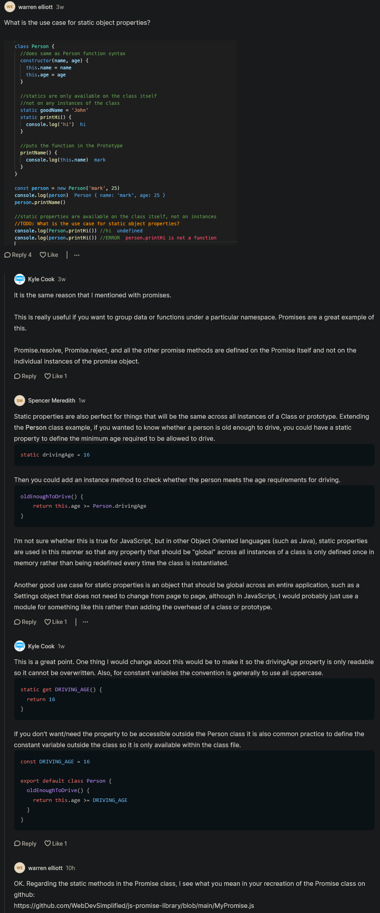

# class basics

- now we'll see how we can convert all of those prototype code into OOPS code

## prototype based code

```js
function Person(name , age) {
    this.name = name 
    this.age = age 
}

Person.prototype.printName = function() {
    console.log(this.name)
}

Person.printHi = function() {
    console.log("Hi")
}

Person.goodName = "Steve"

Person.printHi()
console.log(Person.goodName) 
```

- now we can use classes in JS instead of directly using & accessing prototypes & creating constructor function 
    - which do all of these same stuff behind the scenes but make writing the code much easier

## converting prototype based code into class based code 

- Eg : of creating a constructor function through prototype based code
    ```js
    function Person(name , age) {
        this.name = name 
        this.age = age 
    }

    const person = new Person("Steve" , 12)
    console.log(person)
    ```

- Eg 1 : of creating constructor function through class based code
    ```js
    class Person {
        constructor(name , age) {
            this.name = name 
            this.age = age 
        } 
    }

    const person = new Person("Steve" , 12)
    console.log(person)
    ```
    - so here `class` is a keyword & `c` should be in small letter 
        - & `constructor` is a special type of function & before it , `function` keyword won't come
        - & always one class has one constructor means it shouldn't be more than one 💡💡💡
    - & behind the scenes , JS convert this class based code into prototype based code 💡💡💡

- Eg 2 : defining a function inside the class instead of using prototype way
    ```js
    class Person {
        constructor(name , age) {
            this.name = name 
            this.age = age 
        }

        printName() {
            console.log(this.name)
        }
    }

    const person = new Person("Teen" , 12)
    console.log(person)
    console.log(person.printName()) // output : Teen
    ```
    - `Note` : we always define functions inside that class not inside the constructor function of that class 💡💡💡

    - output : inside first prototype of `Person` class , we have that `printName` function

    - `Note` : inside the class , if we want to create a normal function then we don't use `function` keyword 💡💡💡
        - because class is similar like an object 

- Eg 3 : working on static method through class based way
    - so we have `printHi` & `goodName` which is a static method that we created inside prototype lecture
        - now let's create them by using class based way
    - so we have `two ways` to create static methods through class based way 💡💡💡
    
    - Eg 3.1 : `first way of defining static methods & properties through class based way ✔️` 
        ```js
        class Person {
            constructor(name , age) {
                this.name = name 
                this.age = age 
            }

            printName() {
                console.log(this.name)
            }
        }

        Person.printHi = function() {  // -------+
            console.log("Hi")   //               |-> first way of defining static methods
        }   // ----------------------------------+

        Person.goodName = "Teen" // -> first way of defining static properties

        const person = new Person("Teen" , 12)
        console.log(Person.printHi()) // output : Hi
        console.log(Person.goodName) // output : Teen
        ```
        - so we use that class name to define static methods & properties
        - & if we want to create static methods & properties outside that class 
            - then use that class name then define outside that class 💡💡💡

    - Eg 3.2 : `second way of defining static methods & properties through class based way i.e static keyword ✔️`
        ```js
        class Person {
            constructor(name , age) {
                this.name = name 
                this.age = age 
            }

            static printHi() { //   ------------+
                console.log("Hi") //            |-> second way of defining static methods
            } // -------------------------------+

            static goodName = "Teen" // -> second of defining static properties

            printName() {
                console.log(this.name)
            }
        }

        const person = new Person("Teen" , 12)
        console.log(Person.printHi()) // output : Hi
        console.log(Person.goodName) // output : Teen
        ```
        - so if we want to define static methods & properties inside that class then use `static` keyword
          - & we make those things `static` which are doing only one particular thing always 
          - & they meant to do one particular thing only 
        - `Note` : 
            - to create a static normal functions inside the class then don't use `function` keyword
            - & to create a static property inside the class then don't use `const` keyword 
        - `Note` : 
            - we can't access static methods & properties of that class through that object of that class 
            - otherwise we'll get `undefined` 💡💡💡
            - because we can only access static methods & properties (of that class) through that class only 
                - because we have created those static methods & properties inside only that class , not the objects of that class 💡💡💡
        - so here that printHi static method will looks like this kindof 
            ```js
            {
                function printHi() {

                }
            }
            ```

## Challenge Time

- `Ques` : converting this code in prototype based & class based also
    ```js
    function createUser(email , password , language) {
        return { 
            email , 
            password , 
            language , 
            printPassword() {
                console.log(this.password)
            } 
        }
    }

    console.log(createUser("test@test.com" , "password" , "English"))
    ```

- `Ans` : prototype + constructor function based way
    ```js
    function User(email , password , language) {
        this.email = email
        this.password = password
        this.language = language
    }

    User.prototype.printPassword = function() {
        console.log(this.password)
    } 

    const user = new User("test@test.com" , "password" , "English")
    console.log(user)
    ```
    - output : we'll get the User object & inside first prototype of it , we have `printPassword()` function 

- `Ans` : class based way
    ```js
    class User {
        constructor(email , password , language) {
            this.email = email
            this.password = password
            this.language = language
        }

        printPassword() {
            console.log(this.password)
        }
    }

    const user = new User("test@test.com" , "password" , "English")
    console.log(user)
    ```

- so class syntax is much easier to read than prototype syntax 💡

## using getters & setters inside the class ✅

- Eg : of using getters & setters inside that class 
    ```js
    class User {
        constructor(email, password, language) {
            this.email = email 
            this.password = password 
            this.language = language 
        }

        get name() {
            return this.email.split('@')[0]
        }

        set name(value) {
            const [, suffix] = this.email.split('@')
            this.email = value + "@" + suffix
        }

        printPassword() {
            console.log(this.password)
        }
    }

    const user = new User("test@test.com" , "password" , "English")
    console.log(user.name) // output : test
    user.name = "Steve"
    console.log(user.email) // Steve@test.com 
    ```
    - output of `console.log(user)`
        - inside the `User` object , there is a property i.e `name` which is a getter
        - `name` contain `Steve` value & `test` word will be replaced by `Steve` like this
        

- so class based way is a best way instead of using prototype based way

## discussion page


