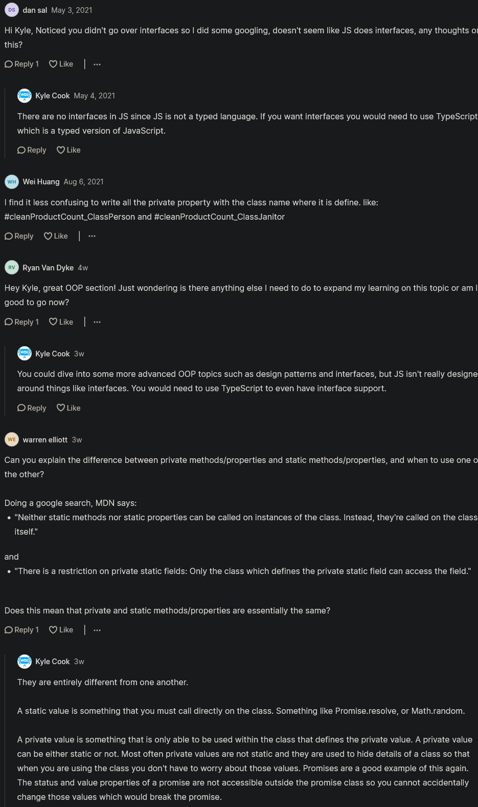

# Public, Private, And Protected Properties

- here we'll talk about public , private & protected methods & properties
    - which are used with inheritance & helps us to write cleaner & cleaner code 💡💡💡


## public properties & methods 

- `what is public properties & methods` : 
    - means those methods & properties can be access through that class 
    - & subclass (which are inheriting or extending that class)  
    - & we can access them through the object or instance (of that class) also

- Eg : of public properties & methods
    ```js
    class Person {
        constructor(name) {
            this.name = name 
        }
    }

    class Janitor extends Person {
        constructor(name , numberOfMops) {
            super(name)
            this.numberOfMops = numberOfMops 
        }

        clean() {
            console.log(`Cleaned with ${this.numberOfMops} mops`)
        }
    }

    const janitor = new Janitor("Jerry" , 5)
    console.log(janitor) // output : janitor {name: "Jerry" , numberOfMops: 5}
    console.log(janitor.name) // output : name
    console.log(janitor.clean()) // output : Cleaned with 5 mops
    ```
    - most of the time in JS , we deal entirely with public methods & properties 💡💡💡
        - because JS doesn't has best way to make private & protected properties & methods 

## private properties & methods 

- `what is private properties & methods` : 
    - means those methods & properties can be access through only that class 
    - & subclass (which are inheriting or extending that class)  
    - but those private properties & methods can't access through the object or instance (of that class) 💡💡💡

- `Reason why we need to make private properties & methods` : 
    - because inside the main class or subclasses (of that main class) , we generally want to encapsulate
    - a bunch of important information let's say `Janitor` subclass
    - Eg : let's say that `numberOfMops` variable we want to make it as private 
        - because we never want the user to actually modify that variable & see the other important information
        - so we want to hide them to limit the complexity of the user from using the `janitor` object 💡💡💡
    
    - `Imp Note 🔥`
        - means when we do `console.log(janitor.n)` then we'll get two options that we can use
        - & generally if we do something like this , then we'll get more options
        - then means the more difficulty it is to write a program because there's so many different ways to do things
        - but if we limit the options then the user can only use the class in a few certain ways 
        - & due to this , it's not only makes code easier to write because there's less ways that code can break
        - but also makes easier to use that code because there's less options to use it 💡💡💡

- use only that browser which supports this feature

- Eg : of private properties & methods 
    ```js
    class Person {
        constructor(name) {
            this.name = name 
        }
    }

    class Janitor extends Person {
        constructor(name , numberOfMops) {
            super(name)
            this.numberOfMops = numberOfMops 
        }

        internalOnlyVariable = true

        clean() {
            console.log(`Cleaned with ${this.numberOfMops} mops`)
        }
    }

    const janitor = new Janitor("Jerry" , 5)
    console.log(janitor.internalOnlyVariable) // output : true 
    ```
    - we got output because behind the scenes , this line `internalOnlyVariable = true` 
        - converted into `this.internalOnlyVariable = true` , 
            - so we don't need to put `this` keyword just like `clean()` function 💡💡💡
        - but if we define inside the constructor function of that class (either main or subclass) 
            - then we need to put `this` keyword 💡💡💡 

    - now we want to make that variable as private & only `Janitor` subclass can access
    - so to make a private method or a property then we use `#` symbol before the name of that variable or a function 💡💡💡
    ```js
    class Person {
        constructor(name) {
            this.name = name 
        }
    }

    class Janitor extends Person {
        constructor(name , numberOfMops) {
            super(name)
            this.numberOfMops = numberOfMops 
        }

        #internalOnlyVariable = true // now this is private property or a variable 

        clean() {
            console.log(`Cleaned with ${this.numberOfMops} mops`)
        }
    }

    const janitor = new Janitor("Jerry" , 5)
    console.log(janitor.internalOnlyVariable) // output : undefined
    ```
    - & even if we do like this to access internalOnlyVariable `console.log(janitor.#internalOnlyVariable)`
        - then we'll get an error which means we can't access that private variable 

- Eg 2 : `using that private variable inside the clean() function of Janitor subclass ✅`
    ```js
    class Person {
        constructor(name) {
            this.name = name 
        }
    }

    class Janitor extends Person {
        constructor(name , numberOfMops) {
            super(name)
            this.numberOfMops = numberOfMops 
        }

        #internalOnlyVariable = true // now this is private property or a variable 

        clean() {
            // using that private property or a variable inside clean() function of Janitor subclass
            if (this.internalOnlyVariable === true) { 
                console.log("Hi")
            }
            console.log(`Cleaned with ${this.numberOfMops} mops`)
        }
    }

    const janitor = new Janitor("Jerry" , 5)
    console.log(janitor.clean())
    // output : Hi
    //          Cleaned with 5 mops
    ```

- `Note of using private property/variable or method ✅` :
    - if we want to use that private property/variable or method inside that main class or subclasses
    - then use it by defining complete name of it including `#` sign 💡💡💡
    ```js
    class Person {
        constructor(name) {
            this.name = name 
        }
    }

    class Janitor extends Person {
        constructor(name , numberOfMops) {
            super(name)
            this.numberOfMops = numberOfMops 
        }

        #cleaningProductCount = 10 

        clean() {
            console.log(`Cleaned with ${this.numberOfMops} mops and ${this.#cleaningProductCount} cleaning products`)
        }
    }

    const janitor = new Janitor("Jerry" , 5)
    console.log(janitor.clean())
    // output : Cleaned with 5 mops and 10 cleaning products
    ```
    
    - now we want to use setter for that `#cleaningProductCount` variable or property for few checks 
    ```js
    class Person {
        constructor(name) {
            this.name = name 
        }
    }

    class Janitor extends Person {
        constructor(name , numberOfMops) {
            super(name)
            this.numberOfMops = numberOfMops 
        }

        #cleaningProductCount = 10 

        set cleaningProductCount(value) {
            if (value > 5) {
                this.#cleaningProductCount = value 
            }
        }

        clean() {
            console.log(`Cleaned with ${this.numberOfMops} mops and ${this.#cleaningProductCount} cleaning products`)
        }
    }

    const janitor = new Janitor("Jerry" , 5)
    janitor.cleaningProductCount = 7
    console.log(janitor.clean()) // output : Cleaned with 5 mops and 7 cleaning products
    ```
    - when we updating the value of private variable/property or method 
        - then always use `this` keyword otherwise we'll get an error 💡💡💡

    - output : if we set `janitor.cleaningProductCount = 3` then we'll get 10 because value is less than 5 
        - so that `if block statement` won't run 

- `said by kyle ✅` : 
    - so making variables/properties or methods private are really useful if want to hide away implementation details 💡💡💡

- but one problem that private variables/properties or methods are only available in that class where we defined 
    ```js
    class Person {
        constructor(name) {
            this.name = name 
        }
    }

    class Janitor extends Person {
        constructor(name , numberOfMops) {
            super(name)
            this.numberOfMops = numberOfMops 
        }

        #cleaningProductCount = 10 

        set cleaningProductCount(value) {
            if (value > 5) {
                this.#cleaningProductCount = value 
            }
        }

        clean() {
            console.log(`Cleaned with ${this.numberOfMops} mops and ${this.#cleaningProductCount} cleaning products`)
        }
    }

    class SuperJanitor extends Janitor {
        #cleaningProductCount = 100 
    }

    const superJanitor = new SuperJanitor("Jerry" , 5)
    console.log(superJanitor.clean())
    // output : Cleaned with 5 mops and 10 cleaning products
    ```
    - so here we can see that we got `10` cleaning products 
        - because private variables/properties or methods are only accessible in that class , they're created
        - & they're not available inside the children classes like `SuperJanitor` child class of `Janitor` main class
        - so `SuperJanitor` child class extending the `Janitor` main class
            - but `SuperJanitor` child class doesn't have access of that private property (which is defined inside `Janitor` main class)
            - so `#cleaningProductCount` private property only available inside `Janitor` main class 💡💡💡
            - so due to this , protected variables comes in

## protected properties & methods

- `what is protected properties & methods` :
    - means a protected methods or a protected property is just like a private variable 
        - which can't access through the object/instance of that class (either main or subclass)
        - but we can access a protected methods or a protected property inside all the sub or child classes of that main class 💡💡💡

- `ways to create protected properties & methods` : 
    - so in JS , we don't have the way to create protected properties & methods
    - but we can fake it by using `_` underscore sign before that property or that method

- Eg : of creating protected properties & methods
    ```js
    class Person {
        constructor(name) {
            this.name = name 
        }
    }

    class Janitor extends Person {
        constructor(name , numberOfMops) {
            super(name)
            this.numberOfMops = numberOfMops 
        }

        _cleaningProductCount = 10 // created a protected variable or property

        set cleaningProductCount(value) {
            if (value > 5) {
                this._cleaningProductCount = value 
            }
        }

        clean() {
            console.log(`Cleaned with ${this.numberOfMops} mops and ${this._cleaningProductCount} cleaning products`)
        }
    }

    class SuperJanitor extends Janitor {
        _cleaningProductCount = 100 
    }

    const superJanitor = new SuperJanitor("Jerry" , 5)
    console.log(superJanitor._cleaningProductCount) // output : 100
    console.log(superJanitor.clean()) // output : Cleaned with 5 mops and 100 cleaning products
    ```
    - now `_cleaningProductCount` can't be access through the instance or object of that class (either a main or child class) 💡💡💡
        - but we can use that protected property inside the child class of that main class (which can be either child class also)

    - so we got output 
        - means `SuperJanitor` child class extending the `Janitor` class 
        - & `_cleaningProductCount` protected property is created inside the `Janitor` class  
        - & now that `SuperJanitor` child class can access that protected property of `Janitor` class 
    - & we're able to access that protected property through the instance or object of that `SuperJanitor` child class
        - but technically don't want that protected property should be accessible through that object
        - & generally if we're working with JS , & if we see `_` underscore before the name of (variable or function)
            - then it's supposed to be private & user should not access that protected variable or method
        - but there's no way to make a variable or method as protected inside JS , so this is the one way ✔️✔️✔️

- Eg 2 : `usecase of private property or method ✅`
    ```js
    class Person {
        constructor(name) {
            this.name = name 
        }
    }

    class Janitor extends Person {
        constructor(name , numberOfMops) {
            super(name)
            this.numberOfMops = numberOfMops 
        }

        _cleaningProductCount = 10 // created a protected variable or property

        set cleaningProductCount(value) {
            if (value > 5) {
                this._cleaningProductCount = value 
            }
        }

        clean() {
            this.#helperFunction()
            console.log(`Cleaned with ${this.numberOfMops} mops and ${this._cleaningProductCount} cleaning products`)
        }

        #helperFunction() {
            console.log("help")
        }
    }

    class SuperJanitor extends Janitor {
        _cleaningProductCount = 100 
    }

    const superJanitor = new SuperJanitor("Jerry" , 5)
    console.log(superJanitor.clean()) 
    // output : help 
    //          Cleaned with 5 mops and 100 cleaning products
    ```
    - so here we got `help` message

- `said by kyle` 
    - this is not super important to understand
    - but generally knowing when and where to use private functions & private properties & OOPs concept 💡💡💡
    - & even protected properties & protected methods is great because it'll drastically cleanup the code 
    - & whatever we learned this is not a lot 

## discussion page 


