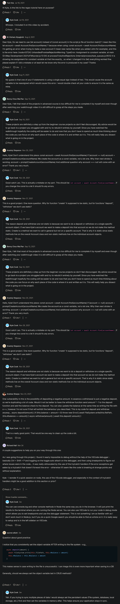

# ATM CLI project

- we'll be using OOPs concept in this project & this project will be CLI based
- we'll focus heavily on using OOPs programming to build this project

## About the project

- ATM where we can deposit & withdraw money & to simulate this money
    - we're just gonna have have a text file that shows the balance of the account in a number
    - means we're not gonna use any api , just simple text file
    - that either gets added or removed from the text file to show the actual balance of the account

- & this project will be based on Nodejs application , so we'll not using Browser

- `Note` : we must have new Nodejs version , so that we can use newer features of JS such as Private variables
    - `node -v` use this command to check the version of Nodejs
    - & if we're using older version of Nodejs then we need to use like Babel to transpile the code 

## Complete code 

<details>
    <summary>.gitignore file</summary>

```
accounts
```
</details>

<details>
    <summary>Account.js file</summary>

```js
const FileSystem = require("./FileSystem")

module.exports = class Account {
  constructor(name) {
    this.#name = name
  }

  #name
  #balance

  get name() {
    return this.#name
  }

  get balance() {
    return this.#balance
  }

  get filePath() {
    return `accounts/${this.name}.txt`
  }

  async #load() {
    this.#balance = parseFloat(await FileSystem.read(this.filePath))
  }

  async withdraw(amount) {
    if (this.balance < amount) throw new Error()
    await FileSystem.write(this.filePath, this.#balance - amount)
    this.#balance = this.#balance - amount
  }

  async deposit(amount) {
    await FileSystem.write(this.filePath, this.#balance + amount)
    this.#balance = this.#balance + amount
  }

  static async find(accountName) {
    const account = new Account(accountName)

    try {
      await account.#load()
      return account
    } catch (e) {
      return
    }
  }

  static async create(accountName) {
    const account = new Account(accountName)

    await FileSystem.write(account.filePath, 0)
    account.#balance = 0

    return account
  }
}
```
</details>

<details>
    <summary>CommandLine.js file</summary>

```js
const readline = require("readline")

module.exports = class CommandLine {
  static ask(question) {
    const rl = readline.createInterface({
      input: process.stdin,
      output: process.stdout,
    })

    return new Promise(resolve => {
      rl.question(`${question} `, answer => {
        resolve(answer)
        rl.close()
      })
    })
  }

  static print(text) {
    console.log(text)
  }
}
```
</details>

<details>
    <summary>FileSystem.js file</summary>

```js
const fs = require("fs")

module.exports = class FileSystem {
  static read(path) {
    return new Promise((resolve, reject) => {
      fs.readFile(path, (err, data) => {
        if (err) return reject(err)
        resolve(data)
      })
    })
  }

  static write(path, content) {
    return new Promise((resolve, reject) => {
      fs.writeFile(path, content.toString(), err => {
        if (err) return reject(err)
        resolve()
      })
    })
  }
}
```
</details>

<details>
    <summary>script.js file</summary>

```js
const Account = require("./Account")
const CommandLine = require("./CommandLine")

async function main() {
  try {
    const accountName = await CommandLine.ask(
      "Which account would you like to access?"
    )
    const account = await Account.find(accountName)
    if (account == null) account = await promptCreateAccount(accountName)
    if (account != null) await promptTask(account)
  } catch (e) {
    CommandLine.print("ERROR: Please try again")
  }
}

async function promptCreateAccount(accountName) {
  const response = await CommandLine.ask(
    "That account does not exist. Would you like to create it? (yes/no)"
  )

  if (response === "yes") {
    return await Account.create(accountName)
  }
}

async function promptTask(account) {
  const response = await CommandLine.ask(
    "What would you like to do? (view/deposit/withdraw)"
  )

  if (response === "deposit") {
    const amount = parseFloat(await CommandLine.ask("How much?"))
    await account.deposit(amount)
  } else if (response === "withdraw") {
    const amount = parseFloat(await CommandLine.ask("How much?"))
    try {
      await account.withdraw(amount)
    } catch (e) {
      CommandLine.print(
        "We were unable to make the withdrawal. Please ensure you have enough money in your account."
      )
    }
  }

  CommandLine.print(`Your balance is ${account.balance}`)
}

main()
```
</details>

## Code Explanation 

- `STEP 1` : inside the project folder , create `script.js` file
    - this `script.js` file will contain main bulk of the code 
    - & to run this script.js file , run this command `node script.js`  
        - then questions we're gonna `ask a few questions from the user`
        - like what account they're trying to access
        - & what they wanna do in that account (such as add money , withdraw money , view money & so on..)

- `STEP 2` : now think about what we're going to have in this program
    ```js
    // after running the program we're gonna ask these predefined questions from the user
    // 1. Ask for a account
    // then check that account exist or not
    // 2. If account doesn't exist then ask to create account
    // & if that account that exists & is created then we need to ask them what they want to do
    // 3. Ask what they want to do
    // 4. Execute command
        // 4.1 : View 
        // 4.2 : Withdraw
        // 4.3 : Deposit
        // so essentially add , subtract & view
    ```
    - now in order to do all of these different tasks 
        - we need to think about the different things our program needs to do
        - because in OOPs programming , important to think about the different objects
        - in our program as different models , so we can model everything in our program as different objects ✔️

    - so the first thing we're going to have is an account means we'll have an account object
        - that encapsulates all of the logic for our account (such as balance , updating the balance , withdrawing , viewing & so on..) 
        - so we're going to have an account object
        ```js
        // Account -> is gonna handle all of our account related information
        ```
        - & implementing code for this is not super straightforward what other types of objects or models
            - we're gonna use for that above TODO tasks
            - so right now we can think about `Account` which is pretty safe place to start
            - & from there , we'll start adding objects & classes as we need

- `STEP 3` : create a file as `Account.js` 
  - `Note 🤔` : we give first letter of this file in Capital 
      - because generally when kyle dealing with classes
      - then like to capitalize the first letter of name of that file
      - & this is personal preference 

  - `STEP 3.1` : inside Account.js file
      ```js
      module.exports = class Account {

      }      
      ```
      - so we're exporting that Account class from this module i.e Account.js file 
      - `Imp Note 🔥` : always give class name same (including capital letter) as same as that we have to the file name 💡💡💡

  - `STEP 3.2` : inside script.js file 
      ```js
      // after running the program we're gonna ask these predefined questions from the user
      // 1. Ask for a account
      // then check that account exist or not
      // 2. If account doesn't exist then ask to create account
      // & if that account that exists & is created then we need to ask them what they want to do
      // 3. Ask what they want to do
      // 4. Execute command
          // a. View 
          // b. Withdraw
          // c. Deposit

      // Account
      const Account = require("./Account")
      ```
  - now first thing we need to do i.e Ask for a account 
    - so we need to get the user input 
    - & to get the user input only through JS without html
    - then we need to use a library i.e readline (which is builtin library in Nodejs) ✔️✔️✔️
  
  - `STEP 3.3` : getting builtin nodejs `readline` library 
    - inside script.js file
        ```js
        const Account = require("./Account")
        const readline = require("./readline")

        const rl = readline.createInterface({
          input : process.stdin , 
          output : process.stdout 
        })
        ```  
      - & now we're created instance of that "readline" 
      - & inside `createInterface()` method of readline , we need to pass a object which contain input & output 
      - so inside terminal , we're gonna run a program to get the input from the user & get the output of that input

  - now we need to ask a question 
  - `STEP 3.4` : asking a question from the user through readline
      - inside script.js file 
        ```js
          const Account = require("./Account")
          const readline = require("./readline")

          const rl = readline.createInterface({
            input : process.stdin , 
            output : process.stdout 
          })

          rl.question("Which account would you like to access? " , answer => {
            console.log(answer)
          })
        ```
        - testing this question code 
        - so `question()` method of readline library takes two arguments 
          - `first` : question we want to ask
          - `second` : callback through which we want to return the answer of that question 

        - so run this command `node script.js`
          - then we'll get that question & when we write like apple
          - then we'll get the answer i.e apple
          - so here `question()` method is taking the answer & returning back that answer
        - `Note ✅` : we can see that inside the terminal that after that answer gets returned
          - then our program doesn't actually end
          - because we need to close the `readline` after using it 
          - & that's important to do ✔️✔️✔️

    - `STEP 3.4.1` : closing the readline inside script.js file
      ```js
      const Account = require("./Account")
      const readline = require("./readline")

      const rl = readline.createInterface({
        input : process.stdin , 
        output : process.stdout 
      })

      rl.question("Which account would you like to access? " , answer => {
        console.log(answer)
        rl.close()
      })
      ``` 
      - now inside terminal if we do same thing & the answer gets returned then the program will gets end

  - now if we see the todo tasks then we're asking question three times i.e from 1 to 3rd todo
    - so it would be nice if we encapsulate this line of code of asking questions <br>
      & even printing out responses/output because writing out the this same code will be the pain
    - great thing about OOPs that we can encapsulate certain features <br>
      & functions all into one object that takes care of everything 💡💡💡
    ```js
    rl.question("Which account would you like to access? " , answer => {
      console.log(answer)
      rl.close()
    })
    ```

  - `STEP 3.5` : so create a file as `CommandLine.js`
      - inside CommandLine.js file
          ```js
          module.exports = class CommandLine {
            
          }
          ```
        - so this class will contain static methods i.e for printing out things to our screen i.e questions & answers

    - `STEP 3.5.1` : inside CommandLine.js file 
      ```js
      module.exports = class CommandLine {
        static ask(question) {

        } 

        static print(text) {
          console.log(text)
        }
      }
      ```
      - so print() static function is not technically really needed to create it 
        - but since we're encapsulating all the logic for CommandLine class & printing & asking into one object  
        - so putting print() function will cleans up the code 
        - but in the future we'll change inside this file only instead of changing it everywhere in our code

    - `STEP 3.5.2` : now coping the code of question ask & answer from script.js file & pasting inside CommandLine.js file
      - inside scrip.js file , copy this line code 
        ```js
        const rl = readline.createInterface({
          input : process.stdin , 
          output : process.stdout 
        })

        rl.question("Which account would you like to access? " , answer => {
          console.log(answer)
          rl.close()
        })
        ```
      - & paste it inside CommandLine.js file
        ```js
        module.exports = class CommandLine {
          static ask(question) {
            const rl = readline.createInterface({
              input : process.stdin , 
              output : process.stdout 
            })

            rl.question("Which account would you like to access? " , answer => {
              console.log(answer)
              rl.close()
            })
          } 

          static print(text) {
            console.log(text)
          }
        }
        ```

    - `STEP 3.5.3` : now converting that question code from callback based into promise based code inside CommandLine.js file
        ```js
        module.exports = class CommandLine {
          static ask(question) {
            const rl = readline.createInterface({
              input : process.stdin , 
              output : process.stdout 
            })

            return new Promise(resolve => {
              rl.question(`${question} `, answer => {
                resolve(answer)
                rl.close()
              })
            })
          } 

          static print(text) {
            console.log(text)
          }
        }
        ```
      - `Note` : here we didn't gave `reject` argument because there is no way for this to fail 💡💡💡
      - now we did this to encapsulate all the logic related to creating read lines , <br>
        asking questions & printing answer out to the console , all the stuff in that CommandLine class 💡💡💡 

    - `STEP 3.5.4` : importing CommandLine.js file inside script.js file 
        ```js
        const Account = require("./Account")
        const CommandLine = require("./CommandLine")
        const readline = require("./readline")

        CommandLine.ask("Which amount would you like to access?").then(response => {
          CommandLine.print(response)
        })
        ```
      - so here we removed these lines code from script.js file i.e
        ```js
        const rl = readline.createInterface({
          input : process.stdin , 
          output : process.stdout 
        })

        rl.question("Which account would you like to access? " , answer => {
          console.log(answer)
          rl.close()
        })
        ```
  - now when we run the command `node script.js` then we'll get this error i.e we don't have access of readline
  - `STEP 3.6` : importing `readline` inside CommandLine.js file instead of inside script.js file
    - removing `const readline = require("readline")` from script.js file 
      ```js
      const Account = require("./Account")
      const CommandLine = require("./CommandLine")

      CommandLine.ask("Which amount would you like to access?").then(response => {
        CommandLine.print(response)
      })  
      ```
    - & inside CommandLine.js file
      ```js
      const readline = require("readline")

      module.exports = class CommandLine {
        static ask(question) {
          const rl = readline.createInterface({
            input : process.stdin , 
            output : process.stdout 
          })

          return new Promise(resolve => {
            rl.question(`${question} `, answer => {
              resolve(answer)
              rl.close()
            })
          })
        } 

        static print(text) {
          console.log(text)
        }
      }
      ``` 
    - `STEP 3.6.1` : now run the command `node script.js`
      - then we'll get that question & then write something let's say Teen
      - then we'll get Teen → as a output  

- now we're gonna deal with a lot of asking questions & promises 
  - so we're gonna put that CommandLine.ask() code inside async function 
- `STEP 4` : putting CommandLine.ask() code inside async function of script.js file 
    ```js
    const Account = require("./Account")
    const CommandLine = require("./CommandLine")

    async function main() {
      const accountName = await CommandLine.ask("Which amount would you like to access?")
    }

    main()
    ```
  - now we need to check that account exist or not & if not exist then create the account
  - `STEP 4.1` : checking whether that user with that account exist or not
      ```js
      const Account = require("./Account")
      const CommandLine = require("./CommandLine")

      async function main() {
        const accountName = await CommandLine.ask("Which amount would you like to access?")

        const account = Account.find(accountName)
      }

      main()
      ```
    - `STEP 4.1.1` : inside Account.js file
        ```js
        module.exports = class Account {
          static find(accountName) {

          }
        }
        ```
    - `STEP 4.1.2` : create a folder as `accounts` & inside of it , create a txt file as `steve.txt`
      - & inside `steve.txt` file , & let's say in my account , balance is `1000` 

    - now we need to find if there's an account that has `steve` name or not 
      - so we have to ways to do checks
      - `First way` : inside find() function , we could write the code that checks our file system <br> 
        to see if there's a file with that name i.e `steve.txt` inside that `accounts` folder when we pass the account name
        but instead of doing this we have second way
      - `second way` : we'll create an account object & try to load that account object & if it fails to load <br>
        then we'll assume that account doesn't exist but if it does correctly load then we know that account exists 💡💡💡

    - `STEP 4.1.3` : create an account object to check whether that account exists inside `accounts` folder or not 
      - inside Account.js file
        ```js
        module.exports = class Account {
          // it's take time because we need to access the file system that's why we use async await syntax 
          async static find(accountName) {
            const account = new Account(accountName)

            await account.load()
          }
        }
        ```

    - now to think about how that load() function & account about is going to work <br>
      let's just create all of the account class means just think about that `account` object as a whole ✔️✔️✔️
    - `STEP 4.1.4` : inside Account.js file 
        ```js
        module.exports = class Account {

          constructor(name) {
            this.#name = name
          }

          #name

          get name() {
            return this.#name
          }

          async static find(accountName) {
            const account = new Account(accountName)

            await account.load()
          }
        }
        ```
      - now made the `name` as a private variable so that after defining , we can never change the name of the account
        - `Note` : & we defined the `#name` private variable outside the `constructor()` otherwise we'll get an error ✔️✔️✔️
      - & we created the getter `name()` function because we never want to give the ability to change that name variable 
        - means we only want to give the ability to access & read to people without changing it
        - otherwise we'll have problems where we're trying to change an account's name & things gets messed everything up 

    - another thing that account will contain i.e balance & that balance is what we need to load inside that `load()` function
      - because that balance is coming the .txt file
    - `STEP 4.1.5` : inside Account.js file , working on the balance & load it 
        ```js
        module.exports = class Account {

          constructor(name) {
            this.#name = name
          }

          #name
          #balance

          get name() {
            return this.#name
          }

          async static find(accountName) {
            const account = new Account(accountName)

            await account.load()
          }
        }
        ```
      - we again made the `balance` as private variable because we don't want to change their balance
        - means we when we go to the ATM , they don't ask from us `what would you like balance to be?` 
        - but they don't do ask , so the only way to change the balance is by accessing proper methods<br>
          which are defined on our account 💡💡💡
      
      - `STEP 4.1.5.1` : creating getter for a balance
        - inside Account.js file
          ```js
          module.exports = class Account {

            constructor(name) {
              this.#name = name
            }

            #name
            #balance

            get name() {
              return this.#name
            }

            get balance() {
              return this.#balance
            }

            async static find(accountName) {
              const account = new Account(accountName)

              await account.load()
            }
          }
          ``` 
      - `STEP 4.1.5.2` : using load() function to get that balance
        - inside Account.js file
          ```js
          const fs = require("fs")

          module.exports = class Account {

            constructor(name) {
              this.#name = name
            }

            #name
            #balance

            get name() {
              return this.#name
            }

            get balance() {
              return this.#balance
            }

            get filePath() {
              return `accounts/${this.name}.txt`
            }

            #load() {
              fs.readFile(this.filePath , (err , data) => {
                if (err) console.error(err)
                this.#balance = parseFloat(data) // here we're getting that data which is inside the txt file
              })
            }

            async static find(accountName) {
              const account = new Account(accountName)

              await account.#load()
            }
          }
          ``` 
        - so here `fs` means file system which is built in nodejs 
          - & we're importing file system in order to access that .txt file 💡💡💡 
        - & we made the getter for getting the file path
        - inside load() function , `readFile()` method of `fs` takes two arguments i.e 
          - `first` : file path 
          - `second` : callback (which takes two arguments i.e error & data which is inside that txt file) 💡💡💡
        
        - main important thing that we hidden all of the information 
          - that we don't want to show the outside world to have access to 
          - like we don't want allow user to directly change our name & balance that's why we made them private variable 
          - & we also made `load()` function as private function because we don't want them using this function<br>
            outside of the actual implementation of our `Account` class
            - because when we're actually getting an account then we want to use that find() method
            - so `load()` private function will be only used inside of our account 

        - we made `await account.#load()` asynchronous because inside `load()` private function , 
          - `readFile()` method using a callback , so we don't need to pass callbacks  

      - `STEP 4.1.8` : convert code into promise based syntax inside `#load()` 
        - inside Account.js file
          ```js
          const fs = require("fs")

          module.exports = class Account {

            constructor(name) {
              this.#name = name
            }

            #name
            #balance

            get name() {
              return this.#name
            }

            get balance() {
              return this.#balance
            }

            get filePath() {
              return `accounts/${this.name}.txt`
            }

            #load() {
              return new Promise((resolve , reject) => {
                fs.readFile(this.filePath , (err , data) => {
                  if (err) return reject(err)
                  this.#balance = parseFloat(data) // here we're getting that data which is inside the txt file
                  resolve() // we're not returning that balance , so that's why we called resolve() function 
                })
              })
            }

            async static find(accountName) {
              const account = new Account(accountName)

              await account.#load()
            }
          }
          ```
      
    - now we're reading & writing to files a lot , so that would be great if we encapsulate that data inside of it's own class
    - `STEP 4.2` : create a file as `FileSystem.js` & inside of it 
        ```js
        const fs = require("fs")

        module.exports = class FileSystem {
          static read(path) {
            return new Promise((resolve, reject) => {
              fs.readFile(path, (err, data) => {
                if (err) return reject(err)
                resolve(data)
              })
            })
          }

          static write() {}
        }
        ```
      - `STEP 4.2.1` : inside Account.js file
          - remove this line code `const fs = require('fs')` & write this const FileSystem = require("./FileSystem") like this
          - & making doing changes inside `#load()` private function
          ```js
          const FileSystem = require("./FileSystem")

          module.exports = class Account {

            constructor(name) {
              this.#name = name
            }

            #name
            #balance

            get name() {
              return this.#name
            }

            get balance() {
              return this.#balance
            }

            get filePath() {
              return `accounts/${this.name}.txt`
            }

            async #load() {
              // here "FileSystem" class is doing all reading information
              this.#balance = parseFloat(await FileSystem.read(this.filePath)) 
            }

            async static find(accountName) {
              const account = new Account(accountName)
              
              try {
                await account.#load() 
                return account
              } catch (e) {
                return
              }
            }
          }
          ```
        - if we have an account then #load() private function will work properly
          - because if we read a file through this code `FileSystem.read(this.filePath)` & that file exist 
          - then inside `try` block we'll return account 
          - but if we try to read a file that doesn't exist then it's gonna throw an error
          - which will be caught inside `catch` block then we'll return nothing 💡💡💡

    - `STEP 4.3` : inside script.js file , check that do we have that account
        ```js
        const Account = require("./Account")
        const CommandLine = require("./CommandLine")

        async function main() {
          const accountName = await CommandLine.ask("Which account would you like to access?")
          const account = Account.find(accountName)
          if (account) {
            console.log("Found Account")
          } else {
            console.log("Cannot Find") 
          }
        }

        main()
        ```
      - output : run `node script.js` then we'll get error i.e async static find(accountName)

      - `STEP 4.3.1` : inside Account.js file 
          ```js
          static async find(accountName) {
            const account = new Account(accountName)
            
            try {
              await account.#load() 
              return account
            } catch (e) {
              return
            }
          }
          ```
        - `Note` : always define `static` keyword before `async` because of keyword order otherwise we'll get an error 💡💡💡

      - testing output : now run `node script.js` then we'll get that question then write `Teen` then we'll get `Found Account`
        - but if we write that account which doesn't exist then we still get `Found Account` message
        - so there is a an error inside script.js file because this is the file that we changed very recently 💡💡💡

      - `STEP 4.3.2` : inside script.js file 
          ```js
          // 1. Ask for account
          // 2. If account does not exist ask to create account
          // 3. Ask what they want to do
          // 4. Execute command
              // a. view 
              // b. withdraw
              // c. Deposit

          const Account = require("./Account")
          const CommandLine = require("./CommandLine")

          async function main() {
            const accountName = await CommandLine.ask("Which account would you like to access?")
            const account = await Account.find(accountName)
            if (account) {
              console.log("Found Account")
            } else {
              console.log("Cannot Find") 
            }
          }

          main()
          ````
        - so here we can see that we need to wait on this line i.e `Account.find(accountName)` 
          - because `Account.find()` is an asynchronous function because it takes time to load the account
          - so that's why we need to await one this line 
      
      - testing output : now run `node script.js` then we'll get that question then write `Teen` then we'll get `Found Account`
        - but if we write that account which doesn't exist then we still get `Cannot Found` message
        - so things are working correctly

  - so we completed the first ask from the todo i.e `1. Ask for account`

- now second task is `if account doesn't exist then ask to create an account`

- `STEP 5` : inside script.js file , creating an account if that account doesn't exist 
    ```js
    // 2. If account does not exist ask to create account
    // 3. Ask what they want to do
    // 4. Execute command
        // a. view 
        // b. withdraw
        // c. Deposit

    const Account = require("./Account")
    const CommandLine = require("./CommandLine")

    async function main() {
      const accountName = await CommandLine.ask("Which account would you like to access?")
      const account = await Account.find(accountName)
      if (account == null) promptCreateAccount(accountName) // here we created the function to create an account
      if (account) {
        console.log("Found Account")
      } else {
        console.log("Cannot Find") 
      }
    }

    function promptCreateAccount(accountName) {
      
    }

    main()
    ```
  - `best practices ✅` : so here we're making `promptCreateAccount()` function 
    - because we need to make things clear & breaking things into individual functions 💡💡💡 

  - now inside `promptCreateAccount()` function , we want to ask a questions from that user
  - `STEP 5.1` : inside script.js file
      ```js
      const Account = require("./Account")
      const CommandLine = require("./CommandLine")

      async function main() {
        const accountName = await CommandLine.ask("Which account would you like to access?")
        const account = await Account.find(accountName)
        if (account == null) promptCreateAccount(accountName) 
        if (account) {
          console.log("Found Account")
        } else {
          console.log("Cannot Find") 
        }
      }

      function promptCreateAccount(accountName) {
        // here we put the Yes or No also
        const response = await CommandLine.ask("That account does not exist. Would you like to create it? (yes/no)")

        if (response == 'yes') {
          return await Account.create(accountName)
        }
      }

      main()
      ```
    - so here we didn't create the else block for `no` because we only want to create that account if user say `yes`
      - so we don't need `no` case

  - `STEP 5.2` : inside Account.js file , create a `create()` function inside static async `find()` function
      ```js
      const FileSystem = require("./FileSystem")

      module.exports = class Account {

        constructor(name) {
          this.#name = name
        }

        #name
        #balance

        get name() {
          return this.#name
        }

        get balance() {
          return this.#balance
        }

        get filePath() {
          return `accounts/${this.name}.txt`
        }

        async #load() {
          this.#balance = parseFloat(await FileSystem.read(this.filePath)) 
        }

        async static find(accountName) {
          const account = new Account(accountName)
          
          try {
            await account.#load() 
            return account
          } catch (e) {
            return
          }
        }

        static async create(accountName) {
          const account = new Account(accountName)
        }
      }
      ```  
    - now we didn't load that account yet because right now there's no file 
      - so we need to create a file as txt format for that account  

    - `STEP 5.2.1` : inside Account.js file , create a txt file for that account for loading
        ```js
        async #load() {
          this.#balance = parseFloat(await FileSystem.read(this.filePath)) 
        }

        async static find(accountName) {
          const account = new Account(accountName)
          
          try {
            await account.#load() 
            return account
          } catch (e) {
            return
          }
        }

        static async create(accountName) {
          const account = new Account(accountName)

          await FileSystem.write(account.filePath, 0) // this will create the account with a zero balance
        }
        ```
      - so `write()` method will take two arguments i.e file path & content
        - & second argument of `write()` method we're passing `0` 
        - because we don't have any text at all right now with no balance
        - so `0` will be default value 

  - `STEP 5.3` : inside FileSystem.js file , working on `static write()` function
      ```js
      const fs = require("fs")

      module.exports = class FileSystem {
        static read(path) {
          return new Promise((resolve, reject) => {
            fs.readFile(path, (err, data) => {
              if (err) return reject(err)
              resolve(data)
            })
          })
        }

        static write(path, content) {
          return new Promise((resolve, reject) => {
            fs.writeFile(path, content.toString(), err => {
              if (err) return reject(err)
              resolve()
            })
          })
        }
      }
      ```
    - so `writeFile()` method of `fs` takes 3 arguments i.e file path , content in string form & error
    - & we called `resolve()` function with nothing means we successfully wrote that information
      - so `write()` static function is similar as `read()` static function 
      - but in our case inside `write()` , we're writing data that file 
      - & that `writeFile()` method gonna overwrite everything whatever inside that file 💡💡💡

  - testing output : run `node script.js` & we'll get an error means we need to make `promptCreateAccount()` as async function
  - `STEP 5.4` : inside script.js file , making `promptCreateAccount()` function as async function
      ```js
      const Account = require("./Account")
      const CommandLine = require("./CommandLine")

      async function main() {
        const accountName = await CommandLine.ask("Which account would you like to access?")
        const account = await Account.find(accountName)
        if (account == null) await promptCreateAccount(accountName) // here we're waiting 
      }

      async function promptCreateAccount(accountName) { // making this function as async 
        const response = await CommandLine.ask("That account does not exist. Would you like to create it? (yes/no)")

        if (response == 'yes') {
          return await Account.create(accountName)
        }
      }

      main()
      ```
    - testing output : now run `node script.js` 
      - then we'll get `which account would you like to access?` message then write let's say `steve`
      - then we'll not get any error 
      - but let's say we try to access that account which doesn't exist like `John`
        - then we'll get this `That account does not exist. Would you like to create it? (yes/no)` message
        - then we write `yes` , 
        - now we can see inside `accounts` folder , `John.txt` is created & inside of it , balance is `0` 💡💡💡

    - so inside Account.js file , that `static async create()` function is working fine

  - `STEP 5.5` : inside Account.js file , now set the balance manually
      ```js
      async #load() {
        this.#balance = parseFloat(await FileSystem.read(this.filePath)) 
      }

      async static find(accountName) {
        const account = new Account(accountName)
        
        try {
          await account.#load() 
          return account
        } catch (e) {
          return
        }
      }

      static async create(accountName) {
        const account = new Account(accountName)

        await FileSystem.write(account.filePath, 0) 
        account.#balance = 0 

        return account
      }
      ```
    - so `static async create()` function is doing is that 
      - it's creating a brand new account object 
      - & it's creating a file to go along that account i.e `await FileSystem.write(account.filePath, 0)`
      - & it's initializing our balance at `0` as default balance in that account while creating that account first time
      - & then we're returning that account which is created 

  - `STEP 5.6` : inside script.js file , set the account in that condition
        ```js
        const Account = require("./Account")
        const CommandLine = require("./CommandLine")

        async function main() {
          const accountName = await CommandLine.ask("Which account would you like to access?")
          const account = await Account.find(accountName)
          if (account == null) account = await promptCreateAccount(accountName) 
          if (account != null) await promptTask(account)
        }

        async function promptCreateAccount(accountName) { 
          const response = await CommandLine.ask("That account does not exist. Would you like to create it? (yes/no)")

          if (response == 'yes') {
            return await Account.create(accountName) // here we're returning that create() function
          }
        }

        async function promptTask(account) {
          // here options are view , deposit , withdraw
          const response = await CommandLine.ask("What would you like to do? (view/deposit/withdraw)") 

          if (response === "deposit") {
            // ques is how much user want to deposit
            const amount = await CommandLine.ask("How much?")
            await account.deposit(amount)
          } 
        }

        main()
        ```
      - `Note` : await account.deposit(amount)
        - we made this line as "await" because depositing requires modifying inside a file
        - that's why modifying a file will be done as asynchronous way 💡💡💡  

    - `STEP 5.6.1` : inside Account.js file , now create a deposit function
        ```js
        async deposit(amount) {
        }
        ```
        - so depositing require two steps 
          - `first` : is writing the data to their file
          - `second` : is updating our internal balance of a specific account
        ```js
        async deposit(amount) {
          this.#balance = this.#balance + amount
        }
        ```
        - now next step is to update the balance inside that specific account
          - but the important thing is to update the file first before updating the balance 
          - because inside Account.js , inside `load()` function , `await FileSystem.read(this.filePath)` 
          - means if we fail to update the file then we don't want user account balance to be out of sync with the actual file 💡💡💡
        ```js
        async deposit(amount) {
          // here we're updating the balance inside that account also 
          await FileSystem.write(this.filePath, this.#balance + amount)
          // & updating new balance value of #balance private variable 
          this.#balance = this.#balance + amount
        }
        ```

    - testing output : run command `node script.js`
      - then we'll get `which account would you like to access?` message then access account let's say `steve`
      - & currently inside steve.txt account , balance is 100
      - so we'll get `What would you like to do? (view/deposit/withdraw)` message then write deposit
      - then we'll get `How much?` message then write 30
      - now inside `steve.txt` file , we'll see 10030 which is not correct output

    - so inside `steve.txt` file , change 10030 into 100

    - `STEP 5.6.2` : inside script.js file , convert/parse the amount into float
        ```js
        const Account = require("./Account")
        const CommandLine = require("./CommandLine")

        async function main() {
          const accountName = await CommandLine.ask("Which account would you like to access?")
          const account = await Account.find(accountName)
          if (account == null) account = await promptCreateAccount(accountName) 
          if (account != null) await promptTask(account)
        }

        async function promptCreateAccount(accountName) { 
          const response = await CommandLine.ask("That account does not exist. Would you like to create it? (yes/no)")

          if (response == 'yes') {
            return await Account.create(accountName) // here we're returning that create() function
          }
        }

        async function promptTask(account) {
          const response = await CommandLine.ask("What would you like to do? (view/deposit/withdraw)") 

          if (response === "deposit") {
            const amount = parseFloat(await CommandLine.ask("How much?")) // converted into float
            await account.deposit(amount)
          } 
        }

        main()
        ```

    - output : run the command `node script.js`
      - then we'll get `which account would you like to access?` message then access account let's say `steve`
      - & currently inside steve.txt account , balance is 100
      - so we'll get `What would you like to do? (view/deposit/withdraw)` message then write `deposit`
      - then we'll get `How much?` message then write 30
      - now inside `steve.txt` we can see that there is `130` balance 

    - one nice thing we can notice in our code i.e our account encapsulates all of the logic for account related activities
      - so actually we're only dealing with our `account` object or `Account` class which is easy
      - like `account.deposit()` , `Account.create()` , `Account.find()` , etc
      - so we don't need to worry about the actual code means 
      - we know that whenever we call something through `account` object or `Account` class then it'll do everything behind the scenes

- now let's work on withdraw functionality
- `STEP 6` : inside script.js file 
    ```js
    const Account = require("./Account")
    const CommandLine = require("./CommandLine")

    async function main() {
      const accountName = await CommandLine.ask("Which account would you like to access?")
      const account = await Account.find(accountName)
      if (account == null) account = await promptCreateAccount(accountName) 
      if (account != null) await promptTask(account)
    }

    async function promptCreateAccount(accountName) { 
      const response = await CommandLine.ask("That account does not exist. Would you like to create it? (yes/no)")

      if (response == 'yes') {
        return await Account.create(accountName) 
      }
    }

    async function promptTask(account) {
      const response = await CommandLine.ask("What would you like to do? (view/deposit/withdraw)") 

      if (response === "deposit") {
        const amount = parseFloat(await CommandLine.ask("How much?"))
        await account.deposit(amount)

        // this is used to print the current balance of that account
        CommandLine.print(`Your balance is ${account.balance}`) 
      }

      if (response === "withdraw") {
        const amount = parseFloat(await CommandLine.ask("How much?"))
        await account.withdraw(amount)

        // this is used to print the current balance of that account
        CommandLine.print(`Your balance is ${account.balance}`) 
      } 
    }

    main()
    ```
  - `STEP 6.1` : inside Account.js file 
      ```js
      async withdraw(amount) {

      }
      ```
      - `Note` : withdraw function will be different than deposit because we need to make sure the user has enough money 
        - in their account to actually do the withdrawal 💡💡💡
        - so we need to use condition for checks 
      ```js
      async withdraw(amount) {
        if (this.balance < amount) throw new Error()
        await FileSystem.write(this.filePath, this.#balance - amount)
        this.#balance = this.#balance - amount
      }

      async deposit(amount) {
        await FileSystem.write(this.filePath, this.#balance + amount)
        this.#balance = this.#balance + amount
      }
      ```
      - here `if (this.balance < amount) throw new Error()` means throw an error if that account don't have enough money
      - otherwise withdraw the money <br>
        i.e `await FileSystem.write(this.filePath, this.#balance - amount)` & `this.#balance = this.#balance - amount`

  - testing output : run the command `node script.js`
      - then we'll get `which account would you like to access?` message then access account let's say `steve` account
      - now inside `steve.txt` we can see that there is `130` balance
      - so we'll get `What would you like to do? (view/deposit/withdraw)` message then write `withdraw`
      - then we'll get `How much?` message then write 30
      - output : Your balance is 100 & when we go inside `steve.txt` file then we'll see 100
    - but let's say when we withdraw of higher amount like `200` then we'll get an error

  - so let's catch the error inside withdraw condition inside script.js file
  - `STEP 6.2` : inside script.js file , catching that error for `withdraw`
      ```js
      const Account = require("./Account")
      const CommandLine = require("./CommandLine")

      async function main() {
        const accountName = await CommandLine.ask("Which account would you like to access?")
        const account = await Account.find(accountName)
        if (account == null) account = await promptCreateAccount(accountName) 
        if (account != null) await promptTask(account)
      }

      async function promptCreateAccount(accountName) { 
        const response = await CommandLine.ask("That account does not exist. Would you like to create it? (yes/no)")

        if (response == 'yes') {
          return await Account.create(accountName) 
        }
      }

      async function promptTask(account) {
        const response = await CommandLine.ask("What would you like to do? (view/deposit/withdraw)") 

        if (response === "deposit") {
          const amount = parseFloat(await CommandLine.ask("How much?"))
          await account.deposit(amount)
          CommandLine.print(`Your balance is ${account.balance}`) 
        }

        if (response === "withdraw") {
          const amount = parseFloat(await CommandLine.ask("How much?"))

          try {
            await account.withdraw(amount)
          } catch (e) {
            CommandLine.print("We were unable to make the withdrawal. Please ensure you have enough money in your account.") 
          }
          CommandLine.print(`Your balance is ${account.balance}`) 
        } 
      }

      main()
      ```
    - testing output : run command `node script.js`
      - then we'll get `which account would you like to access?` message then access account let's say `steve` account
        - so we'll get `What would you like to do? (view/deposit/withdraw)` message then write `withdraw`
        - then we'll get `How much?` message then write 300
        - then we'll get `We were unable to make the withdrawal. Please ensure you have enough money in your account.` message
      - output : Your balance is 100

    - convert that withdraw condition as else if because we want to make `view` as default 💡💡💡

  - `STEP 6.3` : inside script.js file , making withdraw condition as else if statement for `view` option
      ```js
      const Account = require("./Account")
      const CommandLine = require("./CommandLine")

      async function main() {
        const accountName = await CommandLine.ask("Which account would you like to access?")
        const account = await Account.find(accountName)
        if (account == null) account = await promptCreateAccount(accountName) 
        if (account != null) await promptTask(account)
      }

      async function promptCreateAccount(accountName) { 
        const response = await CommandLine.ask("That account does not exist. Would you like to create it? (yes/no)")

        if (response == 'yes') {
          return await Account.create(accountName) 
        }
      }

      async function promptTask(account) {
        const response = await CommandLine.ask("What would you like to do? (view/deposit/withdraw)") 

        if (response === "deposit") {
          const amount = parseFloat(await CommandLine.ask("How much?"))
          await account.deposit(amount)
          CommandLine.print(`Your balance is ${account.balance}`) 
        } else if (response === "withdraw") {
          const amount = parseFloat(await CommandLine.ask("How much?"))
          try {
            await account.withdraw(amount)
          } catch (e) {
            CommandLine.print("We were unable to make the withdrawal. Please ensure you have enough money in your account.") 
          }
          CommandLine.print(`Your balance is ${account.balance}`) 
        } else {
          CommandLine.print(`Your balance is ${account.balance}`) 
        }
      }

      main()
      ```
    - so `view` option will be default if we don't write anything

    - output : run `node script.js`
      - then we'll get `Which account would you like to access?` then write `steve`
      - then we'll get options to choose view or deposit or withdraw , so write `view`
      - then we'll get current balance of that account i.e `Your balance is 100`

    - `Note` : inside `promptTask()` function contain this code "CommandLine.print(`Your balance is ${account.balance}`)" 
      - which is inside each if else conditions
      - so remove this "CommandLine.print(`Your balance is ${account.balance}`)" from each if else conditions

    - `STEP 6.3.1` : inside script.js file 
        ```js
        const Account = require("./Account")
        const CommandLine = require("./CommandLine")

        async function main() {
          const accountName = await CommandLine.ask("Which account would you like to access?")
          const account = await Account.find(accountName)
          if (account == null) account = await promptCreateAccount(accountName) 
          if (account != null) await promptTask(account)
        }

        async function promptCreateAccount(accountName) { 
          const response = await CommandLine.ask("That account does not exist. Would you like to create it? (yes/no)")

          if (response == 'yes') {
            return await Account.create(accountName) 
          }
        }

        async function promptTask(account) {
          const response = await CommandLine.ask(
            "What would you like to do? (view/deposit/withdraw)"
          )

          if (response === "deposit") {
            const amount = parseFloat(await CommandLine.ask("How much?"))
            await account.deposit(amount)
          } else if (response === "withdraw") {
            const amount = parseFloat(await CommandLine.ask("How much?"))
            try {
              await account.withdraw(amount)
            } catch (e) {
              CommandLine.print(
                "We were unable to make the withdrawal. Please ensure you have enough money in your account."
              )
            }
          }
          CommandLine.print(`Your balance is ${account.balance}`)
        }
        ```

    - so bydefault balance will get printed if they choose `view` option then that if else if statements won't run

    - output : run `node script.js`
      - then we'll get `Which account would you like to access?` then write `steve`
      - then we'll get options to choose view or deposit or withdraw , so write `view`
      - then we'll get current balance of that account i.e `Your balance is 100`

      - now this same steps of output for `deposit` option & `withdraw` option

  - `STEP 6.4` : inside script.js file , using `try catch` block inside `main()` function
      ```js
      const Account = require("./Account")
      const CommandLine = require("./CommandLine")

      async function main() {
        try {
          const accountName = await CommandLine.ask("Which account would you like to access?")
          const account = await Account.find(accountName)
          if (account == null) account = await promptCreateAccount(accountName) 
          if (account != null) await promptTask(account)
        } catch (e) {
          CommandLine.print("ERROR: Please try again")
        }
      }

      async function promptCreateAccount(accountName) { 
        const response = await CommandLine.ask("That account does not exist. Would you like to create it? (yes/no)")

        if (response == 'yes') {
          return await Account.create(accountName) 
        }
      }

      async function promptTask(account) {
        const response = await CommandLine.ask(
          "What would you like to do? (view/deposit/withdraw)"
        )

        if (response === "deposit") {
          const amount = parseFloat(await CommandLine.ask("How much?"))
          await account.deposit(amount)
        } else if (response === "withdraw") {
          const amount = parseFloat(await CommandLine.ask("How much?"))
          try {
            await account.withdraw(amount)
          } catch (e) {
            CommandLine.print(
              "We were unable to make the withdrawal. Please ensure you have enough money in your account."
            )
          }
        }
        CommandLine.print(`Your balance is ${account.balance}`)
      }
      ```
    - `Note` : we used the `try catch` block inside `main()` function 
      - because we'll get some type of error & we don't really know what the error is 
      - so we're printing out our custom error message
      - so we'll get an error when let's say our CommandLine breaks for some reason or our file system breaks due to some reason
      - so we used `try catch` block inside `main()` function due to weird edge cases errors
      - so we're just making easier for account holder to understand that error instead of showing big error

## What OOPS all about 

- we take the state of a certain object in our case i.e `account`
  - & we put it inside of one class which is our `Account` class
  - & we make sure that all of the state related to our account is handled by the account and nobody else
  - & only way to interact with that state is through the functions , methods & properties that we expose to the user
  - so certain methods & functions like our `load()` function , #name & #balance private variables are hidden away 
    - so that the user can't actually change these things

- `said by kyle` : inside FileSystem.js file
  - generally we would probably use functions for read & write static function instead of using class based way
  - & but this is personal preference as a programmer 💡💡💡

## discussion page


