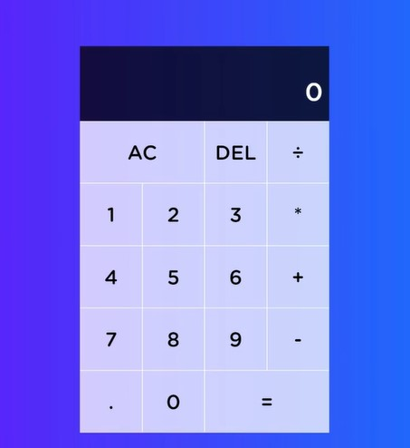

# Calculator project intro 

## About project

- in this , we'll be using OOPs concept for building a calculator web application
- & this app is simply not too difficult but there are a bunch of edge cases <br>
  that we need to consider with this application to make sure it works 100%
- & use some OOPs concept to build this application

## starter code 

<details>
    <summary>index.html</summary>

```html
<!DOCTYPE html>
<html lang="en">
<head>
  <meta charset="UTF-8">
  <meta name="viewport" content="width=device-width, initial-scale=1.0">
  <meta http-equiv="X-UA-Compatible" content="ie=edge">
  <link href="styles.css" rel="stylesheet">
  <title>Calculator</title>
</head>
<body>
  <div class="calculator-grid">
    <div class="output">
      <div class="history">
        <div data-secondary-operand class="secondary-operand"></div>
        <div data-operation></div>
      </div>
      <div data-primary-operand class="primary-operand"></div>
    </div>
    <button data-all-clear class="span-two">AC</button>
    <button data-delete>DEL</button>
    <button data-operation>÷</button>
    <button data-number>1</button>
    <button data-number>2</button>
    <button data-number>3</button>
    <button data-operation>*</button>
    <button data-number>4</button>
    <button data-number>5</button>
    <button data-number>6</button>
    <button data-operation>+</button>
    <button data-number>7</button>
    <button data-number>8</button>
    <button data-number>9</button>
    <button data-operation>-</button>
    <button data-number>.</button>
    <button data-number>0</button>
    <button data-equals class="span-two">=</button>
  </div>
</body>
</html>
```
</details>

<details>
    <summary>styles.css</summary>

```css
*, *::before, *::after {
  box-sizing: border-box;
  font-family: Gotham Rounded, sans-serif;
  font-weight: normal;
}

body {
  padding: 0;
  margin: 0;
  background: linear-gradient(to right, #7700ff, #008cff);
}

.calculator-grid {
  display: grid;
  justify-content: center;
  align-content: center;
  min-height: 100vh;
  grid-template-columns: repeat(4, 100px);
  grid-template-rows: minmax(120px, auto) repeat(5, 100px);
}

.calculator-grid > button {
  cursor: pointer;
  font-size: 2rem;
  border: 1px solid white;
  outline: none;
  background-color: rgba(255, 255, 255, .75);
}

.calculator-grid > button:hover {
  background-color: rgba(255, 255, 255, .9);
}

.span-two {
  grid-column: span 2;
}

.output {
  grid-column: 1 / -1;
  background-color: rgba(0, 0, 0, .75);
  display: flex;
  align-items: flex-end;
  justify-content: space-around;
  flex-direction: column;
  padding: 10px;
  word-wrap: break-word;
  word-break: break-all;
}

.output .history {
  color: rgba(255, 255, 255, .75);
  font-size: 1.5rem;
  display: flex;
}

.output .secondary-operand {
  margin-right: 7px;
}

.output .primary-operand {
  color: white;
  font-size: 2.5rem;
}
```
</details>

## working example 



- so we'll get only html & css file but we need to implement JS by ourself

- if we add more & more numbers then `comma` sign will be applied automatically

- `AC` button - will clear all the digits 
- `DEL` button - will delete one character (through one click) from last  

- `Note` : there are bunch of edge cases to consider with how everything connects together <br>
  so it's require quite a lot of problem solving & testing to make sure all those edge cases solved 💡💡💡
