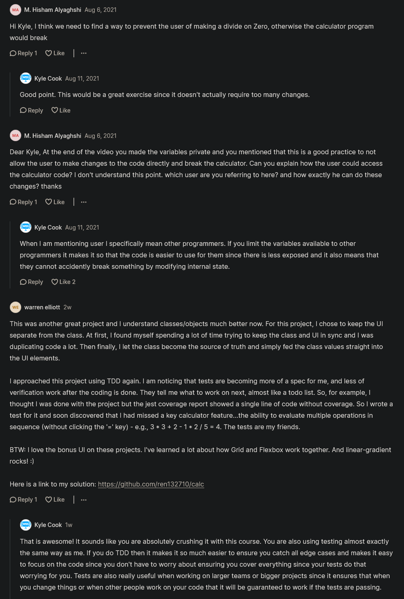

# calculator project walkthrough

## Complete code 

<details>
    <summary>index.html</summary>

```html
<!DOCTYPE html>
<html lang="en">
<head>
  <meta charset="UTF-8">
  <meta name="viewport" content="width=device-width, initial-scale=1.0">
  <meta http-equiv="X-UA-Compatible" content="ie=edge">
  <link href="styles.css" rel="stylesheet">
  <script src="script.js" type="module"></script>
  <title>Calculator</title>
</head>
<body>
  <div class="calculator-grid">
    <div class="output">
      <div class="history">
        <div data-secondary-operand class="secondary-operand"></div>
        <div data-operation></div>
      </div>
      <div data-primary-operand class="primary-operand"></div>
    </div>
    <button data-all-clear class="span-two">AC</button>
    <button data-delete>DEL</button>
    <button data-operation>÷</button>
    <button data-number>1</button>
    <button data-number>2</button>
    <button data-number>3</button>
    <button data-operation>*</button>
    <button data-number>4</button>
    <button data-number>5</button>
    <button data-number>6</button>
    <button data-operation>+</button>
    <button data-number>7</button>
    <button data-number>8</button>
    <button data-number>9</button>
    <button data-operation>-</button>
    <button data-number>.</button>
    <button data-number>0</button>
    <button data-equals class="span-two">=</button>
  </div>
</body>
</html>
```
</details>

<details>
    <summary>styles.css</summary>

```css
*, *::before, *::after {
  box-sizing: border-box;
  font-family: Gotham Rounded, sans-serif;
  font-weight: normal;
}

body {
  padding: 0;
  margin: 0;
  background: linear-gradient(to right, #7700ff, #008cff);
}

.calculator-grid {
  display: grid;
  justify-content: center;
  align-content: center;
  min-height: 100vh;
  grid-template-columns: repeat(4, 100px);
  grid-template-rows: minmax(120px, auto) repeat(5, 100px);
}

.calculator-grid > button {
  cursor: pointer;
  font-size: 2rem;
  border: 1px solid white;
  outline: none;
  background-color: rgba(255, 255, 255, .75);
}

.calculator-grid > button:hover {
  background-color: rgba(255, 255, 255, .9);
}

.span-two {
  grid-column: span 2;
}

.output {
  grid-column: 1 / -1;
  background-color: rgba(0, 0, 0, .75);
  display: flex;
  align-items: flex-end;
  justify-content: space-around;
  flex-direction: column;
  padding: 10px;
  word-wrap: break-word;
  word-break: break-all;
}

.output .history {
  color: rgba(255, 255, 255, .75);
  font-size: 1.5rem;
  display: flex;
}

.output .secondary-operand {
  margin-right: 7px;
}

.output .primary-operand {
  color: white;
  font-size: 2.5rem;
}
```
</details>

<details>
    <summary>script.js</summary>

```js
import Calculator from "./Calculator.js"

const primaryOperandDisplay = document.querySelector("[data-primary-operand]")
const secondaryOperandDisplay = document.querySelector(
  "[data-secondary-operand]"
)
const operationDisplay = document.querySelector("[data-operation]")

const calculator = new Calculator(
  primaryOperandDisplay,
  secondaryOperandDisplay,
  operationDisplay
)

document.addEventListener("click", e => {
  if (e.target.matches("[data-all-clear]")) {
    calculator.clear()
  }
  if (e.target.matches("[data-number]")) {
    calculator.addDigit(e.target.textContent)
  }
  if (e.target.matches("[data-delete]")) {
    calculator.removeDigit()
  }
  if (e.target.matches("[data-operation]")) {
    calculator.chooseOperation(e.target.textContent)
  }
  if (e.target.matches("[data-equals]")) {
    calculator.evaluate()
  }
})
```
</details>

<details>
    <summary>Calculator.js</summary>

```js
export default class Calculator {
  constructor(
    primaryOperandDisplay,
    secondaryOperandDisplay,
    operationDisplay
  ) {
    this.#primaryOperandDisplay = primaryOperandDisplay
    this.#secondaryOperandDisplay = secondaryOperandDisplay
    this.#operationDisplay = operationDisplay

    this.clear()
  }

  #primaryOperandDisplay
  #secondaryOperandDisplay
  #operationDisplay

  get primaryOperand() {
    return parseFloat(this.#primaryOperandDisplay.dataset.value)
  }

  set primaryOperand(value) {
    this.#primaryOperandDisplay.dataset.value = value ?? ""
    this.#primaryOperandDisplay.textContent = displayNumber(value)
  }

  get secondaryOperand() {
    return parseFloat(this.#secondaryOperandDisplay.dataset.value)
  }

  set secondaryOperand(value) {
    this.#secondaryOperandDisplay.dataset.value = value ?? ""
    this.#secondaryOperandDisplay.textContent = displayNumber(value)
  }

  get operation() {
    return this.#operationDisplay.textContent
  }

  set operation(value) {
    this.#operationDisplay.textContent = value ?? ""
  }

  addDigit(digit) {
    if (
      digit === "." &&
      this.#primaryOperandDisplay.dataset.value.includes(".")
    ) {
      return
    }
    if (this.primaryOperand === 0) {
      this.primaryOperand = digit
      return
    }
    this.primaryOperand = this.#primaryOperandDisplay.dataset.value + digit
  }

  removeDigit() {
    const numberString = this.#primaryOperandDisplay.dataset.value
    if (numberString.length <= 1) {
      this.primaryOperand = 0
      return
    }

    this.primaryOperand = numberString.substring(0, numberString.length - 1)
  }

  evaluate() {
    let result
    switch (this.operation) {
      case "*":
        result = this.secondaryOperand * this.primaryOperand
        break
      case "÷":
        result = this.secondaryOperand / this.primaryOperand
        break
      case "+":
        result = this.secondaryOperand + this.primaryOperand
        break
      case "-":
        result = this.secondaryOperand - this.primaryOperand
        break
      default:
        return
    }

    this.clear()
    this.primaryOperand = result

    return result
  }

  chooseOperation(operation) {
    if (this.operation !== "") return
    this.operation = operation
    this.secondaryOperand = this.primaryOperand
    this.primaryOperand = 0
  }

  clear() {
    this.primaryOperand = 0
    this.secondaryOperand = null
    this.operation = null
  }
}

const NUMBER_FORMATTER = new Intl.NumberFormat("en")

function displayNumber(number) {
  const stringNumber = number?.toString() || ""
  if (stringNumber === "") return ""
  const [integer, decimal] = stringNumber.split(".")
  const formattedInteger = NUMBER_FORMATTER.format(integer)
  if (decimal == null) return formattedInteger
  return formattedInteger + "." + decimal
}
```
</details>

## complete Explanation of Calculator Project

- `STEP 1` : inside that project folder , create a `script.js` file  
    - `STEP 1.1` : inside index.html file , link that script.js file like this 
        ```html
        <head>
            <link href="styles.css" rel="stylesheet">
            <script src="script.js" defer></script>
        </head>
        ```

- now inside script.js file , we want to talk about what we're gonna do 
  - so we have a few different operations that we need to handle 

- `TODO tasks` : 
  ```js
  /*
    ACTIONS
      1. Click a number
      2. Click Clear button
      3. Click delete button
      4. Click an operation (means plus , minus , etc sign button)
      5. Click the period button
      6. Click equals
  */
  ```
  - so we'll be following OOPs , so we want to encapsulate all the logic of what happens when we do these above TODO tasks
  - so we want to encapsulate all of that into it's own object which is going to be our calculator class

- `STEP 2` : inside the project folder , create a file as `Calculator.js` 
  - Note : `C` of this file should be capital because it's a class
  - `STEP 2.1` : inside Calculator.js file 
      ```js
      export default class Calculator {

      }
      ```
  - `STEP 2.2` : inside script.js file , import Calculator class
      ```js
      import Calculator from  "./Calculator.js"
      ```
  - `STEP 2.3` : inside index.html file , make inside the script.js link , type="module"
      ```html
      <head>
          <link href="styles.css" rel="stylesheet">
          <script src="script.js" type="module"></script>
      </head>
      ``` 

- now let's setup the even listeners on these actions TODO tasks 
  - & then we can think about how to hook that up to our calculator

- `STEP 3` : inside script.js file , adding event listener on `document` object
    ```js
    import Calculator from  "./Calculator.js"

    document.addEventListener('click' , e => {
      if (e.target.matches('[data-all-clear]')) {

      }
    })
    ```
  - here `[data-all-clear]` is a custom data attribute in `AC` button 
    - so when we click on it then we want to clear all the thing from a screen of calculator
  - so at some point in our code , we need to create a object

  - `STEP 3.1` : inside script.js file , creating a object of `Calculator` class
      ```js
      import Calculator from  "./Calculator.js"

      const calculator = new Calculator()

      document.addEventListener('click' , e => {
        if (e.target.matches('[data-all-clear]')) {

        }
      })
      ```
    - this `calculator` object will encapsulate all of the logic for what we do when we click on these buttons 
      - so when we click on these buttons then we want to call a method on our calculator 💡💡💡

  - `STEP 3.2` : inside script.js file , calling clear() function when we click on it 
      ```js
      import Calculator from  "./Calculator.js"

      const calculator = new Calculator()

      document.addEventListener('click' , e => {
        if (e.target.matches('[data-all-clear]')) {
          calculator.clear() // clearing all the things from the calculator screen
        }
      })
      ```
  - now second ACTION todo done
  - now next thing is to clear a number

  - `STEP 3.3` : inside script.js file , calling addDigit() function 
    - so when we click on any number or period sign then we want to it 
      ```js
      import Calculator from  "./Calculator.js"

      const calculator = new Calculator()

      document.addEventListener("click", e => {
        if (e.target.matches("[data-all-clear]")) {
          calculator.clear()
        }
        if (e.target.matches("[data-number]")) {
          calculator.addDigit(e.target.textContent) // adding digit
        }
      })
      ```

  - now these ACTION todos left
    ```js
    // ACTIONS
    // 3. Click delete button
    // 4. Click an operation 
    // 5. Click equals 
    ```

  - `STEP 3.4` : inside script.js file , we want to delete
    - & delete button will delete one character from the end 
      ```js
      import Calculator from  "./Calculator.js"

      const calculator = new Calculator()

      document.addEventListener("click", e => {
        if (e.target.matches("[data-all-clear]")) {
          calculator.clear()
        }
        if (e.target.matches("[data-number]")) {
          calculator.addDigit(e.target.textContent)
        }
        if (e.target.matches("[data-delete]")) {
          calculator.removeDigit()
        }
      })
      ```
    - period sign `.` also added in `addDigit()` function
  
  - `STEP 3.5` : inside script.js file , working on what operation button & equalto button we clicked
    ```js
    import Calculator from  "./Calculator.js"

    const calculator = new Calculator()

    document.addEventListener("click", e => {
      if (e.target.matches("[data-all-clear]")) {
        calculator.clear()
      }
      if (e.target.matches("[data-number]")) {
        calculator.addDigit(e.target.textContent)
      }
      if (e.target.matches("[data-delete]")) {
        calculator.removeDigit()
      }
      if (e.target.matches("[data-operation]")) {
        calculator.chooseOperation(e.target.textContent)
      }
      if (e.target.matches("[data-equals]")) {
        calculator.evaluate() // we want to get the output
      }
    })
    ```

- now next thing is we want to display our data & where these above ACTIONS information is going to displayed
  - because in our calculator doesn't know where to put these information
  - & if we see inside index.html file , there are data attributes inside div element 
    - i.e `data-secondary-operand` , `data-operation` & `data-primary-operand`
    - checking output : 
      ```html
      <div class="output">
        <div class="history">
          <div data-secondary-operand class="secondary-operand">456</div>
          <div data-operation>*</div>
        </div>
        <div data-primary-operand class="primary-operand">123</div>
      </div>
      ``` 
    - here we give hard coded value so we can see inside screen of calculator that 
      - `456 *` is previously typed & `123` is currently typed & `*` is the multiply operation sign that we chosen 💡💡💡

  - so we can use these data attributes (which are inside `output` div) as a selector to those elements

- `STEP 4` : inside script.js file , getting those elements (which are inside `output` div) by selecting them 
    ```js
    import Calculator from  "./Calculator.js"

    const primaryOperandDisplay = document.querySelector("[data-primary-operand]")  // -------+
    const secondaryOperandDisplay = document.querySelector("[data-secondary-operand]") //     |-> display elements 
    const operationDisplay = document.querySelector("[data-operation]") //  ------------------+

    const calculator = new Calculator()

    document.addEventListener("click", e => {
      if (e.target.matches("[data-all-clear]")) {
        calculator.clear()
      }
      if (e.target.matches("[data-number]")) {
        calculator.addDigit(e.target.textContent)
      }
      if (e.target.matches("[data-delete]")) {
        calculator.removeDigit()
      }
      if (e.target.matches("[data-operation]")) {
        calculator.chooseOperation(e.target.textContent)
      }
      if (e.target.matches("[data-equals]")) {
        calculator.evaluate() // we want to get the output
      }
    })
    ```
  - so these above elements are display elements to display stuff on the screen of calculator
    - now remove the hard coded values & operation sign from that `output` div element ✔️<br>
      because we don't want them polluting up in our code

  - now we need to tell the calculator what to display 
    - so we're gonna pass those selectors elements to the Calculator() constructor 💡💡💡

  - `STEP 4.1` : inside script.js file , passing those elements inside Calculator() constructor as arguments 
      ```js
      import Calculator from  "./Calculator.js"

      const primaryOperandDisplay = document.querySelector("[data-primary-operand]")  // -------+
      const secondaryOperandDisplay = document.querySelector("[data-secondary-operand]") //     |-> display elements 
      const operationDisplay = document.querySelector("[data-operation]") //  ------------------+

      const calculator = new Calculator(primaryOperandDisplay, secondaryOperandDisplay, operationDisplay)

      document.addEventListener("click", e => {
        if (e.target.matches("[data-all-clear]")) {
          calculator.clear()
        }
        if (e.target.matches("[data-number]")) {
          calculator.addDigit(e.target.textContent)
        }
        if (e.target.matches("[data-delete]")) {
          calculator.removeDigit()
        }
        if (e.target.matches("[data-operation]")) {
          calculator.chooseOperation(e.target.textContent)
        }
        if (e.target.matches("[data-equals]")) {
          calculator.evaluate() // we want to get the output
        }
      })
      ```

  - `STEP 4.2` : inside Calculator.js file , working on a constructor of `Calculator` class
      ```js
      export default class Calculator {
        constructor(primaryOperandDisplay, secondaryOperandDisplay, operationDisplay) {
          this.primaryOperandDisplay = primaryOperandDisplay
          this.secondaryOperandDisplay = secondaryOperandDisplay
          this.operationDisplay = operationDisplay
        }
      }
      ```
    - so we set 3 different values on our calculator

- now let's test that everything is working fine whatever code we wrote till yet
- `STEP 5` : inside index.html file , inside `output` div , gave hard coded values
    ```html
    <div class="output">
      <div class="history">
        <div data-secondary-operand class="secondary-operand">456</div>
        <div data-operation>*</div>
      </div>
      <div data-primary-operand class="primary-operand">123</div>
    </div>
    ```
  
  - `STEP 5.1` : inside script.js file , create a `clear` method
    - because this will be easiest method to create
    - inside Calculator.js file 
      ```js
      export default class Calculator {
        constructor(primaryOperandDisplay, secondaryOperandDisplay, operationDisplay) {
          this.primaryOperandDisplay = primaryOperandDisplay
          this.secondaryOperandDisplay = secondaryOperandDisplay
          this.operationDisplay = operationDisplay
          this.clear() // means calculator always start from 0
        }

        clear() {
          this.primaryOperandDisplay.textContent = 0 // bydefault we'll keep 0
          this.secondaryOperandDisplay.textContent = ""
          this.operationDisplay.textContent = ""
        }
      }
      ```
  - testing output : now when we click on `AC` button means all clear button 
    - then everything will be cleared & set as 0

  - `STEP 5.2` : inside index.html file , remove the hardcoded values from that `output` div
      ```html
      <div class="output">
        <div class="history">
          <div data-secondary-operand class="secondary-operand"></div>
          <div data-operation></div>
        </div>
        <div data-primary-operand class="primary-operand"></div>
      </div>
      ```

  - now onwards calculator will always start with `0` 💡💡💡

- next ACTION do is when we click on any numbers 
  - & we can't delete or can't add an operation or can't do equalsto 
  - unless we have numbers in our calculator 💡💡💡
  - so clicking on numbers button & period button will be the next most important thing to work on 
  - right now we'll be working on only numbers button not the period button<br>
    because period sign button will be little difficult means it's like an edge case 💡💡💡

- `STEP 6` : inside Calculator.js file , working on `addDigit()` function right now for only numbers button 
    - writing code for `addDigit()` function will be straightforward function to implement <br>
      but then we'll have some edge cases
    ```js
    export default class Calculator {
      constructor(primaryOperandDisplay, secondaryOperandDisplay, operationDisplay) {
        this.primaryOperandDisplay = primaryOperandDisplay
        this.secondaryOperandDisplay = secondaryOperandDisplay
        this.operationDisplay = operationDisplay
        this.clear() 
      }

      addDigit(digit) {
        this.primaryOperandDisplay.textContent += digit
      }

      clear() {
        this.primaryOperandDisplay.textContent = 0 
        this.secondaryOperandDisplay.textContent = ""
        this.operationDisplay.textContent = ""
      }
    }
    ```
  - testing output : now when we clicked on any numbers button let's say 12347890
    - then this will be the output `012347890` , so here we can see two problems 
    - `first` : default value i.e `0` is still there at the beginning , so it should be removed when we add any number
    - `second` : there's no comma showing up in our list 💡💡💡

  - let's working on first problem means when we add any number 
    - then that default value i.e `0` should be removed/replace by our entire primary display with that number we clicked on

  - `STEP 6.1` : inside Calculator.js file , working on first problem means 
    ```js
    export default class Calculator {
      constructor(primaryOperandDisplay, secondaryOperandDisplay, operationDisplay) {
        this.primaryOperandDisplay = primaryOperandDisplay
        this.secondaryOperandDisplay = secondaryOperandDisplay
        this.operationDisplay = operationDisplay
        this.clear() 
      }

      addDigit(digit) {
        if (this.primaryOperandDisplay.textContent === '0') {
          this.primaryOperandDisplay.textContent = digit // means we're completely overwriting our display
          return 
        }
        this.primaryOperandDisplay.textContent += digit
      }

      clear() {
        this.primaryOperandDisplay.textContent = 0 
        this.secondaryOperandDisplay.textContent = ""
        this.operationDisplay.textContent = ""
      }
    }
    ```
  - so here this code means `if (this.primaryOperandDisplay.textContent === '0')`
    - then we want to overwrite our display but there is no `0` then we want to add digit to our display 💡💡💡

  - testing output : now when we click on let's say `2` number button then we'll get `2` 
    - because that default value i.e `0` will be overwritten by `2`

  - before working on that second problem , first let's see the code that we wrote so far 
    - so `this.primaryOperandDisplay.textContent` this we're accessing constantly
    - & use it for reading & setting it based on the different information that we want 
    - & due to this code is not clean , so we'll create getters & setters for this 
  - `STEP 6.2` : inside Calculator.js file , cleaning up the code by creating getters & setters 
    - here creating getter to get the value from the display 
      ```js
      export default class Calculator {
        constructor(primaryOperandDisplay, secondaryOperandDisplay, operationDisplay) {
          this.primaryOperandDisplay = primaryOperandDisplay
          this.secondaryOperandDisplay = secondaryOperandDisplay
          this.operationDisplay = operationDisplay
          this.clear() 
        }

        get primaryOperand() { // this will give the number value of what is in our display
          return parseFloat(this.primaryOperandDisplay.textContent)
        }

        addDigit(digit) {
          if (this.primaryOperand === '0') {
            this.primaryOperandDisplay.textContent = digit 
            return 
          }
          this.primaryOperandDisplay.textContent += digit
        }

        clear() {
          this.primaryOperandDisplay.textContent = 0 
          this.secondaryOperandDisplay.textContent = ""
          this.operationDisplay.textContent = ""
        }
      }
      ```
    - `return parseFloat(this.primaryOperandDisplay.textContent)` means taking the text of primaryOperandDisplay
      - & converting it to a number that way we don't have to constantly access that `textContent` property 💡💡💡

  - `STEP 6.3` : inside Calculator.js file , creating setter to set the value on the display
      ```js
      export default class Calculator {
        constructor(primaryOperandDisplay, secondaryOperandDisplay, operationDisplay) {
          this.primaryOperandDisplay = primaryOperandDisplay
          this.secondaryOperandDisplay = secondaryOperandDisplay
          this.operationDisplay = operationDisplay
          this.clear() 
        }

        get primaryOperand() { 
          return parseFloat(this.primaryOperandDisplay.textContent)
        }

        set primaryOperand(value) {
          this.primaryOperandDisplay.textContent = value
        }

        addDigit(digit) {
          if (this.primaryOperand === '0') {
            this.primaryOperand = digit 
            return 
          }
          this.primaryOperand = this.primaryOperand.toString() + digit
        }

        clear() {
          this.primaryOperandDisplay.textContent = 0 
          this.secondaryOperandDisplay.textContent = ""
          this.operationDisplay.textContent = ""
        }
      }
      ```
    - testing output : now when we click on only number button & then when we click on `AC` button 
      - then all gets clear & set to default value as `0`

  - `STEP 6.4` : inside Calculator.js file , create a setter for `secondaryOperand` & `operation`
    - & using null coalescing operator   
      ```js
      export default class Calculator {
        constructor(primaryOperandDisplay, secondaryOperandDisplay, operationDisplay) {
          this.primaryOperandDisplay = primaryOperandDisplay
          this.secondaryOperandDisplay = secondaryOperandDisplay
          this.operationDisplay = operationDisplay
          this.clear() 
        }

        get primaryOperand() { 
          return parseFloat(this.primaryOperandDisplay.textContent)
        }

        set primaryOperand(value) {
          this.primaryOperandDisplay.textContent = value ?? "" // --+
        }                                                      //   |
                                                              //    |
        set secondaryOperand(value) {                        //     |
          this.secondaryOperandDisplay.textContent = value ?? "" // |---> means if we pass null or undefined as a value 
        }                                                       //  |     then it gets converted into an empty string  
                                                              //    |     💡💡💡
        set operation(value) {                               //     | 
          this.operationDisplay.textContent = value ?? "" // -------+                        
        }

        addDigit(digit) {
          if (this.primaryOperand === '0') {
            this.primaryOperand = digit 
            return 
          }
          this.primaryOperand = this.primaryOperand.toString() + digit
        }

        clear() {
          this.primaryOperand = 0 
          this.secondaryOperand = null // here we passed null to clear the string instead of double or single quotes 
          this.operation = null // here we passed null to clear the string instead of double or single quotes
        }
      }
      ```
    - testing output : now when we add numbers by clicking on only numbers button 
      - & then when we click on `AC` button then everything will be cleared & `0` will be set again as default value 💡💡💡

  - now let's work in second problem i.e commas
    - so when we wrote large number then comma sign should be shown to separate that number 
    - because due to this , become easy to read 💡💡💡

  - `STEP 6.5` : inside Calculator.js file , working on numbers to display with comma
      ```js
      export default class Calculator {
        constructor(primaryOperandDisplay, secondaryOperandDisplay, operationDisplay) {
          this.primaryOperandDisplay = primaryOperandDisplay
          this.secondaryOperandDisplay = secondaryOperandDisplay
          this.operationDisplay = operationDisplay
          this.clear() 
        }

        get primaryOperand() { 
          return parseFloat(this.primaryOperandDisplay.textContent)
        }

        set primaryOperand(value) {
          this.primaryOperandDisplay.textContent = value ?? ""
        }                                                      
                                                           
        set secondaryOperand(value) {                     
          this.secondaryOperandDisplay.textContent = value ?? ""
        }                                                        
                                                              
        set operation(value) {                             
          this.operationDisplay.textContent = value ?? ""                    
        }

        addDigit(digit) {
          if (this.primaryOperand === '0') {
            this.primaryOperand = digit 
            return 
          }
          this.primaryOperand = this.primaryOperand.toString() + digit
          console.log(displayNumber(this.primaryOperand)) // printing out that function for testing output
        }

        clear() {
          this.primaryOperand = 0 
          this.secondaryOperand = null  
          this.operation = null 
        }
      }

      const NUMBER_FORMATTER = new Intl.NumberFormat("en", {
        maximumFractionDigits : 20
      })

      function displayNumber(number) {
        return NUMBER_FORMATTER.format(number)
      }
      ```
    - now we don't need to write complex code for putting commas b/w numbers 
      - because JS has builtin thing i.e `internationalization` so `Intl` is a class based object 💡💡💡
      - `en` means english number format we want
      - `maximumFractionDigits : 20` means it's a maximum amount of digits that we can display 
      - `NUMBER_FORMATTER.format(number)` will return a string (with numbers & commas b/w them)
    
    - testing output : click on any numbers button like `125555655565` then 
      - then inside `console` tab , we'll get this `125,555,655,565` with commas
      - now we need to display that number in the calculator display

    - `STEP 6.5.1` : inside Calculator.js file , working on that number with commas to show it on the screen of calculator
        ```js
        export default class Calculator {
          constructor(primaryOperandDisplay, secondaryOperandDisplay, operationDisplay) {
            this.primaryOperandDisplay = primaryOperandDisplay
            this.secondaryOperandDisplay = secondaryOperandDisplay
            this.operationDisplay = operationDisplay
            this.clear() 
          }

          get primaryOperand() { 
            return parseFloat(this.primaryOperandDisplay.textContent)
          }

          set primaryOperand(value) {
            this.primaryOperandDisplay.textContent = displayNumber(value ?? "") 
          }                                                      
                                                             
          set secondaryOperand(value) {                     
            this.secondaryOperandDisplay.textContent = displayNumber(value ?? "") 
          }                                                        
                                                                
          set operation(value) {                             
            this.operationDisplay.textContent = displayNumber(value ?? "")               
          }

          addDigit(digit) {
            if (this.primaryOperand === '0') {
              this.primaryOperand = digit 
              return 
            }
            this.primaryOperand = this.primaryOperand.toString() + digit
          }

          clear() {
            this.primaryOperand = 0 
            this.secondaryOperand = null  
            this.operation = null 
          }
        }

        const NUMBER_FORMATTER = new Intl.NumberFormat("en", {
          maximumFractionDigits : 20
        })

        function displayNumber(number) {
          return NUMBER_FORMATTER.format(number)
        }
        ```
      - `displayNumber(value ?? "")` means if we got the value then that value will be converted into numbers with commas 

    - output : on the screen of Calculator , when we start typing 
      - like `1555` then on the screen we'll get `1,555` 
      - & then we click on other numbers after few seconds then `1,555` this number will get overwrite by that new number
      - because JS trying to convert this number `1,555` to a float number
      - if we see inside getter of `primaryOperand()` function , we did parseFloat() but it's unable to do that <br>
        instead it just returns one which is the first number & it doesn't know what commas are 💡💡💡

    - so now we have two different problems 
      - `first problem` : JS doesn't know how to parse numbers with commas in numbers 
        - but we're able to display numbers with commas in them
      - so we almost need two different ways to store our data
        - `first` : without the commas 
        - `second` : with the commas 💡💡💡

    - so inside `setter of primaryOperand()` , instead of just setting the textContent 
      - we also want to set a secondary property which is our number without any additional details     

    - `STEP 6.5.2` : inside Calculator.js file , working to get the right numbers output with commas
        ```js
        export default class Calculator {
          constructor(primaryOperandDisplay, secondaryOperandDisplay, operationDisplay) {
            this.primaryOperandDisplay = primaryOperandDisplay
            this.secondaryOperandDisplay = secondaryOperandDisplay
            this.operationDisplay = operationDisplay
            this.clear() 
          }

          get primaryOperand() { 
            return parseFloat(this.primaryOperandDisplay.dataset.value)
          }

          set primaryOperand(value) {
            this.primaryOperandDisplay.dataset.value = value ?? ""                    
            this.primaryOperandDisplay.textContent = displayNumber(value) 
          }                                                      
                                                             
          set secondaryOperand(value) {                     
            this.secondaryOperandDisplay.textContent = displayNumber(value ?? "") 
          }                                                        
                                                                
          set operation(value) {       
            this.operationDisplay.textContent = displayNumber(value ?? "")               
          }

          addDigit(digit) {
            if (this.primaryOperand === '0') {
              this.primaryOperand = digit 
              return 
            }
            this.primaryOperand = this.primaryOperand.toString() + digit
          }

          clear() {
            this.primaryOperand = 0 
            this.secondaryOperand = null  
            this.operation = null 
          }
        }

        const NUMBER_FORMATTER = new Intl.NumberFormat("en", {
          maximumFractionDigits : 20
        })

        function displayNumber(number) {
          return NUMBER_FORMATTER.format(number)
        }
        ```
      - output : now when we write `12345` then we'll get `12,345` with comma 
        - but if we inspect & see the html then `data-value` (of `primary-operand` div) contain 12345
        - & actual contain has `12,345`

      - so now we have two different ways to store that value

    - till yet whatever we did  is for primary operand , now let's do for secondary operand & operation
    - `STEP 6.5.3` : inside Calculator.js file , working for secondary operand & operation setters
        ```js
        export default class Calculator {
          constructor(primaryOperandDisplay, secondaryOperandDisplay, operationDisplay) {
            this.primaryOperandDisplay = primaryOperandDisplay
            this.secondaryOperandDisplay = secondaryOperandDisplay
            this.operationDisplay = operationDisplay
            this.clear() 
          }

          get primaryOperand() { 
            return parseFloat(this.primaryOperandDisplay.dataset.value)
          }

          set primaryOperand(value) {
            this.primaryOperandDisplay.dataset.value = value ?? ""                    
            this.primaryOperandDisplay.textContent = displayNumber(value) 
          }                                                      
                                                             
          set secondaryOperand(value) {                     
            this.secondaryOperandDisplay.dataset.value = value ?? ""                    
            this.secondaryOperandDisplay.textContent = displayNumber(value) 
          }                                                        
                                                                
          set operation(value) {       
            // this is actual number that's why we didn't used displayNumber() function
            this.operationDisplay.textContent = value ?? ""         
          }

          addDigit(digit) {
            if (this.primaryOperand === '0') {
              this.primaryOperand = digit 
              return 
            }
            this.primaryOperand = this.primaryOperand.toString() + digit
          }

          clear() {
            this.primaryOperand = 0 
            this.secondaryOperand = null  
            this.operation = null 
          }
        }

        const NUMBER_FORMATTER = new Intl.NumberFormat("en", {
          maximumFractionDigits : 20
        })

        function displayNumber(number) {
          return NUMBER_FORMATTER.format(number)
        }
        ```

    - but one issue is there i.e period sign 
      - so when we do `123456` then we'll get `123,456` & when we click on period sign button
      - then nothing will happen & when we inspect the page
      - & see the html then `data-value` (of `primary-operand` div) contain `123456.` is actually in hard-coded value
      - & when we convert that period sign by using displayNumber() function then period sign will not be included 
      - & if we add period sign as many as we want then nothing will happen
      - because when JS saw number like `123456.` with period sign then it doesn't know how to handle as a number 💡💡💡  

    - so we need to get the two different parts of our number
      - `first part` : get the part before the period sign
      - `second part` : get the part after the period 💡💡💡
      - & handle them separately 
  
  - `STEP 6.6` : inside Calculator.js file , working on two separate parts of number with period sign 
      ```js
      export default class Calculator {
        constructor(primaryOperandDisplay, secondaryOperandDisplay, operationDisplay) {
          this.primaryOperandDisplay = primaryOperandDisplay
          this.secondaryOperandDisplay = secondaryOperandDisplay
          this.operationDisplay = operationDisplay
          this.clear() 
        }

        get primaryOperand() { 
          return parseFloat(this.primaryOperandDisplay.dataset.value)
        }

        set primaryOperand(value) {
          this.primaryOperandDisplay.dataset.value = value ?? ""                    
          this.primaryOperandDisplay.textContent = displayNumber(value) 
        }                                                      
                                                           
        set secondaryOperand(value) {                     
          this.secondaryOperandDisplay.dataset.value = value ?? ""                    
          this.secondaryOperandDisplay.textContent = displayNumber(value) 
        }                                                        
                                                              
        set operation(value) {       
          this.operationDisplay.textContent = value ?? ""         
        }

        addDigit(digit) {
          if (this.primaryOperand === '0') {
            this.primaryOperand = digit 
            return 
          }
          this.primaryOperand = this.primaryOperand.toString() + digit
        }

        clear() {
          this.primaryOperand = 0 
          this.secondaryOperand = null  
          this.operation = null 
        }
      }

      const NUMBER_FORMATTER = new Intl.NumberFormat("en", {
        maximumFractionDigits : 20
      })

      function displayNumber(number) {
        const stringNumber = number?.toString() || ""
        if (stringNumber === "") return ""
        const [integer , decimal] = stringNumber.split(".")
        const formattedInteger = NUMBER_FORMATTER.format(integer)
        if (decimal == null) return formattedInteger
        return formattedInteger + "." + decimal
      }
      ```
    - `const stringNumber = number?.toString() || ''` means we're just gonna make sure that our number is in a string format
    - `if (stringNumber === "") return ""` means it will remove the `0` which is coming as a previous 
      - only `0` will be shown as a primary
    - `const [integer , decimal] = stringNumber.split(".")` means we separated the one number in two parts 
      - `integer` means number before the period sign & `decimal` means number after the period sign
    - `const formattedInteger = NUMBER_FORMATTER.format(integer)` means it return the formatted version of our integer number
      - because if we don't have any decimal part then we don't need to worry , so we're just gonna return to the part
      - before the decimal formatted as a number but 
      - `return formattedInteger + "." + decimal` means if we have decimal part then we want to return formattedInteger part & decimal sign & decimal part

    - output : now when we write `2145` & then click period sign button then we'll get `2,145.` with period sign
    - testing output : inside Calculator.js file , printout integer & decimal 
      ```js
      function displayNumber(number) {
        const stringNumber = number?.toString() || ""
        if (stringNumber === "") return ""
        const [integer , decimal] = stringNumber.split(".")
        const formattedInteger = NUMBER_FORMATTER.format(integer)
        console.log(integer , decimal)
        if (decimal == null) return formattedInteger
        return formattedInteger + "." + decimal
      }
      ``` 
      - now go to console then at first time start with `0 undefined`
      - then click `2` button then we'll get `2 undefined`
      - then the movement we click on period sign button then we'll get `2` & undefined will not come
        - but on the screen of calculator we'll get `2.`
      - but the movement we click on `0` then that period sign will be overwritten by `0` 💡💡💡

    - so the problem is that inside getter of primaryOperand , we're converting it into float
      - testing output : inside Calculator.js file , if we print primaryOperand inside addDigit() function
        ```js
        addDigit(digit) {
          if (this.primaryOperand === '0') {
            this.primaryOperand = digit 
            return 
          }
          console.log(this.primaryOperand)
          this.primaryOperand = this.primaryOperand.toString() + digit
        }
        ```
      - then inspect , then inside console tab , if we write numbers like `125422` 
      - then on the screen of calculator , we'll get `125,422` & then when we click period sign
        - then on the screen we'll get `125,422.` with period sign 
        - but inside the console tab , we'll get `125422` without period sign
        - so it's just converting it to without the period
      - so we need to access the data set value to instead of accessing the actual primaryOperand

    - `STEP 6.6.1` : inside Calculator.js file , working on period sign & stopping number from overwriting period sign
        ```js
        export default class Calculator {
          constructor(primaryOperandDisplay, secondaryOperandDisplay, operationDisplay) {
            this.primaryOperandDisplay = primaryOperandDisplay
            this.secondaryOperandDisplay = secondaryOperandDisplay
            this.operationDisplay = operationDisplay
            this.clear() 
          }

          get primaryOperand() { 
            return parseFloat(this.primaryOperandDisplay.dataset.value)
          }

          set primaryOperand(value) {
            this.primaryOperandDisplay.dataset.value = value ?? ""                    
            this.primaryOperandDisplay.textContent = displayNumber(value) 
          }                                                      
                                                             
          set secondaryOperand(value) {                     
            this.secondaryOperandDisplay.dataset.value = value ?? ""                    
            this.secondaryOperandDisplay.textContent = displayNumber(value) 
          }                                                        
                                                                
          set operation(value) {       
            this.operationDisplay.textContent = value ?? ""         
          }

          addDigit(digit) {
            if (this.primaryOperand === '0') {
              this.primaryOperand = digit 
              return 
            }
            this.primaryOperand = this.primaryOperand.dataset.value + digit
          }

          clear() {
            this.primaryOperand = 0 
            this.secondaryOperand = null  
            this.operation = null 
          }
        }

        const NUMBER_FORMATTER = new Intl.NumberFormat("en", {
          maximumFractionDigits : 20
        })

        function displayNumber(number) {
          const stringNumber = number?.toString() || ""
          if (stringNumber === "") return ""
          const [integer , decimal] = stringNumber.split(".")
          const formattedInteger = NUMBER_FORMATTER.format(integer)
          if (decimal == null) return formattedInteger
          return formattedInteger + "." + decimal
        }
        ```
      - we converting from this `this.primaryOperand = this.primaryOperand.dataset.value.toString() + digit`
        - to this `this.primaryOperand = this.primaryOperand.dataset.value + digit` because we know this `value`
        - is always going to be in string form

      - testing output : now when we write like `12355` & then click on period sign then we'll get `12,355.`
        - & then when we click on let's say `4` then we'll get `12,355.4`
        - & when we click on period sign multiple sign with numbers then our calculator gets break 
        - & no buttons will work after clicking on them
        - because inspect it , inside `Elements` tab , see data-value (of primary-operand div) contain weird number 
          - with multiple period sign like `893274892374........123223...123123123`

    - so we need to fix the problem of extra period signs
    - `STEP 6.6.2` : inside Calculator.js file , working on extra period sign when user click & stopping calculator from break
        ```js
        export default class Calculator {
          constructor(primaryOperandDisplay, secondaryOperandDisplay, operationDisplay) {
            this.primaryOperandDisplay = primaryOperandDisplay
            this.secondaryOperandDisplay = secondaryOperandDisplay
            this.operationDisplay = operationDisplay
            this.clear() 
          }

          get primaryOperand() { 
            return parseFloat(this.primaryOperandDisplay.dataset.value)
          }

          set primaryOperand(value) {
            this.primaryOperandDisplay.dataset.value = value ?? ""                    
            this.primaryOperandDisplay.textContent = displayNumber(value) 
          }                                                      
                                                             
          set secondaryOperand(value) {                     
            this.secondaryOperandDisplay.dataset.value = value ?? ""                    
            this.secondaryOperandDisplay.textContent = displayNumber(value) 
          }                                                        
                                                                
          set operation(value) {       
            this.operationDisplay.textContent = value ?? ""         
          }

          addDigit(digit) {
            if (digit === "." && this.primaryOperandDisplay.dataset.value.includes(".")) {
              return
            }
            if (this.primaryOperand === '0') {
              this.primaryOperand = digit 
              return 
            }
            this.primaryOperand = this.primaryOperand.dataset.value + digit
          }

          clear() {
            this.primaryOperand = 0 
            this.secondaryOperand = null  
            this.operation = null 
          }
        }

        const NUMBER_FORMATTER = new Intl.NumberFormat("en")

        function displayNumber(number) {
          const stringNumber = number?.toString() || ""
          if (stringNumber === "") return ""
          const [integer , decimal] = stringNumber.split(".")
          const formattedInteger = NUMBER_FORMATTER.format(integer)
          if (decimal == null) return formattedInteger
          return formattedInteger + "." + decimal
        }
        ```  
      - `if (digit === "." && this.primaryOperandDisplay.dataset.value.includes("."))` 
        - means if we're trying to add a period sign & we already have a period sign in our value 
        - then we don't wanna add another period 💡💡💡

      - testing output : when we add numbers then period sign like this `123123123.123123123`
        - & then when we add another period sign then it'll not added 
        - & even other buttons will work fine means calculator won't break 
        - because inspect it , inside elements tab , see data-value (of primary-operand div) contain only one period sign
        - so doesn't matter how many times we clicked on period sign button , it will be added only one time

      - we changed this `const NUMBER_FORMATTER = new Intl.NumberFormat("en", {maximumFractionDigits : 20})`
        - to this `const NUMBER_FORMATTER = new Intl.NumberFormat("en")`
        - because we're only handing number formatting by format the integer on its own 
        - so we don't need to worry about the number of decimals because we don't actually format decimals ever
        - means `decimal` variable (inside displayNumber() function) never gets formatted 💡💡💡

- we finished with adding digits , now let's work on removing a digit i.e `DEL` button
- `STEP 7` : inside Calculator.js file , working on `DEL` button to delete a character from the end
    ```js
    export default class Calculator {
      constructor(primaryOperandDisplay, secondaryOperandDisplay, operationDisplay) {
        this.primaryOperandDisplay = primaryOperandDisplay
        this.secondaryOperandDisplay = secondaryOperandDisplay
        this.operationDisplay = operationDisplay
        this.clear() 
      }

      get primaryOperand() { 
        return parseFloat(this.primaryOperandDisplay.dataset.value)
      }

      set primaryOperand(value) {
        this.primaryOperandDisplay.dataset.value = value ?? ""                    
        this.primaryOperandDisplay.textContent = displayNumber(value) 
      }                                                      
                                                         
      set secondaryOperand(value) {                     
        this.secondaryOperandDisplay.dataset.value = value ?? ""                    
        this.secondaryOperandDisplay.textContent = displayNumber(value) 
      }                                                        
                                                            
      set operation(value) {       
        this.operationDisplay.textContent = value ?? ""         
      }

      addDigit(digit) {
        if (digit === "." && this.primaryOperandDisplay.dataset.value.includes(".")) {
          return
        }
        if (this.primaryOperand === '0') {
          this.primaryOperand = digit 
          return 
        }
        this.primaryOperand = this.primaryOperand.dataset.value + digit
      }

      removeDigit() {
        const numberString = this.#primaryOperandDisplay.dataset.value
        this.primaryOperand = numberString.substring(0, numberString.length - 1)
      }
      
      clear() {
        this.primaryOperand = 0 
        this.secondaryOperand = null  
        this.operation = null 
      }
    }

    const NUMBER_FORMATTER = new Intl.NumberFormat("en")

    function displayNumber(number) {
      const stringNumber = number?.toString() || ""
      if (stringNumber === "") return ""
      const [integer , decimal] = stringNumber.split(".")
      const formattedInteger = NUMBER_FORMATTER.format(integer)
      if (decimal == null) return formattedInteger
      return formattedInteger + "." + decimal
    }
    ```
    - `numberString.substring(0, numberString.length - 1)` means get everything from our string except for the very last digit
    - testing output : let's say we wrote `21555` then on the screen we'll get `21,555` 
      - & when we click on `DEL` button then from the last `5` will be removed so we can see `2,155`
      - but when we delete all the numbers then after that we want to show the `0` 

    - `STEP 7.1` : inside Calculator.js file , showing `0` when all the numbers user deleted by clicking on `DEL` button
      - doing simple condition check when no numbers left after clicking on `DEL` button
        ```js
        export default class Calculator {
          constructor(primaryOperandDisplay, secondaryOperandDisplay, operationDisplay) {
            this.primaryOperandDisplay = primaryOperandDisplay
            this.secondaryOperandDisplay = secondaryOperandDisplay
            this.operationDisplay = operationDisplay
            this.clear() 
          }

          get primaryOperand() { 
            return parseFloat(this.primaryOperandDisplay.dataset.value)
          }

          set primaryOperand(value) {
            this.primaryOperandDisplay.dataset.value = value ?? ""                    
            this.primaryOperandDisplay.textContent = displayNumber(value) 
          }                                                      
                                                             
          set secondaryOperand(value) {                     
            this.secondaryOperandDisplay.dataset.value = value ?? ""                    
            this.secondaryOperandDisplay.textContent = displayNumber(value) 
          }                                                        
                                                                
          set operation(value) {       
            this.operationDisplay.textContent = value ?? ""         
          }

          addDigit(digit) {
            if (digit === "." && this.primaryOperandDisplay.dataset.value.includes(".")) {
              return
            }
            if (this.primaryOperand === '0') {
              this.primaryOperand = digit 
              return 
            }
            this.primaryOperand = this.primaryOperand.dataset.value + digit
          }

          removeDigit() {
            const numberString = this.#primaryOperandDisplay.dataset.value
            if (numberString.length <= 1) {
              this.primaryOperand = 0
              return
            }
            this.primaryOperand = numberString.substring(0, numberString.length - 1)
          }
          
          clear() {
            this.primaryOperand = 0 
            this.secondaryOperand = null  
            this.operation = null 
          }
        }

        const NUMBER_FORMATTER = new Intl.NumberFormat("en")

        function displayNumber(number) {
          const stringNumber = number?.toString() || ""
          if (stringNumber === "") return ""
          const [integer , decimal] = stringNumber.split(".")
          const formattedInteger = NUMBER_FORMATTER.format(integer)
          if (decimal == null) return formattedInteger
          return formattedInteger + "." + decimal
        }
        ```
        - output : now when we delete all the numbers through `DEL` button & no numbers left then `0` will be shown

- `STEP 8` : inside Calculator.js file , working on choose operation 
    ```js
    export default class Calculator {
      constructor(primaryOperandDisplay, secondaryOperandDisplay, operationDisplay) {
        this.primaryOperandDisplay = primaryOperandDisplay
        this.secondaryOperandDisplay = secondaryOperandDisplay
        this.operationDisplay = operationDisplay
        this.clear() 
      }

      get primaryOperand() { 
        return parseFloat(this.primaryOperandDisplay.dataset.value)
      }

      set primaryOperand(value) {
        this.primaryOperandDisplay.dataset.value = value ?? ""                    
        this.primaryOperandDisplay.textContent = displayNumber(value) 
      }                                                      
                                                         
      set secondaryOperand(value) {                     
        this.secondaryOperandDisplay.dataset.value = value ?? ""                    
        this.secondaryOperandDisplay.textContent = displayNumber(value) 
      }                                                        
                                                            
      set operation(value) {       
        this.operationDisplay.textContent = value ?? ""         
      }

      addDigit(digit) {
        if (digit === "." && this.primaryOperandDisplay.dataset.value.includes(".")) {
          return
        }
        if (this.primaryOperand === '0') {
          this.primaryOperand = digit 
          return 
        }
        this.primaryOperand = this.primaryOperand.dataset.value + digit
      }

      removeDigit() {
        const numberString = this.#primaryOperandDisplay.dataset.value
        if (numberString.length <= 1) {
          this.primaryOperand = 0
          return
        }
        this.primaryOperand = numberString.substring(0, numberString.length - 1)
      }

      chooseOperation(operation) {
        if (this.operation == null) return
        this.operation = operation
        this.secondaryOperand = this.primaryOperand
        this.primaryOperand = 0
      }
      
      clear() {
        this.primaryOperand = 0 
        this.secondaryOperand = null  
        this.operation = null 
      }
    }

    const NUMBER_FORMATTER = new Intl.NumberFormat("en")

    function displayNumber(number) {
      const stringNumber = number?.toString() || ""
      if (stringNumber === "") return ""
      const [integer , decimal] = stringNumber.split(".")
      const formattedInteger = NUMBER_FORMATTER.format(integer)
      if (decimal == null) return formattedInteger
      return formattedInteger + "." + decimal
    }
    ```
  - this code 
    ```
    chooseOperation(operation) {
      if (this.operation !== "") return
      this.operation = operation
      this.secondaryOperand = this.primaryOperand
      this.primaryOperand = 0
    }
    ```
    - means whatever the number we've typed then that number we want to set as our new secondaryOperand
    - & we want to set our operation & we want to reset the number that we're currently typed 
    - Eg : `3,225,552` is a number on the screen of calculator & we want to perform this operation & then do the next thing
      - so we typed this `3,225,552` & click on `*` sign then we'll get `3,225,552 *` → which is secondary operand 
      - & `0` → is a primary operand
      - but the movement we click on another operation sign let's say divide sign then we'll get `0 ➗` as secondary operand 
      - but we don't want allow the user to do this because we want to make that the user complete the current operation 
        - before the user click a new operation
        - that's why we use this condition `if (this.operation == null) return` inside chooseOperation() function

    - testing output : now when we write numbers & click on operation button like `+` then nothing will happen
      - because `this.operation` is a string 

  - `STEP 8.1` : inside Calculator.js file , checking empty string inside condition inside chooseOperation() function
      ```js
      export default class Calculator {
        constructor(primaryOperandDisplay, secondaryOperandDisplay, operationDisplay) {
          this.primaryOperandDisplay = primaryOperandDisplay
          this.secondaryOperandDisplay = secondaryOperandDisplay
          this.operationDisplay = operationDisplay
          this.clear() 
        }

        get primaryOperand() { 
          return parseFloat(this.primaryOperandDisplay.dataset.value)
        }

        set primaryOperand(value) {
          this.primaryOperandDisplay.dataset.value = value ?? ""                    
          this.primaryOperandDisplay.textContent = displayNumber(value) 
        }                                                      
                                                           
        set secondaryOperand(value) {                     
          this.secondaryOperandDisplay.dataset.value = value ?? ""                    
          this.secondaryOperandDisplay.textContent = displayNumber(value) 
        }                                                        
                                                              
        set operation(value) {       
          this.operationDisplay.textContent = value ?? ""         
        }

        addDigit(digit) {
          if (digit === "." && this.primaryOperandDisplay.dataset.value.includes(".")) {
            return
          }
          if (this.primaryOperand === '0') {
            this.primaryOperand = digit 
            return 
          }
          this.primaryOperand = this.primaryOperand.dataset.value + digit
        }

        removeDigit() {
          const numberString = this.#primaryOperandDisplay.dataset.value
          if (numberString.length <= 1) {
            this.primaryOperand = 0
            return
          }
          this.primaryOperand = numberString.substring(0, numberString.length - 1)
        }

        chooseOperation(operation) {
          if (this.operation == "") return
          this.operation = operation
          this.secondaryOperand = this.primaryOperand
          this.primaryOperand = 0
        }
        
        clear() {
          this.primaryOperand = 0 
          this.secondaryOperand = null  
          this.operation = null 
        }
      }

      const NUMBER_FORMATTER = new Intl.NumberFormat("en")

      function displayNumber(number) {
        const stringNumber = number?.toString() || ""
        if (stringNumber === "") return ""
        const [integer , decimal] = stringNumber.split(".")
        const formattedInteger = NUMBER_FORMATTER.format(integer)
        if (decimal == null) return formattedInteger
        return formattedInteger + "." + decimal
      }
      ```
    - ` if (this.operation == "") return` means checking empty string 
    - testing output : if we click `1244` then on the screen we'll get `1,244` & click on `*` sign
      - then as a secondary operand we'll get `1,244 *` & then movement we click on other operation let's say `+`
      - then we'll get `0 +` which means it's overwriting 💡💡💡
      - so we need to make a getter for `operation` & `secondaryOperand`

  - `STEP 8.2` : inside Calculator.js file , creating a getter for operation & secondaryOperand
      ```js
      export default class Calculator {
        constructor(primaryOperandDisplay, secondaryOperandDisplay, operationDisplay) {
          this.primaryOperandDisplay = primaryOperandDisplay
          this.secondaryOperandDisplay = secondaryOperandDisplay
          this.operationDisplay = operationDisplay
          this.clear() 
        }

        get primaryOperand() { 
          return parseFloat(this.primaryOperandDisplay.dataset.value)
        }

        set primaryOperand(value) {
          this.primaryOperandDisplay.dataset.value = value ?? ""                    
          this.primaryOperandDisplay.textContent = displayNumber(value) 
        }                                                      
                                                           
        get secondaryOperand() {                     
          this.secondaryOperandDisplay.dataset.value = value ?? ""                    
          this.secondaryOperandDisplay.textContent = displayNumber(value) 
        }   

        set secondaryOperand(value) { 
          return parseFloat(this.#secondaryOperandDisplay.dataset.value)
        }                                                        
                                 
        get operation() {
          return this.#operationDisplay.textContent
        }

        set operation(value) {       
          this.operationDisplay.textContent = value ?? ""         
        }

        addDigit(digit) {
          if (digit === "." && this.primaryOperandDisplay.dataset.value.includes(".")) {
            return
          }
          if (this.primaryOperand === '0') {
            this.primaryOperand = digit 
            return 
          }
          this.primaryOperand = this.primaryOperand.dataset.value + digit
        }

        removeDigit() {
          const numberString = this.#primaryOperandDisplay.dataset.value
          if (numberString.length <= 1) {
            this.primaryOperand = 0
            return
          }
          this.primaryOperand = numberString.substring(0, numberString.length - 1)
        }

        chooseOperation(operation) {
          console.log(this.operation , operation)
          if (this.operation == "") return
          this.operation = operation
          this.secondaryOperand = this.primaryOperand
          this.primaryOperand = 0
        }
        
        clear() {
          this.primaryOperand = 0 
          this.secondaryOperand = null  
          this.operation = null 
        }
      }

      const NUMBER_FORMATTER = new Intl.NumberFormat("en")

      function displayNumber(number) {
        const stringNumber = number?.toString() || ""
        if (stringNumber === "") return ""
        const [integer , decimal] = stringNumber.split(".")
        const formattedInteger = NUMBER_FORMATTER.format(integer)
        if (decimal == null) return formattedInteger
        return formattedInteger + "." + decimal
      }
      ```
    - testing output : when we write a number & click on any operation sign then we'll get that operation sign 
      - inside console tab, we'll get that number 

  - `STEP 8.3` : inside Calculator.js file , checking if the operand is not the empty string inside chooseOperation() function
      ```js
      export default class Calculator {
        constructor(primaryOperandDisplay, secondaryOperandDisplay, operationDisplay) {
          this.primaryOperandDisplay = primaryOperandDisplay
          this.secondaryOperandDisplay = secondaryOperandDisplay
          this.operationDisplay = operationDisplay
          this.clear() 
        }

        get primaryOperand() { 
          return parseFloat(this.primaryOperandDisplay.dataset.value)
        }

        set primaryOperand(value) {
          this.primaryOperandDisplay.dataset.value = value ?? ""                    
          this.primaryOperandDisplay.textContent = displayNumber(value) 
        }                                                      
                                                           
        get secondaryOperand() {                     
          this.secondaryOperandDisplay.dataset.value = value ?? ""                    
          this.secondaryOperandDisplay.textContent = displayNumber(value) 
        }   

        set secondaryOperand(value) { 
          return parseFloat(this.#secondaryOperandDisplay.dataset.value)
        }                                                        
                                 
        get operation() {
          return this.#operationDisplay.textContent
        }

        set operation(value) {       
          this.operationDisplay.textContent = value ?? ""         
        }

        addDigit(digit) {
          if (digit === "." && this.primaryOperandDisplay.dataset.value.includes(".")) {
            return
          }
          if (this.primaryOperand === '0') {
            this.primaryOperand = digit 
            return 
          }
          this.primaryOperand = this.primaryOperand.dataset.value + digit
        }

        removeDigit() {
          const numberString = this.#primaryOperandDisplay.dataset.value
          if (numberString.length <= 1) {
            this.primaryOperand = 0
            return
          }
          this.primaryOperand = numberString.substring(0, numberString.length - 1)
        }

        chooseOperation(operation) {
          if (this.operation !== "") return
          this.operation = operation
          this.secondaryOperand = this.primaryOperand
          this.primaryOperand = 0
        }
        
        clear() {
          this.primaryOperand = 0 
          this.secondaryOperand = null  
          this.operation = null 
        }
      }

      const NUMBER_FORMATTER = new Intl.NumberFormat("en")

      function displayNumber(number) {
        const stringNumber = number?.toString() || ""
        if (stringNumber === "") return ""
        const [integer , decimal] = stringNumber.split(".")
        const formattedInteger = NUMBER_FORMATTER.format(integer)
        if (decimal == null) return formattedInteger
        return formattedInteger + "." + decimal
      }
      ```
    - output : now when we write `22545` we'll get `22,545` & when we click on `*` sign 
      - then we'll get `22,545 *`
      - & now when we click on other operation sign then nothing will happen 
      - because `if (this.operation !== "") return` means we don't want to reset our operation
        - if we haven't finished our current operation 💡💡💡
      - now after writing another number then we want to get the result by clicking in `=` sign

- `STEP 9` : inside Calculator.js file , working on `=` button means evaluating things
    ```js
    export default class Calculator {
      constructor(primaryOperandDisplay, secondaryOperandDisplay, operationDisplay) {
        this.primaryOperandDisplay = primaryOperandDisplay
        this.secondaryOperandDisplay = secondaryOperandDisplay
        this.operationDisplay = operationDisplay
        this.clear() 
      }

      get primaryOperand() { 
        return parseFloat(this.primaryOperandDisplay.dataset.value)
      }

      set primaryOperand(value) {
        this.primaryOperandDisplay.dataset.value = value ?? ""                    
        this.primaryOperandDisplay.textContent = displayNumber(value) 
      }                                                      
                                                         
      get secondaryOperand() {                     
        this.secondaryOperandDisplay.dataset.value = value ?? ""                    
        this.secondaryOperandDisplay.textContent = displayNumber(value) 
      }   

      set secondaryOperand(value) { 
        return parseFloat(this.#secondaryOperandDisplay.dataset.value)
      }                                                        
                               
      get operation() {
        return this.#operationDisplay.textContent
      }

      set operation(value) {       
        this.operationDisplay.textContent = value ?? ""         
      }

      addDigit(digit) {
        if (digit === "." && this.primaryOperandDisplay.dataset.value.includes(".")) {
          return
        }
        if (this.primaryOperand === '0') {
          this.primaryOperand = digit 
          return 
        }
        this.primaryOperand = this.primaryOperand.dataset.value + digit
      }

      removeDigit() {
        const numberString = this.#primaryOperandDisplay.dataset.value
        if (numberString.length <= 1) {
          this.primaryOperand = 0
          return
        }
        this.primaryOperand = numberString.substring(0, numberString.length - 1)
      }

      evaluate() { // it's like math solver project that we created before
        let result
        switch (this.operation) {
          case "*":
            result = this.secondaryOperand * this.primaryOperand
            break
          case "÷": // copy this division sign from html file
            result = this.secondaryOperand / this.primaryOperand
            break
          case "+":
            result = this.secondaryOperand + this.primaryOperand
            break
          case "-":
            result = this.secondaryOperand - this.primaryOperand
            break
          default: 
            return
        }

        this.clear()
        this.primaryOperand = result

        return result
      }

      chooseOperation(operation) {
        if (this.operation !== "") return
        this.operation = operation
        this.secondaryOperand = this.primaryOperand
        this.primaryOperand = 0
      }
      
      clear() {
        this.primaryOperand = 0 
        this.secondaryOperand = null  
        this.operation = null 
      }
    }

    const NUMBER_FORMATTER = new Intl.NumberFormat("en")

    function displayNumber(number) {
      const stringNumber = number?.toString() || ""
      if (stringNumber === "") return ""
      const [integer , decimal] = stringNumber.split(".")
      const formattedInteger = NUMBER_FORMATTER.format(integer)
      if (decimal == null) return formattedInteger
      return formattedInteger + "." + decimal
    }
    ```
  - in default case we just want to return if use didn't define any operation & clicked on equalto button ✔️✔️✔️
  - `Note : result = this.secondaryOperand * this.primaryOperand` :
    - means secondary operand will come first before that's the first thing we typed

  - output : let's say we wrote 12 & then * & then 2 & user clicked on `=` sign , so we got 24

- now everything is working fine , but we can see that inside Calculator.js file 
  - variables aren't private 
  - due to this , we could easily break a lot of the code inside of our calculator
  - Eg : inside script.js file , write this code `calculator.primaryOperand = 10` before this code `document.addEventListener`
    - now we changed the default `0` value into `10`
    - or write this `calculator.primaryOperandDisplay.dataset.value = "skljdkls"`
      - this will break the code completely & now if we click on any button then we'll get NaN
  - so we don't want the user to be able to access these different properties of our calculator 
    - unless they're using the different functions which are inside document.addEventListener() 
    - so we want to make lot of things private , so that user don't break the calculator
  
- `STEP 10` : inside Calculator.js file , making some code private
    ```js
    export default class Calculator {
      constructor(
        primaryOperandDisplay,
        secondaryOperandDisplay,
        operationDisplay
      ) {
        this.#primaryOperandDisplay = primaryOperandDisplay
        this.#secondaryOperandDisplay = secondaryOperandDisplay
        this.#operationDisplay = operationDisplay

        this.clear()
      }

      #primaryOperandDisplay
      #secondaryOperandDisplay
      #operationDisplay

      get primaryOperand() {
        return parseFloat(this.#primaryOperandDisplay.dataset.value)
      }

      set primaryOperand(value) {
        this.#primaryOperandDisplay.dataset.value = value ?? ""
        this.#primaryOperandDisplay.textContent = displayNumber(value)
      }

      get secondaryOperand() {
        return parseFloat(this.#secondaryOperandDisplay.dataset.value)
      }

      set secondaryOperand(value) {
        this.#secondaryOperandDisplay.dataset.value = value ?? ""
        this.#secondaryOperandDisplay.textContent = displayNumber(value)
      }

      get operation() {
        return this.#operationDisplay.textContent
      }

      set operation(value) {
        this.#operationDisplay.textContent = value ?? ""
      }

      addDigit(digit) {
        if (
          digit === "." &&
          this.#primaryOperandDisplay.dataset.value.includes(".")
        ) {
          return
        }
        if (this.primaryOperand === 0) {
          this.primaryOperand = digit
          return
        }
        this.primaryOperand = this.#primaryOperandDisplay.dataset.value + digit
      }

      removeDigit() {
        const numberString = this.#primaryOperandDisplay.dataset.value
        if (numberString.length <= 1) {
          this.primaryOperand = 0
          return
        }

        this.primaryOperand = numberString.substring(0, numberString.length - 1)
      }

      evaluate() {
        let result
        switch (this.operation) {
          case "*":
            result = this.secondaryOperand * this.primaryOperand
            break
          case "÷":
            result = this.secondaryOperand / this.primaryOperand
            break
          case "+":
            result = this.secondaryOperand + this.primaryOperand
            break
          case "-":
            result = this.secondaryOperand - this.primaryOperand
            break
          default:
            return
        }

        this.clear()
        this.primaryOperand = result

        return result
      }

      chooseOperation(operation) {
        if (this.operation !== "") return
        this.operation = operation
        this.secondaryOperand = this.primaryOperand
        this.primaryOperand = 0
      }

      clear() {
        this.primaryOperand = 0
        this.secondaryOperand = null
        this.operation = null
      }
    }

    const NUMBER_FORMATTER = new Intl.NumberFormat("en")

    function displayNumber(number) {
      const stringNumber = number?.toString() || ""
      if (stringNumber === "") return ""
      const [integer, decimal] = stringNumber.split(".")
      const formattedInteger = NUMBER_FORMATTER.format(integer)
      if (decimal == null) return formattedInteger
      return formattedInteger + "." + decimal
    }
    ```
  - output : now everything is working fine , now if we see inside console tab then there is no error 

  - `Note` : inside script.js file , if the user do `calculator.primaryOperand = 10`
    - then this will not break the code because this line code is using setter that we have builtin & everything will work fine
    - & sometimes we want to make these functions i.e `primaryOperand` , `secondaryOperand` or `operation` as private
      - so this is up to us 💡💡💡
      
## discussion page


