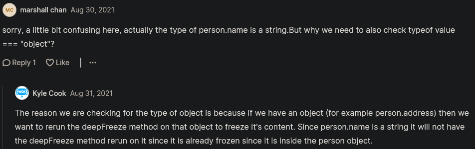

# Immutability 

- `Immutability` means can't be mutated means something which can't be changed

## When Immutability works

- A string or Boolean or etc which are not `passed by reference` 💡💡💡

- Eg : of normal integer variable
    ```js
    const FAVORITE_NUMBER = 3
    ```
    - now if we try to change the value of this variable then we'll get an error because it's a constant variable

- so constant variables are immutable bydefault 💡💡💡

- Eg : of array variable (which follows passed by reference)
    ```js
    const FAVORITE_NUMBERS = [1, 2, 3, 4]
    FAVORITE_NUMBERS.push(5) 
    console.log(FAVORITE_NUMBERS) // output : [1, 2, 3, 4, 5]
    ```
    - so here we got the output which means this is mutated means it's not immutable 
    - but if we redefine the array value into single integer value then we'll get an error 
    - because we're redefining the constant variable 💡💡💡 

    - so same thing with object which is also mutable 💡💡💡
    - so issue is we're using `const` keyword to define array or object variable & even we can update their values 

- `Making an Object immutable` : so we can use Object.freeze() to make that object immutable 💡💡💡
    - Eg : using Object.freeze() to make an object immutable
        ```js
        const person = {
            name : "Teen" 
        }
        Object.freeze(person)
        // OR
        const person = Object.freeze({
            name : "Teen"
        })

        person.name = "Gen"
        console.log(person.name) // output : Teen
        ```
        - so here we still got `Teen` because we freeze/stop that object from changing/mutating 
        - `Object.freeze()` means don't want to allow any changes inside this object & prevent those changes too 💡💡💡
    
    - there's a small problem with immutability by using `Object.freeze()`
        - that it doesn't work if we have nested object or array inside the object 💡💡💡
        - Eg : defining nested array to make changes inside that object
            ```js
            const person = Object.freeze({
                name : "Teen" , 
                friends : ["Steve" , "Elon"]
            })

            person.friends.push("Amaz")
            console.log(person.friends) // output : ["Steve", "Elon", "Amaz"]
            ```
            - so here we can see that `Object.freeze()` didn't work with nested object or array inside that object 
            - because `Object.freeze()` only freeze one level 💡💡💡

            - if we do this `person.friends = []` then the value of `friends` property will not change into empty array 
            - but we can still mutate as we seen above eg , so we need to freeze that array also 
        
        - Eg : `freezing that array which is inside the person object`
            ```js
            const person = Object.freeze({
                name : "Teen" , 
                friends : Object.freeze(["Steve" , "Elon"])
            })

            person.friends.push("Amaz")
            console.log(person.friends) // output : we'll get an error 
            ```
        
        - but this is pain that we need to use `Object.freeze()` again & again 
            - if we don't want to mutate that thing , so we can do deep freeze

- Eg : of `using deep freeze function instead of using Object.freeze() again & again ✅`
    ```js
    const person = deepFreeze({
        name : "Teen" , 
        friends : ["Steve" , "Elon"],
        address = {
            street: "1234"
        }
    })

    person.address.street = 1
    console.log(person.address.street) // output : 1234

    function deepFreeze(object) {
        Object.values(object).forEach(value => {
            if (value && typeof value === "object") {
                deepFreeze(value) 
            }
        })

        return Object.freeze(object)
    }
    ```
    - so we can see that `street` property didn't mutated because it's going through that `deepFreeze()` function 
        - so `deepFree()` function will freeze all the things inside that object or array no matter what how much deep it is 

    - so we can manually write that `deepFreeze()` function or we could use a library that has deepFreeze builtin 

## Reason Why we would even need to freeze the object or an array ✅

- so if we want something unchangeable then we can use `deepFreeze()` function 
    - but if we want to mutate the `person` object then instead of changing it 
    - just create a clone that has the changes built in which is where de-structuring & spread operators are super handy
    - when dealing with function programming 💡💡💡

- Eg : of cloning that object which contain all the changes
    ```js
    const person = deepFreeze({
        name : "Teen" , 
        friends : ["Steve" , "Elon"],
        address = {
            street: "1234"
        }
    })

    const newPerson = {...person , address: { ...person.address, street: "1"}}

    console.log(person)
    console.log(newPerson)

    function deepFreeze(object) {
        Object.values(object).forEach(value => {
            if (value && typeof value === "object") {
                deepFreeze(value) 
            }
        })

        return Object.freeze(object)
    }
    ```
    - here `{...person , address: { ...person.address, street: "1"}}` means
        - `newPerson` is a clone of that current `person` 
        - & then we're redefining the `address` property to have a new value of `street` property ✔️✔️✔️

    - so `console.log(person)` will print current person without changes in the value of `street` property 
        - & `console.log(newPerson)` will print the new person which has changes inside the value of `street` property

- `Best Practices ✅`
    - so cloning things & make changes inside that clone will make the code easier to debug & less bug 
        - because generally bugs come when we do mutations , so if we eliminate the amount of mutations that we do 
        - then we'll have less bugs 
        - & even testing code becomes more easier to do 💡💡💡
    - & even we can make deepFree() that newPerson also like this `deepFreeze({...person , address: { ...person.address, street: "1"}})`
    - so it just makes it easier to read & test code in the future 

    - Now technically with function programming , it's not really required that we wrap everything in a deepFreeze() 
        - & make everything frozen but we should limit the mutations that we're doing

    - even we can remove deepFreeze() from that current person because as we now that we don't wanna change it 
        - but we don't want to mutate accidentally that's why keep inside deepFreeze() function would be great 💡💡💡

## discussion page


