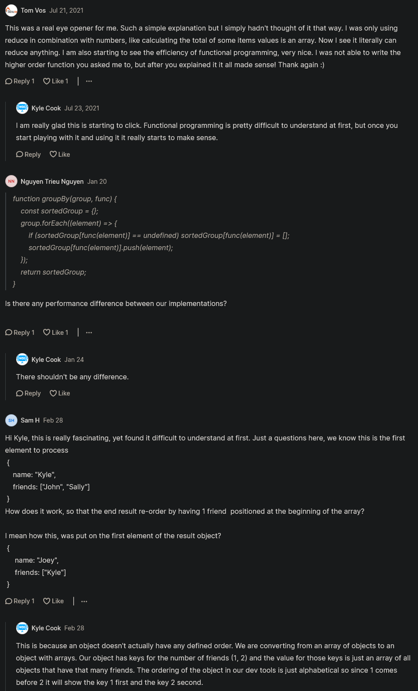

# Higher order functions 

- higher order functions are used most of the time 💡💡💡

## Example  

- Eg : of not a higher order functions
    - here we're doubling the value of these each values of `array` variable
    ```js
    const array = [1, 2, 3, 4, 5]

    const newArray = []

    for (let i = 0 ; i < array.length ; i++) {
        newArray.push(array[i] * 2)
    }

    console.log(newArray) // output : [2, 4, 6, 8, 10]
    ```
    - so we got correct output 
    - but with functional programming , we can't really use any type of loops like for loop , etc 
        - because every type of loop that we use , has some type of a variable that has mutated
        - like here we're constantly mutating `i` variable
        - so this is technically against functional programming 💡💡💡
    - so instead of using loop like for loop , while loop , etc loop , use higher order functions 

- `Higher Order functions` means passing a function as a argument inside another function while calling it 

- Eg : of Higher Order functions to loop through each values of an array
    ```js
    const array = [1, 2, 3, 4, 5]

    const newArray = array.map(element => element * 2)
    console.log(newArray) // output : [2, 4, 6, 8, 10]
    ```
    - so here `map()` method is a higher order function & it takes another function as a callback function
        - that's higher order function , so generally in a higher order function , we're doing this to simulate looping 
        - or going & iterating over an element or an object 
        - so in our case we're looping through each element in our array 
        - & we're performing this action `element => element * 2` on each elements
        - & that's kind of a core component to higher order functions & functional programming as a whole 💡💡💡

    - & we can do chaining also like this 
        ```js
        const array = [1, 2, 3, 4, 5]

        const newArray = array.map(element => element * 2).map(element => element / 3) // this is called chaining 
        console.log(newArray)
        ```
        - so we kind of chain these together all of these different higher order functions together
        - so that's kind of the core crux of functional programming & higher order functions 
        - & we'll see this all the time in functional style programming 💡💡💡

- we have built in higher order functions like reduce() , filter() , etc methods of an array 
    - but now how we can create our own custom higher order function 

## Creating custom Higher order function 

- Eg : of creating custom higher order function 
    ```js
    const array = [1, 2, 3, 4, 5]

    const newArray = everyOtherMap(array , element => element * 2)
    console.log(newArray)

    function everyOtherMap(a, func) {
        a.map((element, i) => {
            if (i % 2 === 0) func(element)
        })
    }
    ```
    - we'll get output : undefined 
    - because we need to return 
        ```js
        const array = [1, 2, 3, 4, 5]

        const newArray = everyOtherMap(array , element => element * 2)
        console.log(newArray)

        function everyOtherMap(a, func) {
            return a.map((element, i) => {
                if (i % 2 === 0) func(element)
            })
        }
        ```
    - we still get output : (5) [undefined, undefined, undefined, undefined, undefined]
    - because we need to return `func(element)` & default will be returned i.e element
        ```js
        const array = [1, 2, 3, 4, 5]

        const newArray = everyOtherMap(array , element => element * 2)
        console.log(newArray)

        function everyOtherMap(a, func) {
            return a.map((element, i) => {
                if (i % 2 === 0) return func(element)
                return element
            })
        }
        ```
    - we'll get output i.e (5) [2, 2, 6, 4, 10]

- & `nodeList` only have map() method of array
    - but we can pass it inside the custom higher order function
    - but at the end we need to convert nodeList into actual array , so we don't need to worry 💡💡💡

## Challenge Time

- Ques : 
    ```js
    const person = {
        {
            name: "Gen" , 
            friends: ["Jatin" , "Steve"]
        } , 
        {
            name: "Tim Cook",
            friends: ["Vipi"]
        } ,
        {
            name: "Elon" , 
            friends: ["Fleet" , "Harry"]
        }
    }
    ```
    - now create a function called a groupby & this function is gonna be a hider order function
        - & this function going to group by whatever we pass in 
    - so we wanna group these people by the actual amount of friends that they have
        - so the result of calling groupby

- Ans : 
    ```js
    const person = {
        {
            name: "Gen" , 
            friends: ["Jatin" , "Steve"]
        } , 
        {
            name: "Tim Cook",
            friends: ["Vipi"]
        } ,
        {
            name: "Elon" , 
            friends: ["Fleet" , "Harry"]
        }
    }

    const results = groupBy(people , person => person.friends.length)
    console.log(results)
    
    function groupBy(array , func) {
        return array.reduce((grouping, element) => {
            const key = func(element)
            // if (grouping[key]) {
            //    grouping[key].push(element)
            //} else {
            //    grouping[key] = [element]
            //}
            // OR (alternative of this if else block code)
            if (grouping[key] == null) grouping[key] = []
            grouping[key].push(element)
            return grouping
        } , {}) // her bydefault value of accumulator i.e `grouping` will be an empty array
    }
    ```
    - `return grouping` means we need to return grouping so it gets to the next arrays in of our reduce   
    - so we'll get output with friends length which means we'll get how many friends each person has 

    - now we can do another group by for person.name
        ```js
        const person = {
            {
                name: "Gen" , 
                friends: ["Jatin" , "Steve"]
            } , 
            {
                name: "Tim Cook",
                friends: ["Vipi"]
            } ,
            {
                name: "Elon" , 
                friends: ["Fleet" , "Harry"]
            } , 
            {
                name: "Gen" , 
                friends: ["Jatin"]
            }
        }

        const results = groupBy(people , person => person.name)
        console.log(results)
        
        function groupBy(array , func) {
            return array.reduce((grouping, element) => {
                const key = func(element)
                if (grouping[key] == null) grouping[key] = []
                grouping[key].push(element)
                return grouping
            } , {}) 
        }
        ```
        - so inside the output , we can see for `Gen` we have two entries & we have both the people where the name is equal to kyle

- so higher order function generally takes another function as a argument & do some operations based on that function

## ------ Extra stuff of higher order functions ------

- videos 
    - https://www.youtube.com/watch?v=E1_VLQ9qxWQ&ab_channel=ThapaTechnical
    - https://www.youtube.com/watch?v=oGpA98nNx6Y&ab_channel=CoderDost
    - https://www.youtube.com/watch?v=HkWxvB1RJq0&ab_channel=AkshaySaini
    - https://www.youtube.com/watch?v=xILF_Z8e9yU&ab_channel=RahulMishra
    - https://www.youtube.com/watch?v=lZdaLjgmwOU&ab_channel=ThapaTechnical
- blogs 
    - https://blog.henzzo.com/higher-order-functions-in-javascript
    - https://ordinarycoders.com/blog/article/high-order-javascript-functions
    - https://www.freecodecamp.org/news/higher-order-functions-in-javascript-examples/
    - https://medium.com/swlh/higher-order-functions-in-javascript-4013be700c2b
    - https://betterprogramming.pub/higher-order-functions-in-javascript-4c9b40119ba6
    - https://eloquentjavascript.net/05_higher_order.html

## discussion page


