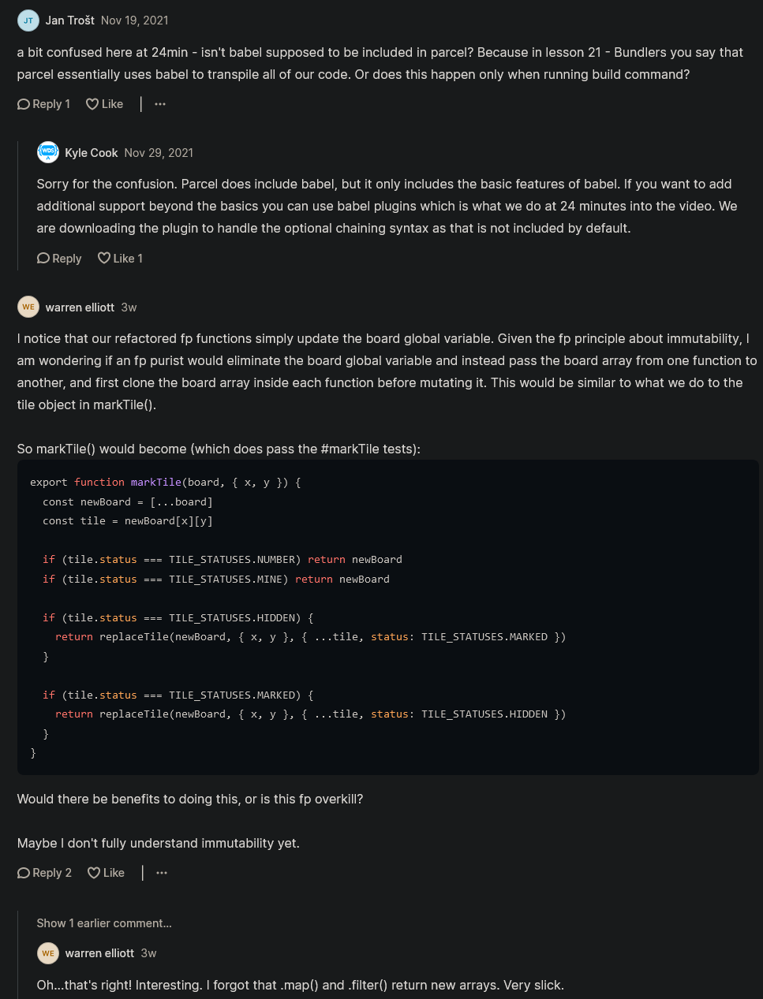

# Minesweeper function programming project

## Starter Code 

<details>
    <summary>index.html</summary>

```html
<!DOCTYPE html>
<html lang="en">
<head>
  <meta charset="UTF-8">
  <meta name="viewport" content="width=device-width, initial-scale=1.0">
  <link rel="stylesheet" href="styles.css">
  <script src="script.js" type="module"></script>
  <title>Minesweeper</title>
</head>
<body>
  <h3 class="title">Minesweeper</h3>
  <div class="subtext">
    Mines Left: <span data-mine-count></span>
  </div>
  <div class="board"></div>
</body>
</html>
```
</details>

<details>
    <summary>styles.css</summary>

```css
* {
  box-sizing: border-box;
}

body {
  margin: 0;
  background-color: #333;
  display: flex;
  align-items: center;
  font-size: 3rem;
  flex-direction: column;
  color: white;
}

.title {
  margin: 20px;
}

.subtext {
  color: #CCC;
  font-size: 1.5rem;
  margin-bottom: 10px;
}

.board {
  display: inline-grid;
  padding: 10px;
  grid-template-columns: repeat(var(--size), 60px);
  grid-template-rows: repeat(var(--size), 60px);
  gap: 4px;
  background-color: #777;
}

.board > * {
  width: 100%;
  height: 100%;
  display: flex;
  justify-content: center;
  align-items: center;
  color: white;
  border: 2px solid #BBB;
  user-select: none;
}

.board > [data-status="hidden"] {
  background-color: #BBB;
  cursor: pointer;
}

.board > [data-status="mine"] {
  background-color: red;
}

.board > [data-status="number"] {
  background-color: none;
}

.board > [data-status="marked"] {
  background-color: yellow;
}
```
</details>

<details>
    <summary>script.js</summary>

```js
// Display/UI

import {
  TILE_STATUSES,
  createBoard,
  markTile,
  revealTile,
  checkWin,
  checkLose,
} from "./minesweeper.js"

const BOARD_SIZE = 10
const NUMBER_OF_MINES = 3

const board = createBoard(BOARD_SIZE, NUMBER_OF_MINES)
const boardElement = document.querySelector(".board")
const minesLeftText = document.querySelector("[data-mine-count]")
const messageText = document.querySelector(".subtext")

board.forEach(row => {
  row.forEach(tile => {
    boardElement.append(tile.element)
    tile.element.addEventListener("click", () => {
      revealTile(board, tile)
      checkGameEnd()
    })
    tile.element.addEventListener("contextmenu", e => {
      e.preventDefault()
      markTile(tile)
      listMinesLeft()
    })
  })
})
boardElement.style.setProperty("--size", BOARD_SIZE)
minesLeftText.textContent = NUMBER_OF_MINES

function listMinesLeft() {
  const markedTilesCount = board.reduce((count, row) => {
    return (
      count + row.filter(tile => tile.status === TILE_STATUSES.MARKED).length
    )
  }, 0)

  minesLeftText.textContent = NUMBER_OF_MINES - markedTilesCount
}

function checkGameEnd() {
  const win = checkWin(board)
  const lose = checkLose(board)

  if (win || lose) {
    boardElement.addEventListener("click", stopProp, { capture: true })
    boardElement.addEventListener("contextmenu", stopProp, { capture: true })
  }

  if (win) {
    messageText.textContent = "You Win"
  }
  if (lose) {
    messageText.textContent = "You Lose"
    board.forEach(row => {
      row.forEach(tile => {
        if (tile.status === TILE_STATUSES.MARKED) markTile(tile)
        if (tile.mine) revealTile(board, tile)
      })
    })
  }
}

function stopProp(e) {
  e.stopImmediatePropagation()
}
```
</details>

<details>
    <summary>minesweeper.js</summary>

```js
// Logic

export const TILE_STATUSES = {
  HIDDEN: "hidden",
  MINE: "mine",
  NUMBER: "number",
  MARKED: "marked",
}

export function createBoard(boardSize, numberOfMines) {
  const board = []
  const minePositions = getMinePositions(boardSize, numberOfMines)

  for (let x = 0; x < boardSize; x++) {
    const row = []
    for (let y = 0; y < boardSize; y++) {
      const element = document.createElement("div")
      element.dataset.status = TILE_STATUSES.HIDDEN

      const tile = {
        element,
        x,
        y,
        mine: minePositions.some(positionMatch.bind(null, { x, y })),
        get status() {
          return this.element.dataset.status
        },
        set status(value) {
          this.element.dataset.status = value
        },
      }

      row.push(tile)
    }
    board.push(row)
  }

  return board
}

export function markTile(tile) {
  if (
    tile.status !== TILE_STATUSES.HIDDEN &&
    tile.status !== TILE_STATUSES.MARKED
  ) {
    return
  }

  if (tile.status === TILE_STATUSES.MARKED) {
    tile.status = TILE_STATUSES.HIDDEN
  } else {
    tile.status = TILE_STATUSES.MARKED
  }
}

export function revealTile(board, tile) {
  if (tile.status !== TILE_STATUSES.HIDDEN) {
    return
  }

  if (tile.mine) {
    tile.status = TILE_STATUSES.MINE
    return
  }

  tile.status = TILE_STATUSES.NUMBER
  const adjacentTiles = nearbyTiles(board, tile)
  const mines = adjacentTiles.filter(t => t.mine)
  if (mines.length === 0) {
    adjacentTiles.forEach(revealTile.bind(null, board))
  } else {
    tile.element.textContent = mines.length
  }
}

export function checkWin(board) {
  return board.every(row => {
    return row.every(tile => {
      return (
        tile.status === TILE_STATUSES.NUMBER ||
        (tile.mine &&
          (tile.status === TILE_STATUSES.HIDDEN ||
            tile.status === TILE_STATUSES.MARKED))
      )
    })
  })
}

export function checkLose(board) {
  return board.some(row => {
    return row.some(tile => {
      return tile.status === TILE_STATUSES.MINE
    })
  })
}

function getMinePositions(boardSize, numberOfMines) {
  const positions = []

  while (positions.length < numberOfMines) {
    const position = {
      x: randomNumber(boardSize),
      y: randomNumber(boardSize),
    }

    if (!positions.some(positionMatch.bind(null, position))) {
      positions.push(position)
    }
  }

  return positions
}

function positionMatch(a, b) {
  return a.x === b.x && a.y === b.y
}

function randomNumber(size) {
  return Math.floor(Math.random() * size)
}

function nearbyTiles(board, { x, y }) {
  const tiles = []

  for (let xOffset = -1; xOffset <= 1; xOffset++) {
    for (let yOffset = -1; yOffset <= 1; yOffset++) {
      const tile = board[x + xOffset]?.[y + yOffset]
      if (tile) tiles.push(tile)
    }
  }

  return tiles
}
```
</details>

## complete code 

<details>
    <summary>index.html</summary>

```html
<!DOCTYPE html>
<html lang="en">
<head>
  <meta charset="UTF-8">
  <meta name="viewport" content="width=device-width, initial-scale=1.0">
  <link rel="stylesheet" href="styles.css">
  <script src="script.js" type="module"></script>
  <title>Minesweeper</title>
</head>
<body>
  <h3 class="title">Minesweeper</h3>
  <div class="subtext">
    Mines Left: <span data-mine-count></span>
  </div>
  <div class="board"></div>
</body>
</html>
```
</details>

<details>
    <summary>styles.css</summary>

```css
* {
  box-sizing: border-box;
}

body {
  margin: 0;
  background-color: #333;
  display: flex;
  align-items: center;
  font-size: 3rem;
  flex-direction: column;
  color: white;
}

.title {
  margin: 20px;
}

.subtext {
  color: #CCC;
  font-size: 1.5rem;
  margin-bottom: 10px;
}

.board {
  display: inline-grid;
  padding: 10px;
  grid-template-columns: repeat(var(--size), 60px);
  grid-template-rows: repeat(var(--size), 60px);
  gap: 4px;
  background-color: #777;
}

.board > * {
  width: 100%;
  height: 100%;
  display: flex;
  justify-content: center;
  align-items: center;
  color: white;
  border: 2px solid #BBB;
  user-select: none;
}

.board > [data-status="hidden"] {
  background-color: #BBB;
  cursor: pointer;
}

.board > [data-status="mine"] {
  background-color: red;
}

.board > [data-status="number"] {
  background-color: none;
}

.board > [data-status="marked"] {
  background-color: yellow;
}
```
</details>

<details>
    <summary>.babelrc</summary>

```
{
  "plugins": [
    "@babel/plugin-proposal-optional-chaining"
  ]
}
```
</details>

<details>
    <summary>.gitignore</summary>

```
node_modules
dist
.cache
```
</details>

<details>
  <summary>package-lock.json</summary>

```
upload package-lock.json file also on github of this project
```
</details>

<details>
    <summary>package.json</summary>

```json
{
  "name": "current-project",
  "version": "1.0.0",
  "description": "",
  "main": "minesweeper.js",
  "scripts": {
    "build": "parcel build index.html",
    "start": "parcel index.html"
  },
  "keywords": [],
  "author": "",
  "license": "ISC",
  "dependencies": {
    "lodash": "^4.17.21"
  },
  "devDependencies": {
    "@babel/core": "^7.13.8",
    "@babel/plugin-proposal-optional-chaining": "^7.13.8",
    "parcel-bundler": "1.12.3"
  }
}
```
</details>

<details>
    <summary>minesweeper.js</summary>

```js
import { times, range } from "lodash/fp"

export const TILE_STATUSES = {
  HIDDEN: "hidden",
  MINE: "mine",
  NUMBER: "number",
  MARKED: "marked",
}

export function createBoard(boardSize, minePositions) {
  return times(x => {
    return times(y => {
      return {
        x,
        y,
        mine: minePositions.some(positionMatch.bind(null, { x, y })),
        status: TILE_STATUSES.HIDDEN,
      }
    }, boardSize)
  }, boardSize)
}

export function markedTilesCount(board) {
  return board.reduce((count, row) => {
    return (
      count + row.filter(tile => tile.status === TILE_STATUSES.MARKED).length
    )
  }, 0)
}

export function markTile(board, { x, y }) {
  const tile = board[x][y]
  if (
    tile.status !== TILE_STATUSES.HIDDEN &&
    tile.status !== TILE_STATUSES.MARKED
  ) {
    return board
  }

  if (tile.status === TILE_STATUSES.MARKED) {
    return replaceTile(
      board,
      { x, y },
      { ...tile, status: TILE_STATUSES.HIDDEN }
    )
  } else {
    return replaceTile(
      board,
      { x, y },
      { ...tile, status: TILE_STATUSES.MARKED }
    )
  }
}

function replaceTile(board, position, newTile) {
  return board.map((row, x) => {
    return row.map((tile, y) => {
      if (positionMatch(position, { x, y })) {
        return newTile
      }
      return tile
    })
  })
}

export function revealTile(board, { x, y }) {
  const tile = board[x][y]
  if (tile.status !== TILE_STATUSES.HIDDEN) {
    return board
  }

  if (tile.mine) {
    return replaceTile(board, { x, y }, { ...tile, status: TILE_STATUSES.MINE })
  }

  const adjacentTiles = nearbyTiles(board, tile)
  const mines = adjacentTiles.filter(t => t.mine)
  const newBoard = replaceTile(
    board,
    { x, y },
    { ...tile, status: TILE_STATUSES.NUMBER, adjacentMinesCount: mines.length }
  )
  if (mines.length === 0) {
    return adjacentTiles.reduce((b, t) => {
      return revealTile(b, t)
    }, newBoard)
  }
  return newBoard
}

export function checkWin(board) {
  return board.every(row => {
    return row.every(tile => {
      return (
        tile.status === TILE_STATUSES.NUMBER ||
        (tile.mine &&
          (tile.status === TILE_STATUSES.HIDDEN ||
            tile.status === TILE_STATUSES.MARKED))
      )
    })
  })
}

export function checkLose(board) {
  return board.some(row => {
    return row.some(tile => {
      return tile.status === TILE_STATUSES.MINE
    })
  })
}

export function positionMatch(a, b) {
  return a.x === b.x && a.y === b.y
}

function nearbyTiles(board, { x, y }) {
  const offsets = range(-1, 2)

  return offsets
    .flatMap(xOffset => {
      return offsets.map(yOffset => {
        return board[x + xOffset]?.[y + yOffset]
      })
    })
    .filter(tile => tile != null)
}
```
</details>

<details>
    <summary>script.js</summary>

```js
// Display/UI

import {
  TILE_STATUSES,
  createBoard,
  markTile,
  revealTile,
  checkWin,
  checkLose,
  positionMatch,
  markedTilesCount,
} from "./minesweeper.js"

const BOARD_SIZE = 10
const NUMBER_OF_MINES = 3

let board = createBoard(
  BOARD_SIZE,
  getMinePositions(BOARD_SIZE, NUMBER_OF_MINES)
)
const boardElement = document.querySelector(".board")
const minesLeftText = document.querySelector("[data-mine-count]")
const messageText = document.querySelector(".subtext")

function render() {
  boardElement.innerHTML = ""
  checkGameEnd()

  getTileElements().forEach(element => {
    boardElement.append(element)
  })

  listMinesLeft()
}

function getTileElements() {
  return board.flatMap(row => {
    return row.map(tileToElement)
  })
}

function tileToElement(tile) {
  const element = document.createElement("div")
  element.dataset.status = tile.status
  element.dataset.x = tile.x
  element.dataset.y = tile.y
  element.textContent = tile.adjacentMinesCount || ""
  return element
}

boardElement.addEventListener("click", e => {
  if (!e.target.matches("[data-status]")) return

  board = revealTile(board, {
    x: parseInt(e.target.dataset.x),
    y: parseInt(e.target.dataset.y),
  })
  render()
})

boardElement.addEventListener("contextmenu", e => {
  if (!e.target.matches("[data-status]")) return

  e.preventDefault()
  board = markTile(board, {
    x: parseInt(e.target.dataset.x),
    y: parseInt(e.target.dataset.y),
  })
  render()
})

boardElement.style.setProperty("--size", BOARD_SIZE)
render()

function listMinesLeft() {
  minesLeftText.textContent = NUMBER_OF_MINES - markedTilesCount(board)
}

function checkGameEnd() {
  const win = checkWin(board)
  const lose = checkLose(board)

  if (win || lose) {
    boardElement.addEventListener("click", stopProp, { capture: true })
    boardElement.addEventListener("contextmenu", stopProp, { capture: true })
  }

  if (win) {
    messageText.textContent = "You Win"
  }
  if (lose) {
    messageText.textContent = "You Lose"
    board.forEach(row => {
      row.forEach(tile => {
        if (tile.status === TILE_STATUSES.MARKED) board = markTile(board, tile)
        if (tile.mine) board = revealTile(board, tile)
      })
    })
  }
}

function stopProp(e) {
  e.stopImmediatePropagation()
}

function getMinePositions(boardSize, numberOfMines) {
  const positions = []

  while (positions.length < numberOfMines) {
    const position = {
      x: randomNumber(boardSize),
      y: randomNumber(boardSize),
    }

    if (!positions.some(positionMatch.bind(null, position))) {
      positions.push(position)
    }
  }

  return positions
}

function randomNumber(size) {
  return Math.floor(Math.random() * size)
}
```
</details>

## Explanation of Minesweeper project with function programming 

- so we'll be refactoring the entire Minesweeper project & using function programming concepts inside of it 
    - & to minimize the amount of actual side effects & mutations that we have inside of our code 
    - coverting this code directly into functional programming will be complex 
        - & hard to make changes from normal code to functional programming 

- we need to figure out where we need to keep mutations & where we can actually remove them
  - so inside minesweeper.js file , we have tons of mutations 
  - Eg : inside minesweeper.js file 
    - we have `element` variable & we have getter & setter which allows us to change the dataset status dynamically 
    - which contain ton of mutation going on , etc.. mutations is going on 
  - & Eg : inside script.js file , 
    - we also have a lot of mutations in side effects 
    - but inside this file , the view is lot more okay 
      - because at some point we need make some type of mutation & side effect 💡💡💡
      - otherwise we'll never going to be able to change the view on our screen 💡💡💡
      - so that's a side effect in mutation that we need to be able to handle 💡💡💡
    - so for the most part , everything in this file , we're okay with having mutations 
    - but inside minesweeper.js file , we want to remove all the side-effects & all the mutations 
      - because this is kindof like our low level code 

  - the important thing in functional programming i.e is to take the mutations & side effects
    - & instead of having them in these small little functions down 
    - like insde minesweeper.js file , inside revealTitle() function , there is a `if (tile.mine)` condition
    - we want them to move them up as close to the top of our function stack as possible

- inside script.js file , the first major side effects is that we're modifying our board variable 
  - like `board` variable which we're constantly modifying the underlying arrays & objects inside of our board
  - instead of replacing our board variable with a brand new immutable object we're contantly mutating & changing board

- inside minesweeper.js file , inside createBoard() function 
  - none of these functions actually modify our board & instead they returned to us a brand new board 
    - & this new board is what we're going to render out to our screen
    - & then almost all of the mutations that we deal with , we're going to put inside of that single render function 
    - & that render function is going to take in our `board` variable (which is just an array of data)
    - & it's going to render that out to our screen exactly as it should be 
  - inside script.js file , every single time we call a function such as `markTile`
    - it'll take in the current board & it'll return us a brand new board & that new board will have that tile marked
    - so instead of modifying & mutating the current board , 
    - we're going to return a brand new set of arrays that represent our board
    - & then we're going to use some weird render function & that render function contains all of our mutation data that we need
    - & actually renders everything to the screen

- `STEP 1` : inside script.js file 
    ```js
    // Display/UI

    import {
      TILE_STATUSES,
      createBoard,
      markTile,
      revealTile,
      checkWin,
      checkLose,
    } from "./minesweeper.js"

    const BOARD_SIZE = 10
    const NUMBER_OF_MINES = 3

    const board = createBoard(BOARD_SIZE, NUMBER_OF_MINES)
    const boardElement = document.querySelector(".board")
    const minesLeftText = document.querySelector("[data-mine-count]")
    const messageText = document.querySelector(".subtext")

    function render() {

    }

    board.forEach(row => {
      row.forEach(tile => {
        boardElement.append(tile.element)
        tile.element.addEventListener("click", () => {
          revealTile(board, tile)
          checkGameEnd()
        })
        tile.element.addEventListener("contextmenu", e => {
          e.preventDefault()
          markTile(tile)
          listMinesLeft()
        })
      })
    })
    ```
  - this `render()` function will take that `board` variable
    - & it's just going to render it out to the screen
  - so whatever we did inside board.forEach() , will be same little bit inside render() function
    - so we want to render every single time through render() function

  - `STEP 1.1` : inside script.js file , inside render() function
      ```js
      const board = createBoard(BOARD_SIZE, NUMBER_OF_MINES)
      const boardElement = document.querySelector(".board")
      const minesLeftText = document.querySelector("[data-mine-count]")
      const messageText = document.querySelector(".subtext")

      function render() {
        boardElement.innerHTMl = "" 
      }
      ```
    - we want to clear it out because each time that we render
      - because each time that we render , we're rendering a brand new board
      - so we want to clear the entire old board & then render brand new board completely
      - & to do this , we just need to get all the tiles from our board

  - `STEP 1.2` : inside script.js file , inside render() function
    - getting all the tiles from our board
      ```js
      const board = createBoard(BOARD_SIZE, NUMBER_OF_MINES)
      const boardElement = document.querySelector(".board")
      const minesLeftText = document.querySelector("[data-mine-count]")
      const messageText = document.querySelector(".subtext")

      function render() {
        boardElement.innerHTMl = "" 

        getTileElements().forEach(element => {
          boardElement.append(element)
        }) 
      }
      ```
    - this `getTileElements()` function will return an array of all the different tiles that we need to put into our board
      - then we loop through (on getTileElements() function) each one of those elements
      - & then we added those each elements inside `boardElement` variable 

- `STEP 2` : inside minesweeper.js file
  - take these lines of code i.e 
    ```js
    const element = document.createElement("div")
    element.dataset.status = TILE_STATUSES.HIDDEN
    ```
    - move these lines of code our from that `createBoard()` function 
    - & move them up the stack all the way to our script js file
    - so cut these line of code & paste these inside script.js file like this 
  
  - `STEP 2.1` : inside script.js file , pasting those lines of code inside titleToElement() function
      ```js
      const board = createBoard(BOARD_SIZE, NUMBER_OF_MINES)
      const boardElement = document.querySelector(".board")
      const minesLeftText = document.querySelector("[data-mine-count]")
      const messageText = document.querySelector(".subtext")

      function render() {
        boardElement.innerHTMl = "" 

        getTileElements().forEach(element => {
          boardElement.append(element)
        }) 
      }

      function getTileElements() {
        return board.flatMap(row => {
          return row.map(tileToElement)
        })
      }

      function tileToElement(tile) {
        const element = document.createElement("div")
        element.dataset.status = tile.status
        element.dataset.x = tile.x
        element.dataset.y = tile.y
      }
      ```
    - flatMap() method means we want to convert 2D array into 1D array but it can't 3D or etc dimensional array into 1D array      

    - so inside `getTileElements()` function , we're getting our board & returning a flattened array 
      - that converts all the tiles in our rows to elements

    - now inside minesweeper.js file , 
      - inside revealTile() function we're manually changing the text content i.e `tile.element.textContent = mines.length`
      - to be the length of our mines
      - so we can't do any mutations in this file , so instead we're going to do something like `tile.adjacentMineCount`
        - something like this we'll do 

  - `STEP 2.2` : inside script.js file , inside tileToElement() function
      ```js
      let board = createBoard(BOARD_SIZE, NUMBER_OF_MINES)
      const boardElement = document.querySelector(".board")
      const minesLeftText = document.querySelector("[data-mine-count]")
      const messageText = document.querySelector(".subtext")

      function render() {
        boardElement.innerHTMl = "" 

        getTileElements().forEach(element => {
          boardElement.append(element)
        }) 
      }

      function getTileElements() {
        return board.flatMap(row => {
          return row.map(tileToElement)
        })
      }

      function tileToElement(tile) {
        const element = document.createElement("div")
        element.dataset.status = tile.status
        element.dataset.x = tile.x
        element.dataset.y = tile.y
        element.textContent = tile.adjacentMinesCount || ""
        return element
      }
      ```
    - so this tileToElement() function used in render() function 
    - & render() function deals with all of the mutations for us 

  - so all this means we take the `board` variable & we converted it to a bunch of different elements inside tileToElement() function
    - & then we render our those elements to the screen by using that render() function 
    - & now every time we modify that `board` variable then we're going to call that render() function
  - & we made the `board` variable as `let` because we're going to be mutating this variable
    - which allows to call that render() function which has the side effect of rendering out all that information to our screen

- now inside script.js file , `tile.element.addEventListener()` will be as global event listener that we need to setup
- `STEP 3` : inside script.js file , setting up a global event listener on `tile` variable 
    ```js
    let board = createBoard(BOARD_SIZE, NUMBER_OF_MINES)
    const boardElement = document.querySelector(".board")
    const minesLeftText = document.querySelector("[data-mine-count]")
    const messageText = document.querySelector(".subtext")

    function render() {
      boardElement.innerHTMl = "" 

      getTileElements().forEach(element => {
        boardElement.append(element)
      }) 
    }

    function getTileElements() {
      return board.flatMap(row => {
        return row.map(tileToElement)
      })
    }

    function tileToElement(tile) {
      const element = document.createElement("div")
      element.dataset.status = tile.status
      element.dataset.x = tile.x
      element.dataset.y = tile.y
      element.textContent = tile.adjacentMinesCount || ""
      return element
    }

    boardElement.addEventListener('click', e => {
      if (!e.target.matches('[data-status]')) return

      board = revealTile(board, board[parseInt(e.target.dataset.x)][parseInt(e.target.dataset.y)])
      render()
    })
    ```
  - here we done is that we've passed down our tile in our board to that revealTile() function 
  - & then we called render() function , every time we change our tile 
  - so `board = revealTile(board, board[parseInt(e.target.dataset.x)][parseInt(e.target.dataset.y)])`
    - means we're retuning a brand new board instead of modifying our board
  - so till yet whatever we did is for right click mouse 

  - `STEP 3.1` : inside script.js file , setting up for left click mouse
      ```js
      boardElement.addEventListener('click', e => {
        if (!e.target.matches('[data-status]')) return

        board = revealTile(board, board[parseInt(e.target.dataset.x)][parseInt(e.target.dataset.y)])
        render()
      })

      boardElement.addEventListener('contextmenu', e => {
        if (!e.target.matches('[data-status]')) return

        e.preventDefault()
        revealTile(board , board[parseInt(e.target.dataset.x)][parseInt(e.target.dataset.y)])
        render()
      })
      ```

  - now let's work on list of mines left & check game is end or not 
    - so move that listMinesLeft() & checkGameEnd() functions from board.forEach() to render() function
  - `STEP 3.2` : inside script.js file , putting listMinesLeft() & checkGameEnd() functions inside render() functions
      ```js
      let board = createBoard(BOARD_SIZE, NUMBER_OF_MINES)
      const boardElement = document.querySelector(".board")
      const minesLeftText = document.querySelector("[data-mine-count]")
      const messageText = document.querySelector(".subtext")

      function render() {
        boardElement.innerHTMl = "" 
        checkGameEnd()

        getTileElements().forEach(element => {
          boardElement.append(element)
        }) 

        leftMinesLeft()
      }

      function getTileElements() {
        return board.flatMap(row => {
          return row.map(tileToElement)
        })
      }

      function tileToElement(tile) {
        const element = document.createElement("div")
        element.dataset.status = tile.status
        element.dataset.x = tile.x
        element.dataset.y = tile.y
        element.textContent = tile.adjacentMinesCount || ""
        return element
      }

      boardElement.addEventListener('click', e => {
        if (!e.target.matches('[data-status]')) return

        board = revealTile(board, board[parseInt(e.target.dataset.x)][parseInt(e.target.dataset.y)])
        render()
      })

      boardElement.addEventListener('contextmenu', e => {
        if (!e.target.matches('[data-status]')) return

        e.preventDefault()
        revealTile(board , board[parseInt(e.target.dataset.x)][parseInt(e.target.dataset.y)])
        render()
      })
      ```
    - now remove this lines of code completely from inside script.js file 
      ```
      board.forEach(row => {
        row.forEach(tile => {
          boardElement.append(tile.element)
          tile.element.addEventListener("click", () => {
            revealTile(board, tile)
            checkGameEnd()
          })
          tile.element.addEventListener("contextmenu", e => {
            e.preventDefault()
            markTile(tile)
            listMinesLeft()
          })
        })
      })
      ```
  
  - `STEP 3.3` : inside script.js file , calling render() function
    ```js
    let board = createBoard(BOARD_SIZE, NUMBER_OF_MINES)
    const boardElement = document.querySelector(".board")
    const minesLeftText = document.querySelector("[data-mine-count]")
    const messageText = document.querySelector(".subtext")

    function render() {
      boardElement.innerHTMl = "" 
      checkGameEnd()

      getTileElements().forEach(element => {
        boardElement.append(element)
      }) 

      leftMinesLeft()
    }

    function getTileElements() {
      return board.flatMap(row => {
        return row.map(tileToElement)
      })
    }

    function tileToElement(tile) {
      const element = document.createElement("div")
      element.dataset.status = tile.status
      element.dataset.x = tile.x
      element.dataset.y = tile.y
      element.textContent = tile.adjacentMinesCount || ""
      return element
    }

    boardElement.addEventListener('click', e => {
      if (!e.target.matches('[data-status]')) return

      board = revealTile(board, board[parseInt(e.target.dataset.x)][parseInt(e.target.dataset.y)])
      render()
    })

    boardElement.addEventListener('contextmenu', e => {
      if (!e.target.matches('[data-status]')) return

      e.preventDefault()
      markTile(board , board[parseInt(e.target.dataset.x)][parseInt(e.target.dataset.y)])
      render()
    })

    boardElement.style.setProperty("--size", BOARD_SIZE)
    render()
    minesLeftText.textContent = NUMBER_OF_MINES
    ```

  - output : after saving everything , then we'll get an error inside console tab
    - i.e ReferenceError : element is not defined at createBoard

  - `STEP 3.4` : inside minesweeper.js file , remove the `element` variable & getter & setter for status 
      ```js
      export function createBoard(boardSize, numberOfMines) {
        const board = []
        const minePositions = getMinePositions(boardSize, numberOfMines)

        for (let x = 0; x < boardSize; x++) {
          const row = []
          for (let y = 0; y < boardSize; y++) {
            const element = document.createElement("div")
            element.dataset.status = TILE_STATUSES.HIDDEN

            const tile = {
              x,
              y,
              mine: minePositions.some(positionMatch.bind(null, { x, y })),
              status: TILE_STATUES.HIDDEN 
            }

            row.push(tile)
          }
          board.push(row)
        }

        return board
      }
      ```
    - `status: TILE_STATUES.HIDDEN` means by doing this we've removed the side-effects & the mutations tha we deal with 
      - by setting our `status` property & affecting the actual element itself
    - now we have only one `status` property variable (which is a string) , so it's much more simple to work with 

    - testing output : now everything works fine & no error is coming 

- now we want to mark a tile when we do right click 
- `STEP 4` : inside minesweeper.js file , we need to make markTile() function work
    - let's work on markTile() function to make it work
    ```js
    export function markTile(board , { x , y }) {
      const tile = board[x][y]
      if (
        tile.status !== TILE_STATUSES.HIDDEN &&
        tile.status !== TILE_STATUSES.MARKED
      ) {
        return board  
      }

      if (tile.status === TILE_STATUSES.MARKED) {
        tile.status = TILE_STATUSES.HIDDEN
      } else {
        tile.status = TILE_STATUSES.MARKED
      }
    }
    ```
  - so we're getting the tile positions but still we can't make mutations because we need to return a brand new board
    - based on that current board
    - `Reason why we're passing current board` : because we want to access what the board looks like
    - so we can return a new one 
  
  - so this line of code 
    ```
    if (
      tile.status !== TILE_STATUSES.HIDDEN &&
      tile.status !== TILE_STATUSES.MARKED
    )
    ```
    - didn't executed then we want to `return board` means don't make any changes & return a brand new board
  - otherwise we want to make changes inside `if (tile.status === TILE_STATUSES.MARKED)`
    - but instead of directly mutating our tile we're going to return a brand new board
    - where we're going to replace our current `tile` with a new tile that has the correct status being set
    - & to make this problem easier then create a function like this 
  - `STEP 4.1` : inside minesweeper.js file , working on markTile() function
      ```js
      export function markTile(board , { x , y }) {
        const tile = board[x][y]
        if (
          tile.status !== TILE_STATUSES.HIDDEN &&
          tile.status !== TILE_STATUSES.MARKED
        ) {
          return board  
        }

        if (tile.status === TILE_STATUSES.MARKED) {
          return replaceTile(board , { x, y } , { ...tile, status: TILE_STATUSES.HIDDEN})
        } else {
          return replaceTile(board , { x, y } , { ...tile, status: TILE_STATUSES.MARKED})
        }
      }
      ```
    - `replaceTile(board , { x, y } , { ...tile, status: TILE_STATUSES.HIDDEN})` means 
      - here `board` means we want to return that board
      - & then get the position i.e `{ x, y }` 
      - & replace this position of a tile through this `{ ...tile, status: TILE_STATUSES.HIDDEN}`
      - & then we'll get brand new board 
    
    - now this `markTile()` function follows the concept of functional programming 
      - because there's no mutations & no side-effects & we're just doing simple if else checks 

  - `STEP 4.2` : inside minesweeper.js file , working on replaceTile() function
      ```js
      export function markTile(board , { x , y }) {
        const tile = board[x][y]
        if ( tile.status !== TILE_STATUSES.HIDDEN && tile.status !== TILE_STATUSES.MARKED) {
          return board  
        }

        if (tile.status === TILE_STATUSES.MARKED) {
          return replaceTile(board , { x, y } , { ...tile, status: TILE_STATUSES.HIDDEN})
        } else {
          return replaceTile(board , { x, y } , { ...tile, status: TILE_STATUSES.MARKED})
        }
      }

      function replaceTile(board, position, newTile) {
        return board.map((row, x) => {
          return row.map((tile, y) => {
            if (positionMatch(position , { x, y })) {
              return newTile
            }

            return tile
          })
        })
      }
      ```
    - `function replaceTile(board, position, newTile) {}` means 
      - here `board` is a new board & it's going to be our current board
      - with the tile at this `position` replaced
      - `if (positionMatch(position , { x, y }))` means if x & y coordinates match the current tile we're on 
        - then we going to replace it with a new tile i.e `return newTile`
      - otherwise just return our old tile i.e `return tile` 💡💡💡
    - & inside `replaceTile()` function is completely functional based 
      - because again there's no side effects & there's no mutations & there's no looping or anything crazy going on 
      - because we're just doing is taking in some inputs 
      - & based on those inputs we're returning a new output
    - so ultimately we're retuning a brand new board from inside replaceTile() function
    
    - so that means inside minesweeper.js file , markTile() function should be a pure function 
      - because it doesn't do any side-effects & it relies on all the functions which are inside of it 
      - & those functions are also pure functions 

  - `STEP 4.3` : inside script.js file , set our board inside boardElement.addEventListener() of left mouse click
      ```js
      boardElement.addEventListener('contextmenu', e => {
        if (!e.target.matches('[data-status]')) return

        e.preventDefault()
        board = markTile(board , {
            x : parseInt(e.target.dataset.x) , 
            y: parseInt(e.target.dataset.y)
          }
        )
        render()
      })
      ```     
    - so by putting these inputs then we'll get a brand new board returned to us
      
    - output : now when we do right mouse click on that tile 
      - then that tile will be marked as yellow & `mines left` status also working fine 
    
    - `markTile(board , {x : parseInt(e.target.dataset.x) , y: parseInt(e.target.dataset.y)}` means 
      - we took our markTile() function & converted it into a pure function 
      - & this pure function take some inputs & returns to us a brand new board that has the tile marked
      - or if it's a tile that's already marked then it unmarks those tiles 

    - `Note` : the big thing that we need to worry about 
      - eg: inside minesweeper.js file , we need to make sure we're always returning a board from that markTile() function
      - we always need to make sure that we're returning something 
      - if we have a pure function & it doesn't ever return anything then it's never going to be a pure function 
        - because we have some hidden side effect in there 💡💡💡 
        - because if we call a function & it doesn't return anything & it's a pure function 
        - then means it literally did nothing at all 💡💡💡

- now inside minesweeper.js file , we need to work on revealTile() function  
  - & this is going to be quite a bit more complex but it shouldn't be too bad
- `STEP 5` : inside script.js file , working on revealTile() function inside boardElement.addEventListener('click')
    ```js
    boardElement.addEventListener('click', e => {
      if (!e.target.matches('[data-status]')) return

      board = revealTile(board, {
          x: parseInt(e.target.dataset.x) , 
          y: parseInt(e.target.dataset.y)
        }
      )  
      render()
    })
    ```
  - `board = revealTile(board, {x: parseInt(e.target.dataset.x) , y: parseInt(e.target.dataset.y)})` 
    - so this is mutation but that's okay because this is the top level & eventually we need to do mutations 
    - so the higher up we do those mutations , the better 💡💡💡 

  - `STEP 5.1` : inside minesweeper.js file , working on revealTile() function
      ```js
      export function revealTile(board, { x , y }) {
        const tile = board[x][y]
        if (tile.status !== TILE_STATUSES.HIDDEN) {
          return board
        }

        if (tile.mine) {
          return replaceTile(board, { x , y } , { ...tile , status : TILE_STATUSES.MINE})
        }

        tile.status = TILE_STATUSES.NUMBER
        const adjacentTiles = nearbyTiles(board, tile)
        const mines = adjacentTiles.filter(t => t.mine)
        if (mines.length === 0) {
          adjacentTiles.forEach(revealTile.bind(null, board))
        } else {
          tile.element.textContent = mines.length
        }
      }
      ```
    - `return replaceTile(board, { x , y } , { ...tile , status : TILE_STATUSES.MINE})` means 
      - we're replacing our current tile i.e `...tile` & replacing the status to have mine i.e `status : TILE_STATUSES.MINE` 
      - at the location i.e `{ x, y}`

  - inside minesweeper.js file , inside revealTile() function 
    - `tile.status = TILE_STATUSES.NUMBER` & `tile.element.textContent = mines.length`
    - these lines of codes are making mutations  
    - so we'll take that `tile.status` & `tile.element.textContent` & wrap these all up into one call to our replace title function 

  - `STEP 5.2` : inside minesweeper.js file , working on revealTile() function
      ```js
      export function revealTile(board, { x , y }) {
        const tile = board[x][y]
        if (tile.status !== TILE_STATUSES.HIDDEN) {
          return board
        }

        if (tile.mine) {
          return replaceTile(board, { x , y } , { ...tile , status : TILE_STATUSES.MINE})
        }

        tile.status = TILE_STATUSES.NUMBER
        const adjacentTiles = nearbyTiles(board, tile)
        const mines = adjacentTiles.filter(t => t.mine)
        const newBoard = replaceTile(board , { x , y } , { ...tile, status : TILE_STATUSES.NUMBER })
        if (mines.length === 0) {
          adjacentTiles.forEach(revealTile.bind(null, board))
        } else {
          tile.element.textContent = mines.length
        }
      }
      ```
    - now next thing is we need to specify how many adjacent mines we have in our new board

    - `STEP 5.2.1` : inside minesweeper.js file , specifying adjacent mines in our new board 
        ```js
        export function revealTile(board, { x , y }) {
          const tile = board[x][y]
          if (tile.status !== TILE_STATUSES.HIDDEN) {
            return board
          }

          if (tile.mine) {
            return replaceTile(
              board , 
              { x , y } , 
              { ...tile , status : TILE_STATUSES.MINE} , adjacentMinesCount : mines.length)
          }

          const adjacentTiles = nearbyTiles(board, tile)
          const mines = adjacentTiles.filter(t => t.mine)
          const newBoard = replaceTile(board , { x , y } , { ...tile, status : TILE_STATUSES.NUMBER })
          if (mines.length === 0) {
            adjacentTiles.forEach(revealTile.bind(null, board))
          } else {

          }
        }
        ```
      - if we remember inside of our render function inside script.js file 
        - we define `element.textContent = tile.adjacentMinesCount || ""` inside tileToElement() function
        - so here our `adjacentMinesCount` & we're converting it to our text value
        - so if we have mines nearby then it'll print them out 💡💡💡
        - otherwise print an empty string which is exactly we want 
      
    - now we need to make sure this `adjacentTiles.forEach(revealTile.bind(null, board))` call recursively 
      - & constantly updating our board every single time that we can call this function
      - so we need to use reduce() method on `adjacentTiles` , instead of forEach() method
      - by using reduce() method means we're constantly reducing our new board into a new board & newer board
        - & newer board & so on... every iteration 💡💡💡
      
    - `STEP 5.2.2` : inside minesweeper.js file , inside revealTile() function , making adjacentTiles to call recursively
          ```js
          export function revealTile(board, { x , y }) {
            const tile = board[x][y]
            if (tile.status !== TILE_STATUSES.HIDDEN) {
              return board
            }

            if (tile.mine) {
              return replaceTile(
                board , 
                { x , y } , 
                { ...tile , status : TILE_STATUSES.MINE} , adjacentMinesCount : mines.length)
            }

            const adjacentTiles = nearbyTiles(board, tile)
            const mines = adjacentTiles.filter(t => t.mine)
            const newBoard = replaceTile(board , { x , y } , { ...tile, status : TILE_STATUSES.NUMBER })
            if (mines.length === 0) {
              adjacentTiles.reduce((b , t) => {
                return revealTile(b, t)
              } , newBoard)
            }

            // so if the mine length is not zero then just return the updated board
            // that has our status & our adjacent mines length otherwise if the mines length is zero
            // then run if statement to reveal all of the nearby tiles i.e adjacent tiles
            // & make sure they constantly get the new updated version of our board
            return newBoard 
          }
          ```
        - `b` means board & default value of it will be newBoard for first time iteration 
        - & `t` is a tile
        - `adjacentTiles.reduce((b , t) => { return revealTile(b, t)} , newBoard)` means 
          - first time we call `adjacentTiles` , we want to pass a new board for `b`
            - & then for each tile we're going to take our new board
            - & we're going to take the tile & we're going to reveal it `revealTile(b, t)`
            - & then return a newer board that happens after we did this i.e `revealTile(b, t)`
            - & every single time that we loop through then we're going to be getting a newer & a newer updated board
            - which is exactly what we want 
          - so every time we call revealTile() then we'll get a new board & the next time we call revealTile() function
            - in that function , then `adjacentTiles` return newer version of our board 

    - output : revealing tiles works fine 

- now we have some pure function & function programming concepts but it's not quite as good as we like to be , so to fix this 
  - go to inside minesweeper.js file , & look inside all of our exported functions 
  - & figure out which ones have functional concepts & pure functions & which one don't  
  - Eg : see inside `createBoard()` function which is first exported function 
    - boardSize , numberOfMines parameters & board , x , y variables , etc
    - all of these are constantly getting changed & mutated
    - & on top of that , `getMinePositions()` function is not a pure function 
      - because it also mutating `positions` variable & while() loop also there
      - but we can't do loops in functional programming 💡💡💡
  - so this is not what we want , so let's change them
  - for loop which is inside `createBoard()` function will be little bit tricky to change inside functional programming concept
    - so we'll use lodash (which is a functional programming library) 💡💡💡  

- `STEP 6` : inside minesweeper.js file , 
  - open terminal & run the command `npm init -y` to initialize package.json file
  - then run command `npm i lodash`
  - then run command `npm i --save-dev parcel-bundler`
  - `STEP 6.1` : inside package.json file
      ```json
      "scripts": {
        "build": "parcel build index.html" , 
        "start": "parcel index.html"
      }
      ```
  - `STEP 6.2` : now run command `npm start` & if the error comes while starting parcel 
    - then go inside package.json file 
    - then change the version of parcel (which is inside devDependencies) as exact version 
    - like this from "^1.12.4" into "^1.12.3"
    - `STEP 6.2.1` then reinstall the parcel bundler , so run the command again i.e `npm i`
      - now parcel bundler will be install with exact same version i.e `1.12.3`
      - now if we run `npm start` then we'll get build error
      - so this "build error" means we don't have support for that syntax i.e `?.` syntax 
      - because we don't have the verbal transportation for it , so we can import babel
    - `STEP 6.2.2` : run this command `npm i @babel/plugin-proposal-optional-chaining`
      - this command will download the babel plugin which allows to parse/convert that optional chaining syntax i.e `?.`
      - into older syntax for old browsers support
      - & also `@babel/plugin-proposal-optional-chaining` will come inside devDependencies , so put it inside like this 

  - `STEP 6.3` : inside package.json file , move `@babel/plugin-proposal-optional-chaining` inside devDependencies
      ```js
      "devDependencies": {
        `@babel/plugin-proposal-optional-chaining`: "^7.13.8",
        "parcel-bundler": "1.12.3"
      }
      ```

  - `STEP 6.4` : inside the project folder , create a file as `.babelrc` file
    - then inside of it specify some plugins 
      ```json
      {
        "plugins": [
          "@babel/plugin-proposal-optional-chaining"
        ]
      }
      ```

  - output : now run `npm start` command & the localhost will be started

  - now we can use the lodash easily because we downloaded the babel in our project

  - `STEP 6.5` : inside minesweeper.js file , importing & working through lodash
      ```js
      import { times } from 'lodash'

      export const TILE_STATUSES = {
        HIDDEN: "hidden",
        MINE: "mine",
        NUMBER: "number",
        MARKED: "marked",
      }
      ```
    - `times` function (of lodash library) will let us do a for loop in a functional programming way 💡💡💡

    - `STEP 6.5.1` : inside minesweeper.js file , working with `times` function of lodash library
      ```js
      import { times } from 'lodash'

      export const TILE_STATUSES = {
        HIDDEN: "hidden",
        MINE: "mine",
        NUMBER: "number",
        MARKED: "marked",
      }

      export function createBoard(boardSize, numberOfMines) {
        const minePositions = getMinePositions(boardSize, numberOfMines)

        return times(x => {
          return times(y => {
            return {
              x,
              y,
              mine: minePositions.some(positionMatch.bind(null, { x, y })),
              status: TILE_STATUSES.HIDDEN,
            }
          }, boardSize)
        }, boardSize)
      }
      ```
    - `times()` function return a brand new array just like map() method of array
      - & instead of creating a tile , we just returned the tile i.e 
        ```js
        return {
          x,
          y,
          mine: minePositions.some(positionMatch.bind(null, { x, y })),
          status: TILE_STATUSES.HIDDEN,
        }
        ```
    - & remove the for loop code from createBoard() function

- now next thing we need to work is to `getMinePositions()` function & it's not a pure function
  - because if we see inside `getMinePositions()` function then we're creating that `positions = []` variable & mutating it 
  - & also it uses randNumber() function which itself is never going to be pure because it's getting a random number each time
  - so `getMinePositions()` will never be a pure function because it's require randomness & pure functions do not go together

- `STEP 7` : inside minesweeper.js file , take pass `minePositions` variable as parameter inside createBoard() function
    - instead of creating `minePositions` variable inside createBoard() function 
    ```js
    import { times } from 'lodash'

    export const TILE_STATUSES = {
      HIDDEN: "hidden",
      MINE: "mine",
      NUMBER: "number",
      MARKED: "marked",
    }

    export function createBoard(boardSize, minePositions) {
      return times(x => {
        return times(y => {
          return {
            x,
            y,
            mine: minePositions.some(positionMatch.bind(null, { x, y })),
            status: TILE_STATUSES.HIDDEN,
          }
        }, boardSize)
      }, boardSize)
    }
    ```
  - now createBoard() function will be pure function because it just depends on an array i.e `minePositions`
    - & cut the getMinePositions() function & randomNumber() function codes from minesweeper.js file
    - & paste them inside script.js file like this  
    
  - `STEP 7.1` : inside script.js file , pasting the getMinePositions() & randomNumber() functions  
      ```js
      function stopProp(e) {
        e.stopImmediatePropagation()
      }

      function getMinePositions(boardSize, numberOfMines) {
        const positions = []

        while (positions.length < numberOfMines) {
          const position = {
            x: randomNumber(boardSize),
            y: randomNumber(boardSize),
          }

          if (!positions.some(positionMatch.bind(null, position))) {
            positions.push(position)
          }
        }

        return positions
      }

      function randomNumber(size) {
        return Math.floor(Math.random() * size)
      }
      ```
  
  - `STEP 7.2` : inside script.js file , passing getMinePositions instead of numberOfMines
      ```js
      // Display/UI

      import {
        TILE_STATUSES,
        createBoard,
        markTile,
        revealTile,
        checkWin,
        checkLose,
      } from "./minesweeper.js"

      const BOARD_SIZE = 10
      const NUMBER_OF_MINES = 3

      let board = createBoard(BOARD_SIZE,getMinePositions(BOARD_SIZE, NUMBER_OF_MINES))
      const boardElement = document.querySelector(".board")
      const minesLeftText = document.querySelector("[data-mine-count]")
      const messageText = document.querySelector(".subtext")
      ```
    - `createBoard(BOARD_SIZE,getMinePositions(BOARD_SIZE, NUMBER_OF_MINES))` means 
      - we've taken our impure function i.e getMinePositions() & we've moved it as far as possible
      - so that way our `createBoard()` function is a pure function completely 
        - because it doesn't depend on any impure functions 
        
  - output : we'll still get an error inside console tab i.e positionMatch is not defined
    - because we didn't exported `positionMatch()` function from inside minesweeper.js file 

  - `STEP 7.3` : inside minesweeper.js file , exporting positionMach() function
      ```js
      export function positionMatch(a, b) {
        return a.x === b.x && a.y === b.y 
      } 
      ```

    - `STEP 7.3.1` : inside script.js file , import positionMatch function
      ```js
      // Display/UI

      import {
        TILE_STATUSES,
        createBoard,
        markTile,
        revealTile,
        checkWin,
        checkLose,
        positionMatch
      } from "./minesweeper.js"

      const BOARD_SIZE = 10
      const NUMBER_OF_MINES = 3

      let board = createBoard(BOARD_SIZE,getMinePositions(BOARD_SIZE, NUMBER_OF_MINES))
      const boardElement = document.querySelector(".board")
      const minesLeftText = document.querySelector("[data-mine-count]")
      const messageText = document.querySelector(".subtext")
      ```

    - because inside script.js file , getMinePositions() function is using positionMatch function

  - output : now everything works fine

  - now let's understand what so far we did & why we did
    - inside script.js file , so we took getMinePositions() function (which is never going to be a pure function)
      - because it depends on randomness that's why we moved it as far up as possible
      - & randomNumber() is a impure function because it's a random & difficult for testing 
        - that's why we moved it out completely , so that there's no randomness at all 
        - when we do our testing & our problem solving of that createBoard() function (which is inside minesweeper.js file)
        - so every time we call createBoard() function then we'll get exact same result
    - & inside minesweeper.js file , createBoard() function is a pure function 
      - & inside of this function , everything depends on like `positionMatch` function which is a pure function
      - & times() function also a pure function 

- `Best Practices ✅` : 
  - lot of times we write functions even in a non-functional programming way
  - then we're going to write pure functions , so that's the good thing to try to force our mind
  - to write more pure functions if we can 💡💡💡
  
- now let's checking which functions are following function programming concept 
  - so `checkWin()` function also a pure function because there's is no mutation & we're not using traditional loops
  - again checkLose() , positionMatch() functions are pure function 
  
  - now nearbyTiles() function is not a pure function because there are mutations going on & we used traditional loops
    - & we're using this nearbyTile() function 
    - now we may thing we'll going to use times() function & inside of it we'll pass a number
    - but instead of starting at 0 , we have `-1` inside that for loop
    - & time always starts from `0` 💡💡💡 

- now lodash library has another function called `range` function 💡💡💡
  - range() function takes start & end value as arguments

- `STEP 8` : inside minesweeper.js file , importing range() function of lodash & working on nearbyTiles() function
    ```js
    import { times, range } from "lodash/fp"

    export function revealTile(board, { x, y }) {
      const tile = board[x][y]
      if (tile.status !== TILE_STATUSES.HIDDEN) {
        return board
      }

      if (tile.mine) {
        return replaceTile(board, { x, y }, { ...tile, status: TILE_STATUSES.MINE })
      }

      const adjacentTiles = nearbyTiles(board, tile)
      const mines = adjacentTiles.filter(t => t.mine)
      const newBoard = replaceTile(
        board,
        { x, y },
        { ...tile, status: TILE_STATUSES.NUMBER, adjacentMinesCount: mines.length }
      )
      if (mines.length === 0) {
        return adjacentTiles.reduce((b, t) => {
          return revealTile(b, t)
        }, newBoard)
      }
      return newBoard
    }

    function nearbyTiles(board, { x, y }) {
      const offsets = range(-1, 2)

      return offsets.flatMap(xOffset => {
          return offsets.map(yOffset => {
            return board[x + xOffset]?.[y + yOffset]
          })
        }).filter(tile => tile != null)
    }
    ```
  - inside nearbyTiles() function 
    - `range(-1, 2)` means get the from -1 till 2 but don't include 2 & this range(-1 , 2) will return an array  
    - sometimes we don't have tiles like if we click on top most corner tile 
      - then we don't want to include tiles which are outside the board so we used filter() method 
      - `filter(tile => tile != null)` means we're making sure 
        - we remove all the no tiles before we actually return them from nearbyTiles() function 

  - then remove the for loop code completely from inside nearbyTiles() function

  - `STEP 8.1` : inside script.js file , remove this line `minesLeftText.textContent = NUMBER_OF_MINES`
    - because render() function will do this 

  - `STEP 8.2` : inside script.js file , inside listMinesLeft() function , cut this line of code i.e 
      ```js
      const markedTilesCount = board.reduce((count, row) => {
        return (
          count + row.filter(tile => tile.status === TILE_STATUSES.MARKED).length
        )
      }, 0)
      ```
    - & paste it inside minesweeper.js file , create a new function 
      ```js
      import { times , range } from 'lodash'

      export const TILE_STATUSES = {
        HIDDEN: "hidden",
        MINE: "mine",
        NUMBER: "number",
        MARKED: "marked",
      }

      export function createBoard(boardSize, minePositions) {
        return times(x => {
          return times(y => {
            return {
              x,
              y,
              mine: minePositions.some(positionMatch.bind(null, { x, y })),
              status: TILE_STATUSES.HIDDEN,
            }
          }, boardSize)
        }, boardSize)
      }

      export function markedTilesCount(board) { // now it's a pure function 
        return board.reduce((count, row) => {
          return (
            count + row.filter(tile => tile.status === TILE_STATUSES.MARKED).length
          )
        }, 0)
      }
      ``` 
    - this line of code i.e 
      ```
      return board.reduce((count, row) => {
        return (
          count + row.filter(tile => tile.status === TILE_STATUSES.MARKED).length
        )
      }, 0)
      ```
      - means we passed the board & we reduce that board down by using reduce() method 
      - & we're going to get the number of tiles inside of that board (which are currently marked)
      - & it's a pure function also
      - so markedTilesCount() function will return number of tiles which are marked

    - then inside script.js file , inside listMinesLeft() function
      ```js
      // Display/UI

      import {
        TILE_STATUSES,
        createBoard,
        markTile,
        revealTile,
        checkWin,
        checkLose,
        positionMatch,
        markedTilesCount,
      } from "./minesweeper.js"

      function listMinesLeft() {
        minesLeftText.textContent = NUMBER_OF_MINES - markedTilesCount(board)
      }
      ```
  - output : now `Mines Left` status will work fine that are marked through right mouse click

- checking for impure function inside script.js file   
  ```js
  function checkGameEnd() {
    const win = checkWin(board)
    const lose = checkLose(board)

    if (win || lose) {
      boardElement.addEventListener("click", stopProp, { capture: true })
      boardElement.addEventListener("contextmenu", stopProp, { capture: true })
    }

    if (win) {
      messageText.textContent = "You Win"
    }
    if (lose) {
      messageText.textContent = "You Lose"
      board.forEach(row => {
        row.forEach(tile => {
          if (tile.status === TILE_STATUSES.MARKED) markTile(tile)
          if (tile.mine) revealTile(board, tile)
        })
      })
    }
  }
  ```
  - so inside checkGameEnd() function , inside if(win || lose) condition
    - there are side effects but they're important & we need these 
    - again inside if(win) condition , there is a side-effects but still we need  
  - here 
    ```
    if (tile.status === TILE_STATUSES.MARKED) markTile(tile)
    if (tile.mine) revealTile(board, tile)
    ```
    - is a issue because we're calling markTile() & revealTile() function 
    - because if we lose the game then we want to reveal all of the mines on that board 💡💡💡
    - & right now these lines of code are not working 
    - because we're calling markTile() function but we're not passing at a board

- STEP 9 : inside script.js file , setting markTile() function at a board
  - inside checkGameEnd() function 
    ```js
    function checkGameEnd() {
      const win = checkWin(board)
      const lose = checkLose(board)

      if (win || lose) {
        boardElement.addEventListener("click", stopProp, { capture: true })
        boardElement.addEventListener("contextmenu", stopProp, { capture: true })
      }

      if (win) {
        messageText.textContent = "You Win"
      }
      if (lose) {
        messageText.textContent = "You Lose"
        board.forEach(row => {
          row.forEach(tile => {
            if (tile.status === TILE_STATUSES.MARKED) board = markTile(board, tile)
            if (tile.mine) board = revealTile(board, tile)
          })
        })
      }
    }
    ```
  - output : if we lose the game & no mines left then all the mines will be revealed

- checking getMinePositions() function (which is inside script.js file)
  - it's not a pure function because we already know the reasons

- `said by kyle`
  ``` 
  - why good to use functional programming 
  - & when to use it & when shouldn't 
  - where to use it & where not 
  - which should be pure function & which shouldn't be a pure function like `getMinePositions()`
  ```
  - `NOTE ✅` : the idea of functional programming is not to remove all of mutations in all side effects 
    - because if we did then we wouldn't have any usable programs
    - & instead , function programming reduce the number of side-effects & mutations we have
    - & make sure that they're at the highest level possible
    - that way we have as many pure functions as possible & the code that does mutations & such are limited
    - so that way we can easily make test around those mutations 
    - & the rest of our code is pure functions which are dead simple to test & really easy to work with
    - so there are small little functions inside script.js file , which do mutations but they're necessary 
      - eg : click event listener on boardElement , because we need to click on this screen
    - so sometimes we need mutations  
    - so function programming doesn't mean converting all of our code into pure functions & side-effects free
      - so only convert those function programming if it's required otherwise don't go overboard
      - so if inside the code section , for loop easier then that's probably fine 💡💡💡

  - inside minesweeper.js file , there are some lines of code which are important because those are depend on browser
    - & some are not depend on browser 
    - so those lines of code which don't need browser then those things will be easier to test things which is useful 💡💡💡

  - general idea of function programming is that limit those mutations & side-effects if possible 💡💡💡

## said by kyle 

- in next module , we'll see about testing & we'll see the true power of using functional programming 

## discussion page


