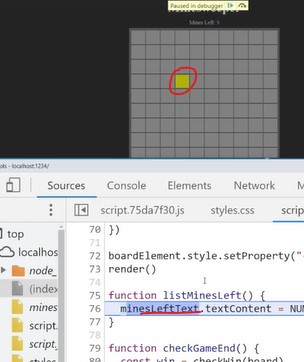

# Advanced Debugging 

- Advance debugging techniques & these debugging techniques will be for manually testing only 
- & these debugging techniques are used to fix the bug easily & quicker way 

- we'll be using minesweeper functional programming project & we'll be focus on the console tab

## Simple & advance Debugging Techniques

- `1st way` : the simplest & probably most common debugging technique that we're going to use i.e `console.log()` 💡💡💡
    - & it's a not best & not useful way to do debugging 
    - because it's difficult to know what all your console.log() are if we get too many console logs

- `2nd way` : using `debugger` keyword inside the code anywhere 
    - Eg : inside minesweeper functional programming project , inside minesweeper.js file 
        ```js
        export function createBoard(boardSize, minePositions) {
            debugger
            return times(x => {
                return times(y => {
                    return {
                        x, 
                        y,
                        mine: minePositions.some(positionMatch.bind(null, { x, y })) , 
                        status: TILE_STATUSES.HIDDEN,
                    }
                }, boardSize)
            }, boardSize)
        }
        ```
    - & now after saving file then the debugger starts inside the `sources` tab of inspect tool 
        - & code will stop at `debugger` keyword
        - & we can see all the important stuff inside `Scope` section & we can use those different debugging buttons  
        - & if we go inside console tab & write `y` then we'll get `0` 

    - using `debugger` is a advance technique & it gives so much control & we can step through my program line by line 
        - which is really useful when we want to try to figure out where is bug occurring 
        - & we can go to that line of code which contain bug or broke & figure what the issue is 
        - & if we use console.log() on each line then code become messy that's why use `debugger` keyword

- `3rd way ✅` : is if the code that's slow then we can figure out exactly why the code is running slow by using a really simple trick 
    - Eg : we want to see how long does creating that `board` variable take to create itself , so we can use console.time()
        - inside script.js file of minesweeper functional programming project
        ```js
        console.time("Create Board") // this is starter timer label message
        let board = createBoard(BOARD_SIZE, getMinePositions(BOARD_SIZE, NUMBER_OF_MINES))
        console.timeEnd("Create Board") // this is ending timer point of "Create Board" label message 
        ```
        - output : inside console tab , Create Board: 1.297119140625 ms
        - & as soon as we refresh the page we'll get new time
    - so if we face any performance issues related to the code then we can use this third technique 💡💡💡

- `4th way` : is to use console.table() to print data in table format like json data , object data or array data
    - Eg : inside script.js file of minesweeper functional programming project
        ```js
        let board = createBoard(BOARD_SIZE, getMinePositions(BOARD_SIZE, NUMBER_OF_MINES))
        console.table(board)
        ```
        - output : we can't see the data properly so run write this `console.table(board[0])`
    - so if we have array of objects or objects of array or json data then we can use this technique
        - which is easy to read data instead of using normal console.log() 

- `5th way` : console.trace() method to print out the stack trace of where we're at this exact moment inside that code 
    - Eg : inside script.js file of minesweeper functional programming project
        ```js
        export function createBoard(boardSize, minePositions) {
            console.trace()
            return times(x => {
                return times(y => {
                    return {
                        x, 
                        y,
                        mine: minePositions.some(positionMatch.bind(null, { x, y })) , 
                        status: TILE_STATUSES.HIDDEN,
                    }
                }, boardSize)
            }, boardSize)
        }
        ```
        - output : inside console tab , under console.trace
            - we'll get 
            ```
            createBoard                                 @minesweeper.js:11
            parcelRequire.script.js../minesweeper.js    @script.js:17
            newRequire                                  @script.75da7f30.js:47
            (anonymous)                                 @script.75da7f30.js:81
            (anonymous)                                 @script.75da7f30.js:120
            ``` 
        - & we can jump around these links which are in `@`
    - it useful when we don't want to do a full `debugger` 
        - then we can use console.trace() & see the stack trace immediately inside the console tab

- `6th way` : this feature is based on browser like chrome
    - `STEP 1` : go to `Elements` tab
    - `STEP 2` : let's say right click on <span data-mine-count>3</span>
    - `STEP 3` : click on `Break on` option & it contains 
        - `subtree modification` , `attribute modification` & `Node Removal` options
        - let's say click on `subtree modification` option
    - output : then now when we do something like mark a tile through right mouse click on the minesweeper board
        - then we can we come to that line of code where changing is happening like this  
        

    - so this useful when we want to see in which line code is happening when we clicked on something 

- `7th way` : inside Application tab of inspect
    - inside Storage section , we can see the things & we can modify those data also through CRUD operation
    - because sometimes we may have some caching problems

- `8th way` : inside network tab
    - this will tell any single time that we make a network request 
    - then it'll show us all the information for that network test
    - `STEP 1` : inside network tab, click on clear `(\)` button
        - & press `Ctrl + R` & then we can see all the network refresh that happens as how long each request took

    - this is really useful if we're making fetch requests to like a backend API     
        - so we can see what that API is returning & we can see the data like JSON API
        - we can see if there's any error & so on

    - & the page is taking a long time load then we can see are any of these things taking a long time inside `waterfall` column
    - & inside of network tab , we can do `throttling` net speed to test network connection
      - generally `throttling` is only useful if want to make sure things work on a slower network otherwise don't throttle 
    - otherwise we just gonna slow down our own experience 

## said by kyle ✅

- so `super important advance debugging techniques 🔥` which need to know 
    - `first` : debugger keyword
    - `second` : ability inside `Break on` options which is used to put break points when things change or when things are deleted
    - `third` : the `network` tab
    - `fourth` : the `application` tab 

- so these are most important that we're going to use most of the time

## discussion page

- Ques : Hi Kyle! I am getting this error in the browser console (Chrome) when opening the minesweeper project from lesson 35:  
    - index.html:1 Uncaught TypeError: Failed to resolve module specifier "lodash/fp". 
    - Relative references must start with either "/", "./", or "../".  
    - I tried to put the relative path for lodash importing in minesweeper.js but still getting the above error.

- Ans : It looks like you maybe didn't install lodash with npm. Try running npm i lodash.
