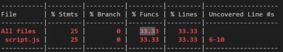
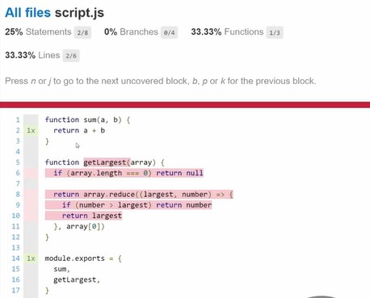
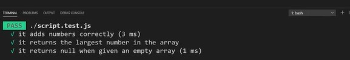
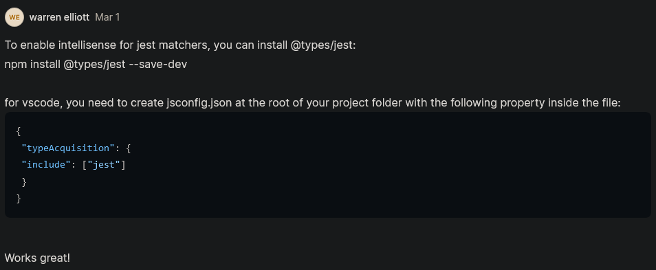

# Jest Basics

- now we're going to talk about automated testing & we'll see how to setup `jest` to do automated testing 

## About Jest

- `Jest` : 
    - it is used to do automated testing 
    - it is a testing library & a test runner  
    - `testing library & a test runner` means jest can run all of our automated tests for us 
        - & tell us which ones' pass & fail & we can use actual code for the test
    
- `Advantage of Jest`
    - `1` : some testing libraries only let us to write the code & some only let us to run the code 
        - to see if the test is pass or fail
        - but Jest library combines both of those together to do them at the same time
    - `2` : easy to setup & run especially if we're using node 
    - `3` : code coverage 
        - means it tell us what percentage of the lines of code we're actually testing 
        - this feature is really useful if we're testing all of our code 
        - & if we forget to test certain things then this will kindof show us what we're forgetting to test
        - & those testing done really well or not 
    - `4` : easy mocking 
        - mocking is just a way that we can fake certain things means we can take something that exists
            - such as the fetch API & we can fake it that way when we do our test
            - & we're not actually calling a real API but we're calling a fake API  

## Steps - Working with Jest

- `STEP 1` : initialize the package.json file , so run `npm init -y`
- `STEP 2` : then install jest as a dev dependency , so run `npm i --save-dev jest`
    - `reason why we're installing it as dev dependency` :
        - because we don't actually need our testing library for production 
        - we only need it for when we're developing our application 

- inside `Docs` menu of Jest , `using matchers` option means all that we need to know about jest
    - because it allows us to write all of our different tests

- `STEP 3` : now we just need to run jest
    - so inside package.json file , 
    ```js
    "scripts": {
        "test": "jest" // & this is going to run all of our tests 
    }
    ```
    - `STEP 3.1` : inside terminal , if we run this `npm test` then we'll get an error like this
    
    - that `testMatch:` means anything inside `__tests__` directory or anything ends in `.test` or `.spec`

    - `STEP 3.2` : create a folder i.e `__tests__`
        - & then create a file inside of this folder , let's say `script.js` file 
        - so now this `script.js` file will be test for our script.js 

    - `STEP 3.3` : now run the command i.e `npm test`
        - now we'll get an error because there is no test inside that script.js file (of __tests__ folder)

    - now we created a test file 

- another thing we can do that kyle generally prefer
- `STEP 4` : create a file (in the main folder) as `script.test.js` file
    - & now `script.test.js` file will be the test file

    - `STEP 4.1` : inside run the command i.e `npm test` & again we'll get an error 
        - that error means we found your test file , but you don't have any tests
        - & you should probably write a test

    - so let's write out our very first test

    - `STEP 4.2` : create a file (inside main folder) as `script.js` file 
        - & inside this script.js file , write this code 
            ```js
            function sum(a, b) {
                return a + b 
            } 

            function getLargest(array) {
                if (array.length === 0) return null

                return array.reduce((largest, number) => {
                    if (number > largest) return number
                    return largest
                }, array[0])
            }

            module.exports = {
                sum, 
                getLargest,
            }
            ```

    - `STEP 4.3` : inside script.test.js file , get the sum() function from script.js file 
        ```js
        const sum = require('./script.js') // we're using nodejs that's why we use require() function

        test("it adds numbers correctly", () => {

        })
        ```
        - `test()` is a built in function of Jest library
            - it takes two arguments 
            - `first argument` : is a message
            - `second argument` : is a callback function which contain our normal JS code 

        - inside `Docs` of Jest , inside `using matchers` , 
            - we can there is a `expect()` function 
            - expect() function also has methods like toBe() , toEqual() , etc.. methods}

        - `STEP 4.3.1` : inside script.test.js file , using expect() function & it's method
            ```js
            const sum = require('./script.js')

            test("it adds numbers correctly" , () => {
                const a = 1
                const b = 2
                expect(sum(a, b)).toBe(3)
            })
            ```
        
    - `STEP 4.5` : now run the test as `npm test` command , then we'll get a passing test
        - because `STEP 4.3.1` is correct
        - but we'll get an error i.e sum is not a function

    - `STEP 4.6` : inside script.test.js file , destructure the `sum` variable like this 
        - because we're exporting sum() function as a object from inside script.js file 
        ```js
        const { sum } = require('./script.js')

        test("it adds numbers correctly" , () => {
            const a = 1
            const b = 2
            expect(sum(a, b)).toBe(3)
        })
        ```
        - `STEP 4.6.1` : now run this command as `npm test` 
            - output : then we can see `1 passed` test with this message `it adds numbers correctly`

        - now let's our code was wrong like inside script.js , instead of adding two numbers & subtract them like this 
        - `STEP 4.6.2` : inside script.js file , we're deliberately subtracting two numbers instead of adding
            ```js
            function sum(a, b) {
                return a - b 
            } 

            function getLargest(array) {
                if (array.length === 0) return null

                return array.reduce((largest, number) => {
                    if (number > largest) return number
                    return largest
                }, array[0])
            }

            module.exports = {
                sum, 
                getLargest,
            }
            ```
            - now run the command `npm test` , now we'll get an error
            - & it'll show that we `Expected : 3` but we `received: -1`
            - & we can see the message like this "❌ it adds numbers correctly" which means failed

        - now change the code into this `return a + b`

- now to get the coverage of the report means how much of the testing & files that we're actually covering 
- `STEP 5` : inside package.json file 
    ```js
    "scripts": {
        "tests": "jest --coverage"
    }
    ```
    - now run the command i.e `npm start` means now it will actually generate a bunch of files for us 
        - that gives us a coverage report for our code in table form like this 
        
        - so in All files - we tested 25% of the code , 0% of the branches , 33% of the functions & 33% of the lines <br>
            & line from 6 to 10 were not covered inside of script.js 
        - & we can see the `coverage` folder inside our main folder , so inside Coverage folder , inside lcov-report folder <br>
            open the `index.html` file through live server

    - `STEP 5.1` : then click on script.js file link which is coming on the browser then we can see this 
        
        - & all the lines (which are in red color) were never tested , so means red highlighted lines we never tested any of this code <br> 
            & `1x` green text means we tested that line of code one time

    - so we don't have any test for getLargest() function
    - `STEP 5.2` : inside script.test.js file , let's write the test for getLargest() function
        ```js
        const { sum , getLargest } = require('./script.js')

        test("it adds numbers correctly" , () => {
            const a = 1
            const b = 2
            expect(sum(a, b)).toBe(3)
        })

        test("It returns the largest number in the array", () => {
            const array = [1, 2, 3, 4]
            expect(getLargest(array)).toBe(4)
        })
        ```

    - `STEP 5.3` : now run the command as `npm test` , output : so both of tests will be passed
        - but we can see inside the coverage table i.e inside `% branch` column , both of them are not 100% test coverage <br>
            so we have 75% branches covered 
        - & inside the browser , we can see testing almost done for everything but not for that condition i.e <br>
            `if(array.length === 0) return null` , so for this we need to write another test specifically for that condition

    - `STEP 5.4` : inside script.test.js file , let's write the test for that condition (which is inside getLargest() function)
        ```js
        const { sum , getLargest } = require('./script.js')

        test("it adds numbers correctly" , () => {
            const a = 1
            const b = 2
            expect(sum(a, b)).toBe(3)
        })

        test("It returns the largest number in the array", () => {
            const array = [1, 2, 3, 4]
            expect(getLargest(array)).toBe(4)
        })

        test("It returns null when given any empty array", () => {
            expect(getLargest([])).toBeNull()
            // or we can write expect(getLargest([])).toBe(null)
        })
        ```
        - we have toBeNull() method to check the null

        - output : run command `npm test` then we'll coverage in the form table
            - & inside that table coverage , we can see `3 passed` tests & 100% code coverage
            - & inside the browser we can see every single lines of code was tested 
    
    - `Note - said by kyle` : 
        - generally we don't need 100% test coverage for that small code example 
        - but sometimes we need 100% test coverage on those confusing & difficult parts of our code 

- one thing we can do to cleanup our test a little bit & 
    - we can see that through just printing these messages for each test like this 
    
    - we can't identify what function are we testing ?
    - & hard to tell if we have many functions 
    - so Jest has `describe()` function block comes 

- `describe()` - this function block takes two arguments
    - `first argument` : is message inside string with `#` sign before that function same to tell it's a function
    - `second argument` : is a callback function which takes test function (which we want to test)

- `STEP 6` : inside script.test.js file , using describe() function block for each test
    ```js
    const { sum , getLargest } = require('./script.js')
   
    describe("#sum", () => {
        test("it adds numbers correctly" , () => {
            const a = 1
            const b = 2
            expect(sum(a, b)).toBe(3)
        })
    })

    describe("#getLargest", () => {
        test("It returns the largest number in the array", () => {
            const array = [1, 2, 3, 4]
            expect(getLargest(array)).toBe(4)
        })

        test("It returns null when given any empty array", () => {
            expect(getLargest([])).toBeNull()
        })
    })
    ```
    - here `#sum` means `#` sign we used for convention to tell that it's a function but we can pass `sum` directly doesn't matter 💡💡💡 

    - if the vscode added this line of code i.e `const { describe } = require("yargs")` inside script.test.js file then remove it 

    - output : now save the file & run the command `npm test` & we'll get this message for each test like this 
        ```
        #sum
            ✔️ it adds numbers correctly 
        #getLargest
            ✔️ it returns the largest number in the array
            ✔️ it returns null when given an empty array
        ```
        - now this output is easier to read to understand what's going on here

    - but if have error like inside script.js file , we changed as `if (array.length === 0) return 2` inside getLargest() function 
        - output : run this command `npm test` , then we'll get this 
            ```
            #sum
                ✔️ it adds numbers correctly 
            #getLargest
                ✔️ it returns the largest number in the array
                ❌ it returns null when given an empty array
            ``` 
            - so this is super easy to fix 

    - now change it from this `if (array.length === 0) return null` inside getLargest() function inside script.js file 

- now we can do nesting of describe() function block like this 
- `STEP 7` : inside script.test.js file , defining nesting describe() function block
    ```js
    const { sum , getLargest } = require('./script.js')
   
    describe("#sum", () => {
        test("it adds numbers correctly" , () => {
            const a = 1
            const b = 2
            expect(sum(a, b)).toBe(3)
        })
    })

    describe("#getLargest", () => {
        test("It returns the largest number in the array", () => {
            const array = [1, 2, 3, 4]
            expect(getLargest(array)).toBe(4)
        })

        describe("with an empty array" , () => { 
            test("It returns null", () => {
                expect(getLargest([])).toBeNull()
            })
        })
    })
    ```
    - & save the file & remove the this line code `const { describe } = require("yargs")` if it's added <br>
        otherwise error will come if we run the command `npm test`

    - `best practices` : here nested describe() function block we didn't use `#` sign because it's just a message <br>
        if it's function name then worth to define `#` sign before the function inside the string quote 💡💡💡

    - output : now run the command `npm test` & we'll get the message of each test like this 
        ```
        #sum
            ✔️ it adds numbers correctly 
        #getLargest
            ✔️ it returns the largest number in the array
            with an empty array
                ✔️ it returns null 
        ```
        - & if we want to do another check then we can nest another describe() function block 

- Eg : we can create a global variable inside describe() function block like this 
    - inside script.test.js file 
        ```js
        const { sum , getLargest } = require('./script.js')
       
        describe("#sum", () => {
            test("it adds numbers correctly" , () => {
                const a = 1
                const b = 2
                expect(sum(a, b)).toBe(3)
            })
        })

        describe("#getLargest", () => {
            const global = "Hi"

            test("It returns the largest number in the array", () => {
                const array = [1, 2, 3, 4]
                expect(getLargest(array)).toBe(4)
            })

            describe("with an empty array" , () => { 
                test("It returns null", () => {
                    expect(getLargest([])).toBeNull()
                })
            })
        })
        ```
    - so this `global` variable we can use inside any test() function or anywhere we want inside the describe() function block

    - `said by kyle` 

        - generally we don't use `global` variable because better to make each test() function unique <br>
            that way if one test fail , we can make the change really easily inside that test() instead of modifying other tests 

        - & generally with test code , we want them to be as independent from each other as possible <br>
            instead of replying on code from each other which makes more difficult to test our code

## difference b/w toBe() & toEqual() methods of expect() function 

- there is a difference of pass by value & pass by reference 

- Eg : of difference b/w toBe() & toEqual() methods
    - inside script.test.js file , checking for toBe() method
        ```js
        test("toEqual vs toBe", () => {
            const obj = { a: 1, b: 2 }

            expect(obj).toBe({ a:1, b: 2 })
        })
        ```
        - output : run `npm test` then we'll get an error 
            - because `toBe()` method is checking references & not a value 
            - means technically this object i.e `obj = { a: 1, b: 2 }` is reference other location 
            - & the object which we passed is in a different location 
            - so both can't have same value 

        - so instead of using toBe() , use toEqual() method

    - inside script.test.js file , checking for toEqual() method
        ```js
        test("toEqual vs toBe", () => {
            const obj = { a: 1, b: 2 }

            expect(obj).toEqual({ a:1, b: 2 })
        })
        ```
        - `toEqual()` : this method will check reference & value
            - means it'll check do we have exact same properties & exact same values 💡💡💡

        - output : run `npm test` then we'll get `✔️ toEqual vs toBe` 

    - so if we have an object or array & we don't want to worry about it being the exact same object
        - means if we have same properties & same values of object or same values of array then use toEqual() method
        - but is that exact same object or array then use toBe() method 
            - Eg : if we pass obj like this 
                ```js
                test("toEqual vs toBe", () => {
                    const obj = { a: 1, b: 2 }

                    expect(obj).toBe(obj) // we'll get an correct output 
                })
                ```
            - so `expect(obj).toBe(obj)` means object inside expect() function is same as object is passed inside toBe() method

## Difference b/w Jest & Vitest for unit testing 

- [Why Vitest Is Better Than Jest](https://www.youtube.com/watch?v=7f-71kYhK00&ab_channel=WebDevSimplified)

## discussion page


