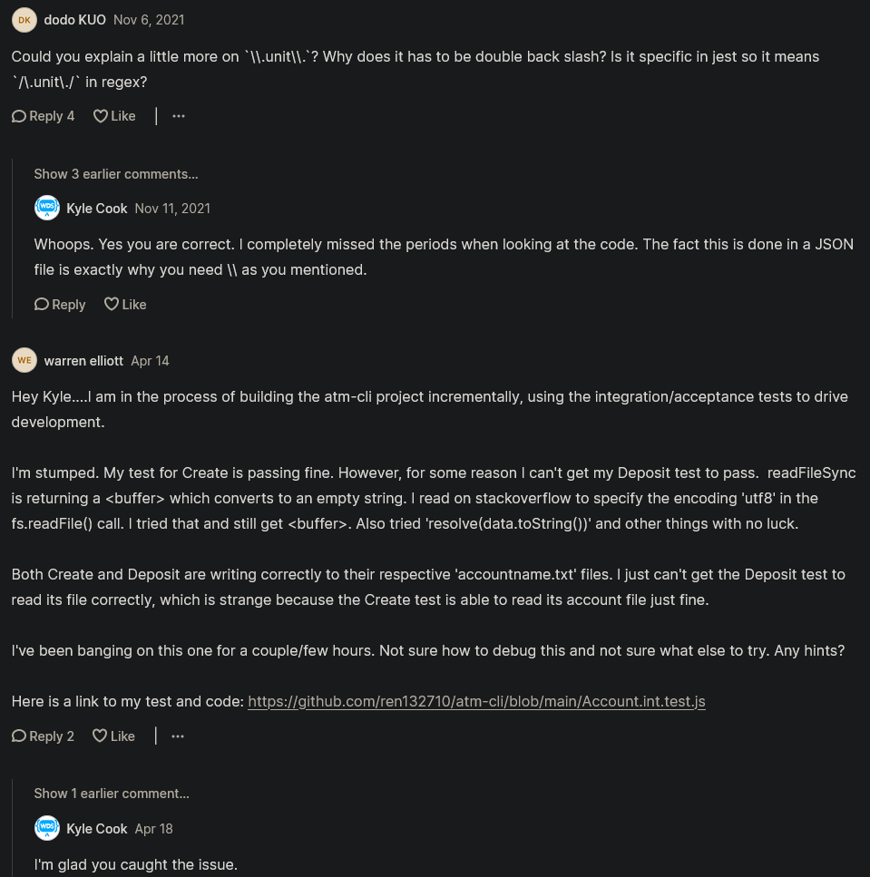

# Integration test project

- we'll do integration testing inside ATM project

## complete code with integration testing 

<details>
    <summary>.gitignore</summary>

```
accounts
node_modules
coverage
```
</details>

<details>
    <summary>Account.int.test.js</summary>

```js
const Account = require("./Account")
const fs = require("fs")

beforeEach(() => {
  try {
    fs.mkdirSync("accounts")
  } catch {
    // Ignore error since folder already exists
  }
})

afterEach(() => {
  fs.rmSync("accounts", { recursive: true, force: true })
})

describe(".create", () => {
  test("it creates a new account and file", async () => {
    const name = "Kyle"
    const account = await Account.create(name)
    expect(account.name).toBe(name)
    expect(account.balance).toBe(0)
    expect(fs.readFileSync(account.filePath).toString()).toBe("0")
  })
})

describe(".find", () => {
  test("it returns the account", async () => {
    const name = "Kyle"
    const balance = 10
    fs.writeFileSync(`accounts/${name}.txt`, balance.toString())
    const account = await Account.find(name)
    expect(account.name).toBe(name)
    expect(account.balance).toBe(balance)
  })

  describe("when there is no existing account", () => {
    test("it returns undefined", async () => {
      const name = "Kyle"
      const account = await Account.find(name)
      expect(account).toBeUndefined()
    })
  })
})
```
</details>

<details>
    <summary>Account.js</summary>

```js
const FileSystem = require("./FileSystem")

module.exports = class Account {
  constructor(name) {
    this.#name = name
  }

  #name
  #balance

  get name() {
    return this.#name
  }

  get balance() {
    return this.#balance
  }

  get filePath() {
    return `accounts/${this.name}.txt`
  }

  async #load() {
    this.#balance = parseFloat(await FileSystem.read(this.filePath))
  }

  async withdraw(amount) {
    if (this.balance < amount) throw new Error()
    await FileSystem.write(this.filePath, this.#balance - amount)
    this.#balance = this.#balance - amount
  }

  async deposit(amount) {
    await FileSystem.write(this.filePath, this.#balance + amount)
    this.#balance = this.#balance + amount
  }

  static async find(accountName) {
    const account = new Account(accountName)

    try {
      await account.#load()
      return account
    } catch (e) {
      return
    }
  }

  static async create(accountName) {
    const account = new Account(accountName)

    await FileSystem.write(account.filePath, 0)
    account.#balance = 0

    return account
  }
}
```
</details>

<details>
    <summary>Account.unit.test.js</summary>

```js
const FileSystem = require("./FileSystem")
const Account = require("./Account")

beforeEach(() => {
  jest.restoreAllMocks()
})

describe("#deposit", () => {
  test("it adds money to the account", async () => {
    const startingBalance = 5
    const amount = 10
    const account = await createAccount("Kyle", startingBalance)
    const spy = jest
      .spyOn(FileSystem, "write")
      .mockReturnValue(Promise.resolve())

    await account.deposit(amount)
    expect(account.balance).toBe(amount + startingBalance)
    expect(spy).toBeCalledWith(account.filePath, amount + startingBalance)
  })
})

describe("#withdraw", () => {
  test("it removes money from the account", async () => {
    const startingBalance = 10
    const amount = 5
    const account = await createAccount("Kyle", startingBalance)
    const spy = jest
      .spyOn(FileSystem, "write")
      .mockReturnValue(Promise.resolve())

    await account.withdraw(amount)
    expect(account.balance).toBe(startingBalance - amount)
    expect(spy).toBeCalledWith(account.filePath, startingBalance - amount)
  })

  describe("with not enough money in the account", () => {
    test("it should throw an error", async () => {
      const startingBalance = 5
      const amount = 10
      const account = await createAccount("Kyle", startingBalance)
      const spy = jest.spyOn(FileSystem, "write")

      await expect(account.withdraw(amount)).rejects.toThrow()
      expect(account.balance).toBe(startingBalance)
      expect(spy).not.toBeCalled()
    })
  })
})

async function createAccount(name, balance) {
  const spy = jest
    .spyOn(FileSystem, "read")
    .mockReturnValueOnce(Promise.resolve(balance))
  const account = await Account.find(name)
  spy.mockRestore()
  return account
}
```
</details>

<details>
    <summary>CommandLine.js</summary>

```js
const readline = require("readline")

module.exports = class CommandLine {
  static ask(question) {
    const rl = readline.createInterface({
      input: process.stdin,
      output: process.stdout,
    })

    return new Promise(resolve => {
      rl.question(`${question} `, answer => {
        resolve(answer)
        rl.close()
      })
    })
  }

  static print(text) {
    console.log(text)
  }
}
```
</details>

<details>
    <summary>FileSystem.js</summary>

```js
const fs = require("fs")

module.exports = class FileSystem {
  static read(path) {
    return new Promise((resolve, reject) => {
      fs.readFile(path, (err, data) => {
        if (err) return reject(err)
        resolve(data)
      })
    })
  }

  static write(path, content) {
    return new Promise((resolve, reject) => {
      fs.writeFile(path, content.toString(), err => {
        if (err) return reject(err)
        resolve()
      })
    })
  }
}
```
</details>

<details>
    <summary>package-lock.json</summary>

```
upload this file also
```
</details>

<details>
    <summary>package.json</summary>

```json
{
  "name": "current-project",
  "version": "1.0.0",
  "description": "",
  "main": "Account.js",
  "scripts": {
    "test": "jest --coverage",
    "test:unit": "jest \\.unit\\. --coverage",
    "test:int": "jest \\.int\\. --coverage"
  },
  "keywords": [],
  "author": "",
  "license": "ISC",
  "devDependencies": {
    "jest": "^26.6.3"
  }
}
```
</details>

<details>
    <summary>script.js</summary>

```js
const Account = require("./Account")
const CommandLine = require("./CommandLine")

async function main() {
  try {
    const accountName = await CommandLine.ask(
      "Which account would you like to access?"
    )
    const account = await Account.find(accountName)
    if (account == null) account = await promptCreateAccount(accountName)
    if (account != null) await promptTask(account)
  } catch (e) {
    CommandLine.print("ERROR: Please try again")
  }
}

async function promptCreateAccount(accountName) {
  const response = await CommandLine.ask(
    "That account does not exist. Would you like to create it? (yes/no)"
  )

  if (response === "yes") {
    return await Account.create(accountName)
  }
}

async function promptTask(account) {
  const response = await CommandLine.ask(
    "What would you like to do? (view/deposit/withdraw)"
  )

  if (response === "deposit") {
    const amount = parseFloat(await CommandLine.ask("How much?"))
    await account.deposit(amount)
  } else if (response === "withdraw") {
    const amount = parseFloat(await CommandLine.ask("How much?"))
    try {
      await account.withdraw(amount)
    } catch (e) {
      CommandLine.print(
        "We were unable to make the withdrawal. Please ensure you have enough money in your account."
      )
    }
  }

  CommandLine.print(`Your balance is ${account.balance}`)
}

main()
```
</details>

## Explanation of ATM project with integration testing  

- now separate the unit & integration test 
  - because usually integration tests are much slower to run & they require interacting with stuff like databases , <br>
    file systems , the network & so on
- `STEP 1` : separating the unit test from integration test like this 
    - `STEP 1.1` : so just rename that Account.test.js file as `Account.unit.test.js` <br>
      then create a new file for integration testing as `Account.int.test.js`
    - now we separated these different testing files 
    - now inside package.json file , 
      ```js
      "scripts": {
        "test": "jest --coverage"
      }
      ```
      - when we run `npm test` then `"jest --coverage"` this will run all the testing files which we don't want 
    - `STEP 1.2` : inside package.json file , let's create a script for each test
      ```js
      "scripts": {
        "test": "jest --coverage",
        "test:unit": "jest \\.unit\\. --coverage"
        "test:int": "jest \\.int\\. --coverage"
      }
      ```
    - `"jest \\.unit\\. --coverage"` means here we passed a single property to that jest CLI 
      - & here `\\.unit\\.` is a regex that we can use to check different file path names 
      - means anything that's `.unit.` is going be for unit testing
      - & here `.` dot is a reserved character in regex so we use `\\` double backslash for escaping 

    - output : run command `npm run test:unit` & those file will be run which has `.unit.` inside file name & we'll get the passed
      - but if we run npm run `test:int` then we'll get an error because inside `Account.int.test.js` file is empty
      - & if we run `npm test` then both files will run i.e `Account.unit.test.js` & `Account.int.test.js`

- now let's write the integration testing for ATM project
  - & we'll be testing that `static async find()` & `static async create()` functions of Account.js file 
- `STEP 2` : inside Account.int.test.js file
    ```js
    const Account = require("./Account")

    describe(".create", () => {
      
    })

    describe(".find", () => {

    })
    ```
  - `Note ✅` : here we used `.` dot sign before the function because when we're dealing with static methods or functions 
    - then we use `.` dot sign before that function or method name during testing 💡💡💡

  - `STEP 2.1` : inside Account.int.test.js file , let's write the pseudo code for testing
      ```js
      const Account = require("./Account")

      describe(".create", () => {
        test("It creates a new account and file", async () => { // we used async because those functions are async function
          // 1. create an account
          // 2. Check the name is correct
          // 3. Check the balance
          // 4. Check to ensure a file was created 
        })
      })

      describe(".find", () => {

      })
      ```
  - `// 4. Check to ensure a file was created` - this 4th pseudo code is important means 
    - the difference b/w unit tests & integration tests 
    - because in our unit test we're just create a mock/fake for our file <br>
      so we think the implementation , so it never actually creates a file
    - but in integration tests , we just want to make sure that actually happens <br>
      so we're not doing any mocking of our file system , we're just letting it to create the file as is <br>
      so none of that stuff is going to be mocked out & then we just wanna check to make sure that file was actually there <br>
    - means we're not mocking any thing when we're doing integration test but in unit test we mock this 4th pseudo code 💡💡💡 <br>
      - so for this we'll use `fs` 

  - `STEP 2.2` : inside Account.int.test.js file , creating `fs`
      ```js
      const Account = require("./Account")
      const fs = require("fs")

      describe(".create", () => {
        test("It creates a new account and file", async () => { 
          // 1. create an account
          // 2. Check the name is correct
          // 3. Check the balance
          // 4. Check to ensure a file was created 
        })
      })

      describe(".find", () => {

      })
      ```
    - here we created the `fs` to actually interact with the file system

  - `STEP 2.3` : inside Account.int.test.js file , now let's write out the test
      ```js
      const Account = require("./Account")
      const fs = require("fs")

      describe(".create", () => {
        test("It creates a new account and file", async () => { 
          // 1. create an account
          const name = "Teen"
          const account = await Account.create(name)
          // 2. Check the name is correct
          expect(account.name).toBe(name)
          // 3. Check the balance
          expect(account.balance).toBe(0) // our balance will be 0 because we created a new account
          // 4. Check to ensure a file was created 
          expect(fs.readFileSync(account.filePath).toString()).toBe("0") // & that new account with balance will be 0 
        })
      })

      describe(".find", () => {

      })
      ```
    - `expect(fs.readFileSync(account.filePath).toString()).toBe("0")` here we're not doing async way 
      - we're doing synchronously because it's not required to check account whether is created or not in async way

    - output : run `npm run test:int` then we'll get an error i.e no account folder is found 

    - `STEP 2.3.1` : inside main project folder , create a folder as `accounts` 

    - output : now run `npm run test:int` then that account will be created i.e `Teen.txt` with balance 0 inside accounts folder

- one thing we want that if we don't have `accounts` folder then we need to create it automatically 
  - & we want to create that `Teen.txt` account file during testing but the movement test is over <br> 
    then we want to delete this `Teen.txt` account
- `STEP 3` : inside Account.int.test.js file , let's create helper function for these two tasks
    ```js
    const Account = require("./Account")
    const fs = require("fs")

    beforeEach(() => {

    })
    
    afterEach(() => {

    })

    describe(".create", () => {
      test("It creates a new account and file", async () => { 
        // 1. create an account
        const name = "Teen"
        const account = await Account.create(name)
        // 2. Check the name is correct
        expect(account.name).toBe(name)
        // 3. Check the balance
        expect(account.balance).toBe(0) // our balance will be 0 because we created a new account
        // 4. Check to ensure a file was created 
        expect(fs.readFileSync(account.filePath).toString()).toBe("0") // & that new account with balance will be 0 
      })
    })

    describe(".find", () => { })
    ```
  - `beforeEach(() => { })` is for to happen before everything & it's for creating that `accounts` folder <br>
      & `afterEach(() => { })` is for to remove all the account files we created in our test

  - `STEP 3.1` : inside Account.int.test.js file , working on beforeEach() & afterEach() functions
      ```js
      const Account = require("./Account")
      const fs = require("fs")

      beforeEach(() => {
        try {
            fs.mkdirSync("accounts")
          } catch {
            // Ignore error since folder already exists
          }
      })
      
      afterEach(() => {
        fs.rmSync("accounts", { recursive: true, force: true })
      })

      describe(".create", () => {
        test("It creates a new account and file", async () => { 
          const name = "Teen"
          const account = await Account.create(name)
          expect(account.name).toBe(name)
          expect(account.balance).toBe(0) 
          expect(fs.readFileSync(account.filePath).toString()).toBe("0") 
        })
      })

      describe(".find", () => { })
      ```
    - `fs.rmSync("accounts", { recursive: true, force: true })` means 
      - `fs.rmSync()` means to create the `accounts` folder
      - `recursive: true` means delete all the files & folders from inside `accounts` folder
      - `force: true` : means to force to delete things even if that `accounts` folder doesn't exist <br>
        but it won't throw any error 

    - `beforeEach(() => { try { fs.mkdirSync("accounts") } catch { } })` means 
      - inside beforeEach() function we used try catch block <br>
        because if we use `fs.mkdirSync("accounts")` to create `accounts` folder <br>
        & if this folder already exists then we'll get an error , that's why we use try catch block 
      - `fs.mkdirSync("accounts")` used to create a `accounts` folder
      - & we don't want to show the error if the `accounts` folder already exists 💡💡💡

    - so remove that `accounts` folder & start fresh 

    - output : run `npm run test:int` command then we'll if the `accounts` folder exist then it'll be removed 
      - but it doesn't exists then it will be created

- let's work on find() static function
- `STEP 4` : inside Account.int.test.js file , working on find() function
    ```js
    const Account = require("./Account")
    const fs = require("fs")

    beforeEach(() => {
      try {
          fs.mkdirSync("accounts")
        } catch {
          // Ignore error since folder already exists
        }
    })
    
    afterEach(() => {
      fs.rmSync("accounts", { recursive: true, force: true })
    })

    describe(".create", () => {
      test("It creates a new account and file", async () => { 
        const name = "Teen"
        const account = await Account.create(name)
        expect(account.name).toBe(name)
        expect(account.balance).toBe(0) 
        expect(fs.readFileSync(account.filePath).toString()).toBe("0") 
      })
    })

    describe(".find", () => { 
      test("it returns the account", async () => {
        const name = "Teen"
        const balance = 10 // so we created the account with this balance
        fs.writeFileSync(`accounts/${name}.txt`, balance.toString())
        const account = await Account.find(name)
        expect(account.name).toBe(name)
        expect(account.balance).toBe(balance)
      })
    })
    ```
  - fs.writeFileSync(`accounts/${name}.txt`, balance.toString()) means
    - we need to create file system because inside Account.js file , #load() function is getting the file system that's why
    - so that account will be created inside `accounts` folder with that balance 
    - & we created it as synchronous way because we don't need to worry about async natures (which is annoying to deal with)
  - `const account = await Account.find(name)` means we're finding account
    - & then `expect(account.name).toBe(name)` & `expect(account.balance).toBe(balance)` means <br>
      checking these information is correct

  - output : run `npm run test:int` & both of the tests will be passed i.e `.create` & `.find`

- we're doing these stuff because in integration tests we need to test everything & we can't mock things out 
  - but in unit test we can mock things because like dealing with file system will be easier because we can mock it 💡💡💡

- now let's test what if we don't have an account
- `STEP 5` : inside Account.int.test.js file , working on find() function if we don't have that account
    ```js
    const Account = require("./Account")
    const fs = require("fs")

    beforeEach(() => {
      try {
        fs.mkdirSync("accounts")
      } catch {
        // Ignore error since folder already exists
      }
    })

    afterEach(() => {
      fs.rmSync("accounts", { recursive: true, force: true })
    })

    describe(".create", () => {
      test("it creates a new account and file", async () => {
        const name = "Kyle"
        const account = await Account.create(name)
        expect(account.name).toBe(name)
        expect(account.balance).toBe(0)
        expect(fs.readFileSync(account.filePath).toString()).toBe("0")
      })
    })

    describe(".find", () => {
      test("it returns the account", async () => {
        const name = "Kyle"
        const balance = 10
        fs.writeFileSync(`accounts/${name}.txt`, balance.toString())
        const account = await Account.find(name)
        expect(account.name).toBe(name)
        expect(account.balance).toBe(balance)
      })

      describe("when there is no existing account", () => {
        test("it returns undefined", async () => {
          const name = "Kyle"
          const account = await Account.find(name)
          expect(account).toBeUndefined()
        })
      })
    })
    ```
  - we can't make callback function (of describe() function) as async otherwise we'll get an error  
  - `Note` : always write the testing code inside test() function instead inside of describe() function <br>
      otherwise that test won't work 

## discussion page


