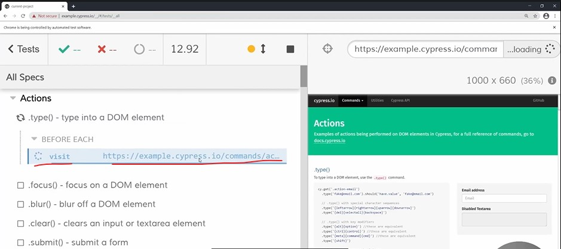
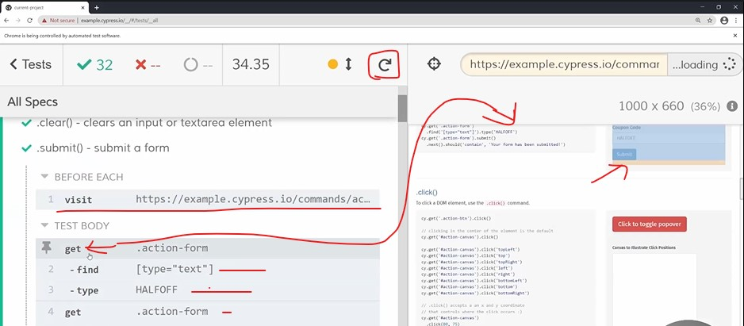
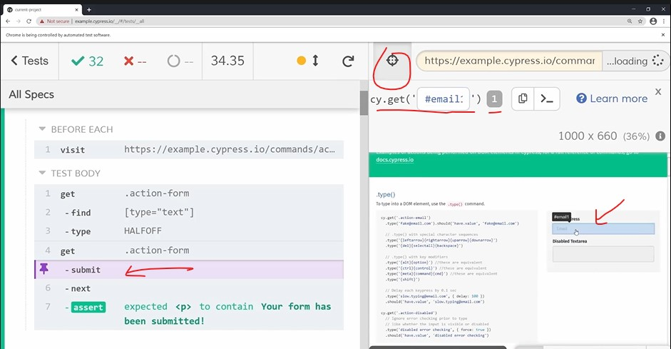
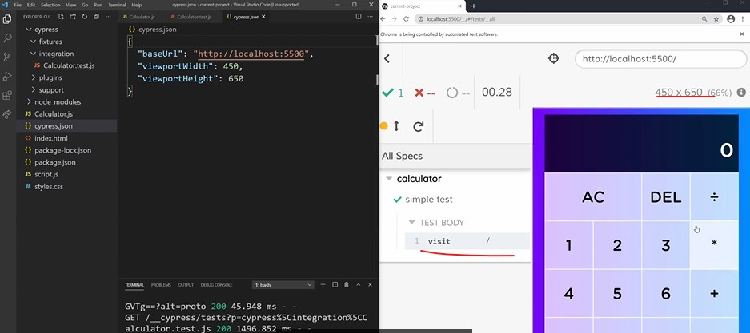
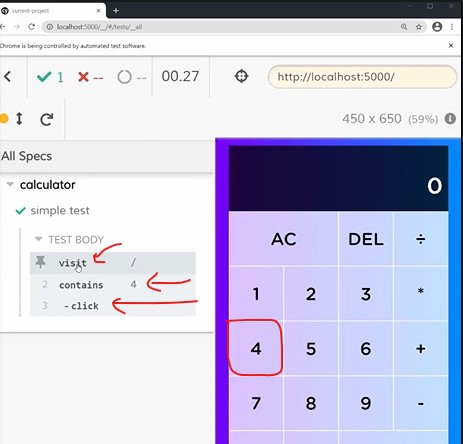
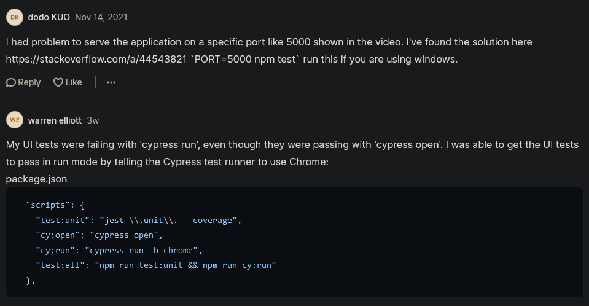

# End To End Projects

- here we'll be using a library called `Cypress` for End to End testing

- End to End testing will be different than both (unit & integration testing)
    - & we can't use the Jest library because we're going to use `Cypress` library 
    - when `Cypress` library came out then things changes because usually considered super , super slow <br>
        & really painful to write & really brittle (means hard but easily broken) 
    - now due to Cypress , End to End testing becomes easier means to write tests for EtoE & fairly quickly ✔️✔️✔️

## complete Calculator Project with integration testing 

<details>
    <summary>cypress folder</summary>

- `integration` folder
    - `Calculator.test.js` file
        ```js
        describe("calculator", () => {
          beforeEach(() => {
            cy.visit("/")
          })

          it("correctly handles normal calculations", () => {
            cy.getCalculatorButton("4").click()
            cy.getCalculatorButton(".").click()
            cy.getCalculatorButton("1").click()
            cy.get(".primary-operand").should("have.text", "4.1")
            cy.getCalculatorButton("+").click()
            cy.get(".primary-operand").should("have.text", "0")
            cy.get(".secondary-operand").should("have.text", "4.1")
            cy.get(".history > [data-operation]").should("have.text", "+")
            cy.getCalculatorButton("6").click()
            cy.get(".primary-operand").should("have.text", "6")
            cy.getCalculatorButton("=").click()
            cy.get(".primary-operand").should("have.text", "10.1")
            cy.get(".secondary-operand").should("have.text", "")
            cy.get(".history > [data-operation]").should("have.text", "")
          })

          it("correctly handles all clear", () => {
            cy.getCalculatorButton("4").click()
            cy.getCalculatorButton("+").click()
            cy.getCalculatorButton("6").click()
            cy.getCalculatorButton("AC").click()
            cy.get(".primary-operand").should("have.text", "0")
            cy.get(".secondary-operand").should("have.text", "")
            cy.get(".history > [data-operation]").should("have.text", "")
          })

          it("correctly handles delete", () => {
            cy.getCalculatorButton("4").click()
            cy.getCalculatorButton("4").click()
            cy.getCalculatorButton("4").click()
            cy.getCalculatorButton("DEL").click()
            cy.get(".primary-operand").should("have.text", "44")
          })
        })
        ```

- `plugins` folder
    - `index.js` file
        ```js
        /// <reference types="cypress" />
        // ***********************************************************
        // This example plugins/index.js can be used to load plugins
        //
        // You can change the location of this file or turn off loading
        // the plugins file with the 'pluginsFile' configuration option.
        //
        // You can read more here:
        // https://on.cypress.io/plugins-guide
        // ***********************************************************

        // This function is called when a project is opened or re-opened (e.g. due to
        // the project's config changing)

        /**
         * @type {Cypress.PluginConfig}
         */
        module.exports = (on, config) => {
          // `on` is used to hook into various events Cypress emits
          // `config` is the resolved Cypress config
        }
        ```

- `support` folder
    - `commands.js` file
        ```js
        // ***********************************************
        // This example commands.js shows you how to
        // create various custom commands and overwrite
        // existing commands.
        //
        // For more comprehensive examples of custom
        // commands please read more here:
        // https://on.cypress.io/custom-commands
        // ***********************************************
        //
        //
        // -- This is a parent command --
        // Cypress.Commands.add("login", (email, password) => { ... })
        //
        //
        // -- This is a child command --
        // Cypress.Commands.add("drag", { prevSubject: 'element'}, (subject, options) => { ... })
        //
        //
        // -- This is a dual command --
        // Cypress.Commands.add("dismiss", { prevSubject: 'optional'}, (subject, options) => { ... })
        //
        //
        // -- This will overwrite an existing command --
        // Cypress.Commands.overwrite("visit", (originalFn, url, options) => { ... })

        Cypress.Commands.add("getCalculatorButton", text => {
          cy.contains(".calculator-grid > button", text)
        })
        ```
    - `index.js` file 
        ```js
        // ***********************************************************
        // This example support/index.js is processed and
        // loaded automatically before your test files.
        //
        // This is a great place to put global configuration and
        // behavior that modifies Cypress.
        //
        // You can change the location of this file or turn off
        // automatically serving support files with the
        // 'supportFile' configuration option.
        //
        // You can read more here:
        // https://on.cypress.io/configuration
        // ***********************************************************

        // Import commands.js using ES2015 syntax:
        import './commands'

        // Alternatively you can use CommonJS syntax:
        // require('./commands'
        ```
</details>

<details>
    <summary>.gitignore</summary>

```
node_modules
```
</details>

<details>
    <summary>Calculator.js</summary>

```js
export default class Calculator {
  constructor(
    primaryOperandDisplay,
    secondaryOperandDisplay,
    operationDisplay
  ) {
    this.#primaryOperandDisplay = primaryOperandDisplay
    this.#secondaryOperandDisplay = secondaryOperandDisplay
    this.#operationDisplay = operationDisplay

    this.clear()
  }

  #primaryOperandDisplay
  #secondaryOperandDisplay
  #operationDisplay

  get primaryOperand() {
    return parseFloat(this.#primaryOperandDisplay.dataset.value)
  }

  set primaryOperand(value) {
    this.#primaryOperandDisplay.dataset.value = value ?? ""
    this.#primaryOperandDisplay.textContent = displayNumber(value)
  }

  get secondaryOperand() {
    return parseFloat(this.#secondaryOperandDisplay.dataset.value)
  }

  set secondaryOperand(value) {
    this.#secondaryOperandDisplay.dataset.value = value ?? ""
    this.#secondaryOperandDisplay.textContent = displayNumber(value)
  }

  get operation() {
    return this.#operationDisplay.textContent
  }

  set operation(value) {
    this.#operationDisplay.textContent = value ?? ""
  }

  addDigit(digit) {
    if (
      digit === "." &&
      this.#primaryOperandDisplay.dataset.value.includes(".")
    ) {
      return
    }
    if (this.primaryOperand === 0) {
      this.primaryOperand = digit
      return
    }
    this.primaryOperand = this.#primaryOperandDisplay.dataset.value + digit
  }

  removeDigit() {
    const numberString = this.#primaryOperandDisplay.dataset.value
    if (numberString.length <= 1) {
      this.primaryOperand = 0
      return
    }

    this.primaryOperand = numberString.substring(0, numberString.length - 1)
  }

  evaluate() {
    let result
    switch (this.operation) {
      case "*":
        result = this.secondaryOperand * this.primaryOperand
        break
      case "÷":
        result = this.secondaryOperand / this.primaryOperand
        break
      case "+":
        result = this.secondaryOperand + this.primaryOperand
        break
      case "-":
        result = this.secondaryOperand - this.primaryOperand
        break
      default:
        return
    }

    this.clear()
    this.primaryOperand = result

    return result
  }

  chooseOperation(operation) {
    if (this.operation !== "") return
    this.operation = operation
    this.secondaryOperand = this.primaryOperand
    this.primaryOperand = 0
  }

  clear() {
    this.primaryOperand = 0
    this.secondaryOperand = null
    this.operation = null
  }
}

const NUMBER_FORMATTER = new Intl.NumberFormat("en")

function displayNumber(number) {
  const stringNumber = number?.toString() || ""
  if (stringNumber === "") return ""
  const [integer, decimal] = stringNumber.split(".")
  const formattedInteger = NUMBER_FORMATTER.format(integer)
  if (decimal == null) return formattedInteger
  return formattedInteger + "." + decimal
}
```
</details>

<details>
    <summary>cypress.json</summary>

```json
{
  "baseUrl": "http://localhost:5000",
  "viewportWidth": 450,
  "viewportHeight": 650
}
```
</details>

<details>
    <summary>index.html</summary>

```html
<!DOCTYPE html>
<html lang="en">
<head>
  <meta charset="UTF-8">
  <meta name="viewport" content="width=device-width, initial-scale=1.0">
  <meta http-equiv="X-UA-Compatible" content="ie=edge">
  <link href="styles.css" rel="stylesheet">
  <script src="script.js" type="module"></script>
  <title>Calculator</title>
</head>
<body>
  <div class="calculator-grid">
    <div class="output">
      <div class="history">
        <div data-secondary-operand class="secondary-operand"></div>
        <div data-operation></div>
      </div>
      <div data-primary-operand class="primary-operand"></div>
    </div>
    <button data-all-clear class="span-two">AC</button>
    <button data-delete>DEL</button>
    <button data-operation>÷</button>
    <button data-number>1</button>
    <button data-number>2</button>
    <button data-number>3</button>
    <button data-operation>*</button>
    <button data-number>4</button>
    <button data-number>5</button>
    <button data-number>6</button>
    <button data-operation>+</button>
    <button data-number>7</button>
    <button data-number>8</button>
    <button data-number>9</button>
    <button data-operation>-</button>
    <button data-number>.</button>
    <button data-number>0</button>
    <button data-equals class="span-two">=</button>
  </div>
</body>
</html>
```
</details>

<details>
    <summary>package-lock.json</summary>

```
update this file also on github
```
</details>

<details>
    <summary>package.json</summary>

```json
{
  "name": "current-project",
  "version": "1.0.0",
  "description": "",
  "main": "Calculator.js",
  "scripts": {
    "start": "serve",
    "cy:open": "cypress open",
    "test": "start-server-and-test start http://localhost:5000 cy:open"
  },
  "keywords": [],
  "author": "",
  "license": "ISC",
  "devDependencies": {
    "cypress": "^6.6.0",
    "serve": "^11.3.2",
    "start-server-and-test": "^1.12.0"
  }
}
```
</details>

<details>
    <summary>script.js</summary>

```js
import Calculator from "./Calculator.js"

const primaryOperandDisplay = document.querySelector("[data-primary-operand]")
const secondaryOperandDisplay = document.querySelector(
  "[data-secondary-operand]"
)
const operationDisplay = document.querySelector("[data-operation]")

const calculator = new Calculator(
  primaryOperandDisplay,
  secondaryOperandDisplay,
  operationDisplay
)

document.addEventListener("click", e => {
  if (e.target.matches("[data-all-clear]")) {
    calculator.clear()
  }
  if (e.target.matches("[data-number]")) {
    calculator.addDigit(e.target.textContent)
  }
  if (e.target.matches("[data-delete]")) {
    calculator.removeDigit()
  }
  if (e.target.matches("[data-operation]")) {
    calculator.chooseOperation(e.target.textContent)
  }
  if (e.target.matches("[data-equals]")) {
    calculator.evaluate()
  }
})
```
</details>

<details>
    <summary>styles.css</summary>

```css
*, *::before, *::after {
  box-sizing: border-box;
  font-family: Gotham Rounded, sans-serif;
  font-weight: normal;
}

body {
  padding: 0;
  margin: 0;
  background: linear-gradient(to right, #7700ff, #008cff);
}

.calculator-grid {
  display: grid;
  justify-content: center;
  align-content: center;
  min-height: 100vh;
  grid-template-columns: repeat(4, 100px);
  grid-template-rows: minmax(120px, auto) repeat(5, 100px);
}

.calculator-grid > button {
  cursor: pointer;
  font-size: 2rem;
  border: 1px solid white;
  outline: none;
  background-color: rgba(255, 255, 255, .75);
}

.calculator-grid > button:hover {
  background-color: rgba(255, 255, 255, .9);
}

.span-two {
  grid-column: span 2;
}

.output {
  grid-column: 1 / -1;
  background-color: rgba(0, 0, 0, .75);
  display: flex;
  align-items: flex-end;
  justify-content: space-around;
  flex-direction: column;
  padding: 10px;
  word-wrap: break-word;
  word-break: break-all;
}

.output .history {
  color: rgba(255, 255, 255, .75);
  font-size: 1.5rem;
  display: flex;
}

.output .secondary-operand {
  margin-right: 7px;
}

.output .primary-operand {
  color: white;
  font-size: 2.5rem;
}
```
</details>

## Explanation of Calculator OOPS based project with End To End testing

- `STEP 1` : run command `npm init -y` to initialize the package.json file
  - `STEP 1.1` : now install Cypress , so run `npm i --save-dev cypress`
  - to run the cypress , we use command i.e `npx cypress open` - use to run/open the cyress
  - `STEP 1.2` : inside package.json file , create the script
    ```json
    "scripts": {
      "cy:open": "cypress open"
    }
    ```
    - `Note about cypress` : if we're running cypress first time then it'll create a bunch of configuration files <br>
      & do bunch of setup for us , but if we use the cypress in other project & if we're using here then Cypress don't take time

    - output : run `npm run cy:open` & then a window of cypres will be opened
      - so click on `ok got it` button & right now minimize the cypress window

  - & now we can see we have a new `cypress` folder
    - & inside of it there are four files i.e fixtures , integration , plugins , support
    - & inside of fixtures folder , contain example.json file & so on.. with others sub folders
    - & we don't need to worry about `fixtures` folder (of cypress folder) because it's for creating a place holder data <br>
      that we want to work with , so delete the `example.json` file from that `fixtures` folder
    - inside `integration` folder , there are many files where all of our specs & our tests are going to be written <br>
    - & inside `plugins` folder contain plugin related stuff
    - inside `support` folder , we can write out custom cypress commands
      - means we can just create custom commands that make checking & doing things a little bit easier 💡💡💡

- `STEP 2` : open that Cypress window
  - & inside of it , we can see `Run 19 integration specs` button
  - & we can choose different browsers but we'll use chrome 
  - `STEP 2.1` : click on `Run 19 integration specs` button & then again new window will be opened
    - & we'll get an error i.e ./cypress/integration/examples/files.spec.js
    - means that `fixtures` folder that we delete , we need that 
  - `STEP 2.2` : inside `fixtures` folder , bring that example.json file again by doing `Ctrl + Z` to undo
  
  - now Cypress will rerun all the test automatically & inside that new window of chrome we can see our tests are loading like this 
    
    - & we can Cypress is visiting the site & it's doing all itself on left side & on right side it's pretending that it's a user
    - so it's manually testing our site for us but it's going through all of these automated tests to do it , etc...
  - `STEP 2.3` : click on stop button i.e `⬛`
  - & then just scroll up & click of any of the tests like we clicked on `.submit() - submit a form` like this  
    
  - `STEP 2.4` : inside `.submit() - submit a form` test , inside `TEST BODY` , we can click on any of the test
    - like `-type   HALFOFF` & then on right side , there is a `before` & `after` buttons 
      - so when we click on `after` button then inside that highlighted/selected area we can see `HALFOFF` <br>
        & when we click on `before` button then from inside that highlighted area , that `HALFOFF` text will be removed
    - so same thing when we do with other tests & we can see the output by clicking on `before` & `after` button
    - so we can see the particular test whether it fails or not by clicking on `before` & `after` button
  - `STEP 2.5` : there we can see `open selector playground` button
    - so when we click on it then on right side we can select any thing we want like this 
    
    - so here we selected that email input box , there we can see that we can run the command i.e `cy.get("#email1")` <br>
      then we'll get exact input every single time 💡💡💡
    - so it's a easy way by using that `open selector playground` button

- `STEP 3` : inside `cypres` folder
  - inside `fixtures` folder , delete `example.json` file
  - & inside `integration` folder , delete `examples` folder (which contain different files)
  
- `STEP 4` : inside `cypress` folder , inside `integration` folder 
  - `STEP 4.1` : create a file with name as Calculator.text.js or Calculator.js or Calculator.test.js <br>
    but we'll create `Calculator.test.js` file with test name because test really solidify
  - `STEP 4.2` : inside `Calculator.test.js` file ,
    - now we'll write test by using syntax of cypress but few things will be same as we did in unit & integration testing 
  - `STEP 4.3` : inside Calculator.js file , let's write the test
    - `it()` is a function (used in cypress library) <br>
      which is similar as test() function (which we use inside unit & integration testing) 💡💡💡
      ```js
      describe("calculator", () => {
        it("simple test", () => {
          // here inside it() function we write the test 
        })
      })
      ``` 
    - now let's just save the file till here & run the cypres again 
    - output : run `npm run cp:open` & cypress window will come & click on `Run 1 integration Spec` button
      - now new window will come out & inside of it tests are loading
      - & nothing will come on right side because there nothing to test

  - `STEP 4.4` : open index.html through live server & see the localhost is 5500
    - `Note` : keep open that chrome with that calculator project with live server <br>
      otherwise we that new chrome window of cypress won't work 💡💡💡

  - `STEP 4.5` : inside `Calculator.test.js` file ,
      ```js
      describe("calculator", () => {
        it("simple test", () => {
          cy.visit("http://localhost:5500")
        })
      })
      ```
    - & save the file 
    - output : we can see the calculator on right side screen of cypress chrome window

  - now one down side is we don't want to type that `http://localhost:5500` for every single test , so
  - `STEP 4.6` : inside main project folder , inside cypress.json file 
      ```js
      {
        "baseUrl": "http://localhost:5500",
      }
      ```
  - `STEP 4.7` : now inside `Calculator.test.js` file ,
    - now we'll visit through `/` slash command
      ```js
      describe("calculator", () => {
        it("simple test", () => {
          cy.visit("/")
        })
      })
      ```
    - output : now inside Cypress window , click on `Run 1 integration spec` button
      - then cypress chrome window will come then we can see that inside `All Specs` section
      - we're getting visiting the url through `/` slash sign because we setup our base URL

  - now we can see that screen size is different , so we can change the viewport
  - `STEP 4.8` : inside cypress.json file 
      ```js
      {
        "baseUrl": "http://localhost:5500", 
        "viewportWidth": 450,
        "viewportHeight": 650
      }
      ```
    - output : save the file & whenever we change the file then we need to rerun the cypress chrome window 💡💡💡
      - so just click on `Run 1 integration spec` button
      - then we'll get this output wil little bit bigger viewport 
    

  - `Note ✅` : one thing we can notice that's kind of a pain is you're required to have the application running 
    - inside the chrome browser in separate window through live server in order to access the test <br>
      so close the normal chrome browser (which is opened calculator)
    - now click on rerun button i.e `↻` (which is inside cypress chrome browser) <br>
      then below we can see that `vist` is continuously & we'll get an error i.e Sorry , we could not load : 
    - so we need to actually setup our code , so that it automatically starts up our site for us <br>
      every single time that we want to run cypress 
  
- now close that cypress chrome window & run `npm i --save-dev serve start-server-and-test`
  - so here we downloaded two libraries i.e serve & start-server-and-test
  - `serve` means allows us to serve our application at a local host port for us 
  - `start-server-and-test` allows us to startup a server & then run a test script as soon as that server actually starts up 💡💡💡
- `STEP 5` : inside package.json file 
    ```js
    "scripts": {
      "start": "server",
      "cy:open": "cypress open"
    }
    ```
  - output : run `npm start` & now this will start our application
    - & inside terminal we'll see `Local` link i.e localhost:5500 & it allows to have a server running
  - `STEP 5.1` : now inside package.json file , create our test script
      ```js
      "scripts": {
        "start": "server",
        "cy:open": "cypress open"
        "test": "start-server-and-test start http://localhost:5000 cy:open"
      }
      ```
    - here `start-server-and-test` will take few different parameters
      - `first parameter` : is the thing that starts our server i.e `start`
      - `second parameter` : tell the localhost url of that server i.e `http://localhost:5000`
      - `third parameter` : define a command for testing , in our case i.e `cy:open`

  - output : run `npm test` , it will startup our server & automatically startup Cypress as soon as our server actually starts itself up
    - now then Cypress window will popup , & we'll get an error because Cypress couldn't versify that this server is running 
    - & our base URL is set to 5500 , but inside package.json file , URL is 5000

  - `STEP 5.2` : inside cypress.json file , change the base URL to 5000
    ```js
    {
      "baseUrl": "http://localhost:5000", 
      "viewportWidth": 450,
      "viewportHeight": 650
    }
    ```
    - & then save the file 
  - output : & now inside cypress window , click on `Run 1 integration spec` button & then cypress chrome window will popup
    - now we can see our application is running 

- now let's write the test inside cypress & very simple test will be like click on `4.1 + 9` will give 13.1
  - so we want to test the very basic calculation
  - & instead of of thinking about what things we need to select <br>
    one easy way is to select through `selector playground` button of cypress
- `STEP 6` : click on `selector playground` button (of cypress chrome window)
  - & then click on `4` on calculator & then on top we can see cy.get(':nth-child(9)') , so we can use this css selector <br>
    & now this `:nth-child(9)` selector is not great selector 
  - so we can use cy.contains , just click on `cy.get` dropdown & select `cy.contains` & now when we write `4` <br>
    then that `4` button will be selected which contains `4` button & so on 💡💡💡

  - `STEP 6.1` : copy that `cy.contains('4')` through clipboard
  - `STEP 6.2` : inside Calculator.test.js file , paste it 
      ```js
      describe("calculator", () => {
        it("simple test", () => {
          cy.visit("/")
          cy.contains('4').click() // because we want to click on it 
        })
      })
      ```
    - `cy.contains('4').click()` means 
      - cy means call cypress
      - contains("") method means give the text which is contained by that element
      - click() method means click on that thing which contain text `4` 💡💡💡

    - output : save the file & then cypress chrome window will get rerun the test 
      - & on left side , inside `All Specs` , inside calculator , we can see inside these things 
      
      - cypress visited that URL & then it found the button that contained 4 & then it clicked on <br>
        & we can see that `4` is displayed on our calculator screen
    
  - `STEP 6.3` : inside Calculator.test.js file 
      ```js
      describe("calculator", () => {
        it("simple test", () => {
          cy.visit("/")
          cy.contains("4").click() 
          cy.contains("+").click() 
          cy.contains("6").click() 
          cy.contains("=").click() 
        })
      })
      ```
    - output : now save the file & then we can see that Cypress clicked the `+` , button which contain `6` & `=` button for us 
      - & we can see the output on the calculator screen i.e 10
      - & inside cypress chrome window , inside `All Specs` , inside `calculator` <br>
        inside `TEST BODY` & we see the each test by clicking each test  
  
    - now there is a one problem that what if we want to click on `4` two times like this 
    - `STEP 6.3.1` : inside Calculator.test.js file , click `4` two times
        ```js
        describe("calculator", () => {
          it("simple test", () => {
            cy.visit("/")
            cy.contains("4").click() 
            cy.contains("4").click() 
            cy.contains("+").click() 
            cy.contains("6").click() 
            cy.contains("=").click() 
          })
        })
        ```    
      - output : save the file , then we'll get `10` instead of 50
      - so inside cypress chrome window , when we go through each test <br>
        then that second `4` is a output which is coming inside calculator screen but we want to select button `4` which has text 4
      - so we need to pass first parameter inside contains() method i.e selector that we use 💡💡💡

    - `STEP 6.3.2` : inside Calculator.test.js file , passing first parameter inside contains() method 
        ```js
        describe("calculator", () => {
          it("simple test", () => {
            cy.visit("/")
            cy.contains(".calculator-grid > button" , "4").click() 
            cy.contains(".calculator-grid > button" , "4").click() 
            cy.contains("+").click() 
            cy.contains("6").click() 
            cy.contains("=").click() 
          })
        })
        ```
      - contains() method takes two arguments 
        - `first` : selector & `second` : actual text which contain by that selector 💡💡💡

      - `cy.contains(".calculator-grid > button" , "4").click()` means 
        - we want to select the button (which is a selector) which contain `4` text 
        - & inside index.html file , all the buttons are inside that .calculator-grid 

      - output : save the file & inside cypress chrome window , on calculator screen we can see 50

    - now we want to select every single time we want to select one of our buttons like this 
      - inside Calculator.js file , 
      ```js
      describe("calculator", () => {
        it("simple test", () => {
          cy.visit("/")
          cy.contains(".calculator-grid > button" , "4").click() 
          cy.contains(".calculator-grid > button" , "4").click() 
          cy.contains(".calculator-grid > button" , "+").click() 
          cy.contains(".calculator-grid > button" , "6").click() 
          cy.contains(".calculator-grid > button" , "=").click() 
        })
      })
      ```
      - but instead of doing this , we can create a custom command that just wraps all of that for us 

    - `STEP 6.3.3` : inside cypress folder , inside support folder , inside `commands.js` file 
      - let's write the custom command in cypress 
        ```js
        Cypress.Commands.add("getCalculatorButton", text => {
          cy.contains(".calculator-grid > button", text) // here we pasted that same thing
        })
        ```
      - add() is a method which takes two arguments 
        - `first` : command i.e `getCalculatorButton` & we made `getCalculatorButton` in camelCase because it's a function
        - `second` : callback function

    - `STEP 6.3.4` : inside Calculator.test.js file , working on code
        ```js
        describe("calculator", () => {
          it("simple test", () => {
            cy.visit("/")
            cy.getCalculatorButton("4").click() 
            cy.getCalculatorButton("4").click() 
            cy.getCalculatorButton("+").click() 
            cy.getCalculatorButton("6").click() 
            cy.getCalculatorButton("=").click() 
          })
        })
        ```
      - output : save the file then we'll still get the correct output 
        - now we don't need to do that annoying part of writing that long css selector <br>
          so we just encapsulate that inside this `getCalculatorButton()` function <br>
          which is sharing across our entire application as a custom cypress command 💡💡💡
        - writing cypress custom commands are really useful for doing small things <br>
          & at the end there're going to use in our code base 

- now we next thing we need to make our test actually tests something 
  - inside Calculator.test.js file , right now whatever tests we wrote tests are not doing testing <br>
    & those tests are not testing because there's no assertion being made
  - so what we want to do is after we click on a button , we want to check to make sure the result is what we expect
- `STEP 7` : inside Calculator.test.js file , doing decimal calculation check
    ```js
    describe("calculator", () => {
      it("simple test", () => {
        cy.visit("/")
        cy.getCalculatorButton("4").click() 
        cy.getCalculatorButton(".").click() 
        cy.getCalculatorButton("1").click() 
        cy.getCalculatorButton("+").click() 
        cy.getCalculatorButton("6").click() 
        cy.getCalculatorButton("=").click() 
      })
    })
    ```
  - output : save the file & then cypress chrome window will rerun & we will get 10.1
    - now we want to make sure that we assert that output , so we'll use get() method of `cy` object
    - get() method used to get something based on a that css selector 💡💡💡

  - `STEP 7.1` : inside cypress chrome window , click on `selector playground` button
    - & then click on `10.1` output 
    - & then copy this `cy.get('.primary-operand')`

  - `STEP 7.2` : inside Calculator.test.js file , paste this `cy.get('.primary-operand')`
      ```js
      describe("calculator", () => {
        it("simple test", () => {
          cy.visit("/")
          cy.getCalculatorButton("4").click() 
          cy.getCalculatorButton(".").click() 
          cy.getCalculatorButton("1").click() 
          cy.getCalculatorButton("+").click() 
          cy.getCalculatorButton("6").click() 
          cy.getCalculatorButton("=").click() 
          cy.get('.primary-operand')
        })
      })
      ```  
    - now we're the .primary-operand , now we want to check to see that it should have a specific text value
      - & if we're inside `Jest` then we know we use expect() function
      - but in cypress we have `should()` method

    - `STEP 7.2.1` : inside Calculator.test.js file , using should() method to check specific text value
        ```js
        describe("calculator", () => {
          it("simple test", () => {
            cy.visit("/")
            cy.getCalculatorButton("4").click() 
            cy.getCalculatorButton(".").click() 
            cy.getCalculatorButton("1").click() 
            cy.getCalculatorButton("+").click() 
            cy.getCalculatorButton("6").click() 
            cy.getCalculatorButton("=").click() 
            cy.get('.primary-operand').should("have.text", "10.1")
          })
        })
        ```
      - `cy.get('.primary-operand').should("have.text", "10.1")` means it should have text i.e 10.1
        - for more should() statements inside cypress we can see through Docs 

      - output : save the file & then inside Cypress chrome window , we can see that we get that element inside `assert`
        - that's why we got the check mark in the test i.e `simple test`

  - now we want to check for all the thing like when we enter 4.1 then primary-operand should have 4.1

  - `STEP 7.3` : inside Calculator.test.js file , check for 4.1 value also when we write
      ```js
      describe("calculator", () => {
        it("simple test", () => {
          cy.visit("/")
          cy.getCalculatorButton("4").click() 
          cy.getCalculatorButton(".").click() 
          cy.getCalculatorButton("1").click() 
          cy.get('.primary-operand').should("have.text", "4.1")
          cy.getCalculatorButton("+").click() 
          cy.getCalculatorButton("6").click() 
          cy.getCalculatorButton("=").click() 
          cy.get('.primary-operand').should("have.text", "10.1")
        })
      })
      ```
    - output : save the file & then inside Cypress chrome window , we can see we have two different checks 
      - & both are checking the right value at the right time

- `Note about End to End test & unit test ✅` : 
  - inside EndToEnd test , we're probably going to have a lot more assertions/checks/tests in them <br>
    because they're going to be checking a lot of things along the way <br>
    because usually EndToEnd is going to be much larger test than small little unit tests

- `STEP 8` : inside Calculator.test.js file , let's check for `+` button
    ```js
    describe("calculator", () => {
      it("simple test", () => {
        cy.visit("/")
        cy.getCalculatorButton("4").click() 
        cy.getCalculatorButton(".").click() 
        cy.getCalculatorButton("1").click() 
        cy.get('.primary-operand').should("have.text", "4.1")
        cy.getCalculatorButton("+").click() 
        cy.get(".primary-operand").should("have.text", "0") // after clicking on + sign , primary-operand should be 0
        cy.get(".secondary-operand").should("have.text", "4.1") // & second-operand should be 4.1
        cy.get(".history > [data-operation]").should("have.text", "+") // selecting plus sign from that secondary-operand
        cy.getCalculatorButton("6").click() 
        cy.getCalculatorButton("=").click() 
        cy.get('.primary-operand').should("have.text", "10.1")
      })
    })
    ```
  - `cy.get(".history > [data-operation]")` get this selector by clicking on `12` step i.e contains
    - & it will show secondary-operand i.e `4.1 +`
    - so click on `selector playground` & select that only plus sign from this secondary-operand i.e `4.1 +` from calculator screen <br>
      then copy the selector from clipboard

  - output : save the file , inside cypress chrome window , overall test is passing

  - now we want to do checking for `6` & `=` sign also

  - `STEP 8.1` : inside Calculator.test.js file , let's do checking for `6` & `=` sign
      ```js
      describe("calculator", () => {
        it("correctly handles normal calculations", () => { // we rename the test name
          cy.visit("/")
          cy.getCalculatorButton("4").click() 
          cy.getCalculatorButton(".").click() 
          cy.getCalculatorButton("1").click() 
          cy.get('.primary-operand').should("have.text", "4.1")
          cy.getCalculatorButton("+").click() 
          cy.get(".primary-operand").should("have.text", "0") 
          cy.get(".secondary-operand").should("have.text", "4.1") 
          cy.get(".history > [data-operation]").should("have.text", "+") 
          cy.getCalculatorButton("6").click() 
          cy.get(".primary-operand").should("have.text", "6")
          cy.getCalculatorButton("=").click() 
          cy.get(".primary-operand").should("have.text", "10.1")
          cy.get(".secondary-operand").should("have.text", "")
          cy.get('.primary-operand').should("have.text", "")
        })
      })
      ```

- if we do unit test & when we're doing unit test then it's really important to test all the different edge cases 
  - but when we're doing an end-to-end testing , they're a lot harder to write & they're much more brittle <br>
    & they're slower to run , so in EToE testing , we generally test all overall thing instead of testing all the edge cases <br>
    because when we write EToE testing then we write based on user experience that what use gonna do with that application <br>
    like instead of checking edge cases like doing addition , subtraction , etc in calculation <br>
    we just check the user workflow that overall what user gonna do with that application <br>
    we don't need to worry about EToE testing too much 💡💡💡

- now generally in end-to-end testing , we test big operations like now we need to test for `AC` & `DEL` buttons
- `STEP 9` : inside Calculator.test.js file , let's write the test for `AC` & `DEL` buttons of calculator
    ```js
    describe("calculator", () => {
      it("correctly handles normal calculations", () => {
        cy.visit("/")
        cy.getCalculatorButton("4").click()
        cy.getCalculatorButton(".").click()
        cy.getCalculatorButton("1").click()
        cy.get(".primary-operand").should("have.text", "4.1")
        cy.getCalculatorButton("+").click()
        cy.get(".primary-operand").should("have.text", "0")
        cy.get(".secondary-operand").should("have.text", "4.1")
        cy.get(".history > [data-operation]").should("have.text", "+")
        cy.getCalculatorButton("6").click()
        cy.get(".primary-operand").should("have.text", "6")
        cy.getCalculatorButton("=").click()
        cy.get(".primary-operand").should("have.text", "10.1")
        cy.get(".secondary-operand").should("have.text", "")
        cy.get(".history > [data-operation]").should("have.text", "")
      })

      it("correctly handles all clear", () => {
        cy.getCalculatorButton("4").click()
        cy.getCalculatorButton("+").click()
        cy.getCalculatorButton("6").click() // now at this point we want to call all clear
        cy.getCalculatorButton("AC").click() 
        cy.get(".primary-operand").should("have.text", "0") // after AC , primary operand should be 0
        cy.get(".secondary-operand").should("have.text", "") // & secondary-operand should be empty
        cy.get(".history > [data-operation]").should("have.text", "") // & operation should be empty
      })

      it("correctly handles delete", () => {
        cy.getCalculatorButton("4").click()
        cy.getCalculatorButton("4").click()
        cy.getCalculatorButton("4").click() // let's say we called 4 three types 
        cy.getCalculatorButton("DEL").click()
        // & then we want assert/get the primary-operand that has the value then the very last 4 will be deleted
        cy.get(".primary-operand").should("have.text", "44") 
      })
    })
    ```
  - here we can see that inside that one test we're doing `cy.visit("/")` which is a bad practice
    - so in we can setup a beforeEach() of it 

  - `STEP 9.1` : inside Calculator.test.js file , we're setting up for beforeEach() for that visit
      ```js
      describe("calculator", () => {
        beforeEach(() => {
          cy.visit("/")
        })

        it("correctly handles normal calculations", () => {
          cy.getCalculatorButton("4").click()
          cy.getCalculatorButton(".").click()
          cy.getCalculatorButton("1").click()
          cy.get(".primary-operand").should("have.text", "4.1")
          cy.getCalculatorButton("+").click()
          cy.get(".primary-operand").should("have.text", "0")
          cy.get(".secondary-operand").should("have.text", "4.1")
          cy.get(".history > [data-operation]").should("have.text", "+")
          cy.getCalculatorButton("6").click()
          cy.get(".primary-operand").should("have.text", "6")
          cy.getCalculatorButton("=").click()
          cy.get(".primary-operand").should("have.text", "10.1")
          cy.get(".secondary-operand").should("have.text", "")
          cy.get(".history > [data-operation]").should("have.text", "")
        })

        it("correctly handles all clear", () => {
          cy.getCalculatorButton("4").click()
          cy.getCalculatorButton("+").click()
          cy.getCalculatorButton("6").click()
          cy.getCalculatorButton("AC").click()
          cy.get(".primary-operand").should("have.text", "0")
          cy.get(".secondary-operand").should("have.text", "")
          cy.get(".history > [data-operation]").should("have.text", "")
        })

        it("correctly handles delete", () => {
          cy.getCalculatorButton("4").click()
          cy.getCalculatorButton("4").click()
          cy.getCalculatorButton("4").click()
          cy.getCalculatorButton("DEL").click()
          cy.get(".primary-operand").should("have.text", "44")
        })
      })
      ```
    - `beforeEach(() => { cy.visit("/") })` means before every single of our test we want to visit the homepage
      - means always start from a fresh point
      - & this is best practices

## said by kyle

- that's it we need to know about Cypress to getting started with it but there's a lot that we can do with cypress
- through this we just need to know how End-To-End testing works & when you should use it 
  - in case of Cypress or any other EToE testing library , we need to make sure test those big workflows <br>
    means test what the user would do means what user interact with that application then overall what user will do <br>
    like user login that website then means we need to test for login stuff 

- End-To-End testing covers a much larger area of our application code <br>
  but unit tests are only covering one function or one subset of a function 💡💡💡

- `Note ✅` : if we're using Cypress library for End-To-End testing then it's really important inside package.json file
  - we should setup this `"test": "start-server-and-test start http://localhost:5000 cy:open"` <br>
    which allows us to startup our server & here `start` command could be anything which startup our server <br>
    & then define URL & then start cypress 
  - this is important because we don't want have to have our site open up in another tab <br>
    we just want to open up automatically for us 💡💡💡

## ----- Extra Stuff on Cypress -----

- Blogs 
  - https://dev.to/devteam/what-cypress-e2e-testing-has-taught-us-about-our-code-5aco

## discussion page


