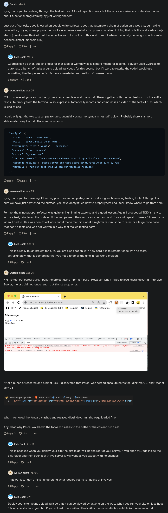

# Minesweeper test walkthrough 

## complete code of minesweeper project with unit + integration + EToE testings

<details>
    <summary>cypress folder</summary>

<details>
    <summary>fixtures folder</summary>

- example.json file 
    ```json
    {
      "name": "Using fixtures to represent data",
      "email": "hello@cypress.io",
      "body": "Fixtures are a great way to mock data for responses to routes"
    }
    ```
</details>

<details>
    <summary>integration folder</summary>

- minesweeper.test.js file
    ```js
    import { TILE_STATUSES } from "../../minesweeper.js"

    describe("user left clicks on tile", () => {
      describe("when the tile is not a mine", () => {
        it("reveals itself and displays the number of mines", () => {
          cy.visitBoard([
            [
              { x: 0, y: 0, status: TILE_STATUSES.HIDDEN, mine: true },
              { x: 0, y: 1, status: TILE_STATUSES.HIDDEN, mine: false },
            ],
            [
              { x: 1, y: 0, status: TILE_STATUSES.HIDDEN, mine: false },
              { x: 1, y: 1, status: TILE_STATUSES.HIDDEN, mine: false },
            ],
          ])
          cy.get('[data-x="0"][data-y="1"]').click()
          cy.get('[data-x="0"][data-y="1"]').should("have.text", "1")
        })
      })

      describe("when the tile is a mine", () => {
        it("reveals itself and all other mines", () => {
          cy.visitBoard([
            [
              { x: 0, y: 0, status: TILE_STATUSES.HIDDEN, mine: true },
              { x: 0, y: 1, status: TILE_STATUSES.HIDDEN, mine: true },
            ],
            [
              { x: 1, y: 0, status: TILE_STATUSES.HIDDEN, mine: false },
              { x: 1, y: 1, status: TILE_STATUSES.HIDDEN, mine: false },
            ],
          ])

          // Click Mine
          cy.get('[data-x="0"][data-y="0"]').click()
          cy.get('[data-x="0"][data-y="0"]').should(
            "have.attr",
            "data-status",
            TILE_STATUSES.MINE
          )

          // Reveal Other Mines
          cy.get('[data-x="0"][data-y="1"]').should(
            "have.attr",
            "data-status",
            TILE_STATUSES.MINE
          )

          // Lose Text
          cy.get(".subtext").should("have.text", "You Lose")

          // Ensure no input allowed
          cy.get('[data-x="1"][data-y="0"]').click()
          cy.get('[data-x="1"][data-y="0"]').should(
            "have.attr",
            "data-status",
            TILE_STATUSES.HIDDEN
          )
        })
      })
    })

    describe("user right clicks on tile", () => {
      describe("when the tile is not marked", () => {
        it("marks itself", () => {
          cy.visitBoard([
            [
              { x: 0, y: 0, status: TILE_STATUSES.HIDDEN, mine: true },
              { x: 0, y: 1, status: TILE_STATUSES.HIDDEN, mine: false },
            ],
            [
              { x: 1, y: 0, status: TILE_STATUSES.HIDDEN, mine: false },
              { x: 1, y: 1, status: TILE_STATUSES.HIDDEN, mine: false },
            ],
          ])
          cy.get('[data-x="0"][data-y="0"]').rightclick()
          cy.get('[data-x="0"][data-y="0"]').should(
            "have.attr",
            "data-status",
            TILE_STATUSES.MARKED
          )
        })
      })

      describe("when the tile is marked", () => {
        it("un-marks itself", () => {
          cy.visitBoard([
            [
              { x: 0, y: 0, status: TILE_STATUSES.MARKED, mine: true },
              { x: 0, y: 1, status: TILE_STATUSES.HIDDEN, mine: false },
            ],
            [
              { x: 1, y: 0, status: TILE_STATUSES.HIDDEN, mine: false },
              { x: 1, y: 1, status: TILE_STATUSES.HIDDEN, mine: false },
            ],
          ])
          cy.get('[data-x="0"][data-y="0"]').rightclick()
          cy.get('[data-x="0"][data-y="0"]').should(
            "have.attr",
            "data-status",
            TILE_STATUSES.HIDDEN
          )
        })
      })
    })
    ```
</details>

<details>
    <summary>plugins folder</summary>

- index.js file 
    ```js
    /// <reference types="cypress" />
    // ***********************************************************
    // This example plugins/index.js can be used to load plugins
    //
    // You can change the location of this file or turn off loading
    // the plugins file with the 'pluginsFile' configuration option.
    //
    // You can read more here:
    // https://on.cypress.io/plugins-guide
    // ***********************************************************

    // This function is called when a project is opened or re-opened (e.g. due to
    // the project's config changing)

    /**
     * @type {Cypress.PluginConfig}
     */
    module.exports = (on, config) => {
      // `on` is used to hook into various events Cypress emits
      // `config` is the resolved Cypress config
    }
    ```
</details>

<details>
    <summary>support</summary>

- commands.js
    ```js
    // ***********************************************
    // This example commands.js shows you how to
    // create various custom commands and overwrite
    // existing commands.
    //
    // For more comprehensive examples of custom
    // commands please read more here:
    // https://on.cypress.io/custom-commands
    // ***********************************************
    //
    //
    // -- This is a parent command --
    // Cypress.Commands.add("login", (email, password) => { ... })
    //
    //
    // -- This is a child command --
    // Cypress.Commands.add("drag", { prevSubject: 'element'}, (subject, options) => { ... })
    //
    //
    // -- This is a dual command --
    // Cypress.Commands.add("dismiss", { prevSubject: 'optional'}, (subject, options) => { ... })
    //
    //
    // -- This will overwrite an existing command --
    // Cypress.Commands.overwrite("visit", (originalFn, url, options) => { ... })

    Cypress.Commands.add("visitBoard", board => {
      cy.visit("/", {
        onBeforeLoad(window) {
          window.testBoard = board
        },
      })
    })
    ```

- index.js
    ```js
    // ***********************************************************
    // This example support/index.js is processed and
    // loaded automatically before your test files.
    //
    // This is a great place to put global configuration and
    // behavior that modifies Cypress.
    //
    // You can change the location of this file or turn off
    // automatically serving support files with the
    // 'supportFile' configuration option.
    //
    // You can read more here:
    // https://on.cypress.io/configuration
    // ***********************************************************

    // Import commands.js using ES2015 syntax:
    import './commands'

    // Alternatively you can use CommonJS syntax:
    // require('./commands')
    ```
</details>
</details>

<details>
    <summary>.babelrc file</summary>

```js
{
  "presets": ["@babel/preset-env"],
  "plugins": [
    "@babel/plugin-proposal-optional-chaining"
  ]
}
```
</details>

<details>
    <summary>.gitignore file</summary>

```
node_modules
dist
.cache
coverage
```
</details>

<details>
    <summary>cypress.json file</summary>

```json
{
  "baseUrl": "http://localhost:1234",
  "viewportWidth": 900,
  "viewportHeight": 900
}
```
</details>

<details>
    <summary>index.html file</summary>

```html
<!DOCTYPE html>
<html lang="en">
<head>
  <meta charset="UTF-8">
  <meta name="viewport" content="width=device-width, initial-scale=1.0">
  <link rel="stylesheet" href="styles.css">
  <script src="script.js" type="module"></script>
  <title>Minesweeper</title>
</head>
<body>
  <h3 class="title">Minesweeper</h3>
  <div class="subtext">
    Mines Left: <span data-mine-count></span>
  </div>
  <div class="board"></div>
</body>
</html>
```
</details>

<details>
    <summary>minesweeper.js file</summary>

```js
import { times, range } from "lodash/fp"

export const TILE_STATUSES = {
  HIDDEN: "hidden",
  MINE: "mine",
  NUMBER: "number",
  MARKED: "marked",
}

export function createBoard(boardSize, minePositions) {
  return times(x => {
    return times(y => {
      return {
        x,
        y,
        mine: minePositions.some(positionMatch.bind(null, { x, y })),
        status: TILE_STATUSES.HIDDEN,
      }
    }, boardSize)
  }, boardSize)
}

export function markedTilesCount(board) {
  return board.reduce((count, row) => {
    return (
      count + row.filter(tile => tile.status === TILE_STATUSES.MARKED).length
    )
  }, 0)
}

export function markTile(board, { x, y }) {
  const tile = board[x][y]
  if (
    tile.status !== TILE_STATUSES.HIDDEN &&
    tile.status !== TILE_STATUSES.MARKED
  ) {
    return board
  }

  if (tile.status === TILE_STATUSES.MARKED) {
    return replaceTile(
      board,
      { x, y },
      { ...tile, status: TILE_STATUSES.HIDDEN }
    )
  } else {
    return replaceTile(
      board,
      { x, y },
      { ...tile, status: TILE_STATUSES.MARKED }
    )
  }
}

export function revealTile(board, { x, y }) {
  const tile = board[x][y]
  if (tile.status !== TILE_STATUSES.HIDDEN) {
    return board
  }

  if (tile.mine) {
    return replaceTile(board, { x, y }, { ...tile, status: TILE_STATUSES.MINE })
  }

  const adjacentTiles = nearbyTiles(board, tile)
  const mines = adjacentTiles.filter(t => t.mine)
  const newBoard = replaceTile(
    board,
    { x, y },
    { ...tile, status: TILE_STATUSES.NUMBER, adjacentMinesCount: mines.length }
  )
  if (mines.length === 0) {
    return adjacentTiles.reduce((b, t) => {
      return revealTile(b, t)
    }, newBoard)
  }
  return newBoard
}

export function checkWin(board) {
  return board.every(row => {
    return row.every(tile => {
      return (
        tile.status === TILE_STATUSES.NUMBER ||
        (tile.mine &&
          (tile.status === TILE_STATUSES.HIDDEN ||
            tile.status === TILE_STATUSES.MARKED))
      )
    })
  })
}

export function checkLose(board) {
  return board.some(row => {
    return row.some(tile => {
      return tile.status === TILE_STATUSES.MINE
    })
  })
}

export function positionMatch(a, b) {
  return a.x === b.x && a.y === b.y
}

function replaceTile(board, position, newTile) {
  return board.map((row, x) => {
    return row.map((tile, y) => {
      if (positionMatch(position, { x, y })) {
        return newTile
      }
      return tile
    })
  })
}

function nearbyTiles(board, { x, y }) {
  const offsets = range(-1, 2)

  return offsets
    .flatMap(xOffset => {
      return offsets.map(yOffset => {
        return board[x + xOffset]?.[y + yOffset]
      })
    })
    .filter(tile => tile != null)
}
```
</details>

<details>
    <summary>minesweeper.test.js file</summary>

```js
import {
  createBoard,
  TILE_STATUSES,
  markedTilesCount,
  markTile,
  revealTile,
  checkWin,
  checkLose,
  positionMatch,
} from "./minesweeper"

describe("#createBoard", () => {
  test("it creates a valid board", () => {
    const boardSize = 2
    const minePositions = [{ x: 0, y: 1 }]
    const expectedBoard = [
      [
        { x: 0, y: 0, status: TILE_STATUSES.HIDDEN, mine: false },
        { x: 0, y: 1, status: TILE_STATUSES.HIDDEN, mine: true },
      ],
      [
        { x: 1, y: 0, status: TILE_STATUSES.HIDDEN, mine: false },
        { x: 1, y: 1, status: TILE_STATUSES.HIDDEN, mine: false },
      ],
    ]
    const board = createBoard(boardSize, minePositions)
    expect(board).toEqual(expectedBoard)
  })
})

describe("#markedTilesCount", () => {
  test("with some tiles marked", () => {
    const board = [
      [
        { x: 0, y: 0, status: TILE_STATUSES.MARKED, mine: false },
        { x: 0, y: 1, status: TILE_STATUSES.HIDDEN, mine: true },
      ],
      [
        { x: 1, y: 0, status: TILE_STATUSES.HIDDEN, mine: false },
        { x: 1, y: 1, status: TILE_STATUSES.MARKED, mine: false },
      ],
    ]
    expect(markedTilesCount(board)).toEqual(2)
  })

  test("with no tiles marked", () => {
    const board = [
      [
        { x: 0, y: 0, status: TILE_STATUSES.HIDDEN, mine: false },
        { x: 0, y: 1, status: TILE_STATUSES.HIDDEN, mine: true },
      ],
      [
        { x: 1, y: 0, status: TILE_STATUSES.HIDDEN, mine: false },
        { x: 1, y: 1, status: TILE_STATUSES.HIDDEN, mine: false },
      ],
    ]
    expect(markedTilesCount(board)).toEqual(0)
  })

  test("with all tiles marked", () => {
    const board = [
      [
        { x: 0, y: 0, status: TILE_STATUSES.MARKED, mine: false },
        { x: 0, y: 1, status: TILE_STATUSES.MARKED, mine: true },
      ],
      [
        { x: 1, y: 0, status: TILE_STATUSES.MARKED, mine: false },
        { x: 1, y: 1, status: TILE_STATUSES.MARKED, mine: false },
      ],
    ]
    expect(markedTilesCount(board)).toEqual(4)
  })
})

describe("#markTile", () => {
  test("with a hidden tile it marks it", () => {
    const board = [
      [
        { x: 0, y: 0, status: TILE_STATUSES.HIDDEN, mine: false },
        { x: 0, y: 1, status: TILE_STATUSES.HIDDEN, mine: true },
      ],
      [
        { x: 1, y: 0, status: TILE_STATUSES.HIDDEN, mine: false },
        { x: 1, y: 1, status: TILE_STATUSES.HIDDEN, mine: false },
      ],
    ]
    const expectedBoard = [
      [
        { x: 0, y: 0, status: TILE_STATUSES.MARKED, mine: false },
        { x: 0, y: 1, status: TILE_STATUSES.HIDDEN, mine: true },
      ],
      [
        { x: 1, y: 0, status: TILE_STATUSES.HIDDEN, mine: false },
        { x: 1, y: 1, status: TILE_STATUSES.HIDDEN, mine: false },
      ],
    ]
    expect(markTile(board, { x: 0, y: 0 })).toEqual(expectedBoard)
  })

  test("with a marked tile it un-marks it", () => {
    const board = [
      [
        { x: 0, y: 0, status: TILE_STATUSES.MARKED, mine: false },
        { x: 0, y: 1, status: TILE_STATUSES.HIDDEN, mine: true },
      ],
      [
        { x: 1, y: 0, status: TILE_STATUSES.HIDDEN, mine: false },
        { x: 1, y: 1, status: TILE_STATUSES.HIDDEN, mine: false },
      ],
    ]
    const expectedBoard = [
      [
        { x: 0, y: 0, status: TILE_STATUSES.HIDDEN, mine: false },
        { x: 0, y: 1, status: TILE_STATUSES.HIDDEN, mine: true },
      ],
      [
        { x: 1, y: 0, status: TILE_STATUSES.HIDDEN, mine: false },
        { x: 1, y: 1, status: TILE_STATUSES.HIDDEN, mine: false },
      ],
    ]
    expect(markTile(board, { x: 0, y: 0 })).toEqual(expectedBoard)
  })

  test("with a mine tile it does nothing", () => {
    const board = [
      [
        { x: 0, y: 0, status: TILE_STATUSES.MINE, mine: false },
        { x: 0, y: 1, status: TILE_STATUSES.HIDDEN, mine: true },
      ],
      [
        { x: 1, y: 0, status: TILE_STATUSES.HIDDEN, mine: false },
        { x: 1, y: 1, status: TILE_STATUSES.HIDDEN, mine: false },
      ],
    ]

    expect(markTile(board, { x: 0, y: 0 })).toEqual(board)
  })

  test("with a number tile it does nothing", () => {
    const board = [
      [
        { x: 0, y: 0, status: TILE_STATUSES.NUMBER, mine: false },
        { x: 0, y: 1, status: TILE_STATUSES.HIDDEN, mine: true },
      ],
      [
        { x: 1, y: 0, status: TILE_STATUSES.HIDDEN, mine: false },
        { x: 1, y: 1, status: TILE_STATUSES.HIDDEN, mine: false },
      ],
    ]

    expect(markTile(board, { x: 0, y: 0 })).toEqual(board)
  })
})

describe("#revealTile", () => {
  describe("with a hidden tile", () => {
    const board = [
      [
        { x: 0, y: 0, status: TILE_STATUSES.HIDDEN, mine: false },
        { x: 0, y: 1, status: TILE_STATUSES.HIDDEN, mine: true },
      ],
      [
        { x: 1, y: 0, status: TILE_STATUSES.HIDDEN, mine: false },
        { x: 1, y: 1, status: TILE_STATUSES.HIDDEN, mine: false },
      ],
    ]

    test("when the tile is a mine it sets its status to mine", () => {
      const expectedBoard = [
        [
          { x: 0, y: 0, status: TILE_STATUSES.HIDDEN, mine: false },
          { x: 0, y: 1, status: TILE_STATUSES.MINE, mine: true },
        ],
        [
          { x: 1, y: 0, status: TILE_STATUSES.HIDDEN, mine: false },
          { x: 1, y: 1, status: TILE_STATUSES.HIDDEN, mine: false },
        ],
      ]
      expect(revealTile(board, { x: 0, y: 1 })).toEqual(expectedBoard)
    })

    describe("when the tile is not a mine", () => {
      test("when the tile is adjacent to a mine it counts the number of nearby mines", () => {
        const expectedBoard = [
          [
            {
              x: 0,
              y: 0,
              status: TILE_STATUSES.NUMBER,
              mine: false,
              adjacentMinesCount: 1,
            },
            { x: 0, y: 1, status: TILE_STATUSES.HIDDEN, mine: true },
          ],
          [
            { x: 1, y: 0, status: TILE_STATUSES.HIDDEN, mine: false },
            { x: 1, y: 1, status: TILE_STATUSES.HIDDEN, mine: false },
          ],
        ]
        expect(revealTile(board, { x: 0, y: 0 })).toEqual(expectedBoard)
      })

      test("when the tile is not adjacent to a mine it reveals nearby tiles", () => {
        const board = [
          [
            { x: 0, y: 0, status: TILE_STATUSES.HIDDEN, mine: true },
            { x: 0, y: 1, status: TILE_STATUSES.HIDDEN, mine: false },
            { x: 0, y: 2, status: TILE_STATUSES.HIDDEN, mine: false },
          ],
          [
            { x: 1, y: 0, status: TILE_STATUSES.HIDDEN, mine: false },
            { x: 1, y: 1, status: TILE_STATUSES.HIDDEN, mine: false },
            { x: 1, y: 2, status: TILE_STATUSES.HIDDEN, mine: false },
          ],
          [
            { x: 2, y: 0, status: TILE_STATUSES.HIDDEN, mine: false },
            { x: 2, y: 1, status: TILE_STATUSES.HIDDEN, mine: false },
            { x: 2, y: 2, status: TILE_STATUSES.HIDDEN, mine: false },
          ],
        ]

        const expectedBoard = [
          [
            { x: 0, y: 0, status: TILE_STATUSES.HIDDEN, mine: true },
            {
              x: 0,
              y: 1,
              status: TILE_STATUSES.NUMBER,
              mine: false,
              adjacentMinesCount: 1,
            },
            {
              x: 0,
              y: 2,
              status: TILE_STATUSES.NUMBER,
              mine: false,
              adjacentMinesCount: 0,
            },
          ],
          [
            {
              x: 1,
              y: 0,
              status: TILE_STATUSES.NUMBER,
              mine: false,
              adjacentMinesCount: 1,
            },
            {
              x: 1,
              y: 1,
              status: TILE_STATUSES.NUMBER,
              mine: false,
              adjacentMinesCount: 1,
            },
            {
              x: 1,
              y: 2,
              status: TILE_STATUSES.NUMBER,
              mine: false,
              adjacentMinesCount: 0,
            },
          ],
          [
            {
              x: 2,
              y: 0,
              status: TILE_STATUSES.NUMBER,
              mine: false,
              adjacentMinesCount: 0,
            },
            {
              x: 2,
              y: 1,
              status: TILE_STATUSES.NUMBER,
              mine: false,
              adjacentMinesCount: 0,
            },
            {
              x: 2,
              y: 2,
              status: TILE_STATUSES.NUMBER,
              mine: false,
              adjacentMinesCount: 0,
            },
          ],
        ]

        expect(revealTile(board, { x: 2, y: 2 })).toEqual(expectedBoard)
      })
    })
  })

  test("with a marked tile it does nothing", () => {
    const board = [
      [
        { x: 0, y: 0, status: TILE_STATUSES.MARKED, mine: false },
        { x: 0, y: 1, status: TILE_STATUSES.HIDDEN, mine: true },
      ],
      [
        { x: 1, y: 0, status: TILE_STATUSES.HIDDEN, mine: false },
        { x: 1, y: 1, status: TILE_STATUSES.HIDDEN, mine: false },
      ],
    ]
    expect(revealTile(board, { x: 0, y: 0 })).toEqual(board)
  })

  test("with a mine tile it does nothing", () => {
    const board = [
      [
        { x: 0, y: 0, status: TILE_STATUSES.MINE, mine: false },
        { x: 0, y: 1, status: TILE_STATUSES.HIDDEN, mine: true },
      ],
      [
        { x: 1, y: 0, status: TILE_STATUSES.HIDDEN, mine: false },
        { x: 1, y: 1, status: TILE_STATUSES.HIDDEN, mine: false },
      ],
    ]

    expect(revealTile(board, { x: 0, y: 0 })).toEqual(board)
  })

  test("with a number tile it does nothing", () => {
    const board = [
      [
        { x: 0, y: 0, status: TILE_STATUSES.NUMBER, mine: false },
        { x: 0, y: 1, status: TILE_STATUSES.HIDDEN, mine: true },
      ],
      [
        { x: 1, y: 0, status: TILE_STATUSES.HIDDEN, mine: false },
        { x: 1, y: 1, status: TILE_STATUSES.HIDDEN, mine: false },
      ],
    ]

    expect(revealTile(board, { x: 0, y: 0 })).toEqual(board)
  })
})

describe("#checkWin", () => {
  test("with only hidden and marked mine tiles it returns true", () => {
    const board = [
      [
        { x: 0, y: 0, status: TILE_STATUSES.MARKED, mine: true },
        { x: 0, y: 1, status: TILE_STATUSES.HIDDEN, mine: true },
      ],
      [
        { x: 1, y: 0, status: TILE_STATUSES.NUMBER, mine: false },
        { x: 1, y: 1, status: TILE_STATUSES.NUMBER, mine: false },
      ],
    ]
    expect(checkWin(board)).toBeTruthy()
  })

  test("with some hidden non-mine tiles it returns false", () => {
    const board = [
      [
        { x: 0, y: 0, status: TILE_STATUSES.MARKED, mine: true },
        { x: 0, y: 1, status: TILE_STATUSES.HIDDEN, mine: true },
      ],
      [
        { x: 1, y: 0, status: TILE_STATUSES.HIDDEN, mine: false },
        { x: 1, y: 1, status: TILE_STATUSES.NUMBER, mine: false },
      ],
    ]
    expect(checkWin(board)).toBeFalsy()
  })
})

describe("#checkLose", () => {
  test("with no mines revealed it returns false", () => {
    const board = [
      [
        { x: 0, y: 0, status: TILE_STATUSES.MARKED, mine: true },
        { x: 0, y: 1, status: TILE_STATUSES.HIDDEN, mine: true },
      ],
      [
        { x: 1, y: 0, status: TILE_STATUSES.HIDDEN, mine: false },
        { x: 1, y: 1, status: TILE_STATUSES.HIDDEN, mine: false },
      ],
    ]
    expect(checkLose(board)).toBeFalsy()
  })

  test("with a mine revealed it returns true", () => {
    const board = [
      [
        { x: 0, y: 0, status: TILE_STATUSES.MINE, mine: true },
        { x: 0, y: 1, status: TILE_STATUSES.HIDDEN, mine: true },
      ],
      [
        { x: 1, y: 0, status: TILE_STATUSES.HIDDEN, mine: false },
        { x: 1, y: 1, status: TILE_STATUSES.NUMBER, mine: false },
      ],
    ]
    expect(checkLose(board)).toBeTruthy()
  })
})

describe("#positionMatch", () => {
  test("it returns true when the x and y properties are the same", () => {
    const posA = { x: 1, y: 2 }
    const posB = { x: 1, y: 2 }
    expect(positionMatch(posA, posB)).toBeTruthy()
  })

  test("it returns false when the x or y properties are not the same", () => {
    const posA = { x: 1, y: 2 }
    const posB = { x: 1, y: 1 }
    expect(positionMatch(posA, posB)).toBeFalsy()
  })
})
```
</details>

<details>
    <summary>package-lock.json</summary>

```
upload this file also
```
</details>

<details>
    <summary>package.json</summary>

```json
{
  "name": "current-project",
  "version": "1.0.0",
  "description": "",
  "main": "minesweeper.js",
  "scripts": {
    "build": "parcel build index.html",
    "start": "parcel index.html",
    "test": "jest --coverage",
    "cy:open": "cypress open",
    "test:e2e": "start-server-and-test start http://localhost:1234 cy:open"
  },
  "keywords": [],
  "author": "",
  "license": "ISC",
  "dependencies": {
    "lodash": "^4.17.21"
  },
  "devDependencies": {
    "@babel/core": "^7.13.8",
    "@babel/plugin-proposal-optional-chaining": "^7.13.8",
    "@babel/preset-env": "^7.13.10",
    "cypress": "^6.6.0",
    "jest": "^26.6.3",
    "parcel-bundler": "1.12.3",
    "start-server-and-test": "^1.12.0"
  }
}
```
</details>

<details>
    <summary>script.js file</summary>

```js
// Display/UI

import {
  TILE_STATUSES,
  createBoard,
  markTile,
  revealTile,
  checkWin,
  checkLose,
  positionMatch,
  markedTilesCount,
} from "./minesweeper.js"

let testBoard
if (process.env.NODE_ENV !== "production" && window.testBoard) {
  testBoard = window.testBoard
}

const BOARD_SIZE = testBoard?.length ?? 10
const NUMBER_OF_MINES = testBoard?.flat().filter(t => t.mine).length ?? 3

let board =
  testBoard ??
  createBoard(BOARD_SIZE, getMinePositions(BOARD_SIZE, NUMBER_OF_MINES))
const boardElement = document.querySelector(".board")
const minesLeftText = document.querySelector("[data-mine-count]")
const messageText = document.querySelector(".subtext")

function render() {
  boardElement.innerHTML = ""
  checkGameEnd()

  getTileElements().forEach(element => {
    boardElement.append(element)
  })

  listMinesLeft()
}

function getTileElements() {
  return board.flatMap(row => {
    return row.map(tileToElement)
  })
}

function tileToElement(tile) {
  const element = document.createElement("div")
  element.dataset.status = tile.status
  element.dataset.x = tile.x
  element.dataset.y = tile.y
  element.textContent = tile.adjacentMinesCount || ""
  return element
}

boardElement.addEventListener("click", e => {
  if (!e.target.matches("[data-status]")) return

  board = revealTile(board, {
    x: parseInt(e.target.dataset.x),
    y: parseInt(e.target.dataset.y),
  })
  render()
})

boardElement.addEventListener("contextmenu", e => {
  if (!e.target.matches("[data-status]")) return

  e.preventDefault()
  board = markTile(board, {
    x: parseInt(e.target.dataset.x),
    y: parseInt(e.target.dataset.y),
  })
  render()
})

boardElement.style.setProperty("--size", BOARD_SIZE)
render()

function listMinesLeft() {
  minesLeftText.textContent = NUMBER_OF_MINES - markedTilesCount(board)
}

function checkGameEnd() {
  const win = checkWin(board)
  const lose = checkLose(board)

  if (win || lose) {
    boardElement.addEventListener("click", stopProp, { capture: true })
    boardElement.addEventListener("contextmenu", stopProp, { capture: true })
  }

  if (win) {
    messageText.textContent = "You Win"
  }
  if (lose) {
    messageText.textContent = "You Lose"
    board.forEach(row => {
      row.forEach(tile => {
        if (tile.status === TILE_STATUSES.MARKED) board = markTile(board, tile)
        if (tile.mine) board = revealTile(board, tile)
      })
    })
  }
}

function stopProp(e) {
  e.stopImmediatePropagation()
}

function getMinePositions(boardSize, numberOfMines) {
  const positions = []

  while (positions.length < numberOfMines) {
    const position = {
      x: randomNumber(boardSize),
      y: randomNumber(boardSize),
    }

    if (!positions.some(positionMatch.bind(null, position))) {
      positions.push(position)
    }
  }

  return positions
}

function randomNumber(size) {
  return Math.floor(Math.random() * size)
}
```
</details>

<details>
    <summary>styles.css file</summary>

```css
* {
  box-sizing: border-box;
}

body {
  margin: 0;
  background-color: #333;
  display: flex;
  align-items: center;
  font-size: 3rem;
  flex-direction: column;
  color: white;
}

.title {
  margin: 20px;
}

.subtext {
  color: #CCC;
  font-size: 1.5rem;
  margin-bottom: 10px;
}

.board {
  display: inline-grid;
  padding: 10px;
  grid-template-columns: repeat(var(--size), 60px);
  grid-template-rows: repeat(var(--size), 60px);
  gap: 4px;
  background-color: #777;
}

.board > * {
  width: 100%;
  height: 100%;
  display: flex;
  justify-content: center;
  align-items: center;
  color: white;
  border: 2px solid #BBB;
  user-select: none;
}

.board > [data-status="hidden"] {
  background-color: #BBB;
  cursor: pointer;
}

.board > [data-status="mine"] {
  background-color: red;
}

.board > [data-status="number"] {
  background-color: none;
}

.board > [data-status="marked"] {
  background-color: yellow;
}
```
</details>

## Explanation of minesweeper project with only unit testing

- `STEP 1` : download all the libraries which exists inside package.json file 
  - run `npm i --save-dev jest cypress @babel/preset-env start-server-and-test`
  
- `STEP 2` : now inside `.babelrc` file , our RC is set up properly
  ```js
  {
    "presents": ["@babel/preset-env"],
    "plugins": [
      "@babel/plugin-proposal-optional-chaining"
    ]
  }
  ```
  - so by setting preset on babel , so that we can use `jest` library instead of our test <br> 
    & even though we're using the normal import-export syntax

- `STEP 3` : inside package.json file , let's setup a bunch of our different scripts
  ```js
  "scripts": {
    "build": "parcel build index.html", 
    "start": "parcel index.html", 
    "test": "jest --coverage", // we need test script
    "cy:open": "cypress open",
    "test:e2e": "start-server-and-test start http://localhost:1234 cy:open" 
  }
  ```
  - `"test:e2e": "start-server-and-test start http://localhost:1234 cy:open"` means 
    - we need `test` script for end to end testing 
    - & then we called `start` method (which is starting our parcel with that localhost URL with this port 1234) 
    - & then we'll do EToE testing with cypress that's why we used `cy:open`
    - so once our server started then cypress & Jest will be setup means we can start writing our tests now 

- so to get get started with writing our tests , let's do some unit testing <br>
    & it really doesn't matter , if you do unit tests or end-to-end test <br>
    & right we'll do unit test first
- `STEP 4` : inside main folder , create a file as minesweeper.test.js file
  - now inside minesweeper.js file , we can see we have a bunch of different export functions <br>
    like createBoard() , markedTilesCount , markTile() , revealTile() , checkWin() , checkLose() , positionMatch() 
  - so these exported function we need to test
  - `STEP 4.1` : inside minesweeper.test.js , let's test exported createdBoard() function
    ```js
    import { createBoard } from "./minesweeper"

    describe("#createBoard", () => {
      test("it creates a valid board", () => {
        // here we passed boardSize & minePositions as variables 
        // but inside createBoard() function , these variables are in parameters form 
        const boardSize = 2  
        const minePositions = [{ x: 0, y: 1 }]
        const expectedBoard = [ // now we have expected board means expected output 
          [
            { x: 0, y: 0, status: TILE_STATUSES.HIDDEN, mine: false },
            { x: 0, y: 1, status: TILE_STATUSES.HIDDEN, mine: true },
          ],
          [
            { x: 1, y: 0, status: TILE_STATUSES.HIDDEN, mine: false },
            { x: 1, y: 1, status: TILE_STATUSES.HIDDEN, mine: false },
          ],
        ]
        const board = createBoard(boardSize, minePositions)
        expect(board).toEqual(expectedBoard)
      })
    })
    ```
    - value of `expectedBoard` means we just created a placeholder board & board has all of our different values that we expect <br>
      & we know that everything's not gonna be a mine expect this one i.e value of x is 0 & y is 1 <br>
      i.e `{ x: 0, y: 1, status: TILE_STATUSES.HIDDEN, mine: true }` here we have mine set to true

    - output : run `npm test` command & test case will pass but we'll get very bad coverage but that's perfectly okay
      - go inside `coverage` folder , inside `lcov-report` folder , open index.html through live server
      - then click on minesweeper.js (which is inside file column) , <br>
        so we can see that we just only tested export createBoard() function 

  - `STEP 4.2` : inside minesweeper.test.js file , let's test the exported marked() function
    ```js
    import { createBoard, TILE_STATUSES, markedTilesCount } from "./minesweeper"

    describe("#createBoard", () => {
      test("it creates a valid board", () => {
        const boardSize = 2  
        const minePositions = [{ x: 0, y: 1 }]
        const expectedBoard = [
          [
            { x: 0, y: 0, status: TILE_STATUSES.HIDDEN, mine: false },
            { x: 0, y: 1, status: TILE_STATUSES.HIDDEN, mine: true },
          ],
          [
            { x: 1, y: 0, status: TILE_STATUSES.HIDDEN, mine: false },
            { x: 1, y: 1, status: TILE_STATUSES.HIDDEN, mine: false },
          ],
        ]
        const board = createBoard(boardSize, minePositions)
        expect(board).toEqual(expectedBoard)
      })
    })

    describe("#markedTilesCount", () => {
      test("with some tiles marked", () => {
        // so inside exported markedTilesCount() function we just passed only one thing i.e board
        const board = [
          [
            { x: 0, y: 0, status: TILE_STATUSES.MARKED, mine: false },
            { x: 0, y: 1, status: TILE_STATUSES.HIDDEN, mine: true },
          ],
          [
            { x: 1, y: 0, status: TILE_STATUSES.HIDDEN, mine: false },
            { x: 1, y: 1, status: TILE_STATUSES.MARKED, mine: false },
          ],
        ]
        expect(markedTilesCount(board)).toEqual(2)
    })
    ```
    - output : run `npm test`

    - `STEP 4.2.1` : inside minesweeper.test.js file , now let's test what if no tiles marked & if all tiles marked 
      ```js
      import { createBoard, TILE_STATUSES, markedTilesCount } from "./minesweeper"

      describe("#createBoard", () => {
        test("it creates a valid board", () => {
          const boardSize = 2  
          const minePositions = [{ x: 0, y: 1 }]
          const expectedBoard = [
            [
              { x: 0, y: 0, status: TILE_STATUSES.HIDDEN, mine: false },
              { x: 0, y: 1, status: TILE_STATUSES.HIDDEN, mine: true },
            ],
            [
              { x: 1, y: 0, status: TILE_STATUSES.HIDDEN, mine: false },
              { x: 1, y: 1, status: TILE_STATUSES.HIDDEN, mine: false },
            ],
          ]
          const board = createBoard(boardSize, minePositions)
          expect(board).toEqual(expectedBoard)
        })
      })

      describe("#markedTilesCount", () => {
        test("with some tiles marked", () => {
          const board = [
            [
              { x: 0, y: 0, status: TILE_STATUSES.MARKED, mine: false },
              { x: 0, y: 1, status: TILE_STATUSES.HIDDEN, mine: true },
            ],
            [
              { x: 1, y: 0, status: TILE_STATUSES.HIDDEN, mine: false },
              { x: 1, y: 1, status: TILE_STATUSES.MARKED, mine: false },
            ],
          ]
          expect(markedTilesCount(board)).toEqual(2)
        })

        test("with no tiles marked", () => {
          const board = [
            [
              { x: 0, y: 0, status: TILE_STATUSES.HIDDEN, mine: false },
              { x: 0, y: 1, status: TILE_STATUSES.HIDDEN, mine: true },
            ],
            [
              { x: 1, y: 0, status: TILE_STATUSES.HIDDEN, mine: false },
              { x: 1, y: 1, status: TILE_STATUSES.HIDDEN, mine: false },
            ],
          ]
          expect(markedTilesCount(board)).toEqual(0)
        })

        test("with some tiles marked", () => {
          const board = [
            [
              { x: 0, y: 0, status: TILE_STATUSES.MARKED, mine: false },
              { x: 0, y: 1, status: TILE_STATUSES.MARKED, mine: true },
            ],
            [
              { x: 1, y: 0, status: TILE_STATUSES.MARKED, mine: false },
              { x: 1, y: 1, status: TILE_STATUSES.MARKED, mine: false },
            ],
          ]
          expect(markedTilesCount(board)).toEqual(4)
        })
      })
      ```
      - output : run `npm test` & technically it's not necessary for to these with all & with no tiles marked test <br>
        but depending on your code , these edge cases could become a specific problem
        - so writing them in is probably not a bad idea because we can see that whatever tests till yet we wrote <br>
          for testing `markedTilesCount()` function , so those tests are passing 
        - & if we pull up our coverage again i.e go inside `coverage` folder , <br>
          inside `lcov-report` folder , open index.html through live server
        - click on minesweeper.js file (of file column) , both functions <br>
          i.e createBoard() & markedTilesCount() function have 100% test coverage ✔️✔️✔️

  - `STEP 4.3` : inside minesweeper.test.js file , writing test for exported markTile() function
    ```js
    import { createBoard, TILE_STATUSES, markedTilesCount, markTile } from "./minesweeper"

    describe("#markTile", () => {
      test("with a hidden tile it marks it", () => {
        const board = [
          [
            { x: 0, y: 0, status: TILE_STATUSES.HIDDEN, mine: false },
            { x: 0, y: 1, status: TILE_STATUSES.HIDDEN, mine: true },
          ],
          [
            { x: 1, y: 0, status: TILE_STATUSES.HIDDEN, mine: false },
            { x: 1, y: 1, status: TILE_STATUSES.HIDDEN, mine: false },
          ],
        ]
        const expectedBoard = [
          [
            { x: 0, y: 0, status: TILE_STATUSES.MARKED, mine: false },
            { x: 0, y: 1, status: TILE_STATUSES.HIDDEN, mine: true },
          ],
          [
            { x: 1, y: 0, status: TILE_STATUSES.HIDDEN, mine: false },
            { x: 1, y: 1, status: TILE_STATUSES.HIDDEN, mine: false },
          ],
        ]
        expect(markTile(board, { x: 0, y: 0 })).toEqual(expectedBoard)
      })

      test("with a marked tile it un-marks it", () => {
        const board = [
          [
            { x: 0, y: 0, status: TILE_STATUSES.MARKED, mine: false },
            { x: 0, y: 1, status: TILE_STATUSES.HIDDEN, mine: true },
          ],
          [
            { x: 1, y: 0, status: TILE_STATUSES.HIDDEN, mine: false },
            { x: 1, y: 1, status: TILE_STATUSES.HIDDEN, mine: false },
          ],
        ]
        const expectedBoard = [
          [
            { x: 0, y: 0, status: TILE_STATUSES.HIDDEN, mine: false },
            { x: 0, y: 1, status: TILE_STATUSES.HIDDEN, mine: true },
          ],
          [
            { x: 1, y: 0, status: TILE_STATUSES.HIDDEN, mine: false },
            { x: 1, y: 1, status: TILE_STATUSES.HIDDEN, mine: false },
          ],
        ]
        expect(markTile(board, { x: 0, y: 0 })).toEqual(expectedBoard)
      })

      test("with a mine tile it does nothing", () => {
        const board = [
          [
            { x: 0, y: 0, status: TILE_STATUSES.MINE, mine: false },
            { x: 0, y: 1, status: TILE_STATUSES.HIDDEN, mine: true },
          ],
          [
            { x: 1, y: 0, status: TILE_STATUSES.HIDDEN, mine: false },
            { x: 1, y: 1, status: TILE_STATUSES.HIDDEN, mine: false },
          ],
        ]

        expect(markTile(board, { x: 0, y: 0 })).toEqual(board)
      })

      test("with a number tile it does nothing", () => {
        const board = [
          [
            { x: 0, y: 0, status: TILE_STATUSES.NUMBER, mine: false },
            { x: 0, y: 1, status: TILE_STATUSES.HIDDEN, mine: true },
          ],
          [
            { x: 1, y: 0, status: TILE_STATUSES.HIDDEN, mine: false },
            { x: 1, y: 1, status: TILE_STATUSES.HIDDEN, mine: false },
          ],
        ]

        expect(markTile(board, { x: 0, y: 0 })).toEqual(board)
      })
    })
    ```
    - output : run `npm test` command & once that finishes 
      - then open up our coverage i.e go inside `coverage` folder , inside `lcov-report` folder , <br>
        open index.html through live server to check whether we covered the 100% coverage or not 
      - then click on that minesweeper.js file link (which is under file coverage) , <br>
        so markTile() function is now 100% coverage

  - now let's move on even more complex function i.e export revealTile() function
  - `STEP 4.4` : inside minesweeper.test.js file , writing test for exported revealTile() function
    ```js
    import { createBoard, TILE_STATUSES, markedTilesCount, markTile, revealTile } from "./minesweeper"

    describe("#revealTile", () => {
      describe("with a hidden tile", () => {
        const board = [
          [
            { x: 0, y: 0, status: TILE_STATUSES.HIDDEN, mine: false },
            { x: 0, y: 1, status: TILE_STATUSES.HIDDEN, mine: true },
          ],
          [
            { x: 1, y: 0, status: TILE_STATUSES.HIDDEN, mine: false },
            { x: 1, y: 1, status: TILE_STATUSES.HIDDEN, mine: false },
          ],
        ]

        test("when the tile is a mine it sets its status to mine", () => {
          const expectedBoard = [
            [
              { x: 0, y: 0, status: TILE_STATUSES.HIDDEN, mine: false },
              { x: 0, y: 1, status: TILE_STATUSES.MINE, mine: true },
            ],
            [
              { x: 1, y: 0, status: TILE_STATUSES.HIDDEN, mine: false },
              { x: 1, y: 1, status: TILE_STATUSES.HIDDEN, mine: false },
            ],
          ]
          expect(revealTile(board, { x: 0, y: 1 })).toEqual(expectedBoard) 
          // at this point doing testing instead of writing further tests for this revealTile() function  
        })

        // before writing this next test , first check inside minesweeper.js file , inside this function we have done
        // & then based on that , do testing
        describe("when the tile is not a mine", () => {
          test("when the tile is adjacent to a mine it counts the number of nearby mines", () => {
            const expectedBoard = [
              [
                {
                  x: 0,
                  y: 0,
                  status: TILE_STATUSES.NUMBER,
                  mine: false,
                  adjacentMinesCount: 1,
                },
                { x: 0, y: 1, status: TILE_STATUSES.HIDDEN, mine: true },
              ],
              [
                { x: 1, y: 0, status: TILE_STATUSES.HIDDEN, mine: false },
                { x: 1, y: 1, status: TILE_STATUSES.HIDDEN, mine: false },
              ],
            ]
            expect(revealTile(board, { x: 0, y: 0 })).toEqual(expectedBoard)
          })

          test("when the tile is not adjacent to a mine it reveals nearby tiles", () => {
            const board = [
              [
                { x: 0, y: 0, status: TILE_STATUSES.HIDDEN, mine: true },
                { x: 0, y: 1, status: TILE_STATUSES.HIDDEN, mine: false },
                { x: 0, y: 2, status: TILE_STATUSES.HIDDEN, mine: false },
              ],
              [
                { x: 1, y: 0, status: TILE_STATUSES.HIDDEN, mine: false },
                { x: 1, y: 1, status: TILE_STATUSES.HIDDEN, mine: false },
                { x: 1, y: 2, status: TILE_STATUSES.HIDDEN, mine: false },
              ],
              [
                { x: 2, y: 0, status: TILE_STATUSES.HIDDEN, mine: false },
                { x: 2, y: 1, status: TILE_STATUSES.HIDDEN, mine: false },
                { x: 2, y: 2, status: TILE_STATUSES.HIDDEN, mine: false },
              ],
            ]

            const expectedBoard = [
              [
                { x: 0, y: 0, status: TILE_STATUSES.HIDDEN, mine: true },
                {
                  x: 0,
                  y: 1,
                  status: TILE_STATUSES.NUMBER,
                  mine: false,
                  adjacentMinesCount: 1,
                },
                {
                  x: 0,
                  y: 2,
                  status: TILE_STATUSES.NUMBER,
                  mine: false,
                  adjacentMinesCount: 0,
                },
              ],
              [
                {
                  x: 1,
                  y: 0,
                  status: TILE_STATUSES.NUMBER,
                  mine: false,
                  adjacentMinesCount: 1,
                },
                {
                  x: 1,
                  y: 1,
                  status: TILE_STATUSES.NUMBER,
                  mine: false,
                  adjacentMinesCount: 1,
                },
                {
                  x: 1,
                  y: 2,
                  status: TILE_STATUSES.NUMBER,
                  mine: false,
                  adjacentMinesCount: 0,
                },
              ],
              [
                {
                  x: 2,
                  y: 0,
                  status: TILE_STATUSES.NUMBER,
                  mine: false,
                  adjacentMinesCount: 0,
                },
                {
                  x: 2,
                  y: 1,
                  status: TILE_STATUSES.NUMBER,
                  mine: false,
                  adjacentMinesCount: 0,
                },
                {
                  x: 2,
                  y: 2,
                  status: TILE_STATUSES.NUMBER,
                  mine: false,
                  adjacentMinesCount: 0,
                },
              ],
            ]

            expect(revealTile(board, { x: 2, y: 2 })).toEqual(expectedBoard)
          })
        })
      })

      test("with a marked tile it does nothing", () => {
        const board = [
          [
            { x: 0, y: 0, status: TILE_STATUSES.MARKED, mine: false },
            { x: 0, y: 1, status: TILE_STATUSES.HIDDEN, mine: true },
          ],
          [
            { x: 1, y: 0, status: TILE_STATUSES.HIDDEN, mine: false },
            { x: 1, y: 1, status: TILE_STATUSES.HIDDEN, mine: false },
          ],
        ]
        expect(revealTile(board, { x: 0, y: 0 })).toEqual(board)
      })

      test("with a mine tile it does nothing", () => {
        const board = [
          [
            { x: 0, y: 0, status: TILE_STATUSES.MINE, mine: false },
            { x: 0, y: 1, status: TILE_STATUSES.HIDDEN, mine: true },
          ],
          [
            { x: 1, y: 0, status: TILE_STATUSES.HIDDEN, mine: false },
            { x: 1, y: 1, status: TILE_STATUSES.HIDDEN, mine: false },
          ],
        ]

        expect(revealTile(board, { x: 0, y: 0 })).toEqual(board)
      })

      test("with a number tile it does nothing", () => {
        const board = [
          [
            { x: 0, y: 0, status: TILE_STATUSES.NUMBER, mine: false },
            { x: 0, y: 1, status: TILE_STATUSES.HIDDEN, mine: true },
          ],
          [
            { x: 1, y: 0, status: TILE_STATUSES.HIDDEN, mine: false },
            { x: 1, y: 1, status: TILE_STATUSES.HIDDEN, mine: false },
          ],
        ]

        expect(revealTile(board, { x: 0, y: 0 })).toEqual(board)
      })
    })
    ```
    - output : run `npm test` & when it gets finished then , open that coverage file i.e index.html through live server
      - & then click on minesweeper.js file (which comes under file column) <br>
        then we can see revealTile() function is passed (which is most by far the most complex unit test)

  - `STEP 4.5` : inside minesweeper.test.js file , writing test for checkWin() function
    ```js
    import { createBoard, TILE_STATUSES, markedTilesCount, markTile, revealTile } from "./minesweeper"

    describe("#checkWin", () => {
      test("with only hidden and marked mine tiles it returns true", () => {
        const board = [
          [
            { x: 0, y: 0, status: TILE_STATUSES.MARKED, mine: true },
            { x: 0, y: 1, status: TILE_STATUSES.HIDDEN, mine: true },
          ],
          [
            { x: 1, y: 0, status: TILE_STATUSES.NUMBER, mine: false },
            { x: 1, y: 1, status: TILE_STATUSES.NUMBER, mine: false },
          ],
        ]
        expect(checkWin(board)).toBeTruthy() 
      })

      test("with some hidden non-mine tiles it returns false", () => {
        const board = [
          [
            { x: 0, y: 0, status: TILE_STATUSES.MARKED, mine: true },
            { x: 0, y: 1, status: TILE_STATUSES.HIDDEN, mine: true },
          ],
          [
            { x: 1, y: 0, status: TILE_STATUSES.HIDDEN, mine: false },
            { x: 1, y: 1, status: TILE_STATUSES.NUMBER, mine: false },
          ],
        ]
        expect(checkWin(board)).toBeFalsy()
      })
    })
    ```
    - output : run `npm test` & when it gets finished then , open that coverage file i.e index.html through live server
      - & then click on minesweeper.js file (which comes under file column) then we can see checkWin() function is passed 

  - `STEP 4.6` : inside minesweeper.test.js file , writing test for checkLose() function
    ```js
    import {
      createBoard,
      TILE_STATUSES,
      markedTilesCount,
      markTile,
      revealTile,
      checkWin,
      checkLose,
    } from "./minesweeper"

    describe("#checkLose", () => {
      test("with no mines revealed it returns false", () => {
        const board = [
          [
            { x: 0, y: 0, status: TILE_STATUSES.MARKED, mine: true },
            { x: 0, y: 1, status: TILE_STATUSES.HIDDEN, mine: true },
          ],
          [
            { x: 1, y: 0, status: TILE_STATUSES.HIDDEN, mine: false },
            { x: 1, y: 1, status: TILE_STATUSES.HIDDEN, mine: false },
          ],
        ]
        expect(checkLose(board)).toBeFalsy()
      })

      test("with a mine revealed it returns true", () => {
        const board = [
          [
            { x: 0, y: 0, status: TILE_STATUSES.MINE, mine: true },
            { x: 0, y: 1, status: TILE_STATUSES.HIDDEN, mine: true },
          ],
          [
            { x: 1, y: 0, status: TILE_STATUSES.HIDDEN, mine: false },
            { x: 1, y: 1, status: TILE_STATUSES.NUMBER, mine: false },
          ],
        ]
        expect(checkLose(board)).toBeTruthy()
      })
    })
    ```
    - output : run `npm test` & when it gets finished then , open that coverage file i.e index.html through live server
      - & then click on minesweeper.js file (which comes under file column) then we can see checkLose() function is passed 

  - `STEP 4.7` : inside minesweeper.test.js file , writing test for positionMatch() function
    ```js
    import {
      createBoard,
      TILE_STATUSES,
      markedTilesCount,
      markTile,
      revealTile,
      checkWin,
      checkLose,
      positionMatch,
    } from "./minesweeper"

    describe("#positionMatch", () => {
      test("it returns true when the x and y properties are the same", () => {
        const posA = { x: 1, y: 2 }
        const posB = { x: 1, y: 2 }
        expect(positionMatch(posA, posB)).toBeTruthy()
      })

      test("it returns false when the x or y properties are not the same", () => {
        const posA = { x: 1, y: 2 }
        const posB = { x: 1, y: 1 }
        expect(positionMatch(posA, posB)).toBeFalsy()
      })
    })
    ```
    - output : run `npm test` & when it gets finished then , open that coverage file i.e index.html through live server
      - & then click on minesweeper.js file (which comes under file column) then we can see positionMatch() function is passed 
      - & we got the 100% coverage

## Explanation of minesweeper project with only integration + end-to-end testing

- now let's do ETOE testing with cypress & this is gonna be easier & harder at the same time
- `STEP 5` : run `npm run test:e2e` command & this is gonna startup our server for us 
  - & do everything that we need & it's gonna opening up Cypress

- `STEP 6` : now cypress window popup will come 
  - inside `Cypress` folder , inside `integration` folder , delete that `examples` folder
  - `STEP 6.1` : inside `Cypress` folder , `integration` folder
    - create a file as `minesweeper.test.js` file  

- `STEP 7` : inside cypress.json file
  ```json
  {
    "baseUrl": "http://localhost:1234",
    "viewportWidth": 900,
    "viewportHeight": 900
  }
  ```
  - now set our baseUrl & width + height pf viewport

- `STEP 8` : inside `cypress` folder , inside `integration` folder , inside `minesweeper.test.js` file , 
  ```js
  it("test", () => {
    cy.visit("/")
  })
  ```
  - output : to do testing then run `npm run test:e2e` then our entire application being rendered
    - but you're gonna notice one problem i.e when we rerun the test then we'll get another different minesweeper board <br> 
      because our application deals with randomness & we don't want to test randomness because then testing becomes harder <br>
      so we want some way that we can fix this randomness

  - `STEP 8.1` : inside script.js file , 
    ```js
    // Display/UI

    import {
      TILE_STATUSES,
      createBoard,
      markTile,
      revealTile,
      checkWin,
      checkLose,
      positionMatch,
      markedTilesCount,
    } from "./minesweeper.js"

    let testBoard
    if (process.env.NODE_ENV !== "production" && window.testBoard) {
      testBoard = window.testBoard
    }

    const BOARD_SIZE = testBoard?.length ?? 10
    const NUMBER_OF_MINES = testBoard?.flat().filter(t => t.mine).length ?? 3

    let board = testBoard ?? createBoard(BOARD_SIZE, getMinePositions(BOARD_SIZE, NUMBER_OF_MINES))
    const boardElement = document.querySelector(".board")
    const minesLeftText = document.querySelector("[data-mine-count]")
    const messageText = document.querySelector(".subtext")
    ```
    - here we're trying to inject something to eliminate the randomness to make things easier for testing <br>
      & our game will still work as before 

  - `STEP 8.2` : inside `cypress` folder , inside `integration` folder , inside `minesweeper.test.js` file , 
    ```js
    it("test", () => {
      cy.visit("/", {
        onBeforeLoad(window) {
          window.testBoard =    
        }
      })
    })
    ```

    - `STEP 8.2.1` : inside minesweeper.test.js file , <br>
      copy the value of `board` variable from checkLose() function of `with no mines revealed it returns false` test
      ```js
      describe("#checkLose", () => {
        test("with no mines revealed it returns false", () => {
          const board = [
            [
              { x: 0, y: 0, status: TILE_STATUSES.MARKED, mine: true },
              { x: 0, y: 1, status: TILE_STATUSES.HIDDEN, mine: true },
            ],
            [
              { x: 1, y: 0, status: TILE_STATUSES.HIDDEN, mine: false },
              { x: 1, y: 1, status: TILE_STATUSES.HIDDEN, mine: false },
            ],
          ]
          expect(checkLose(board)).toBeFalsy()
        })

        test("with a mine revealed it returns true", () => {
          const board = [
            [
              { x: 0, y: 0, status: TILE_STATUSES.MINE, mine: true },
              { x: 0, y: 1, status: TILE_STATUSES.HIDDEN, mine: true },
            ],
            [
              { x: 1, y: 0, status: TILE_STATUSES.HIDDEN, mine: false },
              { x: 1, y: 1, status: TILE_STATUSES.NUMBER, mine: false },
            ],
          ]
          expect(checkLose(board)).toBeTruthy()
        })
      })
      ```
  
  - `STEP 8.3` : inside `cypress` folder , inside `integration` folder , inside `minesweeper.test.js` file 
    ```js
    it("test", () => {
      cy.visit("/", {
        onBeforeLoad(window) {
          window.testBoard = [
            [
              { x: 0, y: 0, status: TILE_STATUSES.MARKED, mine: true },
              { x: 0, y: 1, status: TILE_STATUSES.HIDDEN, mine: true },
            ],
            [
              { x: 1, y: 0, status: TILE_STATUSES.HIDDEN, mine: false },
              { x: 1, y: 1, status: TILE_STATUSES.HIDDEN, mine: false },
            ],
          ]
        }
      })
    })
    ```
    - output : save the file & we'll get an error inside Cypress chrome window i.e tile status is not defined
    
    - `STEP 8.3.1` : inside `cypress` folder , inside `integration` folder , inside `minesweeper.test.js` file
      ```js
      import { TILE_STATUSES } from '../../minesweeper.js'

      it("test", () => {
        cy.visit("/", {
          onBeforeLoad(window) {
            window.testBoard = [
              [
                { x: 0, y: 0, status: TILE_STATUSES.MARKED, mine: true },
                { x: 0, y: 1, status: TILE_STATUSES.HIDDEN, mine: true },
              ],
              [
                { x: 1, y: 0, status: TILE_STATUSES.HIDDEN, mine: false },
                { x: 1, y: 1, status: TILE_STATUSES.HIDDEN, mine: false },
              ],
            ]
          }
        })
      })
      ```
    - output : save the file & now test will run inside Cypress chrome window

- now we can actually move on to writing out our integration test 
  - but writing this big chuck of code before load all the time i.e <br>
    ```js
    cy.visit("/", {
      onBeforeLoad(window) {
        window.testBoard = [
          [
            { x: 0, y: 0, status: TILE_STATUSES.MARKED, mine: true },
            { x: 0, y: 1, status: TILE_STATUSES.HIDDEN, mine: true },
          ],
          [
            { x: 1, y: 0, status: TILE_STATUSES.HIDDEN, mine: false },
            { x: 1, y: 1, status: TILE_STATUSES.HIDDEN, mine: false },
          ],
        ]
      }
    })
    ```
  - `STEP 9` : so inside cypress folder , inside support folder , create a file as `commands.js` 
    - now this commands.js file will do for us , so inside commands.js file 
      ```js
      Cypress.Commands.add("visitBoard", board => {
        cy.visit("/", {
          onBeforeLoad(window) {
            window.testBoard = board
          },
        })
      })
      ``` 

    - `STEP 9.1` : now inside minesweeper.test.js file (of integration folder)
      ```js
      import { TILE_STATUSES } from '../../minesweeper.js'

      it("test", () => {
        cy.visitBoard([
            [
              { x: 0, y: 0, status: TILE_STATUSES.MARKED, mine: true },
              { x: 0, y: 1, status: TILE_STATUSES.HIDDEN, mine: true },
            ],
            [
              { x: 1, y: 0, status: TILE_STATUSES.HIDDEN, mine: false },
              { x: 1, y: 1, status: TILE_STATUSES.HIDDEN, mine: false },
            ],
          ]
        }
      })
      ```
      - now we don't need to worry about all that window on stuff 
      - output : save the file then we'll get the output on cypress chrome window 
        - so inside commands.js file , we just wrote the command that really easily pass that command <br>
          inside cy.visitBoard() & it's automatically gonna visit a site for us & do everything that we want 

- now it's time to actually start writing our our test
- `STEP 10` : inside minesweeper.test.js file (of integration folder) , writing test for left click
  ```js
  import { TILE_STATUSES } from "../../minesweeper.js"

  describe("user left clicks on tile", () => {
    describe("when the tile is not a mine", () => { 
      it("reveals itself and displays the number of mines", () => {
        cy.visitBoard([
          [
            { x: 0, y: 0, status: TILE_STATUSES.HIDDEN, mine: true },
            { x: 0, y: 1, status: TILE_STATUSES.HIDDEN, mine: false },
          ],
          [
            { x: 1, y: 0, status: TILE_STATUSES.HIDDEN, mine: false },
            { x: 1, y: 1, status: TILE_STATUSES.HIDDEN, mine: false },
          ],
        ])
        // here we're getting data-attribute
        cy.get('[data-x="0"][data-y="1"]').click() 
        // here we're saying that there should be 1 tile or 1 mine
        cy.get('[data-x="0"][data-y="1"]').should("have.text", "1") 
      })
    }) // this this nested describe() , do the test 

    describe("when the tile is a mine", () => { 
      // so when the tile is a mine then reveals itself & all other mines also
      it("reveals itself and all other mines", () => {
        cy.visitBoard([
          [
            { x: 0, y: 0, status: TILE_STATUSES.HIDDEN, mine: true },
            { x: 0, y: 1, status: TILE_STATUSES.HIDDEN, mine: true },
          ],
          [
            { x: 1, y: 0, status: TILE_STATUSES.HIDDEN, mine: false },
            { x: 1, y: 1, status: TILE_STATUSES.HIDDEN, mine: false },
          ],
        ])

        // Click Mine
          // here we're selecting x=0 & y=0 because we know that's the mine
        cy.get('[data-x="0"][data-y="0"]').click() 
          // & here w're checking attributes i.e have.attr & it is a data-status & TILE_STATUSES.MINE
        cy.get('[data-x="0"][data-y="0"]').should("have.attr", "data-status", TILE_STATUSES.MINE) 
        // till here do testing 

        // Reveal Other Mines
          // means if user clicked on a mine then reveal all other mines
          // & here we used x=0 & y=1 because we want to get the mine that we didn't click on which is 0 & 1
        cy.get('[data-x="0"][data-y="1"]').should("have.attr", "data-status", TILE_STATUSES.MINE)
        // till here do testing 

        // Lose Text
          // & then we change the status as "You Lose"
        cy.get(".subtext").should("have.text", "You Lose") 
        // till here do testing 

        // Ensure no input allowed
          // means if all the mines revealed then we don't want to allow any input 
        cy.get('[data-x="1"][data-y="0"]').click() // so when user click then doesn't go through any changes
        cy.get('[data-x="1"][data-y="0"]').should("have.attr", "data-status", TILE_STATUSES.HIDDEN)
      })
    })
  })
  ```
  - so when user do left clicks on tile then there are different situations can come

  - `STEP 10.1` : inside minesweeper.test.js file (of integration folder) , writing test for right click
    ```js
    import { TILE_STATUSES } from "../../minesweeper.js"

    describe("user right clicks on tile", () => {
      // if the tile is not marked then user want to mark it
      describe("when the tile is not marked", () => { 
        it("marks itself", () => {
          cy.visitBoard([
            [
              { x: 0, y: 0, status: TILE_STATUSES.HIDDEN, mine: true },
              { x: 0, y: 1, status: TILE_STATUSES.HIDDEN, mine: false },
            ],
            [
              { x: 1, y: 0, status: TILE_STATUSES.HIDDEN, mine: false },
              { x: 1, y: 1, status: TILE_STATUSES.HIDDEN, mine: false },
            ],
          ])
          cy.get('[data-x="0"][data-y="0"]').rightclick()
          cy.get('[data-x="0"][data-y="0"]').should("have.attr", "data-status", TILE_STATUSES.MARKED)
        })
      }) // till here do testing 

      describe("when the tile is marked", () => { 
        // if the tile is marked then user want to unmark that tile 
        it("un-marks itself", () => {
          cy.visitBoard([
            [
              { x: 0, y: 0, status: TILE_STATUSES.MARKED, mine: true },
              { x: 0, y: 1, status: TILE_STATUSES.HIDDEN, mine: false },
            ],
            [
              { x: 1, y: 0, status: TILE_STATUSES.HIDDEN, mine: false },
              { x: 1, y: 1, status: TILE_STATUSES.HIDDEN, mine: false },
            ],
          ])
          cy.get('[data-x="0"][data-y="0"]').rightclick()
          cy.get('[data-x="0"][data-y="0"]').should("have.attr", "data-status", TILE_STATUSES.HIDDEN)
        })
      })
    })
    ```
  - so here we just consider that what user will do with minesweeper game 
    - like user can do left-click & right-click & we can notice that we didn't bother covering all the edge cases 
    - so we really only covered all the user interaction paths <br>
      which meant we ended up writing less end-to-end tests than our unit tests
    - but these few end-to-end tests we wrote really give us great security <br>
      which means our application is going to work as expected because we tested from the user perspective <br>
      instead of from the code perspective

## discussion page


