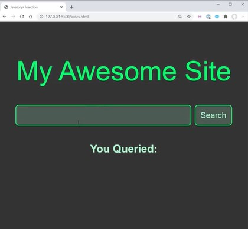
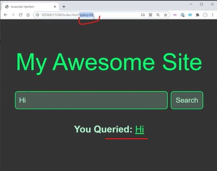
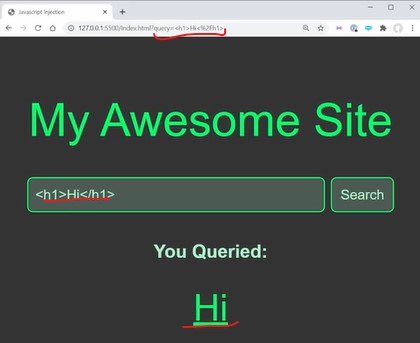
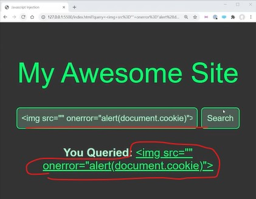

# Cross Site Scripting 

- we'll talk about security within our application specifically XSS (Cross Site Scripting)
    - which is most common issue & easy to avoid security issue inside of applications ✔️✔️✔️

## Example 



- this search bar allows us to search , 
- `STEP 1` : let's say we searched `Hi` then we'll get this output <br>
    
    - so we can see on URL that `query=Hi` & `you queried` will tell what we query <br>
        & google does this a lot in different places
    - & this has a huge security flaw in it like dealing with Cross Site Scripting

- `STEP 2` : let's say we search `<h1>Hi</h1>` then we'll get this output <br>
    
    - so in `You Queried` section , it's actually using `Hi` tag & due to this , we can put `script` tag also
    - `STEP 2.1 ✅` : we searched `<script>alert("Hi")</script>`
        - & when we click on `search` button then alert `Hi` popup will not come & if we inspect the `You Queried` section ,<br>
            then inside that `span` tag we can see exact thing i.e `<script>alert("Hi")</script>` but we're not coming as a output 
        - because if we add a script to a page after the page has been parsed then it doesn't actually run that script

    - but we can fix this issue by using `img` tag
    - `STEP 2.2 ✅` : we searched through img tag instead of `script` tag
        - & `img` tag doesn't have any source will run the `onerror` handler attribute
        - so we searched `` & when we click to `search` button then nothing will happen <br>
            but the movement we define `src` attribute with no path like this `` <br>
            then we'll get our output
        - so it's actually injecting javascript under our page because when an image can't find the source specified <br>
            the it will run on that `onerror` callback & like we can run any JS code 💡💡💡
        - Eg : A website has some cookie information then we can access that cookie <br>
            like this `` & click on search button <br>
            then output will be username & password on alert 💡💡💡
        - so we got the cookie of the user from a website 

    - so we could do is actually send that cookie information to a URL means we could post that to an API <br>
        & due to this we can actually steal people's credentials
        - Eg : we can search i.e `` & send the document.cookie information <br>
            & we called the `postToBadAPI()` function to POST that cookie information to some API that we as a bad hacker <br>

    - we'll not get username & password in the cookies from those websites which are insecure <br>
        but a lot of websites will use i.e `session ID` 💡💡💡
        - `session ID` means 
            - we don't have to `re-login` on that website when every time we navigate to a new page inside the browser 💡💡💡
            - it's like your login information means not the actual login information but we can use it as your login information <br>
                so someone stole that information from you then they could use that as your login information until it expires 💡💡💡 <br>
            - generally they expire pretty quickly but they could still use that information to act on your behalf

        - so it's generally a bad idea to allow these types of cross site scripting errors to occur <br>
            & anytime that you can share a URL & there's a user-generated content on that page <br>
            whether it's a comment that comes from a database <br>
            or a URL which is generated by searching this query `` 
            - doesn't matter from where it's coming from as long as it's actually persisting data that shows up on other people's pages <br>
            
    - `STEP 2.3` : identifying where's the issue 
        - this is a issue which can be easy to avoid for that site to figure out where the error is 
            - so inside script.js file 
                ```js
                const query = new URL(window.location).searchParams.get("query")
                document.getElementById("query-input").value = query // it's a search input box
                document.getElementById("query-output").innerHTML = query // it's a You Queried section
                ```
            - `document.getElementById("query-output").innerHTML` means 
                - inside this line code of we have an issue i.e `innerHTML`
                - by using an `innerHTML` property , we're saying is we want to actually inject HTML into the page <br>
                    & anytime that you're taking a user content & injecting it into the HTML pages <br>
                    then you're opening yourself up for Cross Site scripting 💡💡💡
                - because that HTML could be malicious HTML like this `` <br>
                    which allows the user to actually get to the cookie information to do other things with the user information <br>
                    that you don't want them to do 💡💡💡
                - that's why , unless , you know for 100% that the information that you're saving to the HTML never has any way <br>
                    to be generated by a user & you almost always want to use something like textContent or innerText
                - eg : inside script.js file <br>
                    change this line by using textContent i.e `document.getElementById("query-output").innerHTML = query`
                    - then output we'll get this <br>
                    
                    - so here we're not getting the output & cookies are not coming 
                    - so `` this is queried by the user will be pasted as text <br>
                        means it's not actually converted the search into HTML 💡💡💡

    - `said by kyle ✅`
        - important 🔥

        - so if in your code , you see in our HTML then you need to look at it & think i.e 
            - is there any way that what i am putting in this HTML , <br>
                in any way there's shape or form has information that comes from the user & will show up on other users screens <br>
                so if that's the case , then definitely don't use `innerHTML` property 💡💡💡

        - generally kyle don't use `innerHTML` property unless he really need the information <br>
            entered into it which came from a user input 💡💡💡

        - & another huge security flaw is using a function called `eval()` is interesting because we can pass it a string 
            - eg : `eval(" 2 + 2")` & it's gonna run whatever the string is as if it was JS <br>
                so if we remember we in Math Solver project , we did `2 + 2 - 3` & click `search` button then we'll get 1
            - Eg : inside script.js file , if we use eval() function
                ```js
                const query = new URL(window.location).searchParams.get("query")
                document.getElementById("query-input").value = query 
                document.getElementById("query-output").innerHTML = eval(query) 
                ```
                - output : search `2 + 2 - 3` & click to search button then we'll get 1
            - now we'll think that this is way easier to do that Math Solver Project <br>
                but the problem is `eval()` function runs any code at all like if we search `alert(document.cookie)` & click search button <br>
                then we'll get username & password of that user
            - so never ever use eval() function & there's no reason to use it because it's a bad thing
            - we can use eval() function where it's going to touch user input but we have better options instead of using it 
            
        - these are the most common like innerHTML , eval() function , so using these will lead cross site scripting }
            - But the main thing to think about is anytime you have user input box then you need to take that user input <br>
                & be careful how you actually display & use that user information <br>
            - because bad hacker could be trying to put malicious information into their inputs 💡💡💡

## ----- Extra Stuff on b/w innerHTML & innerText -------

- videos 
    - https://www.youtube.com/watch?v=ILcu32Nkq_I&ab_channel=DaveGray 👍
    - https://www.youtube.com/watch?v=1UsllDMhvN4&ab_channel=dcode
    - https://www.youtube.com/watch?v=Cj7-i-S4TwA&ab_channel=RyanChenkie
    - https://www.youtube.com/shorts/06u4AtF-M04
    - https://www.youtube.com/watch?v=ns1LX6mEvyM&ab_channel=WebDevSimplified
    - https://www.youtube.com/watch?v=1qyHyqpXHRE&ab_channel=KodeBase

## discussion page


