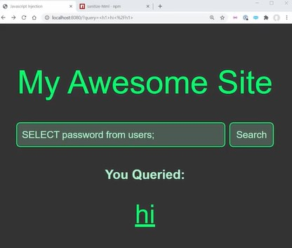

# All your code is public 

- here we'll see private information & how to store it & why it's bad to put private information into our code <br>
    because all of our code is public that's why private information should be store in secure way ✔️✔️✔️

- we'll be using the same search project i.e <br>
    

## Example 

- inside script.js file 
    ```js
    import sanitizeHtml from 'sanitize-html'

    const API_KEY = "ansdklvnwiokfrasjkdpoqw" 

    const query = new URL(window.location).searchParams.get("query")
    document.getElementById("query-input").value = query 
    document.getElementById("query-output").innerHTML = sanitizeHtml(query)
    ```
    - let's say `const API_KEY = "ansdklvnwiokfrasjkdpoqw"` this is a API key which allows us to access a API <br>
        that we can use to get information , but this API key is paid & if we access it we know that maybe more than 5000 times a day <br>
        then they start charging us for accessing because the information they want to store & in free usage only allows 5000 request <br>
        so before they start charging you want to make sure that we access it the least amount of time as possible

    - let's say you have to fetch a URL & you're passing in the API key along with your fetch requests <br>
        kind of like this `fetch("asdasd" , API_KEY)` & so just imagine you're using it to access the API inside of your code <br>
        on the frontend of your application 
        - & this is actually a huge security flaw because all of your code on the frontend , <br>
            every single thing including (HTML + CSS + JS) are on the frontend of your application <br>
            is available for anyone to view by using inspect tool , inside sources tab 💡💡💡
        - & due to this , anyone can see that API_KEY & even anyone can see everything about application <br> 
            that's why you never want to store private information like this 
        - so we want to store private information like `API_KEY` <br>
            & other private information on somewhere that the user can't access 💡💡💡<br>
            & generally this is going to be some type of server (like a could function like lambda) or we can use our own server 💡💡💡

- so let's say we had a new folder
- `STEP 1` : inside the main project folder , create a folder as `server`
    - & this folder will contain those things which are completely separate from our frontend
    - `STEP 1.1` : inside main project folder , create a folder as `client`
        - this folder will contain index.html , package-lock.json , package.json , script.js , styles.css files

    - `STEP 1.2` : inside `server` folder , create a file as server.js file 
        - inside server.js file 
            ```js
            const API_KEY = "ansdklvnwiokfrasjkdpoqw" 
            ```

    - `STEP 1.3` : & now inside script.js file (of client folder) , instead of storing API_KEY inside of it 
        ```js
        import sanitizeHtml from 'sanitize-html'

        fetch("asfasd" , API_KEY)

        const query = new URL(window.location).searchParams.get("query")
        document.getElementById("query-input").value = query 
        document.getElementById("query-output").innerHTML = sanitizeHtml(query)
        ``` 
        - take this fetch() function with these arguments , cut it & paste inside server.js file like this 

    - `STEP 1.4` : inside server.js file , pasting fetch() 
        ```js
        const API_KEY = "ansdklvnwiokfrasjkdpoqw" 

        fetch("asfasd" , API_KEY)
        ```

- now inside script.js file (which is a part of front-end) , so we would allow our front end here to call our server <br>
    now our API_KEY is now no longer exposed on front-end <br>
    & we can only get/communicate that API_KEY by talking to our actual backend server <br> 
    - & whatever code we wrote inside server.js file will not be sent to the front-end <br>
        means it's actually going to be completely hidden from the user expect code of script.js file (which can be seen by the user)
    - & still there's no full security around API_KEY because eventually you're going to store our code somewhere <br>
        & your code isn't only going to be on your computer like maybe you need to share your code with someone else <br>
        or more likely you're going to store your code on github
    - means if you just have your API_KEY in plain written text into your code then that means that anyone has access to your code <br>
        & there's actually bots that are setup that're going to scrape your pages <br>
        & steal your API keys as soon as you commit them to get 💡💡💡
    - so if you ever commit your API keys to get on github then make sure you immediately change them <br>
        because they're completely compromised 💡💡💡
  
- so what you're going to avoid this issue 
- `STEP 2` : inside `server` folder , create a `.env` file
    - & inside that `.env` file , cut that api key from server.js file & paste inside it
        ```
        API_KEY=ansdklvnwiokfrasjkdpoqw
        API_KEY2=sjksdfhjksdhiwjbvjdsbv
        ```
    - now this `.env` file would not commit to github
    - `STEP 2.1` : create `.gitignore` file inside `server` folder
        - inside .gitignore file
            ```
            .env
            ```

    - & now inside server.js file , instead of using API_KEY , we can use `process.env.API_KEY` 💡💡💡
    - `STEP 2.2` inside server.js file 
        ```js
        const API_KEY = process.env.API_KEY
        ```
        - `process.env` will load variables which are in `env` file <br>
            & it doesn't do that by default so that's why we'll use a package i.e `dotenv` like this 💡💡💡
        ```js
        require('dotenv').config()
        const API_KEY = process.env.API_KEY
        ```
        - `Note` : if that API_KEY is paid & if we don't hide it then what if the user use more than a limit 
            - then you need to pay the money for it or what if they could use it to do malicious things 💡💡💡
            - the reason it's really popular to use ENV variables for this because generally when we actually <br>
                deploy your code to a production server they're going to have <br>
                the ability for you to set environment variables on that server & that way we can just take our API keys <br>
                & generally you're going to have like development API key & a production API key <br>
                & we'll have our development API key & `.env` file is for production 

        - right now we'll not go deep about `.env` file & `process.env` because it's covered indepth in further lectures of this module 

- `important thing to understand` : is to make secure the private information & always keep it hidden 
    - & same thing with user information like username , email id , password , etc 
    - never put these info on our code & inside your frontend & if you ever need to store a password of users 
    - then don't store them in plain text means store in hash 
- `hashing the password` means taking that password & running it through some type of algorithm 
    - & that'll covert it to a new value & then you store that new value in your database <br>
        due to this , we don't need to store the user's password as plain text in your database 
    - because if anyone get access to your database & if that database contain sensitive information 
        then try to hide as much as possible & never show those sensitive info publicly & never put on github & frontend also 💡💡💡

## said by kyle

- we'll be creating a weather app project which is going to encompass all 
    - & we'll see indepth about env , communication b/w client & server 
    - & why we never trust information coming from the client 💡💡💡
