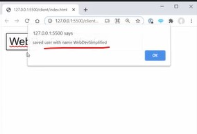
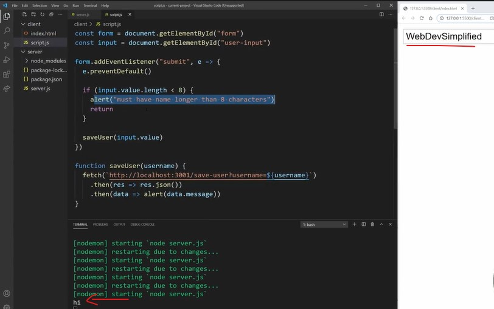
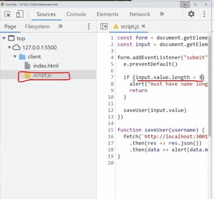

# Never Trust The Client

- here we'll see why we should never trust the client & we need to do this because our code is public

## Files code 

- files & folder structure 
    ```
    client folder
        ⤷ index.html
        ⤷ script.js 
    server folder
        ⤷ node_modules folder
        ⤷ package-lock.json
        ⤷ package.json
        ⤷ server.js
    ```

<details>
    <summary>client folder</summary>

<details>
    <summary>index.html</summary>

```html

```
</details>

<details>
    <summary>script.js</summary>

```js
const form = document.getElementById("form")
const form = document.getElementById("user-input")

form.addEventListener("submit", e => {
    e.preventDefault()

    if (input.value.length < 8) {
        alert("must have name longer than 8 characters")
        return
    }

    saveUser(input.value)
})

function saveUser(username) {
    fetch(`http://localhost:3001/save-user?username=${username}`).then(res => {
        res.json()
    }).then(data => {
        alert(data.message)
    })
}
```
</details>
</details>

<details>
    <summary>server folder</summary>

<details>
    <summary>package.json</summary>

```json

```
</details>

<details>
    <summary>server.js</summary>

```js
const express = require("express")
const cors = require("cors")

const app = express()
app.use(express.json())
app.use(cors())

app.get("/save-user", (req, res) => {
    const username = req.query.username

    res.json({ message: "saved user with name" + username })
})

app.listen(3001)
```
</details>
</details>

## Explanation with Practicals ✅

- inside script.js file (of client folder)
    - we have a single input field & when we submit our form that has input <br>
        then it just checks , do we have a value less than 8 i.e `input.value.length < 8` then throw alert as error <br>
        otherwise save the user & then it'll calls that server i.e `http://localhost:3001/save-user?username=${username}` <br>
        & it sends the username & then it's get the message sent back to us

- & inside server.js file (of server folder)
    - we're giving the username `const username = req.query.username` <br>
        & returning the message i.e `res.json({ message: "saved user with name" + username })`

- we can imagine somewhere inside of here , inside server.js file 
    ```js
    const express = require("express")
    const cors = require("cors")

    const app = express()
    app.use(express.json())
    app.use(cors())

    app.get("/save-user", (req, res) => {
        const username = req.query.username

        // b/w here we're saving info to database (DB)

        res.json({ message: "saved user with name" + username })
    })

    app.listen(3001)
    ```
    - so we're just caring about we're taking the username & save inside the database & then return the user that we save it 

- output : inside the input filed , we wrote `WebDevSimplified` & this is greater than 8 
    - then we'll get this message inside alert like this <br>
    
    - but let's save we wrote `WebDev` which is less than 8 characters & hit enter <br>
        then we'll get alert i.e "must have name longer than 8 characters" <br>
        which means error happened inside script.js file , inside if statement i.e 
        ```js
        if (input.value.length < 8) { 
            alert("must have name longer than 8 characters")
            return
        }
        ```
        - & it never actually went to our server & save on server <br>
            i.e `res.json({ message: "saved user with name" + username })` inside server.js 

- inside server.js file , let's add a console.log()
    ```js
    const express = require("express")
    const cors = require("cors")

    const app = express()
    app.use(express.json())
    app.use(cors())

    app.get("/save-user", (req, res) => {
        const username = req.query.username

        // b/w here we're saving info to database (DB)
        console.log('hi')

        res.json({ message: "saved user with name" + username })
    })

    app.listen(3001)
    ```
    - output : now inside input filed , we write `WebDev` & hit enter then we'll get alert message i.e should be greater then 8 <br>
        & inside terminal we didn't got `hi` message
        - but if we do `WebDevSimplified` message then it actually saves to our server & saves the that user for us <br>
            & we'll get `hi` inside terminal like this 
            
        
    - so we can see that inside script.js file , we're doing simple if check i.e `if (input.value.length < 8)` <br>
        we're just never calling our server if the name is too short 
        - but let's say user is malicious user & he did inspect & go to `sources` tab & open script.js file & change from 8 to 3 like this 
        
        - output : now write `WebDev` & hit enter then we'll get alert message i.e "saved user with name WebDev"<br>
            & inside terminal we got hi
        - even `WebDev` is less than `8` characters & even inside our code `if (input.value.length < 8)` <br>
            but someone just came in & changed it & they can also change the fetch request API with whatever name they wanted <br>
            & even they can bypass all that if check i.e `if (input.value.length < 8)` 
        - & due to this , any user can just completely navigate around our code <br>
            like he open inspect & inside console tab , user wrote i.e `saveUser('John')` which is less than 8 <br>
            but user bypass that if check because he directly calling fetch() request (which is inside script.js file) <br>
            & even `hi` is printed 💡💡💡

- so we can't really trust that the code which is on the client because any user can change the code & they could do whatever they want 
    - so any validation we're doing on internet is just there to be nice information for the normal user <br>
        but for the malicious user trying to break into our site <br>
        then that if check i.e `if (input.value.length < 8)` won't able to do anything 💡💡💡
    - so we need to make sure you validate input on the server like this 
        - inside server.js file (of server folder)
            ```js
            const express = require("express")
            const cors = require("cors")

            const app = express()
            app.use(express.json())
            app.use(cors())

            app.get("/save-user", (req, res) => {
                const username = req.query.username

                if (username.length < 8) { // here we're validating the username length also
                    res.json({ message: 'Nice try hacker'})
                    return // here we return because we don't want to save this username in DB
                }

                // b/w here we're saving info to database (DB)
                console.log('hi')

                res.json({ message: "saved user with name" + username })
            })
            ```
        - output : now inspect that page & inside script.js file , user changed the if (input.value.length < 2) <br>
            & he wrote `WebDevSimplified` so this will work because it pass both the validation 
            - but if he wrote `WebDev` then it will only pass the client validation but not server validation & `hi` doesn't printed
            - because user don't have access of server except client-side

- `Mistake people do ✅` :
    - so here we did the validation on server-side also , so that any user won't able to bypass our code which is on client-side <br>
        & this is super common issue i.e a lot of times people make their client-side validation but on the server-side <br>
        they don't do the validation , so anything is coming from client you can't trust it 💡💡💡
    - so we need to validate & sanitize it & do things to prevent Cross-Site-Scripting + SQL injection <br>
        because code that comes from the client (like any input or value they send you) can be changed by any user <br>
        so we should do the validation & sanitization & any input that comes from client is going through an extra set of validation
    - & do to validation , we can copy that validation from the client & paste inside server also & if we're using Nodejs for backend <br>
        & JS for frontend then validation would be really easy to make these validation changes 💡💡💡
