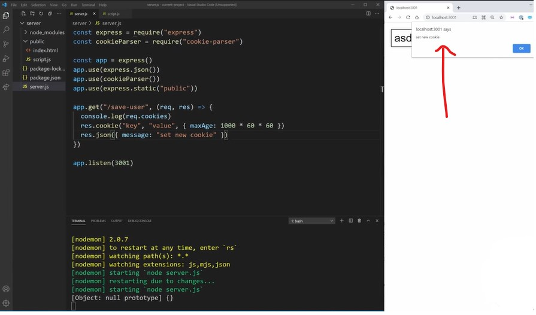
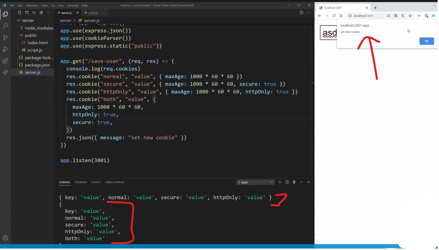
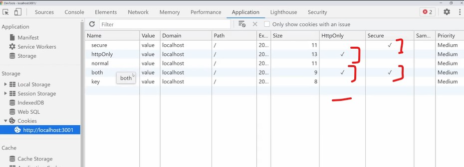

# Cookies

- here we'll talk about client & server side communication specifically with Cookies
    - means how we can add more security/validation around your cookies of the your site ✔️✔️✔️

## Files code 

- files & folder structure 
    ```
    server folder
        ⤷ node_modules folder
        ⤷ public folder
            ⤷ index.html
            ⤷ script.js 
        ⤷ package-lock.json
        ⤷ package.json
        ⤷ server.js
    ```

<details>
    <summary>index.html</summary>

```html
<!DOCTYPE html>
<html lang="en">
<head>
    <meta charset="UTF-8">
    <meta http-equiv="X-UA-Compatible" content="IE=edge">
    <meta name="viewport" content="width=device-width, initial-scale=1.0">
    <script src="script.js" defer></script>
</head>
<body>
    <form id="form">
        <input type="text" id="user-input">
    </form>
</body>
</html>
```
</details>

<details>
    <summary>script.js</summary>

```js
const form = document.getElementById("form")
const input = document.getElementById("user-input")

form.addEventListener('submit', e => {
    e.preventDefault()

    if (input.value.length < 8) {
        alert("must have name longer than 8 characters")
        return
    }

    saveUser(input.value)
})

function saveUser(username) {
    fetch(`http://localhost:3001/save-user?username=${username}`).then(res => {
        res.json()
    }).then(data => alert(data.message))
}
```
</details>

<details>
    <summary>server.js</summary>

```js
const express = require('express')
const cookieParser = require('cookie-parser')

const app = express()
app.user(express.json())
app.user(cookieParser())
app.use(express.static("public"))

app.get("/save-user", (req, res) => {
    console.log(req.cookies)
    res.cookie("key", "value", {maxAge: 1000 * 60 * 60})
    res.json({ message: "set new cookie" })
})

app.listen(3001)
```
</details>

## explanation - security with cookies

- `why running stuff in same URL/port is important for Cookies`
    - so we moved the index.html & script.js file into the actual server.js file , so they run on the exact same URL
        - & inside server.js file , our server is running on port 3001 i.e `app.listen(3001)`
        - & our application also running localhost:3001 is running on the same port

    - this is just make doing Cookies easier because cookies generally are all going to be one the same domain <br>
        they don't have to be but generally they will be 

- inside server.js file , we can see `console.log(req.cookies)` we're logging out the cookies <br>
    that come up with the request because cookies work two ways & you can set them on the client <br>
    & cookies gonna be communicated back & forth b/w client & server 
    - but we can also set them on the server & tell the client what the cookies should be <br>
        means we call tell client-side that what your cookies should be from the server <br>
        or on the client you can actually set the cookies yourself 💡💡💡

    - here `res.cookie("key", "value", {maxAge: 1000 * 60 * 60})` , we're setting a cookie on our server <br>
        & saying , make the client set this cookie & then we're just retuning some JSON i.e `res.json({ message: "set new cookie" })`

- output : if we write something like `xcmnbajkwdvzxjkcnvjkwsnzxn` & hit enter then we'll get the alert with message like this <br>
    
    - so inside the terminal , we can see that no cookies being passed up to the server because we had no cookies 
        - but we can see that we set a cookie with this response i.e `res.cookie("key", "value", {maxAge: 1000 * 60 * 60})` <br>
            so the next time we make a request , then we'll have this cookie available <br>
            i.e `res.cookie("key", "value", {maxAge: 1000 * 60 * 60})`
        - & then we hit enter again inside input field with that text , then inside the terminal , we'll get `{ key: 'value'}` <br>
            so it sent key & value which is the cookie that we created i.e `res.cookie("key", "value", {maxAge: 1000 * 60 * 60})`

- `Imp Note : inside Application tab , inside Cookies section ✅`
    - so select http://localhost:3001 this , we can see these columns 
    
    - so important columns is `HttpOnly` & `Secure` 💡💡💡
    - `Secure` means that cookie can only be accessible from a secure website i.e https websites
        - means that only accessible by the server & you can't actually access the cookie inside the JS 💡💡💡

- Eg : inside server.js file , let's create different types of cookies
    ```js
    const express = require('express')
    const cookieParser = require('cookie-parser')

    const app = express()
    app.user(express.json())
    app.user(cookieParser())
    app.use(express.static("public"))

    app.get("/save-user", (req, res) => {
        console.log(req.cookies)
        res.cookie("normal", "value", {maxAge: 1000 * 60 * 60})
        res.cookie("secure", "value", {maxAge: 1000 * 60 * 60 , secure: true})
        // h - should be small of httpOnly key
        res.cookie("httpOnly", "value", {maxAge: 1000 * 60 * 60 , httpOnly: true}) 
        // both - means httpOnly & secure also
        res.cookie("both", "value", {maxAge: 1000 * 60 * 60 , secure: true, httpOnly: true}) 
        res.json({ message: "set new cookie" })
    })

    app.listen(3001)
    ```
    - output : save the file & we're gonna set all of these different cookies when we make a request
        - write this `xcmnbajkwdvzxjkcnvjkwsnzxn` inside input tab & hit enter
        
        - now we can see we have all of our cookie information which all set on the server
        - & inspect that page , inside Application tab, inside cookies section , click on that localhost server <br>
            & then we'll get all the cookies like this 
        
        - so `httpOnly` key is marked as HttpOnly & `secure` key is marked as `Secure` but `both` is marked as HttpOnly & Secure <br>
            delete that `key` key by selecting it & click on cross `X` above 

    - now we want to print out cookies on our client-side
    - inside script.js file , 
        ```js
        const form = document.getElementById("form")
        const input = document.getElementById("user-input")

        form.addEventListener('submit', e => {
            e.preventDefault()

            if (input.value.length < 8) {
                alert("must have name longer than 8 characters")
                return
            }

            console.log(document.cookie)

            saveUser(input.value)
        })

        function saveUser(username) {
            fetch(`http://localhost:3001/save-user?username=${username}`).then(res => {
                res.json()
            }).then(data => alert(data.message))
        }
        ```
        - output : save the file & inside input field write something & hit enter & click `ok` button of alert() 
            - then inspect & inside `console` tab , we can see `normal=value; secure=value` <br> 
                so here `normal` & `secure` cookies printed out but `httpOnly` & `both` cookie didn't coming
            - because any cookie which is labeled as HttpOnly then that cookie is only accessible on the server <br>  
                so it's stored inside `Cookies` section of Application tab when we're debugging <br> 
                but let's say somehow your site was hacked & someone got access to your cookies <br>
                then they can't see your HttpOnly cookies & they can only see the cookies that not httpOnly 💡💡💡

        - so if you have something like a session ID or something that you need to be secure <br>
            then storing it as httpOnly means it'll only communicate back & forth b/w the server & the client <br>
            & even if your site is hacked through cross site scripting or anything else <br>
            then there's no way that hackers to get those httpOnly cookies 💡💡💡

        - `HttpOnly` cookie : so if you gonna be storing something like a JSON web token or like authentication information <br>
            then stored in an HttpOnly cookie & due to this , even if your website get hacked then <br>
            hacker can't access those information 💡💡💡
        - `secure` cookie : means only work on a website that uses https  
            - so this is great thing to make all your cookies secure bydefault because we should be using a secure website 💡💡💡

## said by kyle

- any cookie that we don't want on client side then make them as httpOnly & due to this we don't need to expose it accidentally
- `Secure` is always a good thing to have because we want to make cookies are secure

- when we're doing communication b/w server & client then use `HttpOnly` should be set as true & `Secure` also set as true <br>
    because really local storage & session storage are much better if we don't need to communicate with a server 💡💡💡
