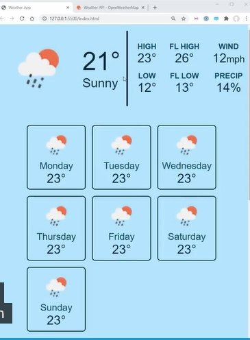
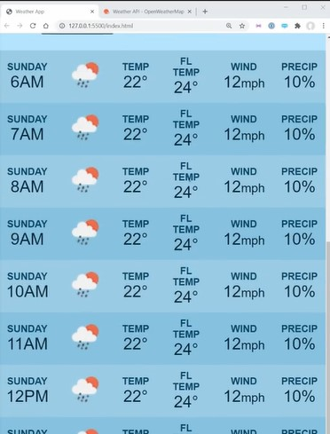

# Weather App Project 

- here all the stater & complete codes included 

## starter code 

<details>
    <summary>index.html</summary>

```html
<!DOCTYPE html>
<html lang="en">
<head>
  <meta charset="UTF-8">
  <meta http-equiv="X-UA-Compatible" content="IE=edge">
  <meta name="viewport" content="width=device-width, initial-scale=1.0">
  <link rel="stylesheet" href="styles.css">
  <title>Weather App</title>
</head>
<body class="blurred">
  <header class="header">
    <div class="header-left">
      
      <div class="header-left-details">
        <div class="header-current-temp">21&deg;</div>
        <div class="header-current-description">Sunny</div>
      </div>
    </div>
    <div class="header-right">
      <div class="info-group">
        <div class="label">High</div>
        <div>23&deg;</div>
      </div>
      <div class="info-group">
        <div class="label">FL High</div>
        <div>26&deg;</div>
      </div>
      <div class="info-group">
        <div class="label">Wind</div>
        <div>12<span class="value-sub-info">mph</span></div>
      </div>
      <div class="info-group">
        <div class="label">LOW</div>
        <div>12&deg;</div>
      </div>
      <div class="info-group">
        <div class="label">FL Low</div>
        <div>13&deg;</div>
      </div>
      <div class="info-group">
        <div class="label">Precip</div>
        <div>14%</div>
      </div>
    </div>
  </header>
  <section class="day-section">
    <div class="day-card">
      
      <div class="day-card-date">Monday</div>
      <div>23&deg;</div>
    </div>
    <div class="day-card">
      
      <div class="day-card-date">Tuesday</div>
      <div>23&deg;</div>
    </div>
    <div class="day-card">
      
      <div class="day-card-date">Wednesday</div>
      <div>23&deg;</div>
    </div>
    <div class="day-card">
      
      <div class="day-card-date">Thursday</div>
      <div>23&deg;</div>
    </div>
    <div class="day-card">
      
      <div class="day-card-date">Friday</div>
      <div>23&deg;</div>
    </div>
    <div class="day-card">
      
      <div class="day-card-date">Saturday</div>
      <div>23&deg;</div>
    </div>
    <div class="day-card">
      
      <div class="day-card-date">Sunday</div>
      <div>23&deg;</div>
    </div>
  </section>
  <table class="hour-section">
    <tbody>
      <tr class="hour-row">
        <td>
          <div class="info-group">
            <div class="label">Sunday</div>
            <div>6AM</div>
          </div>
        </td>
        <td>
          
        </td>
        <td>
          <div class="info-group">
            <div class="label">TEMP</div>
            <div>22&deg;</div>
          </div>
        </td>
        <td>
          <div class="info-group">
            <div class="label">FL TEMP</div>
            <div>24&deg;</div>
          </div>
        </td>
        <td>
          <div class="info-group">
            <div class="label">WIND</div>
            <div>12<span class="value-sub-info">mph</span></div>
          </div>
        </td>
        <td>
          <div class="info-group">
            <div class="label">PRECIP</div>
            <div>10%</div>
          </div>
        </td>
      </tr>
      <tr class="hour-row">
        <td>
          <div class="info-group">
            <div class="label">Sunday</div>
            <div>7AM</div>
          </div>
        </td>
        <td>
          
        </td>
        <td>
          <div class="info-group">
            <div class="label">TEMP</div>
            <div>22&deg;</div>
          </div>
        </td>
        <td>
          <div class="info-group">
            <div class="label">FL TEMP</div>
            <div>24&deg;</div>
          </div>
        </td>
        <td>
          <div class="info-group">
            <div class="label">WIND</div>
            <div>12<span class="value-sub-info">mph</span></div>
          </div>
        </td>
        <td>
          <div class="info-group">
            <div class="label">PRECIP</div>
            <div>10%</div>
          </div>
        </td>
      </tr>
      <tr class="hour-row">
        <td>
          <div class="info-group">
            <div class="label">Sunday</div>
            <div>8AM</div>
          </div>
        </td>
        <td>
          
        </td>
        <td>
          <div class="info-group">
            <div class="label">TEMP</div>
            <div>22&deg;</div>
          </div>
        </td>
        <td>
          <div class="info-group">
            <div class="label">FL TEMP</div>
            <div>24&deg;</div>
          </div>
        </td>
        <td>
          <div class="info-group">
            <div class="label">WIND</div>
            <div>12<span class="value-sub-info">mph</span></div>
          </div>
        </td>
        <td>
          <div class="info-group">
            <div class="label">PRECIP</div>
            <div>10%</div>
          </div>
        </td>
      </tr>
      <tr class="hour-row">
        <td>
          <div class="info-group">
            <div class="label">Sunday</div>
            <div>9AM</div>
          </div>
        </td>
        <td>
          
        </td>
        <td>
          <div class="info-group">
            <div class="label">TEMP</div>
            <div>22&deg;</div>
          </div>
        </td>
        <td>
          <div class="info-group">
            <div class="label">FL TEMP</div>
            <div>24&deg;</div>
          </div>
        </td>
        <td>
          <div class="info-group">
            <div class="label">WIND</div>
            <div>12<span class="value-sub-info">mph</span></div>
          </div>
        </td>
        <td>
          <div class="info-group">
            <div class="label">PRECIP</div>
            <div>10%</div>
          </div>
        </td>
      </tr>
      <tr class="hour-row">
        <td>
          <div class="info-group">
            <div class="label">Sunday</div>
            <div>10AM</div>
          </div>
        </td>
        <td>
          
        </td>
        <td>
          <div class="info-group">
            <div class="label">TEMP</div>
            <div>22&deg;</div>
          </div>
        </td>
        <td>
          <div class="info-group">
            <div class="label">FL TEMP</div>
            <div>24&deg;</div>
          </div>
        </td>
        <td>
          <div class="info-group">
            <div class="label">WIND</div>
            <div>12<span class="value-sub-info">mph</span></div>
          </div>
        </td>
        <td>
          <div class="info-group">
            <div class="label">PRECIP</div>
            <div>10%</div>
          </div>
        </td>
      </tr>
      <tr class="hour-row">
        <td>
          <div class="info-group">
            <div class="label">Sunday</div>
            <div>11AM</div>
          </div>
        </td>
        <td>
          
        </td>
        <td>
          <div class="info-group">
            <div class="label">TEMP</div>
            <div>22&deg;</div>
          </div>
        </td>
        <td>
          <div class="info-group">
            <div class="label">FL TEMP</div>
            <div>24&deg;</div>
          </div>
        </td>
        <td>
          <div class="info-group">
            <div class="label">WIND</div>
            <div>12<span class="value-sub-info">mph</span></div>
          </div>
        </td>
        <td>
          <div class="info-group">
            <div class="label">PRECIP</div>
            <div>10%</div>
          </div>
        </td>
      </tr>
      <tr class="hour-row">
        <td>
          <div class="info-group">
            <div class="label">Sunday</div>
            <div>12PM</div>
          </div>
        </td>
        <td>
          
        </td>
        <td>
          <div class="info-group">
            <div class="label">TEMP</div>
            <div>22&deg;</div>
          </div>
        </td>
        <td>
          <div class="info-group">
            <div class="label">FL TEMP</div>
            <div>24&deg;</div>
          </div>
        </td>
        <td>
          <div class="info-group">
            <div class="label">WIND</div>
            <div>12<span class="value-sub-info">mph</span></div>
          </div>
        </td>
        <td>
          <div class="info-group">
            <div class="label">PRECIP</div>
            <div>10%</div>
          </div>
        </td>
      </tr>
      <tr class="hour-row">
        <td>
          <div class="info-group">
            <div class="label">Sunday</div>
            <div>1PM</div>
          </div>
        </td>
        <td>
          
        </td>
        <td>
          <div class="info-group">
            <div class="label">TEMP</div>
            <div>22&deg;</div>
          </div>
        </td>
        <td>
          <div class="info-group">
            <div class="label">FL TEMP</div>
            <div>24&deg;</div>
          </div>
        </td>
        <td>
          <div class="info-group">
            <div class="label">WIND</div>
            <div>12<span class="value-sub-info">mph</span></div>
          </div>
        </td>
        <td>
          <div class="info-group">
            <div class="label">PRECIP</div>
            <div>10%</div>
          </div>
        </td>
      </tr>
    </tbody>
  </table>
</body>
</html>
```
</details>

<details>
    <summary>styles.css</summary>

```css
*, *::after, *::before {
  box-sizing: border-box;
}

body {
  margin: 0;
  background-color: hsl(200, 100%, 85%);
  color: hsl(200, 100%, 10%);
  font-family: sans-serif;
}

.blurred {
  filter: blur(3px);
}

.header {
  display: flex;
  align-items: center;
}

.header-current-temp {
  font-size: 2rem;
}

.header-current-description {
  text-transform: capitalize;
}

.header-left-details {
  margin-left: 1rem;
}

.header-left {
  display: flex;
  align-items: center;
  justify-content: center;
  width: 50%;
  margin: .5rem;
  padding: .5rem;
  border-right: 2px solid hsl(200, 100%, 10%);
}

.header-right {
  display: grid;
  width: 50%;
  justify-content: space-around;
  gap: .5rem;
  grid-template-columns: repeat(3, auto);
  grid-template-rows: repeat(2, auto);
}

.weather-icon {
  width: 40px;
  height: 40px;
  object-fit: none;
}

.weather-icon.large {
  width: 80px;
  height: 80px;
  object-fit: none;
}

.info-group {
  display: flex;
  flex-direction: column;
  align-items: center;
}

.label {
  text-transform: uppercase;
  font-weight: bold;
  font-size: .6rem;
  color: hsl(200, 100%, 20%)
}

.value-sub-info {
  font-weight: lighter;
  font-size: .75rem;
}

.day-section {
  display: grid;
  grid-template-columns: repeat(auto-fit, 75px);
  gap: .5rem;
  justify-content: center;
  flex-wrap: wrap;
  padding: 1rem;
}

.day-card-date {
  font-size: .75rem;
  color: hsl(200, 100%, 20%)
}

.day-card {
  display: flex;
  flex-direction: column;
  align-items: center;
  border: 1px solid hsl(200, 100%, 10%);
  border-radius: .25rem;
  padding: .25rem;
}

.hour-section {
  width: 100%;
  text-align: center;
  border-spacing: 0;
}

.hour-row {
  background-color: hsl(200, 60%, 75%);
}

.hour-row:nth-child(2n) {
  background-color: hsl(200, 60%, 70%);
}

.hour-row > td {
  padding: .25rem .5rem;
}
```
</details>

<details>
    <summary>example.json</summary>

```json
{"lat":51.5074,"lon":-0.1278,"timezone":"Europe/London","timezone_offset":0,"current":{"dt":1615821604,"sunrise":1615788868,"sunset":1615831467,"temp":50.25,"feels_like":44.1,"pressure":1022,"humidity":76,"dew_point":43,"uvi":0.85,"clouds":90,"visibility":10000,"wind_speed":8.05,"wind_deg":300,"weather":[{"id":804,"main":"Clouds","description":"overcast clouds","icon":"04d"}]},"hourly":[{"dt":1615820400,"temp":50.25,"feels_like":41.99,"pressure":1022,"humidity":76,"dew_point":43,"uvi":0.85,"clouds":90,"visibility":10000,"wind_speed":11.79,"wind_deg":319,"wind_gust":18.19,"weather":[{"id":804,"main":"Clouds","description":"overcast clouds","icon":"04d"}],"pop":0.38},{"dt":1615824000,"temp":51.49,"feels_like":43.18,"pressure":1022,"humidity":65,"dew_point":40.14,"uvi":0.32,"clouds":77,"visibility":10000,"wind_speed":10.87,"wind_deg":329,"wind_gust":18.05,"weather":[{"id":803,"main":"Clouds","description":"broken clouds","icon":"04d"}],"pop":0.38},{"dt":1615827600,"temp":51.66,"feels_like":43.92,"pressure":1022,"humidity":61,"dew_point":38.66,"uvi":0.1,"clouds":68,"visibility":10000,"wind_speed":9.35,"wind_deg":338,"wind_gust":16.44,"weather":[{"id":803,"main":"Clouds","description":"broken clouds","icon":"04d"}],"pop":0.38},{"dt":1615831200,"temp":50.38,"feels_like":44.13,"pressure":1023,"humidity":63,"dew_point":38.28,"uvi":0,"clouds":61,"visibility":10000,"wind_speed":6.58,"wind_deg":348,"wind_gust":13.24,"weather":[{"id":803,"main":"Clouds","description":"broken clouds","icon":"04d"}],"pop":0.38},{"dt":1615834800,"temp":50.16,"feels_like":44.37,"pressure":1024,"humidity":63,"dew_point":38.07,"uvi":0,"clouds":100,"visibility":10000,"wind_speed":5.7,"wind_deg":351,"wind_gust":11.56,"weather":[{"id":804,"main":"Clouds","description":"overcast clouds","icon":"04n"}],"pop":0},{"dt":1615838400,"temp":48.99,"feels_like":43.88,"pressure":1025,"humidity":64,"dew_point":37.67,"uvi":0,"clouds":100,"visibility":10000,"wind_speed":4.27,"wind_deg":347,"wind_gust":9.55,"weather":[{"id":804,"main":"Clouds","description":"overcast clouds","icon":"04n"}],"pop":0},{"dt":1615842000,"temp":47.95,"feels_like":42.85,"pressure":1026,"humidity":67,"dew_point":37.6,"uvi":0,"clouds":98,"visibility":10000,"wind_speed":4.27,"wind_deg":336,"wind_gust":8.59,"weather":[{"id":804,"main":"Clouds","description":"overcast clouds","icon":"04n"}],"pop":0},{"dt":1615845600,"temp":47.39,"feels_like":42.48,"pressure":1026,"humidity":69,"dew_point":37.94,"uvi":0,"clouds":98,"visibility":10000,"wind_speed":4.03,"wind_deg":333,"wind_gust":7.99,"weather":[{"id":804,"main":"Clouds","description":"overcast clouds","icon":"04n"}],"pop":0},{"dt":1615849200,"temp":46.9,"feels_like":42.08,"pressure":1026,"humidity":71,"dew_point":38.1,"uvi":0,"clouds":98,"visibility":10000,"wind_speed":3.96,"wind_deg":331,"wind_gust":7.7,"weather":[{"id":804,"main":"Clouds","description":"overcast clouds","icon":"04n"}],"pop":0},{"dt":1615852800,"temp":46.06,"feels_like":41.18,"pressure":1026,"humidity":74,"dew_point":38.28,"uvi":0,"clouds":98,"visibility":10000,"wind_speed":4.12,"wind_deg":317,"wind_gust":8.48,"weather":[{"id":804,"main":"Clouds","description":"overcast clouds","icon":"04n"}],"pop":0},{"dt":1615856400,"temp":45.54,"feels_like":40.39,"pressure":1026,"humidity":76,"dew_point":38.35,"uvi":0,"clouds":93,"visibility":10000,"wind_speed":4.65,"wind_deg":308,"wind_gust":10.02,"weather":[{"id":804,"main":"Clouds","description":"overcast clouds","icon":"04n"}],"pop":0},{"dt":1615860000,"temp":44.98,"feels_like":39.88,"pressure":1027,"humidity":76,"dew_point":38.07,"uvi":0,"clouds":93,"visibility":10000,"wind_speed":4.38,"wind_deg":307,"wind_gust":10.02,"weather":[{"id":804,"main":"Clouds","description":"overcast clouds","icon":"04n"}],"pop":0},{"dt":1615863600,"temp":44.87,"feels_like":39.67,"pressure":1026,"humidity":76,"dew_point":37.72,"uvi":0,"clouds":95,"visibility":10000,"wind_speed":4.54,"wind_deg":295,"wind_gust":10.07,"weather":[{"id":804,"main":"Clouds","description":"overcast clouds","icon":"04n"}],"pop":0},{"dt":1615867200,"temp":45.19,"feels_like":39.54,"pressure":1026,"humidity":75,"dew_point":37.72,"uvi":0,"clouds":96,"visibility":10000,"wind_speed":5.35,"wind_deg":298,"wind_gust":11.48,"weather":[{"id":804,"main":"Clouds","description":"overcast clouds","icon":"04n"}],"pop":0.08},{"dt":1615870800,"temp":44.92,"feels_like":39.51,"pressure":1026,"humidity":79,"dew_point":38.82,"uvi":0,"clouds":97,"visibility":10000,"wind_speed":5.28,"wind_deg":285,"wind_gust":10.87,"weather":[{"id":500,"main":"Rain","description":"light rain","icon":"10n"}],"pop":0.32,"rain":{"1h":0.19}},{"dt":1615874400,"temp":44.73,"feels_like":39.85,"pressure":1026,"humidity":83,"dew_point":40.05,"uvi":0,"clouds":97,"visibility":10000,"wind_speed":4.68,"wind_deg":276,"wind_gust":9.31,"weather":[{"id":500,"main":"Rain","description":"light rain","icon":"10n"}],"pop":0.33,"rain":{"1h":0.28}},{"dt":1615878000,"temp":44.82,"feels_like":40.01,"pressure":1027,"humidity":84,"dew_point":40.26,"uvi":0.02,"clouds":100,"visibility":10000,"wind_speed":4.7,"wind_deg":263,"wind_gust":9.66,"weather":[{"id":500,"main":"Rain","description":"light rain","icon":"10d"}],"pop":0.9,"rain":{"1h":0.28}},{"dt":1615881600,"temp":45.23,"feels_like":40.28,"pressure":1027,"humidity":83,"dew_point":40.5,"uvi":0.07,"clouds":100,"visibility":10000,"wind_speed":4.97,"wind_deg":265,"wind_gust":11.03,"weather":[{"id":500,"main":"Rain","description":"light rain","icon":"10d"}],"pop":0.84,"rain":{"1h":0.13}},{"dt":1615885200,"temp":45.99,"feels_like":40.84,"pressure":1027,"humidity":83,"dew_point":41.16,"uvi":0.16,"clouds":100,"visibility":10000,"wind_speed":5.59,"wind_deg":268,"wind_gust":15.41,"weather":[{"id":500,"main":"Rain","description":"light rain","icon":"10d"}],"pop":0.66,"rain":{"1h":0.12}},{"dt":1615888800,"temp":47.3,"feels_like":43.34,"pressure":1027,"humidity":87,"dew_point":43.65,"uvi":0.53,"clouds":100,"visibility":10000,"wind_speed":4.43,"wind_deg":281,"wind_gust":19.3,"weather":[{"id":804,"main":"Clouds","description":"overcast clouds","icon":"04d"}],"pop":0.66},{"dt":1615892400,"temp":54.21,"feels_like":47.68,"pressure":1027,"humidity":68,"dew_point":43.74,"uvi":0.7,"clouds":95,"visibility":10000,"wind_speed":9.08,"wind_deg":321,"wind_gust":17.43,"weather":[{"id":804,"main":"Clouds","description":"overcast clouds","icon":"04d"}],"pop":0.58},{"dt":1615896000,"temp":55.65,"feels_like":48.16,"pressure":1027,"humidity":63,"dew_point":43.29,"uvi":0.77,"clouds":95,"visibility":10000,"wind_speed":10.54,"wind_deg":324,"wind_gust":16.98,"weather":[{"id":804,"main":"Clouds","description":"overcast clouds","icon":"04d"}],"pop":0.58},{"dt":1615899600,"temp":54.07,"feels_like":46.71,"pressure":1027,"humidity":70,"dew_point":44.38,"uvi":0.79,"clouds":99,"visibility":10000,"wind_speed":10.8,"wind_deg":325,"wind_gust":18.37,"weather":[{"id":804,"main":"Clouds","description":"overcast clouds","icon":"04d"}],"pop":0.14},{"dt":1615903200,"temp":53.15,"feels_like":46.45,"pressure":1027,"humidity":74,"dew_point":45.01,"uvi":0.61,"clouds":100,"visibility":10000,"wind_speed":9.84,"wind_deg":322,"wind_gust":17.72,"weather":[{"id":804,"main":"Clouds","description":"overcast clouds","icon":"04d"}],"pop":0.06},{"dt":1615906800,"temp":54.68,"feels_like":47.79,"pressure":1027,"humidity":70,"dew_point":45.25,"uvi":0.38,"clouds":88,"visibility":10000,"wind_speed":10.2,"wind_deg":332,"wind_gust":17.11,"weather":[{"id":804,"main":"Clouds","description":"overcast clouds","icon":"04d"}],"pop":0.02},{"dt":1615910400,"temp":54.52,"feels_like":48.56,"pressure":1027,"humidity":72,"dew_point":45.77,"uvi":0.5,"clouds":90,"visibility":10000,"wind_speed":8.79,"wind_deg":334,"wind_gust":17.43,"weather":[{"id":804,"main":"Clouds","description":"overcast clouds","icon":"04d"}],"pop":0},{"dt":1615914000,"temp":53.89,"feels_like":49.68,"pressure":1028,"humidity":77,"dew_point":47.05,"uvi":0.15,"clouds":92,"visibility":10000,"wind_speed":6.2,"wind_deg":333,"wind_gust":17.29,"weather":[{"id":804,"main":"Clouds","description":"overcast clouds","icon":"04d"}],"pop":0},{"dt":1615917600,"temp":53.19,"feels_like":49.53,"pressure":1029,"humidity":82,"dew_point":47.86,"uvi":0,"clouds":93,"visibility":10000,"wind_speed":5.61,"wind_deg":343,"wind_gust":18.61,"weather":[{"id":804,"main":"Clouds","description":"overcast clouds","icon":"04d"}],"pop":0},{"dt":1615921200,"temp":52.59,"feels_like":49.17,"pressure":1030,"humidity":84,"dew_point":48.11,"uvi":0,"clouds":100,"visibility":10000,"wind_speed":5.23,"wind_deg":342,"wind_gust":19.01,"weather":[{"id":500,"main":"Rain","description":"light rain","icon":"10n"}],"pop":0.4,"rain":{"1h":0.16}},{"dt":1615924800,"temp":51.73,"feels_like":46.17,"pressure":1031,"humidity":85,"dew_point":47.41,"uvi":0,"clouds":99,"visibility":10000,"wind_speed":8.81,"wind_deg":2,"wind_gust":20.33,"weather":[{"id":804,"main":"Clouds","description":"overcast clouds","icon":"04n"}],"pop":0.24},{"dt":1615928400,"temp":48.92,"feels_like":40.24,"pressure":1031,"humidity":73,"dew_point":40.73,"uvi":0,"clouds":98,"visibility":10000,"wind_speed":11.7,"wind_deg":11,"wind_gust":23.8,"weather":[{"id":804,"main":"Clouds","description":"overcast clouds","icon":"04n"}],"pop":0.12},{"dt":1615932000,"temp":46.87,"feels_like":38.25,"pressure":1032,"humidity":68,"dew_point":36.88,"uvi":0,"clouds":73,"visibility":10000,"wind_speed":10.36,"wind_deg":9,"wind_gust":26.91,"weather":[{"id":803,"main":"Clouds","description":"broken clouds","icon":"04n"}],"pop":0},{"dt":1615935600,"temp":45.66,"feels_like":37.22,"pressure":1033,"humidity":66,"dew_point":35.11,"uvi":0,"clouds":58,"visibility":10000,"wind_speed":9.44,"wind_deg":6,"wind_gust":26.37,"weather":[{"id":803,"main":"Clouds","description":"broken clouds","icon":"04n"}],"pop":0},{"dt":1615939200,"temp":45.21,"feels_like":36.75,"pressure":1033,"humidity":65,"dew_point":34.29,"uvi":0,"clouds":49,"visibility":10000,"wind_speed":9.26,"wind_deg":2,"wind_gust":25.88,"weather":[{"id":802,"main":"Clouds","description":"scattered clouds","icon":"03n"}],"pop":0},{"dt":1615942800,"temp":44.74,"feels_like":36.3,"pressure":1033,"humidity":66,"dew_point":34.25,"uvi":0,"clouds":0,"visibility":10000,"wind_speed":9.22,"wind_deg":360,"wind_gust":25.19,"weather":[{"id":800,"main":"Clear","description":"clear sky","icon":"01n"}],"pop":0},{"dt":1615946400,"temp":44.33,"feels_like":36.32,"pressure":1033,"humidity":69,"dew_point":34.83,"uvi":0,"clouds":8,"visibility":10000,"wind_speed":8.66,"wind_deg":355,"wind_gust":23.85,"weather":[{"id":800,"main":"Clear","description":"clear sky","icon":"01n"}],"pop":0},{"dt":1615950000,"temp":44.1,"feels_like":36.28,"pressure":1033,"humidity":69,"dew_point":34.74,"uvi":0,"clouds":39,"visibility":10000,"wind_speed":8.23,"wind_deg":348,"wind_gust":22.44,"weather":[{"id":802,"main":"Clouds","description":"scattered clouds","icon":"03n"}],"pop":0},{"dt":1615953600,"temp":44.08,"feels_like":36.61,"pressure":1033,"humidity":69,"dew_point":34.77,"uvi":0,"clouds":54,"visibility":10000,"wind_speed":7.63,"wind_deg":341,"wind_gust":21.27,"weather":[{"id":803,"main":"Clouds","description":"broken clouds","icon":"04n"}],"pop":0},{"dt":1615957200,"temp":43.38,"feels_like":36.43,"pressure":1033,"humidity":72,"dew_point":34.92,"uvi":0,"clouds":63,"visibility":10000,"wind_speed":6.8,"wind_deg":335,"wind_gust":20.11,"weather":[{"id":803,"main":"Clouds","description":"broken clouds","icon":"04n"}],"pop":0},{"dt":1615960800,"temp":43.05,"feels_like":36.32,"pressure":1032,"humidity":73,"dew_point":34.95,"uvi":0,"clouds":69,"visibility":10000,"wind_speed":6.44,"wind_deg":325,"wind_gust":16.62,"weather":[{"id":803,"main":"Clouds","description":"broken clouds","icon":"04n"}],"pop":0},{"dt":1615964400,"temp":44.11,"feels_like":36.18,"pressure":1033,"humidity":70,"dew_point":35.01,"uvi":0.15,"clouds":99,"visibility":10000,"wind_speed":8.57,"wind_deg":332,"wind_gust":19.55,"weather":[{"id":804,"main":"Clouds","description":"overcast clouds","icon":"04d"}],"pop":0},{"dt":1615968000,"temp":45.43,"feels_like":36.48,"pressure":1033,"humidity":69,"dew_point":35.8,"uvi":0.48,"clouds":100,"visibility":10000,"wind_speed":10.63,"wind_deg":346,"wind_gust":23.6,"weather":[{"id":804,"main":"Clouds","description":"overcast clouds","icon":"04d"}],"pop":0},{"dt":1615971600,"temp":47.3,"feels_like":36.75,"pressure":1033,"humidity":59,"dew_point":33.73,"uvi":1.04,"clouds":99,"visibility":10000,"wind_speed":12.84,"wind_deg":356,"wind_gust":26.6,"weather":[{"id":804,"main":"Clouds","description":"overcast clouds","icon":"04d"}],"pop":0},{"dt":1615975200,"temp":48.92,"feels_like":37.65,"pressure":1034,"humidity":55,"dew_point":33.66,"uvi":1.83,"clouds":81,"visibility":10000,"wind_speed":14.05,"wind_deg":2,"wind_gust":26.64,"weather":[{"id":803,"main":"Clouds","description":"broken clouds","icon":"04d"}],"pop":0},{"dt":1615978800,"temp":50.18,"feels_like":39.2,"pressure":1033,"humidity":55,"dew_point":34.59,"uvi":2.4,"clouds":66,"visibility":10000,"wind_speed":13.87,"wind_deg":4,"wind_gust":23.55,"weather":[{"id":803,"main":"Clouds","description":"broken clouds","icon":"04d"}],"pop":0},{"dt":1615982400,"temp":50.4,"feels_like":39.43,"pressure":1033,"humidity":54,"dew_point":34.57,"uvi":2.64,"clouds":68,"visibility":10000,"wind_speed":13.78,"wind_deg":4,"wind_gust":23.38,"weather":[{"id":803,"main":"Clouds","description":"broken clouds","icon":"04d"}],"pop":0},{"dt":1615986000,"temp":50.88,"feels_like":39.87,"pressure":1033,"humidity":52,"dew_point":33.91,"uvi":2.16,"clouds":90,"visibility":10000,"wind_speed":13.71,"wind_deg":5,"wind_gust":22.44,"weather":[{"id":804,"main":"Clouds","description":"overcast clouds","icon":"04d"}],"pop":0},{"dt":1615989600,"temp":50.67,"feels_like":39.85,"pressure":1033,"humidity":50,"dew_point":32.97,"uvi":1.67,"clouds":94,"visibility":10000,"wind_speed":13.06,"wind_deg":5,"wind_gust":21.09,"weather":[{"id":804,"main":"Clouds","description":"overcast clouds","icon":"04d"}],"pop":0}],"daily":[{"dt":1615809600,"sunrise":1615788868,"sunset":1615831467,"temp":{"day":51.44,"min":44.87,"max":52.61,"night":46.9,"eve":50.38,"morn":45.32},"feels_like":{"day":41.76,"night":42.08,"eve":44.13,"morn":37.69},"pressure":1020,"humidity":60,"dew_point":38.12,"wind_speed":12.59,"wind_deg":319,"weather":[{"id":500,"main":"Rain","description":"light rain","icon":"10d"}],"clouds":76,"pop":0.58,"rain":0.45,"uvi":2.44},{"dt":1615896000,"sunrise":1615875131,"sunset":1615917969,"temp":{"day":55.65,"min":44.73,"max":55.65,"night":45.66,"eve":53.19,"morn":44.73},"feels_like":{"day":48.16,"night":37.22,"eve":49.53,"morn":39.85},"pressure":1027,"humidity":63,"dew_point":43.29,"wind_speed":10.54,"wind_deg":324,"weather":[{"id":500,"main":"Rain","description":"light rain","icon":"10d"}],"clouds":95,"pop":0.9,"rain":1.16,"uvi":0.79},{"dt":1615982400,"sunrise":1615961393,"sunset":1616004470,"temp":{"day":50.4,"min":43.05,"max":50.88,"night":43.63,"eve":47.88,"morn":43.05},"feels_like":{"day":39.43,"night":36.79,"eve":38.12,"morn":36.32},"pressure":1033,"humidity":54,"dew_point":34.57,"wind_speed":13.78,"wind_deg":4,"weather":[{"id":803,"main":"Clouds","description":"broken clouds","icon":"04d"}],"clouds":68,"pop":0,"uvi":2.64},{"dt":1616068800,"sunrise":1616047656,"sunset":1616090971,"temp":{"day":48.67,"min":39.51,"max":48.67,"night":39.51,"eve":43.43,"morn":43.59},"feels_like":{"day":36.27,"night":28.62,"eve":31.86,"morn":34.3},"pressure":1026,"humidity":59,"dew_point":34.93,"wind_speed":16.49,"wind_deg":11,"weather":[{"id":804,"main":"Clouds","description":"overcast clouds","icon":"04d"}],"clouds":100,"pop":0.04,"uvi":1.49},{"dt":1616155200,"sunrise":1616133918,"sunset":1616177472,"temp":{"day":45.28,"min":36.52,"max":46.67,"night":40.44,"eve":44.28,"morn":36.52},"feels_like":{"day":36,"night":32.56,"eve":35.47,"morn":27.68},"pressure":1030,"humidity":54,"dew_point":29.71,"wind_speed":9.55,"wind_deg":56,"weather":[{"id":802,"main":"Clouds","description":"scattered clouds","icon":"03d"}],"clouds":27,"pop":0,"uvi":1.93},{"dt":1616241600,"sunrise":1616220180,"sunset":1616263973,"temp":{"day":48.36,"min":36.18,"max":48.36,"night":44.67,"eve":48.11,"morn":36.18},"feels_like":{"day":41.86,"night":40.98,"eve":43.75,"morn":30.67},"pressure":1033,"humidity":51,"dew_point":31.06,"wind_speed":4.97,"wind_deg":354,"weather":[{"id":801,"main":"Clouds","description":"few clouds","icon":"02d"}],"clouds":18,"pop":0,"uvi":2},{"dt":1616328000,"sunrise":1616306442,"sunset":1616350474,"temp":{"day":51.71,"min":41.29,"max":53.17,"night":49.78,"eve":51.37,"morn":41.29},"feels_like":{"day":43.95,"night":44.15,"eve":46.2,"morn":35.92},"pressure":1029,"humidity":61,"dew_point":38.64,"wind_speed":9.4,"wind_deg":317,"weather":[{"id":802,"main":"Clouds","description":"scattered clouds","icon":"03d"}],"clouds":42,"pop":0,"uvi":2},{"dt":1616414400,"sunrise":1616392704,"sunset":1616436974,"temp":{"day":54.07,"min":41.63,"max":57.24,"night":51.85,"eve":53.28,"morn":41.63},"feels_like":{"day":48.13,"night":46.87,"eve":47.62,"morn":37.08},"pressure":1027,"humidity":46,"dew_point":33.8,"wind_speed":4.68,"wind_deg":312,"weather":[{"id":802,"main":"Clouds","description":"scattered clouds","icon":"03d"}],"clouds":30,"pop":0,"uvi":2}]}
```
</details>

## complete code 

- folders & files structure of this project
    ```
    [client]
        |-- .gitignore
        |-- package-lock.json
        |-- package.json
        |-- index.html
        |-- styles.css
        |-- script.js

    [server]
        |-- .gitignore
        |-- example.json
        |-- package-lock.json
        |-- package.json
        |-- server.js
    ```

- inside `client` folder 
  <details>
    <summary>.gitignore</summary>

  ```
  node_modules
  dist
  .cache
  ```
  </details>

  <details>
      <summary>package-lock.json</summary>

    ```
    add this file also
    ```
  </details>

  <details>
      <summary>package.json</summary>

    ```json
    {
      "name": "client",
      "version": "1.0.0",
      "description": "",
      "main": "index.js",
      "scripts": {
        "start": "parcel index.html"
      },
      "keywords": [],
      "author": "",
      "license": "ISC",
      "dependencies": {
        "axios": "^0.21.1",
        "date-fns": "^2.19.0"
      },
      "devDependencies": {
        "parcel-bundler": "1.12.3"
      }
    }
    ```
  </details>

  <details>
      <summary>index.html</summary>

    ```html
    <!DOCTYPE html>
    <html lang="en">
    <head>
      <meta charset="UTF-8">
      <meta http-equiv="X-UA-Compatible" content="IE=edge">
      <meta name="viewport" content="width=device-width, initial-scale=1.0">
      <link rel="stylesheet" href="styles.css">
      <script src="script.js" defer></script>
      <title>Weather App</title>
    </head>
    <body class="blurred">
      <header class="header">
        <div class="header-left">
          
          <div class="header-left-details">
            <div class="header-current-temp"><span data-current-temp>21</span>&deg;</div>
            <div class="header-current-description" data-current-description>Sunny</div>
          </div>
        </div>
        <div class="header-right">
          <div class="info-group">
            <div class="label">High</div>
            <div><span data-current-high>23</span>&deg;</div>
          </div>
          <div class="info-group">
            <div class="label">FL High</div>
            <div><span data-current-fl-high>26</span>&deg;</div>
          </div>
          <div class="info-group">
            <div class="label">Wind</div>
            <div><span data-current-wind>12</span><span class="value-sub-info">mph</span></div>
          </div>
          <div class="info-group">
            <div class="label">LOW</div>
            <div><span data-current-low>12</span>&deg;</div>
          </div>
          <div class="info-group">
            <div class="label">FL Low</div>
            <div><span data-current-fl-low>13</span>&deg;</div>
          </div>
          <div class="info-group">
            <div class="label">Precip</div>
            <div><span data-current-precip>14</span>%</div>
          </div>
        </div>
      </header>
      <section class="day-section" data-day-section>
        <div class="day-card">
          
          <div class="day-card-date">Monday</div>
          <div>23&deg;</div>
        </div>
        <div class="day-card">
          
          <div class="day-card-date">Tuesday</div>
          <div>23&deg;</div>
        </div>
        <div class="day-card">
          
          <div class="day-card-date">Wednesday</div>
          <div>23&deg;</div>
        </div>
        <div class="day-card">
          
          <div class="day-card-date">Thursday</div>
          <div>23&deg;</div>
        </div>
        <div class="day-card">
          
          <div class="day-card-date">Friday</div>
          <div>23&deg;</div>
        </div>
        <div class="day-card">
          
          <div class="day-card-date">Saturday</div>
          <div>23&deg;</div>
        </div>
        <div class="day-card">
          
          <div class="day-card-date">Sunday</div>
          <div>23&deg;</div>
        </div>
      </section>
      <table class="hour-section">
        <tbody data-hour-section>
          <tr class="hour-row">
            <td>
              <div class="info-group">
                <div class="label">Sunday</div>
                <div>6AM</div>
              </div>
            </td>
            <td>
              
            </td>
            <td>
              <div class="info-group">
                <div class="label">TEMP</div>
                <div>22&deg;</div>
              </div>
            </td>
            <td>
              <div class="info-group">
                <div class="label">FL TEMP</div>
                <div>24&deg;</div>
              </div>
            </td>
            <td>
              <div class="info-group">
                <div class="label">WIND</div>
                <div>12<span class="value-sub-info">mph</span></div>
              </div>
            </td>
            <td>
              <div class="info-group">
                <div class="label">PRECIP</div>
                <div>10%</div>
              </div>
            </td>
          </tr>
          <tr class="hour-row">
            <td>
              <div class="info-group">
                <div class="label">Sunday</div>
                <div>7AM</div>
              </div>
            </td>
            <td>
              
            </td>
            <td>
              <div class="info-group">
                <div class="label">TEMP</div>
                <div>22&deg;</div>
              </div>
            </td>
            <td>
              <div class="info-group">
                <div class="label">FL TEMP</div>
                <div>24&deg;</div>
              </div>
            </td>
            <td>
              <div class="info-group">
                <div class="label">WIND</div>
                <div>12<span class="value-sub-info">mph</span></div>
              </div>
            </td>
            <td>
              <div class="info-group">
                <div class="label">PRECIP</div>
                <div>10%</div>
              </div>
            </td>
          </tr>
          <tr class="hour-row">
            <td>
              <div class="info-group">
                <div class="label">Sunday</div>
                <div>8AM</div>
              </div>
            </td>
            <td>
              
            </td>
            <td>
              <div class="info-group">
                <div class="label">TEMP</div>
                <div>22&deg;</div>
              </div>
            </td>
            <td>
              <div class="info-group">
                <div class="label">FL TEMP</div>
                <div>24&deg;</div>
              </div>
            </td>
            <td>
              <div class="info-group">
                <div class="label">WIND</div>
                <div>12<span class="value-sub-info">mph</span></div>
              </div>
            </td>
            <td>
              <div class="info-group">
                <div class="label">PRECIP</div>
                <div>10%</div>
              </div>
            </td>
          </tr>
          <tr class="hour-row">
            <td>
              <div class="info-group">
                <div class="label">Sunday</div>
                <div>9AM</div>
              </div>
            </td>
            <td>
              
            </td>
            <td>
              <div class="info-group">
                <div class="label">TEMP</div>
                <div>22&deg;</div>
              </div>
            </td>
            <td>
              <div class="info-group">
                <div class="label">FL TEMP</div>
                <div>24&deg;</div>
              </div>
            </td>
            <td>
              <div class="info-group">
                <div class="label">WIND</div>
                <div>12<span class="value-sub-info">mph</span></div>
              </div>
            </td>
            <td>
              <div class="info-group">
                <div class="label">PRECIP</div>
                <div>10%</div>
              </div>
            </td>
          </tr>
          <tr class="hour-row">
            <td>
              <div class="info-group">
                <div class="label">Sunday</div>
                <div>10AM</div>
              </div>
            </td>
            <td>
              
            </td>
            <td>
              <div class="info-group">
                <div class="label">TEMP</div>
                <div>22&deg;</div>
              </div>
            </td>
            <td>
              <div class="info-group">
                <div class="label">FL TEMP</div>
                <div>24&deg;</div>
              </div>
            </td>
            <td>
              <div class="info-group">
                <div class="label">WIND</div>
                <div>12<span class="value-sub-info">mph</span></div>
              </div>
            </td>
            <td>
              <div class="info-group">
                <div class="label">PRECIP</div>
                <div>10%</div>
              </div>
            </td>
          </tr>
          <tr class="hour-row">
            <td>
              <div class="info-group">
                <div class="label">Sunday</div>
                <div>11AM</div>
              </div>
            </td>
            <td>
              
            </td>
            <td>
              <div class="info-group">
                <div class="label">TEMP</div>
                <div>22&deg;</div>
              </div>
            </td>
            <td>
              <div class="info-group">
                <div class="label">FL TEMP</div>
                <div>24&deg;</div>
              </div>
            </td>
            <td>
              <div class="info-group">
                <div class="label">WIND</div>
                <div>12<span class="value-sub-info">mph</span></div>
              </div>
            </td>
            <td>
              <div class="info-group">
                <div class="label">PRECIP</div>
                <div>10%</div>
              </div>
            </td>
          </tr>
          <tr class="hour-row">
            <td>
              <div class="info-group">
                <div class="label">Sunday</div>
                <div>12PM</div>
              </div>
            </td>
            <td>
              
            </td>
            <td>
              <div class="info-group">
                <div class="label">TEMP</div>
                <div>22&deg;</div>
              </div>
            </td>
            <td>
              <div class="info-group">
                <div class="label">FL TEMP</div>
                <div>24&deg;</div>
              </div>
            </td>
            <td>
              <div class="info-group">
                <div class="label">WIND</div>
                <div>12<span class="value-sub-info">mph</span></div>
              </div>
            </td>
            <td>
              <div class="info-group">
                <div class="label">PRECIP</div>
                <div>10%</div>
              </div>
            </td>
          </tr>
          <tr class="hour-row">
            <td>
              <div class="info-group">
                <div class="label">Sunday</div>
                <div>1PM</div>
              </div>
            </td>
            <td>
              
            </td>
            <td>
              <div class="info-group">
                <div class="label">TEMP</div>
                <div>22&deg;</div>
              </div>
            </td>
            <td>
              <div class="info-group">
                <div class="label">FL TEMP</div>
                <div>24&deg;</div>
              </div>
            </td>
            <td>
              <div class="info-group">
                <div class="label">WIND</div>
                <div>12<span class="value-sub-info">mph</span></div>
              </div>
            </td>
            <td>
              <div class="info-group">
                <div class="label">PRECIP</div>
                <div>10%</div>
              </div>
            </td>
          </tr>
        </tbody>
      </table>


      <template id="day-card-template">
        <div class="day-card">
          
          <div class="day-card-date" data-date>Monday</div>
          <div><span data-temp>23</span>&deg;</div>
        </div>
      </template>

      <template id="hour-row-template">
        <tr class="hour-row">
          <td>
            <div class="info-group">
              <div class="label" data-day>Sunday</div>
              <div data-time>6AM</div>
            </div>
          </td>
          <td>
            
          </td>
          <td>
            <div class="info-group">
              <div class="label">TEMP</div>
              <div><span data-temp>22</span>&deg;</div>
            </div>
          </td>
          <td>
            <div class="info-group">
              <div class="label">FL TEMP</div>
              <div><span data-fl-temp>24</span>&deg;</div>
            </div>
          </td>
          <td>
            <div class="info-group">
              <div class="label">WIND</div>
              <div><span data-wind>12</span><span class="value-sub-info">mph</span></div>
            </div>
          </td>
          <td>
            <div class="info-group">
              <div class="label">PRECIP</div>
              <div><span data-precip>10</span>%</div>
            </div>
          </td>
        </tr>
      </template>
    </body>
    </html>
    ```
  </details>

  <details>
      <summary>styles.css</summary>

    ```css
    *, *::after, *::before {
      box-sizing: border-box;
    }

    body {
      margin: 0;
      background-color: hsl(200, 100%, 85%);
      color: hsl(200, 100%, 10%);
      font-family: sans-serif;
    }

    .blurred {
      filter: blur(3px);
    }

    .header {
      display: flex;
      align-items: center;
    }

    .header-current-temp {
      font-size: 2rem;
    }

    .header-current-description {
      text-transform: capitalize;
    }

    .header-left-details {
      margin-left: 1rem;
    }

    .header-left {
      display: flex;
      align-items: center;
      justify-content: center;
      width: 50%;
      margin: .5rem;
      padding: .5rem;
      border-right: 2px solid hsl(200, 100%, 10%);
    }

    .header-right {
      display: grid;
      width: 50%;
      justify-content: space-around;
      gap: .5rem;
      grid-template-columns: repeat(3, auto);
      grid-template-rows: repeat(2, auto);
    }

    .weather-icon {
      width: 40px;
      height: 40px;
      object-fit: none;
    }

    .weather-icon.large {
      width: 80px;
      height: 80px;
      object-fit: none;
    }

    .info-group {
      display: flex;
      flex-direction: column;
      align-items: center;
    }

    .label {
      text-transform: uppercase;
      font-weight: bold;
      font-size: .6rem;
      color: hsl(200, 100%, 20%)
    }

    .value-sub-info {
      font-weight: lighter;
      font-size: .75rem;
    }

    .day-section {
      display: grid;
      grid-template-columns: repeat(auto-fit, 75px);
      gap: .5rem;
      justify-content: center;
      flex-wrap: wrap;
      padding: 1rem;
    }

    .day-card-date {
      font-size: .75rem;
      color: hsl(200, 100%, 20%)
    }

    .day-card {
      display: flex;
      flex-direction: column;
      align-items: center;
      border: 1px solid hsl(200, 100%, 10%);
      border-radius: .25rem;
      padding: .25rem;
    }

    .hour-section {
      width: 100%;
      text-align: center;
      border-spacing: 0;
    }

    .hour-row {
      background-color: hsl(200, 60%, 75%);
    }

    .hour-row:nth-child(2n) {
      background-color: hsl(200, 60%, 70%);
    }

    .hour-row > td {
      padding: .25rem .5rem;
    }
    ```
  </details>

  <details>
      <summary>script.js</summary>

    ```js
    import axios from "axios"
    import { format } from "date-fns"

    navigator.geolocation.getCurrentPosition(positionSuccess, positionError)

    function positionSuccess({ coords }) {
      getWeather(coords.latitude, coords.longitude)
    }

    function positionError() {
      alert(
        "There was an error getting your location. Please allow us to use your location and refresh the page."
      )
    }

    function getWeather(lat, lon) {
      axios
        .get("http://localhost:3001/weather", {
          params: { lat, lon },
        })
        .then(res => {
          renderWeather(res.data)
        })
        .catch(e => {
          console.log(e)
          alert("Error getting weather. Please try again.")
        })
    }

    function renderWeather({ current, daily, hourly }) {
      document.body.classList.remove("blurred")
      renderCurrentWeather(current)
      renderDailyWeather(daily)
      renderHourlyWeather(hourly)
    }

    function setValue(selector, value, { parent = document } = {}) {
      parent.querySelector(`[data-${selector}]`).textContent = value
    }

    function getIconUrl(icon, { large = false } = {}) {
      const size = large ? "@2x" : ""
      return `http://openweathermap.org/img/wn/${icon}${size}.png`
    }

    function formatDay(timestamp) {
      return format(new Date(timestamp), "eeee")
    }

    function formatTime(timestamp) {
      return format(new Date(timestamp), "ha")
    }

    const currentIcon = document.querySelector("[data-current-icon]")
    function renderCurrentWeather(current) {
      currentIcon.src = getIconUrl(current.icon, { large: true })
      setValue("current-temp", current.currentTemp)
      setValue("current-high", current.highTemp)
      setValue("current-low", current.lowTemp)
      setValue("current-fl-high", current.highFeelsLike)
      setValue("current-fl-low", current.lowFeelsLike)
      setValue("current-wind", current.windSpeed)
      setValue("current-precip", current.precip)
      setValue("current-description", current.description)
    }

    const dailySection = document.querySelector("[data-day-section]")
    const dayCardTemplate = document.getElementById("day-card-template")
    function renderDailyWeather(daily) {
      dailySection.innerHTML = ""
      daily.forEach(day => {
        const element = dayCardTemplate.content.cloneNode(true)
        setValue("temp", day.temp, { parent: element })
        setValue("date", formatDay(day.timestamp), { parent: element })
        element.querySelector("[data-icon]").src = getIconUrl(day.icon)
        dailySection.append(element)
      })
    }

    const hourlySection = document.querySelector("[data-hour-section]")
    const hourRowTemplate = document.getElementById("hour-row-template")
    function renderHourlyWeather(hourly) {
      hourlySection.innerHTML = ""
      hourly.forEach(hour => {
        const element = hourRowTemplate.content.cloneNode(true)
        setValue("temp", hour.temp, { parent: element })
        setValue("fl-temp", hour.feelsLike, { parent: element })
        setValue("wind", hour.windSpeed, { parent: element })
        setValue("precip", hour.precip, { parent: element })
        setValue("day", formatDay(hour.timestamp), { parent: element })
        setValue("time", formatTime(hour.timestamp), { parent: element })
        element.querySelector("[data-icon]").src = getIconUrl(hour.icon)
        hourlySection.append(element)
      })
    }
    ```
  </details>

- inside `server` folder
  <details>
    <summary>.gitignore</summary>

  ```
  .env
  node_modules
  ```
  </details>  

  <details>
      <summary>example.json</summary>

  ```json
  {"lat":51.5074,"lon":-0.1278,"timezone":"Europe/London","timezone_offset":0,"current":{"dt":1615821604,"sunrise":1615788868,"sunset":1615831467,"temp":50.25,"feels_like":44.1,"pressure":1022,"humidity":76,"dew_point":43,"uvi":0.85,"clouds":90,"visibility":10000,"wind_speed":8.05,"wind_deg":300,"weather":[{"id":804,"main":"Clouds","description":"overcast clouds","icon":"04d"}]},"hourly":[{"dt":1615820400,"temp":50.25,"feels_like":41.99,"pressure":1022,"humidity":76,"dew_point":43,"uvi":0.85,"clouds":90,"visibility":10000,"wind_speed":11.79,"wind_deg":319,"wind_gust":18.19,"weather":[{"id":804,"main":"Clouds","description":"overcast clouds","icon":"04d"}],"pop":0.38},{"dt":1615824000,"temp":51.49,"feels_like":43.18,"pressure":1022,"humidity":65,"dew_point":40.14,"uvi":0.32,"clouds":77,"visibility":10000,"wind_speed":10.87,"wind_deg":329,"wind_gust":18.05,"weather":[{"id":803,"main":"Clouds","description":"broken clouds","icon":"04d"}],"pop":0.38},{"dt":1615827600,"temp":51.66,"feels_like":43.92,"pressure":1022,"humidity":61,"dew_point":38.66,"uvi":0.1,"clouds":68,"visibility":10000,"wind_speed":9.35,"wind_deg":338,"wind_gust":16.44,"weather":[{"id":803,"main":"Clouds","description":"broken clouds","icon":"04d"}],"pop":0.38},{"dt":1615831200,"temp":50.38,"feels_like":44.13,"pressure":1023,"humidity":63,"dew_point":38.28,"uvi":0,"clouds":61,"visibility":10000,"wind_speed":6.58,"wind_deg":348,"wind_gust":13.24,"weather":[{"id":803,"main":"Clouds","description":"broken clouds","icon":"04d"}],"pop":0.38},{"dt":1615834800,"temp":50.16,"feels_like":44.37,"pressure":1024,"humidity":63,"dew_point":38.07,"uvi":0,"clouds":100,"visibility":10000,"wind_speed":5.7,"wind_deg":351,"wind_gust":11.56,"weather":[{"id":804,"main":"Clouds","description":"overcast clouds","icon":"04n"}],"pop":0},{"dt":1615838400,"temp":48.99,"feels_like":43.88,"pressure":1025,"humidity":64,"dew_point":37.67,"uvi":0,"clouds":100,"visibility":10000,"wind_speed":4.27,"wind_deg":347,"wind_gust":9.55,"weather":[{"id":804,"main":"Clouds","description":"overcast clouds","icon":"04n"}],"pop":0},{"dt":1615842000,"temp":47.95,"feels_like":42.85,"pressure":1026,"humidity":67,"dew_point":37.6,"uvi":0,"clouds":98,"visibility":10000,"wind_speed":4.27,"wind_deg":336,"wind_gust":8.59,"weather":[{"id":804,"main":"Clouds","description":"overcast clouds","icon":"04n"}],"pop":0},{"dt":1615845600,"temp":47.39,"feels_like":42.48,"pressure":1026,"humidity":69,"dew_point":37.94,"uvi":0,"clouds":98,"visibility":10000,"wind_speed":4.03,"wind_deg":333,"wind_gust":7.99,"weather":[{"id":804,"main":"Clouds","description":"overcast clouds","icon":"04n"}],"pop":0},{"dt":1615849200,"temp":46.9,"feels_like":42.08,"pressure":1026,"humidity":71,"dew_point":38.1,"uvi":0,"clouds":98,"visibility":10000,"wind_speed":3.96,"wind_deg":331,"wind_gust":7.7,"weather":[{"id":804,"main":"Clouds","description":"overcast clouds","icon":"04n"}],"pop":0},{"dt":1615852800,"temp":46.06,"feels_like":41.18,"pressure":1026,"humidity":74,"dew_point":38.28,"uvi":0,"clouds":98,"visibility":10000,"wind_speed":4.12,"wind_deg":317,"wind_gust":8.48,"weather":[{"id":804,"main":"Clouds","description":"overcast clouds","icon":"04n"}],"pop":0},{"dt":1615856400,"temp":45.54,"feels_like":40.39,"pressure":1026,"humidity":76,"dew_point":38.35,"uvi":0,"clouds":93,"visibility":10000,"wind_speed":4.65,"wind_deg":308,"wind_gust":10.02,"weather":[{"id":804,"main":"Clouds","description":"overcast clouds","icon":"04n"}],"pop":0},{"dt":1615860000,"temp":44.98,"feels_like":39.88,"pressure":1027,"humidity":76,"dew_point":38.07,"uvi":0,"clouds":93,"visibility":10000,"wind_speed":4.38,"wind_deg":307,"wind_gust":10.02,"weather":[{"id":804,"main":"Clouds","description":"overcast clouds","icon":"04n"}],"pop":0},{"dt":1615863600,"temp":44.87,"feels_like":39.67,"pressure":1026,"humidity":76,"dew_point":37.72,"uvi":0,"clouds":95,"visibility":10000,"wind_speed":4.54,"wind_deg":295,"wind_gust":10.07,"weather":[{"id":804,"main":"Clouds","description":"overcast clouds","icon":"04n"}],"pop":0},{"dt":1615867200,"temp":45.19,"feels_like":39.54,"pressure":1026,"humidity":75,"dew_point":37.72,"uvi":0,"clouds":96,"visibility":10000,"wind_speed":5.35,"wind_deg":298,"wind_gust":11.48,"weather":[{"id":804,"main":"Clouds","description":"overcast clouds","icon":"04n"}],"pop":0.08},{"dt":1615870800,"temp":44.92,"feels_like":39.51,"pressure":1026,"humidity":79,"dew_point":38.82,"uvi":0,"clouds":97,"visibility":10000,"wind_speed":5.28,"wind_deg":285,"wind_gust":10.87,"weather":[{"id":500,"main":"Rain","description":"light rain","icon":"10n"}],"pop":0.32,"rain":{"1h":0.19}},{"dt":1615874400,"temp":44.73,"feels_like":39.85,"pressure":1026,"humidity":83,"dew_point":40.05,"uvi":0,"clouds":97,"visibility":10000,"wind_speed":4.68,"wind_deg":276,"wind_gust":9.31,"weather":[{"id":500,"main":"Rain","description":"light rain","icon":"10n"}],"pop":0.33,"rain":{"1h":0.28}},{"dt":1615878000,"temp":44.82,"feels_like":40.01,"pressure":1027,"humidity":84,"dew_point":40.26,"uvi":0.02,"clouds":100,"visibility":10000,"wind_speed":4.7,"wind_deg":263,"wind_gust":9.66,"weather":[{"id":500,"main":"Rain","description":"light rain","icon":"10d"}],"pop":0.9,"rain":{"1h":0.28}},{"dt":1615881600,"temp":45.23,"feels_like":40.28,"pressure":1027,"humidity":83,"dew_point":40.5,"uvi":0.07,"clouds":100,"visibility":10000,"wind_speed":4.97,"wind_deg":265,"wind_gust":11.03,"weather":[{"id":500,"main":"Rain","description":"light rain","icon":"10d"}],"pop":0.84,"rain":{"1h":0.13}},{"dt":1615885200,"temp":45.99,"feels_like":40.84,"pressure":1027,"humidity":83,"dew_point":41.16,"uvi":0.16,"clouds":100,"visibility":10000,"wind_speed":5.59,"wind_deg":268,"wind_gust":15.41,"weather":[{"id":500,"main":"Rain","description":"light rain","icon":"10d"}],"pop":0.66,"rain":{"1h":0.12}},{"dt":1615888800,"temp":47.3,"feels_like":43.34,"pressure":1027,"humidity":87,"dew_point":43.65,"uvi":0.53,"clouds":100,"visibility":10000,"wind_speed":4.43,"wind_deg":281,"wind_gust":19.3,"weather":[{"id":804,"main":"Clouds","description":"overcast clouds","icon":"04d"}],"pop":0.66},{"dt":1615892400,"temp":54.21,"feels_like":47.68,"pressure":1027,"humidity":68,"dew_point":43.74,"uvi":0.7,"clouds":95,"visibility":10000,"wind_speed":9.08,"wind_deg":321,"wind_gust":17.43,"weather":[{"id":804,"main":"Clouds","description":"overcast clouds","icon":"04d"}],"pop":0.58},{"dt":1615896000,"temp":55.65,"feels_like":48.16,"pressure":1027,"humidity":63,"dew_point":43.29,"uvi":0.77,"clouds":95,"visibility":10000,"wind_speed":10.54,"wind_deg":324,"wind_gust":16.98,"weather":[{"id":804,"main":"Clouds","description":"overcast clouds","icon":"04d"}],"pop":0.58},{"dt":1615899600,"temp":54.07,"feels_like":46.71,"pressure":1027,"humidity":70,"dew_point":44.38,"uvi":0.79,"clouds":99,"visibility":10000,"wind_speed":10.8,"wind_deg":325,"wind_gust":18.37,"weather":[{"id":804,"main":"Clouds","description":"overcast clouds","icon":"04d"}],"pop":0.14},{"dt":1615903200,"temp":53.15,"feels_like":46.45,"pressure":1027,"humidity":74,"dew_point":45.01,"uvi":0.61,"clouds":100,"visibility":10000,"wind_speed":9.84,"wind_deg":322,"wind_gust":17.72,"weather":[{"id":804,"main":"Clouds","description":"overcast clouds","icon":"04d"}],"pop":0.06},{"dt":1615906800,"temp":54.68,"feels_like":47.79,"pressure":1027,"humidity":70,"dew_point":45.25,"uvi":0.38,"clouds":88,"visibility":10000,"wind_speed":10.2,"wind_deg":332,"wind_gust":17.11,"weather":[{"id":804,"main":"Clouds","description":"overcast clouds","icon":"04d"}],"pop":0.02},{"dt":1615910400,"temp":54.52,"feels_like":48.56,"pressure":1027,"humidity":72,"dew_point":45.77,"uvi":0.5,"clouds":90,"visibility":10000,"wind_speed":8.79,"wind_deg":334,"wind_gust":17.43,"weather":[{"id":804,"main":"Clouds","description":"overcast clouds","icon":"04d"}],"pop":0},{"dt":1615914000,"temp":53.89,"feels_like":49.68,"pressure":1028,"humidity":77,"dew_point":47.05,"uvi":0.15,"clouds":92,"visibility":10000,"wind_speed":6.2,"wind_deg":333,"wind_gust":17.29,"weather":[{"id":804,"main":"Clouds","description":"overcast clouds","icon":"04d"}],"pop":0},{"dt":1615917600,"temp":53.19,"feels_like":49.53,"pressure":1029,"humidity":82,"dew_point":47.86,"uvi":0,"clouds":93,"visibility":10000,"wind_speed":5.61,"wind_deg":343,"wind_gust":18.61,"weather":[{"id":804,"main":"Clouds","description":"overcast clouds","icon":"04d"}],"pop":0},{"dt":1615921200,"temp":52.59,"feels_like":49.17,"pressure":1030,"humidity":84,"dew_point":48.11,"uvi":0,"clouds":100,"visibility":10000,"wind_speed":5.23,"wind_deg":342,"wind_gust":19.01,"weather":[{"id":500,"main":"Rain","description":"light rain","icon":"10n"}],"pop":0.4,"rain":{"1h":0.16}},{"dt":1615924800,"temp":51.73,"feels_like":46.17,"pressure":1031,"humidity":85,"dew_point":47.41,"uvi":0,"clouds":99,"visibility":10000,"wind_speed":8.81,"wind_deg":2,"wind_gust":20.33,"weather":[{"id":804,"main":"Clouds","description":"overcast clouds","icon":"04n"}],"pop":0.24},{"dt":1615928400,"temp":48.92,"feels_like":40.24,"pressure":1031,"humidity":73,"dew_point":40.73,"uvi":0,"clouds":98,"visibility":10000,"wind_speed":11.7,"wind_deg":11,"wind_gust":23.8,"weather":[{"id":804,"main":"Clouds","description":"overcast clouds","icon":"04n"}],"pop":0.12},{"dt":1615932000,"temp":46.87,"feels_like":38.25,"pressure":1032,"humidity":68,"dew_point":36.88,"uvi":0,"clouds":73,"visibility":10000,"wind_speed":10.36,"wind_deg":9,"wind_gust":26.91,"weather":[{"id":803,"main":"Clouds","description":"broken clouds","icon":"04n"}],"pop":0},{"dt":1615935600,"temp":45.66,"feels_like":37.22,"pressure":1033,"humidity":66,"dew_point":35.11,"uvi":0,"clouds":58,"visibility":10000,"wind_speed":9.44,"wind_deg":6,"wind_gust":26.37,"weather":[{"id":803,"main":"Clouds","description":"broken clouds","icon":"04n"}],"pop":0},{"dt":1615939200,"temp":45.21,"feels_like":36.75,"pressure":1033,"humidity":65,"dew_point":34.29,"uvi":0,"clouds":49,"visibility":10000,"wind_speed":9.26,"wind_deg":2,"wind_gust":25.88,"weather":[{"id":802,"main":"Clouds","description":"scattered clouds","icon":"03n"}],"pop":0},{"dt":1615942800,"temp":44.74,"feels_like":36.3,"pressure":1033,"humidity":66,"dew_point":34.25,"uvi":0,"clouds":0,"visibility":10000,"wind_speed":9.22,"wind_deg":360,"wind_gust":25.19,"weather":[{"id":800,"main":"Clear","description":"clear sky","icon":"01n"}],"pop":0},{"dt":1615946400,"temp":44.33,"feels_like":36.32,"pressure":1033,"humidity":69,"dew_point":34.83,"uvi":0,"clouds":8,"visibility":10000,"wind_speed":8.66,"wind_deg":355,"wind_gust":23.85,"weather":[{"id":800,"main":"Clear","description":"clear sky","icon":"01n"}],"pop":0},{"dt":1615950000,"temp":44.1,"feels_like":36.28,"pressure":1033,"humidity":69,"dew_point":34.74,"uvi":0,"clouds":39,"visibility":10000,"wind_speed":8.23,"wind_deg":348,"wind_gust":22.44,"weather":[{"id":802,"main":"Clouds","description":"scattered clouds","icon":"03n"}],"pop":0},{"dt":1615953600,"temp":44.08,"feels_like":36.61,"pressure":1033,"humidity":69,"dew_point":34.77,"uvi":0,"clouds":54,"visibility":10000,"wind_speed":7.63,"wind_deg":341,"wind_gust":21.27,"weather":[{"id":803,"main":"Clouds","description":"broken clouds","icon":"04n"}],"pop":0},{"dt":1615957200,"temp":43.38,"feels_like":36.43,"pressure":1033,"humidity":72,"dew_point":34.92,"uvi":0,"clouds":63,"visibility":10000,"wind_speed":6.8,"wind_deg":335,"wind_gust":20.11,"weather":[{"id":803,"main":"Clouds","description":"broken clouds","icon":"04n"}],"pop":0},{"dt":1615960800,"temp":43.05,"feels_like":36.32,"pressure":1032,"humidity":73,"dew_point":34.95,"uvi":0,"clouds":69,"visibility":10000,"wind_speed":6.44,"wind_deg":325,"wind_gust":16.62,"weather":[{"id":803,"main":"Clouds","description":"broken clouds","icon":"04n"}],"pop":0},{"dt":1615964400,"temp":44.11,"feels_like":36.18,"pressure":1033,"humidity":70,"dew_point":35.01,"uvi":0.15,"clouds":99,"visibility":10000,"wind_speed":8.57,"wind_deg":332,"wind_gust":19.55,"weather":[{"id":804,"main":"Clouds","description":"overcast clouds","icon":"04d"}],"pop":0},{"dt":1615968000,"temp":45.43,"feels_like":36.48,"pressure":1033,"humidity":69,"dew_point":35.8,"uvi":0.48,"clouds":100,"visibility":10000,"wind_speed":10.63,"wind_deg":346,"wind_gust":23.6,"weather":[{"id":804,"main":"Clouds","description":"overcast clouds","icon":"04d"}],"pop":0},{"dt":1615971600,"temp":47.3,"feels_like":36.75,"pressure":1033,"humidity":59,"dew_point":33.73,"uvi":1.04,"clouds":99,"visibility":10000,"wind_speed":12.84,"wind_deg":356,"wind_gust":26.6,"weather":[{"id":804,"main":"Clouds","description":"overcast clouds","icon":"04d"}],"pop":0},{"dt":1615975200,"temp":48.92,"feels_like":37.65,"pressure":1034,"humidity":55,"dew_point":33.66,"uvi":1.83,"clouds":81,"visibility":10000,"wind_speed":14.05,"wind_deg":2,"wind_gust":26.64,"weather":[{"id":803,"main":"Clouds","description":"broken clouds","icon":"04d"}],"pop":0},{"dt":1615978800,"temp":50.18,"feels_like":39.2,"pressure":1033,"humidity":55,"dew_point":34.59,"uvi":2.4,"clouds":66,"visibility":10000,"wind_speed":13.87,"wind_deg":4,"wind_gust":23.55,"weather":[{"id":803,"main":"Clouds","description":"broken clouds","icon":"04d"}],"pop":0},{"dt":1615982400,"temp":50.4,"feels_like":39.43,"pressure":1033,"humidity":54,"dew_point":34.57,"uvi":2.64,"clouds":68,"visibility":10000,"wind_speed":13.78,"wind_deg":4,"wind_gust":23.38,"weather":[{"id":803,"main":"Clouds","description":"broken clouds","icon":"04d"}],"pop":0},{"dt":1615986000,"temp":50.88,"feels_like":39.87,"pressure":1033,"humidity":52,"dew_point":33.91,"uvi":2.16,"clouds":90,"visibility":10000,"wind_speed":13.71,"wind_deg":5,"wind_gust":22.44,"weather":[{"id":804,"main":"Clouds","description":"overcast clouds","icon":"04d"}],"pop":0},{"dt":1615989600,"temp":50.67,"feels_like":39.85,"pressure":1033,"humidity":50,"dew_point":32.97,"uvi":1.67,"clouds":94,"visibility":10000,"wind_speed":13.06,"wind_deg":5,"wind_gust":21.09,"weather":[{"id":804,"main":"Clouds","description":"overcast clouds","icon":"04d"}],"pop":0}],"daily":[{"dt":1615809600,"sunrise":1615788868,"sunset":1615831467,"temp":{"day":51.44,"min":44.87,"max":52.61,"night":46.9,"eve":50.38,"morn":45.32},"feels_like":{"day":41.76,"night":42.08,"eve":44.13,"morn":37.69},"pressure":1020,"humidity":60,"dew_point":38.12,"wind_speed":12.59,"wind_deg":319,"weather":[{"id":500,"main":"Rain","description":"light rain","icon":"10d"}],"clouds":76,"pop":0.58,"rain":0.45,"uvi":2.44},{"dt":1615896000,"sunrise":1615875131,"sunset":1615917969,"temp":{"day":55.65,"min":44.73,"max":55.65,"night":45.66,"eve":53.19,"morn":44.73},"feels_like":{"day":48.16,"night":37.22,"eve":49.53,"morn":39.85},"pressure":1027,"humidity":63,"dew_point":43.29,"wind_speed":10.54,"wind_deg":324,"weather":[{"id":500,"main":"Rain","description":"light rain","icon":"10d"}],"clouds":95,"pop":0.9,"rain":1.16,"uvi":0.79},{"dt":1615982400,"sunrise":1615961393,"sunset":1616004470,"temp":{"day":50.4,"min":43.05,"max":50.88,"night":43.63,"eve":47.88,"morn":43.05},"feels_like":{"day":39.43,"night":36.79,"eve":38.12,"morn":36.32},"pressure":1033,"humidity":54,"dew_point":34.57,"wind_speed":13.78,"wind_deg":4,"weather":[{"id":803,"main":"Clouds","description":"broken clouds","icon":"04d"}],"clouds":68,"pop":0,"uvi":2.64},{"dt":1616068800,"sunrise":1616047656,"sunset":1616090971,"temp":{"day":48.67,"min":39.51,"max":48.67,"night":39.51,"eve":43.43,"morn":43.59},"feels_like":{"day":36.27,"night":28.62,"eve":31.86,"morn":34.3},"pressure":1026,"humidity":59,"dew_point":34.93,"wind_speed":16.49,"wind_deg":11,"weather":[{"id":804,"main":"Clouds","description":"overcast clouds","icon":"04d"}],"clouds":100,"pop":0.04,"uvi":1.49},{"dt":1616155200,"sunrise":1616133918,"sunset":1616177472,"temp":{"day":45.28,"min":36.52,"max":46.67,"night":40.44,"eve":44.28,"morn":36.52},"feels_like":{"day":36,"night":32.56,"eve":35.47,"morn":27.68},"pressure":1030,"humidity":54,"dew_point":29.71,"wind_speed":9.55,"wind_deg":56,"weather":[{"id":802,"main":"Clouds","description":"scattered clouds","icon":"03d"}],"clouds":27,"pop":0,"uvi":1.93},{"dt":1616241600,"sunrise":1616220180,"sunset":1616263973,"temp":{"day":48.36,"min":36.18,"max":48.36,"night":44.67,"eve":48.11,"morn":36.18},"feels_like":{"day":41.86,"night":40.98,"eve":43.75,"morn":30.67},"pressure":1033,"humidity":51,"dew_point":31.06,"wind_speed":4.97,"wind_deg":354,"weather":[{"id":801,"main":"Clouds","description":"few clouds","icon":"02d"}],"clouds":18,"pop":0,"uvi":2},{"dt":1616328000,"sunrise":1616306442,"sunset":1616350474,"temp":{"day":51.71,"min":41.29,"max":53.17,"night":49.78,"eve":51.37,"morn":41.29},"feels_like":{"day":43.95,"night":44.15,"eve":46.2,"morn":35.92},"pressure":1029,"humidity":61,"dew_point":38.64,"wind_speed":9.4,"wind_deg":317,"weather":[{"id":802,"main":"Clouds","description":"scattered clouds","icon":"03d"}],"clouds":42,"pop":0,"uvi":2},{"dt":1616414400,"sunrise":1616392704,"sunset":1616436974,"temp":{"day":54.07,"min":41.63,"max":57.24,"night":51.85,"eve":53.28,"morn":41.63},"feels_like":{"day":48.13,"night":46.87,"eve":47.62,"morn":37.08},"pressure":1027,"humidity":46,"dew_point":33.8,"wind_speed":4.68,"wind_deg":312,"weather":[{"id":802,"main":"Clouds","description":"scattered clouds","icon":"03d"}],"clouds":30,"pop":0,"uvi":2}]}
  ```
  </details>

  <details>
      <summary>package-lock.json</summary>

    ```
    upload this file also
    ```
  </details>

  <details>
      <summary>package.json</summary>

    ```json
    {
      "name": "server",
      "version": "1.0.0",
      "description": "",
      "main": "server.js",
      "scripts": {
        "devStart": "nodemon server.js",
        "start": "node server.js"
      },
      "keywords": [],
      "author": "",
      "license": "ISC",
      "dependencies": {
        "axios": "^0.21.1",
        "cors": "^2.8.5",
        "dotenv": "^8.2.0",
        "express": "^4.17.1"
      },
      "devDependencies": {
        "nodemon": "^2.0.7"
      }
    }
    ```
  </details>

  <details>
      <summary>server.js</summary>

    ```js
    const express = require("express")
    const cors = require("cors")
    const axios = require("axios")
    require("dotenv").config()
    const app = express()
    app.use(cors())
    app.use(express.urlencoded({ extended: true }))

    app.get("/weather", (req, res) => {
      const { lat, lon } = req.query
      axios
        .get("https://api.openweathermap.org/data/2.5/onecall", {
          params: {
            lat,
            lon,
            appid: process.env.API_KEY,
            units: "imperial",
            exclude: "minutely,alerts",
          },
        })
        .then(({ data }) => {
          res.json({
            current: parseCurrentWeather(data),
            daily: parseDailyWeather(data),
            hourly: parseHourlyWeather(data),
          })
        })
        .catch(e => {
          console.log(e)
          res.sendStatus(500)
        })
    })

    function parseCurrentWeather({ current, daily }) {
      const { temp: currentTemp, weather, wind_speed } = current
      const { pop, temp, feels_like } = daily[0]

      return {
        currentTemp: Math.round(currentTemp),
        highTemp: Math.round(temp.max),
        lowTemp: Math.round(temp.min),
        highFeelsLike: Math.round(Math.max(...Object.values(feels_like))),
        lowFeelsLike: Math.round(Math.min(...Object.values(feels_like))),
        windSpeed: Math.round(wind_speed),
        precip: Math.round(pop * 100),
        icon: weather[0].icon,
        description: weather[0].description,
      }
    }

    function parseDailyWeather({ daily }) {
      return daily.slice(1).map(day => {
        return {
          timestamp: day.dt * 1000,
          icon: day.weather[0].icon,
          temp: Math.round(day.temp.day),
        }
      })
    }

    const HOUR_IN_SECONDS = 3600
    function parseHourlyWeather({ hourly, current }) {
      return hourly
        .filter(hour => hour.dt > current.dt - HOUR_IN_SECONDS)
        .map(hour => {
          return {
            timestamp: hour.dt * 1000,
            icon: hour.weather[0].icon,
            temp: Math.round(hour.temp),
            feelsLike: Math.round(hour.feels_like),
            windSpeed: Math.round(hour.wind_speed),
            precip: Math.round(hour.pop * 100),
          }
        })
    }

    app.listen(3001)
    ```
  </details>

<details>
    <summary>Output</summary>

<table>
<tr>
<td width="300px" valign="top">


   
</td>
<td width="300px"><br>



</td>
</tr>
</table>
</details>
