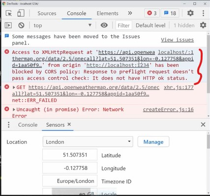
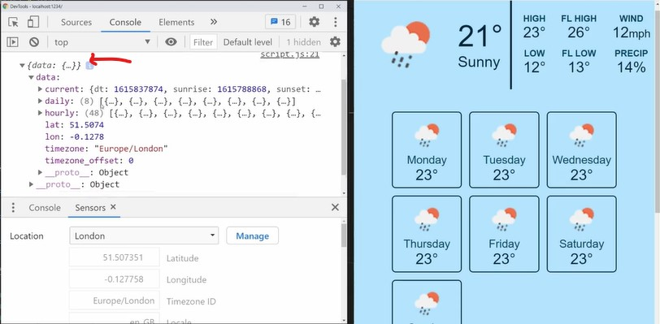
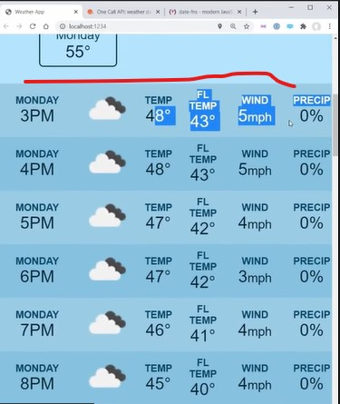

# Weather App Project

- here we'll use specific security + using `axios` library

- in this file only explanation included 

## About Project 

- so we're gonna take a lot of those concepts & combine them together to create a simple weather application
- we just have a bunch of placeholder information for weather
    - like we have high , low , FL high , fl low , & so on.. 
    - & weather for the next seven days as well as at the bottom <br>
        we have information hourly for everything that's going on at the particular location
    - & in order to get all this information , we're gonna use an API called weather API i.e https://openweathermap.org/api
        - so we need to signin for an account to get the API key to it for this application
        - & this API key should be private 
            - because it's something that if you were to enter your credit card <br>
                & use this in a serious application where you're paying for it & using it tons of times <br>
                then if someone stole that they could use your own credit card to pay for those different points <br>
                that's why we need to keep API key as private ✔️✔️✔️

## Explanation of weather app Project 

- inside that weather api website , after signin to your account , then we can see a bunch of different API end points
    - & we're gonna use `One Call API` end point - which gives us all the information <br>
        to build a generic weather app implementation

- `STEP 1` : inside https://openweathermap.org/api , after sign in
    - go to One Call API & click on `API doc` of this end point 
    - then we can see `How to make an API call` section , we'll get this end point that we can call like this 
        
    - `about that API end point`
        - inside of this API Call , there is latitude , longitude & anything that we want to exclude & API id 
        - & we can also specify `units` , `lang` for translations for those values also 
    - & also we've done in case if that API changes in the future or shuts down or whatever <br>
        then we've included a json file i.e example.json & this will give exact output that we're gonna get that API end point <br> 
        so if that API end point doesn't work due to some reason then we can use this example.json file ✔️✔️✔️

- `STEP 2` : inside this project folder , create two folders 
    - `STEP 2.1` first folder is `client` folder & second folder is `server` folder
    - `STEP 2.2` : put index.html & styles.css files inside `client` folder & put example.json file inside `server` folder
    - `reason why we're doing this ✅` : 
        - because as we know already that we have an API key & we need to keep this API key private
            - & we can't put it in the frontend because it's become publicly accessible + we can't put it in our Github anywhere 
        - so we need to put it inside of our server , so due to this , it's not accessible by anyone except for us
            - & again , we'll need to make sure we put it in that env file , so that we can make sure 
            - & due to this , that API key will not pushed into our like Github repository or anywhere publicly 💡💡💡

    - now in order to make API request a little easier , we're gonna be using `axios` library <br>
        instead of writing pure fetch request through vanilla-js 💡💡💡

- `STEP 3` : go inside `client` folder through `cd client` command 
    - `STEP 3.1` : then initialize package.json file through `npm init -y`
    - `STEP 3.2` : then install axios through `npm i axios` command 
    - `STEP 3.3` : now install parcel as a dev dependency through `npm i --save-dev parcel-bundler`

- `STEP 4` : inside package.json file (of client folder) , make scripts
    ```json
    "scripts": {
        "start": "parcel index.html"
    }
    ```
    - & remove the `test` script from this `scripts` object i.e `"test": echo \"Error: no test specified\" && exit 1`

- `STEP 5` : inside client folder , create a js file as script.js 
    - `STEP 5.1` : inside index.html file (of client folder) , link the script.js file 
        ```html
        <head>
            <link rel="stylesheet" href="styles.css">
            <script src="script.js" defer></script>
        </head>
        <body class="blurred"> <!-- remove this blurred class -->
        code....
        <body>
        ```
    - `STEP 5.2` : inside terminal , run `npm start` & then our server will start as localhost on 1234 port 
        - & we'll get an error that's just because parcel version 1.2.4 has a little bit of a bug
        - so go inside `package.json` file , & down grade the version of the parcel <br>
            means remove the `^` symbol & keep it inside `devDependencies` object like this 
            `"parcel-bundler": "1.12.3"`
    
    - `STEP 5.3` : now re-install everything through `npm i` command & then refresh that localhost page <br> 
        & our application will render properly

- now inside script.js file (of client folder) , we need to make sure that we can get the user's location ✔️✔️✔️
- `STEP 6` : open the inspect window of that page & then click on `customize & control devtools` that three dots
    - `STEP 6.1` : then click on `More tools` dropdown & then click on `sensors`
        - & by-default location will be selected as `No override` option , <br>
            so just to fake the location choose the `london` option means we're just faking the location that we're in london 
            - & again we're selecting `london` location because inside that `example.json` file , we put london location information 

    - `STEP 6.2` : inside script.js file (of client folder)
        ```js
        navigator.geolocation.getCurrentPosition(positionSuccess, positionError)
        ```
        - means we're just getting the current location of the user
        - `getCurrentPosition()` method takes two callbacks , first is for success & second is for error 

    - `STEP 6.3` : inside script.js file (of client folder) , create functions for success & error 
        ```js
        navigator.geolocation.getCurrentPosition(positionSuccess, positionError)

        function positionSuccess(e) {
            console.log(e)
        }

        function positionError() {
          alert("There was an error getting your location. Please allow us to use your location and refresh the page.")
        }
        ```
        - so if the user denied access to their location like they clicked block on this pop 
        
        - & then they just need to refresh their page & then they refresh their page <br>
            & then they choose `allow` option of location section inside that popup then `Reload` option will come , so `reload` the page
        - then it will allow them to actually get their location

        - output : save the file & then inspect that page & we can see that we're faking our location as london 
            - & inside `Sensors` tab we can see latitude & longitude of the london location
            - & inside console tab , we'll get information about london location like latitude , etc like this 
            
            - so open it & open the `coords` & then we can see latitude & longitude of london location
            - & if we select any other location then we'll get the latitude & longitude & other info about that location

    - we're doing this because our API call needs a latitude & longitude 
    - `STEP 6.4` : inside script.js file (of client folder) , working on positionSuccess() function
        ```js
        navigator.geolocation.getCurrentPosition(positionSuccess, positionError)

        function positionSuccess({ coords }) {
          getWeather(coords.latitude, coords.longitude) 
        }

        function positionError() {
          alert("There was an error getting your location. Please allow us to use your location and refresh the page.")
        }
        ```
        - `getWeather(coords.latitude, coords.longitude)` means getting latitude & longitude of our location

    - `STEP 6.5` : inside script.js file (of client folder) , working on getWeather() function
        ```js
        navigator.geolocation.getCurrentPosition(positionSuccess, positionError)

        function positionSuccess({ coords }) {
          getWeather(coords.latitude, coords.longitude)
        }

        function positionError() {
          alert("There was an error getting your location. Please allow us to use your location and refresh the page.")
        }

        // lat - means latitude & lon - means longitude & we use short form to make easy
        function getWeather(lat, lon) { }
        ```

    - `STEP 6.6` : inside script.js file (of client folder) , in order to use axios we need to import
        ```js
        import axios from "axios"

        navigator.geolocation.getCurrentPosition(positionSuccess, positionError)

        function positionSuccess({ coords }) {
          getWeather(coords.latitude, coords.longitude)
        }

        function positionError() {
          alert(
            "There was an error getting your location. Please allow us to use your location and refresh the page."
          )
        }

        // lat - means latitude & lon - means longitude & we use short form to make easy
        function getWeather(lat, lon) { 
            axios.get(`https://api.openweathermap.org/data/2.5/onecall?lat=${lat}&lon=${lon}&appid={}`, {
            })
        }
        ```
        - `get()` is a method of `axios` object to get the request from a particular URL
            - & we need to get the request from the server because we need to make API key private

        - `&exclude=${part}` we removed this from the URL because we don't want to exclude anything & `appid` will be our API key
         
    - `STEP 6.7` : getting API key from our account of that website
        - & to get the API key , we need to make an account on that website
        - so after making an account on it then click on `hamburger` icon & then click on our account name 
        - & then click on `APIKeys` menu & then we can see our API key under `Key` section
        - & api key will look like this 1aa50f96ddcc8cb276a9591073bf344a

    - `STEP 6.8` : inside script.js file (of client folder) , pasting our API key 
        ```js
        import axios from "axios"

        navigator.geolocation.getCurrentPosition(positionSuccess, positionError)

        function positionSuccess({ coords }) {
          getWeather(coords.latitude, coords.longitude)
        }

        function positionError() {
          alert("There was an error getting your location. Please allow us to use your location and refresh the page.")
        }

        // lat - means latitude & lon - means longitude & we use short form to make easy
        function getWeather(lat, lon) { 
            axios.get(`https://api.openweathermap.org/data/2.5/onecall?lat=${lat}&lon=${lon}&appid={1aa50f96ddcc8cb276a9591073bf344a}`).then(res => {
              console.log(res)
            })
        }
        ```
        - output : save the file & inspect the page & inside `console` tab & we'll get tons of errors like this  
            
        - `https://api.openweathermap.org/data/2.5/onecall?lat=${lat}&lon=${lon}&appid={1aa50f96ddcc8cb276a9591073bf344a}` means <br>
            this site is blocked us from making those requests because we're making requests from the Client side <br>
            - which means we're exposing our API key because we can only make request from the server because we're using API key 
            - so we need to do is to convert this long URL & put it on our server 💡💡💡

    - `STEP 6.9` : inside server folder , create a js file as server.js 
        - `STEP 6.9.1` : now inside terminal , run `cd server` command 
        - `STEP 6.9.2` : then run `npm init -y` to create package.json file 
        - `STEP 6.9.3` : & then to create a server in node.js the easy way, that we're gonna use a express.js library 💡💡💡 
            - so run `npm i express` & when it gets installed 
            - then run `npm i --save-dev nodemon` 
            - nodemon is just a simple function & allows to automatically refresh our server for every time we make changes <br>
                means kind of like live server extension or parcel 💡💡💡
        
    - `STEP 6.10` : inside package.json file (of server folder) , setting up scripts
        ```json
        "scripts": {
            "devStart": "nodemon server.js" , 
            "start": "node server.js"
        }
        ```
        - `"devStart": "nodemon server.js"` means 
            - `devStart` script will call a nodemon & every time we make changes inside server.js file 
            - then nodemon is gonna refresh our server automatically for us 💡💡💡

    - `STEP 6.11` : now inside server.js file (of server folder) , we'll setup a simple express server
        ```js
        const express = require("express")
        const app = express() // this app variable is the thing where we define all the everything

        app.get("/weather", (req, res) => {
          const { lat, lon } = req.query
        })

        app.listen(3001) // 3001 will be the port of our server means run the server on this port
        ```
        - `"/weather"` means `localhost:3001/weather` , so `app.get("/weather")` will be called
        - `req` parameter is essentially all the information from the client & <br>
            `res` parameter is everything that we actually send down to the client 💡💡💡
        - `const { lat, lon } = req.query` getting the latitude & longitude of that location <br>
            which is come from the query of our request i.e `req.query` <br>
            but in order to access our query , we need to tell our app to do that by defining these like this 
            ```
            app.use(cors())
            app.use(express.urlencoded({ extended: true }))
            ```

    - `STEP 6.12` : now inside server.js file (of server folder) , defining urlencoded 
        ```js
        const express = require("express")
        const app = express() 
        app.use(express.urlencoded({ extended: true }))

        app.get("/weather", (req, res) => {
          const { lat, lon } = req.query
        })

        app.listen(3001)
        ```
        - `app.use(express.urlencoded({ extended: true }))` means we're going to be accepting query parameters from the URL 
        - & now `const { lat, lon } = req.query` here we need to parse those from `request.query` <br>
            which will give longitude & latitude 💡💡💡

        - `STEP 6.12.1` : now inside server.js file (of server folder) , just for checking 
            ```js
            const express = require("express")
            const app = express() 
            app.use(express.urlencoded({ extended: true }))

            app.get("/weather", (req, res) => {
              const { lat, lon } = req.query
              console.log(lat, lon)
              res.send() // means send no information to the user 
              // means we're actually gonna make our API request
            })

            app.listen(3001)
            ```
        
        - `STEP 6.12.2` : now inside script.js file (of client folder) ,
            - inside getWeather() function , we're calling our API directly through that URL , so instead of doing this <br<>
                we'll call our server through this URL `localhost:3001/weather` 💡💡💡

    - `STEP 6.13` : now inside script.js file (of client folder) , 
        - getting the request through this URL i.e `localhost:3001/weather`
        ```js
        import axios from "axios"

        navigator.geolocation.getCurrentPosition(positionSuccess, positionError)

        function positionSuccess({ coords }) {
          getWeather(coords.latitude, coords.longitude)
        }

        function positionError() {
          alert("There was an error getting your location. Please allow us to use your location and refresh the page.")
        }

        function getWeather(lat, lon) { 
            axios.get("http://localhost:3001/weather", {
              params: { lat, lon }
            }).then(res => {
                console.log(res.data)
            })
        }
        ``` 
        - `axios.get("http://localhost:3001/weather")` means we want to get a request to that URL <br>
            & with this URL , we passed some params that we need to get from the request 💡💡💡

        - output : now we just need to start up our server , so run `npm run devStart` & our client is already running 
            - now inspect that page & inside console tab , we're still getting tons of errors like earlier i.e CORS errors 
            - means request has been blocked by CORS policy
            - so we need to allow CORS to make a request from client to server 💡💡💡

        - `why CORS error comes in js ✅` : because 
            - they prevent JavaScript from obtaining data from a server in a domain <br>
                different than the domain the website was loaded from, unless the REST API server gives permission
            -  From a developer's perspective, CORS is often a cause of much grief when it blocks network requests
        
    - `STEP 6.14` : to allow the CORS to make a request from client to server . we need to allow the CORS from the server 
        - `STEP 6.14.1` : install npm package `npm i cors` 
        - so CORS will us to do CORS request & CORS means Cross Origin
        - means client URL is `localhost:1234` & our server URL is `localhost:3001` , so these are two different URLs <br>
            so CORS just blocks any request to different URLs , but we want to to allow request from different URLs <br>
            so CORS will allow us to do request from different URL to different URL 💡💡💡

        - `STEP 6.14.2` : now inside server.js file , setting up CORS
            ```js
            const express = require("express")
            const cors = require("cors") // here getting CORS
            const app = express()
            app.use(cors()) // here using CORS
            app.use(express.urlencoded({ extended: true }))                

            app.get("/weather", (req, res) => {
              const { lat, lon } = req.query
              console.log(lat, lon)
              res.send() 
            })

            app.listen(3001)
            ```
            - output : save the file & rerun the server through `npm run devStart`
                - now inside console tab , now we'll not get those CORS errors , 
                - & inside terminal , our server will get that latitude & longitude value of that location 
            - so we successfully passed a latitude & longitude value from our client to our server
                - so it's working that we did axios call to the server that we've created <br>
                    & we're passing latitude & longitude value inside script.js file <br> 
                    & then inside our server , we're just getting that from our query i.e `req.query` 💡💡💡

    - now we need to make those calls & for this we'll use axios on the server
    - `STEP 6.15` : inside server.js file (of server folder)
        - `STEP 6.15.1` : install axios through `npm i axios`
        - `STEP 6.15.2` : & again we start our server again `npm run devStart`

        - `STEP 6.15.3` : inside server.js file (of server folder)    
            ```js
            const express = require("express")
            const cors = require("cors")
            const axios = require("axios")
            const app = express()
            app.use(cors())
            app.use(express.urlencoded({ extended: true }))

            app.get("/weather", (req, res) => {
              const { lat, lon } = req.query
              // copy only this URL https://api.openweathermap.org/data/2.5/onecall from API call of that website
              axios.get("https://api.openweathermap.org/data/2.5/onecall", {
                // & setting params or information which are required to send with the request through this URL 💡💡💡
                params: {
                  lat,
                  lon,
                  // here we're putting API key hard coded but later on we'll keep it inside a more secure location
                  appid: '1aa50f96ddcc8cb276a9591073bf344a' , 
                  // don't use exclude part right now  
                  units: "imperial" 
                }
              }).then(({ data }) => { // here we're destructing our response
                res.json(data) // means send JSON data to the user
              })
              .catch(e => { // but if we have an error then we'll send different set of information
                console.log(e)
                res.sendStatus(500) // sending request status i.e 500 means we had an error 💡💡💡
                // so if we got an error then we need to tell the user about the error 
                // otherwise user won't able to understand 💡💡💡 
              })
            })

            app.listen(3001)
            ```
            - `units: "imperial"` means we want imperial units here units means related to measurement
                - because everything's gonna be in the imperial system 

            - here `then()` block & `catch()` block means 
                - if we got the right request from the user <br>
                    then we'll send the response through then() (which will show data)
                - but if got the wrong request from the user <br>
                    then we'll send the response through catch() (which will show error status) 💡💡💡

            - output : save the file & inspect the page & inside console tab , 
                - & we'll get the response means data because inside script.js file , <br>
                    we're printing out `res.data` inside then() block
                - & if open that output i.e object then we can see `current` object <br>
                    which is current data means current weather
                - & so on we'll got daily weather & so on...  
                
    - & if there is any alerts going on at this time related to weather <br>
        means inside that weather website , inside API call docs , inside `exclude` param we can define `alerts` also ✔️✔️✔️<br>
        means if we don't want to include minutely weather & alerts then we can exclude them from our application <br>
        but just putting `minutely & alerts` both inside `exclude` key 💡💡💡
    - `STEP 6.16` : inside server.js file (of server folder) , exclude things which we don't want in our application 
        ```js
        const express = require("express")
        const cors = require("cors")
        const axios = require("axios")
        const app = express()
        app.use(cors())
        app.use(express.urlencoded({ extended: true }))

        app.get("/weather", (req, res) => {
          const { lat, lon } = req.query
          axios.get("https://api.openweathermap.org/data/2.5/onecall", {
            params: {
              lat,
              lon,
              appid: '1aa50f96ddcc8cb276a9591073bf344a' , 
              units: "imperial",
              exclude: "minutely,alerts" // so we're excluding minutely weather & alerts also
            }
          }).then(({ data }) => { 
            res.json(data) 
          })
          .catch(e => { 
            console.log(e)
            res.sendStatus(500) 
          })
        })

        app.listen(3001)
        ```
        - output : save the file & inspect the page & inside console tab , 
            - & if open that output i.e object then inside that object <br>
                we can see `current , daily , hourly` objects only & there's no minutely weather & alerts 

        - `STEP 6.16.1` : now if this weather API is not working as expected or it's no longer available or it's down or it's broken
            - then inside server.js file , we can data from example.json file like this
                ```js
                const express = require("express")
                const cors = require("cors")
                const axios = require("axios")
                const app = express()
                app.use(cors())
                app.use(express.urlencoded({ extended: true }))
                const weatherData = require('./example.json')

                app.get("/weather", (req, res) => {
                    const { lat, lon } = req.query
                    res.json(weatherData) 
                })

                app.listen(3001)
                ```
            - & then inside `app.get()` method , comment down the code of `axios.get()` <br>
                because we're just already getting the data means we're not actually making any API request 💡💡💡
            - & then putted `res.json(weatherData)` to return the response to the user
            - we're doing this because it'll give a little bit better practice

        - otherwise use that weather API if it's working

    - `STEP 6.17 ✅` : now let's hide that API key , so that no one can access it 💡💡💡
        - `STEP 6.17.1` : inside server folder , create a file as `.env` without file name
        - more about .env file check this https://dev.to/aadilraza339/what-is-env-file-in-node-js-3h6c
        - `STEP 6.17.2` : cut that API key from server.js file & paste it inside `.env` file
            - inside `.env` file
                ```
                API_KEY=1aa50f96ddcc8cb276a9591073bf344a
                ```
        - `STEP 6.17.3` : inside server.js file (of server folder)
            ```js
            const express = require("express")
            const cors = require("cors")
            const axios = require("axios")
            require("dotenv").config() 
            const app = express()
            app.use(cors())
            app.use(express.urlencoded({ extended: true }))

            app.get("/weather", (req, res) => {
              const { lat, lon } = req.query
              axios.get("https://api.openweathermap.org/data/2.5/onecall", {
                params: {
                  lat,
                  lon,
                  appid: process.env.API_KEY ,  
                  units: "imperial",
                  exclude: "minutely,alerts" 
                }
              }).then(({ data }) => { 
                res.json(data) 
              })
              .catch(e => { 
                console.log(e)
                res.sendStatus(500) 
              })
            })

            app.listen(3001)
            ``` 
            - `Note` : `process.env.API_KEY` here API_KEY should be exact as we define inside `.env` file 💡💡💡
            - `require("dotenv").config()` means getting the .env file & config() method <br>
                means load all the information from our .env file & put that information inside that `process.env` <br>
                so that we can access `API_KEY` 💡💡💡 

            - output : save the file & now to load these environment variables then just run `npm i dotenv`
                - & then just restart our server through `npm run devStart`
                - & then inspect the page & inside console tab , & inside that output , there's no API key is coming <br>
                    so we successfully hide that API key inside `.env` file inside our server folder 

        - `STEP 6.17.4` : inside server folder , create a `.gitignore` file 
            - inside .gitignore file 
                ```
                .env
                node_modules
                ```
            - `reason` : when we commit our changes through git commit command 
                - then `.env` file will not be uploaded on github , so that API key is never accessible by anyone
                - & that API key will never in the code as well as in github 
                - so no one can ever access this except for us 💡💡💡

- so technically what we have done yet on the server will work properly 
    - & we could do all the processing of that big array of data i.e output inside the console tab 
    - but instead of passing all this information to our client but instead of doing this , we'll parse it out <br> 
        & only send the information we want to the client & so we can do all parsing ahead of time <br>
        because right now if we open the data of `0 index` of `daily` object value then we can see keys are in underscores <br> 
        so those variables not in camel case
    - so if we do all the parsing on our server , it'll make it easier to work with on the client side 💡💡💡
- `STEP 7` : inside server.js file (of server folder) , sending `daily` data
    ```js
    const express = require("express")
    const cors = require("cors")
    const axios = require("axios")
    require("dotenv").config() 
    const app = express()
    app.use(cors())
    app.use(express.urlencoded({ extended: true }))

    app.get("/weather", (req, res) => {
      const { lat, lon } = req.query
      axios.get("https://api.openweathermap.org/data/2.5/onecall", {
        params: {
          lat,
          lon,
          appid: process.env.API_KEY ,  
          units: "imperial",
          exclude: "minutely,alerts" 
        }
      }).then(({ data }) => { 
        res.json({
          current: parseCurrentWeather(data), // for current weather data
          daily: parseDailyWeather(data), // for daily weather data
          hourly: parseHourlyWeather(data) // for hourly weather data         
        }) 
      })
      .catch(e => { 
        console.log(e)
        res.sendStatus(500) 
      })
    })

    app.listen(3001)   
    ```
    - so `parseCurrentWeather(data) & those functions` will take our data & covert it to a proper format <br> 
        which is much easier to use ✔️✔️✔️

    - `STEP 7.1` : inside server.js file (of server folder) , working on those functions 
        ```js
        const express = require("express")
        const cors = require("cors")
        const axios = require("axios")
        require("dotenv").config() 
        const app = express()
        app.use(cors())
        app.use(express.urlencoded({ extended: true }))

        app.get("/weather", (req, res) => {
          const { lat, lon } = req.query
          axios.get("https://api.openweathermap.org/data/2.5/onecall", {
            params: {
              lat,
              lon,
              appid: process.env.API_KEY ,  
              units: "imperial",
              exclude: "minutely,alerts" 
            }
          }).then(({ data }) => { 
            res.json({
              current: parseCurrentWeather(data), 
              daily: parseDailyWeather(data), 
              hourly: parseHourlyWeather(data),
              data       
            }) 
          })
          .catch(e => { 
            console.log(e)
            res.sendStatus(500) 
          })
        })

        function parseCurrentWeather(data) {

        }

        function parseDailyWeather(data) {

        }

        function parseHourlyWeather(data) {

        }

        app.listen(3001) 
        ```
        - output : all these are for testing purpose
            - save the file & inspect & inside console tab & then open that `object` data <br>
            - & refresh that page then we'll get `data` as a output like this 
                
            - open that `current` object & we need current temperature , so there is a `temp` key <br>
                & same thing we need those stuff which are required to show in our application
            
    - `STEP 7.2` : inside server.js file (of server folder)
        ```js
        const express = require("express")
        const cors = require("cors")
        const axios = require("axios")
        require("dotenv").config() 
        const app = express()
        app.use(cors())
        app.use(express.urlencoded({ extended: true }))

        app.get("/weather", (req, res) => {
          const { lat, lon } = req.query
          axios.get("https://api.openweathermap.org/data/2.5/onecall", {
            params: {
              lat,
              lon,
              appid: process.env.API_KEY ,  
              units: "imperial",
              exclude: "minutely,alerts" 
            }
          }).then(({ data }) => { 
            res.json({
              current: parseCurrentWeather(data), 
              daily: parseDailyWeather(data), 
              hourly: parseHourlyWeather(data),
              data       
            }) 
          })
          .catch(e => { 
            console.log(e)
            res.sendStatus(500) 
          })
        })

        function parseCurrentWeather({ current, daily }) {
            const { temp: currentTemp, weather, wind_speed } = current // doing destructuring 
            const { pop, temp, feels_like } = daily[0]

            return {
              currentTemp: Math.round(currentTemp),
              highTemp: Math.round(temp.max),
              lowTemp: Math.round(temp.min),
              // return maximum value our of those values from feels_like key
              highFeelsLike: Math.round(Math.max(...Object.values(feels_like))),  
              // return minimum value our of those values from feels_like key
              lowFeelsLike: Math.round(Math.min(...Object.values(feels_like))), 
              windSpeed: Math.round(wind_speed),
              precip: Math.round(pop * 100),
              icon: weather[0].icon,
              description: weather[0].description, 
            }
        }

        function parseDailyWeather(data) {

        }

        function parseHourlyWeather(data) {

        }

        app.listen(3001) 
        ```
        - here `pop` key inside `0 index of daily object` is a precipitation means precip  <br>
            & we just rename the `temp` key into currentTemp due to no conflict
        - inside `parseCurrentWeather()` , whatever information we're returning , all those information are related to these section i.e 
            
            - & we got those information by searching inside that object 

        - output : save the file & then inside console tab , we'll get output i.e `current` object & `data` object
            - now we can easily work with & these objects are not complicated than earlier one 
            - & `data` object is everything & we'll remove it later on , it's just for our debugging purposes

    - now the next step is to parse our daily data i.e 7 days data of a week which is bottom data of our application
        - so we need three things i.e icon , day name & weather degree
    - `STEP 7.3` : inside server.js file (of server folder) , working on bottom data of our application means parseDailyWeather() function
        ```js
        const express = require("express")
        const cors = require("cors")
        const axios = require("axios")
        require("dotenv").config() 
        const app = express()
        app.use(cors())
        app.use(express.urlencoded({ extended: true }))

        app.get("/weather", (req, res) => {
          const { lat, lon } = req.query
          axios.get("https://api.openweathermap.org/data/2.5/onecall", {
            params: {
              lat,
              lon,
              appid: process.env.API_KEY ,  
              units: "imperial",
              exclude: "minutely,alerts" 
            }
          }).then(({ data }) => { 
            res.json({
              current: parseCurrentWeather(data), 
              daily: parseDailyWeather(data), 
              hourly: parseHourlyWeather(data),
              data       
            }) 
          })
          .catch(e => { 
            console.log(e)
            res.sendStatus(500) 
          })
        })

        function parseCurrentWeather({ current, daily }) {
            const { temp: currentTemp, weather, wind_speed } = current // doing destructuring 
            const { pop, temp, feels_like } = daily[0]

            return {
              currentTemp: Math.round(currentTemp),
              highTemp: Math.round(temp.max),
              lowTemp: Math.round(temp.min),
              // return maximum value our of those values from feels_like key
              highFeelsLike: Math.round(Math.max(...Object.values(feels_like))),  
              // return minimum value our of those values from feels_like key
              lowFeelsLike: Math.round(Math.min(...Object.values(feels_like))), 
              windSpeed: Math.round(wind_speed),
              precip: Math.round(pop * 100),
              icon: weather[0].icon,
              description: weather[0].description, 
            }
        }

        function parseDailyWeather({ daily }) {
          // here we just need to make sure 
            // that we should get the future day's forecast not the current day's forecast 💡💡💡
          return daily.slice(1).map(day => { 
            return {
              timestamp: day.dt * 1000,
              icon: day.weather[0].icon,
              temp: Math.round(day.temp.day) 
            }
          })
        }

        function parseHourlyWeather(data) {

        }

        app.listen(3001) 
        ```
        - `daily.slice(1)` means leave the data of `0 index` & get the data from 1 to 7 indexes ✔️✔️✔️
        - `temp: Math.round(day.temp.day)` here we used Math.round() <br>
            because if we don't use it then we'll get temperature in decimal form like this `50.92`  
        
        - output : save the file then refresh the page & then inside console tab , inside output
            - open that object & then inside `daily` object , we'll get array of 7 days with 7 different values 
            - then if we open that `0 index` object (of daily object) then we'll get icon , temp & timestamp
            - whatever we did is for `daily` weather section i.e <br>
            

    - now next step is to work on hourly weather section
    - `STEP 7.4` : inside server.js file (of server folder) , working on hourly weather data i.e parseHourlyWeather() function
        ```js
        const express = require("express")
        const cors = require("cors")
        const axios = require("axios")
        require("dotenv").config() 
        const app = express()
        app.use(cors())
        app.use(express.urlencoded({ extended: true }))

        app.get("/weather", (req, res) => {
          const { lat, lon } = req.query
          axios.get("https://api.openweathermap.org/data/2.5/onecall", {
            params: {
              lat,
              lon,
              appid: process.env.API_KEY ,  
              units: "imperial",
              exclude: "minutely,alerts" 
            }
          }).then(({ data }) => { 
            res.json({
              current: parseCurrentWeather(data), 
              daily: parseDailyWeather(data), 
              hourly: parseHourlyWeather(data),
              // here we remove the data 
            }) 
          })
          .catch(e => { 
            console.log(e)
            res.sendStatus(500) 
          })
        })

        function parseCurrentWeather({ current, daily }) {
            const { temp: currentTemp, weather, wind_speed } = current 
            const { pop, temp, feels_like } = daily[0]

            return {
              currentTemp: Math.round(currentTemp),
              highTemp: Math.round(temp.max),
              lowTemp: Math.round(temp.min),
              // return maximum value our of those values from feels_like key
              highFeelsLike: Math.round(Math.max(...Object.values(feels_like))),  
              // return minimum value our of those values from feels_like key
              lowFeelsLike: Math.round(Math.min(...Object.values(feels_like))), 
              windSpeed: Math.round(wind_speed),
              precip: Math.round(pop * 100),
              icon: weather[0].icon,
              description: weather[0].description, 
            }
        }

        function parseDailyWeather({ daily }) {
          return daily.slice(1).map(day => { 
            return {
              timestamp: day.dt * 1000,
              icon: day.weather[0].icon,
              temp: Math.round(day.temp.day) 
            }
          })
        }

        const HOUR_IN_SECONDS = 3600
        function parseHourlyWeather({ hourly, current }) {
            // we need to make sure that our hour timestamp is greater than our current timestamp 💡💡💡
            return hourly.filter(hour => hour.dt > current.dt - HOUR_IN_SECONDS).map(hour => {
                return {
                    // we got those keys from the inside `hourly` object of `data` object , & inside `0 index` object 
                    // & we only get those keys which are required for our hourly weather data section
                    timestamp: hour.dt * 1000,
                    icon: hour.weather[0].icon,
                    temp: Math.round(hour.temp),
                    feelsLike: Math.round(hour.feels_like),
                    windSpeed: Math.round(hour.wind_speed),
                    precip: Math.round(hour.pop * 100),
                }
            })
        }

        app.listen(3001) 
        ```
        - `hourly.filter(hour => hour.dt > current.dt - HOUR_IN_SECONDS)` means 
            - `hour.dt` means take each hour & check their timestamp & if their timestamp is greater <br>
                than `current.dt - HOUR_IN_SECONDS` means our current timestamp minus one hour <br> 
                then we want to keep that time & that'll give us every single hour <br>
                including the hour we're currently in & all the hours after it 💡💡💡

        - & remove the `data` object which is after this `hourly: parseHourlyWeather(data)` line of code 

        - output : save the file & inside console tab , open that object , we'll get current , daily & hourly objects
            - & we parse/formatted this hourly weather section as we want
            - & till yet whatever we did for hourly weather section i.e <br>
            

- now all the data's available & we have all of the data on our client 
    - the next step is just to actually put the information into the actual UI
- `STEP 8` : inside script.js file (of client folder) , putting the catch() block inside getWeather() function
    ```js
    import axios from "axios"

    navigator.geolocation.getCurrentPosition(positionSuccess, positionError)

    function positionSuccess({ coords }) {
      getWeather(coords.latitude, coords.longitude)
    }

    function positionError() {
      alert("There was an error getting your location. Please allow us to use your location and refresh the page.")
    }

    function getWeather(lat, lon) { 
        axios.get("http://localhost:3001/weather", {
            params: { lat, lon }
        }).then(res => {
            renderWeather(res.data) // here we're rendering our weather instead of doing console.log()
        }).catch(e => { // it just a simple error catcher for us 
            console.log(e)
            alert("Error getting weather. Please try again.")
        })
    }
    ```
    
    - `STEP 8.1` : inside script.js file (of client folder) , working on renderWeather() function
        ```js
        import axios from "axios"

        navigator.geolocation.getCurrentPosition(positionSuccess, positionError)

        function positionSuccess({ coords }) {
          getWeather(coords.latitude, coords.longitude)
        }

        function positionError() {
          alert("There was an error getting your location. Please allow us to use your location and refresh the page.")
        }

        function getWeather(lat, lon) { 
            axios.get("http://localhost:3001/weather", {
                params: { lat, lon }
            }).then(res => {
                renderWeather(res.data) 
            }).catch(e => { 
                console.log(e)
                alert("Error getting weather. Please try again.")
            })
        }
        
        function renderWeather({ current, daily, hourly }) {
            document.body.classList.remove("blurred")
            renderCurrentWeather(current)
            renderDailyWeather(daily)
            renderHourlyWeather(hourly)
        }
        ```
        - here `renderCurrentWeather() , renderDailyWeather() & renderHourlyWeather()` 
            - these are just small little helper functions which make doing this code easier for renderWeather() function 💡💡💡
        - & we removed the `blurred` class from renderWeather() function
            - means while the information is loading & it'll be blurred out 
            - & then as soon as it loads & then we'll actually take away or remove that blur
        - & inside console tab we're getting error like this
            
            - so these errors are jus render current weather function is not defined <br>
                so let's just create those functions i.e `renderCurrentWeather()` 

    - `STEP 8.2` : inside script.js file (of client folder) , working on those helper functions
        ```js
        import axios from "axios"

        navigator.geolocation.getCurrentPosition(positionSuccess, positionError)

        function positionSuccess({ coords }) {
          getWeather(coords.latitude, coords.longitude)
        }

        function positionError() {
          alert("There was an error getting your location. Please allow us to use your location and refresh the page.")
        }

        function getWeather(lat, lon) { 
            axios.get("http://localhost:3001/weather", {
                params: { lat, lon }
            }).then(res => {
                renderWeather(res.data) 
            }).catch(e => { 
                console.log(e)
                alert("Error getting weather. Please try again.")
            })
        }
        
        function renderWeather({ current, daily, hourly }) {
            document.body.classList.remove("blurred")
            renderCurrentWeather(current)
            renderDailyWeather(daily)
            renderHourlyWeather(hourly)
        }

        function renderCurrentWeather(current) {}
        function renderDailyWeather(daily) {}
        function renderHourlyWeather(hourly) {}
        ```
        - output : save the file & then that blur gets away as soon as everything loads & no errors coming inside console tab 
            - & this is happening fast because we're doing in local communication
            - & in case someone has a slow connection speed

    - `STEP 8.3` : inside index.html file (of client folder) , adding data attributes to render the data
        ```html
        <body class="blurred">
          <header class="header">
            <div class="header-left">
              <!-- added data-current-icon data attribute-->  
              
              <div class="header-left-details">
                <!-- added span tag with data-current-temp data attribute-->  
                <div class="header-current-temp"><span data-current-temp>21</span>&deg;</div>
                <!-- added data-current-description data attribute-->  
                <div class="header-current-description" data-current-description>Sunny</div>
              </div>
            </div>
            <div class="header-right">
              <div class="info-group">
                <div class="label">High</div>
                <!-- added a span tag with data-current-high data attribute-->  
                <div><span data-current-high>23</span>&deg;</div>
              </div>
              <div class="info-group">
                <div class="label">FL High</div>
                <!-- added a span tag with data-current-fl-high data attribute-->  
                <div><span data-current-fl-high>26</span>&deg;</div>
              </div>
              <div class="info-group">
                <div class="label">Wind</div>
                <!-- added a span tag with data-current-wind data attribute-->  
                <div><span data-current-wind>12</span><span class="value-sub-info">mph</span></div>
              </div>
              <div class="info-group">
                <div class="label">LOW</div>
                <!-- added a span tag with data-current-low data attribute-->  
                <div><span data-current-low>12</span>&deg;</div>
              </div>
              <div class="info-group">
                <div class="label">FL Low</div>
                <!-- added a span tag with data-current-fl-low data attribute-->  
                <div><span data-current-fl-low>13</span>&deg;</div>
              </div>
              <div class="info-group">
                <div class="label">Precip</div>
                <!-- added a span tag with data-current-precip data attribute-->  
                <div><span data-current-precip>14</span>%</div>
              </div>
            </div>
          </header>
        </body>
        ```
        - till this part we did changes inside index.html file

        - `STEP 8.3.1` : inside script.js file (of client folder) , working on current Temperature section
            ```js
            import axios from "axios"

            navigator.geolocation.getCurrentPosition(positionSuccess, positionError)

            function positionSuccess({ coords }) {
              getWeather(coords.latitude, coords.longitude)
            }

            function positionError() {
              alert("There was an error getting your location. Please allow us to use your location and refresh the page.")
            }

            function getWeather(lat, lon) { 
                axios.get("http://localhost:3001/weather", {
                    params: { lat, lon }
                }).then(res => {
                    renderWeather(res.data) 
                }).catch(e => { 
                    console.log(e)
                    alert("Error getting weather. Please try again.")
                })
            }
            
            function renderWeather({ current, daily, hourly }) {
                document.body.classList.remove("blurred")
                renderCurrentWeather(current)
                renderDailyWeather(daily)
                renderHourlyWeather(hourly)
            }

            function renderCurrentWeather(current) {
                document.querySelector("[data-current-temp]").textContent = current.currentTemp
                document.querySelector("[data-current-high]").textContent = current.highTemp
            }

            function renderDailyWeather(daily) {}
            function renderHourlyWeather(hourly) {}
            ```
            - output : save the file & we can see 48 degree & we'll get high temperature
               
         - but we can notice that we're repeat same line of code again & again inside `renderCurrentWeather()` function
            - so we're gonna create a helper function for this 

        - `STEP 8.3.2` : inside script.js file (of client folder) , creating a helper function 
            ```js
            import axios from "axios"

            navigator.geolocation.getCurrentPosition(positionSuccess, positionError)

            function positionSuccess({ coords }) {
              getWeather(coords.latitude, coords.longitude)
            }

            function positionError() {
              alert("There was an error getting your location. Please allow us to use your location and refresh the page.")
            }

            function getWeather(lat, lon) { 
                axios.get("http://localhost:3001/weather", {
                    params: { lat, lon }
                }).then(res => {
                    renderWeather(res.data) 
                }).catch(e => { 
                    console.log(e)
                    alert("Error getting weather. Please try again.")
                })
            }
            
            function renderWeather({ current, daily, hourly }) {
                document.body.classList.remove("blurred")
                renderCurrentWeather(current)
                renderDailyWeather(daily)
                renderHourlyWeather(hourly)
            }

            function setValue(selector, value) {
                document.querySelector(`[data-${selector}]`).textContent = value)
            }

            function renderCurrentWeather(current) {
                setValue("current-temp", current.currentTemp)
                setValue("current-high", current.highTemp)
                setValue("current-low", current.lowTemp)
                setValue("current-fl-high", current.highFeelsLike)
                setValue("current-fl-low", current.lowFeelsLike)
                setValue("current-wind", current.windSpeed)
                setValue("current-precip", current.precip)
                setValue("current-description", current.description)
            }

            function renderDailyWeather(daily) {}
            function renderHourlyWeather(hourly) {}
            ```
            - so we made the setValue() function to simplify lines of code off renderCurrentWeather() function
                - so inside renderCurrentWeather() function , we can see lines of code become much easier to work

            - output : save the file & in that page we can see all the information as the output
                - so we're properly propagated based on what we're getting from our server

        - now we need to bring the icon based on the current weather & for this we need to write some custom code 
        - `STEP 8.3.4` : inside script.js file (of client folder) , doing custom code for the icon based on current weather
            ```js
            import axios from "axios"

            navigator.geolocation.getCurrentPosition(positionSuccess, positionError)

            function positionSuccess({ coords }) {
              getWeather(coords.latitude, coords.longitude)
            }

            function positionError() {
              alert("There was an error getting your location. Please allow us to use your location and refresh the page.")
            }

            function getWeather(lat, lon) { 
                axios.get("http://localhost:3001/weather", {
                    params: { lat, lon }
                }).then(res => {
                    renderWeather(res.data) 
                }).catch(e => { 
                    console.log(e)
                    alert("Error getting weather. Please try again.")
                })
            }
            
            function renderWeather({ current, daily, hourly }) {
                document.body.classList.remove("blurred")
                renderCurrentWeather(current)
                renderDailyWeather(daily)
                renderHourlyWeather(hourly)
            }

            function setValue(selector, value) {
                document.querySelector(`[data-${selector}]`).textContent = value)
            }

            const currentIcon = document.querySelector("[data-current-icon]")
            function renderCurrentWeather(current) {
                currentIcon.src = 'http://openweathermap.org/img/wn/10d@2x.png'
                setValue("current-temp", current.currentTemp)
                setValue("current-high", current.highTemp)
                setValue("current-low", current.lowTemp)
                setValue("current-fl-high", current.highFeelsLike)
                setValue("current-fl-low", current.lowFeelsLike)
                setValue("current-wind", current.windSpeed)
                setValue("current-precip", current.precip)
                setValue("current-description", current.description)
            }

            function renderDailyWeather(daily) {}
            function renderHourlyWeather(hourly) {}
            ```
            - `10d@2x` means 10d is a image & size of image is 2x then normal size
            - now we actually need two different URLS for different icon size for weather icon
                - first : is two times size for current weather section
                - second : is normal size for daily weather section
                - so for this let's create a little helper function 💡💡💡

        - `STEP 8.3.5` : inside script.js file (of client folder) , create a helper function for different weather icon size
            ```js
            import axios from "axios"

            navigator.geolocation.getCurrentPosition(positionSuccess, positionError)

            function positionSuccess({ coords }) {
              getWeather(coords.latitude, coords.longitude)
            }

            function positionError() {
              alert("There was an error getting your location. Please allow us to use your location and refresh the page.")
            }

            function getWeather(lat, lon) { 
                axios.get("http://localhost:3001/weather", {
                    params: { lat, lon }
                }).then(res => {
                    renderWeather(res.data) 
                }).catch(e => { 
                    console.log(e)
                    alert("Error getting weather. Please try again.")
                })
            }
            
            function renderWeather({ current, daily, hourly }) {
                document.body.classList.remove("blurred")
                renderCurrentWeather(current)
                renderDailyWeather(daily)
                renderHourlyWeather(hourly)
            }

            function setValue(selector, value) {
                document.querySelector(`[data-${selector}]`).textContent = value)
            }

            function getIconUrl(icon, { large = false } = {}) {
                const size = large ? "@2x" : ""
                return `http://openweathermap.org/img/wn/${icon}${size}.png`
            }

            const currentIcon = document.querySelector("[data-current-icon]")
            function renderCurrentWeather(current) {
                currentIcon.src = getIconUrl(current.icon, { large: true })
                setValue("current-temp", current.currentTemp)
                setValue("current-high", current.highTemp)
                setValue("current-low", current.lowTemp)
                setValue("current-fl-high", current.highFeelsLike)
                setValue("current-fl-low", current.lowFeelsLike)
                setValue("current-wind", current.windSpeed)
                setValue("current-precip", current.precip)
                setValue("current-description", current.description)
            }

            function renderDailyWeather(daily) {}
            function renderHourlyWeather(hourly) {}
            ```
            - `function getIconUrl(icon, { large = false } = {})` means 
                - `first parameter` : is that weather icon we want 
                - `second parameter` : i.e { large = false } = {} which means that by-default large option will be false <br>
                    & we'll default that option to an empty object
                - `const size = large ? "@2x" : ""` means by-default size of that icon will be normal

            - output : save the file & inside that page , inside current weather section 
                - weather icon will be changed based on current weather like this <br>
                

- now next section is daily weather section that we need to work on
- `STEP 9` : inside index.html file , changing stuff for daily weather section of our application
    ```html
    <section class="day-section" data-day-section>
        <div class="day-card">
          
          <div class="day-card-date">Monday</div>
          <div>23&deg;</div>
        </div>
        <div class="day-card">
          
          <div class="day-card-date">Tuesday</div>
          <div>23&deg;</div>
        </div>
        <div class="day-card">
          
          <div class="day-card-date">Wednesday</div>
          <div>23&deg;</div>
        </div>
        <div class="day-card">
          
          <div class="day-card-date">Thursday</div>
          <div>23&deg;</div>
        </div>
        <div class="day-card">
          
          <div class="day-card-date">Friday</div>
          <div>23&deg;</div>
        </div>
        <div class="day-card">
          
          <div class="day-card-date">Saturday</div>
          <div>23&deg;</div>
        </div>
        <div class="day-card">
          
          <div class="day-card-date">Sunday</div>
          <div>23&deg;</div>
        </div>
    </section>

    <!-- added template tag with id i.e day-card-template inside -->
    <template id="day-card-template">
        <div class="day-card">
            <!-- added day-icon data attribute -->
            
            <!-- added day-date data attribute -->
            <div class="day-card-date" data-date>Monday</div>
            <!-- added day-temp data attribute -->
            <div><span data-temp>23</span>&deg;</div>
        </div>
    </template>
    ```

    - `STEP 9.1` : inside script.js file (of client folder) , working on renderDailyWeather() function
        ```js
        import axios from "axios"

        navigator.geolocation.getCurrentPosition(positionSuccess, positionError)

        function positionSuccess({ coords }) {
          getWeather(coords.latitude, coords.longitude)
        }

        function positionError() {
          alert("There was an error getting your location. Please allow us to use your location and refresh the page.")
        }

        function getWeather(lat, lon) { 
            axios.get("http://localhost:3001/weather", {
                params: { lat, lon }
            }).then(res => {
                renderWeather(res.data) 
            }).catch(e => { 
                console.log(e)
                alert("Error getting weather. Please try again.")
            })
        }
        
        function renderWeather({ current, daily, hourly }) {
            document.body.classList.remove("blurred")
            renderCurrentWeather(current)
            renderDailyWeather(daily)
            renderHourlyWeather(hourly)
        }

        function setValue(selector, value, { parent = element } = {}) { // here we putted third parameter
            parent.querySelector(`[data-${selector}]`).textContent = value)
        }

        function getIconUrl(icon, { large = false } = {}) {
            const size = large ? "@2x" : ""
            return `http://openweathermap.org/img/wn/${icon}${size}.png`
        }

        const currentIcon = document.querySelector("[data-current-icon]")
        function renderCurrentWeather(current) {
            currentIcon.src = getIconUrl(current.icon, { large: true })
            setValue("current-temp", current.currentTemp)
            setValue("current-high", current.highTemp)
            setValue("current-low", current.lowTemp)
            setValue("current-fl-high", current.highFeelsLike)
            setValue("current-fl-low", current.lowFeelsLike)
            setValue("current-wind", current.windSpeed)
            setValue("current-precip", current.precip)
            setValue("current-description", current.description)
        }

        const dailySection = document.querySelector("[data-day-section]")
        const dayCardTemplate = document.getElementById("day-card-template")
        function renderDailyWeather(daily) {
          dailySection.innerHTML = "" 
          daily.forEach(day => {
            const element = dayCardTemplate.content.cloneNode(true)
            setValue("temp", day.temp, { parent: element }) 
            setValue("date", day.timestamp, { parent: element }) 
            element.querySelector("[data-icon]").src = getIconUrl(day.icon)
            dailySection.append(element)
          })
        }
        function renderHourlyWeather(hourly) {}
        ```
        - `dailySection.innerHTML = ""` here we're using `innerHTML` property which is fine in this case <br> 
            because we're just passing an empty string & there's no value which is perfectly secure 💡💡💡

        - `setValue("temp", day.temp, { parent: element })` means { parent: element } we pass our `element` variable 
            - so if we don't pass then it'll use that for the actual parent 💡💡💡 

        - output : after saving the file then we'll get output like this <br>
            
            - we can see that our timestamp is not properly formatted , so for this we'll use `date-fns` library

    - `STEP 9.2` : inside script.js file (of client folder) , using date-fns to format the date properly
        - so open the docs of date-fns website & go to `format` section 
        - so `format` is allow us to define different string parameters & allow to do some crazy formats <br>
            & scroll down then we'll see examples 

    - `STEP 9.3` : inside script.js file (of client folder) , install date-fns library
        - run `npm i date-fns` & after it installed
        - then inside script.js file 
            ```js
            import axios from "axios"
            import { format } from "date-fns"

            navigator.geolocation.getCurrentPosition(positionSuccess, positionError)

            function positionSuccess({ coords }) {
              getWeather(coords.latitude, coords.longitude)
            }

            function positionError() {
              alert("There was an error getting your location. Please allow us to use your location and refresh the page.")
            }

            function getWeather(lat, lon) { 
                axios.get("http://localhost:3001/weather", {
                    params: { lat, lon }
                }).then(res => {
                    renderWeather(res.data) 
                }).catch(e => { 
                    console.log(e)
                    alert("Error getting weather. Please try again.")
                })
            }
            
            function renderWeather({ current, daily, hourly }) {
                document.body.classList.remove("blurred")
                renderCurrentWeather(current)
                renderDailyWeather(daily)
                renderHourlyWeather(hourly)
            }

            function setValue(selector, value, { parent = element } = {}) { // here we putted third parameter
                parent.querySelector(`[data-${selector}]`).textContent = value)
            }

            function getIconUrl(icon, { large = false } = {}) {
                const size = large ? "@2x" : ""
                return `http://openweathermap.org/img/wn/${icon}${size}.png`
            }

            function formatDay(timestamp) { // here we created a helper function 
              // here eeee will give fullName of the day which is inside date-fns docs format section website 
              return format(new Date(timestamp), "eeee") 
            }

            function formatTime(timestamp) { // here we created a helper function 
              return format(new Date(timestamp), "ha")
            }

            const currentIcon = document.querySelector("[data-current-icon]")
            function renderCurrentWeather(current) {
                currentIcon.src = getIconUrl(current.icon, { large: true })
                setValue("current-temp", current.currentTemp)
                setValue("current-high", current.highTemp)
                setValue("current-low", current.lowTemp)
                setValue("current-fl-high", current.highFeelsLike)
                setValue("current-fl-low", current.lowFeelsLike)
                setValue("current-wind", current.windSpeed)
                setValue("current-precip", current.precip)
                setValue("current-description", current.description)
            }

            const dailySection = document.querySelector("[data-day-section]")
            const dayCardTemplate = document.getElementById("day-card-template")
            function renderDailyWeather(daily) {
              dailySection.innerHTML = "" 
              daily.forEach(day => {
                const element = dayCardTemplate.content.cloneNode(true)
                setValue("temp", day.temp, { parent: element }) 
                setValue("date", formatDay(day.timestamp), { parent: element }) // then here we called formatDay() function
                element.querySelector("[data-icon]").src = getIconUrl(day.icon)
                dailySection.append(element)
              })
            }
            function renderHourlyWeather(hourly) {}
            ```
            - output : save the file & rerun the server through `npm start` & as soon as our server started <br>
                then we'll get this output with well formatted fullName also like this <br>
                
                - so we can see that we get the next seven days of our forecast 
                    - like if today is a monday then inside `current` weather section , weather will be shown of monday
                    - & next seven days of our forecast will be shown inside `daily` weather section ✔️✔️✔️

- now next thing we need to work on hourly section
- `STEP 10` : inside index.html (of client folder) , working on hourly section
    ```html
    <table class="hour-section">
        <!-- added data-hour-section -->
        <tbody data-hour-section>
          <tr class="hour-row">
            <td>
              <div class="info-group">
                <div class="label">Sunday</div>
                <div>6AM</div>
              </div>
            </td>
            <td>
              
            </td>
            <td>
              <div class="info-group">
                <div class="label">TEMP</div>
                <div>22&deg;</div>
              </div>
            </td>
            <td>
              <div class="info-group">
                <div class="label">FL TEMP</div>
                <div>24&deg;</div>
              </div>
            </td>
            <td>
              <div class="info-group">
                <div class="label">WIND</div>
                <div>12<span class="value-sub-info">mph</span></div>
              </div>
            </td>
            <td>
              <div class="info-group">
                <div class="label">PRECIP</div>
                <div>10%</div>
              </div>
            </td>
          </tr>
          <tr class="hour-row">
            <td>
              <div class="info-group">
                <div class="label">Sunday</div>
                <div>7AM</div>
              </div>
            </td>
            <td>
              
            </td>
            <td>
              <div class="info-group">
                <div class="label">TEMP</div>
                <div>22&deg;</div>
              </div>
            </td>
            <td>
              <div class="info-group">
                <div class="label">FL TEMP</div>
                <div>24&deg;</div>
              </div>
            </td>
            <td>
              <div class="info-group">
                <div class="label">WIND</div>
                <div>12<span class="value-sub-info">mph</span></div>
              </div>
            </td>
            <td>
              <div class="info-group">
                <div class="label">PRECIP</div>
                <div>10%</div>
              </div>
            </td>
          </tr>
          <tr class="hour-row">
            <td>
              <div class="info-group">
                <div class="label">Sunday</div>
                <div>8AM</div>
              </div>
            </td>
            <td>
              
            </td>
            <td>
              <div class="info-group">
                <div class="label">TEMP</div>
                <div>22&deg;</div>
              </div>
            </td>
            <td>
              <div class="info-group">
                <div class="label">FL TEMP</div>
                <div>24&deg;</div>
              </div>
            </td>
            <td>
              <div class="info-group">
                <div class="label">WIND</div>
                <div>12<span class="value-sub-info">mph</span></div>
              </div>
            </td>
            <td>
              <div class="info-group">
                <div class="label">PRECIP</div>
                <div>10%</div>
              </div>
            </td>
          </tr>
          <tr class="hour-row">
            <td>
              <div class="info-group">
                <div class="label">Sunday</div>
                <div>9AM</div>
              </div>
            </td>
            <td>
              
            </td>
            <td>
              <div class="info-group">
                <div class="label">TEMP</div>
                <div>22&deg;</div>
              </div>
            </td>
            <td>
              <div class="info-group">
                <div class="label">FL TEMP</div>
                <div>24&deg;</div>
              </div>
            </td>
            <td>
              <div class="info-group">
                <div class="label">WIND</div>
                <div>12<span class="value-sub-info">mph</span></div>
              </div>
            </td>
            <td>
              <div class="info-group">
                <div class="label">PRECIP</div>
                <div>10%</div>
              </div>
            </td>
          </tr>
          <tr class="hour-row">
            <td>
              <div class="info-group">
                <div class="label">Sunday</div>
                <div>10AM</div>
              </div>
            </td>
            <td>
              
            </td>
            <td>
              <div class="info-group">
                <div class="label">TEMP</div>
                <div>22&deg;</div>
              </div>
            </td>
            <td>
              <div class="info-group">
                <div class="label">FL TEMP</div>
                <div>24&deg;</div>
              </div>
            </td>
            <td>
              <div class="info-group">
                <div class="label">WIND</div>
                <div>12<span class="value-sub-info">mph</span></div>
              </div>
            </td>
            <td>
              <div class="info-group">
                <div class="label">PRECIP</div>
                <div>10%</div>
              </div>
            </td>
          </tr>
          <tr class="hour-row">
            <td>
              <div class="info-group">
                <div class="label">Sunday</div>
                <div>11AM</div>
              </div>
            </td>
            <td>
              
            </td>
            <td>
              <div class="info-group">
                <div class="label">TEMP</div>
                <div>22&deg;</div>
              </div>
            </td>
            <td>
              <div class="info-group">
                <div class="label">FL TEMP</div>
                <div>24&deg;</div>
              </div>
            </td>
            <td>
              <div class="info-group">
                <div class="label">WIND</div>
                <div>12<span class="value-sub-info">mph</span></div>
              </div>
            </td>
            <td>
              <div class="info-group">
                <div class="label">PRECIP</div>
                <div>10%</div>
              </div>
            </td>
          </tr>
          <tr class="hour-row">
            <td>
              <div class="info-group">
                <div class="label">Sunday</div>
                <div>12PM</div>
              </div>
            </td>
            <td>
              
            </td>
            <td>
              <div class="info-group">
                <div class="label">TEMP</div>
                <div>22&deg;</div>
              </div>
            </td>
            <td>
              <div class="info-group">
                <div class="label">FL TEMP</div>
                <div>24&deg;</div>
              </div>
            </td>
            <td>
              <div class="info-group">
                <div class="label">WIND</div>
                <div>12<span class="value-sub-info">mph</span></div>
              </div>
            </td>
            <td>
              <div class="info-group">
                <div class="label">PRECIP</div>
                <div>10%</div>
              </div>
            </td>
          </tr>
          <tr class="hour-row">
            <td>
              <div class="info-group">
                <div class="label">Sunday</div>
                <div>1PM</div>
              </div>
            </td>
            <td>
              
            </td>
            <td>
              <div class="info-group">
                <div class="label">TEMP</div>
                <div>22&deg;</div>
              </div>
            </td>
            <td>
              <div class="info-group">
                <div class="label">FL TEMP</div>
                <div>24&deg;</div>
              </div>
            </td>
            <td>
              <div class="info-group">
                <div class="label">WIND</div>
                <div>12<span class="value-sub-info">mph</span></div>
              </div>
            </td>
            <td>
              <div class="info-group">
                <div class="label">PRECIP</div>
                <div>10%</div>
              </div>
            </td>
          </tr>
        </tbody>
    </table>

    <template id="hour-row-template">
      <tr class="hour-row">
        <td>
          <div class="info-group">
            <!-- added data-day data attribute -->
            <div class="label" data-day>Sunday</div>
            <!-- added data-time data attribute -->
            <div data-time>6AM</div>
          </div>
        </td>
        <td>
          <!-- added data-icon data attribute -->
          
        </td>
        <td>
          <div class="info-group">
            <div class="label">TEMP</div>
            <!-- added span tag with data-temp data attribute -->
            <div><span data-temp>22</span>&deg;</div>
          </div>
        </td>
        <td>
          <div class="info-group">
            <div class="label">FL TEMP</div>
            <!-- added span tag with data-fl-temp data attribute -->
            <div><span data-fl-temp>24</span>&deg;</div>
          </div>
        </td>
        <td>
          <div class="info-group">
            <div class="label">WIND</div>
            <!-- added span tag with data-wind data attribute -->
            <div><span data-wind>12</span><span class="value-sub-info">mph</span></div>
          </div>
        </td>
        <td>
          <div class="info-group">
            <div class="label">PRECIP</div>
            <!-- added span tag with data-precip data attribute -->
            <div><span data-precip>10</span>%</div>
          </div>
        </td>
      </tr>
    </template>
    ```

    - `STEP 10.1` : inside script.js file (of client folder) , working on renderHourWeather() function
        ```js
        import axios from "axios"
        import { format } from "date-fns"

        navigator.geolocation.getCurrentPosition(positionSuccess, positionError)

        function positionSuccess({ coords }) {
          getWeather(coords.latitude, coords.longitude)
        }

        function positionError() {
          alert("There was an error getting your location. Please allow us to use your location and refresh the page.")
        }

        function getWeather(lat, lon) { 
            axios.get("http://localhost:3001/weather", {
                params: { lat, lon }
            }).then(res => {
                renderWeather(res.data) 
            }).catch(e => { 
                console.log(e)
                alert("Error getting weather. Please try again.")
            })
        }
        
        function renderWeather({ current, daily, hourly }) {
            document.body.classList.remove("blurred")
            renderCurrentWeather(current)
            renderDailyWeather(daily)
            renderHourlyWeather(hourly)
        }

        function setValue(selector, value, { parent = element } = {}) { 
            parent.querySelector(`[data-${selector}]`).textContent = value)
        }

        function getIconUrl(icon, { large = false } = {}) {
            const size = large ? "@2x" : ""
            return `http://openweathermap.org/img/wn/${icon}${size}.png`
        }

        function formatDay(timestamp) {  
          return format(new Date(timestamp), "eeee") 
        }

        const currentIcon = document.querySelector("[data-current-icon]")
        function renderCurrentWeather(current) {
            currentIcon.src = getIconUrl(current.icon, { large: true })
            setValue("current-temp", current.currentTemp)
            setValue("current-high", current.highTemp)
            setValue("current-low", current.lowTemp)
            setValue("current-fl-high", current.highFeelsLike)
            setValue("current-fl-low", current.lowFeelsLike)
            setValue("current-wind", current.windSpeed)
            setValue("current-precip", current.precip)
            setValue("current-description", current.description)
        }

        const dailySection = document.querySelector("[data-day-section]")
        const dayCardTemplate = document.getElementById("day-card-template")
        function renderDailyWeather(daily) {
          dailySection.innerHTML = "" 
          daily.forEach(day => {
            const element = dayCardTemplate.content.cloneNode(true)
            setValue("temp", day.temp, { parent: element }) 
            setValue("date", formatDay(day.timestamp), { parent: element }) 
            element.querySelector("[data-icon]").src = getIconUrl(day.icon)
            dailySection.append(element)
          })
        }

        const hourlySection = document.querySelector("[data-hour-section]")
        const hourRowTemplate = document.getElementById("hour-row-template")
        function renderHourlyWeather(hourly) {
          hourlySection.innerHTML = ""
          hourly.forEach(hour => {
            const element = hourRowTemplate.content.cloneNode(true)
            setValue("temp", hour.temp, { parent: element })
            setValue("fl-temp", hour.feelsLike, { parent: element })
            setValue("wind", hour.windSpeed, { parent: element })
            setValue("precip", hour.precip, { parent: element })
            setValue("day", hour.timestamp, { parent: element })
            setValue("time", hour.timestamp, { parent: element })
            element.querySelector("[data-icon]").src = getIconUrl(hour.icon)
            hourlySection.append(element)
          })
        }
        ```
        - output : save the file & then we'll get this output inside hourly weather section like this
            
            - but here we can see we're not getting right timestamp for day & time 

    - so we need to actually format properly to our timestamp for day & time
    - `STEP 10.2` : inside script.js file (of client folder) , formatting  our timestamp for day & time properly inside hourly weather section
        ```js
        function formatDay(timestamp) {  
          return format(new Date(timestamp), "eeee") 
        }

        function formatTime(timestamp) { 
            // inside doc of format inside date-fns website 
                // h means hour & a means AM/PM 
            return format(new Date(timestamp), "ha") 
        }

        const hourlySection = document.querySelector("[data-hour-section]")
        const hourRowTemplate = document.getElementById("hour-row-template")
        function renderHourlyWeather(hourly) {
          hourlySection.innerHTML = ""
          hourly.forEach(hour => {
            const element = hourRowTemplate.content.cloneNode(true)
            setValue("temp", hour.temp, { parent: element })
            setValue("fl-temp", hour.feelsLike, { parent: element })
            setValue("wind", hour.windSpeed, { parent: element })
            setValue("precip", hour.precip, { parent: element })
            setValue("day", formatDay(hour.timestamp), { parent: element })
            setValue("time", formatTime(hour.timestamp), { parent: element })
            element.querySelector("[data-icon]").src = getIconUrl(hour.icon)
            hourlySection.append(element)
          })
        }
        ```
        - output : save the file & now we're getting our correct output <br>
            

- so we have all of our data being perfectly pulled from the API 
    - & most importantly is that it's calling our server to get the information in response form
    - which means that API KEY is completely hidden publicly
    - & we added the feature i.e by allowing users to choose specific locations & so on

## ----- Extra stuff on CORS errors ------

- video
  - https://www.youtube.com/watch?v=aq_chBS-OI0&ab_channel=CoderOne

## discussion page


