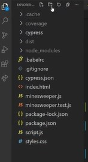

# Code Order

- here we'll talk about order of the code & code file structure

- important things when it comes related to the order of your code is that it's something that's easier for you to follow <br>
    & make the most important information of the code & the easiest to find & less important information is harder to find <br>
    - because with code it's a lot easier to find things that are at the top inside of your code file <br> 
        while things that are kind of shoved (little movement) in the middle or maybe shoved all the way at the bottom of file <br>
        they aren't easily found compared to some of the other stuff because maybe they don't take as much importance & so on

## Order of code with best practices ✅

- so generally when you're writing out your code , so what we can do is like find the stuff that's the most important <br>
    & put it towards the top of my file like 
    - Eg : inside minesweeper.js file , `export const TILE_STATUSES` global variable is important <br> 
        because we used them literally everywhere inside our code that's why it's defined at the top of the file <br>
        & those exported functions also like `export function createBoard()` , `export function markedTilesCount()` <br>
        `export function markTile()` , `export function revealTile()` , `export function checkWin()` , `export function checkLose()`<br>
        & `export function positionMatch()` are the top inside minesweeper.js file because these are most important functions in the file
    - & all of these exported functions are used throughout the code base all over the place , that's why these defined at the very top <br>
        but if we look down at the bottom of this file , then we'll see non exported functions <br>
        like `function replaceTile()` , `function nearbyTiles()` & these functions are just helper functions <br>
        & these functions doesn't matter a lot than those functions which are exported 

    - `Helper functions` : means that we use to make other code do things that we want it to do <br>
        means inside minesweeper.js file , non exported functions are helping those exported functions to do actual thing 💡💡💡
    - so we can put your most important functions at the top & you can keep all less important helper functions <br>
        all the way at the very bottom 💡💡💡
    
- another important thing that to create smaller files 
    - so the smaller your files the better because inside the minesweeper.js file <br>
        we could have taken all of these functions including helper functions <br>
        & we could have crammed (too full) them into this script.js file & due to this , this file would become pretty big <br>
        because it's already a fairly decent sized file right now but still it is pretty big <br>
        because we would have had additional functions & files & content added onto the end of this file 
    - & when you get started coding , it's really common just to put everything inside of this script.js file <br>
        & all of the things gonna work but still go back & refactor what are the things you can take out 💡💡💡
    - in our case inside minesweeper.js file , those exported functions make sense to be put into their own file <br>
        because those are separate from the main script.js file 
    - then we have to smaller files i.e minesweeper.js , script.js file instead of on really large file 💡💡💡

- another important when it comes to your file & order & layout of defining the variables 
    - not necessarily at the very top of your file & that's fine if variables used all over the place <br>
        but other times you may have a variable that's only needed in a specific place <br>
        so could be easy to find that variable in that one place only where it's needed 💡💡💡
    - so generally when you have larger & larger functions in files then it becomes more of a problem <br>
        but when you have really small functions like inside script.js file , `function checkGameEnd()` <br>
        & this function is really small like inside of it , we define `win` & `lose` variables <br>
        at the very top inside checkGameEnd() function because this function is so small <br>
        & it only depends on a couple of variables that's why we put them at the very top <br> 
        but if we have a larger function or a larger file that has variables (that are only needed) <br>
        in a specific subset of your function 
    - Eg : inside script.js file of minesweeper project , inside checkGameEnd() function <br>
        `if (lose)` statement putted way down & inside of it we have variable i.e `lose` that's only needed 💡💡💡
        - Eg : inside script.js file , inside checkGamEnd() function
            ```js
            function checkGameEnd() {
                const win = checkWin(board)
                const lose = checkLose(board)
                let text = '' // here defined at the very top

                if (win || lose) {
                    boardElement.addEventListener('click' , stopProp, { capture: true })
                    boardElement.addEventListener('contextmenu' , stopProp, { capture: true })
                }

                if (win) {
                    messageText.textContent = "You Win" 
                }

                if (lose) {
                    messageText.textContent = "You Lose"    
                    board.forEach(row => {
                        row.forEach(title => {
                            if (tile.status === TILE_STATUSES.MARKED) board = markTile(board, tile)
                            if (tile.mine) board = revealTile(board, tile)
                        })
                    })
                }
            }
            ```
            - we could store the value i.e `You Win` & `You Lose` inside `text` variable that we created
            ```js
            function checkGameEnd() {
                const win = checkWin(board)
                const lose = checkLose(board)
                let text = '' 

                if (win || lose) {
                    boardElement.addEventListener('click' , stopProp, { capture: true })
                    boardElement.addEventListener('contextmenu' , stopProp, { capture: true })
                }

                if (win) {
                    text = "You Win" 
                }

                if (lose) {
                    text = "You Lose"    
                    board.forEach(row => {
                        row.forEach(title => {
                            if (tile.status === TILE_STATUSES.MARKED) board = markTile(board, tile)
                            if (tile.mine) board = revealTile(board, tile)
                        })
                    })
                }

                // here at the end we can store the text
                messageText.textContent = text
            }
            ``` 
        - `Reason` : why would we define our `text` variable all the way up inside of this function <br> 
            but we could define before `if (win)` statement because we're using `text` variable <br>
            inside `if (win) & if (lose)` statements 💡💡💡
        - like this 
            ```js
            function checkGameEnd() {
                const win = checkWin(board)
                const lose = checkLose(board)

                if (win || lose) {
                    boardElement.addEventListener('click' , stopProp, { capture: true })
                    boardElement.addEventListener('contextmenu' , stopProp, { capture: true })
                }

                let text = '' 
                if (win) {
                    text = "You Win" 
                }

                if (lose) {
                    text = "You Lose"    
                    board.forEach(row => {
                        row.forEach(title => {
                            if (tile.status === TILE_STATUSES.MARKED) board = markTile(board, tile)
                            if (tile.mine) board = revealTile(board, tile)
                        })
                    })
                }

                // here at the end we can store the text
                messageText.textContent = text
            }
            ```
            - this would be fine instead of putting `text` variable at the top inside checkGameEnd() function <br>
                because we used `text` variable only used inside `if (win)` & `if (lose)` statements & nowhere else <br>
                so we defined it where it's actually needed , so that's why we didn't defined it at the top inside of this function <br>
            - & if we defined at the top inside of this function then it's going through a bunch of code (which are not using it) 💡💡💡

- last thing related to code order is more of a high-level picture 
    - of actually laying out your file & folder structure
    - means most of the projects we've done have been pretty small <br>
        so they've been maybe one or two JS files inside minesweeper project <br>
        & at this point we don't need to worry about folder structure
    - Eg : inside minesweeper project , right now file & folder structure is like this  
        
        - here we can see that files are not structured
    - `STEP 1` : create a source folder as `src`
        - inside src folder , put these files 
            ```
            - src folder 
                ↳ index.html
                ↳ minesweeper.js  
                ↳ minesweeper.test.js  
                ↳ script.js
                ↳ styles.css  
            ```
        - now inside `src` folder , we have all those files which contain actual code
      
    - `STEP 2` : inside `src` folder , create a folder for text as `__test__`
        ```
        - src folder 
            - __test__ folder 
              ↳ minesweeper.test.js  
            ↳ index.html
            ↳ minesweeper.js  
            ↳ script.js
            ↳ styles.css  
        ```
        - we're doing these stuff because so that in future we can correlate things with one another

    - & this is upto us & depends on project that which file & folder structure that we need to follow

## Discussion page

- `Ques` : Hi Kyle, so writing helper functions in ES5 syntax is still okay? I'm confused <br>
    when I should use ES5 or ES6 functions. The differences between both you have explained to pretty well, <br>
    but you didn't mention when to use which of them. Is there any rule or best practices? Thanks in advance :)
- `Ans by kyle` : It is entirely personal preference. I prefer to write top level functions as normal functions<br> 
    and I prefer to write callbacks as arrow functions. You can do all normal functions or all arrow functions <br>
    or some type or hybrid approach. Honestly, just pick whatever you think is best as it really doesn't matter. 💡💡💡
