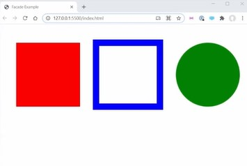

# Facade Pattern

- here we'll see faced pattern & it helps to deal with black boxes code & how we can kind of reduce coupling in our code ✔️✔️✔️

- in this lecture , we're gonna see another c-word i.e `complexity` & we're gonna approach this by using facade pattern ✔️✔️✔️

## About Design patterns

- Now , in programming , there's a bunch of things called design patterns 
    - & these design patterns are ways that we can write code that makes it easier to read & makes code overall clean

- one of the problems that kyle have with design patterns 
    - is that when we start to learn these design patterns then we start to put them all over our code <br>
        because we see the benefits of them , but we just kinda put them everywhere blindly <br>
        & pretty much this is done by everyone
    - & generally teaching & learning design patterns hardcore exactly what they all mean & what they do , so instead of this <br> 
        the important thing is to learn the concepts about design patterns & know why these are useful <br>
        & use in our code even if we didn't wrote exactly

- important is don't learn the design patterns , just understand the concept what they're doing ✔️✔️✔️

# Explanation of Facade pattern

- `Facade Pattern` : 
    - means to take complex code & to simplify it into easier to use code that we can repeat throughout the entire code base 💡💡💡

- inside index.html file 
    ```html
    <!DOCTYPE html>
    <html lang="en">
    <head>
        <meta charset="UTF-8">
        <meta http-equiv="X-UA-Compatible" content="IE=edge">
        <meta name="viewport" content="width=device-width, initial-scale=1.0">
        <script src="script.js" type="module"></script> <!-- make this script as type="module" -->
        <title>Facade Example</title>
    </head>
    <body style="margin: 0;">
        
    </body>
    </html>
    ```

- inside script.js file 
    ```js
    const canvas = document.createElement("canvas")
    canvas.height = window.innerHeight - 20
    canvas.width = window.innerWidth - 20
    document.body.append(canvas)

    const context = canvas.getContext("2d")

    // Draw square
    context.fillStyle = "red"
    context.fillRect(50, 50, 200, 200)

    // Draw square outline
    context.strokeStyle = "blue"
    context.lineWidth - 20
    context.strokeRect(300, 50, 200, 200)

    // Draw circle
    context.fillStyle = "green"
    context.arc(650, 105, 100, 0, Math.PI * 2)
    context.fill()

    document.addEventListener("keypress", e => {
        if (e.key === "c") {
            canvas.getContext("2d").clearRect(0, 0, canvas.width, canvas.height)
        }
    })
    ```
    - output : <br>
        

- so here we have three different shapes i.e square , rectangle , circle <br>
    & then we have an event listener setup that if we press the `c` key <br>
    then our entire canvas will be clear means delete all the canvas 💡💡💡

- now we'll make this code easier to read through facade pattern because it will hide all of the ugliness behind it 💡💡💡 <br>
    that's why it gets the name facade pattern 

- so we'll create a separate function for drawing those each shapes <br>
    we can create a class which can do this tasks or we can just create a like `util` file (which has all these functions) ✔️✔️✔️<br>
    but in our case we'll create a simple js file 

- `STEP 1` : create a js file as draw.js 
- `STEP 2` : inside script.js file , import stuff of draw.js inside script.js file 
    ```js
    import { drawSquare } from './draw.js'
    
    const canvas = document.createElement("canvas")
    canvas.height = window.innerHeight - 20
    canvas.width = window.innerWidth - 20
    document.body.append(canvas)

    const context = canvas.getContext("2d")

    // Draw square
    context.fillStyle = "red"
    context.fillRect(50, 50, 200, 200)

    // Draw square outline
    context.strokeStyle = "blue"
    context.lineWidth - 20
    context.strokeRect(300, 50, 200, 200)

    // Draw circle
    context.fillStyle = "green"
    context.arc(650, 105, 100, 0, Math.PI * 2)
    context.fill()

    document.addEventListener("keypress", e => {
        if (e.key === "c") {
            canvas.getContext("2d").clearRect(0, 0, canvas.width, canvas.height)
        }
    })
    ```
- `STEP 3` : inside draw.js file , 
    ```js
    export function drawSquare(canvas, {x, y, size , size , color}) {
        const context = canvas.getContext('2d')
        context.fillStyle = color
        context.fillRect(x, y, size, size)   
    }
    ```
    - `STEP 3.1` : inside script.js file , calling drawSquare() function
        ```js
        import { drawSquare } from './draw.js'
        
        const canvas = document.createElement("canvas")
        canvas.height = window.innerHeight - 20
        canvas.width = window.innerWidth - 20
        document.body.append(canvas)

        const context = canvas.getContext("2d")

        drawSquare(canvas, { x: 50, y: 50, size: 200, color: "red" })

        // Draw square outline
        context.strokeStyle = "blue"
        context.lineWidth - 20
        context.strokeRect(300, 50, 200, 200)

        // Draw circle
        context.fillStyle = "green"
        context.arc(650, 105, 100, 0, Math.PI * 2)
        context.fill()

        document.addEventListener("keypress", e => {
            if (e.key === "c") {
                canvas.getContext("2d").clearRect(0, 0, canvas.width, canvas.height)
            }
        })
        ```
    - now we don't need to worry about width & height because that only `size` property will be same for width & height <br> 
        so here we simplify the stuff , so we have one function i.e drawSquare() function <br>
        & we don't need to worry about this function about drawSquare() function is doing 💡💡💡 
    - & even we removed the comment i.e `// draw square` from inside script.js file because `drawSquare()` function is self-explanatory

- let's do same thing for other shapes
- `STEP 4` : inside draw.js file , let's create function for outline square
    ```js
    export function drawSquare(canvas, {x, y, size , size , color}) {
        const context = canvas.getContext('2d')
        context.fillStyle = color
        context.fillRect(x, y, size, size)   
    }

    export function drawSquareOutline(canvas, { x, y, size, color, lineWidth }) {
        const context = canvas.getContext("2d")
        context.strokeStyle = color
        context.lineWidth = lineWidth
        context.strokeRect(x, y, size, size)
    }
    ```
    - `STEP 4.1` : inside script.js file , import that `drawSquareOutline` function
        ```js
        import { drawSquare, drawSquareOutline } from './draw.js'
        
        const canvas = document.createElement("canvas")
        canvas.height = window.innerHeight - 20
        canvas.width = window.innerWidth - 20
        document.body.append(canvas)

        const context = canvas.getContext("2d")

        drawSquare(canvas, { x: 50, y: 50, size: 200, color: "red" })

        drawSquareOutline(canvas, { x: 300, y: 50, size: 200, lineWidth: 20, color: 'blue'})

        // Draw circle
        context.fillStyle = "green"
        context.arc(650, 105, 100, 0, Math.PI * 2)
        context.fill()

        document.addEventListener("keypress", e => {
            if (e.key === "c") {
                canvas.getContext("2d").clearRect(0, 0, canvas.width, canvas.height)
            }
        })
        ```
    - the best thing about facade pattern is we're really taking complex code & creating a simple interface of that code <br>
        such as code of drawSquareOutline function & due to this , all the complexity is hidden away 💡💡💡 
    - we also talk about black boxes & abstraction , so here we created those black boxes & abstractions for other programmers <br>
        because inside script.js file , we called drawSquare() function & doesn't matter what it does <br>
        because we never need to look inside draw.js file 💡💡💡
        - so just need to care about inputs & outputs of it (like drawSquare() function) 💡💡💡

- `STEP 5` : inside draw.js file , let's create a function for circle
    ```js
    export function drawSquare(canvas, {x, y, size , size , color}) {
        const context = canvas.getContext('2d')
        context.fillStyle = color
        context.fillRect(x, y, size, size)   
    }

    export function drawSquareOutline(canvas, { x, y, size, color, lineWidth }) {
        const context = canvas.getContext("2d")
        context.strokeStyle = color
        context.lineWidth = lineWidth
        context.strokeRect(x, y, size, size)
    }

    export function drawCircle(canvas , { x, y, size, color }) {
        const context = canvas.getContext("2d")
        context.fillStyle = color
        context.arc(x, y, size, 0, Math.PI * 2)
        context.fill()
    }
    ```
    - `STEP 5.1` : inside script.js file , import that `drawCircle` function 
        ```js
        import { drawSquare, drawSquareOutline, drawCircle } from './draw.js'
        
        const canvas = document.createElement("canvas")
        canvas.height = window.innerHeight - 20
        canvas.width = window.innerWidth - 20
        document.body.append(canvas)

        const context = canvas.getContext("2d")

        drawSquare(canvas, { x: 50, y: 50, size: 200, color: "red" })

        drawSquareOutline(canvas, { x: 300, y: 50, size: 200, lineWidth: 20, color: 'blue'})

        drawCircle(canvas, { x: 650, y: 150, size: 100, color: "green" })

        document.addEventListener("keypress", e => {
            if (e.key === "c") {
                canvas.getContext("2d").clearRect(0, 0, canvas.width, canvas.height)
            }
        })
        ```

- `STEP 6` : inside draw.js file , make a exported function for cleaning when user press 'c' key
    ```js
    export function drawSquare(canvas, {x, y, size , size , color}) {
        const context = canvas.getContext('2d')
        context.fillStyle = color
        context.fillRect(x, y, size, size)   
    }

    export function drawSquareOutline(canvas, { x, y, size, color, lineWidth }) {
        const context = canvas.getContext("2d")
        context.strokeStyle = color
        context.lineWidth = lineWidth
        context.strokeRect(x, y, size, size)
    }

    export function drawCircle(canvas , { x, y, size, color }) {
        const context = canvas.getContext("2d")
        context.fillStyle = color
        context.arc(x, y, size, 0, Math.PI * 2)
        context.fill()
    }

    export function clear(canvas) {
        const context = canvas.getContext("2d")
        context.clearRect(0, 0, canvas.Width, canvas.height)
    }
    ```
    - `STEP 6.1` : inside script.js file , import that clear() function
        ```js
        import { drawSquare, drawSquareOutline, drawCircle, clear } from './draw.js'
        
        const canvas = document.createElement("canvas")
        canvas.height = window.innerHeight - 20
        canvas.width = window.innerWidth - 20
        document.body.append(canvas)

        const context = canvas.getContext("2d")

        drawSquare(canvas, { x: 50, y: 50, size: 200, color: "red" })

        drawSquareOutline(canvas, { x: 300, y: 50, size: 200, lineWidth: 20, color: 'blue'})

        drawCircle(canvas, { x: 650, y: 150, size: 100, color: "green" })

        document.addEventListener("keypress", e => {
            if (e.key === "c") {
                clear(canvas)
            }
        })
        ```

- & if we're creating a library to draw square then we can use it inside draw.js file like this 
    ```js
    import library from 'library'

    export function drawSquare(canvas, {x, y, size , size , color}) {
        library.drawRect(x, y, size, size, color)
        // const context = canvas.getContext('2d')
        // context.fillStyle = color
        // context.fillRect(x, y, size, size)   
    }

    export function drawSquareOutline(canvas, { x, y, size, color, lineWidth }) {
        const context = canvas.getContext("2d")
        context.strokeStyle = color
        context.lineWidth = lineWidth
        context.strokeRect(x, y, size, size)
    }

    export function drawCircle(canvas , { x, y, size, color }) {
        const context = canvas.getContext("2d")
        context.fillStyle = color
        context.arc(x, y, size, 0, Math.PI * 2)
        context.fill()
    }

    export function clear(canvas) {
        const context = canvas.getContext("2d")
        context.clearRect(0, 0, canvas.Width, canvas.height)
    }
    ```

- now facade pattern is super powerful because it really cleans up our code drastically <br>
    because now all of the complexity is hidden away inside draw.js file <br>
    & facade pattern makes our code not as tightly coupled to the actual implementation details <br>
    means it wrap all the complex logic & then expose a simple interface 💡💡💡 <br>
    so we can simple interface by using concept of facade pattern

- Eg : we're fetching something & that fetch() function needs additional features <br>
    then we can create a helper function for it like this 💡💡💡
    ```js
    function getFetch(url, params) {
        fetch(url, params).then()
    }
    ```
    - & let's in the future we replace this code with `Axios` library then code will be kinda like this 
        ```js
        function getFetch(url, params) {
            axios(url, params).then()
        }
        ```
    - but still parameters remain same , so instead of changing `fetch` word everywhere into `axios` word <br>
        we can just change inside this one helper function & we good to go 💡💡💡
