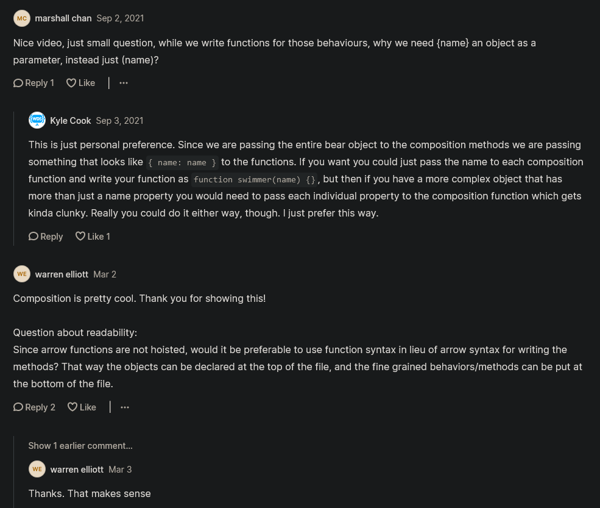

# Composition VS Inheritance

- here we'll see different b/w composition VS Inheritance

## Example 

- inside script.js file 
    ```js
    class Animal {
        constructor(name) {
            this.name = name
        }

        attack() {
            console.log(`${this.name} attacked`)
        }

        sleep() {
            console.log(`${this.name} slept`)
        }
    }

    class Bear extends Animal {
        walk() {
            console.log(`${this.name} walked`)
        }
    }

    class Shark extends Animal {
        swim() {
            console.log(`${this.name} swam`)
        }
    }

    class Bird extends Animal {
        fly() {
            console.log(`${this.name} flew`)
        }
    }

    const bear = new Bear("Bear")
    bear.attack()
    bear.walk()
    bear.sleep()

    const shark = new shark("shark")
    shark.attack()
    shark.swim()
    shark.sleep()

    const bird = new Bird("Bird")
    bird.attack()
    bird.fly()
    bird.sleep()

    /* output : Bear attacked
                Bear walked
                Bear slept
                Shark attacked
                Shark swam
                Shark slept
                Bird attacked
                Bird flew
                Bird slept
    */
    ```
    - here `Animal` is a base class with `attack & sleep` functions & `Bear , Shark , Bird` these classes extending animal 
    - so these different sub classes sharing some functionality with that base class i.e `Animal` 💡💡💡 <br>
    
- but inside `Animal` base class , there's already tons of problems <br>
    - Eg : a bird can walk & can fly but we also want to include the ability for that bird to walk 
    - but we'll can notice that `walk()` functionality is builtin inside `Bear` sub-class <br>
        & we can also put `walk()` functionality into an `Animal` base class 
    - so one thing we can do is put `walk()` functionality inside `Bird` sub-class like this 
        ```js
        class Animal {
            constructor(name) {
                this.name = name
            }
            attack() {
                console.log(`${this.name} attacked`)
            }
            sleep() {
                console.log(`${this.name} slept`)
            }
        }

        class Bear extends Animal {
            walk() {
                console.log(`${this.name} walked`)
            }
        }

        class Bird extends Animal {
            fly() {
                console.log(`${this.name} flew`)
            }
            walk() {
                console.log(`${this.name} walked`)
            }
        }

        const bear = new Bear("Bear")
        bear.attack()
        bear.walk()
        bear.sleep()

        const bird = new Bird("Bird")
        bird.attack()
        bird.fly()
        bird.sleep()
        bird.walk() // now we can call walk() method
        ```   
        - but now we have that duplicate walk() function in two different places i.e inside `Bear & Bird` sub-classes <br>
            but we don't want to duplicate 
    
    - another things that we can do is extend the `Bear` sub class to eliminate duplicates like this 
        ```js
        class Bear extends Animal {
            walk() {
                console.log(`${this.name} walked`)
            }
        }

        class Bird extends Bear {
            fly() {
                console.log(`${this.name} flew`)
            }
        }

        const bird = new Bird("Bird")
        bird.walk()
        ```
        - but still technically `Bird` sub-class has the walk function & bird is different than Bear animal <br>
            & any thing we create inside `Bear` sub-class then `Bird` sub-class has the access to use those stuff of `Bear` sub-class
        - so we need to use composition way to avoid duplicates 💡💡💡

- `Composition` means instead of thinking about objects as in what they're means what name those objects has 
    - we think about object as in what do they do means like bear can walk , sleep , etc as same with other objects 💡💡💡

- Eg : of composition
    - let's say there's a animation who walks , so we can create a walk function outside the class like this 
        ```js
        class Animal {
            constructor(name) {
                this.name = name
            }

            attack() {
                console.log(`${this.name} attacked`)
            }

            sleep() {
                console.log(`${this.name} slept`)
            }
        }

        class Bear extends Animal {
            walk() {
                console.log(`${this.name} walked`)
            }
        }

        class Shark extends Animal {
            swim() {
                console.log(`${this.name} swam`)
            }
        }

        class Bird extends Animal {
            fly() {
                console.log(`${this.name} flew`)
            }
        }

        const walker = ({ name }) => ({ // here we used arrow function to clean code little bit 
            walk() {
                console.log(`${name} walked`)
            } , 
        })

        // same thing we can do for fly
        const flyer = ({ name }) => ({ 
            fly() {
                console.log(`${name} flew`)
            } , 
        })

        // same thing for swim
        const swimmer = ({ name }) => ({ 
            swim() {
                console.log(`${name} swam`)
            } , 
        })

        // same thing for attack
        const attacker = ({ name }) => ({ 
            attack() {
                console.log(`${name} attacked`)
            } , 
        })

        // same thing for sleep
        const sleeper = ({ name }) => ({ 
            sleep() {
                console.log(`${name} slept`)
            } , 
        })

        const bear = new Bear("Bear")
        bear.attack()
        bear.walk()
        bear.sleep()

        const shark = new shark("shark")
        shark.attack()
        shark.swim()
        shark.sleep()

        const bird = new Bird("Bird")
        bird.attack()
        bird.fly()
        bird.sleep()

        ```
        - so the whole idea of composition means we can't inherit from multiple things <br>
            but we can compose multiple things together to make an object 💡💡💡

    - let's create create a symbol function for those each animals
        ```js
        class Animal {
            constructor(name) {
                this.name = name
            }

            attack() {
                console.log(`${this.name} attacked`)
            }

            sleep() {
                console.log(`${this.name} slept`)
            }
        }

        class Bear extends Animal {
            walk() {
                console.log(`${this.name} walked`)
            }
        }

        class Shark extends Animal {
            swim() {
                console.log(`${this.name} swam`)
            }
        }

        class Bird extends Animal {
            fly() {
                console.log(`${this.name} flew`)
            }
        }

        const walker = ({ name }) => ({ 
            walk() {
                console.log(`${name} walked`)
            } , 
        })

        const flyer = ({ name }) => ({ 
            fly() {
                console.log(`${name} flew`)
            } , 
        })

        const swimmer = ({ name }) => ({ 
            swim() {
                console.log(`${name} swam`)
            } , 
        })

        const attacker = ({ name }) => ({ 
            attack() {
                console.log(`${name} attacked`)
            } , 
        })

        const sleeper = ({ name }) => ({ 
            sleep() {
                console.log(`${name} slept`)
            } , 
        })

        function createBear(name) { // this function will return a new bear object
            const bear = { name }
            return { ...bear, ...attacker(bear), ...sleeper(bear), ...walker(bear) }
        }

        const bear = createBear() 
        bear.attack()
        bear.walk()
        bear.sleep()

        /* output : Bear attacked 
                    Bear walked
                    Bear slept
        */
        ```
    - now if we want to create any object which has functionality related to Bear animal like sharknado like this 
        ```js
        function createSharknado(name) { 
            const animal = { name }
            return { 
                ...animal , 
                ...attacker(animal) , 
                ...sleeper(animal) , 
                ...swimmer(animal) , 
                ...flyer(animal) 
            }
        }

        const sharknado = createSharknado('Sharknado')
        sharknado.sleep()
        sharknado.swim()
        sharknado.fly()

        /* output : sharknado slept 
                    sharknado swam
                    sharknado flew
        */
        ```
    - so we've circumvented (means find a clever way to solve) the thing that we couldn't do through inheritance ✔️ <br>
        so in inheritance , we already had an animal that could fly eg : `class Bird extends Animal` which can fly , <br>
        `class Shark extends Animal` which can swim , so we could't combine them together very easily all 💡💡💡
    - but by using composition i.e walker , flyer , swimmer , attacker , sleeper , so through these compositions <br>
        we have different behaviors for all the different things that our animals can do 💡💡💡
    - & then all we do is every we create an animal then we just combined together all those different behaviors like this <br>
        `return { ...bear, ...attacker(bear), ...sleeper(bear), ...walker(bear) }` for `bear` & same thing we did for `sharknado` 
    - & huge benefits about of composition that we don't have to worry about inheritance & making messing with things <br>  
        because these things can be change based on the ability of the animal 
        - & if we create new things than those new things are gonna overlap <br>
            with old things & they're not gonna inherit very cleanly , so that's the huge problem with inheritance <br>
            & you're gonna have a bunch of different duplicate methods that we don't need 
        - Eg : like some type of bird can swim & shark also can swim , maybe we'll end up of having swim() function two times 💡💡💡

- now if you still really wanted to use the class way of doing things then we can use composition with classes 
- `STEP 1` : create a file as mixins.js 
- `STEP 2` : copy these composition lines of code from script.js file i.e 
    ```js
    const walker = ({ name }) => ({ 
        walk() {
            console.log(`${name} walked`)
        } , 
    })

    const flyer = ({ name }) => ({ 
        fly() {
            console.log(`${name} flew`)
        } , 
    })

    const swimmer = ({ name }) => ({ 
        swim() {
            console.log(`${name} swam`)
        } , 
    })

    const attacker = ({ name }) => ({ 
        attack() {
            console.log(`${name} attacked`)
        } , 
    })

    const sleeper = ({ name }) => ({ 
        sleep() {
            console.log(`${name} slept`)
        } , 
    })
    ```
    - `STEP 2.1` : paste them inside mixins.js file 
        ```js
        const walker = ({ name }) => ({ 
            walk() {
                console.log(`${name} walked`)
            } , 
        })

        const flyer = ({ name }) => ({ 
            fly() {
                console.log(`${name} flew`)
            } , 
        })

        const swimmer = ({ name }) => ({ 
            swim() {
                console.log(`${name} swam`)
            } , 
        })

        const attacker = ({ name }) => ({ 
            attack() {
                console.log(`${name} attacked`)
            } , 
        })

        const sleeper = ({ name }) => ({ 
            sleep() {
                console.log(`${name} slept`)
            } , 
        })
        ```
    - so we just did this because we want to be able to inherit all these different behaviors

- `STEP 3` : now inside mixins.js file , let's inherit those different behaviors
    ```js
    export const WalkerMixin = superclass => class extends superclass {
        walk() {
            console.log(`${this.name} walked`)
        }
    }

    export const FlyerMixin = superclass => class extends superclass {
        fly() {
            console.log(`${this.name} flew`)
        }
    }

    const walker = ({ name }) => ({ 
        walk() {
            console.log(`${name} walked`)
        } , 
    })

    const flyer = ({ name }) => ({ 
        fly() {
            console.log(`${name} flew`)
        } , 
    })

    const swimmer = ({ name }) => ({ 
        swim() {
            console.log(`${name} swam`)
        } , 
    })

    const attacker = ({ name }) => ({ 
        attack() {
            console.log(`${name} attacked`)
        } , 
    })

    const sleeper = ({ name }) => ({ 
        sleep() {
            console.log(`${name} slept`)
        } , 
    })
    ```
    - `STEP 3.1` : inside script.js file , import those mixin
        ```js
        import { WalkerMixin, FlyerMixin } from './mixins.js'

        class Animal {
            constructor(name) {
                this.name = name
            }

            attack() {
                console.log(`${this.name} attacked`)
            }

            sleep() {
                console.log(`${this.name} slept`)
            }
        }

        class Bear extends FlyerMixin(WalkerMixin(Animal)) {
            walk() {
                console.log(`${this.name} walked`)  
            }
        }

        class Shark extends Animal {
            swim() {
                console.log(`${this.name} swam`)
            }
        }

        class Bird extends Animal {
            fly() {
                console.log(`${this.name} flew`)
            }
        }

        const walker = ({ name }) => ({ 
            walk() {
                console.log(`${name} walked`)
            } , 
        })

        const flyer = ({ name }) => ({ 
            fly() {
                console.log(`${name} flew`)
            } , 
        })

        const swimmer = ({ name }) => ({ 
            swim() {
                console.log(`${name} swam`)
            } , 
        })

        const attacker = ({ name }) => ({ 
            attack() {
                console.log(`${name} attacked`)
            } , 
        })

        const sleeper = ({ name }) => ({ 
            sleep() {
                console.log(`${name} slept`)
            } , 
        })
        ```
    - so `FlyerMixin(WalkerMixin(Animal))` means WalkerMixin is extending Animal <br>
        & then we're extending `Animal` super class & adding a fly functionality <br> 
        & we can do this as many time as we want depending on what our actual needs are <br>
        we just want to add WalkerMixin functionality to bear like this 
    - `STEP 3.2` : inside script.js file , adding walker functionality to bear only 
        ```js
        import { WalkerMixin, FlyerMixin } from './mixins.js'

        class Animal {
            constructor(name) {
                this.name = name
            }

            attack() {
                console.log(`${this.name} attacked`)
            }

            sleep() {
                console.log(`${this.name} slept`)
            }
        }

        class Bear extends WalkerMixin(Animal) { }

        class Bird extends FlyerMixin(WalkerMixin(Animal)) { }

        const bear = new Bear("Bear")
        bear.attack()
        bear.walk()
        bear.sleep()

        const bird = new Bird("Bird")
        bear.attack()
        bear.fly()
        bear.sleep()
        bear.walk()

        /* output : Bear attacked
                    Bear walked
                    Bear slept
                    Bird attacked
                    Bird flew
                    Bird slept
                    Bird walked 
        */
        ```
    - so this is one way that we can do composition with actual classes 💡💡💡
        - so we just need to a mixin like this 
            ```js
            export const FlyerMixin = superclass => class extends superclass {
                fly() {
                    console.log(`${this.name} flew`)
                }
            }
            ```

- if you want to do with class way then 
    - `STEP 1` : inside mixin.js file , 
        ```js
        export const WalkerMixin = superclass => class extends superclass {
            walk() {
                console.log(`${this.name} walked`)
            }
        }

        export const FlyerMixin = superclass => class extends superclass {
            fly() {
                console.log(`${this.name} flew`)
            }
        }

        const walker = ({ name }) => ({ 
            walk() {
                console.log(`${name} walked`)
            } , 
        })

        const flyer = ({ name }) => ({ 
            fly() {
                console.log(`${name} flew`)
            } , 
        })

        const swimmer = ({ name }) => ({ 
            swim() {
                console.log(`${name} swam`)
            } , 
        })

        const attacker = ({ name }) => ({ 
            attack() {
                console.log(`${name} attacked`)
            } , 
        })

        const sleeper = ({ name }) => ({ 
            sleep() {
                console.log(`${name} slept`)
            } , 
        })
        ```

## said by kyle ✅

- any way we can do but the important thing is why we want to do composition VS why you want to do inheritance 💡💡💡
- `inheritance` : is great when you have a really strict structure which you know is that it never gonna change 
    - & you know follows a very strict hierarchy 
    - Eg : & you have top & bottom thing & so on.. & everything just inherits perfectly & this happens very, very rarely <br>
        because we really never see this type of situations which can fit inheritance perfectly

- `composition` : is great where you have a situation that you know is gonna change 
    - & you know that your inheritance structure isn't perfect
    - so you're gonna take functionalities means you want to describe your objects based on functionalities 💡💡💡
    - Eg : bear & bird both can walk & still through base class both can takes features through inheritance <br>
        but composition is more about describing what things can do instead of describing what things are 💡💡💡

- if you're building a program then always try more composition way than inheritance 
    - because composition is much more flexible & easier to change + scale things in the future 
    - Eg : inside script.js file ,
        ```js
        class Bird extends FlyerMixin(WalkerMixin(Animal)) {}
        class Bird extends SwimmerMixin(FlyerMixin(WalkerMixin(Animal))) {} 
        ```
        - so if we have a animal which can walk + fly + swim then we can easily change things 
    - so composition makes things to add functionality , remove functionality that's why it's useful 💡💡💡

- so just don't go in technically b/w these two , just think in the way of composition 
    - & how you can make your code more flexible when you combine different things together instead of just thinking 
    - & how you can apply composition concept directly only to this one situation of OOPS
    - & generally how we can make our code easier when we combine things together in different use cases 

## --- Extra stuff of composition vs inheritance ---

- videos 
    - https://www.youtube.com/watch?v=nnwD5Lwwqdo&ab_channel=WebDevSimplified
    - https://www.youtube.com/watch?v=fbpXQ0e8Mp8&ab_channel=SteveGriffith-Prof3ssorSt3v3
    - https://www.youtube.com/watch?v=8nckJU3dalc&ab_channel=DaveGray
    - https://www.youtube.com/watch?v=8-r0GspyioI&ab_channel=Sakshamthecomputerguy
    - https://www.youtube.com/watch?v=m1VrvopYXxM&ab_channel=blockAshAcademy
    - https://www.youtube.com/watch?v=wfMtDGfHWpA&ab_channel=FunFunFunction

- blogs 
    - https://www.geeksforgeeks.org/difference-between-composition-and-inheritance-in-javascript/
    - https://blog.bitsrc.io/inheritance-vs-composition-which-is-better-for-your-javascript-project-16f4a077de9
    - https://javascript.plainenglish.io/inheritance-is-a-vs-composition-has-a-in-javascript-98fb96dfa0e6
    - https://ui.dev/javascript-inheritance-vs-composition
    - https://dev.to/bhaveshdaswani93/composition-vs-inheritance-318l
    - https://medium.com/free-code-camp/javascript-inheritance-vs-composition-ec8ca848b6
    - https://medium.com/front-end-weekly/classless-javascript-composition-over-inheritance-6b27c35893b1

## discussion page


