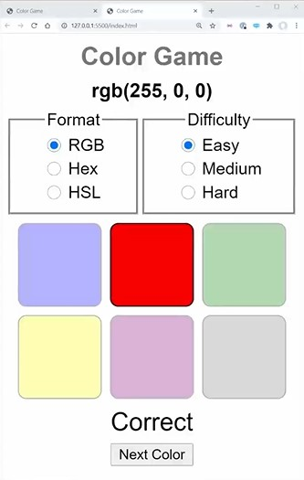

# Color Game Introduction

- here in this project , we'll use all the clean code concept 

## starter code 

<details>
    <summary>index.html file</summary>

```html
<!DOCTYPE html>
<html lang="en">
<head>
  <meta charset="UTF-8">
  <meta http-equiv="X-UA-Compatible" content="IE=edge">
  <meta name="viewport" content="width=device-width, initial-scale=1.0">
  <link rel="stylesheet" href="styles.css">
  <title>Color Game</title>
</head>
<body>
  <header class="header">
    <h2 class="title">Color Game</h2>
    <h3 class="color-string">rgb(255, 0, 0)</h3>
    <form class="form">
      <fieldset>
        <legend>Format</legend>
        <div class="radio-group">
          <input type="radio" name="format" id="rgb" value="rgb" checked>
          <label for="rgb">RGB</label>
          <input type="radio" name="format" id="hex" value="hex">
          <label for="hex">Hex</label>
          <input type="radio" name="format" id="hsl" value="hsl">
          <label for="hsl">HSL</label>
        </div>
      </fieldset>
      <fieldset>
        <legend>Difficulty</legend>
        <div class="radio-group">
          <input type="radio" name="difficulty" id="easy" value="easy" checked>
          <label for="easy">Easy</label>
          <input type="radio" name="difficulty" id="medium" value="medium">
          <label for="medium">Medium</label>
          <input type="radio" name="difficulty" id="hard" value="hard">
          <label for="hard">Hard</label>
        </div>
      </fieldset>
    </form>
  </header>
  <div class="color-grid">
    <button class="wrong" disabled style="background-color: blue;"></button>
    <button disabled style="background-color: red;"></button>
    <button class="wrong" disabled style="background-color: green;"></button>
    <button class="wrong" disabled style="background-color: yellow;"></button>
    <button class="wrong" disabled style="background-color: purple;"></button>
    <button class="wrong" disabled style="background-color: grey;"></button>
  </div>
  <div class="results">
    <div>Correct</div>
    <button>Next Color</button>
  </div>
</body>
</html>
```
</details>

<details>
    <summary>styles.css file</summary>

```js
body {
  font-family: sans-serif;
}

.title, .color-string {
  text-align: center;
  margin: .5rem;
}

.title {
  color: #777;
}

.form {
  display: flex;
}

.form fieldset {
  flex-grow: 1;
  text-align: center;
}

.radio-group {
  display: grid;
  justify-content: center;
  justify-items: flex-start;
  grid-template-columns: auto auto;
  gap: .25rem;
}

.radio-group > * {
  cursor: pointer;
}

.color-grid {
  display: grid;
  gap: .5rem;
  justify-content: center;
  max-width: 16rem;
  margin: auto;
  padding: .5rem;
  grid-template-columns: repeat(auto-fill, 5rem);
  grid-auto-rows: 5rem;
}

.color-grid > * {
  border-radius: .5rem;
  border: 1px solid black;
  padding: 0;
  margin: 0;
}

.color-grid > :disabled {
  cursor: default;
}

.color-grid > .wrong {
  opacity: .3;
}

.results {
  text-align: center;
  font-size: 1.5rem;
}

.results.hide {
  display: none;
}

button {
  cursor: pointer;
}
```
</details>

## What we're gonna do in this project



- `working example of this project`
    - it gives us a value in either RGB , HEX or HSL inside format section 
    - & we'll have difficultly section , i.e Easy , Medium , Hard
    
- `what we need to do`
    - we need to define colors down inside that grid
        - so we need to guess the color from that grid based on color that have given on top in rgb or hex or hsl format
    - & then the movement we click on correct color then we'll get `correct` message on bottom & other colors will be hide like this 
      
      - & then we'll get `next color` button also 
      - but if click on wrong one then we'll get `wrong` message & then correct one will be highlighted & others will be little blur <br>
        - & then we'll get `next color` button 
    - & if change the format of color then colors which are inside the grid will also change & same with if we change difficulty
    - & if we select `hard` then we'll get those colors which are more similar with each other to make little bit difficult <br>
      but if select `medium` then we'll get colors which are slightly similar with each other <br>
      & if we select `Easy` then we'll get clearly different colors to identify a correct color clearly

- & this project done little bit trickiness

## discussion page


