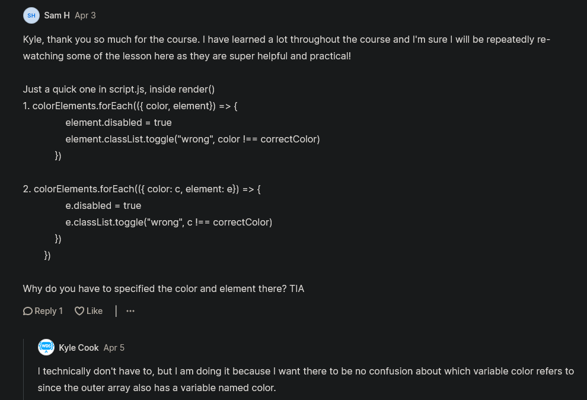

# Color Game Walkthrough

- only explanation of this project

## Explanation of color game project with clean code + more concepts 

- inside index.html file , put putted the hard coded values <br>
    & right now `Next Color` button doesn't do anything 
- we have `format` section which contain different formats to choose & each format defines everything related to the game <br>
    & `Difficulty` section is like a configuration option means configures how these formatters work

- `STEP 1` : create a js file as script.js file 
    - `STEP 1.1` : inside index.html file , link that script.js file 
        ```html
        <head>
            <meta name="viewport" content="width=device-width, initial-scale=1.0">
            <link rel="stylesheet" href="styles.css">
            <script src="script.js" type="module"></script>
        </head>
        ```

- `STEP 2` : inside script.js file , let's write pseudo code 
    ```js
    // Formatter
    // Difficulty - Config for the formatter

    // here we're creating some functions 
    // Render - every time page loads, on change of format, on change of difficulty
        // 1. Get a formatter
        // 2. Configure formatter based on difficulty
        // 3. Generate colors
        // 4. Render colors
        // 5. Handle clicking a color

    // Generate correct color
    // Generate similar colors based on difficulty
    ```
    - `what we need to do & what these pseudo codes means` : 
        - so we need to render out this view with new colors
        - `Generate colors` : is everything of our application like rendering out things , 
            - handling clicks , getting values from the DOM , 
            - so ultimately means this generate colors means everything of our application
        - & `Generate correct color` : means we need to generate a color that we want to display up <br>
            & `Generate similar colors based on difficulty` : means we need to generate similar colors based on difficulty <br>
            so these both pseudo code will be everything inside of our application 
        - & we need to generate those colors inside the grid based on the formatter that we're using 
            - so we have an RGB class , a hex class & an HSL class 
            - so we need to make a functions for each format colors 
            - & we're gonna have a generate similar function which allows us to pass it a color & generate a similar color <br>
                based on the difficulty we supplied 💡💡💡

- `STEP 3` : create a file as `Rgb.js` 
    - `Note` : `R` should be capital of this `Rgb.js` file because we'll make it as a class
    - `STEP 3.1` : inside `Rbg.js` file 
        ```js
        export default class Rgb {
            constructor(r, g, b) {
                this.r = r
                this.g = g
                this.b = b
            } 

            // we made this function as static because we want to call this function outside through Rgb class 💡💡💡
            static generate() { 
                return new Rgb(randomValue, randomValue, randomValue) 
            }

            generateSimilar() {

            }
        }
        ```
        - so `static generate()` function will generate just a completely random RGB value 💡💡💡 
        - so how exactly are we gonna get these random values 
            - so we just need to get a random number b/w zero & 255 because RGB goes between zero & 255 💡💡💡
            - so to define that first value of rbg(255,0,0) then just create a constant variable 

    - `STEP 3.2` : inside Rgb.js file , working on `static generator()` function
        ```js
        const MAX_RGB_VALUE = 255 // this 255 is a maximum RGB value

        export default class Rgb {
            constructor(r, g, b) {
                this.r = r
                this.g = g
                this.b = b
            } 

            static generate() { 
                return new Rgb(
                    Math.floor(Math.random() * (MAX_RGB_VALUE + 1)), 
                    Math.floor(Math.random() * (MAX_RGB_VALUE + 1)), 
                    Math.floor(Math.random() * (MAX_RGB_VALUE + 1)) 
                ) 
            }

            generateSimilar() {

            }
        }
        ``` 
        - `Math.floor(Math.random() * (MAX_RGB_VALUE + 1))` means 
            - `Math.random()` will give give b/w 0 to 1
            - & `(MAX_RGB_VALUE + 1)` this will b/w the value from 0 to 255 , here `255` is a max value in RGB format 
            - `Math.floor()` will covert that decimal number into whole number 💡💡💡
                
        - & inside `static generator()` function
            - we actually called this `Math.floor(Math.random() * (MAX_RGB_VALUE + 1))` line of code three different times
            - now through this `static generator()` function we can generate a new RGB value  
            
    - now to test these code till we wrote then 
    - `STEP 3.3` : inside script.js file , just testing code till yet we wrote 
        ```js
        import Rgb from "./Rgb.js"

        console.log(Rgb.generate())
        ```
        - output : inside console tab , we'll get that `Rgb` printed
            - & open it the we'll get value of r , g & b like this Rgb {r: 52, g: 245, b: 135} <br>
                & this will be random value of r , g & b from 0 to 255 💡💡💡
            - & every time if we refresh the page then we'll get random new value for r , g & b as a output
            
        - so `Math.floor(Math.random() * (MAX_RGB_VALUE + 1))` this line of code serves one single purpose
            - i.e it's to get a random number b/w 0 to 255 💡💡💡

    - `STEP 3.4` : inside Rgb.js file , making a helper function to generate random number for r , g & b
        ```js
        const MAX_RGB_VALUE = 255 

        export default class Rgb {
            constructor(r, g, b) {
                this.r = r
                this.g = g
                this.b = b
            } 

            static generate() { 
                return new Rgb(randomNumber(MAX_RGB_VALUE), randomNumber(MAX_RGB_VALUE), randomNumber(MAX_RGB_VALUE)) 
            }

            generateSimilar() {

            }
        }

        function randomNumber(max) {
            Math.floor(Math.random() * (max + 1))
        }
        ```
        - output : we'll get the output perfectly fine

    - the next function that we need to work on i.e generateSimilar() function
        - so it'll take the color that currently we have inside r , b & g
        - & the way that we'll going to change the difficulty is by determining how similar VS how different these numbers are 
            - because on easy mode , we want it to be able to generate numbers that are kind of different <br>
                means in this case , we don't want those numbers should be exactly similar each other
            - while on hard mode , we want these numbers to be very similar to my actual value 💡💡💡 

    - `STEP 3.5` : inside Rgb.js file , 
        - `for easy difficulty` : we don't want the number to be any closer than 20% to this value
            - so if we had a range of 100 different possible values then that means on easy difficulty
            - means for easy mode : we want range from 20 to 100 , so at least 20% away from the current value
        - `for medium difficulty` : we want at least 20% but max will be only 50% 
            - so that random value on the medium difficulty will be either b/w 20 to 50 or 90 to 100
        - `for hard difficulty` : in this that value will be b/w 20% to 30% 
            - so that value will be very close together with our current value
        - `Note` : value of 254 & 255 in RBG is negligible & it's impossible to tell the difference b/w those
            - so as long as there's a 20% difference then that means there's at least enough difference <br>  
                that the people have a chance to guess what it is 
            - & even 20% difference is not that much & it's really difficult to guess
        ```js
        const MAX_RGB_VALUE = 255 

        export default class Rgb {
            constructor(r, g, b) {
                this.r = r
                this.g = g
                this.b = b
            } 

            static generate() { 
                return new Rgb(randomNumber(MAX_RGB_VALUE), randomNumber(MAX_RGB_VALUE), randomNumber(MAX_RGB_VALUE)) 
            }

            generateSimilar() {

            }
        }

        function randomNumber(max) {
            Math.floor(Math.random() * (max + 1))
        }

        // Easy: 20% to 100%
        // Medium: 20% to 50%
        // Hard: 20% to 30% 
        ```
        - & also the nice that that we used `%` here is that it's really easy to scale <br>
            across all of our different formatters that we have because inside `static generate()` function <br>
            deals with values b/w 0 to 255 , while HSL deals with values from 0 to 360 <br>
            but by-default it also deals with values b/w 0 to 100 💡💡💡
        - so we have a lot different ranges we need to accommodate for <br>
            & percentages deal with these different ranges perfectly 💡💡💡   

    - now how we want our formatter to work for generating similar values
        - so for this , we just need to get the range of values <br>
            that it can be less than the range of values that can be greater than <br>
            & then just determine one of these what the value will actually be 

    - `STEP 3.6` : inside Rgb.js file , working on generateSimilar() function of Rgb class
        ```js
        const MAX_RGB_VALUE = 255 

        export default class Rgb {
            constructor(r, g, b) {
                this.r = r
                this.g = g
                this.b = b
            } 

            static generate() { 
                return new Rgb(randomNumber(MAX_RGB_VALUE), randomNumber(MAX_RGB_VALUE), randomNumber(MAX_RGB_VALUE)) 
            }

            generateSimilar({ withinTolerance, outsideTolerance }) {

            }
        }

        function randomNumber(max) {
            Math.floor(Math.random() * (max + 1))
        }

        // Easy: 20% to 100%
        // Medium: 20% to 50%
        // Hard: 20% to 30
        ```
        - `withinTolerance` means that the number must be less than that & that would be this 100% or 50% or 30% <br>
            `outsideTolerance` means it needs to be greater than like 20% in all of our scenarios 💡💡💡

    - so now the next step is to calculate these ranges
        - so in our case , we calculate this range i.e 50% to 40% & we have the value 70 <br>
            & we know that it needs to be between 20% & 30% , so just take 20% of our maximum value which is 100% <br>
            which is 20% of 100 is 20 , so we subtract 20 from 70 to get 50 & if we subtract 30 from 70 then it will give 40
        - so our MAX_RGB_VALUE is 255 , so we need to get 20% of 255 ✔️✔️✔️
    - `STEP 3.7` : inside Rgb.js file , working on generateSimilar() function
        ```js
        const MAX_RGB_VALUE = 255 

        export default class Rgb {
            constructor(r, g, b) {
                this.r = r
                this.g = g
                this.b = b
            } 

            static generate() { 
                return new Rgb(randomNumber(MAX_RGB_VALUE), randomNumber(MAX_RGB_VALUE), randomNumber(MAX_RGB_VALUE)) 
            }

            generateSimilar({ withinTolerance, outsideTolerance }) {
                const withinToleranceIncrementor = withinTolerance * MAX_RGB_VALUE
            }
        }

        function randomNumber(max) {
            Math.floor(Math.random() * (max + 1))
        }

        // Easy: 20% to 100%
        // Medium: 20% to 50%
        // Hard: 20% to 30
        ```
        - `withinTolerance * MAX_RGB_VALUE` means this will give us 
            - what 20% of our RGB value is , or 30% or 40% & so on
            - & we need to make sure that we convert this to a whole number because it will give us in decimal number 💡💡💡

        - `STEP 3.7.1` : inside Rgb.js file , converting withinTolerance in whole number
            ```js
            const MAX_RGB_VALUE = 255 

            export default class Rgb {
                constructor(r, g, b) {
                    this.r = r
                    this.g = g
                    this.b = b
                } 

                static generate() { 
                    return new Rgb(randomNumber(MAX_RGB_VALUE), randomNumber(MAX_RGB_VALUE), randomNumber(MAX_RGB_VALUE)) 
                }

                generateSimilar({ withinTolerance, outsideTolerance }) {
                    const withinToleranceIncrementor = Math.floor(withinTolerance * MAX_RGB_VALUE)
                }
            }

            function randomNumber(max) {
                Math.floor(Math.random() * (max + 1))
            }

            // Easy: 20% to 100%
            // Medium: 20% to 50%
            // Hard: 20% to 30
            ```
            - `Math.floor(withinTolerance * MAX_RGB_VALUE)` means we used Math.floor()
                - due to this , it will give us the smallest possible of those whole numbers
                - & that way we never go outside of our withinTolerance 💡💡💡
                
        - `STEP 3.7.2` : inside Rgb.js file , converting outsideTolerance in whole number
            ```js
            const MAX_RGB_VALUE = 255 

            export default class Rgb {
                constructor(r, g, b) {
                    this.r = r
                    this.g = g
                    this.b = b
                } 

                static generate() { 
                    return new Rgb(randomNumber(MAX_RGB_VALUE), randomNumber(MAX_RGB_VALUE), randomNumber(MAX_RGB_VALUE)) 
                }

                generateSimilar({ withinTolerance, outsideTolerance }) {
                    const withinToleranceIncrementor = Math.floor(withinTolerance * MAX_RGB_VALUE)
                    const outsideToleranceIncrementor = Math.ceil(withinTolerance * MAX_RGB_VALUE)
                }
            }

            function randomNumber(max) {
                Math.floor(Math.random() * (max + 1))
            }

            // Easy: 20% to 100%
            // Medium: 20% to 50%
            // Hard: 20% to 30%
            ```
            - `Math.ceil(withinTolerance * MAX_RGB_VALUE)` means we used Math.ceil() method 
                - because we need to make sure that we're always within that outsideTolerance 
                - `withinTolerance * MAX_RGB_VALUE` here we're just multiplying our percentages by our maximum <br>
                    & due to this , we'll get the amount we can increment on by either side 💡💡💡

        - now the next thing we need to do is calculate the top end and the low end
            - for our top end , we'll have an aboveRangeMinimum
        - `STEP 3.7.3` : inside Rgb.js file , working to calculate the top end & the low end
            ```js
            const MAX_RGB_VALUE = 255 

            export default class Rgb {
                constructor(r, g, b) {
                    this.r = r
                    this.g = g
                    this.b = b
                } 

                static generate() { 
                    return new Rgb(randomNumber(MAX_RGB_VALUE), randomNumber(MAX_RGB_VALUE), randomNumber(MAX_RGB_VALUE)) 
                }

                generateSimilar({ withinTolerance, outsideTolerance }) {
                    const withinToleranceIncrementor = Math.floor(withinTolerance * MAX_RGB_VALUE)
                    const outsideToleranceIncrementor = Math.ceil(withinTolerance * MAX_RGB_VALUE)

                    const aboveRangeMin = this.r + outsideToleranceIncrementor
                    const aboveRangeMax = Math.min(this.r + withinToleranceIncrementor, MAX_RGB_VALUE)
                }
            }

            function randomNumber(max) {
                Math.floor(Math.random() * (max + 1))
            }

            // Easy: 20% to 100%
            // Medium: 20% to 50%
            // Hard: 20% to 30%
            ``` 
            - `const aboveRangeMax = Math.min(this.r + withinToleranceIncrementor, MAX_RGB_VALUE)` means 
                - Eg : let's say that we put in 100% as a value for our withinTolerance 
                    - so we're gonna say MAX_RGB_VALUE , 255 times 100% floored is going to be the value 255
                    - Now take this `withinToleranceIncrementor` which is incrementor & we add it to our current R value 
                    - & if our current value of r i.e `this.r` is 100 then 100 + 255 gives 355 
                    - & since our maximum value is only 255 , so just make sure we never exceed it
                    - so we'll get the minimum <br>
                        due to Math.min() of either our current value i.e `this.r + withinToleranceIncrementor` <br>
                        or our maximum value i.e `MAX_RGB_VALUE`
                    - & in our case , 355 is greater than 255 , so `MAX_RGB_VALUE` will return 255 <br> 
                        which is actually going to be the maximum value
                - `aboveRangeMax` is going to be the maximum value on our above range

            - `const aboveRangeMin = Math.min(this.r + outsideToleranceIncrementor, MAX_RGB_VALUE)` means 
                - it is to get our above range minimum value & `aboveRangeMin` will deal with `outsideToleranceIncrementor`
                - if you're confuse that why we're using Math.min() method for `aboveRangeMax` variable <br>
                    because we only need to care about clamping that maximum value if this `aboveRangeMin` minimum value <br>
                    ends up being larger than the maximum value i.e `aboveRangeMax` variable 💡💡💡

        - `STEP 3.7.4` : inside Rgb.js file , let's make range by an array inside generateSimilar() function
            ```js
            const MAX_RGB_VALUE = 255 

            export default class Rgb {
                constructor(r, g, b) {
                    this.r = r
                    this.g = g
                    this.b = b
                } 

                static generate() { 
                    return new Rgb(randomNumber(MAX_RGB_VALUE), randomNumber(MAX_RGB_VALUE), randomNumber(MAX_RGB_VALUE)) 
                }

                generateSimilar({ withinTolerance, outsideTolerance }) {
                    const withinToleranceIncrementor = Math.floor(withinTolerance * MAX_RGB_VALUE)
                    const outsideToleranceIncrementor = Math.ceil(withinTolerance * MAX_RGB_VALUE)

                    const aboveRangeMin = this.r + outsideToleranceIncrementor
                    const aboveRangeMax = Math.min(this.r + withinToleranceIncrementor, MAX_RGB_VALUE)

                    const ranges = []
                    if (aboveRangeMax > aboveRangeMin) {
                        ranges.push({ min: aboveRangeMin, max: aboveRangeMax })
                    }

                    return ranges
                }
            }

            function randomNumber(max) {
                Math.floor(Math.random() * (max + 1))
            }

            // Easy: 20% to 100%
            // Medium: 20% to 50%
            // Hard: 20% to 30%
            ```
            - `ranges.push({ min: aboveRangeMin, max: aboveRangeMax })` means we're taking some percentage values <br>
                from these parameters i.e `withinTolerance` & `outsideTolerance` & we're just determining what our incrementor is 
                - so we're taking 20% & 40% of `MAX_RGB_VALUE` variable to get that within an outside tolerance incrementor
                - & due to this , we know what our maximum & minimum value can be 
                - & our max & min i.e `aboveRangeMin` , `aboveRangeMax` are just adding those values to our current value i.e `this.r`
                - the above range minimum & maximum are getting by adding our smaller amount to get the min <br>
                    & our larger amount to get the max & then we're clamping our max value i.e `withinToleranceIncrementor` <br>
                    & to make sure that max value never exceeds this `MAX_RGB_VALUE` & <br> 
                    that way we can come down here & do this if check i.e `if (belowRangeMax > belowRangeMin)` 💡💡💡
                - `if (belowRangeMax > belowRangeMin)` means is our max above our min <br>
                    because if our minimum also exceeded the range i.e `this.r + outsideToleranceIncrementor` of `aboveRangeMin` <br>
                    then means we don't need to worry about this `this.r + outsideToleranceIncrementor` <br> 
                    because our value is already too close to the maximum that we can't actually get a new value in the maximum side <br>
                    without exceeding these tolerances that we specify i.e `withinTolerance` & `outsideTolerance`
                - & if `(belowRangeMax > belowRangeMin)` this is not true then we're not gonna add that to our ranges <br>
                    i.e `ranges.push({ min: aboveRangeMin, max: aboveRangeMax })` 
                    - & if `(belowRangeMax > belowRangeMin)` this is true then we know that we actually have values we can pick from <br>
                        so we're gonna add those values inside our `ranges` variable 💡💡💡 
                - & we'll do same thing for below ranges

        - `STEP 3.7.5` : inside Rgb.js file , working for below ranges 
            ```js
            const MAX_RGB_VALUE = 255 

            export default class Rgb {
                constructor(r, g, b) {
                    this.r = r
                    this.g = g
                    this.b = b
                } 

                static generate() { 
                    return new Rgb(randomNumber(MAX_RGB_VALUE), randomNumber(MAX_RGB_VALUE), randomNumber(MAX_RGB_VALUE)) 
                }

                generateSimilar({ withinTolerance, outsideTolerance }) {
                    const withinToleranceIncrementor = Math.floor(withinTolerance * MAX_RGB_VALUE)
                    const outsideToleranceIncrementor = Math.ceil(withinTolerance * MAX_RGB_VALUE)

                    const aboveRangeMin = this.r + outsideToleranceIncrementor
                    const aboveRangeMax = Math.min(this.r + withinToleranceIncrementor, MAX_RGB_VALUE)

                    const belowRangeMin = Math.max(this.r - withinToleranceIncrementor, 0)
                    const belowRangeMax = this.r - outsideToleranceIncrementor

                    const ranges = []
                    if (aboveRangeMax > aboveRangeMin) {
                        ranges.push({ min: aboveRangeMin, max: aboveRangeMax })
                    }

                    if (belowRangeMax > belowRangeMin) {
                        ranges.push({ min: belowRangeMin, max: belowRangeMax })
                    }

                    return ranges
                }
            }

            function randomNumber(max) {
                Math.floor(Math.random() * (max + 1))
            }

            // Easy: 20% to 100%
            // Medium: 20% to 50%
            // Hard: 20% to 30%
            ```
            - so `Math.max(this.r - withinToleranceIncrementor, 0)` (of belowRangeMin) is same as <br>
                `Math.min(this.r + withinToleranceIncrementor, MAX_RGB_VALUE)` (of aboveRangeMax) <br>
                & `this.r - outsideToleranceIncrementor` for belowRangeMax is same as <br>
                `this.r + outsideToleranceIncrementor` for aboveRangeMin 💡💡💡
                
            - `Math.max(this.r - withinToleranceIncrementor, 0)` means for below ranges 
                - we subtract our tolerances & we're subtracting because when we subtract the larger number <br>  
                    then `belowRangeMin` give us a lower number which is gonna be our minimum
                - & we need to make sure that this i.e `this.r` never exceeds our minimum
                - & we used Math.max() method for `belowRangeMin` variable because b/w 0 to 255 
                    - so make sure we get either the maximum value from this `this.r - withinToleranceIncrementor` or 0

            - & checking for below range i.e `if (belowRangeMax > belowRangeMin)`

        - finally , now we need to set ranges for our value that we can use to generate a similar value <br> 
            but before doing anything let's check this code till what we did because we actually wrote many lines of code ✅

        - `STEP 3.7.6` : inside script.js file , testing the code till yet we wrote 
            ```js
            import Rgb from './Rgb.js'

            const rbg = Rgb.generate()
            console.log(rbg.r, rbg.generateSimilar()) 
            ```
            - `rbg.r, rbg.generateSimilar()` will give our red value & the ranges that we specified

        - output : we'll get an error i.e cannot destructure property 'withinTolerance' of 'undefined'
            - & we're getting this error because we need to make sure that we should specify those two tolerance 

        - `STEP 3.7.7` : inside script.js file , specifying those two tolerances inside generateSimilar() function
            ```js
            import Rgb from './Rgb.js'

            const rbg = Rgb.generate()
            console.log(rbg.r, rbg.generateSimilar({ withinTolerance: .2, outsideTolerance: 1 })) 
            ```
            - here `0.2` means 20% & `1` means 100%

        - output : we'll get `253 []` , so here value of r is printed out 
            - but we're not getting any values in our ranges , so means we did some mistake inside our code for the ranges 💡💡💡

        - `STEP 3.7.8` : inside Rgb.js file , checking inside our code for the ranges to remove the problem 
            ```js
            const MAX_RGB_VALUE = 255 

            export default class Rgb {
                constructor(r, g, b) {
                    this.r = r
                    this.g = g
                    this.b = b
                } 

                static generate() { 
                    return new Rgb(randomNumber(MAX_RGB_VALUE), randomNumber(MAX_RGB_VALUE), randomNumber(MAX_RGB_VALUE)) 
                }

                generateSimilar({ withinTolerance, outsideTolerance }) {
                    const withinToleranceIncrementor = Math.floor(withinTolerance * MAX_RGB_VALUE)
                    const outsideToleranceIncrementor = Math.ceil(withinTolerance * MAX_RGB_VALUE)
                    console.log(withinToleranceIncrementor, outsideToleranceIncrementor) // checking 

                    const aboveRangeMin = this.r + outsideToleranceIncrementor
                    const aboveRangeMax = Math.min(this.r + withinToleranceIncrementor, MAX_RGB_VALUE)

                    const belowRangeMin = Math.max(this.r - withinToleranceIncrementor, 0)
                    const belowRangeMax = this.r - outsideToleranceIncrementor

                    const ranges = []
                    if (aboveRangeMax > aboveRangeMin) {
                        ranges.push({ min: aboveRangeMin, max: aboveRangeMax })
                    }

                    if (belowRangeMax > belowRangeMin) {
                        ranges.push({ min: belowRangeMin, max: belowRangeMax })
                    }

                    return ranges
                }
            }

            function randomNumber(max) {
                Math.floor(Math.random() * (max + 1))
            }

            // Easy: 20% to 100%
            // Medium: 20% to 50%
            // Hard: 20% to 30%
            ```
            - here we did console.log(withinToleranceIncrementor, outsideToleranceIncrementor) for testing <br>
                & we got output i.e 51 , 255 & that makes sense because 20% of 255 is going to be 51 <br>
                & 100% of 255 is obviously 255 & that's working as expected <br>
                so let's check other line of code 

            - `STEP 3.7.8.1` : inside Rgb.js file , checking inside our code for the ranges to remove the problem 
                ```js
                const MAX_RGB_VALUE = 255 

                export default class Rgb {
                    constructor(r, g, b) {
                        this.r = r
                        this.g = g
                        this.b = b
                    } 

                    static generate() { 
                        return new Rgb(randomNumber(MAX_RGB_VALUE), randomNumber(MAX_RGB_VALUE), randomNumber(MAX_RGB_VALUE)) 
                    }

                    generateSimilar({ withinTolerance, outsideTolerance }) {
                        const withinToleranceIncrementor = Math.floor(withinTolerance * MAX_RGB_VALUE)
                        const outsideToleranceIncrementor = Math.ceil(withinTolerance * MAX_RGB_VALUE)

                        const aboveRangeMin = this.r + outsideToleranceIncrementor
                        const aboveRangeMax = Math.min(this.r + withinToleranceIncrementor, MAX_RGB_VALUE)
                        console.log(aboveRangeMin, aboveRangeMax) // checking 

                        const belowRangeMin = Math.max(this.r - withinToleranceIncrementor, 0)
                        const belowRangeMax = this.r - outsideToleranceIncrementor

                        const ranges = []
                        if (aboveRangeMax > aboveRangeMin) {
                            ranges.push({ min: aboveRangeMin, max: aboveRangeMax })
                        }

                        if (belowRangeMax > belowRangeMin) {
                            ranges.push({ min: belowRangeMin, max: belowRangeMax })
                        }

                        return ranges
                    }
                }

                function randomNumber(max) {
                    Math.floor(Math.random() * (max + 1))
                }

                // Easy: 20% to 100%
                // Medium: 20% to 50%
                // Hard: 20% to 30%
                ```
                - output : we'll get `364 160` which are seem reversed
                    - so the problem is inside script.js file that we flopped the values of those tolerance

            - `STEP 3.7.8.2` : inside script.js file , flipping the values of those tolerance b/w each other
                ```js
                import Rgb from './Rgb.js'

                const rbg = Rgb.generate()
                console.log(rbg.r, rbg.generateSimilar({ withinTolerance: 1, outsideTolerance: .2 })) 
                ```
                - `rbg.generateSimilar({ withinTolerance: 1, outsideTolerance: .2 })` means <br>
                    we change the value of these Tolerances with each other because we want outside should be 20% <br>
                    & within should be 100%

                - & remove that console.log() for testing from Rgb.js file 

            - output : `51 [{..}]` we'll get our output properly & if we open this object <br>
                then we'll get this `0 : {min: 102, max: 255}`
                - `{min: 102, max: 255}` means we can go from 102 to 255 because our RGB value is 51

            - output : save the file again & we'll get output `136 (2) [{...}, {...}]`
                - & when we open it then we'll get `0: {min: 187, max: 255}` & `1: {min: 0, max: 85}` 
                - so we can see that with 136 , we actually have two ranges i.e b/w 0 to 85 & 187 to 255 <br>
                    because we're outside of 20%
                - so 20% is greater than 136 based on our max of 255 is 187 & 20% less is 85 <br>
                    & then we're just going to the other edge of the range i.e 0 to 255 <br>
                    because of that 100% withinTolerance
                - & if we change the value of `withinTolerance` into 0.3 like this <br>
                    `console.log(rbg.r, rbg.generateSimilar({ withinTolerance: 1, outsideTolerance: .2 }))`
                - then output will be like `205 [{..}]` & open this object we'll get `{min: 129, max: 154}` on `0 index` <br>
                    so we can only get values b/w 129 to 154 & 205 is too close to 255 & `205` value is within 20% of 255
                - & we aren't actually getting a top end range means we're only getting a low end range

    - the next step is to get a random value from our ranges
        - but before this , inside Rgb.js file , we can see we wrote a lot of code <br>
            & we need to do this exact same code for all of our `r` values , all of our green values & all of our blue values
        - so we don't wanna duplicate this same code , so we'll just create a function to handle this for us <br>
            & again we're abstracting these out 💡💡💡

    - `STEP 3.8` inside Rgb.js file , creating a function to remove duplicate codes
        ```js
        const MAX_RGB_VALUE = 255 

        export default class Rgb {
            constructor(r, g, b) {
                this.r = r
                this.g = g
                this.b = b
            } 

            static generate() { 
                return new Rgb(randomNumber(MAX_RGB_VALUE), randomNumber(MAX_RGB_VALUE), randomNumber(MAX_RGB_VALUE)) 
            }

            generateSimilar(options) {
                return rRanges = validRanges({ startingValue: this.r, maxCutoff: MAX_RGB_VALUE, ...options})
            }
        }

        function randomNumber(max) {
            Math.floor(Math.random() * (max + 1))
        }

        function validRanges({ startingValue, maxCutoff, withinTolerance, outsideTolerance }) {
            const withinToleranceIncrementor = Math.floor(withinTolerance * maxCutoff)
            const outsideToleranceIncrementor = Math.ceil(outsideTolerance * maxCutoff)

            const aboveRangeMin = startingValue + outsideToleranceIncrementor
            const aboveRangeMax = Math.min(startingValue + withinToleranceIncrementor, maxCutoff)

            const belowRangeMin = Math.max(startingValue - withinToleranceIncrementor, 0)
            const belowRangeMax = startingValue - outsideToleranceIncrementor

            const ranges = []
            if (aboveRangeMax > aboveRangeMin) {
              ranges.push({ min: aboveRangeMin, max: aboveRangeMax })
            }
            if (belowRangeMax > belowRangeMin) {
              ranges.push({ min: belowRangeMin, max: belowRangeMax })
            }
            return ranges
        }

        // Easy: 20% to 100%
        // Medium: 20% to 50%
        // Hard: 20% to 30%
        ```
        - `maxCutoff` means is a maximum RGB value & `this.r` is named as `startingValue` parameter

        - output : 68 [{...}, {...}]
            - & when we open these object then on 0 index we'll get {min: 119, max: 144} & on 1 index we'll get {min: 0, max: 17} 
            - so everything is working fine but now we have this one single `validRangers()` function <br>
                that we don't have to worry about it's abstracted out
            - & now validRanges() function will give `r` ranges

    - now we need to get a random one of these rRanges , so we wanna get a random number b/w 0 to 1 <br>
        & even we have a function i.e randomNumber() function , so we can get random number b/w 0 to 1
    - `STEP 3.9` : inside Rgb.js file , getting the random number b/w 0 to 1
        ```js
        const MAX_RGB_VALUE = 255 

        export default class Rgb {
            constructor(r, g, b) {
                this.r = r
                this.g = g
                this.b = b
            } 

            static generate() { 
                return new Rgb(randomNumber(MAX_RGB_VALUE), randomNumber(MAX_RGB_VALUE), randomNumber(MAX_RGB_VALUE)) 
            }

            generateSimilar(options) {
                const rRanges = validRanges({ startingValue: this.r, maxCutoff: MAX_RGB_VALUE, ...options})

                // we're doing minus 1 because this length i.e rRanges.length would be two
                    // but we want a value b/w 0 to 1
                const range = rRanges[randomNumber(rRanges.length - 1)]
                return range
            }
        }

        function randomNumber(max) {
            Math.floor(Math.random() * (max + 1))
        }

        function validRanges({ startingValue, maxCutoff, withinTolerance, outsideTolerance }) {
            const withinToleranceIncrementor = Math.floor(withinTolerance * maxCutoff)
            const outsideToleranceIncrementor = Math.ceil(outsideTolerance * maxCutoff)

            const aboveRangeMin = startingValue + outsideToleranceIncrementor
            const aboveRangeMax = Math.min(startingValue + withinToleranceIncrementor, maxCutoff)

            const belowRangeMin = Math.max(startingValue - withinToleranceIncrementor, 0)
            const belowRangeMax = startingValue - outsideToleranceIncrementor

            const ranges = []
            if (aboveRangeMax > aboveRangeMin) {
              ranges.push({ min: aboveRangeMin, max: aboveRangeMax })
            }
            if (belowRangeMax > belowRangeMin) {
              ranges.push({ min: belowRangeMin, max: belowRangeMax })
            }
            return ranges
        }

        // Easy: 20% to 100%
        // Medium: 20% to 50%
        // Hard: 20% to 30%
        ```
        - so `range` variable will give completely random range b/w the two range that we have selected <br>
            or if we only have one range available <br>
            & `range` variable just give one range no matter how many values we have in our array <br>
            means it'll give a random b/w these values i.e `randomNumber(rRanges.length - 1)` 💡💡💡

        - output : after saving the file , we'll get output i.e `8 {min: 59, max: 84}`
            - so we can see got min is 59 & max is 84 , so it looks like it shows the top side 
            - & if we re-save the file again then we'll get `190 {min: 114, max: 139}` 
                - so we can see we get the bottom side i.e 114 to 139 💡💡💡

    - so now the final step is just to get a random value b/w our min & max & we already have randomNumber() function <br>
        & we just gonna modify that randomNumber() function to take a min & a max value ✔️
    - `STEP 3.10` : inside Rgb.js file , modifying that randomNumber() function to take a min & a max value
        ```js
        const MAX_RGB_VALUE = 255 

        export default class Rgb {
            constructor(r, g, b) {
                this.r = r
                this.g = g
                this.b = b
            } 

            static generate() { 
                return new Rgb(
                    randomNumber({ max: MAX_RGB_VALUE }), 
                    randomNumber({ max: MAX_RGB_VALUE }), 
                    randomNumber({ max: MAX_RGB_VALUE })
                ) 
            }

            generateSimilar(options) {
                const rRanges = validRanges({ startingValue: this.r, maxCutoff: MAX_RGB_VALUE, ...options})

                const range = rRanges[randomNumber({ max: rRanges.length - 1})]
                return randomNumber(range)
            }
        }

        // we by-default specify the value of min as 0 because if we don't want to define value of min 
        function randomNumber({ min = 0, max }) {
            Math.floor(Math.random() * (max - min + 1)) + min
        }

        function validRanges({ startingValue, maxCutoff, withinTolerance, outsideTolerance }) {
            const withinToleranceIncrementor = Math.floor(withinTolerance * maxCutoff)
            const outsideToleranceIncrementor = Math.ceil(outsideTolerance * maxCutoff)

            const aboveRangeMin = startingValue + outsideToleranceIncrementor
            const aboveRangeMax = Math.min(startingValue + withinToleranceIncrementor, maxCutoff)

            const belowRangeMin = Math.max(startingValue - withinToleranceIncrementor, 0)
            const belowRangeMax = startingValue - outsideToleranceIncrementor

            const ranges = []
            if (aboveRangeMax > aboveRangeMin) {
              ranges.push({ min: aboveRangeMin, max: aboveRangeMax })
            }
            if (belowRangeMax > belowRangeMin) {
              ranges.push({ min: belowRangeMin, max: belowRangeMax })
            }
            return ranges
        }

        // Easy: 20% to 100%
        // Medium: 20% to 50%
        // Hard: 20% to 30%
        ```
        - output : after saving the file we'll get `185 114`
            - so we got a random number i.e `114` which is our new random value <br>
                & if we re-save the file then we'll get like `3 67`
            - so we're getting a random value b/w the ranges we specified based on those percentages

    - let's make a separate function for whatever code we wrote inside generateSimilar() function
    - `STEP 3.11` : inside Rgb.js file , making separate function for code that we wrote inside generateSimilar() function
        ```js
        const MAX_RGB_VALUE = 255 

        export default class Rgb {
            constructor(r, g, b) {
                this.r = r
                this.g = g
                this.b = b
            } 

            static generate() { 
                return new Rgb(
                    randomNumber({ max: MAX_RGB_VALUE }), 
                    randomNumber({ max: MAX_RGB_VALUE }), 
                    randomNumber({ max: MAX_RGB_VALUE })
                ) 
            }

            generateSimilar(options) {
                return randomValueInRange({ startingValue: this.r, maxCutoff: MAX_RGB_VALUE, ...options })
            }
        }

        function randomNumber({ min = 0, max }) {
            Math.floor(Math.random() * (max - min + 1)) + min
        }

        function randomValueInRange(options) {
            const ranges = validRanges(options)

            const range = ranges[randomNumber({ max: ranges.length - 1})]
            return randomNumber(range)
        }

        function validRanges({ startingValue, maxCutoff, withinTolerance, outsideTolerance }) {
            const withinToleranceIncrementor = Math.floor(withinTolerance * maxCutoff)
            const outsideToleranceIncrementor = Math.ceil(outsideTolerance * maxCutoff)

            const aboveRangeMin = startingValue + outsideToleranceIncrementor
            const aboveRangeMax = Math.min(startingValue + withinToleranceIncrementor, maxCutoff)

            const belowRangeMin = Math.max(startingValue - withinToleranceIncrementor, 0)
            const belowRangeMax = startingValue - outsideToleranceIncrementor

            const ranges = []
            if (aboveRangeMax > aboveRangeMin) {
              ranges.push({ min: aboveRangeMin, max: aboveRangeMax })
            }
            if (belowRangeMax > belowRangeMin) {
              ranges.push({ min: belowRangeMin, max: belowRangeMax })
            }
            return ranges
        }

        // Easy: 20% to 100%
        // Medium: 20% to 50%
        // Hard: 20% to 30%
        ```
        - output : save the file & we'll get like `174 121` , so now we're getting our random R value <br>
            just by using that function i.e randomValueInRange() function which means we can return a new Rgb like this 

        - `STEP 3.11.1` : inside Rgb.js file , returning a new Rgb inside generateSimilar() function
            ```js
            const MAX_RGB_VALUE = 255 

            export default class Rgb {
                constructor(r, g, b) {
                    this.r = r
                    this.g = g
                    this.b = b
                } 

                static generate() { 
                    return new Rgb(
                        randomNumber({ max: MAX_RGB_VALUE }), 
                        randomNumber({ max: MAX_RGB_VALUE }), 
                        randomNumber({ max: MAX_RGB_VALUE })
                    ) 
                }

                generateSimilar(options) {
                    return new Rgb(
                        randomValueInRange({ startingValue: this.r, maxCutoff: MAX_RGB_VALUE, ...options }), 
                        randomValueInRange({ startingValue: this.g, maxCutoff: MAX_RGB_VALUE, ...options }), 
                        randomValueInRange({ startingValue: this.b, maxCutoff: MAX_RGB_VALUE, ...options }) 
                    )
                }
            }

            function randomNumber({ min = 0, max }) {
                Math.floor(Math.random() * (max - min + 1)) + min
            }

            function randomValueInRange(options) {
                const ranges = validRanges(options)

                const range = ranges[randomNumber({ max: ranges.length - 1})]
                return randomNumber(range)
            }

            function validRanges({ startingValue, maxCutoff, withinTolerance, outsideTolerance }) {
                const withinToleranceIncrementor = Math.floor(withinTolerance * maxCutoff)
                const outsideToleranceIncrementor = Math.ceil(outsideTolerance * maxCutoff)

                const aboveRangeMin = startingValue + outsideToleranceIncrementor
                const aboveRangeMax = Math.min(startingValue + withinToleranceIncrementor, maxCutoff)

                const belowRangeMin = Math.max(startingValue - withinToleranceIncrementor, 0)
                const belowRangeMax = startingValue - outsideToleranceIncrementor

                const ranges = []
                if (aboveRangeMax > aboveRangeMin) {
                  ranges.push({ min: aboveRangeMin, max: aboveRangeMax })
                }
                if (belowRangeMax > belowRangeMin) {
                  ranges.push({ min: belowRangeMin, max: belowRangeMax })
                }
                return ranges
            }

            // Easy: 20% to 100%
            // Medium: 20% to 50%
            // Hard: 20% to 30
            ```
            - output : now through generateSimilar() function , we can generate new RGB every single time
                - save the file then we'll get like this `Rgb {r: 210, g: 154, b: 116}`

        - so if we print out our original RGB & the new one like this 
        - `STEP 3.11.2` : inside script.js file , printing our original RGB & the new one 
            ```js
            import Rgb from './Rgb.js'

            const rgb = Rgb.generate()
            console.log(
                rgb , // here we changed rgb.r into rgb
                rbg.generateSimilar({ withinTolerance: 0.3, outsideTolerance: .2 }) // here changed value of withinTolerance as 0.3 
            )
            ```
            - output : save the file & we can see 
                - we'll get two different RGB i.e one is original RGB & another one is random RGB <br>
                    i.e `Rgb {r: 229, g: 56, b: 228}` is original RGB & new one is `Rgb {r: 175, g: 5, b: 157}`
                - so that new Rgb is using those two tolerances to determine how closely linked
                
- let's work on render function
- `STEP 4` : inside script.js file , working on render function
    ```js
    import Rgb from './Rgb.js'

    function render() {
        // check the index.html file for it & use that format which radio button is selected or checked or chosen
        const format = document.querySelector('[name="format"]:checked').value
        // same check the index.html for it & use only that difficulty which is selected by the user
        const difficulty = document.querySelector('[name="difficulty"]:checked').value
    }

    const rgb = Rgb.generate()
    console.log(rgb, rbg.generateSimilar({ withinTolerance: 0.3, outsideTolerance: .2 }))
    ```
    - now we've got both our format & difficulty as a string from our index HTML 
        - & inside index.html , inside inside which are format , <br>
            each one has their own `id` & `value` attribute with different values like rgb , hex , hsl
        - & same inside each difficulty inputs

    - now next thing inside our pseudo code is to generate our colors
    - `STEP 4.1` : inside script.js file , generating our colors
        ```js
        import Rgb from './Rgb.js'

        const COLOR_MAP = {
          rgb: Rgb,
        }

        const DIFFICULTY_MAP = {
            easy: { withinTolerance: 1, outsideTolerance: 0.2 },
            medium: { withinTolerance: 0.5, outsideTolerance: 0.2 },
            hard: { withinTolerance: 0.3, outsideTolerance: 0.2 } // we can define .2 without that 0
        }

        function render() {
            const format = document.querySelector('[name="format"]:checked').value
            const difficulty = document.querySelector('[name="difficulty"]:checked').value
            generateColors({ format, difficulty })
        }

        function generateColors({ format, difficulty }) {
            format = 'rgb'
            difficulty = 'easy'
        }

        const rgb = Rgb.generate()
        console.log(rgb, rbg.generateSimilar({ withinTolerance: 0.3, outsideTolerance: .2 }))
        ```
        - at this point we just define format & difficulty as hard coded values 
        - & we created `COLOR_MAP` object for different types of format colors but at this point we just defined rgb <br>
            & same with `DIFFICULTY_MAP` object we created for all 3 different types of difficulty section

        - `STEP 4.1.1` : inside script.js file , working on generating our colors
            ```js
            import Rgb from './Rgb.js'

            const COLOR_MAP = {
              rgb: Rgb,
            }

            const DIFFICULTY_MAP = {
                easy: { withinTolerance: 1, outsideTolerance: 0.2 },
                medium: { withinTolerance: 0.5, outsideTolerance: 0.2 },
                hard: { withinTolerance: 0.3, outsideTolerance: 0.2 } 
            }

            function render() {
                const format = document.querySelector('[name="format"]:checked').value
                const difficulty = document.querySelector('[name="difficulty"]:checked').value
                console.log(generateColors({ format, difficulty }))
            }

            render()

            function generateColors({ format, difficulty }) {
                const colorClass = COLOR_MAP[format]
                const difficultyRules = DIFFICULTY_MAP[difficulty]
                // we need to generate 6 colors inside that grid section & one of them will be correctColor 
                const correctColor = colorClass.generate() 
                const colors = [correctColor]

                for (let i = 0; i < 5; i++) {
                    colors.push(correctColor.generateSimilar(difficultyRules))
                }

                return colors
            }

            const rgb = Rgb.generate()
            console.log(rgb, rbg.generateSimilar({ withinTolerance: 0.3, outsideTolerance: .2 }))
            ```
            - output : save the file & inspect that page & inside console tab & we'll get array of 6 & Rgb -> Rgb like this 
                
                - here inside that Array on 0 index which is first value , we based all of our colors off of 
                    - & all the values are the actual colors themselves that are being generated <br>
                        means those each 6 different RGB values are generated
                - & if we re-save the file again then again we'll get 6 different each RGB values in the form an objects 💡💡💡

        - `STEP 4.1.2` : inside script.js file , working on generating our colors 
            ```js
            import Rgb from './Rgb.js'

            const COLOR_MAP = {
              rgb: Rgb,
            }

            const DIFFICULTY_MAP = {
                easy: { withinTolerance: 1, outsideTolerance: 0.2 },
                medium: { withinTolerance: 0.5, outsideTolerance: 0.2 },
                hard: { withinTolerance: 0.3, outsideTolerance: 0.2 } 
            }

            document.addEventListener("change", e => {
                if (e.target.matches('input[type="radio"]')) render()
            })

            function render() {
                const format = document.querySelector('[name="format"]:checked').value
                const difficulty = document.querySelector('[name="difficulty"]:checked').value
                console.log(generateColors({ format, difficulty }))
            }

            render()

            function generateColors({ format, difficulty }) {
                const colorClass = COLOR_MAP[format]
                const difficultyRules = DIFFICULTY_MAP[difficulty]
                const correctColor = colorClass.generate() 
                const colors = [correctColor]

                for (let i = 0; i < 5; i++) {
                    colors.push(correctColor.generateSimilar(difficultyRules))
                }

                return colors
            }

            const rgb = Rgb.generate()
            console.log(rgb, rbg.generateSimilar({ withinTolerance: 0.3, outsideTolerance: .2 }))
            ```
            - output : save the file & inside output if we open that Array (6) 
                - then inside each object , each RGB values will be much closer to each other like this 
                    
                    - so we can see that new array output , each values inside the each object are much closer <br> 
                        but previous output , values are not closer

    - inside application , if we choose format i.e `Hex` then we'll get an error inside console tab
    - `STEP 4.2` : inside script.js file , working Hex format color
        ```js
        import Rgb from './Rgb.js'

        const COLOR_MAP = {
          rgb: Rgb,
        }

        const DIFFICULTY_MAP = {
            easy: { withinTolerance: 1, outsideTolerance: 0.2 },
            medium: { withinTolerance: 0.5, outsideTolerance: 0.2 },
            hard: { withinTolerance: 0.3, outsideTolerance: 0.2 } 
        }

        document.addEventListener("change", e => {
            if (e.target.matches('input[type="radio"]')) render()
        })

        function render() {
            const format = document.querySelector('[name="format"]:checked').value
            const difficulty = document.querySelector('[name="difficulty"]:checked').value
            const colors = generateColors({ format, difficulty })

            colors.forEach(color => {
                // this button element is going to match with wrong class button
                    // so if we select wrong color then all the colors will be grayed out & show the correct color
                    // inside index.html , inside color-grid div , each buttons has disabled attribute because 
                        // when we've actually answered & even though we manually defined colors 
                        // because those colors used by the color format that we're showing above 
                const element = document.createElement('button')
                // we comment this line code because this will only work with RGB but not with other color formatters
                // element.style.backgroundColor = `rgb(${color.r}, ${color.g}, ${color.b})` 
                element.style.backgroundColor = color.toCss()
            })
        }

        render()

        function generateColors({ format, difficulty }) {
            const colorClass = COLOR_MAP[format]
            const difficultyRules = DIFFICULTY_MAP[difficulty]
            const correctColor = colorClass.generate() 
            const colors = [correctColor]

            for (let i = 0; i < 5; i++) {
                colors.push(correctColor.generateSimilar(difficultyRules))
            }

            return colors
        }

        const rgb = Rgb.generate()
        console.log(rgb, rbg.generateSimilar({ withinTolerance: 0.3, outsideTolerance: .2 }))
        ```

        - `STEP 4.2.1` : inside Rgb.js file , working on to generate colors of different formats
            ```js
            const MAX_RGB_VALUE = 255 

            export default class Rgb {
                constructor(r, g, b) {
                    this.r = r
                    this.g = g
                    this.b = b
                } 

                static generate() { 
                    return new Rgb(
                        randomNumber({ max: MAX_RGB_VALUE }), 
                        randomNumber({ max: MAX_RGB_VALUE }), 
                        randomNumber({ max: MAX_RGB_VALUE })
                    ) 
                }

                generateSimilar(options) {
                    return new Rgb(
                        randomValueInRange({ startingValue: this.r, maxCutoff: MAX_RGB_VALUE, ...options }), 
                        randomValueInRange({ startingValue: this.g, maxCutoff: MAX_RGB_VALUE, ...options }), 
                        randomValueInRange({ startingValue: this.b, maxCutoff: MAX_RGB_VALUE, ...options }) 
                    )
                }

                toCss() {
                    return `rgb(${this.r}, ${this.g}, ${this.b})` 
                }
            }

            function randomNumber({ min = 0, max }) {
                Math.floor(Math.random() * (max - min + 1)) + min
            }

            function randomValueInRange(options) {
                const ranges = validRanges(options)

                const range = ranges[randomNumber({ max: ranges.length - 1})]
                return randomNumber(range)
            }

            function validRanges({ startingValue, maxCutoff, withinTolerance, outsideTolerance }) {
                const withinToleranceIncrementor = Math.floor(withinTolerance * maxCutoff)
                const outsideToleranceIncrementor = Math.ceil(outsideTolerance * maxCutoff)

                const aboveRangeMin = startingValue + outsideToleranceIncrementor
                const aboveRangeMax = Math.min(startingValue + withinToleranceIncrementor, maxCutoff)

                const belowRangeMin = Math.max(startingValue - withinToleranceIncrementor, 0)
                const belowRangeMax = startingValue - outsideToleranceIncrementor

                const ranges = []
                if (aboveRangeMax > aboveRangeMin) {
                  ranges.push({ min: aboveRangeMin, max: aboveRangeMax })
                }
                if (belowRangeMax > belowRangeMin) {
                  ranges.push({ min: belowRangeMin, max: belowRangeMax })
                }
                return ranges
            }

            // Easy: 20% to 100%
            // Medium: 20% to 50%
            // Hard: 20% to 30
            ```
                
        - `STEP 4.2.2` : inside index.html file , working on color-grid div
            ```html
            <div class="color-grid" data-color-grid> <!-- added a data attribute -->
              <button class="wrong" disabled style="background-color: blue;"></button>
              <button disabled style="background-color: red;"></button>
              <button class="wrong" disabled style="background-color: green;"></button>
              <button class="wrong" disabled style="background-color: yellow;"></button>
              <button class="wrong" disabled style="background-color: purple;"></button>
              <button class="wrong" disabled style="background-color: grey;"></button>
            </div>
            ```
        
        - `STEP 4.2.3` : now inside script.js file , 
            ```js
            import Rgb from './Rgb.js'

            const COLOR_MAP = {
              rgb: Rgb,
            }

            const DIFFICULTY_MAP = {
                easy: { withinTolerance: 1, outsideTolerance: 0.2 },
                medium: { withinTolerance: 0.5, outsideTolerance: 0.2 },
                hard: { withinTolerance: 0.3, outsideTolerance: 0.2 } 
            }

            document.addEventListener("change", e => {
                if (e.target.matches('input[type="radio"]')) render()
            })

            const colorGrid = document.querySelector("[data-color-grid]")
            const colorStringElement = document.querySelector("[data-color-string]")
            const resultsElement = document.querySelector("[data-results]")
            const resultsText = document.querySelector("[data-results-text]")

            function render() {
                const format = document.querySelector('[name="format"]:checked').value
                const difficulty = document.querySelector('[name="difficulty"]:checked').value
                const colors = generateColors({ format, difficulty })

                colorGrid.innerHTML = ''
                colors.forEach(color => {
                    const element = document.createElement('button')
                    element.style.backgroundColor = color.toCss()
                    colorGrid.append(element)
                })
            }

            render()

            function generateColors({ format, difficulty }) {
                const colorClass = COLOR_MAP[format]
                const difficultyRules = DIFFICULTY_MAP[difficulty]
                const correctColor = colorClass.generate() 
                const colors = [correctColor]

                for (let i = 0; i < 5; i++) {
                    colors.push(correctColor.generateSimilar(difficultyRules))
                }

                return colors
            }

            const rgb = Rgb.generate()
            console.log(rgb, rbg.generateSimilar({ withinTolerance: 0.3, outsideTolerance: .2 }))
            ```
            - output : save the file & inside color-grid div , we'll get randomly generated colors <br>
                - & every time we save then we'll getting a new colors for format RGB & difficulty Easy 💡💡💡

- now the next step is to make sure this bottom section which includes `Correct` message & `next Color` button
    - & we don't want to show up `results` section until we click on any one color 
- `STEP 5` : inside index.html , working on `results` section
    ```html
    <div class="results" data-results>
        <div>Correct</div>
        <button>Next Color</button>
    </div>
    ```

    - `STEP 5.1` : inside script.js file , working on `results` section
        ```js
        import Rgb from './Rgb.js'

        const COLOR_MAP = {
          rgb: Rgb,
        }

        const DIFFICULTY_MAP = {
            easy: { withinTolerance: 1, outsideTolerance: 0.2 },
            medium: { withinTolerance: 0.5, outsideTolerance: 0.2 },
            hard: { withinTolerance: 0.3, outsideTolerance: 0.2 } 
        }

        document.addEventListener("change", e => {
            if (e.target.matches('input[type="radio"]')) render()
        })

        const colorGrid = document.querySelector("[data-color-grid]")
        const resultsElement = document.querySelector("[data-results]")

        function render() {
            const format = document.querySelector('[name="format"]:checked').value
            const difficulty = document.querySelector('[name="difficulty"]:checked').value
            const colors = generateColors({ format, difficulty })

            colorGrid.innerHTML = ''
            resultsElement.classList.add('hide') // here we hide that "results" section 
            colors.forEach(color => {
                const element = document.createElement('button')
                element.style.backgroundColor = color.toCss()
                colorGrid.append(element)
            })
        }

        render()

        function generateColors({ format, difficulty }) {
            const colorClass = COLOR_MAP[format]
            const difficultyRules = DIFFICULTY_MAP[difficulty]
            const correctColor = colorClass.generate() 
            const colors = [correctColor]

            for (let i = 0; i < 5; i++) {
                colors.push(correctColor.generateSimilar(difficultyRules))
            }

            return colors
        }

        const rgb = Rgb.generate()
        console.log(rgb, rbg.generateSimilar({ withinTolerance: 0.3, outsideTolerance: .2 }))
        ```
    
    - now next thing is to show the format of color that user choose on top
    - `STEP 5.2` : inside index.html , try to show color format based on which format is chosen by the user
        ```html
        <h3 class="color-string" data-color-string>rgb(255, 0, 0)</h3> <!-- data attribute is added -->
        ```

        - `STEP 5.2.1` : inside script.js file , working on to show color format based on which format is chosen by the user
            ```js
            import Rgb from './Rgb.js'

            const COLOR_MAP = {
              rgb: Rgb,
            }

            const DIFFICULTY_MAP = {
                easy: { withinTolerance: 1, outsideTolerance: 0.2 },
                medium: { withinTolerance: 0.5, outsideTolerance: 0.2 },
                hard: { withinTolerance: 0.3, outsideTolerance: 0.2 } 
            }

            document.addEventListener("change", e => {
                if (e.target.matches('input[type="radio"]')) render()
            })

            const colorGrid = document.querySelector("[data-color-grid]")
            const colorStringElement = document.querySelector("[data-color-string]")
            const resultsElement = document.querySelector("[data-results]")

            function render() {
                const format = document.querySelector('[name="format"]:checked').value
                const difficulty = document.querySelector('[name="difficulty"]:checked').value
                const { colors, correctColor } = generateColors({ format, difficulty })

                colorGrid.innerHTML = ''
                colorStringElement.textContent = correctColor.toCss()
                resultsElement.classList.add('hide') 
                colors.forEach(color => {
                    const element = document.createElement('button')
                    element.style.backgroundColor = color.toCss()
                    colorGrid.append(element)
                })
            }

            render()

            function generateColors({ format, difficulty }) {
                const colorClass = COLOR_MAP[format]
                const difficultyRules = DIFFICULTY_MAP[difficulty]
                const correctColor = colorClass.generate() 
                const colors = [correctColor]

                for (let i = 0; i < 5; i++) {
                    colors.push(correctColor.generateSimilar(difficultyRules))
                }

                return { colors, correctColor } // due to this , when we get the return value 
            }

            const rgb = Rgb.generate()
            console.log(rgb, rbg.generateSimilar({ withinTolerance: 0.3, outsideTolerance: .2 }))
            ```
            - output : after saving the file , we can see on top , we'll get our RGB format value like this 
                
                
- if change format color into another one <br>
    then on the top color formatter also change based on which color format chosen by the user <br>
    & with this , inside color-grid div , all the colors also change
- if we change difficulty into another one then colors also change & with this , value of color format also change <br>
    now we need to implement that if we click on correct color then grayed out other colors <br>
    & we want to show the `correct` message with `next color` button <br>
    & if we select wrong color then grayed out other colors & show the correct color <br>
    & show the `wrong` message with `next color` button
- & user can click on any color only for one time only , no chance will get 💡💡💡
- `STEP 6` : inside index.html file 
    ```html
    <div class="results" data-results>
        <div data-results-text>Correct</div>
        <button data-next-btn>Next Color</button>
    </div>
    ```
    - `STEP 6.1` : inside script.js file , 
        ```js
        import Rgb from './Rgb.js'

        const COLOR_MAP = {
          rgb: Rgb,
        }

        const DIFFICULTY_MAP = {
            easy: { withinTolerance: 1, outsideTolerance: 0.2 },
            medium: { withinTolerance: 0.5, outsideTolerance: 0.2 },
            hard: { withinTolerance: 0.3, outsideTolerance: 0.2 } 
        }

        const nextButton = document.querySelector("[data-next-btn]")

        nextButton.addEventListener("click", render)

        document.addEventListener("change", e => {
            if (e.target.matches('input[type="radio"]')) render()
        })

        const colorGrid = document.querySelector("[data-color-grid]")
        const colorStringElement = document.querySelector("[data-color-string]")
        const resultsElement = document.querySelector("[data-results]")
        const resultsText = document.querySelector("[data-results-text]")

        function render() {
            const format = document.querySelector('[name="format"]:checked').value
            const difficulty = document.querySelector('[name="difficulty"]:checked').value
            const { colors, correctColor } = generateColors({ format, difficulty })

            colorGrid.innerHTML = ''
            colorStringElement.textContent = correctColor.toCss()
            resultsElement.classList.add('hide') 
            // here we used sort() method because we want to sort the correct color randomly to put in any position 
                // so that failure of selecting wrong color increase 
                // sort() method works like if a number is negative then it's going to sort it to the left 
                    // & a positive number it'll sorts to the right 💡💡💡
                    // here 0.5 means 50 - 50 chance of getting a negative or positive number
            const colorElements = colors.sort(() => Math.random() - 0.5).map(color => {  
                const element = document.createElement("button")
                element.style.backgroundColor = color.toCss()
                return { color, element }
            })

            colorElements.forEach(({ color, element }) => {
              element.addEventListener("click", () => {
                resultsElement.classList.remove("hide")
                resultsText.textContent = color === correctColor ? "Correct" : "Wrong"

                colorElements.forEach(({ color: c, element: e }) => {
                  e.disabled = true
                  e.classList.toggle("wrong", c !== correctColor)
                })
              })
              colorGrid.append(element)
            })
        }

        render()

        function generateColors({ format, difficulty }) {
            const colorClass = COLOR_MAP[format]
            const difficultyRules = DIFFICULTY_MAP[difficulty]
            const correctColor = colorClass.generate() 
            const colors = [correctColor]

            for (let i = 0; i < 5; i++) {
                colors.push(correctColor.generateSimilar(difficultyRules))
            }

            return { colors, correctColor } 
        }

        const rgb = Rgb.generate()
        console.log(rgb, rbg.generateSimilar({ withinTolerance: 0.3, outsideTolerance: .2 }))
        ```
        - output : now our application will work properly but for only RGB format & easy difficulty

- now let's work on HEX , HSL values
- `STEP 7` : create a Hex.js file & inside of it 
    - now whatever code we wrote inside Rgb.js file , those will be same for Hex.js file also 
    ```js
    import Rgb from "./Rgb.js"

    export default class Hex extends Rgb {
      toCss() {
        const rHex = decimalToHex(this.r)
        const gHex = decimalToHex(this.g)
        const bHex = decimalToHex(this.b)
        return `#${rHex}${gHex}${bHex}`
      }
    }

    function decimalToHex(decimal) {
      return decimal.toString(16)
    }
    ```
    - `STEP 7.1` : inside script.js file , import Hex.js file 
        ```js
        import Rgb from "./Rgb.js"
        import Hex from "./Hex.js"

        const COLOR_MAP = {
            rgb: Rgb,
            hex: Hex,
        }

        // other code will remain same for Hex.js file also
        ```
    - `STEP 7.2` : inside Rgb.js file 
        ```js
        const MAX_RGB_VALUE = 255 

        export default class Rgb {
            constructor(r, g, b) {
                this.r = r
                this.g = g
                this.b = b
            } 

            static generate() { 
                // here we converted from Rgb into this keyword otherwise we'll get rgb format only
                    // even if we choose the Hex color format option
                // here we used "this" keyword because earlier we're one hex value & all the other 5 are in RGB format
                    // so to get all the 6 values in HSL format that's why we usd "this" keyword 
                return new this (  
                    randomNumber({ max: MAX_RGB_VALUE }), 
                    randomNumber({ max: MAX_RGB_VALUE }), 
                    randomNumber({ max: MAX_RGB_VALUE })
                ) 
            }

            generateSimilar(options) {
                // here we used this.constructor because same reason that we're getting 
                // only one HSL value & all other 5 values are in RGB only
                    // so to covert all in HSL format we're pointing our current constructor 💡💡💡
                return new this.constructor ( // converted from Rgb into "this" keyword 
                    randomValueInRange({ startingValue: this.r, maxCutoff: MAX_RGB_VALUE, ...options }), 
                    randomValueInRange({ startingValue: this.g, maxCutoff: MAX_RGB_VALUE, ...options }), 
                    randomValueInRange({ startingValue: this.b, maxCutoff: MAX_RGB_VALUE, ...options }) 
                )
            }
        }

        function randomNumber({ min = 0, max }) {
            Math.floor(Math.random() * (max - min + 1)) + min
        }

        function randomValueInRange(options) {
            const ranges = validRanges(options)

            const range = ranges[randomNumber({ max: ranges.length - 1})]
            return randomNumber(range)
        }

        function validRanges({ startingValue, maxCutoff, withinTolerance, outsideTolerance }) {
            const withinToleranceIncrementor = Math.floor(withinTolerance * maxCutoff)
            const outsideToleranceIncrementor = Math.ceil(outsideTolerance * maxCutoff)

            const aboveRangeMin = startingValue + outsideToleranceIncrementor
            const aboveRangeMax = Math.min(startingValue + withinToleranceIncrementor, maxCutoff)

            const belowRangeMin = Math.max(startingValue - withinToleranceIncrementor, 0)
            const belowRangeMax = startingValue - outsideToleranceIncrementor

            const ranges = []
            if (aboveRangeMax > aboveRangeMin) {
              ranges.push({ min: aboveRangeMin, max: aboveRangeMax })
            }
            if (belowRangeMax > belowRangeMin) {
              ranges.push({ min: belowRangeMin, max: belowRangeMax })
            }
            return ranges
        }

        // Easy: 20% to 100%
        // Medium: 20% to 50%
        // Hard: 20% to 30
        ```

- let's work for Hsl format
- `STEP 8` : create Hsl.js file , inside it 
    ```js
    const MAX_HUE_VALUE = 360
    const MAX_SATURATION_VALUE = 100
    const MAX_LIGHTNESS_VALUE = 100

    export default class Hsl {
      constructor(h, s, l) {
        this.h = h
        this.s = s
        this.l = l
      }

      static generate() {
        return new this(
          randomNumber({ max: MAX_HUE_VALUE }),
          randomNumber({ max: MAX_SATURATION_VALUE }),
          randomNumber({ max: MAX_LIGHTNESS_VALUE })
        )
      }

      generateSimilar(options) {
        return new this.constructor(
          randomValueInRange({
            startingValue: this.h,
            maxCutoff: MAX_HUE_VALUE,
            ...options,
          }),
          randomValueInRange({
            startingValue: this.s,
            maxCutoff: MAX_SATURATION_VALUE,
            ...options,
          }),
          randomValueInRange({
            startingValue: this.l,
            maxCutoff: MAX_LIGHTNESS_VALUE,
            ...options,
          })
        )
      }

      toCss() {
        return `hsl(${this.h}, ${this.s}%, ${this.l}%)` // make sure s & L of HSL are % percentage value
      }
    }
    ```

    - `STEP 8.1` : create a utils.js file , 
        - & we're creating this file because now inside Hsl.js file , we were having those lines of code <br>
            which are also inside Rgb.js file like randomNumber() , randomValueInRange() , etc... <br>
            which will be a bad practice if we repeat the same code in two different files <br> 
            that's why we're making utils.js file 

        - inside utils.js file , copy these lines of code from Rgb.js file & paste inside this file
            ```js
            export function randomNumber({ min = 0, max }) { // export this function
              return Math.floor(Math.random() * (max - min + 1)) + min
            }

            export function randomValueInRange(options) { // export this function
              const ranges = validRanges(options)

              const range = ranges[randomNumber({ max: ranges.length - 1 })]
              return randomNumber(range)
            }

            function validRanges({ startingValue, maxCutoff, withinTolerance, outsideTolerance }) {
              const withinToleranceIncrementor = Math.floor(withinTolerance * maxCutoff)
              const outsideToleranceIncrementor = Math.ceil(outsideTolerance * maxCutoff)

              const aboveRangeMin = startingValue + outsideToleranceIncrementor
              const aboveRangeMax = Math.min(
                startingValue + withinToleranceIncrementor,
                maxCutoff
              )

              const belowRangeMin = Math.max(startingValue - withinToleranceIncrementor, 0)
              const belowRangeMax = startingValue - outsideToleranceIncrementor

              const ranges = []
              if (aboveRangeMax > aboveRangeMin) {
                ranges.push({ min: aboveRangeMin, max: aboveRangeMax })
              }
              if (belowRangeMax > belowRangeMin) {
                ranges.push({ min: belowRangeMin, max: belowRangeMax })
              }
              return ranges
            }
            ```

    - `STEP 8.2` : inside Rgb.js file , import those functions from utils.js file
        ```js
        import { randomNumber, randomValueInRange } from "./utils.js"

        const MAX_RGB_VALUE = 255 

        export default class Rgb {
            constructor(r, g, b) {
                this.r = r
                this.g = g
                this.b = b
            } 

            static generate() { 
                return new this (  
                    randomNumber({ max: MAX_RGB_VALUE }), 
                    randomNumber({ max: MAX_RGB_VALUE }), 
                    randomNumber({ max: MAX_RGB_VALUE })
                ) 
            }

            generateSimilar(options) {
                return new this.constructor (
                    randomValueInRange({ startingValue: this.r, maxCutoff: MAX_RGB_VALUE, ...options }), 
                    randomValueInRange({ startingValue: this.g, maxCutoff: MAX_RGB_VALUE, ...options }), 
                    randomValueInRange({ startingValue: this.b, maxCutoff: MAX_RGB_VALUE, ...options }) 
                )
            }
        }

        function randomNumber({ min = 0, max }) {
            Math.floor(Math.random() * (max - min + 1)) + min
        }

        function randomValueInRange(options) {
            const ranges = validRanges(options)

            const range = ranges[randomNumber({ max: ranges.length - 1})]
            return randomNumber(range)
        }

        function validRanges({ startingValue, maxCutoff, withinTolerance, outsideTolerance }) {
            const withinToleranceIncrementor = Math.floor(withinTolerance * maxCutoff)
            const outsideToleranceIncrementor = Math.ceil(outsideTolerance * maxCutoff)

            const aboveRangeMin = startingValue + outsideToleranceIncrementor
            const aboveRangeMax = Math.min(startingValue + withinToleranceIncrementor, maxCutoff)

            const belowRangeMin = Math.max(startingValue - withinToleranceIncrementor, 0)
            const belowRangeMax = startingValue - outsideToleranceIncrementor

            const ranges = []
            if (aboveRangeMax > aboveRangeMin) {
              ranges.push({ min: aboveRangeMin, max: aboveRangeMax })
            }
            if (belowRangeMax > belowRangeMin) {
              ranges.push({ min: belowRangeMin, max: belowRangeMax })
            }
            return ranges
        }
        ```

    - `STEP 8.3` : inside Hsl.js file , import those functions from utils.js file
        ```js
        import { randomNumber, randomValueInRange } from "./utils.js"

        const MAX_HUE_VALUE = 360
        const MAX_SATURATION_VALUE = 100
        const MAX_LIGHTNESS_VALUE = 100

        export default class Hsl {
          constructor(h, s, l) {
            this.h = h
            this.s = s
            this.l = l
          }

          static generate() {
            return new this(
              randomNumber({ max: MAX_HUE_VALUE }),
              randomNumber({ max: MAX_SATURATION_VALUE }),
              randomNumber({ max: MAX_LIGHTNESS_VALUE })
            )
          }

          generateSimilar(options) {
            return new this.constructor(
              randomValueInRange({
                startingValue: this.h,
                maxCutoff: MAX_HUE_VALUE,
                ...options,
              }),
              randomValueInRange({
                startingValue: this.s,
                maxCutoff: MAX_SATURATION_VALUE,
                ...options,
              }),
              randomValueInRange({
                startingValue: this.l,
                maxCutoff: MAX_LIGHTNESS_VALUE,
                ...options,
              })
            )
          }

          toCss() {
            return `hsl(${this.h}, ${this.s}%, ${this.l}%)` // make sure s & L of HSL are % percentage value
          }
        }
        ```
    
    - `STEP 8.4` : inside script.js file , import hsl
        ```js
        import Rgb from './Rgb.js'
        import Hex from './Hex.js'
        import Hsl from './Hsl.js'

        const COLOR_MAP = {
          rgb: Rgb,
          hex: Hex,
          hsl: Hsl
        }

        const DIFFICULTY_MAP = {
            easy: { withinTolerance: 1, outsideTolerance: 0.2 },
            medium: { withinTolerance: 0.5, outsideTolerance: 0.2 },
            hard: { withinTolerance: 0.3, outsideTolerance: 0.2 } 
        }

        document.addEventListener("change", e => {
            if (e.target.matches('input[type="radio"]')) render()
        })

        const colorGrid = document.querySelector("[data-color-grid]")
        const colorStringElement = document.querySelector("[data-color-string]")
        const resultsElement = document.querySelector("[data-results]")

        function render() {
            const format = document.querySelector('[name="format"]:checked').value
            const difficulty = document.querySelector('[name="difficulty"]:checked').value
            const { colors, correctColor } = generateColors({ format, difficulty })

            console.log(colors)

            colorGrid.innerHTML = ''
            colorStringElement.textContent = correctColor.toCss()
            resultsElement.classList.add('hide') 
            colors.forEach(color => {
                const element = document.createElement('button')
                element.style.backgroundColor = color.toCss()
                colorGrid.append(element)
            })
        }

        render()

        function generateColors({ format, difficulty }) {
            const colorClass = COLOR_MAP[format]
            const difficultyRules = DIFFICULTY_MAP[difficulty]
            const correctColor = colorClass.generate() 
            const colors = [correctColor]

            for (let i = 0; i < 5; i++) {
                colors.push(correctColor.generateSimilar(difficultyRules))
            }

            return { colors, correctColor } // due to this , when we get the return value 
        }

        const rgb = Rgb.generate()
        console.log(rgb, rbg.generateSimilar({ withinTolerance: 0.3, outsideTolerance: .2 }))
        ```
    
    - output : if we select format from RGB to HSL & save the file then we'll get all the 6 values in HSL format only

## said by kyle 

- in this project , we need to focus on rendering the game & didn't depend on any of the implementation
    - or specific details of what formatter we were using 

- `task` : add a new format option in the future & a different coloring format 

## discussion page


