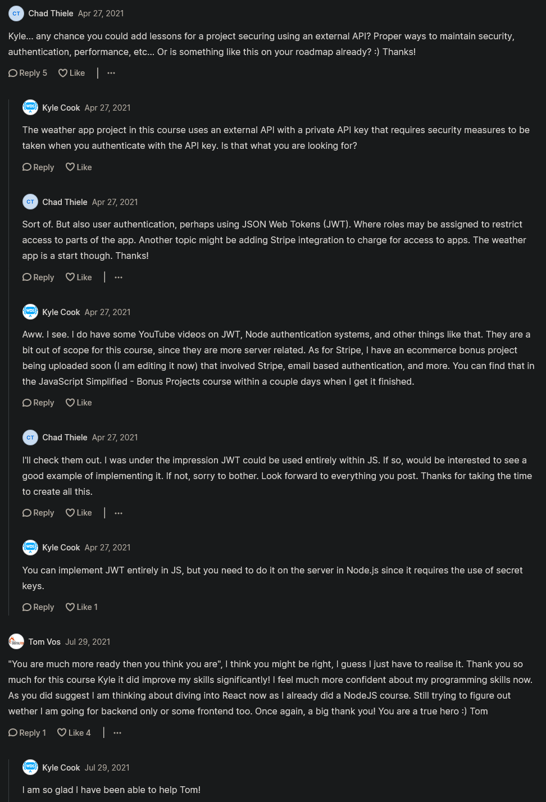

# what's Next 

- take break 
- go to frontend framework (if you want to learn after JS) 
    - & as long as you learned some component based framework then that would be great
- but if you don't want to do frontend then look for backend like nodejs & framework of nodejs i.e express 
    - & learn how to build full webserver , how to build API , rest API & so on  
        these would be useful skills especially if you're going for backend dev job or as a fullstack job 

- & for the backend , learn database queries like SQL or NOSQL database  
    & learn how to interact with the database , read from the database & so on 

- & if you don't want to go in backend then learn some general stuff related to backend

- & as long as you're learning fullstack then learn typescript

- & if you don't want to do anything else then learn new language

- & more years pass by then trend will be of backend as a server or serverless technologies
    - `serverless` means use frontend & interact with a server with actually building out your own server ✔️

- but if you don't want to do anything else then build projects based on your passion & apply for frontend jobs

## discussion page

