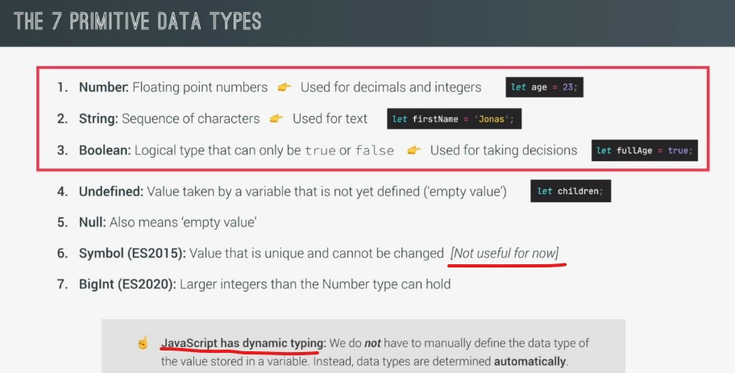

# Data Types



## Examples

- `Examples of Dynamic type` : 
    - Eg : putting no value with a variable 
        ```js
        let currentDate ;
        console.log(currentDate) // output : undefined
        console.log(typeof currentDate) // output : undefined
        ```
        - so value of this variable is undefined & that's why datatype of this variable also undefined
        - `Note` : if we don't define any value for that variable then by-default value will be undefined 💡💡💡

        - now 
        ```js
        currentDate = "5/6/2022"
        console.log(typeof currentDate) // output : string
        ```
        - so this is the example of dynamic typing means later on we changed the datatype of `currentDate` variable

    - Eg : putting null as a value for a variable 
        ```js
        console.log(typeof null) // output : object
        ```
        - so we got object datatype for null because this is a bug or error in JS <br>
            however , this bug is never corrected for legacy reasons 
        - but of course `null` should be return as null datatype just like undefined returns undefined 
        - so just keep this in mind working with `typeof` operator & make sure don't create any accidental bugs due to this ✔️✔️✔️

