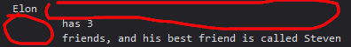

# dot vs bracket notation of an object 

- so dot operator & square bracket notation (for object) , <br>
    both ways we can use to retrieve & update the value of that key of an object 💡💡💡 

- if we're using square bracket notation , then we can pass expression inside of it also <br>
    but we can do this with dot operator 💡💡💡

## Examples of both ways of an object 

- Eg : of using dot operator to retrieve the value of a property/key of an object 
    ```js
    const personElon = {
        firstName : "Elon" , 
        lastName : "Musk" ,
        birthYear : 1990 ,
        companyName : "Tesla",
        occupation : "Business man", 
        friendsName : ["Steven", "Peter", "Alien"]
    }

    console.log(personElon.lastName)
    // output : Musk
    ```

- Eg : of using square bracket notation to retrieve the value of a property/key of an object 
    - if we're using square bracket notation to access that property then <br>
        we define key/property name inside string quote inside square bracket notation 💡💡💡
    ```js
    const personElon = {
        firstName : "Elon" , 
        lastName : "Musk" ,
        birthYear : 1990 ,
        companyName : "Tesla",
        occupation : "Business man", 
        friendsName : ["Steven", "Peter", "Alien"]
    }

    console.log(personElon['lastName'])
    // output : Musk
    ```

## Which one to use in which situation ✅

- `use case` of square bracket notation : 💡💡💡
    ```js
    const personElon = {
        firstName : "Elon" , 
        lastName : "Musk" ,
        birthYear : 1990 ,
        companyName : "Tesla",
        occupation : "Business man", 
        friendsName : ["Steven", "Peter", "Alien"]
    }

    const nameKey = 'Name'
    console.log(personElon['first' + nameKey]) // here we can use template literals also
    // output : Elon
    console.log(personElon['last' + nameKey])
    // output : Musk
    ```
    - `console.log(personElon['first' + nameKey])` here we inserted the expression 💡💡💡
    - so if we're using square bracket notation , then we can put expression also <br>
        but this can't be done with dot operator 💡💡💡

    - Eg : of square bracket notation 
        ```js
        const personElon = {
            firstName : "Elon" , 
            lastName : "Musk" ,
            birthYear : 1990 ,
            companyName : "Tesla",
            occupation : "Business man", 
            friendsName : ["Steven", "Peter", "Alien"]
        }

        // user want to know about that person 
        const interestedIn = 
            prompt("what do you want to know about Elon Musk? Choose b/w firstName, lastName, company name , birthYear")

        console.log(personElon[interestedIn])
        ```
        - so here `interestedIn` variable will be evaluated into that property/key of an object 

## adding properties or key inside an object 

- so for adding a property/key or update that key which already exist then we can use either do operator or square bracket notation 

- `Note` : if that property already exist then it's value will get updated into new value 
    - & if that property doesn't exist inside an object , then that property will be added inside an object 💡💡💡

- Eg : adding a property inside an object by using both ways 
    ```js
    const personElon = {
        firstName : "Elon" , 
        lastName : "Musk" ,
        birthYear : 1990 ,
        companyName : "Tesla",
        occupation : "Business man", 
        friendsName : ["Steven", "Peter", "Alien"]
    }

    personElon.location = "Portugal"
    personElon['twitter'] = "@steve" // so here we could put expression just like before we did 
    console.log(personElon)
    // output : these new properties will be added inside our personElon object  
    ```

## challenge of using square bracket notation 

- Ques : we have this message to print 
    `Elon has 3 friends , and his best friend is called Steven`
    - take values from object i.e `Elon` , `3` & this value `Steven`
    - & don't put hard coded values 

- Ans 
    ```js
    const personElon = {
        firstName : "Elon" , 
        lastName : "Musk" ,
        birthYear : 1990 ,
        companyName : "Tesla",
        occupation : "Business man", 
        friendsName : ["Steven", "Peter", "Alien"]
    }

    console.log(`${personElon.firstName} 
        has ${personElon.friendsName.length} 
        friends, and his best friend is called ${personElon.friendsName[0]}`)
    ```
    - output : we'll get output with spaces because we break the line also like this 
        
        - & that's the power of template literals

- `personElon.friendsName.length` how this works 
    - so basically due to operator precedence , dot operator has high precedence & JS go from left to right 
    - so `personElon.friendsName` will get converted into that array & then length will be counted 💡💡💡 <br>
        & same thing for others 
