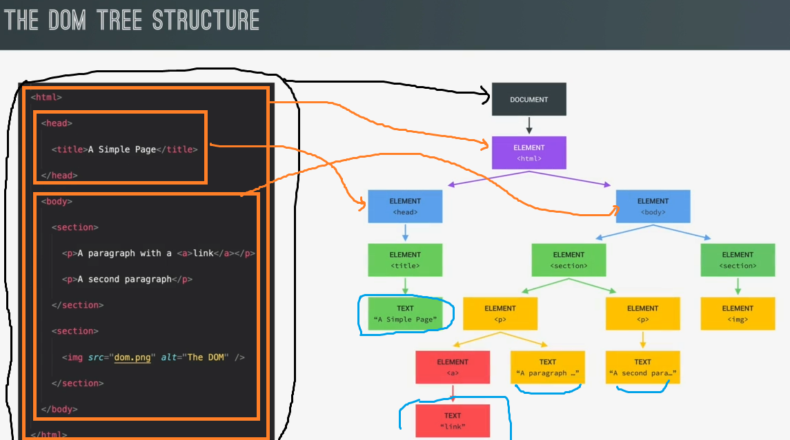

# What's DOM & DOM manipulation

## What's DOM 

- `Document Object Model` :
    - is a structured representation of HTML documents
    - allows JS to access HTML elements & styles to manipulate them
    - is kinda like a connection point b/w HTML documents & JS code 

- now DOM is automatically created by the browser as soon as the HTML page loads
    - & everything which are inside the HTML document , all those are stored in a tree structure like this 
        
    - in this tree , each HTML element is a object 💡💡💡
    - DOM always starts with the document object at the very top & `document` is a special object
        - this `document` object act as an entry point into the DOM 
        - like we used `document.querySelector()` to select an HTML element  
            - means `querySelector()` method is available on the document object  
                that's why we say `document` object is a entry point in the DOM 
            - so we need `document` object to start selecting elements 

- inside DOM , there is a parent child sibling relationship
    - & usually `html` element is a child of `document` object & is a root element in the html document
    - `head & body` elements are children of root element i.e `html` & head & body elements are adjacent/sibling element of each other
    - DOM also contains nodes for all those text itself of html elements , comments & other stuff  
        means whatever we have inside the HTML document then also has to be in the DOM  
        so DOM is a complete representation of the HTML document 

- JS code interacts with DOM elements for modification , update , insertion , deletion , hiding , etc 💡

## DOM !== Javascript

- DOM & javascript are not same , there're different than each other

- `many people think` : 
    - that DOM methods & properties for DOM manipulation are part of Javascript  
        however , this is not the case because JS is actually just a dialect of the ECMAScript specification

- `now if the DOM is not a part of the JS language then how does this all work ✅` : 
    - so the DOM & it's methods & properties are actually part of the web APIs
    - so the web APIs , APIs are like libraries that browsers implement & that we can access from our JS code 
    - so web APIs are just like libraries that are also written in JS & that are automatically available for us to use 💡💡💡
        - so all this happens behind the scenes & we don't have to import or do anything  
            means directly we can use these web APIs directly without import 
        
- there is a official DOM specification that browsers implement - https://www.w3.org/TR/1998/WD-DOM-19980416/
    - & this is the universal rule for all the browsers ,  
        that's why we can see that DOM manipulation works the same in all the browsers
    - & there're actually a ton more web APIs like timers , the fetch API & etc... 
