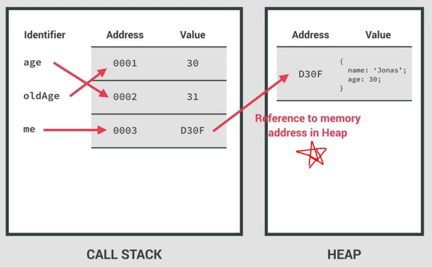

# Primitive VS Reference datatypes 

- Eg : of primitive datatype 
    ```js
    let age = 30 
    let oldAge = age // here we just directly copied the value of "age" variable 
    age = 31 // here we updated the value of "age" variable
    console.log(age) // output : 31
    console.log(oldAge) // output : 30
    ```

- Eg : of reference datatype 
    ```js
    const me = {
        name: "Jonas" , 
        age: 30 ,
    }

    const friend = me 
    friend.age = 27
    console.log(me.age) // output : 27
    console.log(friend.age) // output : 27
    ```

- so here we can see 
    - in primitive datatype , after copying the value of a variable inside another variable <br> 
        then we updated the value of `age` but value `oldAge` variable remain 30 . so WHY???
    - but in reference datatype , after copying the value of object/array variable inside another object/array variable <br>
        then we updated the `age` property of `friend` object but due to this , <br>
        value of `age` property of `me` object also gets updated 💡💡💡
    - so why this is happening let's find it out 

## basic information 

- `primitive datatype of JS` : Number , String , Boolean , Undefined , Null , Symbol , BigInt
- `Objects datatype of JS` : Object literal , arrays , functions , etc...

- & if we talk about memory & memory management , usually as say to primitive as primitive types & objects reference types 
    - & we say both in different way because both datatypes are stored in different ways in memory

- now JS engine comes , so JS engine has two components i.e 
    - `the call stack` : where functions are executed 
    - `heap` where objects/arrays are stored memory  
    - so all reference datatypes are all of objects means `reference datatypes` will get stored in the memory heap <br>
        & primitive datatypes are stored inside the callStack 💡💡💡

- `primitive types are stored inside the callStack` means 
    - these datatypes are stored in the execution contexts in which they're declared
    - callStack means where execution context runs 💡💡💡

## reason why this is happening 

- Eg : primitive values example
    ```js
    let age = 30 
    let oldAge = age 
    age = 31 
    console.log(age) // output : 31
    console.log(oldAge) // output : 30
    ```
    - when we declare a variable i.e `let age = 30` then what'll happen inside JS engine & computer's memory
    - `STEP 1` : inside CallStack , 
        - JS will create a unique identifier with the variable name
        - then a piece of memory will be allocated with a address (let's say 0001)
        - & on that particular address , value (i.e 30) would be stored in memory like this  
            
        - behind the scenes `identifier` i.e age will points to that address & not to the value itself 💡💡💡 <br>
            so that address holds the value i.e 30
    - `STEP 2` : now we did `let oldAge = age` 
        - so that variable (i.e oldAge) will point to the same memory address as the `age` variable like this 
            
    - `STEP 3` : now `age = 31` means we updated the value of `age` variable 
        - so now that previous value (i.e 30) of that previous address will not become 31 <br> 
            because that would change `oldAge` variable as well because previously both were pointing to the same address <br>
            & also the value at a certain memory address is immutable/can't be changed 💡💡💡
        - here what'll happen i.e 
            - a new piece of memory is allocated/created
            - now `age` variable will points to that new memory address (which hold updated value i.e 31) 💡💡💡 like this 
            
    - `STEP 4` : that's why when we print them , `oldAge` variable pointing <br>
        to that previous address which hold previous value i.e 30

- Eg : reference values example 
    ```js
    const me = {
        name: "Jonas" , 
        age: 30 ,
    }

    const friend = me 
    friend.age = 27
    console.log(me.age) // output : 27
    console.log(friend.age) // output : 27
    ```
    - when we define `me` object then 
        - `STEP 1` : 
            - inside heap memory , a new memory address will be created (let's say D30F)  
                - & that new memory address contain the object value of `me` variable 
                - now this identifier i.e `me` variable is not directly pointing to the object value <br> 
            - but inside the callStack , `me` identifier/variable will be created & <br>
                inside the callStack , a new piece of memory address will be created for `me` variable <br>
            - now `me` variable will points that memory address which is inside callStack 💡💡💡 like this 
                
                - & now inside callStack , `me` variable will points to that address (let's say 0003) <br>
                    & that D30F (of the object value) memory address will be stored as a value <br>
                    so this D30F memory address (which is stored as a value inside callStack) will points <br>
                    to memory address in Heap like this 
                    
        - in simple terms , the piece of memory in the call stack has a reference to the piece of memory in the heap <br>
            which holds actual `me` object value 
        - `Reason that why object value stored in only Heap ✅` : 
            - when we declare a variable as an object/array then an identifier/variable is created <br>
                which points to a piece of memory in the stack , which in turn points to a piece of memory in the heap <br>
                & that's where the object is actually stored
            - & it works in this way because objects might be too large to be stored in the stack <br>
                that's why objects/arrays are stored in the Heap memory 
            - HEAP memory : which is unlimited memory pool <br>
                & callStack just keep the reference of where the object/array is actually stored in the heap <br>
                so that it can find it whenever necessary 💡💡💡
        - `STEP 2` : then we created a new variable i.e `const friend = me` which is equalTo `me` object 
            - now just like primitive value , the `friend` identifier/variable will <br>
                point to the exact same memory address as the `me` variable 
            - & that address contains reference (i.e memory address) as a value which then points to the actual object itself
        - `STEP 3` : then we updated the value of `age` property of `friend` object i.e `friend.age = 27`
            - then the object is found in the heap & the 30 is changed to 27
            - `Note` : here we can see that we define `friend` as a const variable <br>
                but we still able to update without problems because we're not changing the memory which contain actual object <br> 
                we're just doing changes inside the object value itself means we're just overwriting 
            - so memory address remain same i.e `0003` inside the callStack like this 
                
                - so we have two different names of same thing 💡
            - `Note` : all the variables which are created through `const` variable are immutable which is not true 
                - because it depends on situations 
    - Eg 1 : only reference variables (both object & array)
        ```js
        const user = { name: "John" };

        const details = [user, user, user];
        details[0].name = "Teen";

        console.log(details[0]); // output : { user: 'Teen' }
        console.log(user); // output : { user: 'Teen' }
        ```

## How JS works behind the scenes ✅

- here these topics , we'll see later on 
- `Prototypal inheritance` : which we'll see in OOPS
- `event loop` : we'll see in asynchronous JS (i.e promises , async/await)
- `How the DOM really works` : we'll see in advanced DOM & events 
