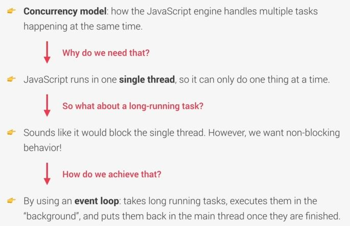
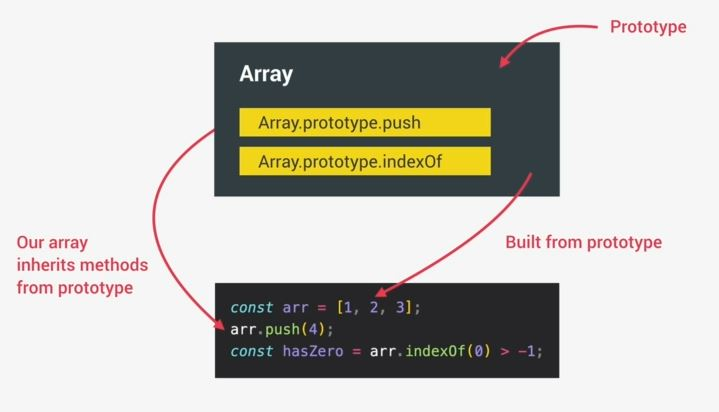

# High Level Overview of JS 

## first definition

- JS is a high-level , object-oriented, multi-paradigm programming language

## second definition

- JS is a `high-level` , `prototype-based object-oriented` , `multi-paradigm` , `interpreted or just-in-time compiled` , <br>
    `dynamic` , `single-threaded` , `garbage-collected` programming language with `first-class functions` <br>
    & a non-blocking `event loop concurrency model`

- this above definition is a big picture to define JS  

## Explaining these terms 

- `High-level` : means  
    - every program that runs on your computer needs some hardware resources (like RAM(memory) , CPU) to do it's work
    - there are low level languages such as C , C++ (where we have to manually manage these resources) <br>
        Eg : asking the computer for memory to create a new variable
    - on the other side , we have high-level language (such as JS , python) where we don't have to manage resources at all <br>
        because these language have so-called abstractions (which take all of that tedious work away from us) 
        - these kindof language makes easier to learn & to use 
        - but the disadvantage is that programs will never be as fast or as optimized as we write in C , C++ programs 

- `garbage-collection` : means  
    - Now , one of the powerful tools that takes memory management away from us developers is garbage-collection <br>
        which is basically an algorithm inside the JS engine <br>
        which automatically removes old , unused objects from the computer memory <br>
        in order not to difficult/clog it up with unnecessary stuff
    - so it's a little bit like JS has a cleaning guy who cleans our memory from time to time <br> 
        so that we don't have to do it manually in our code 

- `Interpreted or JIT(just-in-time) compiled` : means 
    - there is a difference b/w interpreter VS JIT complier & JS is a interpreter language
    - the computer's processor only understands zeros & ones <br>
        Ultimately , every single program needs to be written in zeros & ones which is also called machine code <br>
        & since practically writing code in zeros & ones is not possible that's why programming languages are made
    - so we simply write human-readable JS code which is an abstraction over machine code <br> 
        but this code eventually needs to be translated to machine code <br>
        & this translation step can be either compiling or interpreting 
        - this step is necessary in every single programming language because no one writes machine code manually 
        - in case of JS , this happens inside the JS engine 

- `multi-paradigm` means : 
    - one of the thing that makes JS so popular is that it's a multi-paradigm language
    - in programming , a `paradigm` is an approach & overall mindset of structuring our code <br>
        which is related to your coding style & technique in a project that uses a certain paradigm
    - there are three popular paradigm
        - `first` : Procedural programming 
        - `second` : OOPS
        - `third` : functional programming (FP)
    - so till yet whatever we wrote the code in our project <br>
        we used procedural programming like (we didn't use hoisting concept)
    - classification of paradigm
        - `first` : Imperative
        - `second` : Declarative
    - many languages are only procedural or only object-oriented or only functional but JS does all of it <br> 
        so it's really flexible & versatile 

- `Prototype-based object-oriented` : means 
    - it's a prototype based , object-oriented approach
    - first , in JS , almost everything is an object except for primitive values (such as numbers , strings , etc) 💡💡💡 <br>
        but arrays , etc are object datatype
    - Eg : we created an array & we used push() method on it , so it's because of prototypal inheritance <br>
        means we create arrays from an array blueprint <br>
        
        - basically which is like a template & this is called the prototype & this prototype contains all the array methods <br>
            & the arrays that we created in our code & then we inherit the methods from the blueprint <br>
            so that we can use them on the arrays 

- `first-class functions` means : 
    - the functions are treated just as regular variables 
    - Eg : like we can pass functions into other functions <br> 
        & we can even return functions from functions which is extremely powerful <br>
        because it allows us to use a lot of powerful techniques <br>
        & also allows for functional-programming (which is one of the paradigms)
    - Eg : of first class functions that we wrote in our modal project
        ```js
        const closeModal = () => {
            modal.classList.add("hidden")
            overlay.classList.add("hidden")
        }

        overlay.addEventListener('click' , closeModal)
        ```
        - so here we pass the closeModal() function as a callback function inside overlay.addEventListener() <br>
            so here closeModal is just a normal variable 
    - Not all languages have first-class function but JS has 

- `Dynamic language` : means 
    - dynamic means dynamically typed 
    - so in JS , we don't assign datatypes to variables <br>
        means behind the scene , datatypes declared to all the variables when the JS engine executes our code <br>
        also , the datatype of variables can easily be changed as we reassign variables <br> 
    - but with other programming languages like C , C++ , etc (where we need to define datatype of a variable manually) <br>
        & this usually prevents bugs that's why many people said that JS should be a strongly-typed language as well <br> 
        & for this we can use TS (typescript)

- `single-threaded` & `non-blocking event loop concurrency model`
    - this is complex topic
    - concurrency model means how the JS engine handles multiple tasks happening at the same time
    - `why we need concurrency model` 
        - because JS runs in one single thread , so it can only do one thing at a time
        - in computing , a thread is like a set of instructions that's executed in the computer's CPU <br>
            so basically , the thread is where our code is actually executed in a machine's processor 
    - `so what about a long-running task` 
        - like fetching data from a remote server
        - means it would block the single thread , however we want non-blocking behavior (but of course , we don't want that)
        - so we want non-blocking behavior & how we can achieve this  
    - `How do we achieve that` 
        - we can use i.e event loop which takes long-running tasks & executes them in the background
        - & then puts them back in the main thread once they're finished
    - so JS is a non-blocking event loop concurrency modal with a single thread
    - process picture <br>
        

## extra stuff 

- is Js single threaded or multi-threaded 
    - https://dev.to/bbarbour/if-javascript-is-single-threaded-how-is-it-asynchronous-56gd
    - Eg : using alert() function & async code 
        ```js
        setTimeout(() => {
          console.log("single threaded bhai")
        } , 2000)
         
        window.alert("hello")
        console.log("starts from here")
        ```
        - here setTimeout() async function & console.log("starts from here") will not be executed <br>
            until if we don't click on alert() function
