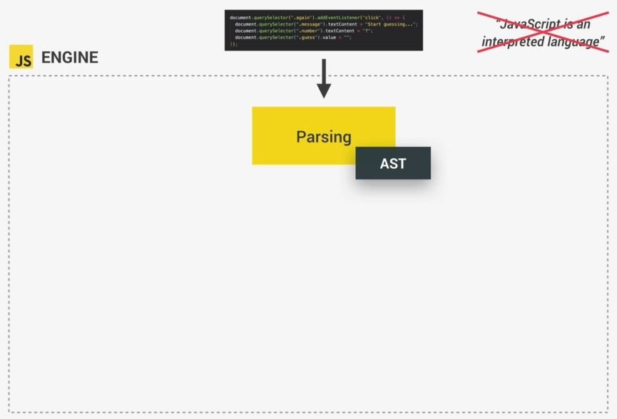
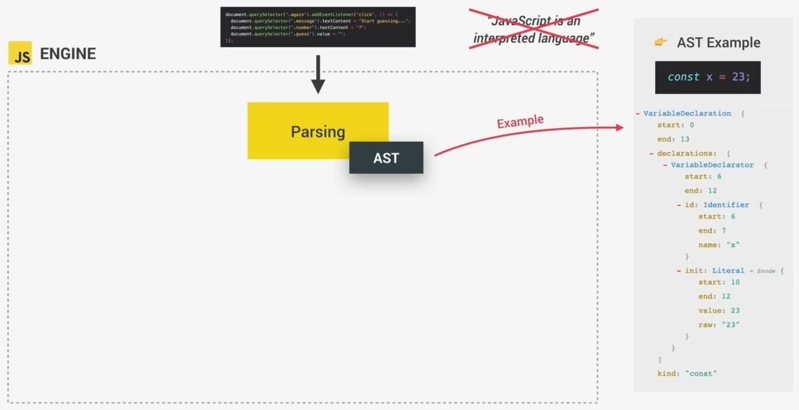
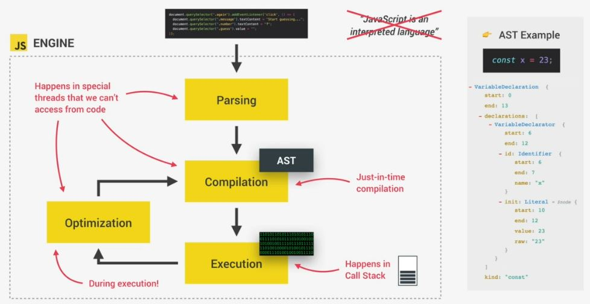
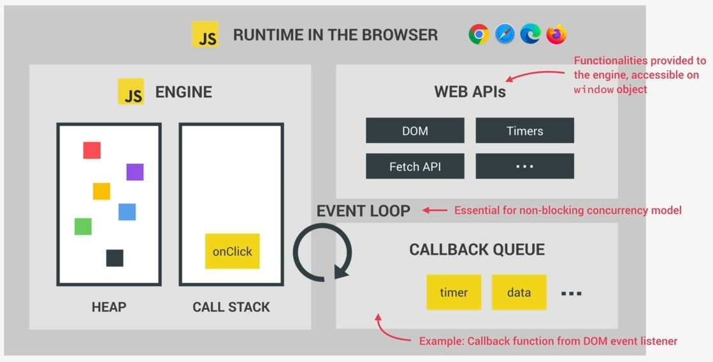
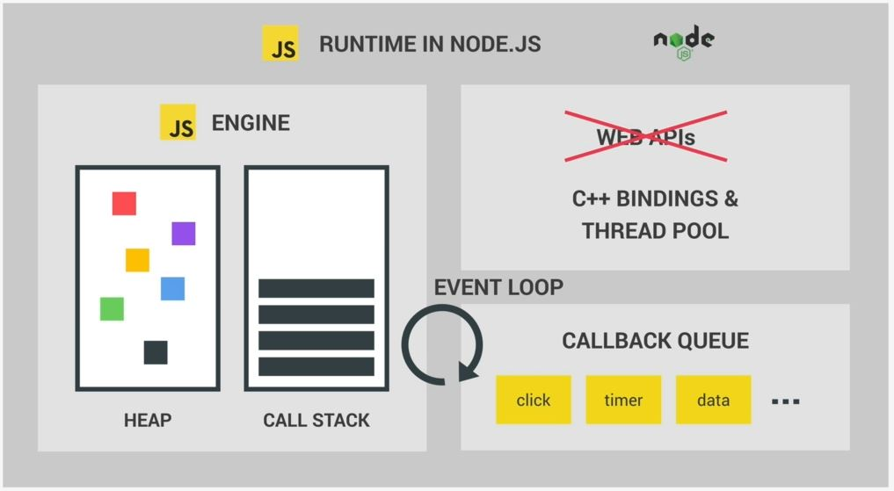

# JS engine & runtime 

## JS engine 

- means program that executes JS code 
- every browser has it's own engine  
    - like Chrome has V8 engine 
    - so V8 engine powers google chrome but also nodejs (which is JS runtime)

## components & working of a engine of a browser 

- any JS engine always contains a callStack & a heap
- `callStack` : means where our code is actually executed by using execution context
    - then the `heap` is an unstructured memory pool which stores all the objects that our application needs
- so this is the answer where code is executed
    

## compilation VS interpretation VS JIT

- so the computer's processor only understands zeroes & ones  
    & therefore that's every single computer program ultimately needs to be converted into this machine code   
    & this can happen using compilation or interpretation 

- `compilation` : in it , the entire source code is converted into machine code at once  
    & then this machine code is written into a portable file that can be executed on any computer  
    
    - so here , we have two different steps 
        - `first` : the machine code is built & then it is executed in the CPU 
        - `second` : so in the processor & after the compilation , the execution happen  
        - eg : any application that you're using on your computer right now has been compiled  
            before & you're now executing it after it's compilation
    
- `interpretation` : means interpreter runs through the source code & executed it line by line 
      
    so here we don't have the same two steps as before 
    - so in it , the code is read & executed all at the same time  
        & by the way , the source code still needs to be converted into machine code  
        but converting into machine code happens right before it's executed 

- Js is a purely interpreted language ,  
    - but the problem with interpreted languages is that they're much , much slower than compiled languages
    - Eg : like you were using Google maps in your browser & you were dragging the map & each time you dragged  
          it would take one second for it to move & this is completely unacceptable 
    - Now many people still think that JS is an interpreted language but that's not really true anymore  
        so instead of simple interpretation , now JS engine now use a mix (compilation & interpretation) ✔️✔️✔️  
        which is called just-in-time compilation 

- `just-in-time (JIT) compilation` : means compiles the entire code into machine code at once  
    & then executes it right away 💡💡💡
     
    - still here we have two steps but there is no portable file to execute  
        & the execution happens immediately after a compilation 
    - so this is prefect for JS because it's really a lot faster than just executing code line by line  

## Just-in-time compilation process & event loop in JS engine

- `STEP 1 : parsing` : 
    - so a piece of JS code enters the engine , the first step is to parse the code  
        which means during the parsing process , read the code 
    - & then the code is parsed into a data structure called the abstract syntax tree (AST)   
        
    - AST will first spilt up each line of code into pieces that are meaningful to the JS language  
        like const , function , keywords ... & then saving all these pieces into the tree in a structured way  
        this step also checks if there are any syntax errors & the resulting tree will later be used to generate the machine 
    - Eg of AST : let's say we have a simple program like declared a variable `const x = 23` & this is what AST will look like  
        
        - inside of AST example , inside VariableDeclaration object ,  
            `name : "x"` variable name is x & `kind : "const"` means constant  
    - `Ques : is this AST tree has anything to do with the DOM tree` : answer is no
        - means AST tree is just a representation of our entire code inside the engine 

- `STEP 2 : compilation` : compilation takes the generated AST tree & compiles it into machine code (0 & 1 machine code)

- `STEP 3 : execution` : now this machine code gets executed right away (because modern JS use JIT compilation)
    - & execution happens in the JS engines i.e call stack
    - now our code is running , so we can finish here , Right ?  
        well, not so fast because modern JS engines actually have some pretty clever optimization strategies  
        What they do is to create a very unOptimized version of machine code in the beginning ✔️✔️✔️
    - so that execution of code starts as fast as possible & then in the background ,  
        that code is being optimized & recompiled during the already running program execution
    - & this can be done most of the times & after each optimization ,  
        the unOptimized code is simply swept for the new more optimized code without ever stopping execution 
    - & this process is what makes modern engines so fast such as V8 engine of chrome 
    - all the parsing , compilation & optimization happens in some special threads inside the engine  
        that we can't access from our code , so completely separate from the main thread  
        i.e running into call stack executing our own code
    - & different engines implements in slightly different ways  
        but in nutshell this is what modern JIT compilation looks like for JS  
        

## JS runtime & engines 

- so just imagine that JS runtime as a big box/container in the browser  
    which includes all the things that we need in order to use JS in the browser
    - that's why we're taking about engines & runTimes together  
        because without an engine there is no runtime & there is no JS at all ✔️✔️✔️  
    - However , the engine is not enough in order to work properly  
        so in order to work properly , we also need access to the web APIs  
        like DOM , timers , fetch API , console.log() , etc ....

- `WEB APIs` : are functionalities provided to the engine but which are actually not part of the JS language itself 
    - so JS simply gets access to these APIs by using the global `window` object  
        but still Web APIs are also part of the runtime because again a runtime is just like a box  
        that contains all the JS related stuff that we need 

- `callback queue` : 
    - js runtime also includes a callback queue 
    - & is a data structure that contains all the callback functions that are ready to be executed 
        - Eg : we attach event handler functions like `click` event to DOM elements like a button   
            & these events handler are also called callback functions  
            because when a event handler executed then it's callback function also executed 
        - `how that actually works behind the scenes`
            - so the first thing that actually happens after the event is fire  
                then it's callback function is putted into the callback queue
            - & when the callStack/stack is empty then the callback function is passed to the stack for execution  
            - here event loop happens , so the event loop takes callback functions (of that event handler)  
                from the callback queue & puts them in the callStack , so that they can be executed
            - previously we talked about how JS non-blocking concurrency model is implemented ?  
                so we'll see how asynchronous code makes JS non-blocking which we'll see later on  
                because every developer needs to understand deeply 💡💡💡
    

- it's also important to remember that JS can exist outside of browsers  
    - for eg : in Node.js  , so what the nodejs JS runtime looks like it's pretty similar in JS  
        but since we don't have a browser & we don't have most the web APIs   
        because web apis provide by browser because , so in Node.js runtime we have multiple C++ bindings i.e thread pool
    - so different JS runTimes exists
    

- we have web apis in browser like console.log() , setTimeout , fetch api , etc (which are not provided by JS language)
	- & due to this flow of execution gets change & that's why event loop concept comes 💡💡💡

## Extra stuff 

- how memory management done in JS : https://developer.mozilla.org/en-US/docs/Web/JavaScript/Memory_Management

- Event loop : https://dev.to/lydiahallie/javascript-visualized-event-loop-3dif 👍
- JS engine : https://dev.to/lydiahallie/javascript-visualized-the-javascript-engine-4cdf 👍