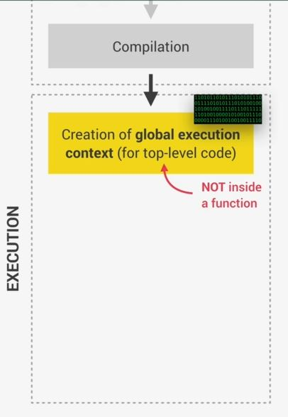
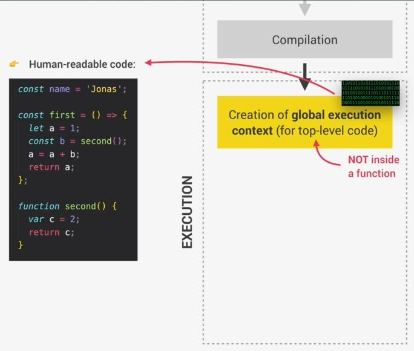

# execution context & callStack

## Explanation - Execution context

- let's understand by assuming that our code was just finished compiling like this 
    

- `global execution context creation` : 
    - now the code is ready to be executed after compilation ,  
        now so called `global execution context` is created for the top-level code  
    - `top-level code` : means that code which is not inside any function  
        means only that code will come inside global execution context  
        which those line of code will be executed which are are outside of functions ✔️   
    - & functions should be executed when they are called which we already saw in pig game   
        i.e we created init() function , so first time when that page loaded then we needed to call that function immediately   
        in our top-level code like this  
        
    - Eg : here we have a code like this 
        
        - so here `name` variable declaration is a top-level code  
            so it will come inside global execution context & therefore it will be executed
        - then we have two functions , so whatever inside of these functions  
            i.e function body will only be executed when these two functions are called  
            but these two functions will be declared as a variable inside global execution context

- so a global execution context is created for top-level code but now what exactly is an execution context
    - well , an execution context is an abstract concept but it's like an environment

- `Execution context` : means is a place where a piece of JS code is executed  
    & it's like a box that stores all the necessary information for some code to be executed  
    such as local variables , arguments passed into a function , etc  
    - so , JS code always runs inside an execution context
    - Eg : let's say you order a pizza , so usually pizza comes in a box  
        or it might comes with some other stuff that is necessary for you to eat a pizza such as receipt  
        so that you can actually pay for the pizza before eating it .
        - so here the pizza is the JS code to be executed & the box is the execution context for our pizza  
            & that's because eating the pizza happens inside the box (which is the environment for eating pizza)  
            the box also contains receipt , etc which are necessary to eat a pizza (means to execute the code) 💡💡💡

- now in any JS project , no matter how large it is , there is only ever one global execution context  
    & it's always there as the default context where all top-level code will execute 💡💡💡  

- so here that top-level code is executed inside the global execution context
    
    - & then functions also start to execute as well (how functions will be called inside execution context) 
        - so execution context will be created for each & every functions call & contain all the information that is necessary  
            to run exactly that function & same goes for methods (because these are functions also attach to objects) like this 
            

    - so all these execution contexts together make up the call stack 
    - now , when all functions are done executing then the engine 
        will keep waiting for callback functions to arrive , so that engine can execute those 
        - Eg : let's say a callback function associated with a click event & remember ,  
            that it's the event loop who provides these new callback functions 💡💡💡
            

- `why execution context made & what's inside of it` : 
    - first : `what's inside execution context` 
        - `variable environment` : 
            - so inside it , there is a variable environment
            - so in this environment , all our variables & function declarations are stored  
                & also a special arguments object 
            - this object contains all the arguments that were passed into that function    
                that the current execution context belongs to because each function gets  
                it's own execution context as soon as the function is called 💡💡💡
        - `scope chain` : 
            - so basically , all the variables (that are somehow declared inside a function)  
                will end up in it's variable environment. However , a function can also access variables  
                which are outside of the function , this happen due to the scope chain  
                so scope chain consists of references to variables that are located outside of the current function
        - `this keyword` :
            - & to keep track of the scope chain , it's stored in each execution context  
                & each execution context also gets a special variable called i.e `this` keyword
    - now these content of the execution context i.e variable environment , scope chain , this keyword  
        is generated in creation phase which happens right before execution 💡💡💡 like this   
        
    - `important Note 🔥` : for arrow function 
        - execution contexts belonging to arrow functions ,  
            so arrow function don't get their own arguments keyword nor do they get that `this` keyword
        - means arrow function don't have the `arguments object` & `this` keyword  
            so they can use the `arguments object` & `this` keyword from their closest regular function parent 💡💡💡
            
    - Eg : working of execution context  
            
        - so we'll get one global execution context 
        - so here two execution context will be created for each functions i.e first() & second() like this 
            
        - inside Global Execution context , we have the variable name declaration like this 
            
            - here `<function>` contain the function definition body of their own function
            - & here `x = <unknown>` marked because value is the result of the first() function that we didn't run yet  
                so technically none of these values actually become known during the creation phase ,  
                but only in the execution phase . so this is not 100% accurate
            - now first() function is executed & inside of it , variable `a` & `b` will be defined  
                & `b` variable needs second() function call for the result value like this 
                
            - now inside variable environment of second() function execution context ,  
                contains `c` variable & arguments = [7, 9] will be passed when second() function is called like this  
                

- `why we need callStack inside the engine & what is callStack & it's working` :  
    - `why we need callStack inside the engine` :
        - now imagine there are hundreds of execution contexts for hundreds of functions  
            then how will the engine keep track of the order in which functions we're called  
            & how will it know where it currently is the execution so that's why here callStack comes

    - the callStack together with the memory heap , makes up the JS engine itself 
    - `what is callStack` : 
        - it's basically a place where all execution contexts get stacked on top of each other  
            in order to keep track of where we're in the programs execution like this 
            
        - so that execution context which is on top of the stack is the one that's currently running  
            & when it's finished running then it'll be removed from the stack/callStack & execution will go back  
            to the previous execution context
        - Eg : if you bought pizzas with some friends & each friend has a pizza box & then you put the boxes  
            on top of each other ,forming a stack in order to keep track which pizza belongs to each friend
    - Eg : `working of callStack` : 
        
        - so once the code is compiled , top-level code will start execution  
            & then a global execution context will be created for the top-level code  
            so this is where all the code outside of any function will be executed
        - now inside callStack , that global execution context is now at the top of the callStack/stack   
            it's the one where the code is currently being executed
        - now here `name` is a simple variable declaration then `first` function & `second` function are declared
        - now in last line , things will get interesting i.e `const x = first()` , so `x` is waiting for result value 
        - so `first()` function will be called then it'll get it's own execution context  
            & stack on global execution context inside callStack & arrow pointer comes on it like this  
            
            - now `first()` is the new current execution context
                - so inside `first()` function we have yet another simple variable declaration i.e `a` variable  
                    & this variable will of course be defined inside the variable environment  
                    of the current execution context not in the global context
            - second line inside first() function , we have `second()` function called , so now let's call second() function  
                now a new execution context will be created for `second()` function  
                & it's pushed on top of `first()` execution context
            - now execution of `first()` function is has been paused & we're inside second() function body for execution  
                & in the meantime , no other function is being executed . so first() function stopped at this point 💡💡💡     
                - & first() function will only continue as soon that second() function returns 
                - so JS has only one thread of execution , so JS can do only one thing at a time 💡💡💡
            - so inside `second()` function , `c` variable will be defined inside variable environment  
                & then `return c` will be executed , so `return` statement means that the function will finish it's execution  
                so execution context of `second()` function will be popped out from the callStack  
                & disappear from the computer's memory
        - now arrow pointer will come back to previous execution context of first() function  
            & that line will be start executed from where it was left i.e `const b = second(7, 9)`  
            - `advantages of having callStack inside the engine` : 
                - so this is how callStack keeps the track of the order of execution context 💡💡💡
                - `Note` : without the callStack how would the engine know which function was being executed before  
                    & it wouldn't know where to go back to , so that's why we need callStack  
                    because callStack makes this track process almost effortless
                - so the callStack is like a map for the JS engine because it keeps the track order of execution 💡💡💡
        - now that calculation will be done `a = a + b` & first() function also returns  
            so execution context of first() function will gets popped out from the callStack
        - & now arrow pointer will come back to global execution context where code is executed i.e global execution context  
            & the line of code will be executed where the first() function was first called  
            & the return value is finally stored inside `x` variable & the execution is finished  
            & the global execution context will also be popped out from the callStack

- so the general point is that code runs in the callStack

## Extra Stuff on Execution context 

- JavaScript Under The Hood: Execution Context
    - https://www.youtube.com/watch?v=-G9c4CMMUKc&ab_channel=TraversyMedia
    - https://www.youtube.com/watch?v=Fd9VaW0M7K4&ab_channel=TraversyMedia
    - https://www.youtube.com/watch?v=Hci9Bb4_fkA&ab_channel=TraversyMedia
    - https://www.youtube.com/watch?v=oc6faXVc54E&ab_channel=TraversyMedia
