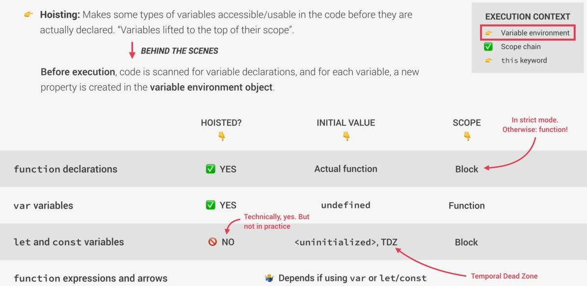

# Variable environment hoisting & the TDZ

## what is hoisting & who can do hoisting



## what is TDZ (temporal dead zone) , let & const

- here we have this code like this 
    ```js
    const myName = "Jonas"

    if (myName === "Jonas") {
        console.log(`Jonas is a ${job}`) // output : ReferenceError: Cannot access 'job' before initialization
        const age = 2037 - 1989
        console.log(age)
        const job = "teacher"
        console.log(x) // accessing a variable which is not defined -> output : ReferenceError: x is not defined
    }
    ```
    - `Note` : here we can access `job` variable before it's initialization because of TDZ  
        
        - means TDZ is the region of the scope in which the variable is defined but can't be used in any way

- `why we need TDZ` : 
    - means it's introduce in ES6 because it makes easier to avoid & catch errors 
    - to avoid accessing variables before declaration is bad practice & should be avoided
    - `small reason that why TDZ exists` : because so as we know that we can't reassign `const` variables 
        - so it'll not be possible to set them to `undefined` value first & then reassign their real value later
        - so `const` should never be reassigned

- `why hoisting` 
    - why it's introduce if it creates a problem
    - so the creator of JS introduce hoisting concept , so that we can use function declarations before we use them
        - means for some programming techniques (like mutual recursion)
        - & some people think that it makes code a lot more readable
    - hoisting works only with two things i.e `normal function` & `var` keyword
