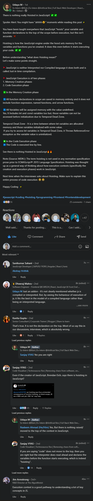

# Hoisting practice & TDZ 

## example of Hoisting 

- Eg 1 : define variables by using `var` , `let` & `const` keywords
    ```js
    console.log(me)
    console.log(job)
    console.log(year)

    var me = "Jonas" // output : undefined
    let job = "teacher" // output : can't access 'job' before initialization
    const year = 1991 // output : no output because JS stop in this line i.e console.log(job)
    ```
    - `Note` : only with the case of `var` keyword <br>
        if we run again console.log(me) then we'll get the correct output i.e Jonas 

## advantages & pitfalls/disadvantage of using hoisting 

- https://stackoverflow.com/questions/56232870/what-is-the-main-advantage-of-hoisting-in-javascript

## extra notes  

- how hoisting works & how JS engine able to execute that normal function <br>
    & how lexical scope come in picture & how undefined value comes when we do hoisting with `var` keyword variable ⭐
    - https://blog.bitsrc.io/hoisting-in-modern-javascript-let-const-and-var-b290405adfda

- https://dev.to/lydiahallie/javascript-visualized-hoisting-478h
- https://blog.bitsrc.io/what-is-javascript-hoisting-f0678208eb08
- https://medium.com/swlh/what-is-hoisting-in-javascript-why-and-how-to-avoid-using-it-e923c7a751e7

- https://www.linkedin.com/feed/update/urn:li:activity:6970617523985674240/
    
