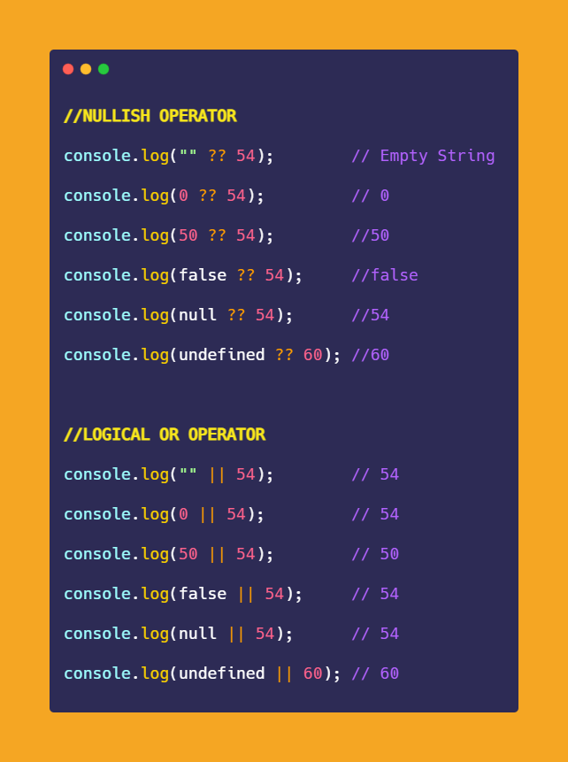

# Nullish Coalescing Operator (??)

- nullish Coalescing operator is look like this `??`
- it's a short way of OR operator to create a condition when we're dealing only with null or undefined values 💡💡💡

- Eg : normal example of condition checking
    ```js
    const restaurant = {
        name : "Classico Italiano" ,
        location : "Via Angelo Tavanti 23, Firenze, Italy" ,
        categories : ['Italian', 'Pizzeria', 'Vegetarian', 'Organic'] ,
        starterMenu : ['Focaccia', 'Bruchetta', 'Garlic', 'Bread', 'Caprese Salad'] ,
        mainMenu : ['Pizza', 'Pasta', 'Risotto'] ,
        openingHours : {
            thu: {
                open : 12 , 
                close : 22
            } , 
            fri: {
                open : 12 , 
                close : 23
            } , 
            sat: {
                open : 0 , // open 24 hours 
                close : 24
            } 
        } 
    }

    restaurant.numGuests = 0
    const guests = restaurant.numGuests || 10
    console.log(guests) // output : 10
    ```
    - so here we got `10` as a output because `0` is a falsy value <br>
        that's why `restaurant.numGuests || 10` here second operand gets executed
    - but we have better solution i.e nullish coalescing operator 💡💡💡 which is came in ES20 

## Example - nullish Coalescing Operator

- Eg : nullish Coalescing Operator
    ```js
    const restaurant = {
        name : "Classico Italiano" ,
        location : "Via Angelo Tavanti 23, Firenze, Italy" ,
        categories : ['Italian', 'Pizzeria', 'Vegetarian', 'Organic'] ,
        starterMenu : ['Focaccia', 'Bruchetta', 'Garlic', 'Bread', 'Caprese Salad'] ,
        mainMenu : ['Pizza', 'Pasta', 'Risotto'] ,
        openingHours : {
            thu: {
                open : 12 , 
                close : 22
            } , 
            fri: {
                open : 12 , 
                close : 23
            } , 
            sat: {
                open : 0 , // open 24 hours 
                close : 24
            } 
        } 
    }

    // using nullish coalescing operator 
    restaurant.numGuests = 0
    const guestCorrect = restaurant.numGuests ?? 10
    console.log(guestCorrect) // output : 0
    ```
    - so we got real value but if we don't define value `restaurant.numGuests = 0` <br>
        then we'll get default value i.e 10
    - `Note of nullish Coalescing Operator ✅` : 
        - why we got `0` even it's a falsy value because if we use OR operator `0 || 10` <br>
            then we'll get `10` as a output
    - but why we got `0` when we used nullish Coalescing Operator
    - `What is nullish Coalescing Operator ✅` : 
        - because nullish Coalescing Operator works with the idea/concept of nullish values instead of falsy values 💡💡💡
        - & nullish values are : null & undefined 💡💡💡
        - it doesn't include `0` or empty string as nullish values 💡💡💡 means `nullish Coalescing Operator` <br>
            will not consider `0` & empty string as nullish values. for it , these values will be like truthy values
        - so `nullish Coalescing Operator` will do short circuit/stop the evaluation if it's a nullish value
    - so `restaurant.numGuests ?? 10` means 
        - if `restaurant.numGuests` contains any nullish value then that `10` value will be evaluated 💡💡💡
        - but if `restaurant.numGuests` contain `0` or empty string then we'll get `0` or empty string <br>
            short circuit will happen & further evaluation will be stopped 💡💡💡

- `said by Jonas` : `nullish Coalescing Operator` is a useful operator

## Extra notes 

- nullish operator VS Logical operator <br>
    
