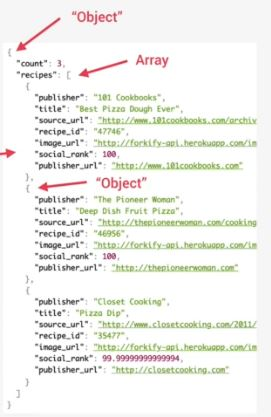

# which data structure to use 

- dealing & working with data is the main thing that we do as developers 
    - that's why we're working with JS built-in data structures like arrays & objects

- we'll see which data structure to use with pros & cons ✔️✔️✔️

## Sources of Data (where data come from) 

- first - `from the program itself ✅` : 
    - data written directly in source code 
    - eg : status messages that will be displayed on a webpage based on user actions

- second - `from the UI ✅` : 
    - data input from the user or data written in DOM 
    - for Eg : tasks in todo app , etc means from the webpage
        - data either be the user inputs into some form or data test already written somehow in the DOM 

- third - `from external sources ✅` : 
    - Data fetched for example from web API (application programming interface) (for Eg : recipe objects)
    - basically we use a web API to get data from other web applications
    - Eg : we can use web API to get the current weather in any city or data about Movies or currency conversion rates , etc

- so usually we need to collect the data & store it somewhere , so to store collection of data we use data structures 
    - there are 4 built-in data structures in JS , so we need to decide b/w them

- `different decisions to use the data structures ✅` 
    - `first decision` : if we just need a simple list of values then use an array or a Set() class 💡💡💡
    - `second decision` : if we need key value pairs then use an object or a Map() class 💡💡💡
    - so the big difference b/w these 
        - `object or Map() class` : a key value pair , we have a way of describing the values i.e by using that key 💡💡💡
        - `array or Set() class` : in a list like an array or Set() , we just have the values without any description 💡💡💡 

- `About JSON data` 
    - usually data comes from web APIs are in special data format i.e JSON   
    - JSON data is just a long string text but we can convert JSON data into JS Objects  
        because JSON data contain objects , arrays , nested objects & nested arrays like this  
        
        - do we need to describe each of the objects , well it's not necessary  
            because this JSON data contain recipes data & whatever information we need about the recipes  
            is already stored on right side as a value in each of the objects
        - so we just need a simple list where all the recipes are held/put together  
            so in this situation , array will the perfect data structure 💡💡💡
        - & creating an array of objects is extremely common in JS 💡💡💡  
            because we'll be working with this kind of data all the time as a professional JS developer

- `other built-in data structures` 
    - `other built-in in JS` : WeakMap() class , WeakSet() class
    - & there are more data structures in programming which is not built-in Javascript i.e  
        `Non-built in JS` : stacks , queues , linked list , trees , hash tables

## Array VS Set() & object VS Map() ✅

- it's important to know when to use them 

- use `array or Set()` : when we don't want to describe those values
    - `when to use array` : 
        - use it when we need ordered list of values & these values might contain duplicates
        - & also use when we need to manipulate data because there're a ton of useful array methods 
    - `when to use Set() class` : 
        - use when we're working with unique values
        - & also use when high-performance is really important  
            because operations like searching or deleting for an item can be 10X faster in Set() class than in array 💡💡💡
        - most of the time use it , when we want to remove duplicates from an array 
        
- `use object or Map() class` : when we want to describe values in the key form or key value pairs form 
    - `when to use object` :
        - `use case ✅` :
            - use when we need functions(methods) as values  
                & we can use `this` keyword to access properties inside the method of an object
            - use when we're working with JSON data 
                - we can convert JSON data from object to Map() but that's not we need generally
            - so objects are used all the time  
                but Map() is also very important data structure & way more important than Set() also 💡💡💡
        - `advantages` :  
            - more traditional key/value store  
            - easier to write & access values with dot operator & `[]` square bracket notation
        - `disadvantage` : 
            - but using key/value pairs through object has a couple of technical disadvantages 
            - that's why some people say that we've been abusing objects
    - `when to use Map() class` :
        - `use case ✅` : 
            - use when we just need to map key to values
            - & also when we need keys that're not strings dataType 
        - `advantages` : 
            - it's better way for simple key/value stores because they offer better performance 
            - also inside Map() , keys can have any dataType & they're also easy to iterate
            - & it's easy to compute the size of a Map() class through `size` property 
