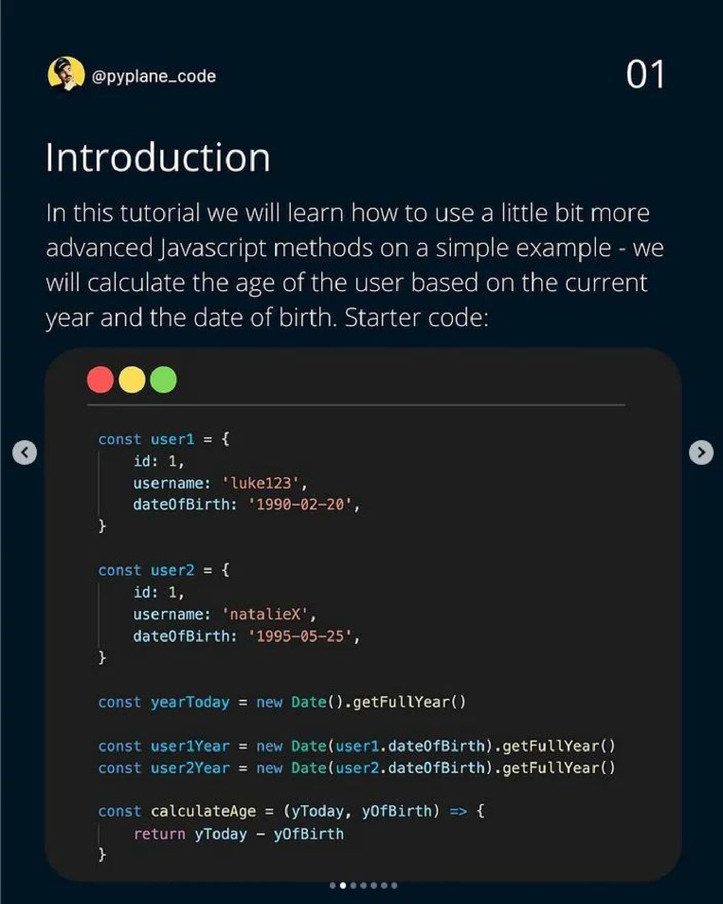
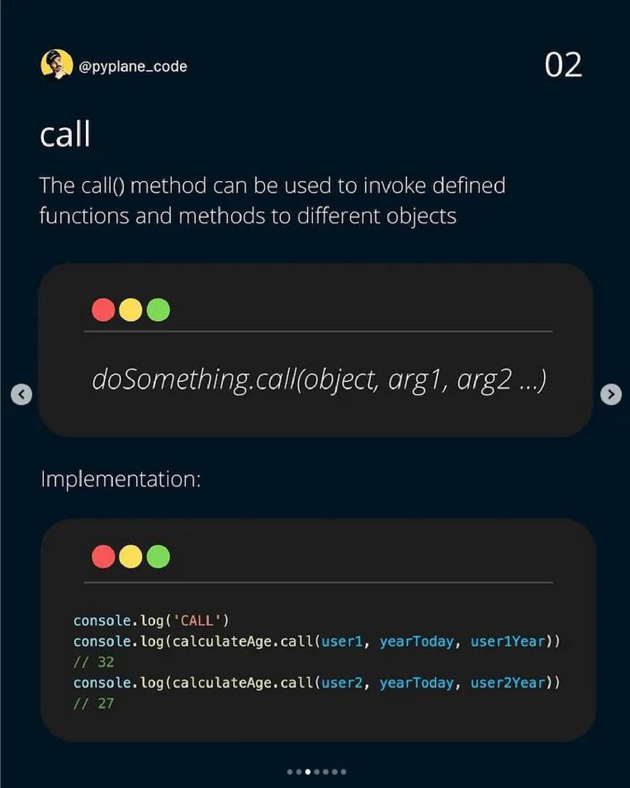
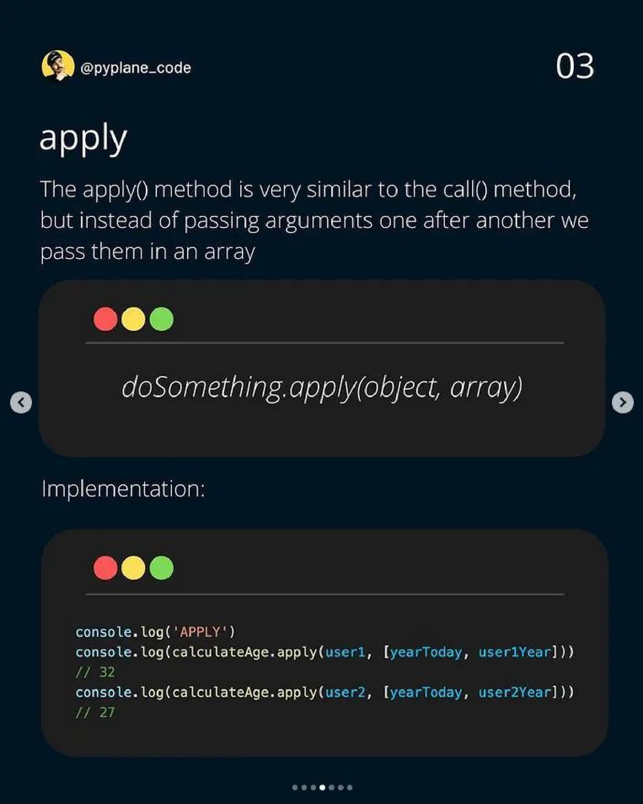
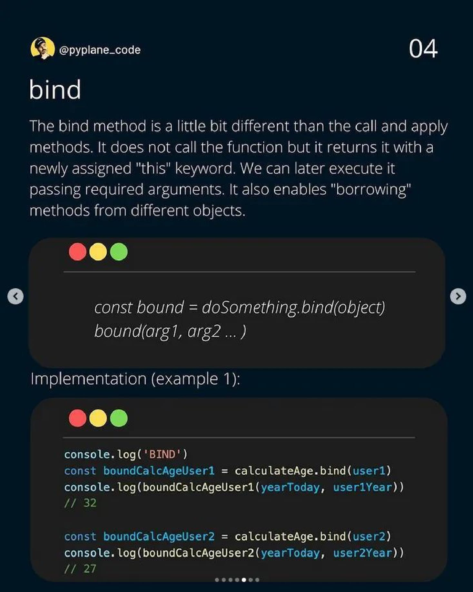
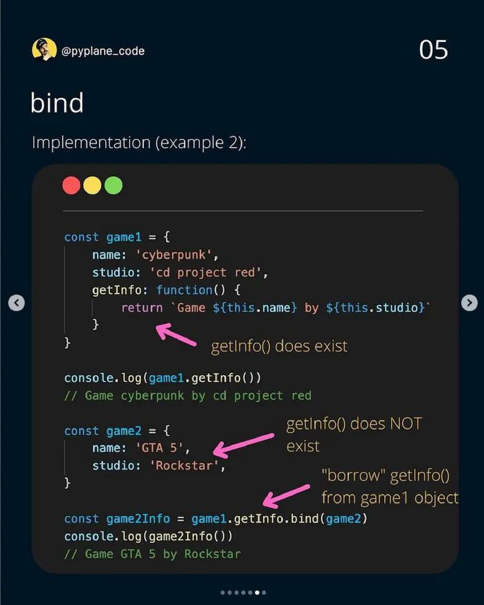

# bind method 

- this is another method which allows us to do the same thing we can do with call() , apply() methods <br>
    but `bind()` method is most important than those two methods 🔥🔥🔥

- bind() method allows an object to borrow a method from another object <br>
    without making a copy of that method. This is known as function borrowing in JavaScript ✔️

## About bind() method ✅

- `bind()` method : also allows us to manually set `this` keyword fro any method call of that object
- `difference b/w bind() method & those two methods`
    - bind() method doesn't immediately call the method . <br>
        Instead , it returns a new function where `this` keyword is bound
    - means it's set to whatever value we pass into bind() method

## Examples - of bind() method 

- Eg 1 : of bind() method
    ```js
    const lufthansa = {
        airline: 'lufthansa',
        iataCode: 'LH',
        bookings: [],
        book(flightNum, name) {
            console.log(`${name} booked a seat on ${this.airline} flight ${this.iataCode}${flightNum}`)
            this.bookings.push({ flight: `${this.iataCode}${flightNum}` , name })
        }
    }

    const eurowings = {
        airline: 'Eurowings' , 
        iataCode: 'EW' ,
        bookings: [] 
    }

    const book = lufthansa.book 
    book.call(eurowings , 23, 'Sarah Williams')

    const bookEW = book.bind(eurowings)
    console.log(bookEW)
    /* ƒ book(flightNum, name) {
            console.log(`${name} booked a seat on ${this.airline} flight ${this.iataCode}${flightNum}`)
            this.bookings.push({ flight: `${this.iataCode}${flightNum}` , name })
        }
    */
    bookEW(23, 'stephen hawking') // output : we'll get correct output
    ``` 
    - `const bookEW = book.bind(eurowings)` 
        - `book.bind(eurowings)` means 
            - bind() method will not call book() method
            - so Instead , bind() method will return a new function i.e definition/body of `book` function <br>
                where `this` keyword will always be set to `eurowings` object 💡💡💡
        - `const bookEW = book.bind(eurowings)` means 
            - now that new return function i.e definition/body of `book` function will be stored inside `bookEW` variable 
    - so here `bookEW` function is a normal function but inside of it , `this` keyword points to `eurowings` object <br>
        - so `bookEW` already has the `this` keyword & due to that , we don't need to specify `this` keyword again 💡💡💡

    - Eg 1.1 : now we go further to create one booking function for each of the airlines
        - which makes little bit easier to book a flight for each of the airlines , if we have to do it multiple times <br>
            instead of having to use a `call()` method all the time , we can just use bind() method only one time 💡💡💡
        ```js
        const bookEW = book.bind(eurowings) // already made in above code 
        const bookLH = book.bind(lufthansa)  
        const bookLX = book.bind(swiss)

        bookEW(23, "stephen hawking")
        ```

- bind() method takes two arguments 
    - `first argument` : name of the object that want to make it as current object for `this` keyword 
    - `second argument` : normal arguments that we define 
    - & each arguments will be separated by comma `,`

- Eg 2 : using bind() method to create a function for one specific airline & a specific flight number 👍
    ```js
    const lufthansa = {
        airline: 'lufthansa',
        iataCode: 'LH',
        bookings: [],
        book(flightNum, name) {
            console.log(`${name} booked a seat on ${this.airline} flight ${this.iataCode}${flightNum}`)
            this.bookings.push({ flight: `${this.iataCode}${flightNum}` , name })
        }
    }

    const eurowings = {
        name: 'Eurowings' , 
        iataCode: 'EW' ,
        bookings: [] 
    }

    const book = lufthansa.book 

    const bookEW23 = book.bind(eurowings, 23)
    bookEW23('Jonas') // output : Jonas booked a seat on undefined flight EW23 
    ```
    - here we're getting `undefined` because inside `eurowings` object , <br>
        we have to put `airline` property name not `name` property <br>
        because we're accessing `this.airline` inside `eurowings` object
    - Eg 2.1 removing the error of output 
        ```js
        const lufthansa = {
            airline: 'lufthansa',
            iataCode: 'LH',
            bookings: [],
            book(flightNum, name) {
                console.log(`${name} booked a seat on ${this.airline} flight ${this.iataCode}${flightNum}`)
                this.bookings.push({ flight: `${this.iataCode}${flightNum}` , name })
            }
        }

        const eurowings = {
            airline: 'Eurowings' , 
            iataCode: 'EW' ,
            bookings: [] 
        }

        const book = lufthansa.book 

        const bookEW23 = book.bind(eurowings, 23)
        bookEW23('Jonas') // output : Jonas booked a seat on Eurowings flight EW23 
        bookEW23('Elon') // output : Elon booked a seat on Eurowings flight EW23 
        ```
        - `const bookEW23 = book.bind(eurowings, 23)` means 
            - here we preset that `23` as first argument for `book()` method of `lufthansa` object
        - so here we define parts of all arguments of that function , <br>
            which is a common pattern called partial application 💡💡💡
        - `partial application` : means a part of all the arguments of the original function are already applied/set 
            - Eg : means defining some part of arguments of that function 
                ```js
                const bookEW23 = book.bind(eurowings, 23)
                bookEW23('Jonas') 
                bookEW23('Elon')
                ```
                - so here `23` is an argument which is already pre-defined <br>
                    & then we define another part for other arguments in next line 💡💡💡

- `Note - creating a method for an object` : 
    - when we're creating a new method (for that object) outside that object itself <br>
        then either use anonymous function or arrow function syntax 💡💡💡
    - because outside that object itself , we can't create a method for that object by using ES6 way like this 
        ```js
        lufthansa.buyPlane = () {} 
        // OR 
        lufthansa.buyPlane() {} 
        // both will give error 
        ```
    - but if we do this inside object itself then we'll not get error due to ES6 way 
    
- `handler function` means callback function which is taken by addEventListener() method <br>
    as second argument is also called handler function 

## Real Use case of bind() method 🔥

- there're also other situations in which we can use the `bind()` method <br>
    i.e when we use objects together with event listener 💡💡💡

- `first use case of bind() method ✅` 
    - Eg 1 : real use case of bind() method when we use objects together with event listener
        ```html
        <button class="buy">Buy new plane</button>
        ```
        ```js
        const lufthansa = {
            airline: 'lufthansa',
            iataCode: 'LH',
            bookings: [],
            book(flightNum, name) {
                console.log(`${name} booked a seat on ${this.airline} flight ${this.iataCode}${flightNum}`)
                this.bookings.push({ flight: `${this.iataCode}${flightNum}` , name })
            }
        }

        lufthansa.planes = 300 // consider this airline has 300 planes
        lufthansa.buyPlane = function() {
            console.log(this)

            this.planes++ // means add a new plane whenever we click on a button
            console.log(this.planes)
        }

        document.querySelector('.buy').addEventListener('click', lufthansa.buyPlane)
        /* output : <button class="buy">Buy new plane</button>
                    NaN
        */
        ```
        - here we're getting NaN because inside `addEventListener()` method , when we define `this` keyword <br>
            then `this` keyword will point to that element on which that event listener is attached to 💡💡💡
            - that's why we got that `button` as a output 
            - so `addEventListener()` is calling that `lufthansa.buyPlane` <br>
                that's why `this` keyword becomes that `button` element 💡💡💡
        - so to solve this problem we need to manually define `this` keyword , so now should we use call() or bind() method
            - so we don't need call() method because we want to pass a function , <br>
                we don't want to call it means call() method calls the function 💡💡💡
            - so therefore , we'll use bind() method because it'll return a new function 💡💡💡
        - Eg 1.1 : using bind() method to remove the error 
            ```js
            document.querySelector('.buy').addEventListener('click', lufthansa.buyPlane.bind(lufthansa))
            /* output : after clicking on a button
                {
                    airline: 'lufthansa', 
                    iataCode: 'LH', 
                    bookings: Array(0), 
                    planes: 300, 
                    book: ƒ, 
                    buyPlane: ƒ (), 
                    planes: 301
                }

                301
            */
            // if we click on that button again & again then number of planes will increase
            ```
        - so to know about how `this` keyword pointing to that object <br>
            then we should know difference b/w first-class & higher-order function

- `second use case of bind() method ✅` : i.e partial application
    - in partial application , most of the time we don't use `this` keyword <br>
        but still we use `bind()` method for `this` keyword 
    - `partial application` means that we can preset/pre-define parameters 💡💡💡
    - Eg 1 : of partial application with bind() method
        ```js
        const addTax = (rate, value) => value + value * rate

        // tax rate is 10% & the value is 100
        console.log(0.1, 200) // output : 220
        ```
    - but assume that there's a one tax in our code base , that we use all the time , so create a function for it 
    - Eg 2 : of partial application with bind() method to preset one of the argument always which we need always 
        ```js
        const addTax = (rate, value) => value + value * rate

        // we can use bind() method on -> addTax function & preset or pre-defined the rate always
            // so rate parameter -> always be set as 23% by-default 💡💡💡

        // here inside addTax() function there's no this keyword & we don't want this -> keyword also 
            // so inside bind() method we'll pass null as first argument 💡💡💡
            // & here we preset/pre-defined the value of rate parameter 
                // due to this we don't need to define 0.23 as a argument again & again 💡💡💡
        const addVAT = addTax.bind(null, 0.23) 

        console.log(addVAT(100)) // output : 123
        ```
        - `const addVAT = addTax.bind(null, 0.23)` means doing like this `addVAT = value => value + value * 0.23`
        - `Note for partial application use case of bind() method ✅` 
            - order/sequence of arguments is important 
            - means if we want to preset/pre-define the argument value for `rate` parameter <br>  
                then `rate` should be the first argument in that addTax() function 💡💡💡
            - otherwise we'll not get correct output 

## challenge time 

- `Ques` : make this code base into closure concept 
    ```js
    const addTax = (rate, value) => value + value * rate

    const addVAT = addTax.bind(null, 0.23) 
    console.log(addVAT(100))
    ```
- `Ans` : converting this above code into closure concept 
    ```js
    // outer/parent function
    function addTax(rate) {

        // inner/child function
        return function(value) {
            return value + value * rate
        }
    }

    const addVAT = addTax(0.23)
    console.log(addVAT(100)) // output : 123
    console.log(addVAT(23)) // output : 28.29
    ```

## Extra Notes - call() , apply() & bind() methods

<table><tr><td width="500px" valign="top">


</td>
<td width="500px" valign="top">



</td></tr></table>

<table><tr><td width="500px" valign="top">



</td>
<td width="500px" valign="top">



</td></tr></table>

<table><tr><td width="500px" valign="top">



</td>
<td width="500px" valign="top">

#### bind() is Most Important method than call() & apply() methods 🔥🔥🔥



</td></tr></table>
