# Closures

- execution context , call stack & scope chain - are used by closure
- so a `closure` simply happens automatically in certain situations , we just need to recognize those situations ✔️✔️✔️
    - here so we'll see those situations 
- closure is most important 🔥🔥🔥 topic which is used all the time in JS & many times , <br>
    even without us realizing that closure are happening ✔️✔️✔️

## Examples - of closure

- Eg 1 : of closure 
    ```js
    const secureBooking = function() {
        // Note : here we created a local variable instead of parameter of this function 
            // because we don't want to change this variable globally 💡💡💡
        let passengerCount = 0 

        return function() {
            passengerCount++
            console.log(`${passengerCount} passengers`)
        }
    }

    const booker = secureBooking()
    ```
    - so here `secureBooking` function will return a brand new function & that new function will stored inside `booker` variable 
        - & due to this `booker` variable become a function because it holds the function value/body/definition <br>
            that's why we can call `booker` variable as a function

## Explanation of closure concept ✅ 

- `explanation PART 1 - of this code`
    ```js
    const secureBooking = function() {
        let passengerCount = 0 

        return function() {
            passengerCount++
            console.log(`${passengerCount} passengers`)
        }
    }

    const booker = secureBooking()
    ```
    - `STEP 1` : our code is running in the global execution context 
        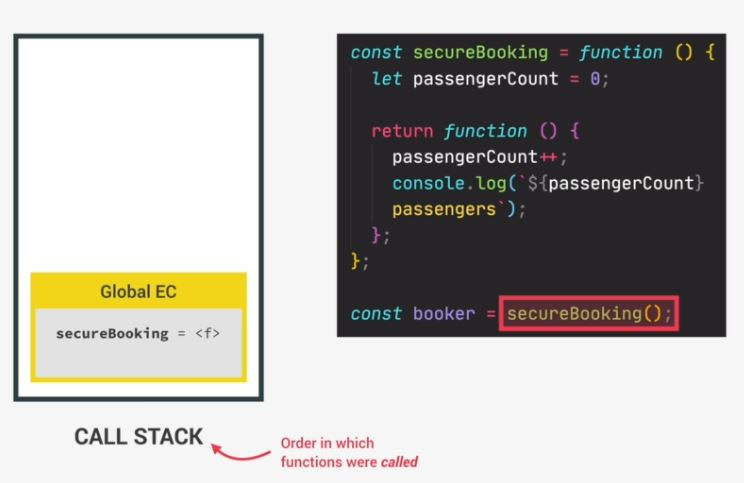
        - & in global execution context , currently we have only `secureBooking` function <br>
            so when `secureBooking` function will be executed 
    - `STEP 2` : then inside call stack , a new execution context is created on top of the execution stack like this   
        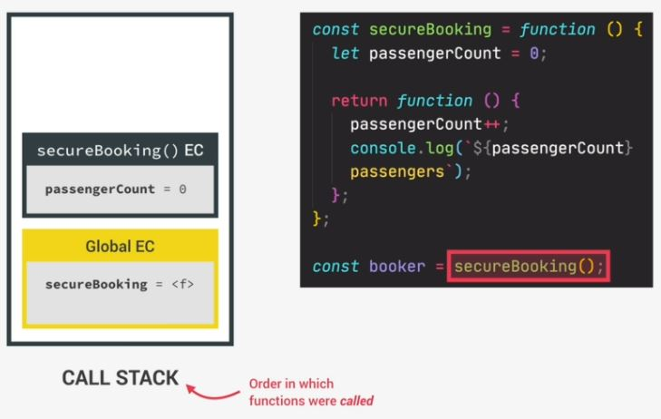
        - now remember , each execution context has a variable environment which contains all it's local variables 💡💡💡 <br>
            in this case , it only contains the `passengerCount = 0` like this 
            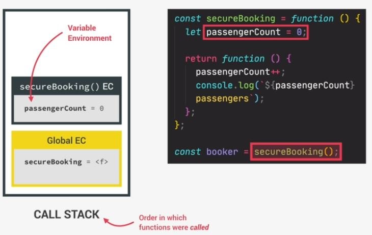
        - that variable environment of secureBooking() function is also the `scope` of secureBooking() function
    - `STEP 3` : & so the scope chain of this execution context looks like this 
        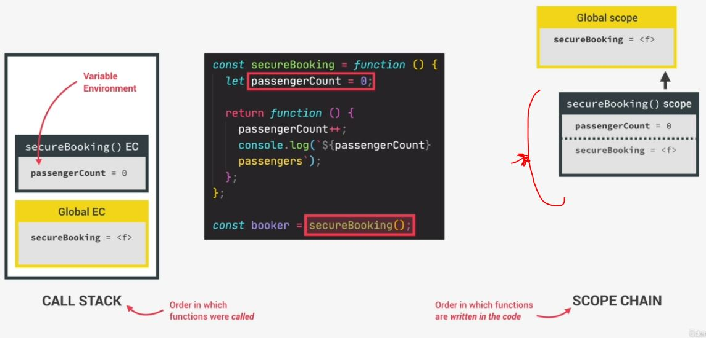
        - so `passengerCount` variable is inside the local scope of secureBooking() function <br>
            but this variable/scope also get's access to all variables of the parent's scopes <br>
            & in this case , parent's scopes is a global scope
    - `STEP 4` : now in the next line of the secure booking function , 
        - a new function is returned & it'll be stored in `booker` variable 
        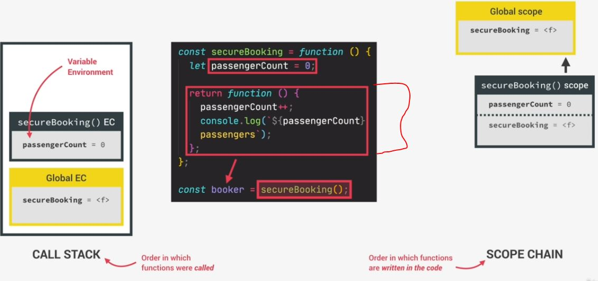
        - so now the global execution context also contains that `booker` variable like this 
        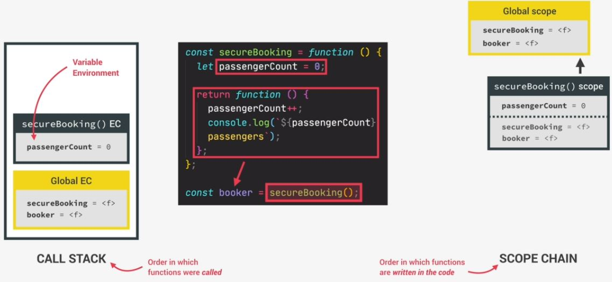
    - `STEP 5` : now work of secureBooking() function is completed , so it's execution context pop out from the stack like this 
        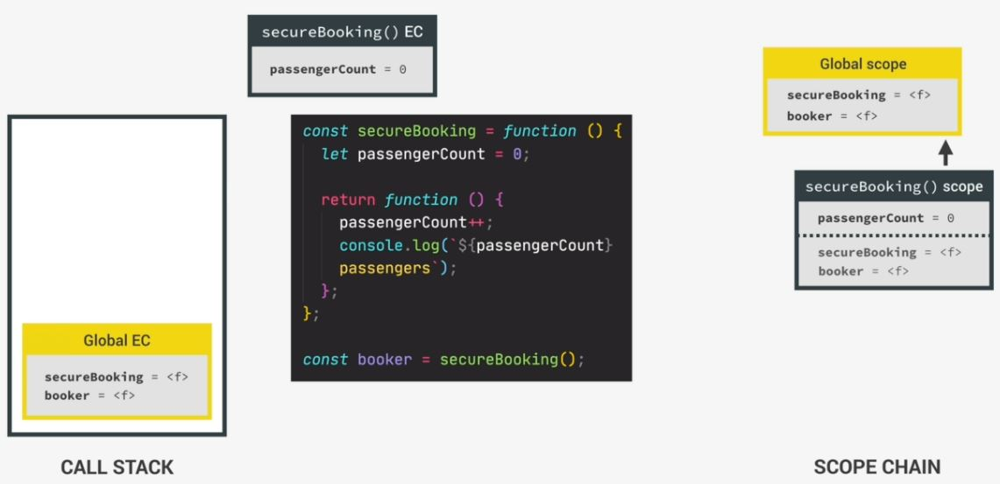
        - so secureBooking() function has done it's job & has now finished execution 💡💡💡

- `now understanding the closure` : in that code base
    ```js
    const secureBooking = function() {
        let passengerCount = 0 

        return function() {
            passengerCount++
            console.log(`${passengerCount} passengers`)
        }
    }

    const booker = secureBooking()

    // it doesn't need any arguments because we didn't define parameters in that function body/definition
    booker() // output : 1 passengers
    booker() // output : 2 passengers
    booker() // output : 3 passengers
    ```
    - Now Question comes in mind that 
        - here we can see that we're even able to increment the `passengerCount` variable , so how is this even possible <br>
            means how can the `booker` function can update the `passengerCount` variable <br>
            which is defined only inside secureBooking() function <br>
        - & secureBooking() function has already finished it's job/work <br>
            means it's execution context is no longer inside the call stack <br>
            but still that inner function i.e returning a new function is still able to access the `passengerCount` variable 
            so all this happened due to closure
        - means `booker` is a normal function in the global environment/scope  <br>
            & the environment in which the function was created i.e environment of `secureBooking` function is no longer active <br>
            & it's environment pop out from the call stack . But still the `booker` function somehow continues to have access <br>
            of that `passengerCount` variable which was present at the time when secureBooking() function was created
            
    - `what closure does ✅` : so that's exactly what the closure does means we can say that a closure makes a function <br>
        remember all the variables that existed at that function's birthplace 💡💡💡 
    - so we can imagine the `secureBooking` function as being the birthplace of that inner function i.e `return function() {}` <br>
        so that `return function() {}` remembers everything at it's birthplace when it was created
    
- `explanation PART 2 - of this code ✅` : understanding the code when booker() function is called
    ```js
    const secureBooking = function() {
        let passengerCount = 0 

        return function() {
            passengerCount++
            console.log(`${passengerCount} passengers`)
        }
    }

    const booker = secureBooking()

    booker() // output : 1 passengers
    booker() // output : 2 passengers
    booker() // output : 3 passengers
    ```
    - now execution context of secureBooking() function is gone/remove from the call stack <br>
        now the booker() function is in the global scope like this  
        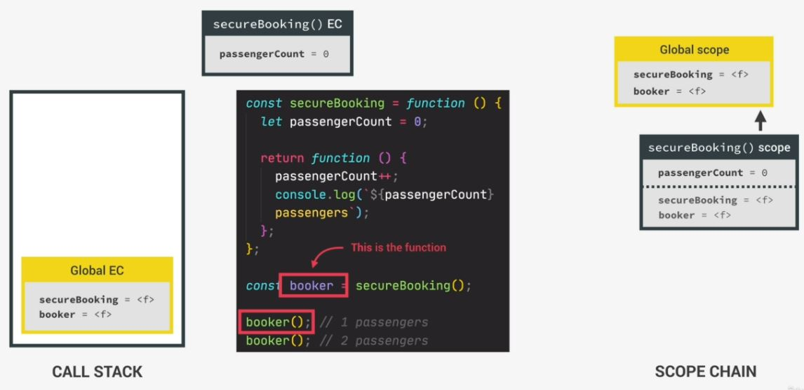
    - `STEP 1` : now when the booker() function is called then a new execution context is created of booker() function 
        - & put on top of the call stack
        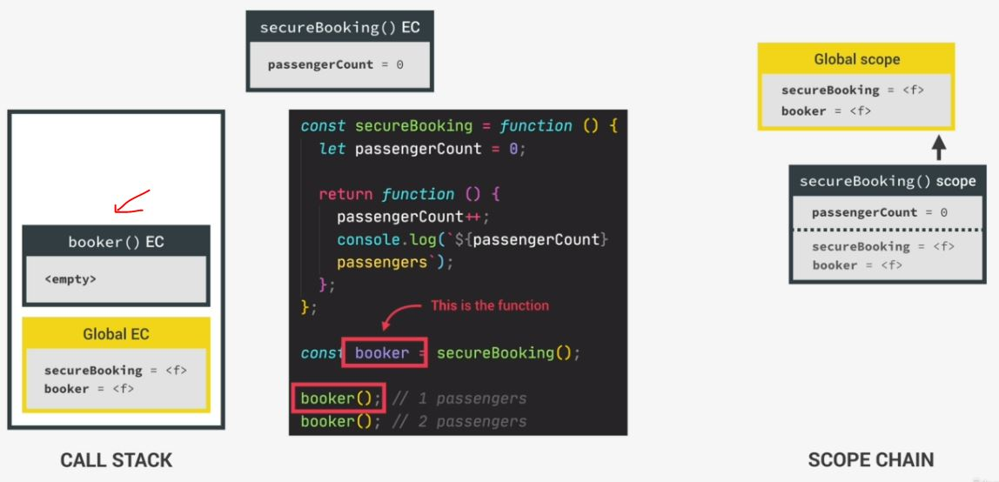
        - & the variable environment of this booker() function execution context is empty <br> 
            because there's no variables declared in that inner function
    - now what about scope chain , so since booker() function is in the global context <br>
        means it's simply a child's scope of the global scope like this 
        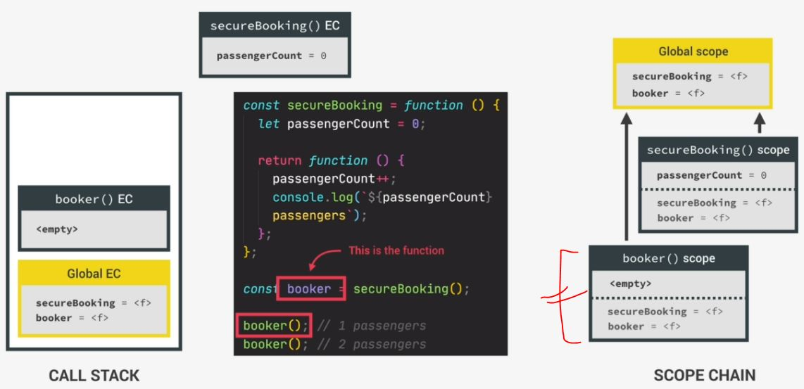
    - now question comes that how will the booker() function access the `passengerCount` variable ? <br>
        because that variable is not found in the scope chain. So here comes the secret of the closure
    - `STEP 2 ✅` : what is closure + how that variable is able to access by booker() function
        - `the secret of the closure` is any function always has access to the variable environment <br>
            of that execution context in which that function was created even after that execution context is gone 💡💡💡
        - so in the case of booker() function , it was created/born in the execution context of secureBooking() function <br>
            which was popped off the stack perviously 💡💡💡
        - that's why , the booker() function will get access of that variable environment <br>
            which contains the `passengerCount` variable i.e `passengerCount = 0` like this  
            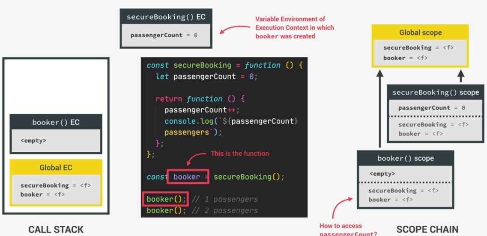
            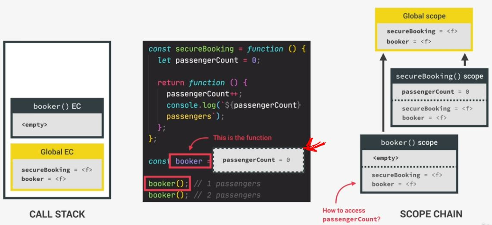
            - & this is how the function i.e booker() will be able to read & manipulate the `passengerCount` variable
            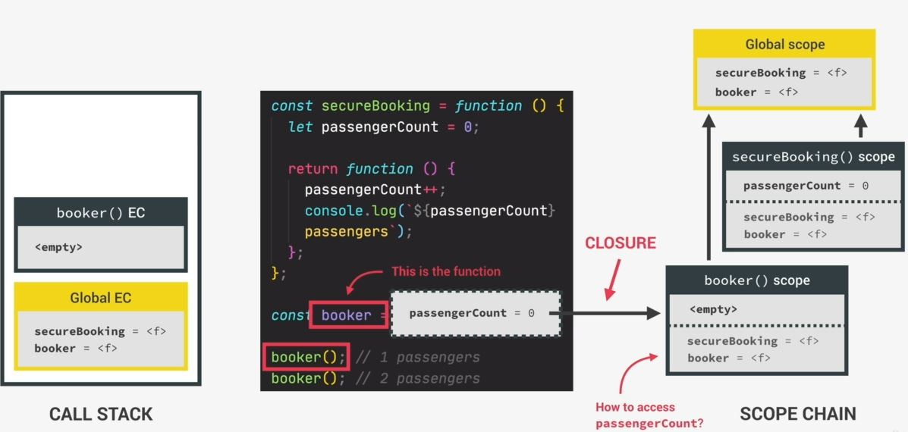
        - & this connection we say closure 
        
- `Summary of closure mechanism`
    - A function has access to the variable environment (VE) of the execution context in which is created
    - `Closure` : VE attached of that function , exactly as it was the time & place the function was created 
    - so `booker()` function has access to the `passengerCount` variable because this variable is defined in the scope <br>
        in which the booker() function was actually created means the scope chain is actually preserved through the closure , <br>
        even when a scope has already been destroyed because it's execution context is gone 💡💡💡
        - means even though the execution context has actually been destroyed , <br>
            but the variable environment somehow keeps living somewhere in the JS engine 💡💡💡

- `explanation PART 3 - of this code ✅` : about booker() function working
    ```js
    const secureBooking = function() {
        let passengerCount = 0 

        return function() {
            passengerCount++
            console.log(`${passengerCount} passengers`)
        }
    }

    const booker = secureBooking()

    booker() // output : 1 passengers
    booker() // output : 2 passengers
    booker() // output : 3 passengers
    ```
    - now we can say that the `booker()` function closed over it's parents scope or over it's parent variable environment <br>
        & due to this , that includes all function arguments even though in this example , we don't have any
    - & `passengerCount` variable is attached or closed over variable environment stays with function forever <br>
        & that function will carry around & able to use that variable forever 💡💡💡
    - means due to closure , a function doesn't lose connection to variables (which existed at the function's birthplace) 💡💡💡
    
- `explanation PART 4 - of this code ✅` : execution of the booker() function when it increment passenger count
    ```js
    const secureBooking = function() {
        let passengerCount = 0 

        return function() {
            passengerCount++
            console.log(`${passengerCount} passengers`)
        }
    }

    const booker = secureBooking()

    booker() // output : 1 passengers
    booker() // output : 2 passengers
    booker() // output : 3 passengers
    ```
    - `STEP 1` : so booker() function attempts to increase the `passengerCount` variable 
        - however , this variable is not in the current scope i.e inside booker() function
    - `STEP 2` : so JS will immediately look into the closure & see if it can find the variable there 
        - & JS does this even before looking at the scope chain 
        - Eg : if there was global `passengerCount` variable set to 10 then JS would still first use that <br> 
            which is present in the closure. so the closure has priority over the scope chain 💡💡💡
    - `STEP 3` : so after running this booker() function , the `passengerCount` variable becomes `1` & this message is printed
        - then `booker()` will popped out from the call stack like this
            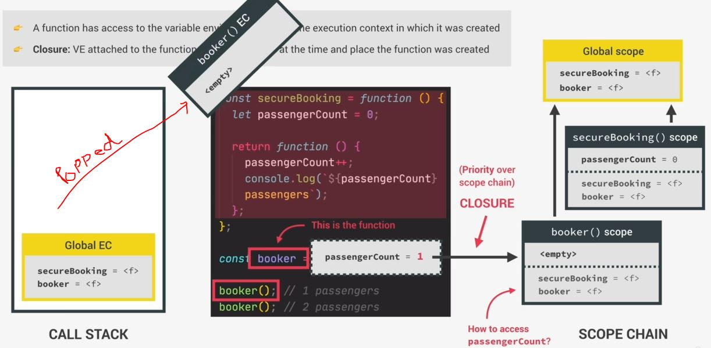
    - `STEP 4` : then execution moves to next line then like this 
        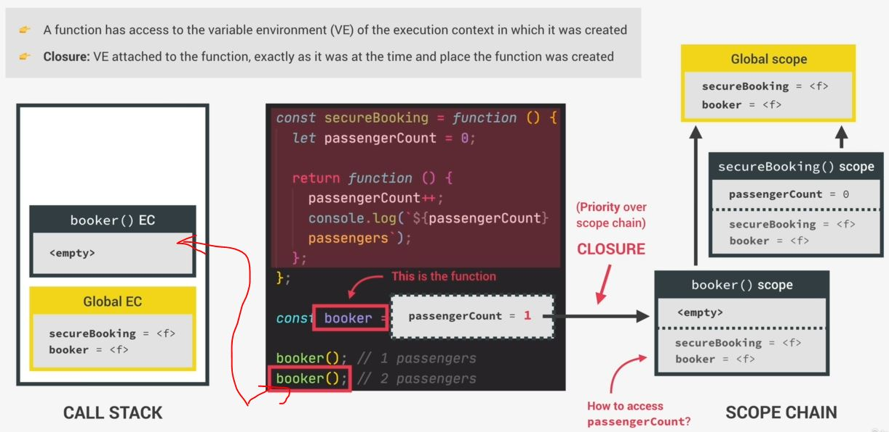
        - & in call stack , we'll get a new execution context of booker() function <br>
            & that closure is still there means still attached to the function & the value is still `1`
        - now this booker() function will executes increasing the value of `passengerCount` variable by `2` & print the message

## Summary - closure

- `Definition 1` : A closure is the closed-over variable environment of the execution context in which a function was created , <br>
    even after that execution context is gone or in other words , <br>
    even after the function to which the execution context belongs has returned

- `Definition 2` : A closure gives a function access to all the variables of it's parent function , even after <br>
    that parent function has returned. The function keeps a reference to it's outer scope , <br>
    which preserves the scope chain throughout time . Even after that outer scope is gone

- `Definition 3` : of closure in analogy way
    - A closure makes sure that a function doesn't lose connection to variables that existed at the function's birth place 💡💡💡 <br>
        a closure remembers the variables, even after the birthplace is gone
    - it's like a person who doesn't lose connection to their hometown like in this picture <br>
        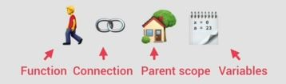
    
- `more visual Definition 4` : some people think like this attached variable environment as a backpack
    - A closure is like backpack that a function carries around wherever it goes. <br>
        this backpack contains all the variables that were present in the environment where the function was created 💡💡💡 <br>
        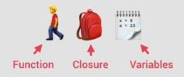
        - so whenever a variable can't be found in the function scope, JS will look into the backpack <br>
            & take the missing variable from there

- `Note of closure ✅` : 
    - `1` : we don't have to manually create closures means JS does completely automatically 
    - `2` : there's no way that we can access explicitly closure over variables 
        - because closures are not like a tangible thing means they're not like an object <br>
            so we can't just reach into a closure & take variables from it That's impossible <br>
            because a closure is just an internal property of a function 💡💡💡
        - we can observe that a closure happens because functions magically keep having access <br>
            to variables that should no longer exist . But we can't directly access these variables <br>
            However , we can do is to actually take a look at this internal property means inside the backpack 

- `taking a look inside closure property of a function ✅`
    ```js
    const secureBooking = function() {
        let passengerCount = 0 

        return function() {
            passengerCount++
            console.log(`${passengerCount} passengers`)
        }
    }

    const booker = secureBooking()
    console.dir(booker)
    // output : f anonymous()
    ```
    - so here we get booker() function body/definition
    - so when we open this output , then we'll see `[[scopes]]` property <br>
        `[[scopes]]` property : means the variable environment of the booker() function 💡💡💡
    - so inside `[[scopes]]` property , we can see Closure (which is coming from secureBooking function) <br>
        & inside `Closure (secureBooking)` we can see `passengerCount : 3` like this <br>
        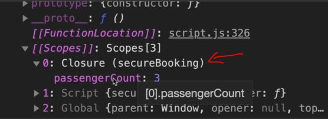
        - so this closure is the variable environment of that secureBooking() function <br>
            so secureBooking() function is used to preserved by this closure 💡💡💡

- `Note` : whenever we see double square bracket like this `[[scopes]]` then means it's a internal property
    - which we can't access from our code 
